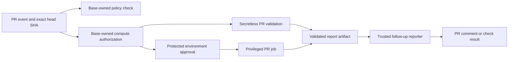

# Pull request CI architecture

This document explains how this repository runs pull request (PR) code in CI. It describes the workflow design in the repository. GitHub protection rules, secrets, cloud permissions, registries, and runner configuration are managed outside the repository and must be verified separately.

## Trust boundaries

PR code is untrusted, including build scripts, tests, dependencies, and configuration. The CI design keeps decisions that grant compute or privileges in code from the target branch and binds each run to the PR head repository and commit SHA.

- **Policy check.** [PR CI policy](workflows/pr-ci-policy.yaml) runs from `pull_request_target`. It reads proposed workflow files through the GitHub API as data; it does not execute them. Its [manifest](ci/pr-ci-policy.json) identifies protected workflows and policy runtime paths. A failing policy job blocks merge only when branch protection or a ruleset requires its `Validate workflow privilege changes` check.
- **Compute authorization.** Expensive PR workflows use the [compute authorization action](actions/compute-authorized/action.yml). It checks that the required label is still present and that its latest application came from a collaborator with `write` or `admin` permission. The label remains effective across later pushes while it stays on the PR. It is permission to start eligible compute, not approval for a particular SHA to use credentials.
- **Exact source.** Workflows pass the PR head repository and SHA to jobs that run PR code. The [checkout action](actions/checkout-exact-pr-source/action.yml) verifies that checkout. In privileged PR jobs, local actions are loaded from a separate trusted checkout before PR code runs. An exact SHA identifies the code being run; it does not make that code safe.
- **Secretless validation.** PR jobs that do not need protected capabilities run with read-only `GITHUB_TOKEN` permissions and without supplied privileged credentials. Examples include MonoMove benchmarks, execution performance, local Docker builds, indexer configuration checks, Forge lookup unit tests, module verification, and optional faucet and Rust SDK tests. These jobs still consume runner resources and can access capabilities available to their runner and Actions event.
- **Privileged execution.** Jobs that need cloud authentication, secrets, OIDC, or repository writes use the fixed `privileged-pr-ci` environment. Examples include PR image publication, Forge runs, indexer generation and dispatch, and the live Forge image lookup. Environment approval authorizes a job with its available privileges for that run. PR code can use those privileges after approval. The environment must therefore have real protection rules, and the runner and publication targets must be isolated from trusted work.
- **Trusted reporting.** PR producers write bounded report artifacts or job results. Separate [MonoMove](workflows/pr-ci-report.yaml) and [Docker/Forge](workflows/docker-forge-pr-report.yaml) reporters validate the originating run and source SHA before posting PR comments. The PR job does not receive comment write permission just to publish its result.

## Developer flow

| Work | How it starts | What happens after a new push |
| --- | --- | --- |
| MonoMove benchmarks | Apply `mono-move-e2e-perf` or `mono-move`. | The label is checked again; eligible secretless work reruns for the new head SHA. A trusted reporter posts the PR result after the run. |
| Execution performance | Apply `CICD:run-e2e-tests`, `CICD:run-execution-performance-test`, or `CICD:run-execution-performance-full-test`. | The selected test flow reruns for the new head SHA. Auto-merge alone does not select it. |
| Docker and PR Forge | Apply the relevant `CICD:*` build or test label. The [capability manifest](ci/docker-capabilities.json) maps labels to work. | Secretless local builds run first. Jobs that publish images or run protected tests wait for a new environment approval. Auto-merge alone does not select them. |
| Indexer processor tests | Change a matching indexer path and apply `CICD:run-indexer-processor-tests`. | Validation reruns for the new head SHA. Live generation and downstream dispatch wait for environment approval. |
| Module verify, Forge lookup unit tests, optional faucet and Rust SDK tests | Their workflow path filters or existing optional label apply. | Their PR jobs rerun without a new developer action when their trigger conditions match. |

Manual and trusted push workflows remain separate from PR-controlled execution. For example, [trusted Docker builds](workflows/docker-build-test-trusted.yaml) handle push and manual runs, while [Ad-hoc Forge](workflows/adhoc-forge.yaml) runs on manual dispatch.

## Coverage and deployment boundary

The policy manifest covers the first migration wave. Other legacy `pull_request_target` workflows and older target branches can have different protections. A successful policy check does not prove that the live environment, merge rules, cloud IAM, runner isolation, or registry permissions match this design. Those controls must be checked in their respective services before protected PR work is enabled.
