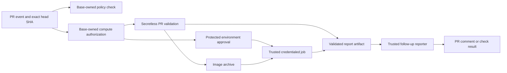

# Pull request CI architecture

This document explains how pull request (PR) code runs in CI in this repository. It covers only what the workflow files define. GitHub protection rules, secrets, cloud permissions, registries, and runner configuration live outside the repository, so check them separately.

## Trust boundaries

All PR code is untrusted: build scripts, tests, dependencies, and configuration. Every decision that grants compute or privileges comes from code on the target branch. Each run is bound to the PR head repository and commit SHA.

### Policy check

[PR CI policy](workflows/pr-ci-policy.yaml) runs on `pull_request_target`. It fetches the proposed workflow files through the GitHub API and reads them as data. It never executes them. Its [manifest](ci/pr-ci-policy.json) lists protected workflows and protected runtime paths. The protected runtime paths are the policy code plus the base-checkout files that privileged jobs run: Forge scripts, the controller image build files, Helm charts, and the indexer generator source. If a PR changes a protected path, the check fails and the PR needs an admin bypass.

Privileged jobs also load some code that the manifest does not protect. Code review is the only merge gate for:

- The Forge Rust crates, `aptos-move/framework/`, and `aptos-move/aptos-release-builder/`. All of these are built into the Forge controller image.
- Workspace Cargo files.
- New Python modules in `testsuite/`. Forge scripts import from that directory first, so a new module can shadow an existing import.
- A `forge-test-runner-template.yaml` at the repository root. `forge.py` prefers it over the protected copy in `testsuite/`.

This code reaches credentials only after merge and environment approval.

A failing policy job blocks merge only if branch protection or a ruleset requires its `Validate workflow privilege changes` check.

### Compute authorization

Expensive PR workflows call the [compute authorization action](actions/compute-authorized/action.yml). The action checks that the required label is still on the PR, and that the most recent application of the label came from a collaborator with `write` or `admin` permission. The label stays in effect across later pushes for as long as it stays on the PR. So the label lets a PR start eligible compute. It does not approve any specific SHA to use credentials.

### Exact source

Workflows pass the PR head repository and SHA to each job that runs PR code. The [checkout action](actions/checkout-exact-pr-source/action.yml) verifies that the checkout matches them. The SHA check confirms only which code runs. That code is still untrusted. Credentialed jobs for image publication, Forge, E2E image preparation, and live lookup load code only from the trusted base checkout.

Under `pull_request_target`, `actions/checkout` refuses to check out fork PR code unless `allow-unsafe-pr-checkout` is set. The exact-source action and the execution benchmark checkout both set it, so label-gated work can run on fork PRs. This is an accepted risk. Once a fork PR has the label, every later push from the fork author runs on the selected runners with no new approval.

### Secretless validation

PR jobs that need no protected capabilities run with a read-only `GITHUB_TOKEN` and get no privileged credentials. These include MonoMove benchmarks, execution performance, local Docker builds, indexer configuration checks, Forge lookup unit tests, module verification, and the optional faucet and Rust SDK tests. They still use runner resources, and they can use whatever capabilities their runner and Actions event provide.

The Actions cache needs care. Under `pull_request_target`, GitHub gives runs read-only access to the base branch's cache by default. A called workflow can ask for write access unless its caller sets a limit, so PR jobs that call reusable workflows set `cache-mode: read`. If a workflow set `cache-mode: write`, PR code could write cache entries that trusted workflows later restore. The policy check reports that change.

### Privileged execution

Jobs that need cloud authentication, secrets, OIDC, or repository writes use the fixed `privileged-pr-ci` environment. Examples are PR image publication, Forge runs, indexer generation and dispatch, and the live Forge image lookup. Environment approval lets a job use the privileges available to it, for that run only.

For image publication, Forge, E2E, and live lookup, only trusted orchestration gets those privileges. PR builds and E2E tests run in separate jobs with no cloud credentials and no OIDC permission. Other protected flows need their own review of where the execution boundary sits.

The environment must have real protection rules. Runners and publication targets must be isolated from trusted work.

### Trusted reporting

PR producers write bounded report artifacts or job results. Two separate reporters, one for [MonoMove](workflows/pr-ci-report.yaml) and one for [Docker/Forge](workflows/docker-forge-pr-report.yaml), check the originating run and source SHA before they post PR comments. The PR job does not get comment write permission just to publish its result.

## Developer flow

| Work | How it starts | What happens after a new push |
| --- | --- | --- |
| MonoMove benchmarks | Apply `mono-move-e2e-perf` or `mono-move`. | The label is checked again, and eligible secretless work reruns for the new head SHA. After the run, a trusted reporter posts the result on the PR. |
| Execution performance | Apply `CICD:run-e2e-tests`, `CICD:run-execution-performance-test`, or `CICD:run-execution-performance-full-test`. | The selected test flow reruns for the new head SHA. Auto-merge alone does not select it. |
| Docker and PR Forge | Apply the relevant `CICD:*` build or test label. The [capability manifest](ci/docker-capabilities.json) maps labels to work. | Secretless local builds run for variants that are not published. Jobs that publish images or run protected tests wait for a new environment approval. While protected runners are disabled, checks for requested protected tests fail. Auto-merge alone does not select them. |
| Indexer processor tests | Change a matching indexer path and apply `CICD:run-indexer-processor-tests`. | Validation reruns for the new head SHA. Live generation and downstream dispatch wait for environment approval. |
| Module verify, Forge lookup unit tests, optional faucet and Rust SDK tests | Their workflow path filters or existing optional label apply. | Their PR jobs rerun with no new developer action when their trigger conditions match. |

Manual and trusted push workflows stay separate from PR-controlled execution. [Trusted Docker builds](workflows/docker-build-test-trusted.yaml) handle push and manual runs, and [Ad-hoc Forge](workflows/adhoc-forge.yaml) runs on manual dispatch.

## Protected image builds and test runners

The Docker capability plan takes the union of two sets: image variants explicitly requested for publication, and image variants that active tests need.

When protected runners are enabled, each requested variant compiles once. A published variant compiles only in the credential-free protected build job. The secretless local job builds only the variants that are not published, and publication does not wait for it. Forge and E2E never compile images. They wait for publication to succeed.

When protected runners are disabled, the local job builds the requested local variants and nothing is published. `rust-images` then reflects only the local build. Required checks for requested E2E or Forge workloads fail, because those tests cannot run.

| Protected work | RunsOn Fleet | Pilot size | Concurrency ceiling |
| --- | --- | --- | --- |
| Image compilation and publication | `aptos-protected-build` | 32 vCPU / 128 GiB; compare with 64 / 256 | 4 |
| Forge Kubernetes controller | `aptos-protected-forge` | 4 vCPU / 16 GiB | 6 |
| API, CLI and faucet tests | `aptos-protected-e2e` | 8 vCPU / 32 GiB; compare with 4 / 16 | 2 |

These fleets use the `protected` RunsOn environment and the `aptos-core-protected` GitHub runner group. The group allows only the three protected reusable workflows, and only at the trusted default-branch ref. Each job gets a fresh VM and disk. No runners wait on standby. The small GitHub-hosted lookup and dispatch jobs keep the runners they use today, and indexer generation keeps its separate build-capable runner.

The PR build job runs the exact PR source with local Docker output and no cloud authentication. It exports a fixed set of image archives. A new credentialed publication job then checks the artifact identity, filenames, archive metadata, and hashes, and uses `skopeo` to copy the images to fixed registry targets. It never runs PR scripts and never loads PR images into its Docker daemon. The hashes catch corruption. They do not make the contents of a PR image trustworthy.

The publisher also builds the Forge controller, from the exact trusted base SHA. It writes a bounded JSON manifest that ties the registry digests to both source SHAs, the PR number, variant, registry, workflow run, and build attempt. Each matrix leg outputs its own artifact ID. Consumers download the artifact by that immutable ID and validate the manifest with trusted-base code. A rerun of only the tests can reuse an earlier successful build from the same run. If an artifact is missing, an identity does not match, or publication failed or was skipped, the test checks cannot pass.

Forge uses the base branch's `run_forge.sh`, Python dependencies, and controller, with the controller pinned by digest. The controller then tests the PR application images, which are also pinned by digest. Forge never deliberately passes its AWS keys, GCP token, Kubernetes service account, multiregion kubeconfig, or Prometheus token to PR host scripts or to the PR Forge controller image. The static AWS credentials stay inside the trusted Forge job. Replacing them with a short-lived role needs a separate IAM migration.

For E2E, a new credentialed job pulls the verified PR tools image and the baseline images. A separate job loads the resulting archive and runs the PR's API, CLI, and optional faucet tests against local image aliases, with pulls disabled. Test changes in the PR still take effect. Moving credentials between steps of one job would not be enough, because PR code could leave a process or file behind that captures credentials in a later step. The split needs a fresh runner for each job, and moving the image artifacts adds transfer time and storage.

The Forge Stable live lookup is a registry health check that runs trusted-base code. Changes a PR makes to the lookup implementation run in the separate secretless unit-test workflow, which gets no live registry token.

`privileged-pr-runtime-setup` authenticates trusted orchestration and never checks out PR code. Developers apply the same labels as before. Credentialed jobs still need environment approval. The credential-free build and E2E execution jobs get no environment secrets.

Protected jobs run only when the repository variable `PROTECTED_RUNNERS_ENABLED` is `true`. Leave it unset until these checks pass: Fleet deployment, workflow access restrictions, runner lifecycle, AMI compatibility, and sizing. Protected jobs never fall back to the shared benchmark runner. The infrastructure and the rollout procedure are in `internal-ops/infra/core/runs-on-fleet`.

## Coverage and deployment boundary

The policy manifest covers only the first migration wave. Other legacy `pull_request_target` workflows, and older target branches, can have different protections. A passing policy check does not show that the live environment, merge rules, cloud IAM, runner isolation, or registry permissions match this design. Check each of those controls in its own service before you enable protected PR work. In particular, PR runners and application pods must not be able to get cloud credentials through instance metadata, workload identity, mounted service-account tokens, or shared disks. Nothing in this repository sets up those live infrastructure controls.
