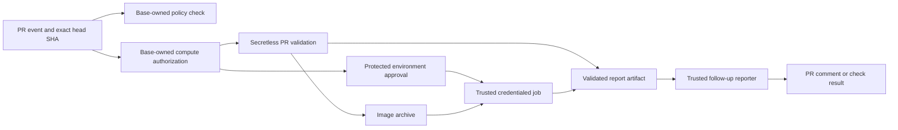

# Pull request CI architecture

This document explains how this repository runs pull request (PR) code in CI. It describes the workflow design in the repository. GitHub protection rules, secrets, cloud permissions, registries, and runner configuration are managed outside the repository and must be verified separately.

## Trust boundaries

PR code is untrusted, including build scripts, tests, dependencies, and configuration. The CI design keeps decisions that grant compute or privileges in code from the target branch and binds each run to the PR head repository and commit SHA.

- **Policy check.** [PR CI policy](workflows/pr-ci-policy.yaml) runs from `pull_request_target`. It reads proposed workflow files through the GitHub API as data; it does not execute them. Its [manifest](ci/pr-ci-policy.json) identifies protected workflows and policy runtime paths. A failing policy job blocks merge only when branch protection or a ruleset requires its `Validate workflow privilege changes` check.
- **Compute authorization.** Expensive PR workflows use the [compute authorization action](actions/compute-authorized/action.yml). It checks that the required label is still present and that its latest application came from a collaborator with `write` or `admin` permission. The label remains effective across later pushes while it stays on the PR. It is permission to start eligible compute, not approval for a particular SHA to use credentials.
- **Exact source.** Workflows pass the PR head repository and SHA to jobs that run PR code. The [checkout action](actions/checkout-exact-pr-source/action.yml) verifies that checkout. Credentialed image publication, Forge, E2E image preparation, and live lookup jobs load code only from the trusted base checkout. An exact SHA identifies the code being run; it does not make that code safe.
- **Secretless validation.** PR jobs that do not need protected capabilities run with read-only `GITHUB_TOKEN` permissions and without supplied privileged credentials. Examples include MonoMove benchmarks, execution performance, local Docker builds, indexer configuration checks, Forge lookup unit tests, module verification, and optional faucet and Rust SDK tests. These jobs still consume runner resources and can access capabilities available to their runner and Actions event.
- **Privileged execution.** Jobs that need cloud authentication, secrets, OIDC, or repository writes use the fixed `privileged-pr-ci` environment. Examples include PR image publication, Forge runs, indexer generation and dispatch, and the live Forge image lookup. Environment approval authorizes a job with its available privileges for that run. For image publication, Forge, E2E, and live lookup, approval grants privileges only to trusted orchestration. PR builds and E2E tests execute in separate jobs without cloud credentials or OIDC permission. Other protected flows require their own execution-boundary review. The environment must have real protection rules, and runners and publication targets must be isolated from trusted work.
- **Trusted reporting.** PR producers write bounded report artifacts or job results. Separate [MonoMove](workflows/pr-ci-report.yaml) and [Docker/Forge](workflows/docker-forge-pr-report.yaml) reporters validate the originating run and source SHA before posting PR comments. The PR job does not receive comment write permission just to publish its result.

## Developer flow

| Work | How it starts | What happens after a new push |
| --- | --- | --- |
| MonoMove benchmarks | Apply `mono-move-e2e-perf` or `mono-move`. | The label is checked again; eligible secretless work reruns for the new head SHA. A trusted reporter posts the PR result after the run. |
| Execution performance | Apply `CICD:run-e2e-tests`, `CICD:run-execution-performance-test`, or `CICD:run-execution-performance-full-test`. | The selected test flow reruns for the new head SHA. Auto-merge alone does not select it. |
| Docker and PR Forge | Apply the relevant `CICD:*` build or test label. The [capability manifest](ci/docker-capabilities.json) maps labels to work. | Secretless local builds run first. Jobs that publish images or run protected tests wait for a new environment approval. Auto-merge alone does not select them. |
| Indexer processor tests | Change a matching indexer path and apply `CICD:run-indexer-processor-tests`. | Validation reruns for the new head SHA. Live generation and downstream dispatch wait for environment approval. |
| Module verify, Forge lookup unit tests, optional faucet and Rust SDK tests | Their workflow path filters or existing optional label apply. | Their PR jobs rerun without a new developer action when their trigger conditions match. |

Manual and trusted push workflows remain separate from PR-controlled execution. For example, [trusted Docker builds](workflows/docker-build-test-trusted.yaml) handle push and manual runs, while [Ad-hoc Forge](workflows/adhoc-forge.yaml) runs on manual dispatch.

## Protected image builds and test runners

The Docker capability plan takes the union of explicit image publication requests and the image variants needed by active tests. Each variant is built once in a credential-free job in the publication matrix, after secretless validation. Forge and E2E wait for publication to succeed. They do not compile images.

| Protected work | RunsOn Fleet | Pilot size | Concurrency ceiling |
| --- | --- | --- | --- |
| Image compilation and publication | `aptos-protected-build` | 32 vCPU / 128 GiB; compare with 64 / 256 | 4 |
| Forge Kubernetes controller | `aptos-protected-forge` | 4 vCPU / 16 GiB | 6 |
| API, CLI and faucet tests | `aptos-protected-e2e` | 8 vCPU / 32 GiB; compare with 4 / 16 | 2 |

These fleets use the `protected` RunsOn environment and the `aptos-core-protected` GitHub runner group. The group permits only the three protected reusable workflows at the trusted default-branch ref. Each runner has a fresh VM and disk for one job, with zero standby capacity. Small GitHub-hosted lookup and dispatch jobs retain their current runners. Indexer generation retains its separate build-capable runner.

The PR build job executes the exact PR source with local Docker output and no cloud authentication. It exports fixed image archives. A fresh credentialed publication job checks the artifact identity, filenames, archive metadata, and hashes, then copies images to fixed registry targets with `skopeo`. It does not run PR scripts or load PR images into its Docker daemon. Archive hashes detect corruption; they do not make PR image contents trusted.

The publisher separately builds the Forge controller from the exact trusted base SHA. Its bounded JSON manifest binds both source SHAs, PR number, variant, registry, workflow run and build attempt to registry digests. Each matrix leg exposes a distinct artifact-ID output. Consumers download that immutable ID and validate the manifest with trusted-base code. Test-only reruns may reuse an earlier successful build from the same run. Missing artifacts, mismatched identities, and failed or skipped publication prevent successful test checks.

Forge runs the base-owned `run_forge.sh`, Python dependencies, and digest-pinned base controller. The controller tests digest-pinned PR application images. Its AWS keys, GCP token, Kubernetes service account, multiregion kubeconfig, and Prometheus token are never deliberately passed to PR host scripts or the PR Forge controller image. Static AWS credentials remain confined to the trusted Forge job; replacing them with a short-lived role requires a separate IAM migration.

E2E image preparation uses a fresh credentialed job to pull the verified PR tools image and baseline images. A separate job loads the resulting archive and runs the PR API, CLI, and optional faucet tests with local image aliases and pulls disabled. PR test changes remain active. Moving credentials between steps in one job would be insufficient because PR code could leave processes or files behind to capture later credentials. The split requires fresh runners between jobs and adds image artifact transfer time and storage.

The Forge Stable live lookup is a trusted-base registry health check. PR lookup implementation changes run in the separate secretless unit-test workflow; they do not receive a live registry token.

`privileged-pr-runtime-setup` authenticates trusted orchestration without checking out PR code. No developer labels change. Credentialed jobs still require environment approval; credential-free build and E2E execution jobs do not receive environment secrets.

Protected jobs require the repository variable `PROTECTED_RUNNERS_ENABLED` to equal `true`. It must remain unset until the Fleet deployment, workflow access restrictions, runner lifecycle, AMI compatibility and sizing checks pass. There is no fallback to the shared benchmark runner. Infrastructure and the operational rollout procedure live in `internal-ops/infra/core/runs-on-fleet`.

## Coverage and deployment boundary

The policy manifest covers the first migration wave. Other legacy `pull_request_target` workflows and older target branches can have different protections. A successful policy check does not prove that the live environment, merge rules, cloud IAM, runner isolation, or registry permissions match this design. Those controls must be checked in their respective services before protected PR work is enabled. In particular, PR runners and application pods must not obtain cloud credentials through instance metadata, workload identity, mounted service-account tokens, or shared disks. The repository changes do not establish those live infrastructure controls.
