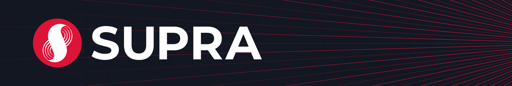

---

[Supra](https://supra.com) is a layer one blockchain with a focus on vertical integration and low latency.

This repository is adapted from [aptos-core](https://github.com/aptos-labs/aptos-core) and hosts the [Supra Move Framework](https://github.com/Entropy-Foundation/aptos-core/tree/dev/aptos-move/framework/supra-framework) and the [Supra AptosVM](https://github.com/Entropy-Foundation/aptos-core/blob/dev/aptos-move/aptos-vm/src/aptos_vm.rs). These components are essential to Supra's Move transaction lifecycle and are derived from Aptos' equivalent components, the [Aptos Move Framework](https://github.com/aptos-labs/aptos-core/tree/main/aptos-move/framework/aptos-framework) and the [AptosVM](https://github.com/aptos-labs/aptos-core/blob/main/aptos-move/aptos-vm/src/aptos_vm.rs). We sincerely thank Aptos for open-sourcing their excellent work.

We have built the remaining components of our L1 from scratch. Consequently, the code is currently closed-source, and will remain so while the implementation matures. It will be open-sourced once it has been sufficiently hardened and battle-tested.

## Getting Started

* [Supra](https://supra.com)
* [Supra Developer Docs](https://docs.supra.com/move/getting-started)
* Follow us on [Twitter](https://twitter.com/SUPRA_Labs).
* Join us on the [Supra Discord](https://discord.gg/supralabs).
