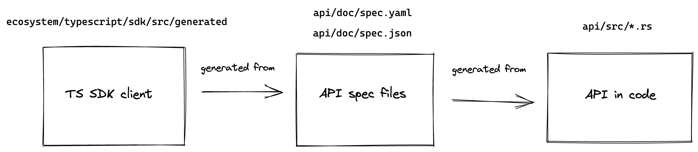

# Velor Node API

This module provides a REST API for client applications to query the Velor blockchain.

See spec source:
- [YAML in doc/spec.yaml](doc/spec.yaml).
- [JSON in doc/spec.json](doc/spec.json).
- [HTML in doc/spec.html](doc/spec.html).

## Regenerating docs / code based on API changes
With our API setup, the spec files (`api/doc/spec.yaml` / `api/doc/spec.json`) are generated from the API in code. We have CI that ensures that all of these are updated together. As such, if you want to make a change to the API, do it in this order.



This process updates the docs at:
- https://fullnode.devnet.velorlabs.com/v1/spec#/ (and testnet / mainnet, based on the API rollout schedule)

All commands here are relative to the root of `velor-core`.

1. Make your changes to the API code, i.e. the code in `api/src/`.
2. Regenerate the API spec `.yaml` and `.json` files by running these commands from the root of `velor-core`:
```
cargo run -p velor-openapi-spec-generator -- -f yaml -o api/doc/spec.yaml
cargo run -p velor-openapi-spec-generator -- -f json -o api/doc/spec.json
```

### Sanity checks
Double check that the spec looks good by running these commands and then visit http://127.0.0.1:8888/spec.html.
```
cd api/
make serve
```

