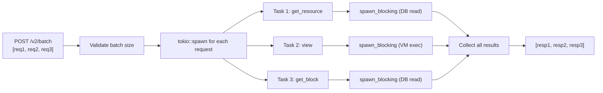

# V2 Design: JSON-RPC 2.0 Batch Endpoint

## Overview

The v2 API provides a batch endpoint at `POST /v2/batch` that accepts an array of JSON-RPC 2.0
requests and executes them concurrently. This allows clients to combine multiple read operations
(view functions, resource lookups, block queries) into a single HTTP request, reducing latency
from multiple round-trips.

---

## JSON-RPC 2.0 Protocol

We follow the [JSON-RPC 2.0 specification](https://www.jsonrpc.org/specification) for the
batch format. This is a widely adopted standard with excellent client library support.

### Request Format

```json
[
    {
        "jsonrpc": "2.0",
        "method": "get_resource",
        "params": {
            "address": "0x1",
            "resource_type": "0x1::coin::CoinStore<0x1::aptos_coin::AptosCoin>",
            "ledger_version": null
        },
        "id": 1
    },
    {
        "jsonrpc": "2.0",
        "method": "view",
        "params": {
            "function": "0x1::coin::balance",
            "type_arguments": ["0x1::aptos_coin::AptosCoin"],
            "arguments": ["0x1"]
        },
        "id": 2
    },
    {
        "jsonrpc": "2.0",
        "method": "get_block",
        "params": {
            "height": 1000,
            "with_transactions": false
        },
        "id": "block-1000"
    }
]
```

### Response Format

```json
[
    {
        "jsonrpc": "2.0",
        "result": {
            "type": "0x1::coin::CoinStore<0x1::aptos_coin::AptosCoin>",
            "data": { "coin": { "value": "100000000" } }
        },
        "id": 1
    },
    {
        "jsonrpc": "2.0",
        "result": ["100000000"],
        "id": 2
    },
    {
        "jsonrpc": "2.0",
        "result": {
            "block_height": "1000",
            "block_hash": "0xabc...",
            "first_version": "5000",
            "last_version": "5010"
        },
        "id": "block-1000"
    }
]
```

### Error Response (per-request)

```json
{
    "jsonrpc": "2.0",
    "error": {
        "code": -32602,
        "message": "Resource not found",
        "data": {
            "error_code": "RESOURCE_NOT_FOUND",
            "details": "Resource 0x1::coin::CoinStore<0x1::fake::Coin> not found at 0x1"
        }
    },
    "id": 1
}
```

---

## Supported Methods

| Method | Params | Equivalent REST Endpoint |
|---|---|---|
| `get_resource` | `{address, resource_type, ledger_version?}` | `GET /v2/accounts/:addr/resource/:type` |
| `get_resources` | `{address, cursor?, limit?, ledger_version?}` | `GET /v2/accounts/:addr/resources` |
| `view` | `{function, type_arguments, arguments, ledger_version?}` | `POST /v2/view` |
| `get_block` | `{height, with_transactions?}` | `GET /v2/blocks/:height` |
| `get_block_latest` | `{}` | `GET /v2/blocks/latest` |
| `get_transaction` | `{hash}` | `GET /v2/transactions/:hash` |
| `get_info` | `{}` | `GET /v2/info` |
| `estimate_gas_price` | `{}` | (new in v2) |

**Not supported in batch** (by design):
- `submit_transaction` -- transactions must be submitted individually for proper error handling
- WebSocket operations -- not applicable

---

## Types

```rust
// api/src/v2/batch.rs

use serde::{Deserialize, Serialize};

/// A single JSON-RPC 2.0 request within a batch.
#[derive(Debug, Deserialize)]
pub struct JsonRpcRequest {
    /// Must be "2.0".
    pub jsonrpc: String,
    /// The method to invoke.
    pub method: String,
    /// Method-specific parameters (object or array).
    #[serde(default)]
    pub params: serde_json::Value,
    /// Client-provided request ID. Can be number, string, or null.
    pub id: serde_json::Value,
}

/// A single JSON-RPC 2.0 response.
#[derive(Debug, Serialize)]
pub struct JsonRpcResponse {
    pub jsonrpc: &'static str,  // always "2.0"
    /// Present on success.
    #[serde(skip_serializing_if = "Option::is_none")]
    pub result: Option<serde_json::Value>,
    /// Present on error.
    #[serde(skip_serializing_if = "Option::is_none")]
    pub error: Option<JsonRpcError>,
    /// Echoed from the request.
    pub id: serde_json::Value,
}

#[derive(Debug, Serialize)]
pub struct JsonRpcError {
    /// JSON-RPC error code.
    /// Standard codes: -32700 (parse), -32600 (invalid), -32601 (not found),
    /// -32602 (invalid params), -32603 (internal).
    /// Application codes: -32000 to -32099.
    pub code: i32,
    /// Human-readable error message.
    pub message: String,
    /// Additional error details (our V2Error fields).
    #[serde(skip_serializing_if = "Option::is_none")]
    pub data: Option<serde_json::Value>,
}

/// Method-specific parameter types
#[derive(Debug, Deserialize)]
pub struct GetResourceParams {
    pub address: String,
    pub resource_type: String,
    pub ledger_version: Option<u64>,
}

#[derive(Debug, Deserialize)]
pub struct GetResourcesParams {
    pub address: String,
    pub cursor: Option<String>,
    pub limit: Option<u16>,
    pub ledger_version: Option<u64>,
}

#[derive(Debug, Deserialize)]
pub struct ViewParams {
    pub function: String,
    pub type_arguments: Vec<String>,
    pub arguments: Vec<serde_json::Value>,
    pub ledger_version: Option<u64>,
}

#[derive(Debug, Deserialize)]
pub struct GetBlockParams {
    pub height: u64,
    pub with_transactions: Option<bool>,
}

#[derive(Debug, Deserialize)]
pub struct GetTransactionParams {
    pub hash: String,
}
```

---

## Error Code Mapping

| JSON-RPC Code | Meaning | Maps to V2 ErrorCode |
|---|---|---|
| -32700 | Parse error | InvalidInput |
| -32600 | Invalid request | InvalidInput |
| -32601 | Method not found | MethodNotFound |
| -32602 | Invalid params | InvalidInput |
| -32603 | Internal error | InternalError |
| -32000 | Not found | NotFound, ResourceNotFound, etc. |
| -32001 | Gone (pruned) | VersionPruned, BlockPruned |
| -32002 | View function failed | ViewFunctionFailed |
| -32003 | Rate limited | RateLimited |

```rust
impl From<V2Error> for JsonRpcError {
    fn from(err: V2Error) -> Self {
        let code = match err.code {
            ErrorCode::InternalError => -32603,
            ErrorCode::InvalidInput | ErrorCode::InvalidBcsVersion => -32602,
            ErrorCode::NotFound | ErrorCode::ResourceNotFound
                | ErrorCode::TransactionNotFound | ErrorCode::BlockNotFound => -32000,
            ErrorCode::VersionPruned | ErrorCode::BlockPruned => -32001,
            ErrorCode::ViewFunctionFailed => -32002,
            ErrorCode::RateLimited | ErrorCode::BatchTooLarge => -32003,
            _ => -32603,
        };
        JsonRpcError {
            code,
            message: err.message,
            data: err.details,
        }
    }
}
```

---

## Handler Implementation

```rust
// api/src/v2/batch.rs

/// POST /v2/batch
///
/// Accepts an array of JSON-RPC 2.0 requests. Each request is dispatched
/// to the appropriate handler concurrently. Results are returned in the
/// same order as the requests.
#[utoipa::path(post, path = "/v2/batch",
    request_body = Vec<JsonRpcRequest>,
    responses(
        (status = 200, description = "Batch results"),
        (status = 400, description = "Invalid batch request"),
    ),
)]
pub async fn batch_handler(
    State(ctx): State<V2Context>,
    Json(requests): Json<Vec<JsonRpcRequest>>,
) -> Result<Json<Vec<JsonRpcResponse>>, V2Error> {
    // Validate batch size
    if requests.is_empty() {
        return Err(V2Error::bad_request(
            ErrorCode::InvalidInput,
            "Batch request must contain at least one request",
        ));
    }
    if requests.len() > ctx.v2_config.json_rpc_batch_max_size {
        return Err(V2Error::bad_request(
            ErrorCode::BatchTooLarge,
            format!(
                "Batch size {} exceeds maximum of {}",
                requests.len(),
                ctx.v2_config.json_rpc_batch_max_size
            ),
        ));
    }

    // Validate all requests have jsonrpc: "2.0"
    for req in &requests {
        if req.jsonrpc != "2.0" {
            return Err(V2Error::bad_request(
                ErrorCode::InvalidInput,
                format!("Invalid jsonrpc version: {}", req.jsonrpc),
            ));
        }
    }

    // Record batch size metric
    ctx.v2_metrics.batch_request_size
        .with_label_values(&[])
        .observe(requests.len() as f64);

    // Dispatch all requests concurrently
    let futures: Vec<_> = requests
        .into_iter()
        .map(|req| {
            let ctx = ctx.clone();
            tokio::spawn(async move { dispatch_rpc_request(ctx, req).await })
        })
        .collect();

    // Collect results in order
    let mut responses = Vec::with_capacity(futures.len());
    for future in futures {
        match future.await {
            Ok(response) => responses.push(response),
            Err(join_error) => {
                responses.push(JsonRpcResponse {
                    jsonrpc: "2.0",
                    result: None,
                    error: Some(JsonRpcError {
                        code: -32603,
                        message: format!("Internal task error: {}", join_error),
                        data: None,
                    }),
                    id: serde_json::Value::Null,
                });
            }
        }
    }

    Ok(Json(responses))
}
```

### Method Dispatch

```rust
/// Dispatch a single JSON-RPC request to the appropriate handler.
async fn dispatch_rpc_request(
    ctx: V2Context,
    req: JsonRpcRequest,
) -> JsonRpcResponse {
    let id = req.id.clone();

    let result = match req.method.as_str() {
        "get_resource" => dispatch_get_resource(ctx, req.params).await,
        "get_resources" => dispatch_get_resources(ctx, req.params).await,
        "view" => dispatch_view(ctx, req.params).await,
        "get_block" => dispatch_get_block(ctx, req.params).await,
        "get_block_latest" => dispatch_get_block_latest(ctx).await,
        "get_transaction" => dispatch_get_transaction(ctx, req.params).await,
        "get_info" => dispatch_get_info(ctx).await,
        "estimate_gas_price" => dispatch_estimate_gas(ctx).await,
        _ => Err(V2Error::bad_request(
            ErrorCode::MethodNotFound,
            format!("Unknown method: {}", req.method),
        )),
    };

    match result {
        Ok(value) => JsonRpcResponse {
            jsonrpc: "2.0",
            result: Some(value),
            error: None,
            id,
        },
        Err(err) => JsonRpcResponse {
            jsonrpc: "2.0",
            result: None,
            error: Some(JsonRpcError::from(err)),
            id,
        },
    }
}

async fn dispatch_get_resource(
    ctx: V2Context,
    params: serde_json::Value,
) -> Result<serde_json::Value, V2Error> {
    let params: GetResourceParams = serde_json::from_value(params)
        .map_err(|e| V2Error::bad_request(ErrorCode::InvalidInput, e.to_string()))?;

    // Reuse the same logic as the REST endpoint
    let ctx = ctx.clone();
    spawn_blocking(move || {
        let address = parse_address(&params.address)?;
        let tag = parse_struct_tag(&params.resource_type)?;
        let (ledger_info, version, state_view) = ctx.state_view_at(params.ledger_version)?;

        let converter = state_view.as_converter(
            ctx.inner().db.clone(),
            ctx.inner().indexer_reader.clone(),
        );

        let bytes = converter
            .find_resource(&state_view, address.into(), &tag)
            .map_err(V2Error::internal)?
            .ok_or_else(|| V2Error::not_found(
                ErrorCode::ResourceNotFound,
                format!("Resource {} not found at {}", tag, address),
            ))?;

        let resource = converter.try_into_resource(&tag, &bytes).map_err(V2Error::internal)?;
        serde_json::to_value(&resource).map_err(|e| V2Error::internal(e.into()))
    }).await
}

// Similar dispatch functions for each method...
async fn dispatch_view(ctx: V2Context, params: serde_json::Value) -> Result<serde_json::Value, V2Error> { ... }
async fn dispatch_get_block(ctx: V2Context, params: serde_json::Value) -> Result<serde_json::Value, V2Error> { ... }
async fn dispatch_get_block_latest(ctx: V2Context) -> Result<serde_json::Value, V2Error> { ... }
async fn dispatch_get_transaction(ctx: V2Context, params: serde_json::Value) -> Result<serde_json::Value, V2Error> { ... }
async fn dispatch_get_info(ctx: V2Context) -> Result<serde_json::Value, V2Error> { ... }
async fn dispatch_estimate_gas(ctx: V2Context) -> Result<serde_json::Value, V2Error> { ... }
```

---

## Code Reuse Strategy

To avoid duplicating endpoint logic between the REST handlers and the batch dispatch functions,
we extract the core business logic into shared functions:

```rust
// api/src/v2/endpoints/resources.rs

/// Core resource lookup logic, used by both REST handler and batch dispatch.
pub fn lookup_resource(
    ctx: &V2Context,
    address: AccountAddress,
    tag: &StructTag,
    ledger_version: Option<u64>,
) -> Result<(MoveResource, LedgerInfo), V2Error> {
    let (ledger_info, version, state_view) = ctx.state_view_at(ledger_version)?;
    let converter = state_view.as_converter(ctx.inner().db.clone(), ctx.inner().indexer_reader.clone());
    let bytes = converter.find_resource(&state_view, address.into(), tag)
        .map_err(V2Error::internal)?
        .ok_or_else(|| V2Error::not_found(ErrorCode::ResourceNotFound, "..."))?;
    let resource = converter.try_into_resource(tag, &bytes).map_err(V2Error::internal)?;
    Ok((resource, ledger_info))
}

// REST handler calls:
pub async fn get_resource_handler(...) -> ... {
    spawn_blocking(move || {
        let (resource, ledger_info) = lookup_resource(&ctx, address, &tag, version)?;
        Ok(Json(V2Response::new(resource, &ledger_info)))
    }).await
}

// Batch dispatch calls:
async fn dispatch_get_resource(...) -> Result<serde_json::Value, V2Error> {
    spawn_blocking(move || {
        let (resource, _ledger_info) = lookup_resource(&ctx, address, &tag, version)?;
        serde_json::to_value(&resource).map_err(...)
    }).await
}
```

---

## Concurrency Model



All requests within a batch execute concurrently:
- Each request gets its own `tokio::spawn` task
- DB reads use `spawn_blocking` to avoid blocking the async runtime
- Results are collected in order using the original index

---

## Performance Considerations

1. **Shared state view**: For batches where all requests use the same `ledger_version`,
   we could optimize by creating a single `DbStateView` and sharing it. This is a
   future optimization (requires ensuring `DbStateView` is `Send + Sync`).

2. **Connection pool**: All batch sub-requests reuse the same DB connection pool,
   so there's no overhead from creating new connections.

3. **Memory**: Each sub-request allocates its own response value. For large batches
   with big responses, this could use significant memory. The batch size limit
   (`json_rpc_batch_max_size`, default 20) bounds this.

4. **Timeout**: Individual sub-requests don't have a timeout, but the overall HTTP
   request has the server's response timeout. A single slow sub-request (e.g., a
   complex view function) delays the entire batch response.
