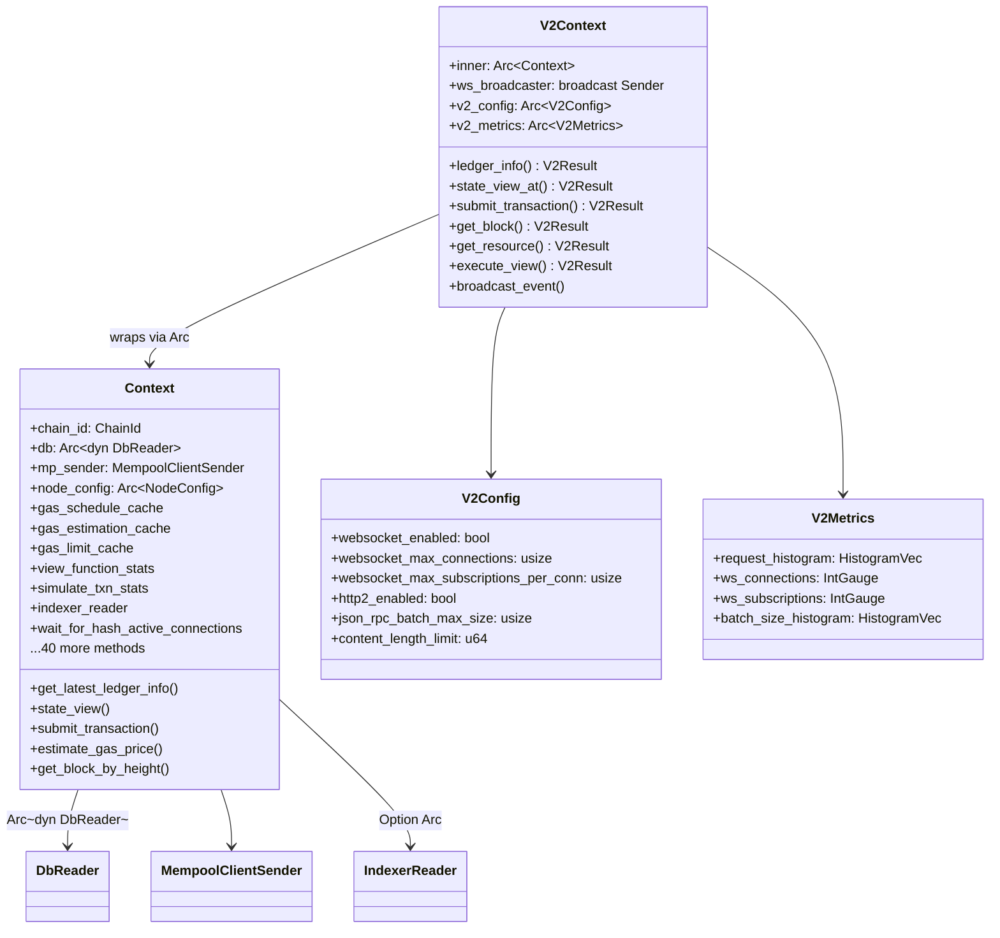
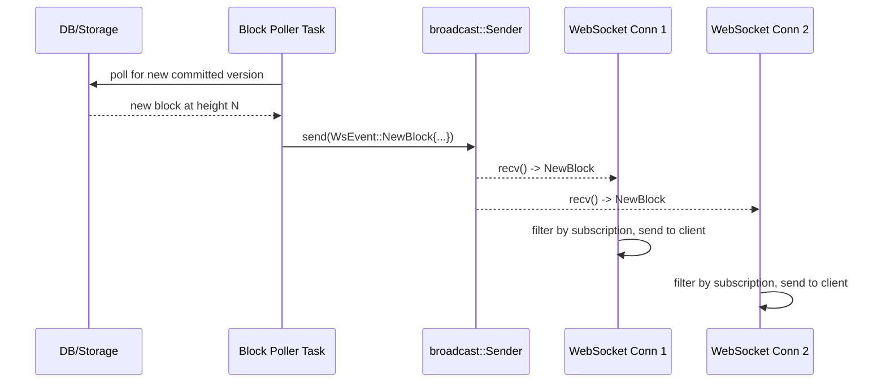

# V2 Design: Context Layer

## Overview

The `Context` struct (`api/src/context.rs`) is the backbone of the v1 API. Every endpoint
holds an `Arc<Context>` and delegates all storage reads, mempool interactions, gas estimation,
and caching through it. The v2 API introduces `V2Context`, which wraps the existing `Context`
and adds v2-specific capabilities (WebSocket broadcasting, v2 metrics, v2 config access)
without duplicating the shared infrastructure.

This document specifies the exact design for how `V2Context` replaces `Context` in the v2
endpoint layer, while both v1 and v2 continue to share the same underlying database, mempool,
and caches.

---

## Current v1 Context Architecture

### Struct Layout

```
Context
├── chain_id: ChainId
├── db: Arc<dyn DbReader>                          # Read-only DB access
├── mp_sender: MempoolClientSender                  # Async mempool submission
├── node_config: Arc<NodeConfig>                    # Full node config
├── gas_schedule_cache: Arc<RwLock<GasScheduleCache>>
├── gas_estimation_cache: Arc<RwLock<GasEstimationCache>>
├── gas_limit_cache: Arc<RwLock<GasLimitCache>>
├── view_function_stats: Arc<FunctionStats>
├── simulate_txn_stats: Arc<FunctionStats>
├── indexer_reader: Option<Arc<dyn IndexerReader>>
└── wait_for_hash_active_connections: Arc<AtomicUsize>
```

### How v1 Endpoints Use Context

Every v1 endpoint struct holds `pub context: Arc<Context>` and follows this pattern:

```
1. Endpoint handler receives request
2. Calls context.get_latest_ledger_info() to get LedgerInfo
3. Calls context.state_view(version) to get a DbStateView at a specific version
4. Uses DbStateView + converter to read/convert state
5. Calls context.submit_transaction() for tx submission
6. Uses context.estimate_gas_price() for gas estimation
7. Returns result with LedgerInfo headers
```

### Key Context Methods by Category

**State Access** (called on every read request):
- `latest_state_view()` / `latest_state_view_poem()` -> `DbStateView`
- `state_view(version)` -> `(LedgerInfo, u64, DbStateView)`
- `state_view_at_version(version)` -> `DbStateView`
- `get_state_value(key, version)` -> `Option<Vec<u8>>`
- `get_resources_by_pagination(addr, cursor, version, limit)` -> resources + next cursor
- `get_modules_by_pagination(addr, cursor, version, limit)` -> modules + next cursor

**Ledger Info** (called on nearly every request):
- `get_latest_ledger_info()` -> `LedgerInfo`  
  (checks indexer_reader first, falls back to storage)
- `get_latest_ledger_info_and_verify_lookup_version(version)` -> `(LedgerInfo, Version)`

**Transaction Access**:
- `get_transactions(start, limit, ledger_version)` -> `Vec<TransactionOnChainData>`
- `get_transaction_by_hash(hash, version)` -> `Option<TransactionOnChainData>`
- `get_transaction_by_version(version, ledger_version)` -> `TransactionOnChainData`
- `get_pending_transaction_by_hash(hash)` -> `Option<SignedTransaction>`

**Transaction Submission** (async, goes through mempool channel):
- `submit_transaction(txn)` -> `SubmissionStatus`

**Block Access**:
- `get_block_by_height(height, ledger_info, with_txns)` -> `BcsBlock`
- `get_block_by_version(version, ledger_info, with_txns)` -> `BcsBlock`

**Gas Estimation** (cached, epoch-scoped):
- `estimate_gas_price(ledger_info)` -> `GasEstimation`
- `get_gas_schedule(ledger_info)` -> `(u64, AptosGasParameters)`

**Events**:
- `get_events(event_key, start, limit, version)` -> `Vec<EventWithVersion>`

**Account Transactions**:
- `get_account_transactions(address, start, limit, ledger_version)` -> `Vec<TransactionOnChainData>`

**Transaction Rendering** (JSON conversion):
- `render_transactions_sequential(ledger_info, data, timestamp)` -> JSON txns
- `render_transactions_non_sequential(ledger_info, data)` -> JSON txns

**Config Checks**:
- `check_api_output_enabled(name, accept_type)` -> validates JSON/BCS enabled
- `content_length_limit()`, `max_submit_transaction_batch_size()`, etc.

### The Error Trait Problem

v1 Context methods are generic over error types using Poem-specific traits:

```rust
pub fn get_latest_ledger_info<E: ServiceUnavailableError>(&self) -> Result<LedgerInfo, E>
pub fn state_view<E: StdApiError>(&self, version: Option<u64>) -> Result<(...), E>
pub fn latest_state_view_poem<E: InternalError>(&self, ledger_info: &LedgerInfo) -> Result<DbStateView, E>
```

These traits (`ServiceUnavailableError`, `StdApiError`, `InternalError`, etc.) are defined
via the `generate_error_traits!` macro in `response.rs` and are tightly coupled to Poem's
`poem_openapi::ApiResponse` derive macro. They cannot be used directly from Axum handlers.

---

## V2Context Design

### Design Goals

1. **Share all data sources**: Same `Arc<dyn DbReader>`, same `MempoolClientSender`, same caches
2. **Decouple from Poem error traits**: v2 methods return `Result<T, V2Error>` (our own error type)
3. **Add v2-specific state**: WebSocket broadcast channel, v2 config, v2 metrics
4. **Keep v1 untouched**: No changes to existing `Context` struct or its methods
5. **Cheap to clone**: `V2Context` is `Clone` via `Arc` wrapping

### Struct Definition

```rust
// api/src/v2/context.rs

use crate::context::Context;
use std::sync::Arc;
use tokio::sync::broadcast;

/// V2 API context. Wraps the existing v1 Context and adds v2-specific state.
///
/// This is the Axum State type for all v2 handlers:
///   `State<V2Context>` in handler signatures.
#[derive(Clone)]
pub struct V2Context {
    /// The shared v1 context. Provides DB, mempool, gas caches, etc.
    inner: Arc<Context>,

    /// Broadcast channel for WebSocket events (new blocks, events, tx status).
    /// Handlers that detect new data send to this channel; WebSocket connections
    /// subscribe by calling `ws_broadcaster.subscribe()`.
    ws_broadcaster: broadcast::Sender<WsEvent>,

    /// v2-specific configuration (parsed from NodeConfig at startup).
    v2_config: Arc<V2Config>,

    /// v2 request metrics (separate from v1 metrics so we can track adoption).
    v2_metrics: Arc<V2Metrics>,
}
```

### Relationship Diagram



### Construction

```rust
impl V2Context {
    pub fn new(inner: Context, node_config: &NodeConfig) -> Self {
        // Parse v2-specific config from node_config.api_v2 (or a nested field)
        let v2_config = Arc::new(V2Config::from(node_config));

        // Create a broadcast channel for WebSocket events.
        // Capacity determines how many events can be buffered before slow
        // subscribers start missing events (they'll get a Lagged error).
        let (ws_broadcaster, _) = broadcast::channel(4096);

        Self {
            inner: Arc::new(inner),
            ws_broadcaster,
            v2_config,
            v2_metrics: Arc::new(V2Metrics::new()),
        }
    }

    /// Access the underlying v1 context (for shared caches, DB, etc.)
    pub fn inner(&self) -> &Context {
        &self.inner
    }
}
```

### Method Delegation Strategy

The critical design decision is **how v2 methods call into the existing Context without
being constrained by Poem's error trait generics**. There are two categories:

#### Category 1: Methods that don't use Poem error traits

These methods on `Context` return `anyhow::Result<T>` and can be called directly:

```rust
// These work as-is from V2Context:
context.inner().chain_id()
context.inner().state_view_at_version(version)    // -> Result<DbStateView>
context.inner().get_state_value(key, version)     // -> Result<Option<Vec<u8>>>
context.inner().get_transactions(start, limit, v) // -> Result<Vec<TransactionOnChainData>>
context.inner().get_transaction_by_hash(hash, v)  // -> Result<Option<TransactionOnChainData>>
context.inner().submit_transaction(txn).await      // -> Result<SubmissionStatus>
context.inner().get_events(key, start, limit, v)  // -> Result<Vec<EventWithVersion>>
context.inner().get_accumulator_root_hash(v)      // -> Result<HashValue>
context.inner().latest_state_view()               // -> Result<DbStateView>
```

V2Context wraps these and converts `anyhow::Result` -> `Result<T, V2Error>`:

```rust
impl V2Context {
    /// Get the latest ledger info. This is the v2 equivalent of
    /// `Context::get_latest_ledger_info::<E>()` but returns V2Error.
    pub fn ledger_info(&self) -> Result<LedgerInfo, V2Error> {
        // Call the non-generic version that uses BasicError internally
        self.inner
            .get_latest_ledger_info_wrapped()
            .map_err(V2Error::internal)
    }

    /// Get a state view at a specific version, verifying the version is valid.
    pub fn state_view_at(
        &self,
        requested_version: Option<u64>,
    ) -> Result<(LedgerInfo, u64, DbStateView), V2Error> {
        let ledger_info = self.ledger_info()?;
        let version = requested_version.unwrap_or_else(|| ledger_info.version());

        if version > ledger_info.version() {
            return Err(V2Error::not_found(
                ErrorCode::VersionNotFound,
                format!("Version {} is in the future", version),
            ));
        }
        if version < ledger_info.oldest_ledger_version.0 {
            return Err(V2Error::gone(
                ErrorCode::VersionPruned,
                format!("Version {} has been pruned", version),
            ));
        }

        let state_view = self
            .inner
            .state_view_at_version(version)
            .map_err(V2Error::internal)?;

        Ok((ledger_info, version, state_view))
    }
}
```

#### Pagination Helpers

V2Context provides convenience methods for cursor-based paginated access. These
wrap the underlying Context methods and handle cursor decoding/encoding:

```rust
impl V2Context {
    /// Get paginated resources for an account, with cursor-based pagination.
    pub fn get_resources_paginated(
        &self,
        address: AccountAddress,
        cursor: Option<&Cursor>,
        version: u64,
    ) -> Result<(Vec<(StructTag, Vec<u8>)>, Option<Cursor>), V2Error> {
        let prev_key = cursor.map(|c| c.as_state_key()).transpose()?;
        let page_size = self.v2_config.max_account_resources_page_size as u64;

        let (resources, next_key) = self.inner
            .get_resources_by_pagination(address, prev_key.as_ref(), version, page_size)
            .map_err(V2Error::internal)?;

        let next_cursor = next_key.map(|k| Cursor::from_state_key(&k));
        Ok((resources, next_cursor))
    }

    /// Get paginated modules for an account, with cursor-based pagination.
    pub fn get_modules_paginated(
        &self,
        address: AccountAddress,
        cursor: Option<&Cursor>,
        version: u64,
    ) -> Result<(Vec<Vec<u8>>, Option<Cursor>), V2Error> {
        let prev_key = cursor.map(|c| c.as_state_key()).transpose()?;
        let page_size = self.v2_config.max_account_modules_page_size as u64;

        let (modules, next_key) = self.inner
            .get_modules_by_pagination(address, prev_key.as_ref(), version, page_size)
            .map_err(V2Error::internal)?;

        let next_cursor = next_key.map(|k| Cursor::from_state_key(&k));
        Ok((modules, next_cursor))
    }

    /// Get paginated transactions, with cursor-based pagination.
    /// The cursor encodes the last-seen version; returns the next page after that.
    pub fn get_transactions_paginated(
        &self,
        cursor: Option<&Cursor>,
        ledger_version: u64,
    ) -> Result<(Vec<TransactionOnChainData>, Option<Cursor>), V2Error> {
        let page_size = self.v2_config.max_transactions_page_size;
        let start_version = match cursor {
            Some(c) => c.as_version()? + 1,
            None => 0,
        };

        if start_version > ledger_version {
            return Ok((vec![], None));
        }

        let txns = self.inner
            .get_transactions(start_version, page_size, ledger_version)
            .map_err(V2Error::internal)?;

        let next_cursor = if txns.len() as u16 == page_size {
            txns.last().map(|t| Cursor::from_version(t.version))
        } else {
            None
        };

        Ok((txns, next_cursor))
    }

    /// Get paginated account transactions, with cursor-based pagination.
    pub fn get_account_transactions_paginated(
        &self,
        address: AccountAddress,
        cursor: Option<&Cursor>,
        ledger_version: u64,
    ) -> Result<(Vec<TransactionOnChainData>, Option<Cursor>), V2Error> {
        let page_size = self.v2_config.max_transactions_page_size as u64;
        let start_version = match cursor {
            Some(c) => Some(c.as_version()? + 1),
            None => None,
        };

        let txns = self.inner
            .get_account_transactions(address, start_version, page_size, ledger_version)
            .map_err(V2Error::internal)?;

        let next_cursor = if txns.len() as u64 == page_size {
            txns.last().map(|t| Cursor::from_version(t.version))
        } else {
            None
        };

        Ok((txns, next_cursor))
    }

    /// Get paginated events by event key, with cursor-based pagination.
    /// The cursor encodes the last-seen sequence number.
    pub fn get_events_paginated(
        &self,
        event_key: &EventKey,
        cursor: Option<&Cursor>,
        ledger_version: u64,
    ) -> Result<(Vec<EventWithVersion>, Option<Cursor>), V2Error> {
        let page_size = self.v2_config.max_events_page_size;
        let start_seq = match cursor {
            Some(c) => c.as_sequence_number()? + 1,
            None => 0,
        };

        let events = self.inner
            .get_events(event_key, start_seq, page_size, ledger_version)
            .map_err(V2Error::internal)?;

        let next_cursor = if events.len() as u16 == page_size {
            events.last().map(|e| Cursor::from_sequence_number(e.event.sequence_number()))
        } else {
            None
        };

        Ok((events, next_cursor))
    }

    /// Render a list of transactions into JSON format.
    /// Shared by transaction list and account transaction list endpoints.
    pub fn render_transactions(
        &self,
        converter: &impl AptosConverter,
        ledger_info: &LedgerInfo,
        txns: Vec<TransactionOnChainData>,
    ) -> Result<Vec<Transaction>, V2Error> {
        txns.into_iter()
            .map(|txn_data| {
                let timestamp = self.inner.db
                    .get_block_timestamp(txn_data.version)
                    .map_err(V2Error::internal)?;
                converter.try_into_onchain_transaction(timestamp, txn_data)
                    .map_err(V2Error::internal)
            })
            .collect()
    }
}
```

#### Category 2: Methods that use Poem error traits

These methods on `Context` have generic error types (`E: ServiceUnavailableError`, etc.)
that cannot be satisfied by `V2Error`. For these, V2Context provides its own implementations
that call the underlying DB/storage directly:

```rust
impl V2Context {
    /// Get a block by height. Equivalent to Context::get_block_by_height
    /// but without the Poem error trait constraint.
    pub fn get_block_by_height(
        &self,
        height: u64,
        with_transactions: bool,
    ) -> Result<BcsBlock, V2Error> {
        let ledger_info = self.ledger_info()?;

        if height < ledger_info.oldest_block_height.0 {
            return Err(V2Error::gone(
                ErrorCode::BlockPruned,
                format!("Block {} has been pruned", height),
            ));
        }
        if height > ledger_info.block_height.0 {
            return Err(V2Error::not_found(
                ErrorCode::BlockNotFound,
                format!("Block height {} not found", height),
            ));
        }

        let (first_version, last_version, new_block_event) = self
            .inner
            .db
            .get_block_info_by_height(height)
            .map_err(|_| V2Error::not_found(
                ErrorCode::BlockNotFound,
                format!("Block height {} not found", height),
            ))?;

        self.build_block(
            &ledger_info,
            with_transactions,
            first_version,
            last_version,
            new_block_event,
        )
    }

    /// Get gas estimation. Wraps the v1 method using BasicError as the
    /// concrete error type, then converts.
    pub fn estimate_gas_price(&self) -> Result<GasEstimation, V2Error> {
        let ledger_info = self.ledger_info()?;
        self.inner
            .estimate_gas_price::<crate::response::BasicError>(&ledger_info)
            .map_err(|e| V2Error::internal(anyhow::anyhow!("{}", e)))
    }
}
```

### Complete Method Mapping

| v1 Context Method | v2 Strategy | V2Context Method |
|---|---|---|
| `chain_id()` | Direct delegation | `self.inner().chain_id()` |
| `node_role()` | Direct delegation | `self.inner().node_role()` |
| `get_latest_ledger_info::<E>()` | Use `get_latest_ledger_info_wrapped()` | `ledger_info()` |
| `get_latest_ledger_info_and_verify_lookup_version::<E>(v)` | Re-implement with V2Error | `state_view_at(version)` |
| `state_view::<E>(v)` | Re-implement with V2Error | `state_view_at(version)` |
| `state_view_at_version(v)` | Direct + map_err | `state_view_at(version)` |
| `latest_state_view()` | Direct + map_err | `latest_state_view()` |
| `get_state_value(key, v)` | Direct + map_err | `get_state_value(key, v)` |
| `get_resource::<T>(addr, v)` | Direct + map_err | `get_resource::<T>(addr, v)` |
| `get_resources_by_pagination(...)` | Direct + map_err | `get_resources_paginated(...)` |
| `get_block_by_height::<E>(...)` | Re-implement | `get_block_by_height(...)` |
| `get_block_by_version::<E>(...)` | Re-implement | `get_block_by_version(...)` |
| `get_transactions(start, limit, v)` | Direct + map_err | `get_transactions(...)` |
| `get_transaction_by_hash(hash, v)` | Direct + map_err | `get_transaction_by_hash(...)` |
| `submit_transaction(txn)` | Direct + map_err | `submit_transaction(txn)` |
| `estimate_gas_price::<E>(info)` | Use BasicError concrete type | `estimate_gas_price()` |
| `get_gas_schedule::<E>(info)` | Use BasicError concrete type | `gas_schedule()` |
| `get_events(key, start, limit, v)` | Direct + map_err | `get_events_paginated(...)` |
| `get_account_transactions(addr, start, limit, v)` | Direct + map_err | `get_account_transactions_paginated(...)` |
| `get_resources_by_pagination(...)` | Direct + map_err | `get_resources_paginated(...)` |
| `get_modules_by_pagination(...)` | Direct + map_err | `get_modules_paginated(...)` |
| `check_api_output_enabled::<E>(...)` | Re-implement for v2 config | `check_output_enabled(...)` |
| `render_transactions_sequential::<E>(...)` | Re-implement with V2Error | `render_transactions(...)` |

### Axum State Integration

Axum uses the `State` extractor to inject shared state into handlers. `V2Context` is
registered as the application state:

```rust
// In router construction:
let v2_context = V2Context::new(context, &node_config);

let app = Router::new()
    .route("/v2/health", get(health_handler))
    .route("/v2/info", get(info_handler))
    .route("/v2/view", post(view_handler))
    // ... more routes
    .with_state(v2_context);
```

Handlers receive it via `State`:

```rust
use axum::extract::State;

async fn info_handler(
    State(ctx): State<V2Context>,
) -> Result<Json<LedgerInfoResponse>, V2Error> {
    let ledger_info = ctx.ledger_info()?;
    Ok(Json(LedgerInfoResponse::from(ledger_info)))
}

async fn view_handler(
    State(ctx): State<V2Context>,
    body: axum::body::Bytes,
) -> Result<Json<Vec<serde_json::Value>>, V2Error> {
    // Use ctx.state_view_at(...) etc.
}
```

### Spawn Blocking Pattern

v1 uses `api_spawn_blocking` to run synchronous DB reads on a blocking thread pool.
v2 follows the same pattern:

```rust
// api/src/v2/context.rs

/// Spawn a blocking task for synchronous DB operations.
/// This prevents blocking the Axum/Tokio async runtime.
pub async fn spawn_blocking<F, T>(f: F) -> Result<T, V2Error>
where
    F: FnOnce() -> Result<T, V2Error> + Send + 'static,
    T: Send + 'static,
{
    tokio::task::spawn_blocking(f)
        .await
        .map_err(|e| V2Error::internal(anyhow::anyhow!("Blocking task failed: {}", e)))?
}
```

Endpoints use it like:

```rust
async fn get_resource_handler(
    State(ctx): State<V2Context>,
    Path((address, resource_type)): Path<(String, String)>,
    Query(params): Query<LedgerVersionParam>,
) -> Result<Json<MoveResource>, V2Error> {
    let ctx = ctx.clone();
    spawn_blocking(move || {
        let (ledger_info, version, state_view) = ctx.state_view_at(params.ledger_version)?;
        // ... read resource from state_view ...
    }).await
}
```

---

## WebSocket Broadcaster Integration

The `ws_broadcaster` field on `V2Context` is a `tokio::sync::broadcast::Sender<WsEvent>`.

### Event Flow



### Block Poller Background Task

Spawned at startup alongside the v2 runtime:

```rust
pub fn spawn_block_poller(ctx: V2Context) -> tokio::task::JoinHandle<()> {
    tokio::spawn(async move {
        let mut last_known_version = 0u64;
        let mut interval = tokio::time::interval(Duration::from_millis(100));

        loop {
            interval.tick().await;

            let ledger_info = match ctx.ledger_info() {
                Ok(info) => info,
                Err(_) => continue,
            };

            let current_version = ledger_info.version();
            if current_version <= last_known_version {
                continue;
            }

            // New data available - emit events
            // Get blocks between last_known_version and current_version
            // For each new block, broadcast WsEvent::NewBlock
            // For events in those blocks, broadcast WsEvent::Event

            let _ = ctx.ws_broadcaster.send(WsEvent::NewBlock {
                height: ledger_info.block_height.0,
                version: current_version,
                timestamp: ledger_info.ledger_timestamp.0,
            });

            last_known_version = current_version;
        }
    })
}
```

---

## V2 Config Struct

```rust
// api/src/v2/context.rs (or a dedicated config module)

#[derive(Clone, Debug)]
pub struct V2Config {
    pub enabled: bool,
    pub address: Option<SocketAddr>,  // None = share v1 port
    pub websocket_enabled: bool,
    pub websocket_max_connections: usize,
    pub websocket_max_subscriptions_per_conn: usize,
    pub http2_enabled: bool,
    pub json_rpc_batch_max_size: usize,
    pub content_length_limit: u64,
    pub max_gas_view_function: u64,
    pub max_account_resources_page_size: u16,
    pub max_account_modules_page_size: u16,
    pub max_transactions_page_size: u16,
    pub max_events_page_size: u16,
    pub view_filter: ViewFilter,  // Reuse v1's ViewFilter type
    pub wait_by_hash_timeout_ms: u64,
    pub wait_by_hash_poll_interval_ms: u64,
}

impl From<&NodeConfig> for V2Config {
    fn from(config: &NodeConfig) -> Self {
        // Pull from config.api_v2 if it exists, with sensible defaults
        // that inherit from v1 config where appropriate.
        let v2 = &config.api_v2;
        V2Config {
            enabled: v2.enabled,
            address: v2.address,
            websocket_enabled: v2.websocket_enabled,
            websocket_max_connections: v2.websocket_max_connections,
            websocket_max_subscriptions_per_conn: v2.websocket_max_subscriptions_per_conn,
            http2_enabled: v2.http2_enabled,
            json_rpc_batch_max_size: v2.json_rpc_batch_max_size,
            content_length_limit: v2.content_length_limit
                .unwrap_or_else(|| config.api.content_length_limit()),
            max_gas_view_function: config.api.max_gas_view_function,
            max_account_resources_page_size: config.api.max_account_resources_page_size,
            max_account_modules_page_size: config.api.max_account_modules_page_size,
            max_transactions_page_size: config.api.max_transactions_page_size,
            max_events_page_size: config.api.max_events_page_size
                .unwrap_or(100),  // default 100 events per page
            view_filter: config.api.view_filter.clone(),
            wait_by_hash_timeout_ms: v2.wait_by_hash_timeout_ms.unwrap_or(30_000),
            wait_by_hash_poll_interval_ms: v2.wait_by_hash_poll_interval_ms.unwrap_or(200),
        }
    }
}
```

---

## V2 Metrics

```rust
// api/src/v2/metrics.rs

pub struct V2Metrics {
    pub request_duration: HistogramVec,  // by method, path, status
    pub request_count: IntCounterVec,    // by method, path, status
    pub ws_active_connections: IntGauge,
    pub ws_active_subscriptions: IntGauge,
    pub ws_messages_sent: IntCounterVec, // by subscription_type
    pub batch_request_size: HistogramVec,
    pub batch_request_duration: HistogramVec,
}

impl V2Metrics {
    pub fn new() -> Self {
        Self {
            request_duration: register_histogram_vec!(
                "aptos_api_v2_request_duration_seconds",
                "v2 API request duration",
                &["method", "path", "status"],
                SUB_MS_BUCKETS.to_vec()
            ).unwrap(),
            // ... etc
        }
    }
}
```

---

## Shared vs. Separate Concerns

| Concern | Shared between v1 and v2 | Separate for v2 |
|---|---|---|
| Database reader (`Arc<dyn DbReader>`) | Yes | - |
| Mempool sender (`MempoolClientSender`) | Yes | - |
| Gas schedule cache | Yes (via inner Context) | - |
| Gas estimation cache | Yes (via inner Context) | - |
| Indexer reader | Yes (via inner Context) | - |
| Node config | Yes (via inner Context) | v2_config parsed from it |
| Error types | - | V2Error (not Poem traits) |
| Response format | - | JSON-only default (no BCS output) |
| Metrics | - | Separate v2 metrics namespace |
| WebSocket state | - | broadcast channel + subscription tracking |
| View function stats | Yes (via inner Context) | Can reuse or add v2-specific |
| Wait-for-hash tracking | Yes (via inner Context) | v2 uses WebSocket instead |

---

## Migration Safety

1. **No v1 Context changes**: `V2Context` only adds a wrapper. The existing `Context` struct,
   its methods, and all v1 endpoint code remain 100% unchanged.

2. **Same DB consistency**: Both v1 and v2 read from the same `Arc<dyn DbReader>`, so they
   always see the same committed state.

3. **Same mempool**: Transaction submissions from either version go through the same
   `MempoolClientSender` channel, so there's no risk of split-brain submission.

4. **Same gas caches**: Since gas estimation is epoch-scoped and cached in the inner Context,
   v2 gets the same cached results without duplicating computation.

5. **Gradual rollout**: v2 can be enabled alongside v1 on the same node. If v2 has issues,
   disabling it (`api_v2.enabled = false`) removes all v2 routes without affecting v1.
