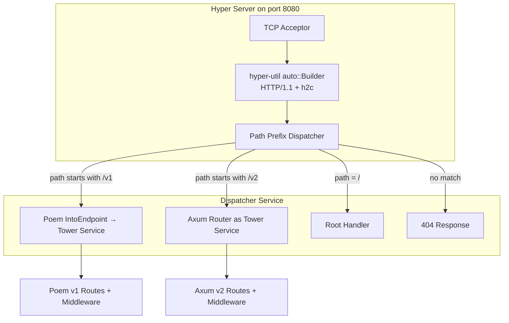
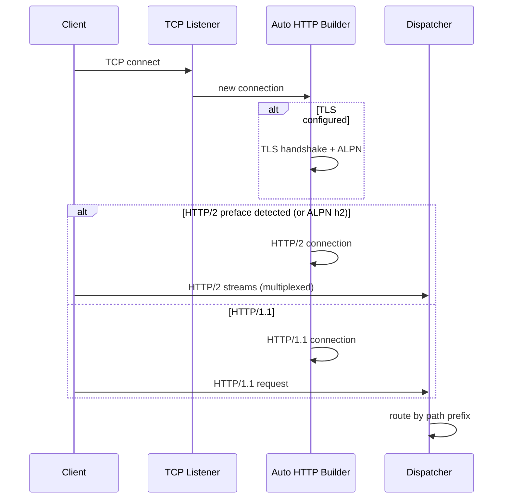
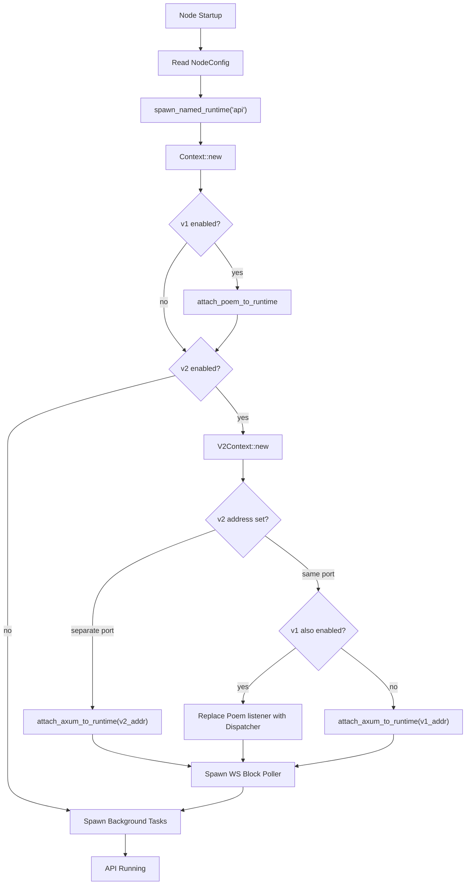

# V2 Design: Router Integration & Server Architecture

## Overview

This document details how the Axum-based v2 API coexists with the Poem-based v1 API on
the same node, supporting same-port path-based routing, separate-port mode, and
independent enable/disable toggles. It also covers HTTP/2 (h2c) support and TLS.

---

## Current v1 Server Architecture

The v1 server is bootstrapped in `api/src/runtime.rs`:

```
bootstrap()
  ├── spawn_named_runtime("api", workers)
  ├── Context::new(chain_id, db, mp_sender, config, indexer_reader)
  ├── attach_poem_to_runtime(handle, context, config, random_port, port_tx)
  │     ├── get_api_service(context) -> OpenApiService with 8 API modules
  │     ├── Build Poem Route:
  │     │     Route::new()
  │     │       .at("/", root_handler)
  │     │       .nest("/v1", api_service + spec endpoints)
  │     │       .with(cors)
  │     │       .with_if(compression)
  │     │       .with(PostSizeLimit)
  │     │       .with(CatchPanic)
  │     │       .catch_all_error(convert_error)
  │     │       .around(middleware_log)
  │     ├── TcpListener::bind(address) [optional .rustls()]
  │     └── Server::new_with_acceptor(acceptor).run(route)
  ├── Spawn periodic gas estimation task
  └── Spawn periodic function stats task
```

The Poem server owns the TCP listener and handles all HTTP/1.1 connections.

---

## New Server Architecture

### Configuration

```yaml
# Node config (YAML)
api:
  enabled: true
  address: "0.0.0.0:8080"
  # ... existing v1 fields ...

api_v2:
  enabled: true
  # None = share v1 port; Some = separate listener
  address: null  # or "0.0.0.0:8081"
  websocket_enabled: true
  websocket_max_connections: 1000
  websocket_max_subscriptions_per_conn: 10
  http2_enabled: true
  json_rpc_batch_max_size: 20
  content_length_limit: null  # inherits from v1
```

### Operational Modes

There are four valid mode combinations:

| v1 enabled | v2 enabled | v2 address | Result |
|---|---|---|---|
| true | false | - | v1 only on `:8080` (current behavior) |
| true | true | null | Both on `:8080`, path-routed |
| true | true | `:8081` | v1 on `:8080`, v2 on `:8081` |
| false | true | null or `:8081` | v2 only |

### Same-Port Architecture (Path-Based Routing)

When both v1 and v2 share a port, we cannot simply nest Poem and Axum routers because they
are different frameworks. Instead, we use **Hyper** as the common HTTP layer and route at
the `tower::Service` level.



### Dispatcher Implementation

```rust
// api/src/v2/dispatcher.rs

use hyper::{Request, Response, body::Incoming};
use tower::Service;
use std::future::Future;
use std::pin::Pin;

/// A Tower Service that dispatches requests by path prefix to either
/// the v1 (Poem) or v2 (Axum) service.
#[derive(Clone)]
pub struct ApiDispatcher {
    v1_service: Option<PoemTowerService>,  // None if v1 disabled
    v2_service: Option<AxumTowerService>,  // None if v2 disabled
}

impl Service<Request<Incoming>> for ApiDispatcher {
    type Response = Response<BoxBody>;
    type Error = Infallible;
    type Future = Pin<Box<dyn Future<Output = Result<Self::Response, Self::Error>> + Send>>;

    fn poll_ready(&mut self, _cx: &mut std::task::Context<'_>) -> Poll<Result<(), Self::Error>> {
        Poll::Ready(Ok(()))
    }

    fn call(&mut self, req: Request<Incoming>) -> Self::Future {
        let path = req.uri().path();

        if path.starts_with("/v2") {
            if let Some(ref mut v2) = self.v2_service {
                let fut = v2.call(req);
                return Box::pin(async move { Ok(fut.await.unwrap_or_else(|_| not_found())) });
            }
        }

        if path == "/" || path.starts_with("/v1") {
            if let Some(ref mut v1) = self.v1_service {
                let fut = v1.call(req);
                return Box::pin(async move { Ok(fut.await.unwrap_or_else(|_| not_found())) });
            }
        }

        Box::pin(async { Ok(not_found()) })
    }
}
```

### Converting Poem to a Tower Service

Poem provides interop with Tower. The key is `poem::Server`'s ability to produce
a Hyper service, or we can wrap the Poem `Endpoint` into a Tower-compatible service:

```rust
use poem::endpoint::make_sync;
use poem::{Route, Endpoint};

/// Wrap a Poem Route into something callable as a Tower Service.
/// Poem 3.x operates on hyper types internally, so the conversion is direct.
fn poem_as_tower_service(route: Route) -> impl Service<Request<Incoming>, Response = Response<BoxBody>> {
    // Poem's `Server` internally converts Endpoint -> hyper Service.
    // We use the same internal conversion path.
    let ep = route.boxed();
    PoemServiceWrapper(ep)
}
```

Alternatively, if direct wrapping proves difficult, we can have Poem and Axum each listen
on internal Unix sockets or use `hyper::service::service_fn` to proxy:

```rust
// Simpler approach: use Axum's built-in nesting and treat Poem as a fallback
// via hyper's service_fn at the top level.
let dispatcher = tower::service_fn(move |req: Request<Incoming>| {
    let path = req.uri().path().to_string();
    let v1 = v1_service.clone();
    let v2 = v2_service.clone();
    async move {
        if path.starts_with("/v2") {
            v2.oneshot(req).await
        } else {
            v1.oneshot(req).await
        }
    }
});
```

### Separate-Port Architecture

When `api_v2.address` is set, v2 gets its own TCP listener and runtime:

```rust
// api/src/runtime.rs (modified bootstrap function)

pub fn bootstrap(config: &NodeConfig, ...) -> anyhow::Result<Runtime> {
    let runtime = aptos_runtimes::spawn_named_runtime("api".into(), Some(max_workers));
    let context = Context::new(...);

    // v1 API (if enabled)
    if config.api.enabled {
        attach_poem_to_runtime(runtime.handle(), context.clone(), config, false, port_tx)?;
    }

    // v2 API (if enabled)
    if config.api_v2.enabled {
        let v2_context = V2Context::new(context.clone(), config);
        if let Some(v2_address) = config.api_v2.address {
            // Separate port mode
            attach_axum_to_runtime(runtime.handle(), v2_context, v2_address, config)?;
        } else if config.api.enabled {
            // Same-port mode: need to replace the Poem-only listener with a dispatcher
            // This is handled by the dispatcher approach above
        } else {
            // v2 only, use v1's address
            attach_axum_to_runtime(runtime.handle(), v2_context, config.api.address, config)?;
        }
    }

    // Shared background tasks (gas estimation, stats)
    spawn_background_tasks(runtime.handle(), &context, config);

    Ok(runtime)
}
```

---

## HTTP/2 Support

### h2c (HTTP/2 Cleartext)

Axum on Hyper supports h2c via `hyper-util`'s auto connection builder:

```rust
use hyper_util::server::conn::auto::Builder as AutoBuilder;
use hyper_util::rt::TokioExecutor;

async fn serve_connection(
    stream: TcpStream,
    service: ApiDispatcher,
) {
    let builder = AutoBuilder::new(TokioExecutor::new());
    // This auto-detects HTTP/1.1 vs HTTP/2 based on the connection preface.
    // HTTP/2 clients send "PRI * HTTP/2.0\r\n\r\nSM\r\n\r\n" as preface.
    if let Err(e) = builder.serve_connection(stream, service).await {
        eprintln!("Connection error: {}", e);
    }
}
```

### TLS (HTTP/2 with ALPN)

When TLS is configured, we use `tokio-rustls` and set ALPN protocols to negotiate h2:

```rust
use tokio_rustls::TlsAcceptor;
use rustls::ServerConfig;

fn build_tls_acceptor(cert_path: &str, key_path: &str) -> TlsAcceptor {
    let mut config = ServerConfig::builder()
        .with_no_client_auth()
        .with_single_cert(certs, key)
        .unwrap();

    // Enable ALPN negotiation for h2 and http/1.1
    config.alpn_protocols = vec![b"h2".to_vec(), b"http/1.1".to_vec()];

    TlsAcceptor::from(Arc::new(config))
}
```

### Connection Lifecycle



---

## Axum v2 Router Construction

```rust
// api/src/v2/router.rs

use axum::{Router, routing::{get, post}};
use tower_http::{
    cors::CorsLayer,
    compression::CompressionLayer,
    limit::RequestBodyLimitLayer,
};
use utoipa::OpenApi;
use utoipa_axum::router::OpenApiRouter;

pub fn build_v2_router(ctx: V2Context) -> Router {
    let (router, api) = OpenApiRouter::with_openapi(V2ApiDoc::openapi())
        // Health & info
        .routes(routes!(health_handler, info_handler))
        // Resources
        .routes(routes!(get_resources_handler, get_resource_handler))
        // View functions
        .routes(routes!(view_handler))
        // Transactions
        .routes(routes!(submit_transaction_handler, get_transaction_handler, wait_transaction_handler))
        // Blocks
        .routes(routes!(get_block_by_height_handler, get_latest_block_handler))
        // Batch
        .routes(routes!(batch_handler))
        // WebSocket
        .routes(routes!(ws_handler))
        // OpenAPI spec
        .split_for_parts();

    let router = router
        .route("/v2/spec.json", get(|| async { Json(api) }))
        .layer(CorsLayer::permissive())
        .layer(CompressionLayer::new())
        .layer(RequestBodyLimitLayer::new(ctx.v2_config.content_length_limit as usize))
        .layer(axum::middleware::from_fn(v2_logging_middleware))
        .with_state(ctx);

    router
}
```

---

## Attach Axum to Runtime

```rust
// api/src/v2/server.rs

pub fn attach_axum_to_runtime(
    handle: &Handle,
    ctx: V2Context,
    address: SocketAddr,
    config: &NodeConfig,
) -> anyhow::Result<SocketAddr> {
    let router = build_v2_router(ctx.clone());

    let listener = handle.block_on(async {
        tokio::net::TcpListener::bind(address).await
    })?;

    let actual_addr = listener.local_addr()?;

    handle.spawn(async move {
        // Use hyper-util for h2c support
        let builder = hyper_util::server::conn::auto::Builder::new(
            hyper_util::rt::TokioExecutor::new()
        );

        loop {
            let (stream, _) = match listener.accept().await {
                Ok(conn) => conn,
                Err(e) => {
                    eprintln!("Accept error: {}", e);
                    continue;
                }
            };

            let tower_service = router.clone();
            let builder = builder.clone();

            tokio::spawn(async move {
                let hyper_service = hyper::service::service_fn(move |req| {
                    let mut svc = tower_service.clone();
                    async move { svc.call(req).await }
                });

                if let Err(e) = builder
                    .serve_connection_with_upgrades(
                        hyper_util::rt::TokioIo::new(stream),
                        hyper_service,
                    )
                    .await
                {
                    eprintln!("Connection error: {}", e);
                }
            });
        }
    });

    info!("API v2 server is running at {}", actual_addr);
    Ok(actual_addr)
}
```

Note: `serve_connection_with_upgrades` is required for WebSocket support, since WebSocket
starts as an HTTP/1.1 Upgrade request.

---

## Bootstrap Flow (Modified)



---

## Graceful Shutdown

Both v1 and v2 share the same tokio runtime. When the node shuts down:

1. The runtime receives a shutdown signal
2. All spawned tasks are cancelled
3. In-flight HTTP connections are allowed to drain (configurable timeout)
4. WebSocket connections receive a close frame
5. The TCP listeners are dropped

For the v2 Axum server, we use `tokio::select!` with a shutdown signal:

```rust
let (shutdown_tx, shutdown_rx) = tokio::sync::watch::channel(());

// In the accept loop:
tokio::select! {
    conn = listener.accept() => { /* handle connection */ }
    _ = shutdown_rx.changed() => { break; }
}
```

---

## Summary of File Changes

| File | Change |
|---|---|
| `api/src/runtime.rs` | Modify `bootstrap()` to optionally create V2Context and attach v2 router |
| `api/src/lib.rs` | Add `pub mod v2;` |
| `api/src/v2/mod.rs` | Module root |
| `api/src/v2/router.rs` | Axum router construction + OpenAPI |
| `api/src/v2/server.rs` | `attach_axum_to_runtime()` with h2c support |
| `api/src/v2/dispatcher.rs` | Path-prefix dispatcher for same-port mode |
| `config/src/config/api_config.rs` | Add `ApiV2Config` struct |
| `config/src/config/node_config.rs` | Add `api_v2: ApiV2Config` field |
| `api/Cargo.toml` | Add axum, tower-http, hyper-util, utoipa deps |
