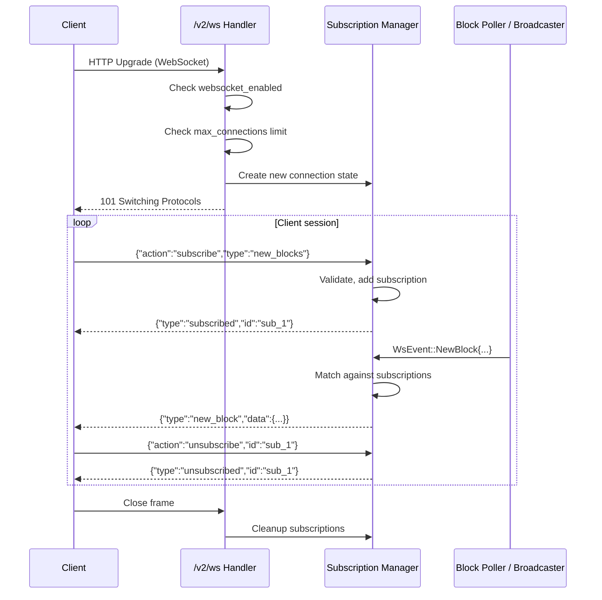
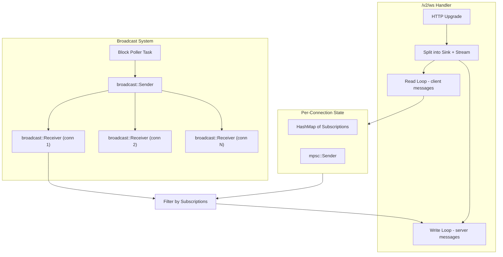

# V2 Design: WebSocket Support

## Overview

The v2 API provides a WebSocket endpoint at `/v2/ws` for real-time push notifications.
Clients connect via WebSocket, send JSON subscription messages, and receive a stream of
matching events. This replaces the polling pattern used by v1 clients (e.g., repeated
`GET /v1/transactions/:hash/wait`).

WebSocket support is **optional** and controlled by `api_v2.websocket_enabled` config.

---

## Connection Lifecycle



---

## WebSocket Message Protocol

### Client -> Server Messages

```rust
// api/src/v2/types/ws.rs

#[derive(Deserialize)]
#[serde(tag = "action", rename_all = "snake_case")]
pub enum WsClientMessage {
    /// Subscribe to a stream of events.
    Subscribe {
        /// Client-provided subscription ID (optional, server generates if absent).
        id: Option<String>,
        /// Type of subscription.
        #[serde(flatten)]
        subscription: SubscriptionType,
    },

    /// Unsubscribe from a previously created subscription.
    Unsubscribe {
        /// The subscription ID to remove.
        id: String,
    },

    /// Ping for keepalive.
    Ping {
        /// Opaque nonce echoed back in pong.
        nonce: Option<u64>,
    },
}

#[derive(Deserialize)]
#[serde(tag = "type", rename_all = "snake_case")]
pub enum SubscriptionType {
    /// Subscribe to new committed blocks.
    NewBlocks,

    /// Subscribe to transaction status updates for a specific hash.
    TransactionStatus {
        hash: String,
    },

    /// Subscribe to events matching a filter.
    Events {
        /// Event type to filter (e.g., "0x1::coin::DepositEvent").
        /// If None, receives all events.
        event_type: Option<String>,
        /// Account address to filter events for.
        /// If None, receives events from all accounts.
        account: Option<String>,
    },
}
```

### Server -> Client Messages

```rust
#[derive(Serialize)]
#[serde(tag = "type", rename_all = "snake_case")]
pub enum WsServerMessage {
    /// Acknowledgement of a successful subscription.
    Subscribed {
        id: String,
    },

    /// Acknowledgement of an unsubscription.
    Unsubscribed {
        id: String,
    },

    /// Pong response to a ping.
    Pong {
        nonce: Option<u64>,
    },

    /// New block notification.
    NewBlock {
        subscription_id: String,
        data: BlockSummary,
    },

    /// Transaction status update.
    TransactionStatusUpdate {
        subscription_id: String,
        data: TransactionStatusData,
    },

    /// Event notification.
    Event {
        subscription_id: String,
        data: EventData,
    },

    /// Error message (e.g., invalid subscription, rate limit).
    Error {
        code: String,
        message: String,
        /// If related to a specific subscription.
        subscription_id: Option<String>,
    },
}

#[derive(Serialize)]
pub struct BlockSummary {
    pub height: u64,
    pub hash: String,
    pub timestamp_usec: u64,
    pub first_version: u64,
    pub last_version: u64,
    pub num_transactions: u64,
}

#[derive(Serialize)]
#[serde(tag = "status", rename_all = "snake_case")]
pub enum TransactionStatusData {
    /// Transaction is in the mempool, pending execution.
    Pending { hash: String },
    /// Transaction has been committed on-chain.
    Committed {
        hash: String,
        version: u64,
        success: bool,
        vm_status: String,
    },
    /// Transaction was not found after timeout (dropped or expired).
    NotFound { hash: String },
}

#[derive(Serialize)]
pub struct EventData {
    pub version: u64,
    pub event_index: u64,
    pub event_type: String,
    pub data: serde_json::Value,
}
```

---

## Internal Architecture

### Components



### WsEvent (Internal Broadcast Type)

```rust
// api/src/v2/websocket/mod.rs

/// Internal event type broadcast from the block poller to all connections.
/// Each connection filters these against its active subscriptions.
#[derive(Clone, Debug)]
pub enum WsEvent {
    NewBlock {
        height: u64,
        hash: String,
        timestamp_usec: u64,
        first_version: u64,
        last_version: u64,
        num_transactions: u64,
    },
    /// A batch of events from a committed block.
    Events {
        version: u64,
        events: Vec<(u64, String, serde_json::Value)>,  // (index, type, data)
    },
}
```

### Connection Handler

```rust
// api/src/v2/websocket/mod.rs

use axum::extract::ws::{WebSocket, WebSocketUpgrade, Message};

/// GET /v2/ws - WebSocket upgrade endpoint
pub async fn ws_handler(
    State(ctx): State<V2Context>,
    ws: WebSocketUpgrade,
) -> Result<impl IntoResponse, V2Error> {
    // Check if WebSocket is enabled
    if !ctx.v2_config.websocket_enabled {
        return Err(V2Error::forbidden(
            ErrorCode::WebSocketDisabled,
            "WebSocket support is disabled on this node",
        ));
    }

    // Check connection limit
    let active = ctx.v2_metrics.ws_active_connections.get();
    if active >= ctx.v2_config.websocket_max_connections as i64 {
        return Err(V2Error::rate_limited(
            "WebSocket connection limit reached",
        ));
    }

    Ok(ws.on_upgrade(move |socket| handle_ws_connection(ctx, socket)))
}

async fn handle_ws_connection(ctx: V2Context, socket: WebSocket) {
    ctx.v2_metrics.ws_active_connections.inc();

    let (mut ws_sender, mut ws_receiver) = socket.split();

    // Per-connection state
    let mut subscriptions: HashMap<String, SubscriptionType> = HashMap::new();
    let mut sub_counter: u64 = 0;

    // Subscribe to the broadcast channel
    let mut broadcast_rx = ctx.ws_broadcaster.subscribe();

    // Channel for sending messages to the client (from both the read loop and broadcast loop)
    let (tx, mut rx) = tokio::sync::mpsc::channel::<WsServerMessage>(256);

    // Spawn write loop: takes messages from the mpsc channel and sends to WebSocket
    let write_handle = tokio::spawn(async move {
        while let Some(msg) = rx.recv().await {
            let text = serde_json::to_string(&msg).unwrap_or_default();
            if ws_sender.send(Message::Text(text)).await.is_err() {
                break;
            }
        }
    });

    // Spawn broadcast filter loop: receives broadcast events, filters by subscriptions,
    // and forwards matching events to the write channel
    let tx_broadcast = tx.clone();
    let subs_ref = Arc::new(RwLock::new(HashMap::<String, SubscriptionType>::new()));
    let subs_for_broadcast = subs_ref.clone();

    let broadcast_handle = tokio::spawn(async move {
        loop {
            match broadcast_rx.recv().await {
                Ok(event) => {
                    let subs = subs_for_broadcast.read().await;
                    for (id, sub_type) in subs.iter() {
                        if let Some(msg) = match_event(&event, id, sub_type) {
                            if tx_broadcast.send(msg).await.is_err() {
                                return;
                            }
                        }
                    }
                }
                Err(broadcast::error::RecvError::Lagged(n)) => {
                    let _ = tx_broadcast.send(WsServerMessage::Error {
                        code: "LAGGED".to_string(),
                        message: format!("Missed {} events due to slow consumption", n),
                        subscription_id: None,
                    }).await;
                }
                Err(broadcast::error::RecvError::Closed) => break,
            }
        }
    });

    // Read loop: process client messages
    let tx_read = tx.clone();
    while let Some(Ok(msg)) = ws_receiver.next().await {
        match msg {
            Message::Text(text) => {
                match serde_json::from_str::<WsClientMessage>(&text) {
                    Ok(WsClientMessage::Subscribe { id, subscription }) => {
                        let mut subs = subs_ref.write().await;

                        // Check subscription limit
                        if subs.len() >= ctx.v2_config.websocket_max_subscriptions_per_conn {
                            let _ = tx_read.send(WsServerMessage::Error {
                                code: "SUBSCRIPTION_LIMIT".to_string(),
                                message: "Maximum subscriptions per connection reached".to_string(),
                                subscription_id: None,
                            }).await;
                            continue;
                        }

                        sub_counter += 1;
                        let sub_id = id.unwrap_or_else(|| format!("sub_{}", sub_counter));
                        subs.insert(sub_id.clone(), subscription);
                        ctx.v2_metrics.ws_active_subscriptions.inc();

                        let _ = tx_read.send(WsServerMessage::Subscribed { id: sub_id }).await;
                    }
                    Ok(WsClientMessage::Unsubscribe { id }) => {
                        let mut subs = subs_ref.write().await;
                        if subs.remove(&id).is_some() {
                            ctx.v2_metrics.ws_active_subscriptions.dec();
                            let _ = tx_read.send(WsServerMessage::Unsubscribed { id }).await;
                        }
                    }
                    Ok(WsClientMessage::Ping { nonce }) => {
                        let _ = tx_read.send(WsServerMessage::Pong { nonce }).await;
                    }
                    Err(e) => {
                        let _ = tx_read.send(WsServerMessage::Error {
                            code: "INVALID_MESSAGE".to_string(),
                            message: format!("Failed to parse message: {}", e),
                            subscription_id: None,
                        }).await;
                    }
                }
            }
            Message::Close(_) => break,
            _ => {} // Ignore binary, ping, pong at protocol level
        }
    }

    // Cleanup
    broadcast_handle.abort();
    write_handle.abort();

    let subs = subs_ref.read().await;
    let sub_count = subs.len() as i64;
    drop(subs);

    ctx.v2_metrics.ws_active_connections.dec();
    ctx.v2_metrics.ws_active_subscriptions.sub(sub_count);
}
```

### Event Matching

```rust
// api/src/v2/websocket/subscriptions.rs

/// Determine if a broadcast event matches a subscription, and if so,
/// produce the server message to send to the client.
fn match_event(
    event: &WsEvent,
    subscription_id: &str,
    subscription: &SubscriptionType,
) -> Option<WsServerMessage> {
    match (event, subscription) {
        (WsEvent::NewBlock { height, hash, timestamp_usec, first_version, last_version, num_transactions }, SubscriptionType::NewBlocks) => {
            Some(WsServerMessage::NewBlock {
                subscription_id: subscription_id.to_string(),
                data: BlockSummary {
                    height: *height,
                    hash: hash.clone(),
                    timestamp_usec: *timestamp_usec,
                    first_version: *first_version,
                    last_version: *last_version,
                    num_transactions: *num_transactions,
                },
            })
        }

        (WsEvent::Events { version, events }, SubscriptionType::Events { event_type, account }) => {
            // Filter events by type and/or account
            let matching: Vec<_> = events.iter()
                .filter(|(_, etype, _)| {
                    event_type.as_ref().map_or(true, |filter| etype.contains(filter))
                })
                // Account filtering would require parsing the event data
                // or having the account address in the WsEvent
                .collect();

            if matching.is_empty() {
                return None;
            }

            // Send one message per matching event (or batch them)
            // For simplicity, send the first match. In production, send all.
            let (index, etype, data) = &matching[0];
            Some(WsServerMessage::Event {
                subscription_id: subscription_id.to_string(),
                data: EventData {
                    version: *version,
                    event_index: *index,
                    event_type: etype.clone(),
                    data: data.clone(),
                },
            })
        }

        _ => None,
    }
}
```

### Transaction Status Subscription

Transaction status is handled differently from blocks/events because it's per-transaction
and involves polling:

```rust
/// When a client subscribes to transaction_status for a specific hash,
/// we spawn a dedicated task that polls the DB until the transaction
/// is found or a timeout is reached.
async fn spawn_tx_status_tracker(
    ctx: V2Context,
    hash: HashValue,
    subscription_id: String,
    tx: mpsc::Sender<WsServerMessage>,
) {
    let timeout = Duration::from_secs(30);
    let poll_interval = Duration::from_millis(200);
    let deadline = Instant::now() + timeout;

    // First send a "pending" status
    let _ = tx.send(WsServerMessage::TransactionStatusUpdate {
        subscription_id: subscription_id.clone(),
        data: TransactionStatusData::Pending {
            hash: hash.to_hex(),
        },
    }).await;

    loop {
        if Instant::now() >= deadline {
            let _ = tx.send(WsServerMessage::TransactionStatusUpdate {
                subscription_id: subscription_id.clone(),
                data: TransactionStatusData::NotFound {
                    hash: hash.to_hex(),
                },
            }).await;
            break;
        }

        if let Ok(ledger_info) = ctx.ledger_info() {
            if let Ok(Some(txn)) = ctx.inner().get_transaction_by_hash(hash, ledger_info.version()) {
                let success = txn.info.status().is_success();
                let vm_status = format!("{:?}", txn.info.status());
                let _ = tx.send(WsServerMessage::TransactionStatusUpdate {
                    subscription_id: subscription_id.clone(),
                    data: TransactionStatusData::Committed {
                        hash: hash.to_hex(),
                        version: txn.version,
                        success,
                        vm_status,
                    },
                }).await;
                break;
            }
        }

        tokio::time::sleep(poll_interval).await;
    }
}
```

---

## Block Poller (Broadcaster)

```rust
// api/src/v2/websocket/broadcaster.rs

/// Background task that polls the DB for new committed blocks and
/// broadcasts events to all connected WebSocket clients.
pub async fn run_block_poller(ctx: V2Context) {
    let mut last_known_height: Option<u64> = None;
    let mut interval = tokio::time::interval(Duration::from_millis(100));

    loop {
        interval.tick().await;

        let ledger_info = match ctx.ledger_info() {
            Ok(info) => info,
            Err(_) => continue,
        };

        let current_height = ledger_info.block_height.0;

        let start_height = match last_known_height {
            Some(h) if h >= current_height => continue,
            Some(h) => h + 1,
            None => current_height, // First iteration, only emit current
        };

        // Emit block events for each new block
        for height in start_height..=current_height {
            match ctx.inner().db.get_block_info_by_height(height) {
                Ok((first_version, last_version, block_event)) => {
                    let hash = block_event.hash()
                        .map(|h| h.to_hex_literal())
                        .unwrap_or_default();

                    // Broadcast new block event
                    let _ = ctx.ws_broadcaster.send(WsEvent::NewBlock {
                        height,
                        hash,
                        timestamp_usec: block_event.proposed_time(),
                        first_version,
                        last_version,
                        num_transactions: last_version - first_version + 1,
                    });

                    // Optionally also broadcast events from this block
                    // (only if there are event subscriptions active - optimization)
                    if ctx.v2_metrics.ws_active_subscriptions.get() > 0 {
                        emit_block_events(&ctx, first_version, last_version, ledger_info.version());
                    }
                }
                Err(_) => {
                    // Block not found (race condition), skip
                    continue;
                }
            }
        }

        last_known_height = Some(current_height);
    }
}

fn emit_block_events(
    ctx: &V2Context,
    first_version: u64,
    last_version: u64,
    ledger_version: u64,
) {
    // Read transaction outputs for the block to get events
    if let Ok(txns) = ctx.inner().get_transactions(first_version, (last_version - first_version + 1) as u16, ledger_version) {
        for txn in txns {
            let events: Vec<(u64, String, serde_json::Value)> = txn.events
                .iter()
                .enumerate()
                .filter_map(|(idx, event)| {
                    // Convert event to JSON-friendly format
                    let event_type = match event {
                        ContractEvent::V1(v1) => v1.type_tag().to_canonical_string(),
                        ContractEvent::V2(v2) => v2.type_tag().to_canonical_string(),
                    };
                    // Event data would need BCS -> JSON conversion
                    // Simplified here; real implementation uses the converter
                    Some((idx as u64, event_type, serde_json::Value::Null))
                })
                .collect();

            if !events.is_empty() {
                let _ = ctx.ws_broadcaster.send(WsEvent::Events {
                    version: txn.version,
                    events,
                });
            }
        }
    }
}
```

---

## Configuration

```rust
// Relevant fields from V2Config
pub struct V2Config {
    pub websocket_enabled: bool,                    // default: true
    pub websocket_max_connections: usize,            // default: 1000
    pub websocket_max_subscriptions_per_conn: usize, // default: 10
    // ...
}
```

---

## Resource Limits & Backpressure

| Limit | Default | Purpose |
|---|---|---|
| `websocket_max_connections` | 1000 | Total concurrent WebSocket connections |
| `websocket_max_subscriptions_per_conn` | 10 | Subscriptions per connection |
| mpsc channel buffer | 256 | Per-connection outgoing message buffer |
| broadcast channel buffer | 4096 | Global event buffer before lagging |
| tx_status poll timeout | 30s | How long to track a single tx hash |

When the broadcast channel lags (slow consumer), the connection receives a `LAGGED` error
message. Clients should handle reconnection and re-subscription.

When the per-connection mpsc channel is full (client not reading fast enough), new messages
are dropped and the connection may be closed.

---

## Metrics

| Metric | Type | Labels |
|---|---|---|
| `aptos_api_v2_ws_active_connections` | Gauge | - |
| `aptos_api_v2_ws_active_subscriptions` | Gauge | - |
| `aptos_api_v2_ws_messages_sent_total` | Counter | `type` (new_block, event, tx_status) |
| `aptos_api_v2_ws_messages_received_total` | Counter | `type` (subscribe, unsubscribe, ping) |
| `aptos_api_v2_ws_errors_total` | Counter | `code` |
