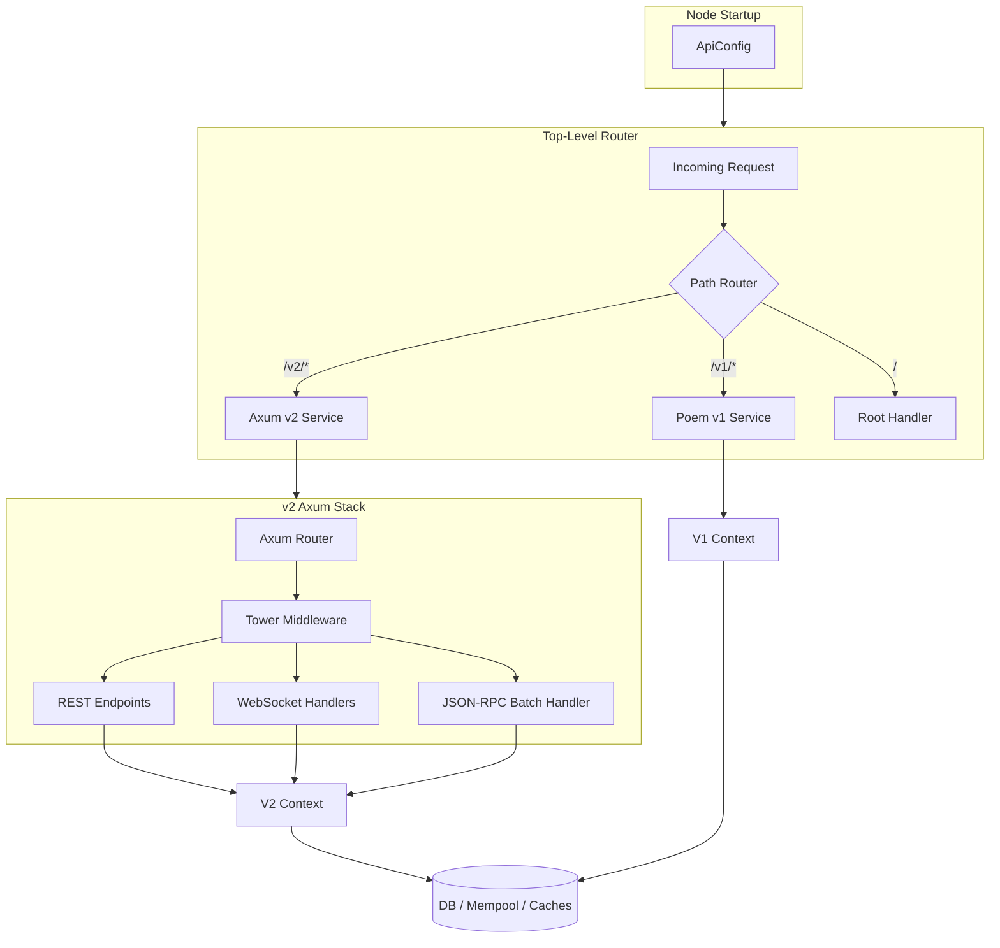

# API v2 Implementation Plan

Implement a high-performance REST API v2 for Aptos Core using Axum, served alongside the existing Poem-based v1 API with configurable routing, supporting WebSockets, HTTP/2, JSON-RPC batching, and structured error responses.

## Architecture Overview



## Task Tracker

- [ ] Create `api/V2_SCRATCHPAD.md` with progress tracker, decisions log, and phase breakdown
- [ ] Add `ApiV2Config` struct and wire into `NodeConfig` / `ApiConfig`
- [ ] Add axum, tower, tower-http, utoipa, hyper-util dependencies to `api/Cargo.toml`
- [ ] Create `api/src/v2/` module structure (mod.rs, context.rs, error.rs, router.rs)
- [ ] Implement `V2Context` wrapping existing `Context` with broadcast channel for WebSocket
- [ ] Implement `V2Error` and `ErrorCode` enum with utoipa schema derivations
- [ ] Implement `VersionedBcsRequest` envelope with ULEB128 enum tag
- [ ] Implement cursor module (`api/src/v2/cursor.rs`) for opaque cursor-based pagination
- [ ] Implement `/v2/health` and `/v2/info` endpoints
- [ ] Implement `/v2/accounts/:addr/resources` and `/v2/accounts/:addr/resource/:type` (paginated)
- [ ] Implement `/v2/accounts/:addr/modules` and `/v2/accounts/:addr/module/:name` (paginated)
- [ ] Implement `/v2/view` (POST, JSON + BCS input, JSON output)
- [ ] Implement `/v2/transactions` (GET paginated list, POST BCS-only submit, GET by hash, GET wait)
- [ ] Implement `/v2/accounts/:addr/transactions` (paginated)
- [ ] Implement `/v2/accounts/:addr/events/:creation_number` (paginated)
- [ ] Implement `/v2/blocks/:height` and `/v2/blocks/latest`
- [ ] Implement `/v2/batch` JSON-RPC 2.0 batch handler (with cursor support for list methods)
- [ ] Implement `/v2/ws` WebSocket upgrade + subscription manager (tx_status, blocks, events)
- [ ] Implement Tower middleware (logging/metrics, size limit, CORS, compression)
- [ ] Integrate Axum v2 router alongside Poem v1 in `runtime.rs` with path-prefix dispatch
- [ ] Configure hyper-util auto HTTP/1.1 + HTTP/2 (h2c) support
- [ ] Wire up utoipa OpenAPI spec generation and serve at `/v2/spec.json`
- [ ] Add unit and integration tests for v2 endpoints, batch, and WebSocket

---

## Phase 1: Foundation

### 1. Create V2 Scratchpad

Create `api/V2_SCRATCHPAD.md` to track progress, decisions, and open questions.

### 2. Configuration Changes

**File**: `config/src/config/api_config.rs`

Add v2-specific config fields to `ApiConfig`:

```rust
pub struct ApiV2Config {
    pub enabled: bool,                     // default: false (opt-in initially)
    pub address: Option<SocketAddr>,       // None = share v1 port, Some = separate port
    pub websocket_enabled: bool,           // default: true
    pub websocket_max_connections: usize,   // default: 1000
    pub websocket_max_subscriptions_per_conn: usize, // default: 10
    pub http2_enabled: bool,               // default: true (h2c)
    pub json_rpc_batch_max_size: usize,    // default: 20
    pub content_length_limit: Option<u64>,
    pub max_runtime_workers: Option<usize>,
    pub runtime_worker_multiplier: usize,
}
```

Add `api_v2: ApiV2Config` to `NodeConfig` (or nest inside existing `ApiConfig`).

### 3. Crate Dependencies

**File**: `api/Cargo.toml`

Add Axum ecosystem dependencies:

- `axum` (with `ws` feature for WebSocket support)
- `axum-extra` (for typed headers, etc.)
- `tower` / `tower-http` (compression, CORS, request-id, tracing middleware)
- `utoipa` + `utoipa-axum` (OpenAPI generation)
- `hyper` (HTTP/2 h2c support)
- `tokio-tungstenite` (pulled in by axum ws feature)

### 4. Module Structure

All v2 code lives under `api/src/v2/`:

```
api/src/
  v2/
    mod.rs              -- Module root, exports, Axum router construction
    context.rs          -- V2Context wrapping v1 Context with v2-specific caches
    router.rs           -- Route definitions and OpenAPI setup
    error.rs            -- Structured error types (ErrorCode enum, V2Error)
    cursor.rs           -- Opaque cursor-based pagination (encode/decode/type-safe accessors)
    middleware/
      mod.rs
      logging.rs        -- Request/response logging + metrics
      size_limit.rs     -- POST body size enforcement
    endpoints/
      mod.rs
      health.rs         -- GET /v2/health, GET /v2/info
      resources.rs      -- GET /v2/accounts/:addr/resources (paginated), GET /v2/accounts/:addr/resource/:type
      modules.rs        -- GET /v2/accounts/:addr/modules (paginated), GET /v2/accounts/:addr/module/:name
      view.rs           -- POST /v2/view
      transactions.rs   -- GET /v2/transactions (paginated), POST /v2/transactions (BCS only), GET /v2/transactions/:hash
      account_transactions.rs -- GET /v2/accounts/:addr/transactions (paginated)
      events.rs         -- GET /v2/accounts/:addr/events/:creation_number (paginated)
      blocks.rs         -- GET /v2/blocks/:height, GET /v2/blocks/latest
    batch.rs            -- POST /v2/batch (JSON-RPC 2.0 handler with cursor support for list methods)
    websocket/
      mod.rs            -- WebSocket upgrade handler
      subscriptions.rs  -- Subscription management (tx status, blocks, events)
      broadcaster.rs    -- Background task broadcasting new blocks/events
    types/
      mod.rs            -- v2-specific request/response types (V2Response, LedgerMetadata)
      error.rs          -- V2Error, ErrorCode enum
      batch.rs          -- JSON-RPC request/response types, PaginatedResult
      ws.rs             -- WebSocket message types
    bcs_versioned.rs    -- Versioned BCS envelope (enum tag + payload)
    extractors.rs       -- JsonOrBcs, BcsOnly Axum extractors
```

### 5. V2 Context

**File**: `api/src/v2/context.rs`

```rust
pub struct V2Context {
    inner: Context,                    // Reuse existing v1 Context
    ws_broadcaster: broadcast::Sender<WsEvent>,  // For WebSocket fan-out
    // v2-specific caches, rate limiters, etc.
}
```

Wraps the existing `Context` from `api/src/context.rs` so both v1 and v2 share the same DB reader, mempool sender, and gas caches.

### 6. Structured Error Model

**File**: `api/src/v2/error.rs`

```rust
#[derive(Serialize, Deserialize, utoipa::ToSchema)]
pub struct V2Error {
    pub code: ErrorCode,           // Machine-readable enum
    pub message: String,           // Human-readable description
    pub request_id: Option<String>,
    pub details: Option<serde_json::Value>,  // Endpoint-specific detail
}

#[derive(Serialize, Deserialize, utoipa::ToSchema)]
#[serde(rename_all = "SCREAMING_SNAKE_CASE")]
pub enum ErrorCode {
    InternalError,
    NotFound,
    InvalidInput,
    InvalidBcsVersion,
    TransactionNotFound,
    ResourceNotFound,
    ViewFunctionFailed,
    MempoolFull,
    GasEstimationFailed,
    RateLimited,
    BatchTooLarge,
    WebSocketError,
    // ...
}
```

### 7. BCS Versioned Envelope

**File**: `api/src/v2/bcs_versioned.rs`

```rust
/// All BCS inputs are wrapped in this envelope.
/// The first bytes are a ULEB128-encoded enum discriminant,
/// followed by the version-specific BCS payload.
#[derive(Serialize, Deserialize)]
pub enum VersionedBcsRequest<V1, V2 = V1> {
    V1(V1),
    V2(V2),
    // Future versions added here
}
```

Transaction submission only accepts BCS (no JSON). View function and other read requests accept both JSON and BCS.

### 8. JSON-RPC 2.0 Batch Endpoint

**File**: `api/src/v2/batch.rs`

```rust
// POST /v2/batch
// Body: JSON array of JSON-RPC 2.0 requests
#[derive(Serialize, Deserialize)]
pub struct JsonRpcRequest {
    pub jsonrpc: String,  // must be "2.0"
    pub method: String,   // e.g. "get_resource", "view", "get_block"
    pub params: serde_json::Value,
    pub id: serde_json::Value,
}
```

Executes requests concurrently (up to `json_rpc_batch_max_size`), returns array of responses.

### 9. WebSocket Support

**File**: `api/src/v2/websocket/`

- Upgrade endpoint at `GET /v2/ws`
- JSON messages for subscribe/unsubscribe
- Subscription types:
  - `transaction_status` -- submit a tx hash, receive status updates until finalized
  - `new_blocks` -- stream of new committed block summaries
  - `events` -- filtered by event type and/or account address
- Background broadcaster task polls DB for new committed blocks/events and fans out to subscribers via `tokio::sync::broadcast`

### 10. Router Integration

**File**: `api/src/runtime.rs`

The key integration point. The current `attach_poem_to_runtime` builds a Poem `Route`. We need to:

1. Convert the Poem service into a Tower `Service` (Poem has `poem::endpoint::TowerCompatExt` or we use `hyper` as the common layer)
2. Build the Axum v2 router
3. Combine them under a top-level Hyper service that routes by path prefix:
   - `/v1/*` -> Poem v1 (if v1 enabled)
   - `/v2/*` -> Axum v2 (if v2 enabled)
   - `/` -> root handler

If both are on the same port, we use a lightweight path-prefix dispatcher at the Hyper service level. If separate ports, each gets its own `TcpListener`.

```rust
// Pseudocode for combined router
async fn route_request(req: Request<Body>) -> Response<Body> {
    let path = req.uri().path();
    if path.starts_with("/v2") && v2_enabled {
        axum_service.call(req).await
    } else if path.starts_with("/v1") && v1_enabled {
        poem_service.call(req).await
    } else {
        // root or 404
    }
}
```

### 11. HTTP/2 Support

Axum on Hyper supports h2c natively. We configure the Hyper server with:

```rust
let server = hyper::server::conn::http2::Builder::new(TokioExecutor::new());
// Or auto-detect h1/h2:
let server = hyper_util::server::conn::auto::Builder::new(TokioExecutor::new());
```

This gives us HTTP/2 cleartext by default, with optional TLS via rustls (using the existing `tls_cert_path`/`tls_key_path` config).

### 12. Initial Core Endpoints (Phase 1)

| Endpoint | Method | Input | Output | Paginated | Notes |
|---|---|---|---|---|---|
| `/v2/health` | GET | - | JSON | No | Health check |
| `/v2/info` | GET | - | JSON | No | Ledger info, chain ID, version |
| `/v2/accounts/:addr/resources` | GET | query params | JSON | Yes (cursor) | Paginated resources |
| `/v2/accounts/:addr/resource/:type` | GET | query params | JSON | No | Single resource |
| `/v2/accounts/:addr/modules` | GET | query params | JSON | Yes (cursor) | Paginated modules |
| `/v2/accounts/:addr/module/:name` | GET | query params | JSON | No | Single module |
| `/v2/transactions` | GET | query params | JSON | Yes (cursor) | List transactions |
| `/v2/transactions` | POST | BCS only | JSON | No | Submit transaction |
| `/v2/transactions/:hash` | GET | - | JSON | No | Get transaction by hash |
| `/v2/transactions/:hash/wait` | GET | - | JSON | No | Wait for tx |
| `/v2/accounts/:addr/transactions` | GET | query params | JSON | Yes (cursor) | Account transactions |
| `/v2/accounts/:addr/events/:num` | GET | query params | JSON | Yes (cursor) | Events by handle |
| `/v2/view` | POST | JSON or BCS | JSON | No | Execute view function |
| `/v2/blocks/:height` | GET | query params | JSON | No | Get block |
| `/v2/blocks/latest` | GET | - | JSON | No | Latest block |
| `/v2/batch` | POST | JSON-RPC 2.0 | JSON | N/A | Batch requests |
| `/v2/ws` | GET | WebSocket upgrade | JSON frames | N/A | Subscriptions |
| `/v2/spec.json` | GET | - | JSON | No | OpenAPI spec |

All paginated endpoints use **opaque cursor-based pagination**: the server returns a
`cursor` field in the response body; clients pass it back via `?cursor=...` to get the
next page. There is no client-facing `limit` parameter -- the server controls page size.
Ledger metadata is returned in the response body (`ledger` field), not in headers.

### 13. Key Design Decisions Summary

- **Framework**: Axum + Tower + Hyper
- **gRPC**: Deferred to Phase 2 (Tonic shares the Tower ecosystem with Axum)
- **WebSocket**: tx status, blocks, events (configurable on/off)
- **Batching**: JSON-RPC 2.0
- **BCS**: Versioned envelope with ULEB128 enum discriminant; tx submission BCS-only
- **Errors**: New structured `V2Error` with machine-readable `ErrorCode` enum; NO ledger metadata in errors
- **OpenAPI**: utoipa + utoipa-axum
- **HTTP/2**: h2c default via hyper-util auto-detection
- **Port**: Configurable same-port or separate-port
- **Context**: V2Context wraps existing Context
- **Response metadata**: All ledger metadata in JSON body (`ledger` field), no `X-Aptos-*` response headers
- **Pagination**: Unified opaque cursor-based pagination on all list endpoints; server-controlled page size; cursor in body (not headers)
- **v1 deprecation**: 3-6 month coexistence once v2 stabilizes
