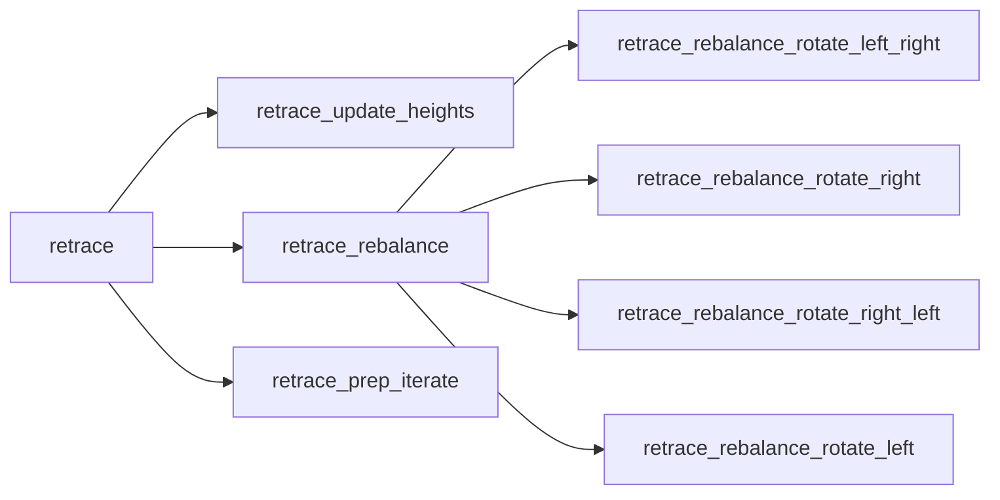
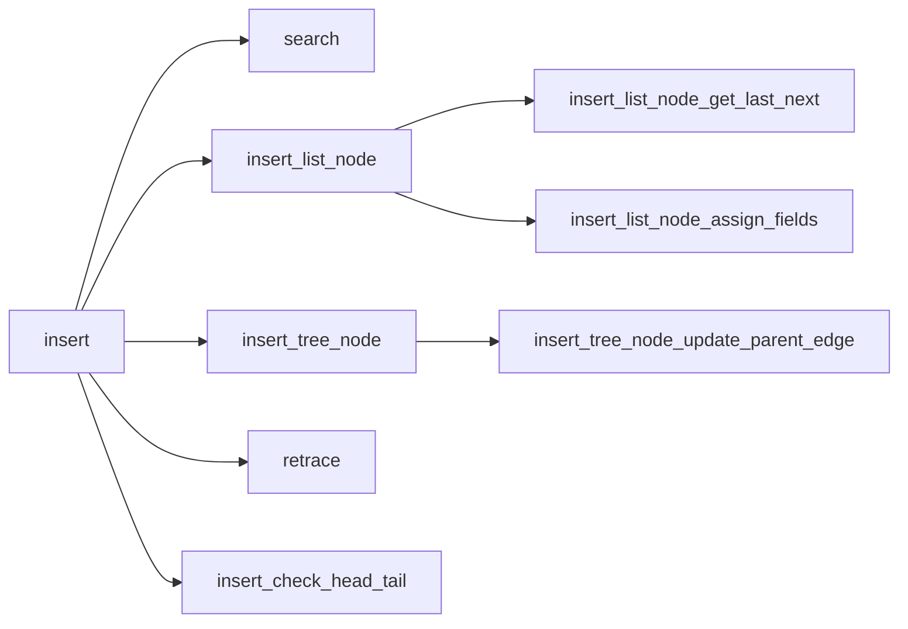
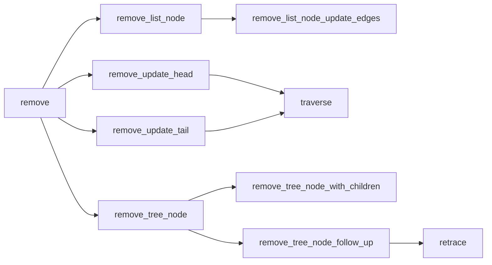
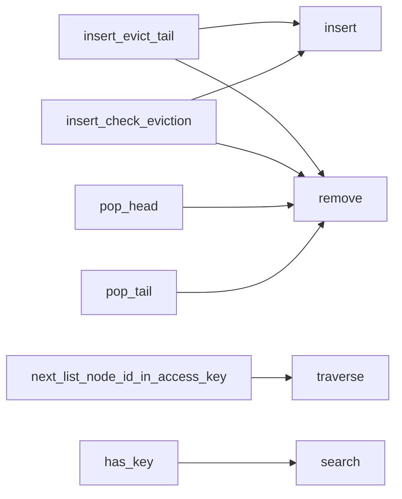

<a id="0x1_avl_queue"></a>

# Module `0x1::avl_queue`

AVL queue: a hybrid between an AVL tree and a queue.

The present implementation involves an Adelson-Velsky and Landis
(AVL) tree, where each tree node has an enclosed doubly linked list.
Tree nodes correspond to keys from key-value insertion pairs, and
list nodes correspond to distinct insertion values sharing the same
insertion key. Hence tree node insertion keys are sorted in
lexicographical order, while list node insertion values are sorted
in order of insertion within a corresponding doubly linked list, to
the effect that key-value insertion pairs can be popped from the
head of the AVL queue in:

1. Either ascending or descending order of insertion key (with
sort order set upon initialization), then by
2. Ascending order of insertion within a doubly linked list.

Like an AVL tree, the present implementation also allows for
insertions and removals from anywhere inside the data structure.


<a id="@General_overview_sections_0"></a>

## General overview sections


[AVL trees](#avl-trees)

* [Height invariant](#height-invariant)
* [Rotations](#rotations)
* [Retracing](#retracing)
* [As a map](#as-a-map)

[AVL queues](#avl-queues)

* [Key storage multiplicity](#key-storage-multiplicity)
* [Sort order](#sort-order)
* [Node structure](#node-structure)
* [Node provisioning](#node-provisioning)
* [Access keys](#access-keys)
* [Height](#height)

[Implementation analysis](#implementation-analysis)

* [Gas considerations](#gas-considerations)
* [Test development](#test-development)
* [Public function index](#public-function-index)
* [Dependency charts](#dependency-charts)

[Bit conventions](#bit-conventions)

* [Number](#number)
* [Status](#status)
* [Masking](#masking)

[References](#references)

[Complete DocGen index](#complete-docgen-index)


<a id="@AVL_trees_1"></a>

## AVL trees


<a id="@Height_invariant_2"></a>

### Height invariant


An AVL tree is a self-balancing binary search tree where the height
of a node's two child subtrees differ by at most one. For example:

>         3
>        / \
>       2   5
>      /   / \
>     1   4   7
>            / \
>           6   8

Here, node 3's left child subtree has height 1 while its right child
subtree has height 2. Similarly, all other nodes satisfy the AVL
height invariant.


<a id="@Rotations_3"></a>

### Rotations


Continuing the above example, if node 4 were to be removed then node
5 would violate the height invariant:

>         3
>        / \
>       2   5
>      /     \
>     1       7
>            / \
>           6   8

Here, a left rotation is necessary to rebalance the tree, yielding:

>         3
>        / \
>       2   7
>      /   / \
>     1   5   8
>          \
>           6

Rotations are required whenever an insertion or removal leads to a
violation of the AVL height invariant.


<a id="@Retracing_4"></a>

### Retracing


Similarly, insertion and removal operations may require retracing up
to the root, a process that updates node-wise state pertaining to
the height invariant.

Here, some implementations encode in each node a  "balance factor"
that describes whether a given node is left-heavy, right-heavy, or
balanced, while others track the height at a given node, as in the
present implementation. For example, consider the following tree:

>       2
>      / \
>     1   3

Here, nodes 1 and 3 have height 0, while node 2 has height 1.
Inserting 4 yields:

>       2
>      / \
>     1   3
>          \
>           4

Now node 4 has height 0, and the heights of nodes 3 and 2 have both
increased by 1. In practice, this means that inserting node 4 will
require modifying state in node 3 and in node 2, by looping back up
to the root to update heights, checking along the way whether a
height modification leads to an invariant violation.


<a id="@As_a_map_5"></a>

### As a map


AVL trees can be used as an associative array that maps from keys to
values, simply by storing values in the leaves of the tree. For
example, the insertion sequence

1. $\langle 2, a \rangle$
2. $\langle 3, b \rangle$
3. $\langle 1, c \rangle$
4. $\langle 4, d \rangle$

produces:

>          <2, a>
>          /    \
>     <1, c>    <3, b>
>                    \
>                    <4, d>

Notably, in an AVL tree, keys can only be inserted once, such that
inserting $\langle 2, e \rangle$ to the above tree would be invalid
unless $\langle 2, a \rangle$ were first removed.


<a id="@AVL_queues_6"></a>

## AVL queues


<a id="@Key_storage_multiplicity_7"></a>

### Key storage multiplicity


Unlike an AVL tree, which can only store one instance of a given
key, AVL queues can store multiple instances. For example, the
following insertion sequence, without intermediate removals, is
invalid in an AVL tree but valid in an AVL queue:

1. $p_{3, 0} = \langle 3, 5 \rangle$
2. $p_{3, 1} = \langle 3, 8 \rangle$
3. $p_{3, 2} = \langle 3, 2 \rangle$
4. $p_{3, 3} = \langle 3, 5 \rangle$

Here, the "key-value insertion pair"
$p_{i, j} = \langle i, v_j \rangle$ has:

* "Insertion key" $i$: the inserted key.
* "Insertion count" $j$: the number of key-value insertion pairs,
having the same insertion key, that were previously inserted.
* "Insertion value" $v_j$: the value from the key-value
insertion pair having insertion count $j$.


<a id="@Sort_order_8"></a>

### Sort order


Key-value insertion pairs in an AVL queue are sorted by:

1. Either ascending or descending order of insertion key, then by
2. Ascending order of insertion count.

For example, consider the key-value pair insertion pairs inserted in
the following sequence:

1. $p_{1, 0} = \langle 1, a \rangle$
2. $p_{3, 0} = \langle 3, b \rangle$
3. $p_{3, 1} = \langle 3, c \rangle$
4. $p_{1, 1} = \langle 1, d \rangle$
5. $p_{2, 0} = \langle 2, e \rangle$

In an ascending AVL queue, the dequeue sequence would be:

1. $p_{1, 0} = \langle 1, a \rangle$
2. $p_{1, 1} = \langle 1, d \rangle$
3. $p_{2, 0} = \langle 2, e \rangle$
4. $p_{3, 0} = \langle 3, b \rangle$
5. $p_{3, 1} = \langle 3, c \rangle$

In a descending AVL queue, the dequeue sequence would instead be:

1. $p_{3, 0} = \langle 3, b \rangle$
2. $p_{3, 1} = \langle 3, c \rangle$
3. $p_{2, 0} = \langle 2, e \rangle$
4. $p_{1, 0} = \langle 1, a \rangle$
5. $p_{1, 1} = \langle 1, d \rangle$


<a id="@Node_structure_9"></a>

### Node structure


Continuing the above example, key-value insertion pairs would be
stored in an ascending AVL queue as follows:

>                              2 [e]
>                             / \
>                   [a -> d] 1   3 [b -> c]
>     AVL queue head ^                   ^ AVL queue tail

In a descending AVL queue:

>                         2 [e]
>                        / \
>              [a -> d] 1   3 [b -> c]
>     AVL queue tail ^         ^ AVL queue head

For each case, the tree node with insertion key 1 has a doubly
linked list where the head list node has insertion value a, and the
tail list node has insertion value d. Similarly, the tree node with
insertion key 3 has a doubly linked list where the head list node
has insertion value b, and the tail list node has insertion value c.


<a id="@Node_provisioning_10"></a>

### Node provisioning


Tree nodes and list nodes are stored as hash table entries, and thus
incur per-item global storage costs on the Aptos blockchain. As of
the time of this writing, per-item creation costs are by far the
most expensive per-item operation, and moreover, there is no
incentive to deallocate from memory. Hence the typical approach of
allocating a node upon insertion and deallocating upon removal is
more costly than the approach taken in the present implementation,
which involves re-using nodes once they have been allocated.

More specifically, when a tree node or list node is removed from the
AVL queue, it is pushed onto a stack of inactive nodes for the
corresponding type. Then, when an insertion operation requires a new
node, the inactive node can be popped off the top of the stack and
overwritten. Rather than allocating a new node for each insertion
and deallocating for each removal, this approach minimizes per-item
creation costs. Additionally, nodes can be pre-allocated upon AVL
queue initialization and pushed directly on the inactive nodes stack
so as to reduce per-item costs for future operations.

Since each active tree node contains a doubly linked list having at
least one active list node, the number of active tree nodes is
less than or equal to the number of active list nodes.

Tree nodes and list nodes are each assigned a 1-indexed 14-bit
serial ID known as a node ID. Node ID 0 is reserved for null, such
that the maximum number of allocated nodes for each node type is
thus $2^{14} - 1 = 16383$.

To additionally reduce costs, insertion values are not stored in
list nodes, but are also stored as hash table entries, accessed via
the corresponding list node ID. This approach reduces per-byte costs
associated with list node operations: if a list node is removed from
the middle of a doubly linked list, for example, per-byte write
costs will only be assessed on the next and last fields of the
removed node's neighbors, and will not be assessed on the neighbors'
insertion values.


<a id="@Access_keys_11"></a>

### Access keys


When a key-value insertion pair is inserted to the AVL queue, an
"access key" is returned, and can be used for subsequent lookup
operations. Access keys have the following bit structure:

| Bit(s) | Data                                         |
|--------|----------------------------------------------|
| 47-60  | Tree node ID                                 |
| 33-46  | List node ID                                 |
| 32     | If set, ascending AVL queue, else descending |
| 0-31   | Insertion key                                |

Insertion values are indexed by list node ID, and since the list
node ID for an insertion value is encoded in the access key
returned upon insertion, access keys can be used for $O(1)$ list
node lookup.

With the exception of list nodes at the head or tail of their
corresponding doubly linked list, list nodes do not, however,
indicate the corresponding tree node in which their doubly linked
list is located. This means that the corresponding tree node ID
and insertion key encoded in an access key are not verified from the
provided access key during lookup, as this process would require
$O(\log_2 n)$ lookup on the tree node.

Lookup operations thus assume that the provided access key
corresponds to a valid list node in the given AVL queue, and are
subject to undefined behavior if this condition is not met.

Notably, access keys are guaranteed to be unique within an AVL queue
at any given time, but are not guaranteed to be unique within an
AVL queue across time: since node IDs are reused per the stack-based
allocation strategy above, the same access key can be issued
multiple times. Hence it is up to callers to ensure appropriate
management of access keys, which effectively function as pointers
into AVL queue memory. Notably, if a caller wishes to uniquely
identify issued access keys, the caller can simply concatenate
access keys with a global counter.

Bits 0-32 are not required for lookup operations, but rather, are
included in access keys simply to provide additional metadata.


<a id="@Height_12"></a>

### Height


In the present implementation, left or right height denotes the
height of a node's left or right subtree, respectively, plus one.
Subtree height is adjusted by one to avoid negative numbers, with
the resultant value denoting the height of a tree rooted at the
given node, accounting only for height to the given side. The height
of a node is denoted as the larger of its left height and right
height:

>       2
>      / \
>     1   3
>          \
>           4

| Key | Left height | Right height | Height |
|-----|-------------|--------------|--------|
| 1   | 0           | 0            | 0      |
| 2   | 1           | 2            | 2      |
| 3   | 0           | 1            | 1      |
| 4   | 0           | 0            | 0      |

The overall height $h$ of a tree (the height of the root node) is
related to the number of levels $l$ in the tree by the equation
$h = l - 1$, and for an AVL tree of size $n \geq 1$ nodes, the
number of levels in the tree lies in the interval

$$\log_2(n + 1) \leq l \leq c \log_2(n + d) + b$$

where

* $\varphi = \frac{1 + \sqrt{5}}{2} \approx 1.618$ (the golden
ratio),
* $c = \frac{1}{\log_2 \varphi} \approx 1.440$ ,
* $b = \frac{c}{2} \log_2 5 - 2 \approx -0.3277$ , and
* $d = 1 + \frac{1}{\varphi^4 \sqrt{5}} \approx 1.065$ .

With a maximum node count of $n_{max} = 2^{14} - 1 = 16383$, the
the maximum height $h_{max}$ of an AVL tree in the present
implementation is thus

$$h_{max} = \lfloor c \log_2(n_{max} + d) + b \rfloor - 1 = 18$$

such that left height and right height can always be encoded in
$b_{max} = \lceil \log_2 h_{max} \rceil = 5$ bits each.

Similarly, for a given height the size of an AVL tree is at most

$$log_2(n + 1) \leq h + 1$$

$$n + 1 \leq 2^{h + 1}$$

$$n \leq 2^{h + 1} - 1$$

and at least

$$c \log_2(n + d) + b \geq h + 1$$

$$\log_{\varphi}(n + d) + b \geq h + 1$$

$$\log_{\varphi}(n + d) \geq h + 1 - b$$

$$n + d \geq \varphi^{h + 1 - b}$$

$$n \geq \varphi^{h + 1 - b} - d$$

such that size lies in the interval

$$\varphi ^ {h +1 - b} - d \leq n \leq 2^{h + 1} - 1$$

which, for the special case of $h = 1$, results in the integer lower
bound

$$n_{h = 1} \geq \varphi ^ {1 + 1 - b} - d$$

$$n_{h = 1} \geq \varphi ^ {2 - b} - d$$

$$n_{h = 1} \geq \varphi ^ {2 - (\frac{c}{2}\log_2 5 - 2)} - d$$

$$n_{h = 1} \geq \varphi ^ {4 - \frac{c}{2}\log_2 5} - d$$

$$n_{h = 1} \geq \varphi ^ {4 - \frac{1}{2}\log_\varphi 5} - d$$

$$n_{h = 1} \geq \varphi ^ {4 - \log_\varphi \sqrt{5}} - d$$

$$n_{h = 1} \geq \varphi^4 / \varphi^{\log_\varphi \sqrt{5}} - d$$

$$n_{h = 1} \geq \varphi^4 / \sqrt{5} - d$$

$$n_{h = 1} \geq \varphi^4/\sqrt{5}-(1+1/(\varphi^4 \sqrt{5}))$$

$$n_{h=1}\geq(1+s)^4/(2^4s)-1-2^4/((1+s)^4s), s = \sqrt{5}$$

$$n_{h=1}\geq\frac{(1+s)^4}{2^4s}-\frac{2^4}{s(1+s)^4}-1$$

$$n_{h = 1} \geq 2$$

with the final step verifiable via a computer algebra system like
WolframAlpha. Thus for the heights possible in the present
implementation (and for one height higher):

| Height       | Minimum size | Maximum size    |
|--------------|--------------|-----------------|
| 0            | 1            | 1               |
| 1            | 2            | 3               |
| 2            | 4            | 7               |
| 3            | 7            | 15              |
| 4            | 12           | 31              |
| 5            | 20           | 63              |
| 6            | 33           | 127             |
| 7            | 54           | 255             |
| 8            | 88           | 511             |
| 9            | 143          | 1023            |
| 10           | 232          | 2047            |
| 11           | 376          | 4095            |
| 12           | 609          | 8191            |
| 13           | 986          | 16383 (<code>n_max</code>) |
| 14           | 1596         | 32767           |
| 15           | 2583         | 65535           |
| 16           | 4180         | 131071          |
| 17           | 6764         | 262143          |
| 18 (<code>h_max</code>) | 10945        | 524287          |
| 19           | 17710        | 1048575         |

Supporting Python calculations:

```python
>>> import math
>>> phi = (1 + math.sqrt(5)) / 2
>>> phi
1.618033988749895
>>> c = 1 / math.log(phi, 2)
>>> c
1.4404200904125564
>>> b = c / 2 * math.log(5, 2) - 2
>>> b
-0.32772406181544556
>>> d = 1 + 1 / (phi ** 4 * math.sqrt(5))
>>> d
1.0652475842498528
>>> n_max = 2 ** 14 - 1
>>> n_max
16383
>>> h_max = math.floor(c * math.log(n_max + d, 2) + b) - 1
>>> h_max
18
>>> b_max = math.ceil(math.log(h_max, 2))
>>> b_max
5
>>> for h in range(h_max + 2):
...     if h == 1:
...         n_min = 2
...     else:
...         n_min = phi ** (h + 1 - b) - d
...     n_max = 2 ** (h + 1) - 1
...     n_min_ceil = math.ceil(n_min)
...     print(f"h: {h}, n_min: {n_min_ceil}, n_max: {n_max}, "
...           f"n_min_raw: {n_min}")
...
h: 0, n_min: 1, n_max: 1, n_min_raw: 0.8291796067500634
h: 1, n_min: 2, n_max: 3, n_min_raw: 2
h: 2, n_min: 4, n_max: 7, n_min_raw: 3.894427190999917
h: 3, n_min: 7, n_max: 15, n_min_raw: 6.959674775249768
h: 4, n_min: 12, n_max: 31, n_min_raw: 11.919349550499538
h: 5, n_min: 20, n_max: 63, n_min_raw: 19.944271909999163
h: 6, n_min: 33, n_max: 127, n_min_raw: 32.92886904474855
h: 7, n_min: 54, n_max: 255, n_min_raw: 53.93838853899757
h: 8, n_min: 88, n_max: 511, n_min_raw: 87.93250516799598
h: 9, n_min: 143, n_max: 1023, n_min_raw: 142.93614129124342
h: 10, n_min: 232, n_max: 2047, n_min_raw: 231.93389404348926
h: 11, n_min: 376, n_max: 4095, n_min_raw: 375.9352829189826
h: 12, n_min: 609, n_max: 8191, n_min_raw: 608.9344245467217
h: 13, n_min: 986, n_max: 16383, n_min_raw: 985.9349550499542
h: 14, n_min: 1596, n_max: 32767, n_min_raw: 1595.9346271809259
h: 15, n_min: 2583, n_max: 65535, n_min_raw: 2582.93482981513
h: 16, n_min: 4180, n_max: 131071, n_min_raw: 4179.934704580306
h: 17, n_min: 6764, n_max: 262143, n_min_raw: 6763.934781979686
h: 18, n_min: 10945, n_max: 524287, n_min_raw: 10944.93473414424
h: 19, n_min: 17710, n_max: 1048575, n_min_raw: 17709.934763708177
```


<a id="@Implementation_analysis_13"></a>

## Implementation analysis


<a id="@Gas_considerations_14"></a>

### Gas considerations


The present implementation relies on bit packing in assorted forms
to minimize per-byte storage costs: insertion keys are at most 32
bits and node IDs are 14 bits, for example, for maximum data
compression. Notably, associated bit packing operations are manually
inlined to reduce the number of function calls: as of the time of
this writing, instruction gas for 15 function calls costs the same
as a single per-item read out of global storage. Hence inlined
bit packing significantly reduces the number of function calls when
compared against an implementation with frequent calls to helper
functions of the form <code>mask_in_bits(target, incoming, shift)</code>.

As of the time of this writing, per-item reads and per-item writes
cost the same amount of storage gas, per-item writes cost 60 times
as much as per-byte writes, and per-byte writes cost approximately
16.7 times as much as per-item writes. Hence with tree nodes only
occupying 128 bits (16 bytes), writing to a tree node only costs
about 25% more then reading a tree node.

With storage gas only assessed on a per-transaction basis, this
means that inserting a tree node and retracing all the way back up
to the root only costs 25% more than does the $O(\log_2 n)$ lookup
required for a key search, assuming no rebalancing takes place:
per-item read costs are assessed on the way down, then replaced by
per-item write costs on the way back up.

As for rebalancing, this process is only (potentially) required for
operations that alter the number of tree nodes: if key-value
insertion pair operations consistently involve the same insertion
keys, then tree retracing and rebalancing operations are minimized.

In the case that rebalancing does occur, per-item write costs on the
affected nodes are essentially amortized against the gas reductions
afforded by an AVL tree's height guarantees: the height of a
red-black tree is at most $2 \log_2 n$, for example, but the
height of an AVL tree is at most approximately $1.44 \log_2 n$
(per above). This means that fewer per-item costs are assessed on
key lookup for the latter, and moreover, re-coloring operations
required for the former may still require looping back up to the
root in the worst case, resulting in higher per-item write costs.


<a id="@Test_development_15"></a>

### Test development


Unit tests for the present implementation were written alongside
source code, with some integration refactors applied along the way.
For example, rotation tests were first devised based on manual
allocation of nodes, then some were later updated for specific
insertion and deletion scenarios. As such, syntax may vary
slightly between some test cases depending on the level to which
they were later scoped for integration.


<a id="@Public_function_index_16"></a>

### Public function index


* <code><a href="avl_tree.md#0x1_avl_queue_borrow">borrow</a>()</code>
* <code><a href="avl_tree.md#0x1_avl_queue_borrow_head">borrow_head</a>()</code>
* <code><a href="avl_tree.md#0x1_avl_queue_borrow_head_mut">borrow_head_mut</a>()</code>
* <code><a href="avl_tree.md#0x1_avl_queue_borrow_mut">borrow_mut</a>()</code>
* <code><a href="avl_tree.md#0x1_avl_queue_borrow_tail">borrow_tail</a>()</code>
* <code><a href="avl_tree.md#0x1_avl_queue_borrow_tail_mut">borrow_tail_mut</a>()</code>
* <code><a href="avl_tree.md#0x1_avl_queue_contains_active_list_node_id">contains_active_list_node_id</a>()</code>
* <code><a href="avl_tree.md#0x1_avl_queue_get_access_key_insertion_key">get_access_key_insertion_key</a>()</code>
* <code><a href="avl_tree.md#0x1_avl_queue_get_head_key">get_head_key</a>()</code>
* <code><a href="avl_tree.md#0x1_avl_queue_get_height">get_height</a>()</code>
* <code><a href="avl_tree.md#0x1_avl_queue_get_tail_key">get_tail_key</a>()</code>
* <code><a href="avl_tree.md#0x1_avl_queue_has_key">has_key</a>()</code>
* <code><a href="avl_tree.md#0x1_avl_queue_insert">insert</a>()</code>
* <code><a href="avl_tree.md#0x1_avl_queue_insert_check_eviction">insert_check_eviction</a>()</code>
* <code><a href="avl_tree.md#0x1_avl_queue_insert_evict_tail">insert_evict_tail</a>()</code>
* <code><a href="avl_tree.md#0x1_avl_queue_is_ascending">is_ascending</a>()</code>
* <code><a href="avl_tree.md#0x1_avl_queue_is_ascending_access_key">is_ascending_access_key</a>()</code>
* <code><a href="avl_tree.md#0x1_avl_queue_is_empty">is_empty</a>()</code>
* <code><a href="avl_tree.md#0x1_avl_queue_is_local_tail">is_local_tail</a>()</code>
* <code><a href="avl_tree.md#0x1_avl_queue_new">new</a>()</code>
* <code><a href="avl_tree.md#0x1_avl_queue_next_list_node_id_in_access_key">next_list_node_id_in_access_key</a>()</code>
* <code><a href="avl_tree.md#0x1_avl_queue_pop_head">pop_head</a>()</code>
* <code><a href="avl_tree.md#0x1_avl_queue_pop_tail">pop_tail</a>()</code>
* <code><a href="avl_tree.md#0x1_avl_queue_remove">remove</a>()</code>
* <code><a href="avl_tree.md#0x1_avl_queue_would_update_head">would_update_head</a>()</code>
* <code><a href="avl_tree.md#0x1_avl_queue_would_update_tail">would_update_tail</a>()</code>


<a id="@Dependency_charts_17"></a>

### Dependency charts


The below dependency charts use <code>mermaid.js</code> syntax, which can be
automatically rendered into a diagram (depending on the browser)
when viewing the documentation file generated from source code. If
a browser renders the diagrams with coloring that makes it difficult
to read, try a different browser.

<code><a href="avl_tree.md#0x1_avl_queue_retrace">retrace</a>()</code>:



<code><a href="avl_tree.md#0x1_avl_queue_insert">insert</a>()</code>:



<code><a href="avl_tree.md#0x1_avl_queue_remove">remove</a>()</code>:



Assorted:




<a id="@Bit_conventions_18"></a>

## Bit conventions


<a id="@Number_19"></a>

### Number


Bit numbers are 0-indexed from the least-significant bit (LSB):

>     11101...1010010101
>       bit 5 = 0 ^    ^ bit 0 = 1


<a id="@Status_20"></a>

### Status


<code>0</code> is considered an "unset" bit, and <code>1</code> is considered a "set" bit.
Hence <code>11101</code> is set at bit 0 and unset at bit 1.


<a id="@Masking_21"></a>

### Masking


In the present implementation, a bitmask refers to a bitstring that
is only set at the indicated bit. For example, a bitmask with bit 0
set corresponds to <code>000...001</code>, and a bitmask with bit 3 set
corresponds to <code>000...01000</code>.


<a id="@References_22"></a>

## References


* [Adelson-Velsky and Landis 1962] (original paper)
* [Galles 2011] (interactive visualizer)
* [Wikipedia 2022]

[Adelson-Velsky and Landis 1962]:
https://zhjwpku.com/assets/pdf/AED2-10-avl-paper.pdf
[Galles 2011]:
https://www.cs.usfca.edu/~galles/visualization/AVLtree.html
[Wikipedia 2022]:
https://en.wikipedia.org/wiki/AVL_tree


<a id="@Complete_DocGen_index_23"></a>

## Complete DocGen index


The below index is automatically generated from source code:


-  [General overview sections](#@General_overview_sections_0)
-  [AVL trees](#@AVL_trees_1)
    -  [Height invariant](#@Height_invariant_2)
    -  [Rotations](#@Rotations_3)
    -  [Retracing](#@Retracing_4)
    -  [As a map](#@As_a_map_5)
-  [AVL queues](#@AVL_queues_6)
    -  [Key storage multiplicity](#@Key_storage_multiplicity_7)
    -  [Sort order](#@Sort_order_8)
    -  [Node structure](#@Node_structure_9)
    -  [Node provisioning](#@Node_provisioning_10)
    -  [Access keys](#@Access_keys_11)
    -  [Height](#@Height_12)
-  [Implementation analysis](#@Implementation_analysis_13)
    -  [Gas considerations](#@Gas_considerations_14)
    -  [Test development](#@Test_development_15)
    -  [Public function index](#@Public_function_index_16)
    -  [Dependency charts](#@Dependency_charts_17)
-  [Bit conventions](#@Bit_conventions_18)
    -  [Number](#@Number_19)
    -  [Status](#@Status_20)
    -  [Masking](#@Masking_21)
-  [References](#@References_22)
-  [Complete DocGen index](#@Complete_DocGen_index_23)
-  [Struct `AVLqueue`](#0x1_avl_queue_AVLqueue)
-  [Struct `TreeNode`](#0x1_avl_queue_TreeNode)
-  [Struct `ListNode`](#0x1_avl_queue_ListNode)
-  [Constants](#@Constants_24)
-  [Function `borrow`](#0x1_avl_queue_borrow)
    -  [Assumptions](#@Assumptions_25)
    -  [Testing](#@Testing_26)
-  [Function `borrow_head`](#0x1_avl_queue_borrow_head)
    -  [Testing](#@Testing_27)
-  [Function `borrow_head_mut`](#0x1_avl_queue_borrow_head_mut)
    -  [Testing](#@Testing_28)
-  [Function `borrow_mut`](#0x1_avl_queue_borrow_mut)
    -  [Assumptions](#@Assumptions_29)
    -  [Testing](#@Testing_30)
-  [Function `borrow_tail`](#0x1_avl_queue_borrow_tail)
    -  [Testing](#@Testing_31)
-  [Function `borrow_tail_mut`](#0x1_avl_queue_borrow_tail_mut)
    -  [Testing](#@Testing_32)
-  [Function `contains_active_list_node_id`](#0x1_avl_queue_contains_active_list_node_id)
    -  [Testing](#@Testing_33)
-  [Function `get_access_key_insertion_key`](#0x1_avl_queue_get_access_key_insertion_key)
    -  [Testing](#@Testing_34)
-  [Function `get_head_key`](#0x1_avl_queue_get_head_key)
    -  [Testing](#@Testing_35)
-  [Function `get_height`](#0x1_avl_queue_get_height)
    -  [Reference diagram](#@Reference_diagram_36)
    -  [Testing](#@Testing_37)
-  [Function `get_tail_key`](#0x1_avl_queue_get_tail_key)
    -  [Testing](#@Testing_38)
-  [Function `has_key`](#0x1_avl_queue_has_key)
    -  [Aborts](#@Aborts_39)
    -  [Testing](#@Testing_40)
-  [Function `insert`](#0x1_avl_queue_insert)
    -  [Parameters](#@Parameters_41)
    -  [Returns](#@Returns_42)
    -  [Aborts](#@Aborts_43)
    -  [Failure testing](#@Failure_testing_44)
    -  [State verification testing](#@State_verification_testing_45)
-  [Function `insert_check_eviction`](#0x1_avl_queue_insert_check_eviction)
    -  [Parameters](#@Parameters_46)
    -  [Returns](#@Returns_47)
    -  [Aborts](#@Aborts_48)
    -  [Reference diagrams](#@Reference_diagrams_49)
        -  [Case 1](#@Case_1_50)
        -  [Case 2](#@Case_2_51)
    -  [Testing](#@Testing_52)
-  [Function `insert_evict_tail`](#0x1_avl_queue_insert_evict_tail)
    -  [Parameters](#@Parameters_53)
    -  [Returns](#@Returns_54)
    -  [Aborts](#@Aborts_55)
    -  [Testing](#@Testing_56)
-  [Function `is_ascending`](#0x1_avl_queue_is_ascending)
    -  [Testing](#@Testing_57)
-  [Function `is_ascending_access_key`](#0x1_avl_queue_is_ascending_access_key)
    -  [Testing](#@Testing_58)
-  [Function `is_empty`](#0x1_avl_queue_is_empty)
    -  [Testing](#@Testing_59)
-  [Function `is_local_tail`](#0x1_avl_queue_is_local_tail)
    -  [Testing](#@Testing_60)
-  [Function `new`](#0x1_avl_queue_new)
    -  [Parameters](#@Parameters_61)
    -  [Returns](#@Returns_62)
    -  [Aborts](#@Aborts_63)
    -  [Testing](#@Testing_64)
-  [Function `next_list_node_id_in_access_key`](#0x1_avl_queue_next_list_node_id_in_access_key)
    -  [Parameters](#@Parameters_65)
    -  [Returns](#@Returns_66)
    -  [Testing](#@Testing_67)
-  [Function `pop_head`](#0x1_avl_queue_pop_head)
    -  [Testing](#@Testing_68)
-  [Function `pop_tail`](#0x1_avl_queue_pop_tail)
    -  [Testing](#@Testing_69)
-  [Function `remove`](#0x1_avl_queue_remove)
    -  [Parameters](#@Parameters_70)
    -  [Assumptions](#@Assumptions_71)
    -  [Reference diagram](#@Reference_diagram_72)
        -  [Case 1 (ascending head updates)](#@Case_1_(ascending_head_updates)_73)
        -  [Case 2 (ascending tail updates)](#@Case_2_(ascending_tail_updates)_74)
        -  [Case 3 (descending head updates)](#@Case_3_(descending_head_updates)_75)
        -  [Case 4 (descending tail updates)](#@Case_4_(descending_tail_updates)_76)
    -  [Testing](#@Testing_77)
-  [Function `would_update_head`](#0x1_avl_queue_would_update_head)
    -  [Aborts](#@Aborts_78)
    -  [Testing](#@Testing_79)
-  [Function `would_update_tail`](#0x1_avl_queue_would_update_tail)
    -  [Aborts](#@Aborts_80)
    -  [Testing](#@Testing_81)
-  [Function `insert_check_head_tail`](#0x1_avl_queue_insert_check_head_tail)
    -  [Parameters](#@Parameters_82)
    -  [Testing](#@Testing_83)
-  [Function `insert_list_node`](#0x1_avl_queue_insert_list_node)
    -  [Parameters](#@Parameters_84)
    -  [Returns](#@Returns_85)
    -  [Testing](#@Testing_86)
-  [Function `insert_list_node_assign_fields`](#0x1_avl_queue_insert_list_node_assign_fields)
    -  [Parameters](#@Parameters_87)
    -  [Returns](#@Returns_88)
    -  [Aborts](#@Aborts_89)
    -  [Testing](#@Testing_90)
-  [Function `insert_list_node_get_last_next`](#0x1_avl_queue_insert_list_node_get_last_next)
    -  [Parameters](#@Parameters_91)
    -  [Returns](#@Returns_92)
    -  [Testing](#@Testing_93)
-  [Function `insert_tree_node`](#0x1_avl_queue_insert_tree_node)
    -  [Parameters](#@Parameters_94)
    -  [Returns](#@Returns_95)
    -  [Assumptions](#@Assumptions_96)
    -  [Testing](#@Testing_97)
-  [Function `insert_tree_node_update_parent_edge`](#0x1_avl_queue_insert_tree_node_update_parent_edge)
    -  [Parameters](#@Parameters_98)
    -  [Testing](#@Testing_99)
-  [Function `remove_list_node`](#0x1_avl_queue_remove_list_node)
    -  [Parameters](#@Parameters_100)
    -  [Returns](#@Returns_101)
    -  [Testing](#@Testing_102)
-  [Function `remove_list_node_update_edges`](#0x1_avl_queue_remove_list_node_update_edges)
    -  [Parameters](#@Parameters_103)
    -  [Returns](#@Returns_104)
    -  [Testing](#@Testing_105)
-  [Function `remove_tree_node`](#0x1_avl_queue_remove_tree_node)
    -  [Parameters](#@Parameters_106)
    -  [Case 1](#@Case_1_107)
    -  [Case 2](#@Case_2_108)
        -  [Left child](#@Left_child_109)
        -  [Right child](#@Right_child_110)
    -  [Case 3](#@Case_3_111)
    -  [Testing](#@Testing_112)
-  [Function `remove_tree_node_follow_up`](#0x1_avl_queue_remove_tree_node_follow_up)
    -  [Parameters](#@Parameters_113)
    -  [Testing](#@Testing_114)
-  [Function `remove_tree_node_with_children`](#0x1_avl_queue_remove_tree_node_with_children)
    -  [Parameters](#@Parameters_115)
    -  [Returns](#@Returns_116)
    -  [Predecessor is immediate child](#@Predecessor_is_immediate_child_117)
    -  [Predecessor is not immediate child](#@Predecessor_is_not_immediate_child_118)
    -  [Reference diagrams](#@Reference_diagrams_119)
        -  [Case 1](#@Case_1_120)
        -  [Case 2](#@Case_2_121)
        -  [Case 3](#@Case_3_122)
    -  [Testing](#@Testing_123)
-  [Function `remove_update_head`](#0x1_avl_queue_remove_update_head)
    -  [Parameters](#@Parameters_124)
    -  [Testing](#@Testing_125)
-  [Function `remove_update_tail`](#0x1_avl_queue_remove_update_tail)
    -  [Parameters](#@Parameters_126)
    -  [Testing](#@Testing_127)
-  [Function `retrace`](#0x1_avl_queue_retrace)
    -  [Parameters](#@Parameters_128)
    -  [Testing](#@Testing_129)
        -  [Reference diagram](#@Reference_diagram_130)
-  [Function `retrace_prep_iterate`](#0x1_avl_queue_retrace_prep_iterate)
    -  [Parameters](#@Parameters_131)
    -  [Returns](#@Returns_132)
    -  [Testing](#@Testing_133)
        -  [Case 1](#@Case_1_134)
        -  [Case 2](#@Case_2_135)
        -  [Case 3](#@Case_3_136)
-  [Function `retrace_rebalance`](#0x1_avl_queue_retrace_rebalance)
    -  [Parameters](#@Parameters_137)
    -  [Returns](#@Returns_138)
    -  [Node x status](#@Node_x_status_139)
        -  [Node x left-heavy](#@Node_x_left-heavy_140)
        -  [Node x right-heavy](#@Node_x_right-heavy_141)
    -  [Testing](#@Testing_142)
-  [Function `retrace_rebalance_rotate_left`](#0x1_avl_queue_retrace_rebalance_rotate_left)
    -  [Parameters](#@Parameters_143)
    -  [Returns](#@Returns_144)
    -  [Reference rotations](#@Reference_rotations_145)
        -  [Case 1](#@Case_1_146)
        -  [Case 2](#@Case_2_147)
    -  [Testing](#@Testing_148)
-  [Function `retrace_rebalance_rotate_left_right`](#0x1_avl_queue_retrace_rebalance_rotate_left_right)
    -  [Procedure](#@Procedure_149)
    -  [Reference rotations](#@Reference_rotations_150)
        -  [Case 1](#@Case_1_151)
        -  [Case 2](#@Case_2_152)
    -  [Testing](#@Testing_153)
-  [Function `retrace_rebalance_rotate_right`](#0x1_avl_queue_retrace_rebalance_rotate_right)
    -  [Parameters](#@Parameters_154)
    -  [Returns](#@Returns_155)
    -  [Reference rotations](#@Reference_rotations_156)
        -  [Case 1](#@Case_1_157)
        -  [Case 2](#@Case_2_158)
    -  [Testing](#@Testing_159)
-  [Function `retrace_rebalance_rotate_right_left`](#0x1_avl_queue_retrace_rebalance_rotate_right_left)
    -  [Parameters](#@Parameters_160)
    -  [Procedure](#@Procedure_161)
    -  [Reference rotations](#@Reference_rotations_162)
        -  [Case 1](#@Case_1_163)
        -  [Case 2](#@Case_2_164)
    -  [Testing](#@Testing_165)
-  [Function `retrace_update_heights`](#0x1_avl_queue_retrace_update_heights)
    -  [Parameters](#@Parameters_166)
    -  [Returns](#@Returns_167)
    -  [Testing](#@Testing_168)
        -  [Case 1](#@Case_1_169)
        -  [Case 2](#@Case_2_170)
-  [Function `search`](#0x1_avl_queue_search)
    -  [Parameters](#@Parameters_171)
    -  [Returns](#@Returns_172)
    -  [Assumptions](#@Assumptions_173)
    -  [Reference diagram](#@Reference_diagram_174)
    -  [Testing](#@Testing_175)
-  [Function `traverse`](#0x1_avl_queue_traverse)
    -  [Parameters](#@Parameters_176)
    -  [Conventions](#@Conventions_177)
    -  [Returns](#@Returns_178)
    -  [Membership considerations](#@Membership_considerations_179)
    -  [Predecessor](#@Predecessor_180)
    -  [Successor](#@Successor_181)
    -  [Reference diagram](#@Reference_diagram_182)
    -  [Testing](#@Testing_183)


<pre><code><b>use</b> <a href="../../aptos-stdlib/../move-stdlib/doc/option.md#0x1_option">0x1::option</a>;
<b>use</b> <a href="../../aptos-stdlib/doc/table.md#0x1_table">0x1::table</a>;
<b>use</b> <a href="../../aptos-stdlib/doc/table_with_length.md#0x1_table_with_length">0x1::table_with_length</a>;
</code></pre>


<a id="0x1_avl_queue_AVLqueue"></a>

## Struct `AVLqueue`

A hybrid between an AVL tree and a queue. See above.

Most non-table fields stored compactly in <code>bits</code> as follows:

| Bit(s)  | Data                                               |
|---------|----------------------------------------------------|
| 126     | If set, ascending AVL queue, else descending       |
| 112-125 | Tree node ID at top of inactive stack              |
| 98-111  | List node ID at top of inactive stack              |
| 84-97   | AVL queue head list node ID                        |
| 52-83   | AVL queue head insertion key (if node ID not null) |
| 38-51   | AVL queue tail list node ID                        |
| 6-37    | AVL queue tail insertion key (if node ID not null) |
| 0-5     | Bits 8-13 of tree root node ID                     |

Bits 0-7 of the tree root node ID are stored in <code>root_lsbs</code>.


<pre><code><b>struct</b> <a href="avl_tree.md#0x1_avl_queue_AVLqueue">AVLqueue</a>&lt;V&gt; <b>has</b> store
</code></pre>


<details>
<summary>Fields</summary>


<dl>
<dt>
<code>bits: u128</code>
</dt>
<dd>

</dd>
<dt>
<code>root_lsbs: u8</code>
</dt>
<dd>

</dd>
<dt>
<code>tree_nodes: <a href="../../aptos-stdlib/doc/table_with_length.md#0x1_table_with_length_TableWithLength">table_with_length::TableWithLength</a>&lt;u64, <a href="avl_tree.md#0x1_avl_queue_TreeNode">avl_queue::TreeNode</a>&gt;</code>
</dt>
<dd>
 Map from tree node ID to tree node.
</dd>
<dt>
<code>list_nodes: <a href="../../aptos-stdlib/doc/table_with_length.md#0x1_table_with_length_TableWithLength">table_with_length::TableWithLength</a>&lt;u64, <a href="avl_tree.md#0x1_avl_queue_ListNode">avl_queue::ListNode</a>&gt;</code>
</dt>
<dd>
 Map from list node ID to list node.
</dd>
<dt>
<code>values: <a href="../../aptos-stdlib/doc/table.md#0x1_table_Table">table::Table</a>&lt;u64, <a href="../../aptos-stdlib/../move-stdlib/doc/option.md#0x1_option_Option">option::Option</a>&lt;V&gt;&gt;</code>
</dt>
<dd>
 Map from list node ID to optional insertion value.
</dd>
</dl>


</details>

<a id="0x1_avl_queue_TreeNode"></a>

## Struct `TreeNode`

A tree node in an AVL queue.

All fields stored compactly in <code>bits</code> as follows:

| Bit(s) | Data                                 |
|--------|--------------------------------------|
| 94-125 | Insertion key                        |
| 89-93  | Left height                          |
| 84-88  | Right height                         |
| 70-83  | Parent node ID                       |
| 56-69  | Left child node ID                   |
| 42-55  | Right child node ID                  |
| 28-41  | List head node ID                    |
| 14-27  | List tail node ID                    |
| 0-13   | Next inactive node ID, when in stack |

All fields except next inactive node ID are ignored when the
node is in the inactive nodes stack.


<pre><code><b>struct</b> <a href="avl_tree.md#0x1_avl_queue_TreeNode">TreeNode</a> <b>has</b> store
</code></pre>


<details>
<summary>Fields</summary>


<dl>
<dt>
<code>bits: u128</code>
</dt>
<dd>

</dd>
</dl>


</details>

<a id="0x1_avl_queue_ListNode"></a>

## Struct `ListNode`

A list node in an AVL queue.

For compact storage, a "virtual last field" and a "virtual next
field" are split into two <code>u8</code> fields each: one for
most-significant bits (<code>last_msbs</code>, <code>next_msbs</code>), and one for
least-significant bits (<code>last_lsbs</code>, <code>next_lsbs</code>).

When set at bit 14, the 16-bit concatenated result of <code>_msbs</code>
and <code>_lsbs</code> fields, in either case, refers to a tree node ID: If
<code>last_msbs</code> and <code>last_lsbs</code> indicate a tree node ID, then the
list node is the head of the list at the given tree node. If
<code>next_msbs</code> and <code>next_lsbs</code> indicate a tree node ID, then the
list node is the tail of the list at the given tree node.

If not set at bit 14, the corresponding node ID is either the
last or the next list node in the doubly linked list.

If list node is in the inactive list node stack, next node ID
indicates next inactive node in the stack.


<pre><code><b>struct</b> <a href="avl_tree.md#0x1_avl_queue_ListNode">ListNode</a> <b>has</b> store
</code></pre>


<details>
<summary>Fields</summary>


<dl>
<dt>
<code>last_msbs: u8</code>
</dt>
<dd>

</dd>
<dt>
<code>last_lsbs: u8</code>
</dt>
<dd>

</dd>
<dt>
<code>next_msbs: u8</code>
</dt>
<dd>

</dd>
<dt>
<code>next_lsbs: u8</code>
</dt>
<dd>

</dd>
</dl>


</details>

<a id="@Constants_24"></a>

## Constants


<a id="0x1_avl_queue_ASCENDING"></a>

Ascending AVL queue flag.


<pre><code><b>const</b> <a href="avl_tree.md#0x1_avl_queue_ASCENDING">ASCENDING</a>: bool = <b>true</b>;
</code></pre>


<a id="0x1_avl_queue_BITS_PER_BYTE"></a>

Number of bits in a byte.


<pre><code><b>const</b> <a href="avl_tree.md#0x1_avl_queue_BITS_PER_BYTE">BITS_PER_BYTE</a>: u8 = 8;
</code></pre>


<a id="0x1_avl_queue_BIT_FLAG_ASCENDING"></a>

Bit flag denoting ascending AVL queue.


<pre><code><b>const</b> <a href="avl_tree.md#0x1_avl_queue_BIT_FLAG_ASCENDING">BIT_FLAG_ASCENDING</a>: u8 = 1;
</code></pre>


<a id="0x1_avl_queue_BIT_FLAG_TREE_NODE"></a>

Bit flag denoting a tree node.


<pre><code><b>const</b> <a href="avl_tree.md#0x1_avl_queue_BIT_FLAG_TREE_NODE">BIT_FLAG_TREE_NODE</a>: u8 = 1;
</code></pre>


<a id="0x1_avl_queue_DECREMENT"></a>

Flag for decrement to height during retrace.


<pre><code><b>const</b> <a href="avl_tree.md#0x1_avl_queue_DECREMENT">DECREMENT</a>: bool = <b>false</b>;
</code></pre>


<a id="0x1_avl_queue_DESCENDING"></a>

Descending AVL queue flag.


<pre><code><b>const</b> <a href="avl_tree.md#0x1_avl_queue_DESCENDING">DESCENDING</a>: bool = <b>false</b>;
</code></pre>


<a id="0x1_avl_queue_E_EVICT_EMPTY"></a>

Attempted insertion with eviction from empty AVL queue.


<pre><code><b>const</b> <a href="avl_tree.md#0x1_avl_queue_E_EVICT_EMPTY">E_EVICT_EMPTY</a>: u64 = 3;
</code></pre>


<a id="0x1_avl_queue_E_EVICT_NEW_TAIL"></a>

Attempted insertion with eviction for key-value insertion pair
that would become new tail.


<pre><code><b>const</b> <a href="avl_tree.md#0x1_avl_queue_E_EVICT_NEW_TAIL">E_EVICT_NEW_TAIL</a>: u64 = 4;
</code></pre>


<a id="0x1_avl_queue_E_INSERTION_KEY_TOO_LARGE"></a>

Insertion key is too large.


<pre><code><b>const</b> <a href="avl_tree.md#0x1_avl_queue_E_INSERTION_KEY_TOO_LARGE">E_INSERTION_KEY_TOO_LARGE</a>: u64 = 2;
</code></pre>


<a id="0x1_avl_queue_E_INVALID_HEIGHT"></a>

Specified height exceeds max height.


<pre><code><b>const</b> <a href="avl_tree.md#0x1_avl_queue_E_INVALID_HEIGHT">E_INVALID_HEIGHT</a>: u64 = 5;
</code></pre>


<a id="0x1_avl_queue_E_TOO_MANY_LIST_NODES"></a>

Number of allocated list nodes is too high.


<pre><code><b>const</b> <a href="avl_tree.md#0x1_avl_queue_E_TOO_MANY_LIST_NODES">E_TOO_MANY_LIST_NODES</a>: u64 = 1;
</code></pre>


<a id="0x1_avl_queue_E_TOO_MANY_TREE_NODES"></a>

Number of allocated tree nodes is too high.


<pre><code><b>const</b> <a href="avl_tree.md#0x1_avl_queue_E_TOO_MANY_TREE_NODES">E_TOO_MANY_TREE_NODES</a>: u64 = 0;
</code></pre>


<a id="0x1_avl_queue_HI_128"></a>

<code>u128</code> bitmask with all bits set, generated in Python via
<code>hex(int('1' * 128, 2))</code>.


<pre><code><b>const</b> <a href="avl_tree.md#0x1_avl_queue_HI_128">HI_128</a>: u128 = 340282366920938463463374607431768211455;
</code></pre>


<a id="0x1_avl_queue_HI_64"></a>

<code>u64</code> bitmask with all bits set, generated in Python via
<code>hex(int('1' * 64, 2))</code>.


<pre><code><b>const</b> <a href="avl_tree.md#0x1_avl_queue_HI_64">HI_64</a>: u64 = 18446744073709551615;
</code></pre>


<a id="0x1_avl_queue_HI_BIT"></a>

Single bit set in integer of width required to encode bit flag.


<pre><code><b>const</b> <a href="avl_tree.md#0x1_avl_queue_HI_BIT">HI_BIT</a>: u8 = 1;
</code></pre>


<a id="0x1_avl_queue_HI_BYTE"></a>

All bits set in integer of width required to encode a byte.
Generated in Python via <code>hex(int('1' * 8, 2))</code>.


<pre><code><b>const</b> <a href="avl_tree.md#0x1_avl_queue_HI_BYTE">HI_BYTE</a>: u64 = 255;
</code></pre>


<a id="0x1_avl_queue_HI_HEIGHT"></a>

All bits set in integer of width required to encode left or
right height. Generated in Python via <code>hex(int('1' * 5, 2))</code>.


<pre><code><b>const</b> <a href="avl_tree.md#0x1_avl_queue_HI_HEIGHT">HI_HEIGHT</a>: u8 = 31;
</code></pre>


<a id="0x1_avl_queue_HI_INSERTION_KEY"></a>

All bits set in integer of width required to encode insertion
key. Generated in Python via <code>hex(int('1' * 32, 2))</code>.


<pre><code><b>const</b> <a href="avl_tree.md#0x1_avl_queue_HI_INSERTION_KEY">HI_INSERTION_KEY</a>: u64 = 4294967295;
</code></pre>


<a id="0x1_avl_queue_HI_NODE_ID"></a>

All bits set in integer of width required to encode node ID.
Generated in Python via <code>hex(int('1' * 14, 2))</code>.


<pre><code><b>const</b> <a href="avl_tree.md#0x1_avl_queue_HI_NODE_ID">HI_NODE_ID</a>: u64 = 16383;
</code></pre>


<a id="0x1_avl_queue_INCREMENT"></a>

Flag for increment to height during retrace.


<pre><code><b>const</b> <a href="avl_tree.md#0x1_avl_queue_INCREMENT">INCREMENT</a>: bool = <b>true</b>;
</code></pre>


<a id="0x1_avl_queue_LEFT"></a>

Flag for left direction.


<pre><code><b>const</b> <a href="avl_tree.md#0x1_avl_queue_LEFT">LEFT</a>: bool = <b>true</b>;
</code></pre>


<a id="0x1_avl_queue_MAX_HEIGHT"></a>

Maximum tree height.


<pre><code><b>const</b> <a href="avl_tree.md#0x1_avl_queue_MAX_HEIGHT">MAX_HEIGHT</a>: u8 = 18;
</code></pre>


<a id="0x1_avl_queue_NIL"></a>

Flag for null value when null defined as 0.


<pre><code><b>const</b> <a href="avl_tree.md#0x1_avl_queue_NIL">NIL</a>: u8 = 0;
</code></pre>


<a id="0x1_avl_queue_N_NODES_MAX"></a>

$2^{14} - 1$, the maximum number of nodes that can be allocated
for either node type.


<pre><code><b>const</b> <a href="avl_tree.md#0x1_avl_queue_N_NODES_MAX">N_NODES_MAX</a>: u64 = 16383;
</code></pre>


<a id="0x1_avl_queue_PREDECESSOR"></a>

Flag for inorder predecessor traversal.


<pre><code><b>const</b> <a href="avl_tree.md#0x1_avl_queue_PREDECESSOR">PREDECESSOR</a>: bool = <b>true</b>;
</code></pre>


<a id="0x1_avl_queue_RIGHT"></a>

Flag for right direction.


<pre><code><b>const</b> <a href="avl_tree.md#0x1_avl_queue_RIGHT">RIGHT</a>: bool = <b>false</b>;
</code></pre>


<a id="0x1_avl_queue_SHIFT_ACCESS_LIST_NODE_ID"></a>

Number of bits list node ID is shifted in an access key.


<pre><code><b>const</b> <a href="avl_tree.md#0x1_avl_queue_SHIFT_ACCESS_LIST_NODE_ID">SHIFT_ACCESS_LIST_NODE_ID</a>: u8 = 33;
</code></pre>


<a id="0x1_avl_queue_SHIFT_ACCESS_SORT_ORDER"></a>

Number of bits sort order bit flag is shifted in an access key.


<pre><code><b>const</b> <a href="avl_tree.md#0x1_avl_queue_SHIFT_ACCESS_SORT_ORDER">SHIFT_ACCESS_SORT_ORDER</a>: u8 = 32;
</code></pre>


<a id="0x1_avl_queue_SHIFT_ACCESS_TREE_NODE_ID"></a>

Number of bits tree node ID is shifted in an access key.


<pre><code><b>const</b> <a href="avl_tree.md#0x1_avl_queue_SHIFT_ACCESS_TREE_NODE_ID">SHIFT_ACCESS_TREE_NODE_ID</a>: u8 = 47;
</code></pre>


<a id="0x1_avl_queue_SHIFT_CHILD_LEFT"></a>

Number of bits left child node ID is shifted in <code><a href="avl_tree.md#0x1_avl_queue_TreeNode">TreeNode</a>.bits</code>.


<pre><code><b>const</b> <a href="avl_tree.md#0x1_avl_queue_SHIFT_CHILD_LEFT">SHIFT_CHILD_LEFT</a>: u8 = 56;
</code></pre>


<a id="0x1_avl_queue_SHIFT_CHILD_RIGHT"></a>

Number of bits right child node ID is shifted in
<code><a href="avl_tree.md#0x1_avl_queue_TreeNode">TreeNode</a>.bits</code>.


<pre><code><b>const</b> <a href="avl_tree.md#0x1_avl_queue_SHIFT_CHILD_RIGHT">SHIFT_CHILD_RIGHT</a>: u8 = 42;
</code></pre>


<a id="0x1_avl_queue_SHIFT_HEAD_KEY"></a>

Number of bits AVL queue head insertion key is shifted in
<code><a href="avl_tree.md#0x1_avl_queue_AVLqueue">AVLqueue</a>.bits</code>.


<pre><code><b>const</b> <a href="avl_tree.md#0x1_avl_queue_SHIFT_HEAD_KEY">SHIFT_HEAD_KEY</a>: u8 = 52;
</code></pre>


<a id="0x1_avl_queue_SHIFT_HEAD_NODE_ID"></a>

Number of bits AVL queue head list node ID is shifted in
<code><a href="avl_tree.md#0x1_avl_queue_AVLqueue">AVLqueue</a>.bits</code>.


<pre><code><b>const</b> <a href="avl_tree.md#0x1_avl_queue_SHIFT_HEAD_NODE_ID">SHIFT_HEAD_NODE_ID</a>: u8 = 84;
</code></pre>


<a id="0x1_avl_queue_SHIFT_HEIGHT_LEFT"></a>

Number of bits left height is shifted in <code><a href="avl_tree.md#0x1_avl_queue_TreeNode">TreeNode</a>.bits</code>.


<pre><code><b>const</b> <a href="avl_tree.md#0x1_avl_queue_SHIFT_HEIGHT_LEFT">SHIFT_HEIGHT_LEFT</a>: u8 = 89;
</code></pre>


<a id="0x1_avl_queue_SHIFT_HEIGHT_RIGHT"></a>

Number of bits right height is shifted in <code><a href="avl_tree.md#0x1_avl_queue_TreeNode">TreeNode</a>.bits</code>.


<pre><code><b>const</b> <a href="avl_tree.md#0x1_avl_queue_SHIFT_HEIGHT_RIGHT">SHIFT_HEIGHT_RIGHT</a>: u8 = 84;
</code></pre>


<a id="0x1_avl_queue_SHIFT_INSERTION_KEY"></a>

Number of bits insertion key is shifted in <code><a href="avl_tree.md#0x1_avl_queue_TreeNode">TreeNode</a>.bits</code>.


<pre><code><b>const</b> <a href="avl_tree.md#0x1_avl_queue_SHIFT_INSERTION_KEY">SHIFT_INSERTION_KEY</a>: u8 = 94;
</code></pre>


<a id="0x1_avl_queue_SHIFT_LIST_HEAD"></a>

Number of bits list head node ID is shifted in <code><a href="avl_tree.md#0x1_avl_queue_TreeNode">TreeNode</a>.bits</code>.


<pre><code><b>const</b> <a href="avl_tree.md#0x1_avl_queue_SHIFT_LIST_HEAD">SHIFT_LIST_HEAD</a>: u8 = 28;
</code></pre>


<a id="0x1_avl_queue_SHIFT_LIST_STACK_TOP"></a>

Number of bits inactive list node stack top is shifted in
<code><a href="avl_tree.md#0x1_avl_queue_AVLqueue">AVLqueue</a>.bits</code>.


<pre><code><b>const</b> <a href="avl_tree.md#0x1_avl_queue_SHIFT_LIST_STACK_TOP">SHIFT_LIST_STACK_TOP</a>: u8 = 98;
</code></pre>


<a id="0x1_avl_queue_SHIFT_LIST_TAIL"></a>

Number of bits list tail node ID is shifted in <code><a href="avl_tree.md#0x1_avl_queue_TreeNode">TreeNode</a>.bits</code>.


<pre><code><b>const</b> <a href="avl_tree.md#0x1_avl_queue_SHIFT_LIST_TAIL">SHIFT_LIST_TAIL</a>: u8 = 14;
</code></pre>


<a id="0x1_avl_queue_SHIFT_NODE_TYPE"></a>

Number of bits node type bit flag is shifted in <code><a href="avl_tree.md#0x1_avl_queue_ListNode">ListNode</a></code>
virtual last and next fields.


<pre><code><b>const</b> <a href="avl_tree.md#0x1_avl_queue_SHIFT_NODE_TYPE">SHIFT_NODE_TYPE</a>: u8 = 14;
</code></pre>


<a id="0x1_avl_queue_SHIFT_PARENT"></a>

Number of bits parent node ID is shifted in <code><a href="avl_tree.md#0x1_avl_queue_AVLqueue">AVLqueue</a>.bits</code>.


<pre><code><b>const</b> <a href="avl_tree.md#0x1_avl_queue_SHIFT_PARENT">SHIFT_PARENT</a>: u8 = 70;
</code></pre>


<a id="0x1_avl_queue_SHIFT_SORT_ORDER"></a>

Number of bits sort order is shifted in <code><a href="avl_tree.md#0x1_avl_queue_AVLqueue">AVLqueue</a>.bits</code>.


<pre><code><b>const</b> <a href="avl_tree.md#0x1_avl_queue_SHIFT_SORT_ORDER">SHIFT_SORT_ORDER</a>: u8 = 126;
</code></pre>


<a id="0x1_avl_queue_SHIFT_TAIL_KEY"></a>

Number of bits AVL queue tail insertion key is shifted in
<code><a href="avl_tree.md#0x1_avl_queue_AVLqueue">AVLqueue</a>.bits</code>.


<pre><code><b>const</b> <a href="avl_tree.md#0x1_avl_queue_SHIFT_TAIL_KEY">SHIFT_TAIL_KEY</a>: u8 = 6;
</code></pre>


<a id="0x1_avl_queue_SHIFT_TAIL_NODE_ID"></a>

Number of bits AVL queue tail list node ID is shifted in
<code><a href="avl_tree.md#0x1_avl_queue_AVLqueue">AVLqueue</a>.bits</code>.


<pre><code><b>const</b> <a href="avl_tree.md#0x1_avl_queue_SHIFT_TAIL_NODE_ID">SHIFT_TAIL_NODE_ID</a>: u8 = 38;
</code></pre>


<a id="0x1_avl_queue_SHIFT_TREE_STACK_TOP"></a>

Number of bits inactive tree node stack top is shifted in
<code><a href="avl_tree.md#0x1_avl_queue_AVLqueue">AVLqueue</a>.bits</code>.


<pre><code><b>const</b> <a href="avl_tree.md#0x1_avl_queue_SHIFT_TREE_STACK_TOP">SHIFT_TREE_STACK_TOP</a>: u8 = 112;
</code></pre>


<a id="0x1_avl_queue_SUCCESSOR"></a>

Flag for inorder successor traversal.


<pre><code><b>const</b> <a href="avl_tree.md#0x1_avl_queue_SUCCESSOR">SUCCESSOR</a>: bool = <b>false</b>;
</code></pre>


<a id="0x1_avl_queue_borrow"></a>

## Function `borrow`

Immutably borrow insertion value corresponding to access key,
aborting if invalid key.


<a id="@Assumptions_25"></a>

### Assumptions


* Provided access key corresponds to a valid list node in the
given AVL queue.


<a id="@Testing_26"></a>

### Testing


* <code>test_borrow_borrow_mut()</code>


<pre><code><b>public</b> <b>fun</b> <a href="avl_tree.md#0x1_avl_queue_borrow">borrow</a>&lt;V&gt;(avlq_ref: &<a href="avl_tree.md#0x1_avl_queue_AVLqueue">avl_queue::AVLqueue</a>&lt;V&gt;, access_key: u64): &V
</code></pre>


<details>
<summary>Implementation</summary>


<pre><code><b>public</b> <b>fun</b> <a href="avl_tree.md#0x1_avl_queue_borrow">borrow</a>&lt;V&gt;(
    avlq_ref: &<a href="avl_tree.md#0x1_avl_queue_AVLqueue">AVLqueue</a>&lt;V&gt;,
    access_key: u64
): &V {
    <b>let</b> list_node_id = // Extract list node ID from access key.
        (access_key &gt;&gt; <a href="avl_tree.md#0x1_avl_queue_SHIFT_ACCESS_LIST_NODE_ID">SHIFT_ACCESS_LIST_NODE_ID</a>) & <a href="avl_tree.md#0x1_avl_queue_HI_NODE_ID">HI_NODE_ID</a>;
    // Immutably borrow corresponding insertion value.
    <a href="../../aptos-stdlib/../move-stdlib/doc/option.md#0x1_option_borrow">option::borrow</a>(<a href="../../aptos-stdlib/doc/table.md#0x1_table_borrow">table::borrow</a>(&avlq_ref.values, list_node_id))
}
</code></pre>


</details>

<a id="0x1_avl_queue_borrow_head"></a>

## Function `borrow_head`

Immutably borrow AVL queue head insertion value, aborting if
empty.


<a id="@Testing_27"></a>

### Testing


* <code>test_borrow_borrow_mut()</code>


<pre><code><b>public</b> <b>fun</b> <a href="avl_tree.md#0x1_avl_queue_borrow_head">borrow_head</a>&lt;V&gt;(avlq_ref: &<a href="avl_tree.md#0x1_avl_queue_AVLqueue">avl_queue::AVLqueue</a>&lt;V&gt;): &V
</code></pre>


<details>
<summary>Implementation</summary>


<pre><code><b>public</b> <b>fun</b> <a href="avl_tree.md#0x1_avl_queue_borrow_head">borrow_head</a>&lt;V&gt;(
    avlq_ref: &<a href="avl_tree.md#0x1_avl_queue_AVLqueue">AVLqueue</a>&lt;V&gt;
): &V {
    <b>let</b> (list_node_id) = (((avlq_ref.bits &gt;&gt; <a href="avl_tree.md#0x1_avl_queue_SHIFT_HEAD_NODE_ID">SHIFT_HEAD_NODE_ID</a>) &
        (<a href="avl_tree.md#0x1_avl_queue_HI_NODE_ID">HI_NODE_ID</a> <b>as</b> u128)) <b>as</b> u64); // Get head list node ID.
    // Immutably borrow corresponding insertion value.
    <a href="../../aptos-stdlib/../move-stdlib/doc/option.md#0x1_option_borrow">option::borrow</a>(<a href="../../aptos-stdlib/doc/table.md#0x1_table_borrow">table::borrow</a>(&avlq_ref.values, list_node_id))
}
</code></pre>


</details>

<a id="0x1_avl_queue_borrow_head_mut"></a>

## Function `borrow_head_mut`

Mutably borrow AVL queue head insertion value, aborting if
empty.


<a id="@Testing_28"></a>

### Testing


* <code>test_borrow_borrow_mut()</code>


<pre><code><b>public</b> <b>fun</b> <a href="avl_tree.md#0x1_avl_queue_borrow_head_mut">borrow_head_mut</a>&lt;V&gt;(avlq_ref_mut: &<b>mut</b> <a href="avl_tree.md#0x1_avl_queue_AVLqueue">avl_queue::AVLqueue</a>&lt;V&gt;): &<b>mut</b> V
</code></pre>


<details>
<summary>Implementation</summary>


<pre><code><b>public</b> <b>fun</b> <a href="avl_tree.md#0x1_avl_queue_borrow_head_mut">borrow_head_mut</a>&lt;V&gt;(
    avlq_ref_mut: &<b>mut</b> <a href="avl_tree.md#0x1_avl_queue_AVLqueue">AVLqueue</a>&lt;V&gt;
): &<b>mut</b> V {
    <b>let</b> (list_node_id) = (((avlq_ref_mut.bits &gt;&gt; <a href="avl_tree.md#0x1_avl_queue_SHIFT_HEAD_NODE_ID">SHIFT_HEAD_NODE_ID</a>) &
        (<a href="avl_tree.md#0x1_avl_queue_HI_NODE_ID">HI_NODE_ID</a> <b>as</b> u128)) <b>as</b> u64); // Get head list node ID.
    // Mutably borrow corresponding insertion value.
    <a href="../../aptos-stdlib/../move-stdlib/doc/option.md#0x1_option_borrow_mut">option::borrow_mut</a>(
        <a href="../../aptos-stdlib/doc/table.md#0x1_table_borrow_mut">table::borrow_mut</a>(&<b>mut</b> avlq_ref_mut.values, list_node_id))
}
</code></pre>


</details>

<a id="0x1_avl_queue_borrow_mut"></a>

## Function `borrow_mut`

Mutably borrow insertion value corresponding to access key,
aborting if invalid key.


<a id="@Assumptions_29"></a>

### Assumptions


* Provided access key corresponds to a valid list node in the
given AVL queue.


<a id="@Testing_30"></a>

### Testing


* <code>test_borrow_borrow_mut()</code>


<pre><code><b>public</b> <b>fun</b> <a href="avl_tree.md#0x1_avl_queue_borrow_mut">borrow_mut</a>&lt;V&gt;(avlq_ref_mut: &<b>mut</b> <a href="avl_tree.md#0x1_avl_queue_AVLqueue">avl_queue::AVLqueue</a>&lt;V&gt;, access_key: u64): &<b>mut</b> V
</code></pre>


<details>
<summary>Implementation</summary>


<pre><code><b>public</b> <b>fun</b> <a href="avl_tree.md#0x1_avl_queue_borrow_mut">borrow_mut</a>&lt;V&gt;(
    avlq_ref_mut: &<b>mut</b> <a href="avl_tree.md#0x1_avl_queue_AVLqueue">AVLqueue</a>&lt;V&gt;,
    access_key: u64
): &<b>mut</b> V {
    <b>let</b> list_node_id = // Extract list node ID from access key.
        (access_key &gt;&gt; <a href="avl_tree.md#0x1_avl_queue_SHIFT_ACCESS_LIST_NODE_ID">SHIFT_ACCESS_LIST_NODE_ID</a>) & <a href="avl_tree.md#0x1_avl_queue_HI_NODE_ID">HI_NODE_ID</a>;
    // Mutably borrow corresponding insertion value.
    <a href="../../aptos-stdlib/../move-stdlib/doc/option.md#0x1_option_borrow_mut">option::borrow_mut</a>(
        <a href="../../aptos-stdlib/doc/table.md#0x1_table_borrow_mut">table::borrow_mut</a>(&<b>mut</b> avlq_ref_mut.values, list_node_id))
}
</code></pre>


</details>

<a id="0x1_avl_queue_borrow_tail"></a>

## Function `borrow_tail`

Immutably borrow AVL queue tail insertion value, aborting if
empty.


<a id="@Testing_31"></a>

### Testing


* <code>test_borrow_borrow_mut()</code>


<pre><code><b>public</b> <b>fun</b> <a href="avl_tree.md#0x1_avl_queue_borrow_tail">borrow_tail</a>&lt;V&gt;(avlq_ref: &<a href="avl_tree.md#0x1_avl_queue_AVLqueue">avl_queue::AVLqueue</a>&lt;V&gt;): &V
</code></pre>


<details>
<summary>Implementation</summary>


<pre><code><b>public</b> <b>fun</b> <a href="avl_tree.md#0x1_avl_queue_borrow_tail">borrow_tail</a>&lt;V&gt;(
    avlq_ref: &<a href="avl_tree.md#0x1_avl_queue_AVLqueue">AVLqueue</a>&lt;V&gt;
): &V {
    <b>let</b> (list_node_id) = (((avlq_ref.bits &gt;&gt; <a href="avl_tree.md#0x1_avl_queue_SHIFT_TAIL_NODE_ID">SHIFT_TAIL_NODE_ID</a>) &
        (<a href="avl_tree.md#0x1_avl_queue_HI_NODE_ID">HI_NODE_ID</a> <b>as</b> u128)) <b>as</b> u64); // Get tail list node ID.
    // Immutably borrow corresponding insertion value.
    <a href="../../aptos-stdlib/../move-stdlib/doc/option.md#0x1_option_borrow">option::borrow</a>(<a href="../../aptos-stdlib/doc/table.md#0x1_table_borrow">table::borrow</a>(&avlq_ref.values, list_node_id))
}
</code></pre>


</details>

<a id="0x1_avl_queue_borrow_tail_mut"></a>

## Function `borrow_tail_mut`

Mutably borrow AVL queue tail insertion value, aborting if
empty.


<a id="@Testing_32"></a>

### Testing


* <code>test_borrow_borrow_mut()</code>


<pre><code><b>public</b> <b>fun</b> <a href="avl_tree.md#0x1_avl_queue_borrow_tail_mut">borrow_tail_mut</a>&lt;V&gt;(avlq_ref_mut: &<b>mut</b> <a href="avl_tree.md#0x1_avl_queue_AVLqueue">avl_queue::AVLqueue</a>&lt;V&gt;): &<b>mut</b> V
</code></pre>


<details>
<summary>Implementation</summary>


<pre><code><b>public</b> <b>fun</b> <a href="avl_tree.md#0x1_avl_queue_borrow_tail_mut">borrow_tail_mut</a>&lt;V&gt;(
    avlq_ref_mut: &<b>mut</b> <a href="avl_tree.md#0x1_avl_queue_AVLqueue">AVLqueue</a>&lt;V&gt;
): &<b>mut</b> V {
    <b>let</b> (list_node_id) = (((avlq_ref_mut.bits &gt;&gt; <a href="avl_tree.md#0x1_avl_queue_SHIFT_TAIL_NODE_ID">SHIFT_TAIL_NODE_ID</a>) &
        (<a href="avl_tree.md#0x1_avl_queue_HI_NODE_ID">HI_NODE_ID</a> <b>as</b> u128)) <b>as</b> u64); // Get tail list node ID.
    // Mutably borrow corresponding insertion value.
    <a href="../../aptos-stdlib/../move-stdlib/doc/option.md#0x1_option_borrow_mut">option::borrow_mut</a>(
        <a href="../../aptos-stdlib/doc/table.md#0x1_table_borrow_mut">table::borrow_mut</a>(&<b>mut</b> avlq_ref_mut.values, list_node_id))
}
</code></pre>


</details>

<a id="0x1_avl_queue_contains_active_list_node_id"></a>

## Function `contains_active_list_node_id`

Return <code><b>true</b></code> if list node ID encoded in <code>access_key</code> is active.


<a id="@Testing_33"></a>

### Testing


* <code>test_contains_active_list_node_id()</code>


<pre><code><b>public</b> <b>fun</b> <a href="avl_tree.md#0x1_avl_queue_contains_active_list_node_id">contains_active_list_node_id</a>&lt;V&gt;(avlq_ref: &<a href="avl_tree.md#0x1_avl_queue_AVLqueue">avl_queue::AVLqueue</a>&lt;V&gt;, access_key: u64): bool
</code></pre>


<details>
<summary>Implementation</summary>


<pre><code><b>public</b> <b>fun</b> <a href="avl_tree.md#0x1_avl_queue_contains_active_list_node_id">contains_active_list_node_id</a>&lt;V&gt;(
    avlq_ref: &<a href="avl_tree.md#0x1_avl_queue_AVLqueue">AVLqueue</a>&lt;V&gt;,
    access_key: u64
): bool {
    <b>let</b> list_node_id = // Extract list node ID from access key.
        (access_key &gt;&gt; <a href="avl_tree.md#0x1_avl_queue_SHIFT_ACCESS_LIST_NODE_ID">SHIFT_ACCESS_LIST_NODE_ID</a>) & <a href="avl_tree.md#0x1_avl_queue_HI_NODE_ID">HI_NODE_ID</a>;
    // Return <b>false</b> <b>if</b> no list node in AVL queue <b>with</b> list node ID,
    <b>if</b> (!<a href="../../aptos-stdlib/doc/table.md#0x1_table_contains">table::contains</a>(&avlq_ref.values, list_node_id)) <b>false</b> <b>else</b>
    // Otherwise, <b>return</b> <b>if</b> there is an insertion value for
    // given list node ID.
        <a href="../../aptos-stdlib/../move-stdlib/doc/option.md#0x1_option_is_some">option::is_some</a>(<a href="../../aptos-stdlib/doc/table.md#0x1_table_borrow">table::borrow</a>(&avlq_ref.values, list_node_id))
}
</code></pre>


</details>

<a id="0x1_avl_queue_get_access_key_insertion_key"></a>

## Function `get_access_key_insertion_key`

Get insertion key encoded in an access key.


<a id="@Testing_34"></a>

### Testing


* <code>test_access_key_getters()</code>


<pre><code><b>public</b> <b>fun</b> <a href="avl_tree.md#0x1_avl_queue_get_access_key_insertion_key">get_access_key_insertion_key</a>(access_key: u64): u64
</code></pre>


<details>
<summary>Implementation</summary>


<pre><code><b>public</b> <b>fun</b> <a href="avl_tree.md#0x1_avl_queue_get_access_key_insertion_key">get_access_key_insertion_key</a>(
    access_key: u64
): u64 {
    access_key & <a href="avl_tree.md#0x1_avl_queue_HI_INSERTION_KEY">HI_INSERTION_KEY</a>
}
</code></pre>


</details>

<a id="0x1_avl_queue_get_head_key"></a>

## Function `get_head_key`

Return none if AVL queue empty, else head insertion key.


<a id="@Testing_35"></a>

### Testing


* <code>test_get_head_tail_key()</code>


<pre><code><b>public</b> <b>fun</b> <a href="avl_tree.md#0x1_avl_queue_get_head_key">get_head_key</a>&lt;V&gt;(avlq_ref: &<a href="avl_tree.md#0x1_avl_queue_AVLqueue">avl_queue::AVLqueue</a>&lt;V&gt;): <a href="../../aptos-stdlib/../move-stdlib/doc/option.md#0x1_option_Option">option::Option</a>&lt;u64&gt;
</code></pre>


<details>
<summary>Implementation</summary>


<pre><code><b>public</b> <b>fun</b> <a href="avl_tree.md#0x1_avl_queue_get_head_key">get_head_key</a>&lt;V&gt;(
    avlq_ref: &<a href="avl_tree.md#0x1_avl_queue_AVLqueue">AVLqueue</a>&lt;V&gt;
): Option&lt;u64&gt; {
    <b>let</b> bits = avlq_ref.bits; // Get AVL queue bits.
    // Get AVL queue head node ID and insertion key fields.
    <b>let</b> (avlq_head_node_id, avlq_head_insertion_key) =
        ((((bits &gt;&gt; <a href="avl_tree.md#0x1_avl_queue_SHIFT_HEAD_NODE_ID">SHIFT_HEAD_NODE_ID</a>) & (<a href="avl_tree.md#0x1_avl_queue_HI_NODE_ID">HI_NODE_ID</a> <b>as</b> u128)) <b>as</b> u64),
            (((bits &gt;&gt; <a href="avl_tree.md#0x1_avl_queue_SHIFT_HEAD_KEY">SHIFT_HEAD_KEY</a>) & (<a href="avl_tree.md#0x1_avl_queue_HI_INSERTION_KEY">HI_INSERTION_KEY</a> <b>as</b> u128)) <b>as</b> u64));
    // If no AVL queue head <b>return</b> none, <b>else</b> head insertion key.
    <b>if</b> (avlq_head_node_id == (<a href="avl_tree.md#0x1_avl_queue_NIL">NIL</a> <b>as</b> u64)) <a href="../../aptos-stdlib/../move-stdlib/doc/option.md#0x1_option_none">option::none</a>() <b>else</b>
        <a href="../../aptos-stdlib/../move-stdlib/doc/option.md#0x1_option_some">option::some</a>(avlq_head_insertion_key)
}
</code></pre>


</details>

<a id="0x1_avl_queue_get_height"></a>

## Function `get_height`

Return none if empty AVL queue, else tree height.


<a id="@Reference_diagram_36"></a>

### Reference diagram


Height 0 for sole node at root.

>     4

Insert 5, increasing right height to 1:

>     4
>      \
>       5

Insert 3, increasing left height to 1 as well:

>       4
>      / \
>     3   5

Insert 1, increasing left height to 2:

>         4
>        / \
>       3   5
>      /
>     1


<a id="@Testing_37"></a>

### Testing


* <code>test_get_height()</code>


<pre><code><b>public</b> <b>fun</b> <a href="avl_tree.md#0x1_avl_queue_get_height">get_height</a>&lt;V&gt;(avlq_ref: &<a href="avl_tree.md#0x1_avl_queue_AVLqueue">avl_queue::AVLqueue</a>&lt;V&gt;): <a href="../../aptos-stdlib/../move-stdlib/doc/option.md#0x1_option_Option">option::Option</a>&lt;u8&gt;
</code></pre>


<details>
<summary>Implementation</summary>


<pre><code><b>public</b> <b>fun</b> <a href="avl_tree.md#0x1_avl_queue_get_height">get_height</a>&lt;V&gt;(
    avlq_ref: &<a href="avl_tree.md#0x1_avl_queue_AVLqueue">AVLqueue</a>&lt;V&gt;
): Option&lt;u8&gt; {
    // Get root MSBs.
    <b>let</b> msbs = avlq_ref.bits & ((<a href="avl_tree.md#0x1_avl_queue_HI_NODE_ID">HI_NODE_ID</a> <b>as</b> u128) &gt;&gt; <a href="avl_tree.md#0x1_avl_queue_BITS_PER_BYTE">BITS_PER_BYTE</a>);
    <b>let</b> root = ((msbs &lt;&lt; <a href="avl_tree.md#0x1_avl_queue_BITS_PER_BYTE">BITS_PER_BYTE</a>) <b>as</b> u64) |
        (avlq_ref.root_lsbs <b>as</b> u64); // Mask in root LSBs.
    // Return none <b>if</b> no root and thus empty AVL queue.
    <b>if</b> (root == (<a href="avl_tree.md#0x1_avl_queue_NIL">NIL</a> <b>as</b> u64)) <b>return</b> <a href="../../aptos-stdlib/../move-stdlib/doc/option.md#0x1_option_none">option::none</a>();
    // Immutably borrow root node.
    <b>let</b> root_ref = <a href="../../aptos-stdlib/doc/table_with_length.md#0x1_table_with_length_borrow">table_with_length::borrow</a>(&avlq_ref.tree_nodes, root);
    <b>let</b> bits = root_ref.bits; // Get root bits.
    <b>let</b> (height_left, height_right) = // Get left and right height.
        ((((bits &gt;&gt; <a href="avl_tree.md#0x1_avl_queue_SHIFT_HEIGHT_LEFT">SHIFT_HEIGHT_LEFT</a>) & (<a href="avl_tree.md#0x1_avl_queue_HI_HEIGHT">HI_HEIGHT</a> <b>as</b> u128)) <b>as</b> u8),
            (((bits &gt;&gt; <a href="avl_tree.md#0x1_avl_queue_SHIFT_HEIGHT_RIGHT">SHIFT_HEIGHT_RIGHT</a>) & (<a href="avl_tree.md#0x1_avl_queue_HI_HEIGHT">HI_HEIGHT</a> <b>as</b> u128)) <b>as</b> u8));
    <b>let</b> height = // Height is greater of left and right height.
        <b>if</b> (height_left &gt;= height_right) height_left <b>else</b> height_right;
    <a href="../../aptos-stdlib/../move-stdlib/doc/option.md#0x1_option_some">option::some</a>(height) // Return <a href="../../aptos-stdlib/../move-stdlib/doc/option.md#0x1_option">option</a>-packed height.
}
</code></pre>


</details>

<a id="0x1_avl_queue_get_tail_key"></a>

## Function `get_tail_key`

Return none if AVL queue empty, else tail insertion key.


<a id="@Testing_38"></a>

### Testing


* <code>test_get_head_tail_key()</code>


<pre><code><b>public</b> <b>fun</b> <a href="avl_tree.md#0x1_avl_queue_get_tail_key">get_tail_key</a>&lt;V&gt;(avlq_ref: &<a href="avl_tree.md#0x1_avl_queue_AVLqueue">avl_queue::AVLqueue</a>&lt;V&gt;): <a href="../../aptos-stdlib/../move-stdlib/doc/option.md#0x1_option_Option">option::Option</a>&lt;u64&gt;
</code></pre>


<details>
<summary>Implementation</summary>


<pre><code><b>public</b> <b>fun</b> <a href="avl_tree.md#0x1_avl_queue_get_tail_key">get_tail_key</a>&lt;V&gt;(
    avlq_ref: &<a href="avl_tree.md#0x1_avl_queue_AVLqueue">AVLqueue</a>&lt;V&gt;
): Option&lt;u64&gt; {
    <b>let</b> bits = avlq_ref.bits; // Get AVL queue bits.
    // Get AVL queue tail node ID and insertion key fields.
    <b>let</b> (avlq_tail_node_id, avlq_tail_insertion_key) =
        ((((bits &gt;&gt; <a href="avl_tree.md#0x1_avl_queue_SHIFT_TAIL_NODE_ID">SHIFT_TAIL_NODE_ID</a>) & (<a href="avl_tree.md#0x1_avl_queue_HI_NODE_ID">HI_NODE_ID</a> <b>as</b> u128)) <b>as</b> u64),
            (((bits &gt;&gt; <a href="avl_tree.md#0x1_avl_queue_SHIFT_TAIL_KEY">SHIFT_TAIL_KEY</a>) & (<a href="avl_tree.md#0x1_avl_queue_HI_INSERTION_KEY">HI_INSERTION_KEY</a> <b>as</b> u128)) <b>as</b> u64));
    // If no AVL queue tail <b>return</b> none, <b>else</b> tail insertion key.
    <b>if</b> (avlq_tail_node_id == (<a href="avl_tree.md#0x1_avl_queue_NIL">NIL</a> <b>as</b> u64)) <a href="../../aptos-stdlib/../move-stdlib/doc/option.md#0x1_option_none">option::none</a>() <b>else</b>
        <a href="../../aptos-stdlib/../move-stdlib/doc/option.md#0x1_option_some">option::some</a>(avlq_tail_insertion_key)
}
</code></pre>


</details>

<a id="0x1_avl_queue_has_key"></a>

## Function `has_key`

Return <code><b>true</b></code> if insertion <code>key</code> in AVL queue, else <code><b>false</b></code>.


<a id="@Aborts_39"></a>

### Aborts


* <code><a href="avl_tree.md#0x1_avl_queue_E_INSERTION_KEY_TOO_LARGE">E_INSERTION_KEY_TOO_LARGE</a></code>: Insertion key is too large.


<a id="@Testing_40"></a>

### Testing


* <code>test_has_key()</code>
* <code>test_has_key_too_big()</code>


<pre><code><b>public</b> <b>fun</b> <a href="avl_tree.md#0x1_avl_queue_has_key">has_key</a>&lt;V&gt;(avlq_ref: &<a href="avl_tree.md#0x1_avl_queue_AVLqueue">avl_queue::AVLqueue</a>&lt;V&gt;, key: u64): bool
</code></pre>


<details>
<summary>Implementation</summary>


<pre><code><b>public</b> <b>fun</b> <a href="avl_tree.md#0x1_avl_queue_has_key">has_key</a>&lt;V&gt;(
    avlq_ref: &<a href="avl_tree.md#0x1_avl_queue_AVLqueue">AVLqueue</a>&lt;V&gt;,
    key: u64
): bool {
    // Assert insertion key is not too many bits.
    <b>assert</b>!(key &lt;= <a href="avl_tree.md#0x1_avl_queue_HI_INSERTION_KEY">HI_INSERTION_KEY</a>, <a href="avl_tree.md#0x1_avl_queue_E_INSERTION_KEY_TOO_LARGE">E_INSERTION_KEY_TOO_LARGE</a>);
    // Search for key, storing match flags.
    <b>let</b> (nil_if_empty, none_if_found_or_empty) = <a href="avl_tree.md#0x1_avl_queue_search">search</a>(avlq_ref, key);
    // Return <b>true</b> <b>if</b> found, <b>else</b> <b>false</b>.
    <b>if</b> ((nil_if_empty != (<a href="avl_tree.md#0x1_avl_queue_NIL">NIL</a> <b>as</b> u64)) &&
        <a href="../../aptos-stdlib/../move-stdlib/doc/option.md#0x1_option_is_none">option::is_none</a>(&none_if_found_or_empty)) <b>true</b> <b>else</b> <b>false</b>
}
</code></pre>


</details>

<a id="0x1_avl_queue_insert"></a>

## Function `insert`

Insert a key-value pair into an AVL queue.


<a id="@Parameters_41"></a>

### Parameters


* <code>avlq_ref_mut</code>: Mutable reference to AVL queue.
* <code>key</code>: Key to insert.
* <code>value</code>: Value to insert.


<a id="@Returns_42"></a>

### Returns


* <code>u64</code>: Access key used for lookup.


<a id="@Aborts_43"></a>

### Aborts


* <code><a href="avl_tree.md#0x1_avl_queue_E_INSERTION_KEY_TOO_LARGE">E_INSERTION_KEY_TOO_LARGE</a></code>: Insertion key is too large.


<a id="@Failure_testing_44"></a>

### Failure testing


* <code>test_insert_insertion_key_too_large()</code>
* <code>test_insert_too_many_list_nodes()</code>


<a id="@State_verification_testing_45"></a>

### State verification testing


See <code>test_insert()</code> for state verification testing of the
below insertion sequence.

Insert $\langle 3, 9 \rangle$:

>     3 [9]

Insert $\langle 4, 8 \rangle$:

>     3 [9]
>      \
>       4 [8]

Insert $\langle 5, 7 \rangle$:

>           4 [8]
>          / \
>     [9] 3   5 [7]

Insert $\langle 3, 6 \rangle$

>                4 [8]
>               / \
>     [9 -> 6] 3   5 [7]

Insert $\langle 5, 5 \rangle$

>                4 [8]
>               / \
>     [9 -> 6] 3   5 [7 -> 5]


<pre><code><b>public</b> <b>fun</b> <a href="avl_tree.md#0x1_avl_queue_insert">insert</a>&lt;V&gt;(avlq_ref_mut: &<b>mut</b> <a href="avl_tree.md#0x1_avl_queue_AVLqueue">avl_queue::AVLqueue</a>&lt;V&gt;, key: u64, value: V): u64
</code></pre>


<details>
<summary>Implementation</summary>


<pre><code><b>public</b> <b>fun</b> <a href="avl_tree.md#0x1_avl_queue_insert">insert</a>&lt;V&gt;(
    avlq_ref_mut: &<b>mut</b> <a href="avl_tree.md#0x1_avl_queue_AVLqueue">AVLqueue</a>&lt;V&gt;,
    key: u64,
    value: V
): u64 {
    // Assert insertion key is not too many bits.
    <b>assert</b>!(key &lt;= <a href="avl_tree.md#0x1_avl_queue_HI_INSERTION_KEY">HI_INSERTION_KEY</a>, <a href="avl_tree.md#0x1_avl_queue_E_INSERTION_KEY_TOO_LARGE">E_INSERTION_KEY_TOO_LARGE</a>);
    // Search for key, storing match node ID, and optional side on
    // which a new leaf would be inserted relative <b>to</b> match node.
    <b>let</b> (match_node_id, new_leaf_side) = <a href="avl_tree.md#0x1_avl_queue_search">search</a>(avlq_ref_mut, key);
    // If search returned null from the root, or <b>if</b> search flagged
    // that a new tree node will have <b>to</b> be inserted <b>as</b> child, flag
    // that the inserted list node will be the sole node in the
    // corresponding doubly linked list.
    <b>let</b> solo = match_node_id == (<a href="avl_tree.md#0x1_avl_queue_NIL">NIL</a> <b>as</b> u64) ||
        <a href="../../aptos-stdlib/../move-stdlib/doc/option.md#0x1_option_is_some">option::is_some</a>(&new_leaf_side);
    // If a solo list node, flag no anchor tree node yet inserted,
    // otherwise set anchor tree node <b>as</b> match node from search.
    <b>let</b> anchor_tree_node_id = <b>if</b> (solo) (<a href="avl_tree.md#0x1_avl_queue_NIL">NIL</a> <b>as</b> u64) <b>else</b> match_node_id;
    <b>let</b> list_node_id = // Insert list node, storing its node ID.
        <a href="avl_tree.md#0x1_avl_queue_insert_list_node">insert_list_node</a>(avlq_ref_mut, anchor_tree_node_id, value);
    // Get corresponding tree node: <b>if</b> solo list node, insert a tree
    // node and store its ID. Otherwise tree node is match node from
    // search.
    <b>let</b> tree_node_id = <b>if</b> (solo) <a href="avl_tree.md#0x1_avl_queue_insert_tree_node">insert_tree_node</a>(
        avlq_ref_mut, key, match_node_id, list_node_id, new_leaf_side) <b>else</b>
        match_node_id;
    // If just inserted new tree node that is not root, retrace
    // starting at the parent <b>to</b> the inserted tree node.
    <b>if</b> (solo && (match_node_id != (<a href="avl_tree.md#0x1_avl_queue_NIL">NIL</a> <b>as</b> u64)))
        <a href="avl_tree.md#0x1_avl_queue_retrace">retrace</a>(avlq_ref_mut, match_node_id, <a href="avl_tree.md#0x1_avl_queue_INCREMENT">INCREMENT</a>,
            *<a href="../../aptos-stdlib/../move-stdlib/doc/option.md#0x1_option_borrow">option::borrow</a>(&new_leaf_side));
    // Check AVL queue head and tail.
    <a href="avl_tree.md#0x1_avl_queue_insert_check_head_tail">insert_check_head_tail</a>(avlq_ref_mut, key, list_node_id);
    <b>let</b> order_bit = // Get sort order bit from AVL queue bits.
        (avlq_ref_mut.bits &gt;&gt; <a href="avl_tree.md#0x1_avl_queue_SHIFT_SORT_ORDER">SHIFT_SORT_ORDER</a>) & (<a href="avl_tree.md#0x1_avl_queue_HI_BIT">HI_BIT</a> <b>as</b> u128);
    // Return bit-packed access key.
    key | ((order_bit <b>as</b> u64) &lt;&lt; <a href="avl_tree.md#0x1_avl_queue_SHIFT_ACCESS_SORT_ORDER">SHIFT_ACCESS_SORT_ORDER</a>) |
        ((list_node_id) &lt;&lt; <a href="avl_tree.md#0x1_avl_queue_SHIFT_ACCESS_LIST_NODE_ID">SHIFT_ACCESS_LIST_NODE_ID</a>) |
        ((tree_node_id) &lt;&lt; <a href="avl_tree.md#0x1_avl_queue_SHIFT_ACCESS_TREE_NODE_ID">SHIFT_ACCESS_TREE_NODE_ID</a>)
}
</code></pre>


</details>

<a id="0x1_avl_queue_insert_check_eviction"></a>

## Function `insert_check_eviction`

Try inserting key-value pair, evicting AVL queue tail as needed.

If AVL queue is empty then no eviction is required, and a
standard insertion is performed.

If AVL queue is not empty, then eviction is required if the AVL
queue is above the provided critical height or if the maximum
number of list nodes have already been allocated and all are
active. Here, insertion is not permitted if attempting to insert
a new tail. Otherwise, the tail of the AVL queue is removed then
the provided key-value pair is inserted.

If AVL queue is not empty but eviction is not required, a
standard insertion is performed.

Does not guarantee that height will be less than or equal to
critical height post-insertion, since there is no limit on the
number of list nodes with a given insertion key: evicting the
tail node does not guarantee removing a corresponding tree node.
Rather, critical height is simply a threshold for determining
whether height-driven eviction is required.

Does not check number of active tree nodes because the number of
active tree nodes is less than or equal to the number of active
list nodes.


<a id="@Parameters_46"></a>

### Parameters


* <code>avlq_ref_mut</code>: Mutable reference to AVL queue.
* <code>key</code>: Key to insert.
* <code>value</code>: Value to insert.
* <code>critical_height</code>: Tree height above which eviction should
take place.


<a id="@Returns_47"></a>

### Returns


* <code>u64</code>: Access key of key-value pair just inserted, otherwise
<code><a href="avl_tree.md#0x1_avl_queue_NIL">NIL</a></code> if an invalid insertion.
* <code>u64</code>: <code><a href="avl_tree.md#0x1_avl_queue_NIL">NIL</a></code> if no eviction required, otherwise access key of
evicted key-value insertion pair.
* <code>Option&lt;V&gt;</code>: None if no eviction required. If an invalid
insertion, the insertion value that could not be inserted.
Otherwise, the evicted insertion value.


<a id="@Aborts_48"></a>

### Aborts


* <code><a href="avl_tree.md#0x1_avl_queue_E_INVALID_HEIGHT">E_INVALID_HEIGHT</a></code>: Specified height exceeds max height.


<a id="@Reference_diagrams_49"></a>

### Reference diagrams


<a id="@Case_1_50"></a>

#### Case 1


* Ascending AVL queue.
* Left height greater than or equal to right height.
* Max list nodes active.

>       [1] 2
>          / \
>     [2] 1   3 [3 -> 4 -> ... N_NODES_MAX]

1. Attempting to insert with insertion key 3, critical height 2
is invalid (not too tall, max list nodes active, attempting
to insert tail).
2. Attempting to insert with insertion key 2, critical height 2
then evicts tail (not too tall, max list nodes active, not
attempting to insert tail).


<a id="@Case_2_51"></a>

#### Case 2


* Descending AVL queue.
* Left height not greater than or equal to right height.
* Not max list nodes active.

>       [123] 2
>            / \
>     [456] 1   3 [789]
>                \
>                 4 [321]

1. Attempting to insert with insertion key 1, critical height 1
is invalid (too tall, not max list nodes active, attempting
to insert tail).
2. Attempting to insert with insertion key 2, critical height 1
then evicts tail (too tall, not max list nodes active, not
attempting to insert tail).
3. Attempting to insert with insertion key 1, critical height
10 then results in standard insertion at tail (not too tall,
not max list nodes active).


<a id="@Testing_52"></a>

### Testing


* <code>test_insert_check_eviction_case_1()</code>
* <code>test_insert_check_eviction_case_2()</code>
* <code>test_insert_check_eviction_empty()</code>
* <code>test_insert_check_eviction_invalid_height()</code>


<pre><code><b>public</b> <b>fun</b> <a href="avl_tree.md#0x1_avl_queue_insert_check_eviction">insert_check_eviction</a>&lt;V&gt;(avlq_ref_mut: &<b>mut</b> <a href="avl_tree.md#0x1_avl_queue_AVLqueue">avl_queue::AVLqueue</a>&lt;V&gt;, key: u64, value: V, critical_height: u8): (u64, u64, <a href="../../aptos-stdlib/../move-stdlib/doc/option.md#0x1_option_Option">option::Option</a>&lt;V&gt;)
</code></pre>


<details>
<summary>Implementation</summary>


<pre><code><b>public</b> <b>fun</b> <a href="avl_tree.md#0x1_avl_queue_insert_check_eviction">insert_check_eviction</a>&lt;V&gt;(
    avlq_ref_mut: &<b>mut</b> <a href="avl_tree.md#0x1_avl_queue_AVLqueue">AVLqueue</a>&lt;V&gt;,
    key: u64,
    value: V,
    critical_height: u8
): (
    u64,
    u64,
    Option&lt;V&gt;
) {
    // Assert specified critical height is a valid height.
    <b>assert</b>!(critical_height &lt;= <a href="avl_tree.md#0x1_avl_queue_MAX_HEIGHT">MAX_HEIGHT</a>, <a href="avl_tree.md#0x1_avl_queue_E_INVALID_HEIGHT">E_INVALID_HEIGHT</a>);
    <b>let</b> bits = avlq_ref_mut.bits; // Get AVL queue bits.
    <b>let</b> tail_list_node_id = // Get AVL queue tail list node id.
        (((bits &gt;&gt; <a href="avl_tree.md#0x1_avl_queue_SHIFT_TAIL_NODE_ID">SHIFT_TAIL_NODE_ID</a>) & (<a href="avl_tree.md#0x1_avl_queue_HI_NODE_ID">HI_NODE_ID</a> <b>as</b> u128)) <b>as</b> u64);
    // If empty, <b>return</b> result of standard insertion.
    <b>if</b> (tail_list_node_id == (<a href="avl_tree.md#0x1_avl_queue_NIL">NIL</a> <b>as</b> u64)) <b>return</b>
        (<a href="avl_tree.md#0x1_avl_queue_insert">insert</a>(avlq_ref_mut, key, value), (<a href="avl_tree.md#0x1_avl_queue_NIL">NIL</a> <b>as</b> u64), <a href="../../aptos-stdlib/../move-stdlib/doc/option.md#0x1_option_none">option::none</a>());
    // Get inactive list nodes stack top and root MSBs.
    <b>let</b> (list_top, root_msbs) =
        ((((bits &gt;&gt; <a href="avl_tree.md#0x1_avl_queue_SHIFT_LIST_STACK_TOP">SHIFT_LIST_STACK_TOP</a>) & (<a href="avl_tree.md#0x1_avl_queue_HI_NODE_ID">HI_NODE_ID</a> <b>as</b> u128)) <b>as</b> u64),
            (((bits & ((<a href="avl_tree.md#0x1_avl_queue_HI_NODE_ID">HI_NODE_ID</a> <b>as</b> u128) &gt;&gt; <a href="avl_tree.md#0x1_avl_queue_BITS_PER_BYTE">BITS_PER_BYTE</a>)))));
    // Get root field by masking in root LSBs.
    <b>let</b> root = ((root_msbs &lt;&lt; <a href="avl_tree.md#0x1_avl_queue_BITS_PER_BYTE">BITS_PER_BYTE</a>) <b>as</b> u64) |
        (avlq_ref_mut.root_lsbs <b>as</b> u64);
    <b>let</b> root_ref = // Immutably borrow root node.
        <a href="../../aptos-stdlib/doc/table_with_length.md#0x1_table_with_length_borrow">table_with_length::borrow</a>(&avlq_ref_mut.tree_nodes, root);
    <b>let</b> r_bits = root_ref.bits; // Get root node bits.
    <b>let</b> (height_left, height_right) = // Get left and right height.
        ((((r_bits &gt;&gt; <a href="avl_tree.md#0x1_avl_queue_SHIFT_HEIGHT_LEFT">SHIFT_HEIGHT_LEFT</a>) & (<a href="avl_tree.md#0x1_avl_queue_HI_HEIGHT">HI_HEIGHT</a> <b>as</b> u128)) <b>as</b> u8),
            (((r_bits &gt;&gt; <a href="avl_tree.md#0x1_avl_queue_SHIFT_HEIGHT_RIGHT">SHIFT_HEIGHT_RIGHT</a>) & (<a href="avl_tree.md#0x1_avl_queue_HI_HEIGHT">HI_HEIGHT</a> <b>as</b> u128)) <b>as</b> u8));
    <b>let</b> height = // Height is greater of left and right height.
        <b>if</b> (height_left &gt;= height_right) height_left <b>else</b> height_right;
    <b>let</b> too_tall = height &gt; critical_height; // Check <b>if</b> too tall.
    // Get number of allocated list nodes.
    <b>let</b> n_list_nodes = <a href="../../aptos-stdlib/doc/table_with_length.md#0x1_table_with_length_length">table_with_length::length</a>(&avlq_ref_mut.list_nodes);
    <b>let</b> max_list_nodes_active = // Check <b>if</b> max list nodes active.
        (n_list_nodes == <a href="avl_tree.md#0x1_avl_queue_N_NODES_MAX">N_NODES_MAX</a>) && (list_top == (<a href="avl_tree.md#0x1_avl_queue_NIL">NIL</a> <b>as</b> u64));
    // Declare tail access key and insertion value.
    <b>let</b> (tail_access_key, tail_value);
    // If above critical height or max list nodes active:
    <b>if</b> (too_tall || max_list_nodes_active) {
        // If need <b>to</b> evict:
        <b>let</b> order_bit = // Get sort order bit flag.
            (((bits &gt;&gt; <a href="avl_tree.md#0x1_avl_queue_SHIFT_SORT_ORDER">SHIFT_SORT_ORDER</a>) & (<a href="avl_tree.md#0x1_avl_queue_HI_BIT">HI_BIT</a> <b>as</b> u128)) <b>as</b> u8);
        // Determine <b>if</b> ascending AVL queue.
        <b>let</b> ascending = order_bit == <a href="avl_tree.md#0x1_avl_queue_BIT_FLAG_ASCENDING">BIT_FLAG_ASCENDING</a>;
        // Get AVL queue tail insertion key.
        <b>let</b> tail_key = (((bits &gt;&gt; <a href="avl_tree.md#0x1_avl_queue_SHIFT_TAIL_KEY">SHIFT_TAIL_KEY</a>) &
            (<a href="avl_tree.md#0x1_avl_queue_HI_INSERTION_KEY">HI_INSERTION_KEY</a> <b>as</b> u128)) <b>as</b> u64);
        // If ascending and insertion key greater than or equal <b>to</b>
        // tail key, or descending and insertion key less than or
        // equal <b>to</b> tail key, attempting <b>to</b> insert new tail: invalid
        // when above critical height or max list nodes active.
        <b>if</b> ((ascending && (key &gt;= tail_key)) ||
            (!ascending && (key &lt;= tail_key))) <b>return</b>
            ((<a href="avl_tree.md#0x1_avl_queue_NIL">NIL</a> <b>as</b> u64), (<a href="avl_tree.md#0x1_avl_queue_NIL">NIL</a> <b>as</b> u64), <a href="../../aptos-stdlib/../move-stdlib/doc/option.md#0x1_option_some">option::some</a>(value));
        // Immutably borrow tail list node.
        <b>let</b> tail_list_node_ref = <a href="../../aptos-stdlib/doc/table_with_length.md#0x1_table_with_length_borrow">table_with_length::borrow</a>(
            &avlq_ref_mut.list_nodes, tail_list_node_id);
        <b>let</b> next = // Get virtual next field from node.
            ((tail_list_node_ref.next_msbs <b>as</b> u64) &lt;&lt; <a href="avl_tree.md#0x1_avl_queue_BITS_PER_BYTE">BITS_PER_BYTE</a>) |
                (tail_list_node_ref.next_lsbs <b>as</b> u64);
        // Get tree node ID encoded in next field.
        <b>let</b> tail_tree_node_id = next & (<a href="avl_tree.md#0x1_avl_queue_HI_NODE_ID">HI_NODE_ID</a> <b>as</b> u64);
        tail_access_key = tail_key | // Get tail access key.
            ((order_bit <b>as</b> u64) &lt;&lt; <a href="avl_tree.md#0x1_avl_queue_SHIFT_ACCESS_SORT_ORDER">SHIFT_ACCESS_SORT_ORDER</a>) |
            ((tail_list_node_id) &lt;&lt; <a href="avl_tree.md#0x1_avl_queue_SHIFT_ACCESS_LIST_NODE_ID">SHIFT_ACCESS_LIST_NODE_ID</a>) |
            ((tail_tree_node_id) &lt;&lt; <a href="avl_tree.md#0x1_avl_queue_SHIFT_ACCESS_TREE_NODE_ID">SHIFT_ACCESS_TREE_NODE_ID</a>);
        // Get tail insertion value from evicted tail.
        tail_value = <a href="../../aptos-stdlib/../move-stdlib/doc/option.md#0x1_option_some">option::some</a>(<a href="avl_tree.md#0x1_avl_queue_remove">remove</a>(avlq_ref_mut, tail_access_key));
    } <b>else</b> {
        // If no potential for eviction:
        // Flag no evicted tail <b>return</b> values.
        (tail_access_key, tail_value) = ((<a href="avl_tree.md#0x1_avl_queue_NIL">NIL</a> <b>as</b> u64), <a href="../../aptos-stdlib/../move-stdlib/doc/option.md#0x1_option_none">option::none</a>());
    }; // Optional eviction now complete.
    // Return access key for new key-value insertion pair, optional
    // access key and insertion value for evicted tail.
    (<a href="avl_tree.md#0x1_avl_queue_insert">insert</a>(avlq_ref_mut, key, value), tail_access_key, tail_value)
}
</code></pre>


</details>

<a id="0x1_avl_queue_insert_evict_tail"></a>

## Function `insert_evict_tail`

Insert key-value insertion pair, evicting AVL queue tail.


<a id="@Parameters_53"></a>

### Parameters


* <code>avlq_ref_mut</code>: Mutable reference to AVL queue.
* <code>key</code>: Key to insert.
* <code>value</code>: Value to insert.


<a id="@Returns_54"></a>

### Returns


* <code>u64</code>: Access key for lookup of inserted pair.
* <code>u64</code>: Access key of evicted tail.
* <code>V</code>: Evicted tail insertion value.


<a id="@Aborts_55"></a>

### Aborts


* <code><a href="avl_tree.md#0x1_avl_queue_E_EVICT_EMPTY">E_EVICT_EMPTY</a></code>: AVL queue is empty.
* <code><a href="avl_tree.md#0x1_avl_queue_E_EVICT_NEW_TAIL">E_EVICT_NEW_TAIL</a></code>: Key-value insertion pair would itself
become new tail.


<a id="@Testing_56"></a>

### Testing


* <code>test_insert_evict_tail()</code>
* <code>test_insert_evict_tail_empty()</code>
* <code>test_insert_evict_tail_new_tail_ascending()</code>
* <code>test_insert_evict_tail_new_tail_descending()</code>


<pre><code><b>public</b> <b>fun</b> <a href="avl_tree.md#0x1_avl_queue_insert_evict_tail">insert_evict_tail</a>&lt;V&gt;(avlq_ref_mut: &<b>mut</b> <a href="avl_tree.md#0x1_avl_queue_AVLqueue">avl_queue::AVLqueue</a>&lt;V&gt;, key: u64, value: V): (u64, u64, V)
</code></pre>


<details>
<summary>Implementation</summary>


<pre><code><b>public</b> <b>fun</b> <a href="avl_tree.md#0x1_avl_queue_insert_evict_tail">insert_evict_tail</a>&lt;V&gt;(
    avlq_ref_mut: &<b>mut</b> <a href="avl_tree.md#0x1_avl_queue_AVLqueue">AVLqueue</a>&lt;V&gt;,
    key: u64,
    value: V
): (
    u64,
    u64,
    V
) {
    <b>let</b> bits = avlq_ref_mut.bits; // Get AVL queue bits.
    // Get AVL queue sort order bit, tail list node ID, and
    // tail insertion key.
    <b>let</b> (order_bit, tail_list_node_id, tail_key) =
        ((((bits &gt;&gt; <a href="avl_tree.md#0x1_avl_queue_SHIFT_SORT_ORDER">SHIFT_SORT_ORDER</a>) & (<a href="avl_tree.md#0x1_avl_queue_HI_BIT">HI_BIT</a> <b>as</b> u128)) <b>as</b> u8),
            (((bits &gt;&gt; <a href="avl_tree.md#0x1_avl_queue_SHIFT_TAIL_NODE_ID">SHIFT_TAIL_NODE_ID</a>) & (<a href="avl_tree.md#0x1_avl_queue_HI_NODE_ID">HI_NODE_ID</a> <b>as</b> u128)) <b>as</b> u64),
            (((bits &gt;&gt; <a href="avl_tree.md#0x1_avl_queue_SHIFT_TAIL_KEY">SHIFT_TAIL_KEY</a>) & (<a href="avl_tree.md#0x1_avl_queue_HI_INSERTION_KEY">HI_INSERTION_KEY</a> <b>as</b> u128)) <b>as</b> u64));
    // Assert not trying <b>to</b> evict from empty AVL queue.
    <b>assert</b>!(tail_list_node_id != (<a href="avl_tree.md#0x1_avl_queue_NIL">NIL</a> <b>as</b> u64), <a href="avl_tree.md#0x1_avl_queue_E_EVICT_EMPTY">E_EVICT_EMPTY</a>);
    // Determine <b>if</b> AVL queue is ascending.
    <b>let</b> ascending = order_bit == <a href="avl_tree.md#0x1_avl_queue_BIT_FLAG_ASCENDING">BIT_FLAG_ASCENDING</a>;
    // Assert not trying <b>to</b> evict when new entry would become tail
    // (<b>assert</b> ascending and insertion key is less than tail key, or
    // descending and insertion key is greater than tail key).
    <b>assert</b>!(((ascending && (key &lt; tail_key)) ||
        (!ascending && (key &gt; tail_key))), <a href="avl_tree.md#0x1_avl_queue_E_EVICT_NEW_TAIL">E_EVICT_NEW_TAIL</a>);
    // Immutably borrow tail list node.
    <b>let</b> tail_list_node_ref = <a href="../../aptos-stdlib/doc/table_with_length.md#0x1_table_with_length_borrow">table_with_length::borrow</a>(
        &avlq_ref_mut.list_nodes, tail_list_node_id);
    // Get virtual next field from node.
    <b>let</b> next = ((tail_list_node_ref.next_msbs <b>as</b> u64) &lt;&lt; <a href="avl_tree.md#0x1_avl_queue_BITS_PER_BYTE">BITS_PER_BYTE</a>) |
        (tail_list_node_ref.next_lsbs <b>as</b> u64);
    // Get tree node ID encoded in next field.
    <b>let</b> tail_tree_node_id = next & (<a href="avl_tree.md#0x1_avl_queue_HI_NODE_ID">HI_NODE_ID</a> <b>as</b> u64);
    <b>let</b> tail_access_key = tail_key | // Get tail access key.
        ((order_bit <b>as</b> u64) &lt;&lt; <a href="avl_tree.md#0x1_avl_queue_SHIFT_ACCESS_SORT_ORDER">SHIFT_ACCESS_SORT_ORDER</a>) |
        ((tail_list_node_id) &lt;&lt; <a href="avl_tree.md#0x1_avl_queue_SHIFT_ACCESS_LIST_NODE_ID">SHIFT_ACCESS_LIST_NODE_ID</a>) |
        ((tail_tree_node_id) &lt;&lt; <a href="avl_tree.md#0x1_avl_queue_SHIFT_ACCESS_TREE_NODE_ID">SHIFT_ACCESS_TREE_NODE_ID</a>);
    // Insert new key-value insertion pair, storing access key.
    <b>let</b> new_access_key = <a href="avl_tree.md#0x1_avl_queue_insert">insert</a>(avlq_ref_mut, key, value);
    // Remove tail access key, storing insertion value.
    <b>let</b> tail_value = <a href="avl_tree.md#0x1_avl_queue_remove">remove</a>(avlq_ref_mut, tail_access_key);
    (new_access_key, tail_access_key, tail_value)
}
</code></pre>


</details>

<a id="0x1_avl_queue_is_ascending"></a>

## Function `is_ascending`

Return <code><b>true</b></code> if given AVL queue has ascending sort order.


<a id="@Testing_57"></a>

### Testing


* <code>test_is_ascending()</code>


<pre><code><b>public</b> <b>fun</b> <a href="avl_tree.md#0x1_avl_queue_is_ascending">is_ascending</a>&lt;V&gt;(avlq_ref: &<a href="avl_tree.md#0x1_avl_queue_AVLqueue">avl_queue::AVLqueue</a>&lt;V&gt;): bool
</code></pre>


<details>
<summary>Implementation</summary>


<pre><code><b>public</b> <b>fun</b> <a href="avl_tree.md#0x1_avl_queue_is_ascending">is_ascending</a>&lt;V&gt;(
    avlq_ref: &<a href="avl_tree.md#0x1_avl_queue_AVLqueue">AVLqueue</a>&lt;V&gt;
): bool {
    ((avlq_ref.bits &gt;&gt; <a href="avl_tree.md#0x1_avl_queue_SHIFT_SORT_ORDER">SHIFT_SORT_ORDER</a>) & (<a href="avl_tree.md#0x1_avl_queue_BIT_FLAG_ASCENDING">BIT_FLAG_ASCENDING</a> <b>as</b> u128)) ==
        (<a href="avl_tree.md#0x1_avl_queue_BIT_FLAG_ASCENDING">BIT_FLAG_ASCENDING</a> <b>as</b> u128)
}
</code></pre>


</details>

<a id="0x1_avl_queue_is_ascending_access_key"></a>

## Function `is_ascending_access_key`

Return <code><b>true</b></code> if ascending access key, else <code><b>false</b></code>.


<a id="@Testing_58"></a>

### Testing


* <code>test_access_key_getters()</code>


<pre><code><b>public</b> <b>fun</b> <a href="avl_tree.md#0x1_avl_queue_is_ascending_access_key">is_ascending_access_key</a>(access_key: u64): bool
</code></pre>


<details>
<summary>Implementation</summary>


<pre><code><b>public</b> <b>fun</b> <a href="avl_tree.md#0x1_avl_queue_is_ascending_access_key">is_ascending_access_key</a>(
    access_key: u64
): bool {
    ((access_key &gt;&gt; <a href="avl_tree.md#0x1_avl_queue_SHIFT_ACCESS_SORT_ORDER">SHIFT_ACCESS_SORT_ORDER</a>) & (<a href="avl_tree.md#0x1_avl_queue_HI_BIT">HI_BIT</a> <b>as</b> u64) <b>as</b> u8) ==
        <a href="avl_tree.md#0x1_avl_queue_BIT_FLAG_ASCENDING">BIT_FLAG_ASCENDING</a>
}
</code></pre>


</details>

<a id="0x1_avl_queue_is_empty"></a>

## Function `is_empty`

Return <code><b>true</b></code> if given AVL queue is empty.


<a id="@Testing_59"></a>

### Testing


* <code>test_is_empty()</code>


<pre><code><b>public</b> <b>fun</b> <a href="avl_tree.md#0x1_avl_queue_is_empty">is_empty</a>&lt;V&gt;(avlq_ref: &<a href="avl_tree.md#0x1_avl_queue_AVLqueue">avl_queue::AVLqueue</a>&lt;V&gt;): bool
</code></pre>


<details>
<summary>Implementation</summary>


<pre><code><b>public</b> <b>fun</b> <a href="avl_tree.md#0x1_avl_queue_is_empty">is_empty</a>&lt;V&gt;(
    avlq_ref: &<a href="avl_tree.md#0x1_avl_queue_AVLqueue">AVLqueue</a>&lt;V&gt;
): bool {
    ((avlq_ref.bits &gt;&gt; <a href="avl_tree.md#0x1_avl_queue_SHIFT_HEAD_NODE_ID">SHIFT_HEAD_NODE_ID</a>) & (<a href="avl_tree.md#0x1_avl_queue_HI_NODE_ID">HI_NODE_ID</a> <b>as</b> u128)) ==
        (<a href="avl_tree.md#0x1_avl_queue_NIL">NIL</a> <b>as</b> u128) // Return <b>true</b> <b>if</b> no AVL queue head.
}
</code></pre>


</details>

<a id="0x1_avl_queue_is_local_tail"></a>

## Function `is_local_tail`

Return <code><b>true</b></code> if access key corresponds to a list node at the
tail of its corresponding doubly linked list, aborting for an
invalid list node ID.


<a id="@Testing_60"></a>

### Testing


* <code>test_insert()</code>
* <code>test_remove_2()</code>


<pre><code><b>public</b> <b>fun</b> <a href="avl_tree.md#0x1_avl_queue_is_local_tail">is_local_tail</a>&lt;V&gt;(avlq_ref: &<a href="avl_tree.md#0x1_avl_queue_AVLqueue">avl_queue::AVLqueue</a>&lt;V&gt;, access_key: u64): bool
</code></pre>


<details>
<summary>Implementation</summary>


<pre><code><b>public</b> <b>fun</b> <a href="avl_tree.md#0x1_avl_queue_is_local_tail">is_local_tail</a>&lt;V&gt;(
    avlq_ref: &<a href="avl_tree.md#0x1_avl_queue_AVLqueue">AVLqueue</a>&lt;V&gt;,
    access_key: u64
): bool {
    <b>let</b> list_node_id = // Extract list node ID from access key.
        (access_key &gt;&gt; <a href="avl_tree.md#0x1_avl_queue_SHIFT_ACCESS_LIST_NODE_ID">SHIFT_ACCESS_LIST_NODE_ID</a>) & <a href="avl_tree.md#0x1_avl_queue_HI_NODE_ID">HI_NODE_ID</a>;
    <b>let</b> list_node_ref = // Immutably borrow corresponding list node.
        <a href="../../aptos-stdlib/doc/table_with_length.md#0x1_table_with_length_borrow">table_with_length::borrow</a>(&avlq_ref.list_nodes, list_node_id);
    // Get virtual next field from node.
    <b>let</b> next = ((list_node_ref.next_msbs <b>as</b> u64) &lt;&lt; <a href="avl_tree.md#0x1_avl_queue_BITS_PER_BYTE">BITS_PER_BYTE</a>) |
        (list_node_ref.next_lsbs <b>as</b> u64);
    <b>let</b> tree_node_flag_bit = // Get tree node flag bit.
        (((next &gt;&gt; <a href="avl_tree.md#0x1_avl_queue_SHIFT_NODE_TYPE">SHIFT_NODE_TYPE</a>) & (<a href="avl_tree.md#0x1_avl_queue_BIT_FLAG_TREE_NODE">BIT_FLAG_TREE_NODE</a> <b>as</b> u64)) <b>as</b> u8);
    // Return <b>true</b> <b>if</b> next node is flagged <b>as</b> a tree node.
    <b>return</b> (tree_node_flag_bit == <a href="avl_tree.md#0x1_avl_queue_BIT_FLAG_TREE_NODE">BIT_FLAG_TREE_NODE</a>)
}
</code></pre>


</details>

<a id="0x1_avl_queue_new"></a>

## Function `new`

Return a new AVL queue, optionally allocating inactive nodes.


<a id="@Parameters_61"></a>

### Parameters


* <code>sort_order</code>: <code><a href="avl_tree.md#0x1_avl_queue_ASCENDING">ASCENDING</a></code> or <code><a href="avl_tree.md#0x1_avl_queue_DESCENDING">DESCENDING</a></code>.
* <code>n_inactive_tree_nodes</code>: The number of inactive tree nodes
to allocate.
* <code>n_inactive_list_nodes</code>: The number of inactive list nodes
to allocate.


<a id="@Returns_62"></a>

### Returns


* <code><a href="avl_tree.md#0x1_avl_queue_AVLqueue">AVLqueue</a>&lt;V&gt;</code>: A new AVL queue.


<a id="@Aborts_63"></a>

### Aborts


* <code><a href="avl_tree.md#0x1_avl_queue_E_TOO_MANY_TREE_NODES">E_TOO_MANY_TREE_NODES</a></code>: Too many tree nodes specified.
* <code><a href="avl_tree.md#0x1_avl_queue_E_TOO_MANY_LIST_NODES">E_TOO_MANY_LIST_NODES</a></code>: Too many list nodes specified.


<a id="@Testing_64"></a>

### Testing


* <code>test_new_no_nodes()</code>
* <code>test_new_some_nodes()</code>
* <code>test_new_some_nodes_loop()</code>
* <code>test_new_too_many_list_nodes()</code>
* <code>test_new_too_many_tree_nodes()</code>


<pre><code><b>public</b> <b>fun</b> <a href="avl_tree.md#0x1_avl_queue_new">new</a>&lt;V: store&gt;(sort_order: bool, n_inactive_tree_nodes: u64, n_inactive_list_nodes: u64): <a href="avl_tree.md#0x1_avl_queue_AVLqueue">avl_queue::AVLqueue</a>&lt;V&gt;
</code></pre>


<details>
<summary>Implementation</summary>


<pre><code><b>public</b> <b>fun</b> <a href="avl_tree.md#0x1_avl_queue_new">new</a>&lt;V: store&gt;(
    sort_order: bool,
    n_inactive_tree_nodes: u64,
    n_inactive_list_nodes: u64,
): <a href="avl_tree.md#0x1_avl_queue_AVLqueue">AVLqueue</a>&lt;V&gt; {
    // Assert not trying <b>to</b> allocate too many tree nodes.
    <b>assert</b>!(n_inactive_tree_nodes &lt;= <a href="avl_tree.md#0x1_avl_queue_N_NODES_MAX">N_NODES_MAX</a>, <a href="avl_tree.md#0x1_avl_queue_E_TOO_MANY_TREE_NODES">E_TOO_MANY_TREE_NODES</a>);
    // Assert not trying <b>to</b> allocate too many list nodes.
    <b>assert</b>!(n_inactive_list_nodes &lt;= <a href="avl_tree.md#0x1_avl_queue_N_NODES_MAX">N_NODES_MAX</a>, <a href="avl_tree.md#0x1_avl_queue_E_TOO_MANY_LIST_NODES">E_TOO_MANY_LIST_NODES</a>);
    // Initialize bits field based on sort order.
    <b>let</b> bits = <b>if</b> (sort_order == <a href="avl_tree.md#0x1_avl_queue_DESCENDING">DESCENDING</a>) (<a href="avl_tree.md#0x1_avl_queue_NIL">NIL</a> <b>as</b> u128) <b>else</b>
        ((<a href="avl_tree.md#0x1_avl_queue_BIT_FLAG_ASCENDING">BIT_FLAG_ASCENDING</a> <b>as</b> u128) &lt;&lt; <a href="avl_tree.md#0x1_avl_queue_SHIFT_SORT_ORDER">SHIFT_SORT_ORDER</a>);
    // Mask in 1-indexed node ID at top of each inactive node stack.
    bits = bits | ((n_inactive_tree_nodes <b>as</b> u128) &lt;&lt; <a href="avl_tree.md#0x1_avl_queue_SHIFT_TREE_STACK_TOP">SHIFT_TREE_STACK_TOP</a>)
        | ((n_inactive_list_nodes <b>as</b> u128) &lt;&lt; <a href="avl_tree.md#0x1_avl_queue_SHIFT_LIST_STACK_TOP">SHIFT_LIST_STACK_TOP</a>);
    // Declare empty AVL queue.
    <b>let</b> avlq = <a href="avl_tree.md#0x1_avl_queue_AVLqueue">AVLqueue</a> {
        bits,
        root_lsbs: <a href="avl_tree.md#0x1_avl_queue_NIL">NIL</a>,
        tree_nodes: <a href="../../aptos-stdlib/doc/table_with_length.md#0x1_table_with_length_new">table_with_length::new</a>(),
        list_nodes: <a href="../../aptos-stdlib/doc/table_with_length.md#0x1_table_with_length_new">table_with_length::new</a>(),
        values: <a href="../../aptos-stdlib/doc/table.md#0x1_table_new">table::new</a>()
    };
    // If need <b>to</b> allocate at least one tree node:
    <b>if</b> (n_inactive_tree_nodes &gt; 0) {
        <b>let</b> i = 0; // Declare <b>loop</b> counter.
        // While nodes <b>to</b> allocate:
        <b>while</b> (i &lt; n_inactive_tree_nodes) {
            // Add <b>to</b> tree nodes <a href="../../aptos-stdlib/doc/table.md#0x1_table">table</a> a node having 1-indexed node
            // ID derived from counter, indicating next inactive
            // node in stack <b>has</b> ID of last allocated node (or null
            // in the case of the first <b>loop</b> iteration).
            <a href="../../aptos-stdlib/doc/table_with_length.md#0x1_table_with_length_add">table_with_length::add</a>(
                &<b>mut</b> avlq.tree_nodes, i + 1, <a href="avl_tree.md#0x1_avl_queue_TreeNode">TreeNode</a> { bits: (i <b>as</b> u128) });
            i = i + 1; // Increment <b>loop</b> counter.
        };
    };
    // If need <b>to</b> allocate at least one list node:
    <b>if</b> (n_inactive_list_nodes &gt; 0) {
        <b>let</b> i = 0; // Declare <b>loop</b> counter.
        // While nodes <b>to</b> allocate:
        <b>while</b> (i &lt; n_inactive_list_nodes) {
            // Add <b>to</b> list nodes <a href="../../aptos-stdlib/doc/table.md#0x1_table">table</a> a node having 1-indexed node
            // ID derived from counter, indicating next inactive
            // node in stack <b>has</b> ID of last allocated node (or null
            // in the case of the first <b>loop</b> iteration).
            <a href="../../aptos-stdlib/doc/table_with_length.md#0x1_table_with_length_add">table_with_length::add</a>(&<b>mut</b> avlq.list_nodes, i + 1, <a href="avl_tree.md#0x1_avl_queue_ListNode">ListNode</a> {
                last_msbs: 0,
                last_lsbs: 0,
                next_msbs: ((i &gt;&gt; <a href="avl_tree.md#0x1_avl_queue_BITS_PER_BYTE">BITS_PER_BYTE</a>) <b>as</b> u8),
                next_lsbs: ((i & <a href="avl_tree.md#0x1_avl_queue_HI_BYTE">HI_BYTE</a>) <b>as</b> u8)
            });
            // Allocate optional insertion value entry.
            <a href="../../aptos-stdlib/doc/table.md#0x1_table_add">table::add</a>(&<b>mut</b> avlq.values, i + 1, <a href="../../aptos-stdlib/../move-stdlib/doc/option.md#0x1_option_none">option::none</a>());
            i = i + 1; // Increment <b>loop</b> counter.
        };
    };
    avlq // Return AVL queue.
}
</code></pre>


</details>

<a id="0x1_avl_queue_next_list_node_id_in_access_key"></a>

## Function `next_list_node_id_in_access_key`

Get list node ID of the next list node in AVL queue, encoded in
an otherwise blank access key.

This function is optimized for performance and leaves access key
validity checking to calling functions.


<a id="@Parameters_65"></a>

### Parameters


* <code>avlq_ref</code>: Immutable reference to AVL queue.
* <code>access_key</code>: Access key containing list node ID of an active
list node, relative to which the next list node ID should be
returned.


<a id="@Returns_66"></a>

### Returns


* <code>u64</code>: The list node ID of the next active list node in the
AVL queue, if there is one, encoded in an otherwise blank
access key, otherwise <code><a href="avl_tree.md#0x1_avl_queue_NIL">NIL</a></code>.


<a id="@Testing_67"></a>

### Testing


* <code>test_next_list_node_id_in_access_key()</code>


<pre><code><b>public</b> <b>fun</b> <a href="avl_tree.md#0x1_avl_queue_next_list_node_id_in_access_key">next_list_node_id_in_access_key</a>&lt;V&gt;(avlq_ref: &<a href="avl_tree.md#0x1_avl_queue_AVLqueue">avl_queue::AVLqueue</a>&lt;V&gt;, access_key: u64): u64
</code></pre>


<details>
<summary>Implementation</summary>


<pre><code><b>public</b> <b>fun</b> <a href="avl_tree.md#0x1_avl_queue_next_list_node_id_in_access_key">next_list_node_id_in_access_key</a>&lt;V&gt;(
    avlq_ref: &<a href="avl_tree.md#0x1_avl_queue_AVLqueue">AVLqueue</a>&lt;V&gt;,
    access_key: u64,
): (
u64
) {
    <b>let</b> list_node_id = // Extract list node ID from access key.
        (access_key &gt;&gt; <a href="avl_tree.md#0x1_avl_queue_SHIFT_ACCESS_LIST_NODE_ID">SHIFT_ACCESS_LIST_NODE_ID</a>) & <a href="avl_tree.md#0x1_avl_queue_HI_NODE_ID">HI_NODE_ID</a>;
    // Immutably borrow list node.
    <b>let</b> list_node_ref = <a href="../../aptos-stdlib/doc/table_with_length.md#0x1_table_with_length_borrow">table_with_length::borrow</a>(
        &avlq_ref.list_nodes, list_node_id);
    // Get virtual next field from node.
    <b>let</b> next = ((list_node_ref.next_msbs <b>as</b> u64) &lt;&lt; <a href="avl_tree.md#0x1_avl_queue_BITS_PER_BYTE">BITS_PER_BYTE</a>) |
        (list_node_ref.next_lsbs <b>as</b> u64);
    // Determine <b>if</b> next node is flagged <b>as</b> tree node.
    <b>let</b> next_is_tree = ((next &gt;&gt; <a href="avl_tree.md#0x1_avl_queue_SHIFT_NODE_TYPE">SHIFT_NODE_TYPE</a>) &
        (<a href="avl_tree.md#0x1_avl_queue_BIT_FLAG_TREE_NODE">BIT_FLAG_TREE_NODE</a> <b>as</b> u64)) == (<a href="avl_tree.md#0x1_avl_queue_BIT_FLAG_TREE_NODE">BIT_FLAG_TREE_NODE</a> <b>as</b> u64);
    <b>let</b> next_node_id = next & <a href="avl_tree.md#0x1_avl_queue_HI_NODE_ID">HI_NODE_ID</a>; // Get next node ID.
    <b>let</b> target_list_node_id = <b>if</b> (next_is_tree) {
        <b>let</b> target = <b>if</b> (<a href="avl_tree.md#0x1_avl_queue_is_ascending">is_ascending</a>(avlq_ref))
            <a href="avl_tree.md#0x1_avl_queue_SUCCESSOR">SUCCESSOR</a> <b>else</b> <a href="avl_tree.md#0x1_avl_queue_PREDECESSOR">PREDECESSOR</a>;
        <b>let</b> (_, target_tree_node_list_head, _) =
            <a href="avl_tree.md#0x1_avl_queue_traverse">traverse</a>(avlq_ref, next_node_id, target);
        target_tree_node_list_head
    } <b>else</b> {
        next_node_id
    };
    (target_list_node_id &lt;&lt; <a href="avl_tree.md#0x1_avl_queue_SHIFT_ACCESS_LIST_NODE_ID">SHIFT_ACCESS_LIST_NODE_ID</a>)
}
</code></pre>


</details>

<a id="0x1_avl_queue_pop_head"></a>

## Function `pop_head`

Return insertion value at head of AVL queue, aborting if empty.


<a id="@Testing_68"></a>

### Testing


* <code>test_pop_head_tail()</code>


<pre><code><b>public</b> <b>fun</b> <a href="avl_tree.md#0x1_avl_queue_pop_head">pop_head</a>&lt;V&gt;(avlq_ref_mut: &<b>mut</b> <a href="avl_tree.md#0x1_avl_queue_AVLqueue">avl_queue::AVLqueue</a>&lt;V&gt;): V
</code></pre>


<details>
<summary>Implementation</summary>


<pre><code><b>public</b> <b>fun</b> <a href="avl_tree.md#0x1_avl_queue_pop_head">pop_head</a>&lt;V&gt;(
    avlq_ref_mut: &<b>mut</b> <a href="avl_tree.md#0x1_avl_queue_AVLqueue">AVLqueue</a>&lt;V&gt;
): V {
    <b>let</b> (list_node_id) = ((avlq_ref_mut.bits &gt;&gt; <a href="avl_tree.md#0x1_avl_queue_SHIFT_HEAD_NODE_ID">SHIFT_HEAD_NODE_ID</a>) &
        (<a href="avl_tree.md#0x1_avl_queue_HI_NODE_ID">HI_NODE_ID</a> <b>as</b> u128) <b>as</b> u64); // Get head list node ID.
    // Immutably borrow head list node.
    <b>let</b> list_node_ref = <a href="../../aptos-stdlib/doc/table_with_length.md#0x1_table_with_length_borrow">table_with_length::borrow</a>(
        &<b>mut</b> avlq_ref_mut.list_nodes, list_node_id);
    // Get virtual last field from node.
    <b>let</b> last = ((list_node_ref.last_msbs <b>as</b> u64) &lt;&lt; <a href="avl_tree.md#0x1_avl_queue_BITS_PER_BYTE">BITS_PER_BYTE</a>) |
        (list_node_ref.last_lsbs <b>as</b> u64);
    // Get tree node ID encoded in last field.
    <b>let</b> tree_node_id = last & (<a href="avl_tree.md#0x1_avl_queue_HI_NODE_ID">HI_NODE_ID</a> <b>as</b> u64);
    // Encode list node and tree node IDs in partial access key.
    <b>let</b> access_key = (list_node_id &lt;&lt; <a href="avl_tree.md#0x1_avl_queue_SHIFT_ACCESS_LIST_NODE_ID">SHIFT_ACCESS_LIST_NODE_ID</a>) |
        (tree_node_id &lt;&lt; <a href="avl_tree.md#0x1_avl_queue_SHIFT_ACCESS_TREE_NODE_ID">SHIFT_ACCESS_TREE_NODE_ID</a>);
    <a href="avl_tree.md#0x1_avl_queue_remove">remove</a>(avlq_ref_mut, access_key) // Remove from AVL queue.
}
</code></pre>


</details>

<a id="0x1_avl_queue_pop_tail"></a>

## Function `pop_tail`

Return insertion value at tail of AVL queue, aborting if empty.


<a id="@Testing_69"></a>

### Testing


* <code>test_pop_head_tail()</code>


<pre><code><b>public</b> <b>fun</b> <a href="avl_tree.md#0x1_avl_queue_pop_tail">pop_tail</a>&lt;V&gt;(avlq_ref_mut: &<b>mut</b> <a href="avl_tree.md#0x1_avl_queue_AVLqueue">avl_queue::AVLqueue</a>&lt;V&gt;): V
</code></pre>


<details>
<summary>Implementation</summary>


<pre><code><b>public</b> <b>fun</b> <a href="avl_tree.md#0x1_avl_queue_pop_tail">pop_tail</a>&lt;V&gt;(
    avlq_ref_mut: &<b>mut</b> <a href="avl_tree.md#0x1_avl_queue_AVLqueue">AVLqueue</a>&lt;V&gt;
): V {
    <b>let</b> (list_node_id) = ((avlq_ref_mut.bits &gt;&gt; <a href="avl_tree.md#0x1_avl_queue_SHIFT_TAIL_NODE_ID">SHIFT_TAIL_NODE_ID</a>) &
        (<a href="avl_tree.md#0x1_avl_queue_HI_NODE_ID">HI_NODE_ID</a> <b>as</b> u128) <b>as</b> u64); // Get tail list node ID.
    // Immutably borrow tail list node.
    <b>let</b> list_node_ref = <a href="../../aptos-stdlib/doc/table_with_length.md#0x1_table_with_length_borrow">table_with_length::borrow</a>(
        &<b>mut</b> avlq_ref_mut.list_nodes, list_node_id);
    // Get virtual next field from node.
    <b>let</b> next = ((list_node_ref.next_msbs <b>as</b> u64) &lt;&lt; <a href="avl_tree.md#0x1_avl_queue_BITS_PER_BYTE">BITS_PER_BYTE</a>) |
        (list_node_ref.next_lsbs <b>as</b> u64);
    // Get tree node ID encoded in next field.
    <b>let</b> tree_node_id = next & (<a href="avl_tree.md#0x1_avl_queue_HI_NODE_ID">HI_NODE_ID</a> <b>as</b> u64);
    // Encode list node and tree node IDs in partial access key.
    <b>let</b> access_key = (list_node_id &lt;&lt; <a href="avl_tree.md#0x1_avl_queue_SHIFT_ACCESS_LIST_NODE_ID">SHIFT_ACCESS_LIST_NODE_ID</a>) |
        (tree_node_id &lt;&lt; <a href="avl_tree.md#0x1_avl_queue_SHIFT_ACCESS_TREE_NODE_ID">SHIFT_ACCESS_TREE_NODE_ID</a>);
    <a href="avl_tree.md#0x1_avl_queue_remove">remove</a>(avlq_ref_mut, access_key) // Remove from AVL queue.
}
</code></pre>


</details>

<a id="0x1_avl_queue_remove"></a>

## Function `remove`

Remove node having given access key, return insertion value.

Update AVL queue head, tail, root fields as needed.


<a id="@Parameters_70"></a>

### Parameters


* <code>avlq_ref_mut</code>: Mutable reference to AVL queue.
* <code>access_key</code>: Access key returned by <code><a href="avl_tree.md#0x1_avl_queue_insert">insert</a>()</code>.


<a id="@Assumptions_71"></a>

### Assumptions


* Provided access key corresponds to a valid list node in the
given AVL queue.


<a id="@Reference_diagram_72"></a>

### Reference diagram


Consider the following AVL queue:

>        2 [3 -> 4]
>       /
>      1 [5 -> 6]


<a id="@Case_1_(ascending_head_updates)_73"></a>

#### Case 1 (ascending head updates)


* Ascending AVL queue.
* Remove insertion value 5, updating AVL queue head to node
having insertion value 6.
* Remove insertion value 6, updating AVL queue head to node
having insertion value 3.


<a id="@Case_2_(ascending_tail_updates)_74"></a>

#### Case 2 (ascending tail updates)


* Ascending AVL queue.
* Remove insertion value 4, updating AVL queue tail to node
having insertion value 3.
* Remove insertion value 3, updating AVL queue tail to node
having insertion value 6.


<a id="@Case_3_(descending_head_updates)_75"></a>

#### Case 3 (descending head updates)


* Descending AVL queue.
* Remove insertion value 3, updating AVL queue head to node
having insertion value 4.
* Remove insertion value 4, updating AVL queue head to node
having insertion value 5.


<a id="@Case_4_(descending_tail_updates)_76"></a>

#### Case 4 (descending tail updates)


* Descending AVL queue.
* Remove insertion value 6, updating AVL queue tail to node
having insertion value 5.
* Remove insertion value 5, updating AVL queue tail to node
having insertion value 4.


<a id="@Testing_77"></a>

### Testing


* <code>test_remove_mid_list()</code> tests no modification to doubly
linked list or tail.
* <code>test_remove_1()</code>, <code>test_remove_3()</code>, and <code>test_remove_root()</code>
test updates to AVL queue head.
* <code>test_remove_2()</code>, <code>test_remove_4()</code>, and <code>test_remove_root()</code>
test updates to AVL queue tail.
* <code>test_remove_1()</code>, <code>test_remove_2()</code>, <code>test_remove_3()</code>,
<code>test_remove_4()</code>, and <code>test_remove_root()</code> test a doubly
linked list head and tail modified, and a tree node removed.


<pre><code><b>public</b> <b>fun</b> <a href="avl_tree.md#0x1_avl_queue_remove">remove</a>&lt;V&gt;(avlq_ref_mut: &<b>mut</b> <a href="avl_tree.md#0x1_avl_queue_AVLqueue">avl_queue::AVLqueue</a>&lt;V&gt;, access_key: u64): V
</code></pre>


<details>
<summary>Implementation</summary>


<pre><code><b>public</b> <b>fun</b> <a href="avl_tree.md#0x1_avl_queue_remove">remove</a>&lt;V&gt;(
    avlq_ref_mut: &<b>mut</b> <a href="avl_tree.md#0x1_avl_queue_AVLqueue">AVLqueue</a>&lt;V&gt;,
    access_key: u64
): V {
    <b>let</b> list_node_id = // Extract list node ID from access key.
        (access_key &gt;&gt; <a href="avl_tree.md#0x1_avl_queue_SHIFT_ACCESS_LIST_NODE_ID">SHIFT_ACCESS_LIST_NODE_ID</a>) & <a href="avl_tree.md#0x1_avl_queue_HI_NODE_ID">HI_NODE_ID</a>;
    // Remove list node, storing insertion value, optional new list
    // head, and optional new list tail.
    <b>let</b> (value, new_list_head_option, new_list_tail_option) =
        <a href="avl_tree.md#0x1_avl_queue_remove_list_node">remove_list_node</a>(avlq_ref_mut, list_node_id);
    // Check <b>if</b> doubly linked list head modified.
    <b>let</b> list_head_modified = <a href="../../aptos-stdlib/../move-stdlib/doc/option.md#0x1_option_is_some">option::is_some</a>(&new_list_head_option);
    // Check <b>if</b> doubly linked list tail modified.
    <b>let</b> list_tail_modified = <a href="../../aptos-stdlib/../move-stdlib/doc/option.md#0x1_option_is_some">option::is_some</a>(&new_list_tail_option);
    // If doubly linked list head or tail modified:
    <b>if</b> (list_head_modified || list_tail_modified) {
        <b>let</b> bits = avlq_ref_mut.bits; // Get AVL queue bits.
        // Get AVL queue head and tail node IDs, sort order bit.
        <b>let</b> (avlq_head_node_id, avlq_tail_node_id, order_bit) = (
            (((bits &gt;&gt; <a href="avl_tree.md#0x1_avl_queue_SHIFT_HEAD_NODE_ID">SHIFT_HEAD_NODE_ID</a>) & (<a href="avl_tree.md#0x1_avl_queue_HI_NODE_ID">HI_NODE_ID</a> <b>as</b> u128)) <b>as</b> u64),
            (((bits &gt;&gt; <a href="avl_tree.md#0x1_avl_queue_SHIFT_TAIL_NODE_ID">SHIFT_TAIL_NODE_ID</a>) & (<a href="avl_tree.md#0x1_avl_queue_HI_NODE_ID">HI_NODE_ID</a> <b>as</b> u128)) <b>as</b> u64),
            (((bits &gt;&gt; <a href="avl_tree.md#0x1_avl_queue_SHIFT_SORT_ORDER">SHIFT_SORT_ORDER</a>) & (<a href="avl_tree.md#0x1_avl_queue_HI_BIT">HI_BIT</a> <b>as</b> u128)) <b>as</b> u8));
        // Determine <b>if</b> AVL queue head, tail were modified.
        <b>let</b> (avlq_head_modified, avlq_tail_modified) =
            ((avlq_head_node_id == list_node_id),
                (avlq_tail_node_id == list_node_id));
        // Determine <b>if</b> ascending AVL queue.
        <b>let</b> ascending = order_bit == <a href="avl_tree.md#0x1_avl_queue_BIT_FLAG_ASCENDING">BIT_FLAG_ASCENDING</a>;
        <b>let</b> tree_node_id = // Get tree node ID from access key.
            (access_key &gt;&gt; <a href="avl_tree.md#0x1_avl_queue_SHIFT_ACCESS_TREE_NODE_ID">SHIFT_ACCESS_TREE_NODE_ID</a>) & <a href="avl_tree.md#0x1_avl_queue_HI_NODE_ID">HI_NODE_ID</a>;
        // If AVL queue head modified, <b>update</b> accordingly.
        <b>if</b> (avlq_head_modified) <a href="avl_tree.md#0x1_avl_queue_remove_update_head">remove_update_head</a>(
            avlq_ref_mut, *<a href="../../aptos-stdlib/../move-stdlib/doc/option.md#0x1_option_borrow">option::borrow</a>(&new_list_head_option),
            ascending, tree_node_id);
        // If AVL queue tail modified, <b>update</b> accordingly.
        <b>if</b> (avlq_tail_modified) <a href="avl_tree.md#0x1_avl_queue_remove_update_tail">remove_update_tail</a>(
            avlq_ref_mut, *<a href="../../aptos-stdlib/../move-stdlib/doc/option.md#0x1_option_borrow">option::borrow</a>(&new_list_tail_option),
            ascending, tree_node_id);
        // If list head and tail both modified, then just removed
        // the sole list node in a tree node, so remove tree node:
        <b>if</b> (list_head_modified && list_tail_modified)
            <a href="avl_tree.md#0x1_avl_queue_remove_tree_node">remove_tree_node</a>(avlq_ref_mut, tree_node_id);
    };
    value // Return insertion value.
}
</code></pre>


</details>

<a id="0x1_avl_queue_would_update_head"></a>

## Function `would_update_head`

Return <code><b>true</b></code> if inserting <code>key</code> would update AVL queue head.


<a id="@Aborts_78"></a>

### Aborts


* <code><a href="avl_tree.md#0x1_avl_queue_E_INSERTION_KEY_TOO_LARGE">E_INSERTION_KEY_TOO_LARGE</a></code>: Insertion key is too large.


<a id="@Testing_79"></a>

### Testing


* <code>test_would_update_head_tail()</code>
* <code>test_would_update_head_too_big()</code>


<pre><code><b>public</b> <b>fun</b> <a href="avl_tree.md#0x1_avl_queue_would_update_head">would_update_head</a>&lt;V&gt;(avlq_ref: &<a href="avl_tree.md#0x1_avl_queue_AVLqueue">avl_queue::AVLqueue</a>&lt;V&gt;, key: u64): bool
</code></pre>


<details>
<summary>Implementation</summary>


<pre><code><b>public</b> <b>fun</b> <a href="avl_tree.md#0x1_avl_queue_would_update_head">would_update_head</a>&lt;V&gt;(
    avlq_ref: &<a href="avl_tree.md#0x1_avl_queue_AVLqueue">AVLqueue</a>&lt;V&gt;,
    key: u64
): bool {
    // Assert insertion key is not too many bits.
    <b>assert</b>!(key &lt;= <a href="avl_tree.md#0x1_avl_queue_HI_INSERTION_KEY">HI_INSERTION_KEY</a>, <a href="avl_tree.md#0x1_avl_queue_E_INSERTION_KEY_TOO_LARGE">E_INSERTION_KEY_TOO_LARGE</a>);
    <b>let</b> bits = avlq_ref.bits; // Get AVL queue field bits.
    // Extract relevant fields.
    <b>let</b> (order_bit, head_node_id, head_key) =
        ((((bits &gt;&gt; <a href="avl_tree.md#0x1_avl_queue_SHIFT_SORT_ORDER">SHIFT_SORT_ORDER</a>) & (<a href="avl_tree.md#0x1_avl_queue_HI_BIT">HI_BIT</a> <b>as</b> u128)) <b>as</b> u8),
            (((bits &gt;&gt; <a href="avl_tree.md#0x1_avl_queue_SHIFT_HEAD_NODE_ID">SHIFT_HEAD_NODE_ID</a>) & (<a href="avl_tree.md#0x1_avl_queue_HI_NODE_ID">HI_NODE_ID</a> <b>as</b> u128)) <b>as</b> u64),
            (((bits &gt;&gt; <a href="avl_tree.md#0x1_avl_queue_SHIFT_HEAD_KEY">SHIFT_HEAD_KEY</a>) & (<a href="avl_tree.md#0x1_avl_queue_HI_INSERTION_KEY">HI_INSERTION_KEY</a> <b>as</b> u128)) <b>as</b> u64));
    // Determine <b>if</b> AVL queue is ascending.
    <b>let</b> ascending = order_bit == <a href="avl_tree.md#0x1_avl_queue_BIT_FLAG_ASCENDING">BIT_FLAG_ASCENDING</a>;
    // Return <b>true</b> <b>if</b> empty AVL queue <b>with</b> no head node.
    <b>if</b> (head_node_id == (<a href="avl_tree.md#0x1_avl_queue_NIL">NIL</a> <b>as</b> u64)) <b>return</b> <b>true</b>;
    // Return <b>true</b> <b>if</b> ascending and key less than head key, or
    // descending and key greater than head key.
    <b>return</b> ((ascending && (key &lt; head_key)) ||
        (!ascending && (key &gt; head_key)))
}
</code></pre>


</details>

<a id="0x1_avl_queue_would_update_tail"></a>

## Function `would_update_tail`

Return <code><b>true</b></code> if inserting <code>key</code> would update AVL queue tail.


<a id="@Aborts_80"></a>

### Aborts


* <code><a href="avl_tree.md#0x1_avl_queue_E_INSERTION_KEY_TOO_LARGE">E_INSERTION_KEY_TOO_LARGE</a></code>: Insertion key is too large.


<a id="@Testing_81"></a>

### Testing


* <code>test_would_update_head_tail()</code>
* <code>test_would_update_tail_too_big()</code>


<pre><code><b>public</b> <b>fun</b> <a href="avl_tree.md#0x1_avl_queue_would_update_tail">would_update_tail</a>&lt;V&gt;(avlq_ref: &<a href="avl_tree.md#0x1_avl_queue_AVLqueue">avl_queue::AVLqueue</a>&lt;V&gt;, key: u64): bool
</code></pre>


<details>
<summary>Implementation</summary>


<pre><code><b>public</b> <b>fun</b> <a href="avl_tree.md#0x1_avl_queue_would_update_tail">would_update_tail</a>&lt;V&gt;(
    avlq_ref: &<a href="avl_tree.md#0x1_avl_queue_AVLqueue">AVLqueue</a>&lt;V&gt;,
    key: u64
): bool {
    // Assert insertion key is not too many bits.
    <b>assert</b>!(key &lt;= <a href="avl_tree.md#0x1_avl_queue_HI_INSERTION_KEY">HI_INSERTION_KEY</a>, <a href="avl_tree.md#0x1_avl_queue_E_INSERTION_KEY_TOO_LARGE">E_INSERTION_KEY_TOO_LARGE</a>);
    <b>let</b> bits = avlq_ref.bits; // Get AVL queue field bits.
    // Extract relevant fields.
    <b>let</b> (order_bit, tail_node_id, tail_key) =
        ((((bits &gt;&gt; <a href="avl_tree.md#0x1_avl_queue_SHIFT_SORT_ORDER">SHIFT_SORT_ORDER</a>) & (<a href="avl_tree.md#0x1_avl_queue_HI_BIT">HI_BIT</a> <b>as</b> u128)) <b>as</b> u8),
            (((bits &gt;&gt; <a href="avl_tree.md#0x1_avl_queue_SHIFT_TAIL_NODE_ID">SHIFT_TAIL_NODE_ID</a>) & (<a href="avl_tree.md#0x1_avl_queue_HI_NODE_ID">HI_NODE_ID</a> <b>as</b> u128)) <b>as</b> u64),
            (((bits &gt;&gt; <a href="avl_tree.md#0x1_avl_queue_SHIFT_TAIL_KEY">SHIFT_TAIL_KEY</a>) & (<a href="avl_tree.md#0x1_avl_queue_HI_INSERTION_KEY">HI_INSERTION_KEY</a> <b>as</b> u128)) <b>as</b> u64));
    // Determine <b>if</b> AVL queue is ascending.
    <b>let</b> ascending = order_bit == <a href="avl_tree.md#0x1_avl_queue_BIT_FLAG_ASCENDING">BIT_FLAG_ASCENDING</a>;
    // Return <b>true</b> <b>if</b> empty AVL queue <b>with</b> no tail node.
    <b>if</b> (tail_node_id == (<a href="avl_tree.md#0x1_avl_queue_NIL">NIL</a> <b>as</b> u64)) <b>return</b> <b>true</b>;
    // Return <b>true</b> <b>if</b> ascending and key greater than or equal <b>to</b>
    // tail key, or descending and key less than or equal <b>to</b> tail
    // key.
    <b>return</b> ((ascending && (key &gt;= tail_key)) ||
        (!ascending && (key &lt;= tail_key)))
}
</code></pre>


</details>

<a id="0x1_avl_queue_insert_check_head_tail"></a>

## Function `insert_check_head_tail`

Check head and tail of AVL queue during insertion.

Update fields as needed based on sort order.

Inner function for <code><a href="avl_tree.md#0x1_avl_queue_insert">insert</a>()</code>.


<a id="@Parameters_82"></a>

### Parameters


* <code>avlq_ref_mut</code>: Mutable reference to AVL queue.
* <code>key</code>: Insertion key just inserted.
* <code>list_node_id</code>: ID of list node just inserted.


<a id="@Testing_83"></a>

### Testing


* <code>test_insert_check_head_tail_ascending()</code>
* <code>test_insert_check_head_tail_descending()</code>


<pre><code><b>fun</b> <a href="avl_tree.md#0x1_avl_queue_insert_check_head_tail">insert_check_head_tail</a>&lt;V&gt;(avlq_ref_mut: &<b>mut</b> <a href="avl_tree.md#0x1_avl_queue_AVLqueue">avl_queue::AVLqueue</a>&lt;V&gt;, key: u64, list_node_id: u64)
</code></pre>


<details>
<summary>Implementation</summary>


<pre><code><b>fun</b> <a href="avl_tree.md#0x1_avl_queue_insert_check_head_tail">insert_check_head_tail</a>&lt;V&gt;(
    avlq_ref_mut: &<b>mut</b> <a href="avl_tree.md#0x1_avl_queue_AVLqueue">AVLqueue</a>&lt;V&gt;,
    key: u64,
    list_node_id: u64
) {
    <b>let</b> bits = avlq_ref_mut.bits; // Get AVL queue field bits.
    // Extract relevant fields.
    <b>let</b> (order_bit, head_node_id, head_key, tail_node_id, tail_key) =
        ((((bits &gt;&gt; <a href="avl_tree.md#0x1_avl_queue_SHIFT_SORT_ORDER">SHIFT_SORT_ORDER</a>) & (<a href="avl_tree.md#0x1_avl_queue_HI_BIT">HI_BIT</a> <b>as</b> u128)) <b>as</b> u8),
            (((bits &gt;&gt; <a href="avl_tree.md#0x1_avl_queue_SHIFT_HEAD_NODE_ID">SHIFT_HEAD_NODE_ID</a>) & (<a href="avl_tree.md#0x1_avl_queue_HI_NODE_ID">HI_NODE_ID</a> <b>as</b> u128)) <b>as</b> u64),
            (((bits &gt;&gt; <a href="avl_tree.md#0x1_avl_queue_SHIFT_HEAD_KEY">SHIFT_HEAD_KEY</a>) & (<a href="avl_tree.md#0x1_avl_queue_HI_INSERTION_KEY">HI_INSERTION_KEY</a> <b>as</b> u128)) <b>as</b> u64),
            (((bits &gt;&gt; <a href="avl_tree.md#0x1_avl_queue_SHIFT_TAIL_NODE_ID">SHIFT_TAIL_NODE_ID</a>) & (<a href="avl_tree.md#0x1_avl_queue_HI_NODE_ID">HI_NODE_ID</a> <b>as</b> u128)) <b>as</b> u64),
            (((bits &gt;&gt; <a href="avl_tree.md#0x1_avl_queue_SHIFT_TAIL_KEY">SHIFT_TAIL_KEY</a>) & (<a href="avl_tree.md#0x1_avl_queue_HI_INSERTION_KEY">HI_INSERTION_KEY</a> <b>as</b> u128)) <b>as</b> u64));
    // Determine <b>if</b> AVL queue is ascending.
    <b>let</b> ascending = order_bit == <a href="avl_tree.md#0x1_avl_queue_BIT_FLAG_ASCENDING">BIT_FLAG_ASCENDING</a>;
    <b>let</b> reassign_head = <b>false</b>; // Assume not reassigning head.
    <b>if</b> (head_node_id == (<a href="avl_tree.md#0x1_avl_queue_NIL">NIL</a> <b>as</b> u64)) {
        // If no head node:
        reassign_head = <b>true</b>; // Mark should reassign head.
    } <b>else</b> {
        // Otherwise <b>if</b> AVL queue already had head:
        // If ascending AVL queue and insertion key less than head
        // key,
        <b>if</b> ((ascending && (key &lt; head_key)) ||
            // Or <b>if</b> descending AVL queue and insertion key greater than
            // head key, mark should reassign head.
            (!ascending && (key &gt; head_key))) reassign_head = <b>true</b>;
    };
    // Reassign bits for head key and node ID <b>if</b> needed:
    <b>if</b> (reassign_head) avlq_ref_mut.bits = avlq_ref_mut.bits &
        // Clear out fields via mask unset at field bits.
        (<a href="avl_tree.md#0x1_avl_queue_HI_128">HI_128</a> ^ (((<a href="avl_tree.md#0x1_avl_queue_HI_NODE_ID">HI_NODE_ID</a> <b>as</b> u128) &lt;&lt; <a href="avl_tree.md#0x1_avl_queue_SHIFT_HEAD_NODE_ID">SHIFT_HEAD_NODE_ID</a>) |
            ((<a href="avl_tree.md#0x1_avl_queue_HI_INSERTION_KEY">HI_INSERTION_KEY</a> <b>as</b> u128) &lt;&lt; <a href="avl_tree.md#0x1_avl_queue_SHIFT_HEAD_KEY">SHIFT_HEAD_KEY</a>))) |
        // Mask in new bits.
        ((list_node_id <b>as</b> u128) &lt;&lt; <a href="avl_tree.md#0x1_avl_queue_SHIFT_HEAD_NODE_ID">SHIFT_HEAD_NODE_ID</a>) |
        ((key <b>as</b> u128) &lt;&lt; <a href="avl_tree.md#0x1_avl_queue_SHIFT_HEAD_KEY">SHIFT_HEAD_KEY</a>);
    <b>let</b> reassign_tail = <b>false</b>; // Assume not reassigning tail.
    <b>if</b> (tail_node_id == (<a href="avl_tree.md#0x1_avl_queue_NIL">NIL</a> <b>as</b> u64)) {
        // If no tail node:
        reassign_tail = <b>true</b>; // Mark should reassign tail.
    } <b>else</b> {
        // Otherwise <b>if</b> AVL queue already had tail:
        // If ascending AVL queue and insertion key greater than or
        // equal <b>to</b> tail key,
        <b>if</b> ((ascending && (key &gt;= tail_key)) ||
            // Or <b>if</b> descending AVL queue and insertion key less than or
            // equal <b>to</b> tail key, mark should reassign tail.
            (!ascending && (key &lt;= tail_key))) reassign_tail = <b>true</b>;
    };
    // Reassign bits for tail key and node ID <b>if</b> needed:
    <b>if</b> (reassign_tail) avlq_ref_mut.bits = avlq_ref_mut.bits &
        // Clear out fields via mask unset at field bits.
        (<a href="avl_tree.md#0x1_avl_queue_HI_128">HI_128</a> ^ (((<a href="avl_tree.md#0x1_avl_queue_HI_NODE_ID">HI_NODE_ID</a> <b>as</b> u128) &lt;&lt; <a href="avl_tree.md#0x1_avl_queue_SHIFT_TAIL_NODE_ID">SHIFT_TAIL_NODE_ID</a>) |
            ((<a href="avl_tree.md#0x1_avl_queue_HI_INSERTION_KEY">HI_INSERTION_KEY</a> <b>as</b> u128) &lt;&lt; <a href="avl_tree.md#0x1_avl_queue_SHIFT_TAIL_KEY">SHIFT_TAIL_KEY</a>))) |
        // Mask in new bits.
        ((list_node_id <b>as</b> u128) &lt;&lt; <a href="avl_tree.md#0x1_avl_queue_SHIFT_TAIL_NODE_ID">SHIFT_TAIL_NODE_ID</a>) |
        ((key <b>as</b> u128) &lt;&lt; <a href="avl_tree.md#0x1_avl_queue_SHIFT_TAIL_KEY">SHIFT_TAIL_KEY</a>);
}
</code></pre>


</details>

<a id="0x1_avl_queue_insert_list_node"></a>

## Function `insert_list_node`

Insert a list node and return its node ID.

Inner function for <code><a href="avl_tree.md#0x1_avl_queue_insert">insert</a>()</code>.

In the case of inserting a list node to a doubly linked list in
an existing tree node, known as the "anchor tree node", the list
node becomes the new list tail.

In the other case of inserting a "solo node" as the sole list
node in a doubly linked list in a new tree leaf, the list node
becomes the head and tail of the new list.


<a id="@Parameters_84"></a>

### Parameters


* <code>avlq_ref_mut</code>: Mutable reference to AVL queue.
* <code>anchor_tree_node_id</code>: Node ID of anchor tree node, <code><a href="avl_tree.md#0x1_avl_queue_NIL">NIL</a></code> if
inserting a list node as the sole list node in a new tree
node.
* <code>value</code>: Insertion value for list node to insert.


<a id="@Returns_85"></a>

### Returns


* <code>u64</code>: Node ID of inserted list node.


<a id="@Testing_86"></a>

### Testing


* <code>test_insert_list_node_not_solo()</code>
* <code>test_insert_list_node_solo()</code>


<pre><code><b>fun</b> <a href="avl_tree.md#0x1_avl_queue_insert_list_node">insert_list_node</a>&lt;V&gt;(avlq_ref_mut: &<b>mut</b> <a href="avl_tree.md#0x1_avl_queue_AVLqueue">avl_queue::AVLqueue</a>&lt;V&gt;, anchor_tree_node_id: u64, value: V): u64
</code></pre>


<details>
<summary>Implementation</summary>


<pre><code><b>fun</b> <a href="avl_tree.md#0x1_avl_queue_insert_list_node">insert_list_node</a>&lt;V&gt;(
    avlq_ref_mut: &<b>mut</b> <a href="avl_tree.md#0x1_avl_queue_AVLqueue">AVLqueue</a>&lt;V&gt;,
    anchor_tree_node_id: u64,
    value: V
): u64 {
    <b>let</b> (last, next) = // Get virtual last and next fields for node.
        <a href="avl_tree.md#0x1_avl_queue_insert_list_node_get_last_next">insert_list_node_get_last_next</a>(avlq_ref_mut, anchor_tree_node_id);
    <b>let</b> list_node_id = // Assign fields, store inserted node ID.
        <a href="avl_tree.md#0x1_avl_queue_insert_list_node_assign_fields">insert_list_node_assign_fields</a>(avlq_ref_mut, last, next, value);
    // If inserting a new list tail that is not solo:
    <b>if</b> (anchor_tree_node_id != (<a href="avl_tree.md#0x1_avl_queue_NIL">NIL</a> <b>as</b> u64)) {
        // Mutably borrow tree nodes <a href="../../aptos-stdlib/doc/table.md#0x1_table">table</a>.
        <b>let</b> tree_nodes_ref_mut = &<b>mut</b> avlq_ref_mut.tree_nodes;
        // Mutably borrow list nodes <a href="../../aptos-stdlib/doc/table.md#0x1_table">table</a>.
        <b>let</b> list_nodes_ref_mut = &<b>mut</b> avlq_ref_mut.list_nodes;
        <b>let</b> last_node_ref_mut = // Mutably borrow <b>old</b> tail.
            <a href="../../aptos-stdlib/doc/table_with_length.md#0x1_table_with_length_borrow_mut">table_with_length::borrow_mut</a>(list_nodes_ref_mut, last);
        last_node_ref_mut.next_msbs = // Reassign its next MSBs.
            ((list_node_id &gt;&gt; <a href="avl_tree.md#0x1_avl_queue_BITS_PER_BYTE">BITS_PER_BYTE</a>) <b>as</b> u8);
        // Reassign its next LSBs <b>to</b> those of inserted list node.
        last_node_ref_mut.next_lsbs = ((list_node_id & <a href="avl_tree.md#0x1_avl_queue_HI_BYTE">HI_BYTE</a>) <b>as</b> u8);
        // Mutably borrow anchor tree node.
        <b>let</b> anchor_node_ref_mut = <a href="../../aptos-stdlib/doc/table_with_length.md#0x1_table_with_length_borrow_mut">table_with_length::borrow_mut</a>(
            tree_nodes_ref_mut, anchor_tree_node_id);
        // Reassign bits for list tail node:
        anchor_node_ref_mut.bits = anchor_node_ref_mut.bits &
            // Clear out field via mask unset at field bits.
            (<a href="avl_tree.md#0x1_avl_queue_HI_128">HI_128</a> ^ ((<a href="avl_tree.md#0x1_avl_queue_HI_NODE_ID">HI_NODE_ID</a> <b>as</b> u128) &lt;&lt; <a href="avl_tree.md#0x1_avl_queue_SHIFT_LIST_TAIL">SHIFT_LIST_TAIL</a>)) |
            // Mask in new bits.
            ((list_node_id <b>as</b> u128) &lt;&lt; <a href="avl_tree.md#0x1_avl_queue_SHIFT_LIST_TAIL">SHIFT_LIST_TAIL</a>);
    };
    list_node_id // Return inserted list node ID.
}
</code></pre>


</details>

<a id="0x1_avl_queue_insert_list_node_assign_fields"></a>

## Function `insert_list_node_assign_fields`

Assign fields when inserting a list node.

Inner function for <code><a href="avl_tree.md#0x1_avl_queue_insert_list_node">insert_list_node</a>()</code>.

If inactive list node stack is empty, allocate a new list node,
otherwise pop one off the inactive stack.


<a id="@Parameters_87"></a>

### Parameters


* <code>avlq_ref</code>: Immutable reference to AVL queue.
* <code>last</code>: Virtual last field from
<code><a href="avl_tree.md#0x1_avl_queue_insert_list_node_get_last_next">insert_list_node_get_last_next</a>()</code>.
* <code>next</code>: Virtual next field from
<code><a href="avl_tree.md#0x1_avl_queue_insert_list_node_get_last_next">insert_list_node_get_last_next</a>()</code>.
* <code>value</code>: Insertion value.


<a id="@Returns_88"></a>

### Returns


* <code>u64</code>: Node ID of inserted list node.


<a id="@Aborts_89"></a>

### Aborts


<code><a href="avl_tree.md#0x1_avl_queue_E_TOO_MANY_LIST_NODES">E_TOO_MANY_LIST_NODES</a></code>: Too many list nodes allocated.


<a id="@Testing_90"></a>

### Testing


* <code>test_insert_list_node_assign_fields_allocate()</code>
* <code>test_insert_list_node_assign_fields_stacked()</code>
* <code>test_insert_too_many_list_nodes()</code>


<pre><code><b>fun</b> <a href="avl_tree.md#0x1_avl_queue_insert_list_node_assign_fields">insert_list_node_assign_fields</a>&lt;V&gt;(avlq_ref_mut: &<b>mut</b> <a href="avl_tree.md#0x1_avl_queue_AVLqueue">avl_queue::AVLqueue</a>&lt;V&gt;, last: u64, next: u64, value: V): u64
</code></pre>


<details>
<summary>Implementation</summary>


<pre><code><b>fun</b> <a href="avl_tree.md#0x1_avl_queue_insert_list_node_assign_fields">insert_list_node_assign_fields</a>&lt;V&gt;(
    avlq_ref_mut: &<b>mut</b> <a href="avl_tree.md#0x1_avl_queue_AVLqueue">AVLqueue</a>&lt;V&gt;,
    last: u64,
    next: u64,
    value: V
): u64 {
    // Mutably borrow list nodes <a href="../../aptos-stdlib/doc/table.md#0x1_table">table</a>.
    <b>let</b> list_nodes_ref_mut = &<b>mut</b> avlq_ref_mut.list_nodes;
    // Mutably borrow insertion values <a href="../../aptos-stdlib/doc/table.md#0x1_table">table</a>.
    <b>let</b> values_ref_mut = &<b>mut</b> avlq_ref_mut.values;
    // Split last and next arguments into byte fields.
    <b>let</b> (last_msbs, last_lsbs, next_msbs, next_lsbs) = (
        ((last &gt;&gt; <a href="avl_tree.md#0x1_avl_queue_BITS_PER_BYTE">BITS_PER_BYTE</a>) <b>as</b> u8), ((last & <a href="avl_tree.md#0x1_avl_queue_HI_BYTE">HI_BYTE</a>) <b>as</b> u8),
        ((next &gt;&gt; <a href="avl_tree.md#0x1_avl_queue_BITS_PER_BYTE">BITS_PER_BYTE</a>) <b>as</b> u8), ((next & <a href="avl_tree.md#0x1_avl_queue_HI_BYTE">HI_BYTE</a>) <b>as</b> u8));
    // Get top of inactive list nodes stack.
    <b>let</b> list_node_id = (((avlq_ref_mut.bits &gt;&gt; <a href="avl_tree.md#0x1_avl_queue_SHIFT_LIST_STACK_TOP">SHIFT_LIST_STACK_TOP</a>) &
        (<a href="avl_tree.md#0x1_avl_queue_HI_NODE_ID">HI_NODE_ID</a> <b>as</b> u128)) <b>as</b> u64);
    // If will need <b>to</b> allocate a new list node:
    <b>if</b> (list_node_id == (<a href="avl_tree.md#0x1_avl_queue_NIL">NIL</a> <b>as</b> u64)) {
        // Get new 1-indexed list node ID.
        list_node_id = <a href="../../aptos-stdlib/doc/table_with_length.md#0x1_table_with_length_length">table_with_length::length</a>(list_nodes_ref_mut) + 1;
        <b>assert</b>!(// Verify list nodes not over-allocated.
            list_node_id &lt;= <a href="avl_tree.md#0x1_avl_queue_N_NODES_MAX">N_NODES_MAX</a>, <a href="avl_tree.md#0x1_avl_queue_E_TOO_MANY_LIST_NODES">E_TOO_MANY_LIST_NODES</a>);
        // Allocate a new list node <b>with</b> given fields.
        <a href="../../aptos-stdlib/doc/table_with_length.md#0x1_table_with_length_add">table_with_length::add</a>(list_nodes_ref_mut, list_node_id, <a href="avl_tree.md#0x1_avl_queue_ListNode">ListNode</a> {
            last_msbs, last_lsbs, next_msbs, next_lsbs
        });
        // Allocate a new list node value <a href="../../aptos-stdlib/../move-stdlib/doc/option.md#0x1_option">option</a>.
        <a href="../../aptos-stdlib/doc/table.md#0x1_table_add">table::add</a>(values_ref_mut, list_node_id, <a href="../../aptos-stdlib/../move-stdlib/doc/option.md#0x1_option_some">option::some</a>(value));
    } <b>else</b> {
        // If can pop inactive node off stack:
        // Mutably borrow inactive node at top of stack.
        <b>let</b> node_ref_mut = <a href="../../aptos-stdlib/doc/table_with_length.md#0x1_table_with_length_borrow_mut">table_with_length::borrow_mut</a>(
            list_nodes_ref_mut, list_node_id);
        <b>let</b> new_list_stack_top = // Get new list stack top node ID.
            ((node_ref_mut.next_msbs <b>as</b> u128) &lt;&lt; <a href="avl_tree.md#0x1_avl_queue_BITS_PER_BYTE">BITS_PER_BYTE</a>) |
                (node_ref_mut.next_lsbs <b>as</b> u128);
        // Reassign bits for inactive list node stack top:
        avlq_ref_mut.bits = avlq_ref_mut.bits &
            // Clear out field via mask unset at field bits.
            (<a href="avl_tree.md#0x1_avl_queue_HI_128">HI_128</a> ^ ((<a href="avl_tree.md#0x1_avl_queue_HI_NODE_ID">HI_NODE_ID</a> <b>as</b> u128) &lt;&lt; <a href="avl_tree.md#0x1_avl_queue_SHIFT_LIST_STACK_TOP">SHIFT_LIST_STACK_TOP</a>)) |
            // Mask in new bits.
            (new_list_stack_top &lt;&lt; <a href="avl_tree.md#0x1_avl_queue_SHIFT_LIST_STACK_TOP">SHIFT_LIST_STACK_TOP</a>);
        node_ref_mut.last_msbs = last_msbs; // Reassign last MSBs.
        node_ref_mut.last_lsbs = last_lsbs; // Reassign last LSBs.
        node_ref_mut.next_msbs = next_msbs; // Reassign next MSBs.
        node_ref_mut.next_lsbs = next_lsbs; // Reassign next LSBs.
        // Mutably borrow empty value <a href="../../aptos-stdlib/../move-stdlib/doc/option.md#0x1_option">option</a> for node ID.
        <b>let</b> value_option_ref_mut =
            <a href="../../aptos-stdlib/doc/table.md#0x1_table_borrow_mut">table::borrow_mut</a>(values_ref_mut, list_node_id);
        // Fill the empty value <a href="../../aptos-stdlib/../move-stdlib/doc/option.md#0x1_option">option</a> <b>with</b> the insertion value.
        <a href="../../aptos-stdlib/../move-stdlib/doc/option.md#0x1_option_fill">option::fill</a>(value_option_ref_mut, value);
    };
    list_node_id // Return list node ID.
}
</code></pre>


</details>

<a id="0x1_avl_queue_insert_list_node_get_last_next"></a>

## Function `insert_list_node_get_last_next`

Get virtual last and next fields when inserting a list node.

Inner function for <code><a href="avl_tree.md#0x1_avl_queue_insert_list_node">insert_list_node</a>()</code>.

If inserted list node will be the only list node in a doubly
linked list, a "solo list node", then it will have to indicate
for next and last node IDs a new tree node, which will be
inserted via a call to <code><a href="avl_tree.md#0x1_avl_queue_insert_tree_node">insert_tree_node</a>()</code> from within
<code><a href="avl_tree.md#0x1_avl_queue_insert">insert</a>()</code>. This only happens after <code><a href="avl_tree.md#0x1_avl_queue_insert">insert</a>()</code> calls
<code><a href="avl_tree.md#0x1_avl_queue_insert_list_node">insert_list_node</a>()</code> and <code><a href="avl_tree.md#0x1_avl_queue_insert_list_node">insert_list_node</a>()</code> calls
<code><a href="avl_tree.md#0x1_avl_queue_insert_list_node_assign_fields">insert_list_node_assign_fields</a>()</code>, which verifies that the
number of allocated list nodes does not exceed the maximum
permissible amount.

Since the number of active tree nodes is always less than or
equal to the number of active list nodes, it is thus not
necessary to check on the number of allocated tree nodes here
when getting a new 1-indexed tree node ID: a list node
allocation violation precedes a tree node allocation violation,
and <code><a href="avl_tree.md#0x1_avl_queue_insert_list_node_assign_fields">insert_list_node_assign_fields</a>()</code> already checks the
number of allocated list nodes during insertion (since the
inactive node stack is emptied before allocating new nodes, this
means that if the number of allocated list nodes is valid, then
the number of allocated tree nodes is also valid).


<a id="@Parameters_91"></a>

### Parameters


* <code>avlq_ref</code>: Immutable reference to AVL queue.
* <code>anchor_tree_node_id</code>: Node ID of anchor tree node, <code><a href="avl_tree.md#0x1_avl_queue_NIL">NIL</a></code> if
inserting a solo list node.


<a id="@Returns_92"></a>

### Returns


* <code>u64</code>: Virtual last field of inserted list node.
* <code>u64</code>: Virtual next field of inserted list node.


<a id="@Testing_93"></a>

### Testing


* <code>test_insert_list_node_get_last_next_new_tail()</code>
* <code>test_insert_list_node_get_last_next_solo_allocate()</code>
* <code>test_insert_list_node_get_last_next_solo_stacked()</code>


<pre><code><b>fun</b> <a href="avl_tree.md#0x1_avl_queue_insert_list_node_get_last_next">insert_list_node_get_last_next</a>&lt;V&gt;(avlq_ref: &<a href="avl_tree.md#0x1_avl_queue_AVLqueue">avl_queue::AVLqueue</a>&lt;V&gt;, anchor_tree_node_id: u64): (u64, u64)
</code></pre>


<details>
<summary>Implementation</summary>


<pre><code><b>fun</b> <a href="avl_tree.md#0x1_avl_queue_insert_list_node_get_last_next">insert_list_node_get_last_next</a>&lt;V&gt;(
    avlq_ref: &<a href="avl_tree.md#0x1_avl_queue_AVLqueue">AVLqueue</a>&lt;V&gt;,
    anchor_tree_node_id: u64,
): (
    u64,
    u64
) {
    // Declare bitmask for flagging a tree node.
    <b>let</b> is_tree_node = ((<a href="avl_tree.md#0x1_avl_queue_BIT_FLAG_TREE_NODE">BIT_FLAG_TREE_NODE</a> <b>as</b> u64) &lt;&lt; <a href="avl_tree.md#0x1_avl_queue_SHIFT_NODE_TYPE">SHIFT_NODE_TYPE</a>);
    // Immutably borrow tree nodes <a href="../../aptos-stdlib/doc/table.md#0x1_table">table</a>.
    <b>let</b> tree_nodes_ref = &avlq_ref.tree_nodes;
    <b>let</b> last; // Declare virtual last field for inserted list node.
    // If inserting a solo list node:
    <b>if</b> (anchor_tree_node_id == (<a href="avl_tree.md#0x1_avl_queue_NIL">NIL</a> <b>as</b> u64)) {
        // Get top of inactive tree nodes stack.
        anchor_tree_node_id = (((avlq_ref.bits &gt;&gt; <a href="avl_tree.md#0x1_avl_queue_SHIFT_TREE_STACK_TOP">SHIFT_TREE_STACK_TOP</a>) &
            (<a href="avl_tree.md#0x1_avl_queue_HI_NODE_ID">HI_NODE_ID</a> <b>as</b> u128)) <b>as</b> u64);
        // If will need <b>to</b> allocate a new tree node, get new
        // 1-indexed tree node ID.
        <b>if</b> (anchor_tree_node_id == (<a href="avl_tree.md#0x1_avl_queue_NIL">NIL</a> <b>as</b> u64)) anchor_tree_node_id =
            <a href="../../aptos-stdlib/doc/table_with_length.md#0x1_table_with_length_length">table_with_length::length</a>(tree_nodes_ref) + 1;
        // Set virtual last field <b>as</b> flagged anchor tree node ID.
        last = anchor_tree_node_id | is_tree_node;
    } <b>else</b> {
        // If not inserting a solo list node:
        // Immutably borrow anchor tree node.
        <b>let</b> anchor_node_ref = <a href="../../aptos-stdlib/doc/table_with_length.md#0x1_table_with_length_borrow">table_with_length::borrow</a>(
            tree_nodes_ref, anchor_tree_node_id);
        // Set virtual last field <b>as</b> anchor node list tail.
        last = (((anchor_node_ref.bits &gt;&gt; <a href="avl_tree.md#0x1_avl_queue_SHIFT_LIST_TAIL">SHIFT_LIST_TAIL</a>) &
            (<a href="avl_tree.md#0x1_avl_queue_HI_NODE_ID">HI_NODE_ID</a> <b>as</b> u128)) <b>as</b> u64);
    };
    // Return virtual last field per above, and virtual next field
    // <b>as</b> flagged anchor tree node ID.
    (last, (anchor_tree_node_id | is_tree_node))
}
</code></pre>


</details>

<a id="0x1_avl_queue_insert_tree_node"></a>

## Function `insert_tree_node`

Insert a tree node and return its node ID.

Inner function for <code><a href="avl_tree.md#0x1_avl_queue_insert">insert</a>()</code>.

If inactive tree node stack is empty, allocate a new tree node,
otherwise pop one off the inactive stack.

Should only be called when <code><a href="avl_tree.md#0x1_avl_queue_insert_list_node">insert_list_node</a>()</code> inserts the
sole list node in new AVL tree node, thus checking the number
of allocated list nodes per <code><a href="avl_tree.md#0x1_avl_queue_insert_list_node_assign_fields">insert_list_node_assign_fields</a>()</code>.
As discussed in <code><a href="avl_tree.md#0x1_avl_queue_insert_list_node_get_last_next">insert_list_node_get_last_next</a>()</code>, this check
verifies the number of allocated tree nodes, since the number
of active tree nodes is less than or equal to the number of
active list nodes.


<a id="@Parameters_94"></a>

### Parameters


* <code>avlq_ref_mut</code>: Mutable reference to AVL queue.
* <code>key</code>: Insertion key for inserted node.
* <code>parent</code>: Node ID of parent to inserted node, <code><a href="avl_tree.md#0x1_avl_queue_NIL">NIL</a></code> when
inserted node is to become root.
* <code>solo_node_id</code>: Node ID of sole list node in tree node's
doubly linked list.
* <code>new_leaf_side</code>: None if inserted node is root, <code><a href="avl_tree.md#0x1_avl_queue_LEFT">LEFT</a></code> if
inserted node is left child of its parent, and <code><a href="avl_tree.md#0x1_avl_queue_RIGHT">RIGHT</a></code> if
inserted node is right child of its parent.


<a id="@Returns_95"></a>

### Returns


* <code>u64</code>: Node ID of inserted tree node.


<a id="@Assumptions_96"></a>

### Assumptions


* Node is a leaf in the AVL tree and has a single list node in
its doubly linked list.
* The number of allocated tree nodes has already been checked
via <code><a href="avl_tree.md#0x1_avl_queue_insert_list_node_get_last_next">insert_list_node_get_last_next</a>()</code>.
* All <code>u64</code> fields correspond to valid node IDs.


<a id="@Testing_97"></a>

### Testing


* <code>test_insert_tree_node_empty()</code>
* <code>test_insert_tree_node_stacked()</code>


<pre><code><b>fun</b> <a href="avl_tree.md#0x1_avl_queue_insert_tree_node">insert_tree_node</a>&lt;V&gt;(avlq_ref_mut: &<b>mut</b> <a href="avl_tree.md#0x1_avl_queue_AVLqueue">avl_queue::AVLqueue</a>&lt;V&gt;, key: u64, parent: u64, solo_node_id: u64, new_leaf_side: <a href="../../aptos-stdlib/../move-stdlib/doc/option.md#0x1_option_Option">option::Option</a>&lt;bool&gt;): u64
</code></pre>


<details>
<summary>Implementation</summary>


<pre><code><b>fun</b> <a href="avl_tree.md#0x1_avl_queue_insert_tree_node">insert_tree_node</a>&lt;V&gt;(
    avlq_ref_mut: &<b>mut</b> <a href="avl_tree.md#0x1_avl_queue_AVLqueue">AVLqueue</a>&lt;V&gt;,
    key: u64,
    parent: u64,
    solo_node_id: u64,
    new_leaf_side: Option&lt;bool&gt;
): u64 {
    // Pack field bits.
    <b>let</b> bits = ((key <b>as</b> u128) &lt;&lt; <a href="avl_tree.md#0x1_avl_queue_SHIFT_INSERTION_KEY">SHIFT_INSERTION_KEY</a>) |
        ((parent <b>as</b> u128) &lt;&lt; <a href="avl_tree.md#0x1_avl_queue_SHIFT_PARENT">SHIFT_PARENT</a>) |
        ((solo_node_id <b>as</b> u128) &lt;&lt; <a href="avl_tree.md#0x1_avl_queue_SHIFT_LIST_HEAD">SHIFT_LIST_HEAD</a>) |
        ((solo_node_id <b>as</b> u128) &lt;&lt; <a href="avl_tree.md#0x1_avl_queue_SHIFT_LIST_TAIL">SHIFT_LIST_TAIL</a>);
    // Get top of inactive tree nodes stack.
    <b>let</b> tree_node_id = (((avlq_ref_mut.bits &gt;&gt; <a href="avl_tree.md#0x1_avl_queue_SHIFT_TREE_STACK_TOP">SHIFT_TREE_STACK_TOP</a>) &
        (<a href="avl_tree.md#0x1_avl_queue_HI_NODE_ID">HI_NODE_ID</a> <b>as</b> u128)) <b>as</b> u64);
    // Mutably borrow tree nodes <a href="../../aptos-stdlib/doc/table.md#0x1_table">table</a>.
    <b>let</b> tree_nodes_ref_mut = &<b>mut</b> avlq_ref_mut.tree_nodes;
    // If need <b>to</b> allocate new tree node:
    <b>if</b> (tree_node_id == (<a href="avl_tree.md#0x1_avl_queue_NIL">NIL</a> <b>as</b> u64)) {
        // Get new 1-indexed tree node ID.
        tree_node_id = <a href="../../aptos-stdlib/doc/table_with_length.md#0x1_table_with_length_length">table_with_length::length</a>(tree_nodes_ref_mut) + 1;
        <a href="../../aptos-stdlib/doc/table_with_length.md#0x1_table_with_length_add">table_with_length::add</a>(// Allocate new packed tree node.
            tree_nodes_ref_mut, tree_node_id, <a href="avl_tree.md#0x1_avl_queue_TreeNode">TreeNode</a> { bits })
    } <b>else</b> {
        // If can pop inactive node off stack:
        // Mutably borrow inactive node at top of stack.
        <b>let</b> node_ref_mut = <a href="../../aptos-stdlib/doc/table_with_length.md#0x1_table_with_length_borrow_mut">table_with_length::borrow_mut</a>(
            tree_nodes_ref_mut, tree_node_id);
        // Get new inactive tree nodes stack top node ID.
        <b>let</b> new_tree_stack_top = node_ref_mut.bits & (<a href="avl_tree.md#0x1_avl_queue_HI_NODE_ID">HI_NODE_ID</a> <b>as</b> u128);
        // Reassign bits for inactive tree node stack top:
        avlq_ref_mut.bits = avlq_ref_mut.bits &
            // Clear out field via mask unset at field bits.
            (<a href="avl_tree.md#0x1_avl_queue_HI_128">HI_128</a> ^ ((<a href="avl_tree.md#0x1_avl_queue_HI_NODE_ID">HI_NODE_ID</a> <b>as</b> u128) &lt;&lt; <a href="avl_tree.md#0x1_avl_queue_SHIFT_TREE_STACK_TOP">SHIFT_TREE_STACK_TOP</a>)) |
            // Mask in new bits.
            (new_tree_stack_top &lt;&lt; <a href="avl_tree.md#0x1_avl_queue_SHIFT_TREE_STACK_TOP">SHIFT_TREE_STACK_TOP</a>);
        node_ref_mut.bits = bits; // Reassign inserted node bits.
    };
    <a href="avl_tree.md#0x1_avl_queue_insert_tree_node_update_parent_edge">insert_tree_node_update_parent_edge</a>(// Update parent edge.
        avlq_ref_mut, tree_node_id, parent, new_leaf_side);
    tree_node_id // Return inserted tree node ID.
}
</code></pre>


</details>

<a id="0x1_avl_queue_insert_tree_node_update_parent_edge"></a>

## Function `insert_tree_node_update_parent_edge`

Update the parent edge for a tree node just inserted.

Inner function for <code><a href="avl_tree.md#0x1_avl_queue_insert_tree_node">insert_tree_node</a>()</code>.


<a id="@Parameters_98"></a>

### Parameters


* <code>avlq_ref_mut</code>: Mutable reference to AVL queue.
* <code>tree_node_id</code>: Node ID of tree node just inserted in
<code><a href="avl_tree.md#0x1_avl_queue_insert_tree_node">insert_tree_node</a>()</code>.
* <code>parent</code>: Node ID of parent to inserted node, <code><a href="avl_tree.md#0x1_avl_queue_NIL">NIL</a></code> when
inserted node is root.
* <code>new_leaf_side</code>: None if inserted node is root, <code><a href="avl_tree.md#0x1_avl_queue_LEFT">LEFT</a></code> if
inserted node is left child of its parent, and <code><a href="avl_tree.md#0x1_avl_queue_RIGHT">RIGHT</a></code> if
inserted node is right child of its parent.


<a id="@Testing_99"></a>

### Testing


* <code>test_insert_tree_node_update_parent_edge_left()</code>
* <code>test_insert_tree_node_update_parent_edge_right()</code>
* <code>test_insert_tree_node_update_parent_edge_root()</code>


<pre><code><b>fun</b> <a href="avl_tree.md#0x1_avl_queue_insert_tree_node_update_parent_edge">insert_tree_node_update_parent_edge</a>&lt;V&gt;(avlq_ref_mut: &<b>mut</b> <a href="avl_tree.md#0x1_avl_queue_AVLqueue">avl_queue::AVLqueue</a>&lt;V&gt;, tree_node_id: u64, parent: u64, new_leaf_side: <a href="../../aptos-stdlib/../move-stdlib/doc/option.md#0x1_option_Option">option::Option</a>&lt;bool&gt;)
</code></pre>


<details>
<summary>Implementation</summary>


<pre><code><b>fun</b> <a href="avl_tree.md#0x1_avl_queue_insert_tree_node_update_parent_edge">insert_tree_node_update_parent_edge</a>&lt;V&gt;(
    avlq_ref_mut: &<b>mut</b> <a href="avl_tree.md#0x1_avl_queue_AVLqueue">AVLqueue</a>&lt;V&gt;,
    tree_node_id: u64,
    parent: u64,
    new_leaf_side: Option&lt;bool&gt;
) {
    <b>if</b> (<a href="../../aptos-stdlib/../move-stdlib/doc/option.md#0x1_option_is_none">option::is_none</a>(&new_leaf_side)) {
        // If inserting root:
        // Reassign bits for root MSBs:
        avlq_ref_mut.bits = avlq_ref_mut.bits &
            // Clear out field via mask unset at field bits.
            (<a href="avl_tree.md#0x1_avl_queue_HI_128">HI_128</a> ^ ((<a href="avl_tree.md#0x1_avl_queue_HI_NODE_ID">HI_NODE_ID</a> &gt;&gt; <a href="avl_tree.md#0x1_avl_queue_BITS_PER_BYTE">BITS_PER_BYTE</a>) <b>as</b> u128)) |
            // Mask in new bits.
            ((tree_node_id <b>as</b> u128) &gt;&gt; <a href="avl_tree.md#0x1_avl_queue_BITS_PER_BYTE">BITS_PER_BYTE</a>);
        // Set root LSBs.
        avlq_ref_mut.root_lsbs = ((tree_node_id & <a href="avl_tree.md#0x1_avl_queue_HI_BYTE">HI_BYTE</a>) <b>as</b> u8);
    } <b>else</b> {
        // If inserting child <b>to</b> existing node:
        // Mutably borrow tree nodes <a href="../../aptos-stdlib/doc/table.md#0x1_table">table</a>.
        <b>let</b> tree_nodes_ref_mut = &<b>mut</b> avlq_ref_mut.tree_nodes;
        // Mutably borrow parent.
        <b>let</b> parent_ref_mut = <a href="../../aptos-stdlib/doc/table_with_length.md#0x1_table_with_length_borrow_mut">table_with_length::borrow_mut</a>(
            tree_nodes_ref_mut, parent);
        // Determine <b>if</b> inserting left child.
        <b>let</b> left_child = *<a href="../../aptos-stdlib/../move-stdlib/doc/option.md#0x1_option_borrow">option::borrow</a>(&new_leaf_side) == <a href="avl_tree.md#0x1_avl_queue_LEFT">LEFT</a>;
        // Get child node ID field shift amounts for given side;
        <b>let</b> child_shift = <b>if</b> (left_child) <a href="avl_tree.md#0x1_avl_queue_SHIFT_CHILD_LEFT">SHIFT_CHILD_LEFT</a> <b>else</b>
            <a href="avl_tree.md#0x1_avl_queue_SHIFT_CHILD_RIGHT">SHIFT_CHILD_RIGHT</a>;
        // Reassign bits for child field on given side.
        parent_ref_mut.bits = parent_ref_mut.bits &
            // Clear out all bits via mask unset at relevant bits.
            (<a href="avl_tree.md#0x1_avl_queue_HI_128">HI_128</a> ^ ((<a href="avl_tree.md#0x1_avl_queue_HI_NODE_ID">HI_NODE_ID</a> <b>as</b> u128) &lt;&lt; child_shift)) |
            // Mask in new bits.
            ((tree_node_id <b>as</b> u128) &lt;&lt; child_shift);
    };
}
</code></pre>


</details>

<a id="0x1_avl_queue_remove_list_node"></a>

## Function `remove_list_node`

Remove list node for given access key, return insertion value.

Inner function for <code><a href="avl_tree.md#0x1_avl_queue_remove">remove</a>()</code>.

Updates last and next nodes in doubly linked list, optionally
updating head or tail field in corresponding tree node if list
node was head or tail of doubly linked list. Does not modify
corresponding tree node if list node was sole node in doubly
linked list.

Pushes inactive list node onto inactive list nodes stack.


<a id="@Parameters_100"></a>

### Parameters


* <code>avlq_ref_mut</code>: Mutable reference to AVL queue.
* <code>list_node_id</code>: List node ID of node to remove.


<a id="@Returns_101"></a>

### Returns


* <code>V</code>: Corresponding insertion value.
* <code>Option&lt;u64&gt;</code>: New list head node ID, if any, with <code><a href="avl_tree.md#0x1_avl_queue_NIL">NIL</a></code>
indicating that corresponding doubly linked list has been
cleared out.
* <code>Option&lt;u64&gt;</code>: New list tail node ID, if any, with <code><a href="avl_tree.md#0x1_avl_queue_NIL">NIL</a></code>
indicating that corresponding doubly linked list has been
cleared out.


<a id="@Testing_102"></a>

### Testing


* <code>test_remove_list_node()</code>


<pre><code><b>fun</b> <a href="avl_tree.md#0x1_avl_queue_remove_list_node">remove_list_node</a>&lt;V&gt;(avlq_ref_mut: &<b>mut</b> <a href="avl_tree.md#0x1_avl_queue_AVLqueue">avl_queue::AVLqueue</a>&lt;V&gt;, list_node_id: u64): (V, <a href="../../aptos-stdlib/../move-stdlib/doc/option.md#0x1_option_Option">option::Option</a>&lt;u64&gt;, <a href="../../aptos-stdlib/../move-stdlib/doc/option.md#0x1_option_Option">option::Option</a>&lt;u64&gt;)
</code></pre>


<details>
<summary>Implementation</summary>


<pre><code><b>fun</b> <a href="avl_tree.md#0x1_avl_queue_remove_list_node">remove_list_node</a>&lt;V&gt;(
    avlq_ref_mut: &<b>mut</b> <a href="avl_tree.md#0x1_avl_queue_AVLqueue">AVLqueue</a>&lt;V&gt;,
    list_node_id: u64
): (
    V,
    Option&lt;u64&gt;,
    Option&lt;u64&gt;
) {
    // Mutably borrow list nodes <a href="../../aptos-stdlib/doc/table.md#0x1_table">table</a>.
    <b>let</b> list_nodes_ref_mut = &<b>mut</b> avlq_ref_mut.list_nodes;
    <b>let</b> list_node_ref_mut = // Mutably borrow list node.
        <a href="../../aptos-stdlib/doc/table_with_length.md#0x1_table_with_length_borrow_mut">table_with_length::borrow_mut</a>(list_nodes_ref_mut, list_node_id);
    // Get virtual last field.
    <b>let</b> last = ((list_node_ref_mut.last_msbs <b>as</b> u64) &lt;&lt; <a href="avl_tree.md#0x1_avl_queue_BITS_PER_BYTE">BITS_PER_BYTE</a>) |
        (list_node_ref_mut.last_lsbs <b>as</b> u64);
    // Get virtual next field.
    <b>let</b> next = ((list_node_ref_mut.next_msbs <b>as</b> u64) &lt;&lt; <a href="avl_tree.md#0x1_avl_queue_BITS_PER_BYTE">BITS_PER_BYTE</a>) |
        (list_node_ref_mut.next_lsbs <b>as</b> u64);
    // Determine <b>if</b> last node is flagged <b>as</b> tree node.
    <b>let</b> last_is_tree = ((last &gt;&gt; <a href="avl_tree.md#0x1_avl_queue_SHIFT_NODE_TYPE">SHIFT_NODE_TYPE</a>) &
        (<a href="avl_tree.md#0x1_avl_queue_BIT_FLAG_TREE_NODE">BIT_FLAG_TREE_NODE</a> <b>as</b> u64)) == (<a href="avl_tree.md#0x1_avl_queue_BIT_FLAG_TREE_NODE">BIT_FLAG_TREE_NODE</a> <b>as</b> u64);
    // Determine <b>if</b> next node is flagged <b>as</b> tree node.
    <b>let</b> next_is_tree = ((next &gt;&gt; <a href="avl_tree.md#0x1_avl_queue_SHIFT_NODE_TYPE">SHIFT_NODE_TYPE</a>) &
        (<a href="avl_tree.md#0x1_avl_queue_BIT_FLAG_TREE_NODE">BIT_FLAG_TREE_NODE</a> <b>as</b> u64)) == (<a href="avl_tree.md#0x1_avl_queue_BIT_FLAG_TREE_NODE">BIT_FLAG_TREE_NODE</a> <b>as</b> u64);
    <b>let</b> last_node_id = last & <a href="avl_tree.md#0x1_avl_queue_HI_NODE_ID">HI_NODE_ID</a>; // Get last node ID.
    <b>let</b> next_node_id = next & <a href="avl_tree.md#0x1_avl_queue_HI_NODE_ID">HI_NODE_ID</a>; // Get next node ID.
    // Get inactive list nodes stack top.
    <b>let</b> list_top = (((avlq_ref_mut.bits &gt;&gt; <a href="avl_tree.md#0x1_avl_queue_SHIFT_LIST_STACK_TOP">SHIFT_LIST_STACK_TOP</a>) &
        (<a href="avl_tree.md#0x1_avl_queue_HI_NODE_ID">HI_NODE_ID</a> <b>as</b> u128)) <b>as</b> u64);
    list_node_ref_mut.last_msbs = 0; // Clear node's last MSBs.
    list_node_ref_mut.last_lsbs = 0; // Clear node's last LSBs.
    // Set node's next MSBs <b>to</b> those of inactive stack top.
    list_node_ref_mut.next_msbs = ((list_top &gt;&gt; <a href="avl_tree.md#0x1_avl_queue_BITS_PER_BYTE">BITS_PER_BYTE</a>) <b>as</b> u8);
    // Set node's next LSBs <b>to</b> those of inactive stack top.
    list_node_ref_mut.next_lsbs = ((list_top & (<a href="avl_tree.md#0x1_avl_queue_HI_BYTE">HI_BYTE</a> <b>as</b> u64)) <b>as</b> u8);
    // Reassign bits for inactive list node stack top:
    avlq_ref_mut.bits = avlq_ref_mut.bits &
        // Clear out field via mask unset at field bits.
        (<a href="avl_tree.md#0x1_avl_queue_HI_128">HI_128</a> ^ ((<a href="avl_tree.md#0x1_avl_queue_HI_NODE_ID">HI_NODE_ID</a> <b>as</b> u128) &lt;&lt; <a href="avl_tree.md#0x1_avl_queue_SHIFT_LIST_STACK_TOP">SHIFT_LIST_STACK_TOP</a>)) |
        // Mask in new bits.
        ((list_node_id <b>as</b> u128) &lt;&lt; <a href="avl_tree.md#0x1_avl_queue_SHIFT_LIST_STACK_TOP">SHIFT_LIST_STACK_TOP</a>);
    // Update node edges, storing optional new head and tail.
    <b>let</b> (new_head, new_tail) = <a href="avl_tree.md#0x1_avl_queue_remove_list_node_update_edges">remove_list_node_update_edges</a>(
        avlq_ref_mut, last, next, last_is_tree, next_is_tree, last_node_id,
        next_node_id);
    // Mutably borrow insertion values <a href="../../aptos-stdlib/doc/table.md#0x1_table">table</a>.
    <b>let</b> values_ref_mut = &<b>mut</b> avlq_ref_mut.values;
    <b>let</b> value = <a href="../../aptos-stdlib/../move-stdlib/doc/option.md#0x1_option_extract">option::extract</a>(// Extract insertion value.
        <a href="../../aptos-stdlib/doc/table.md#0x1_table_borrow_mut">table::borrow_mut</a>(values_ref_mut, list_node_id));
    // Return insertion value, optional new head, optional new tail.
    (value, new_head, new_tail)
}
</code></pre>


</details>

<a id="0x1_avl_queue_remove_list_node_update_edges"></a>

## Function `remove_list_node_update_edges`

Update node edges when removing a list node.

Inner function for <code><a href="avl_tree.md#0x1_avl_queue_remove_list_node">remove_list_node</a>()</code>.

Update last and next edges relative to removed list node,
returning optional new list head and tail list node IDs. If
removed list node was sole node in doubly linked list, does not
modify corresponding tree node.


<a id="@Parameters_103"></a>

### Parameters


* <code>avlq_ref_mut</code>: Mutable reference to AVL queue.
* <code>last</code>: Virtual last field from removed list node.
* <code>next</code>: Virtual next field from removed list node.
* <code>last_is_tree</code>: <code><b>true</b></code> if last node is flagged as tree node.
* <code>next_is_tree</code>: <code><b>true</b></code> if next node is flagged as tree node.
* <code>last_node_id</code>: Node ID of last node.
* <code>next_node_id</code>: Node ID of next node.


<a id="@Returns_104"></a>

### Returns


* <code>Option&lt;u64&gt;</code>: New list head node ID, if any, with <code><a href="avl_tree.md#0x1_avl_queue_NIL">NIL</a></code>
indicating that corresponding doubly linked list has been
cleared out.
* <code>Option&lt;u64&gt;</code>: New list tail node ID, if any, with <code><a href="avl_tree.md#0x1_avl_queue_NIL">NIL</a></code>
indicating that corresponding doubly linked list has been
cleared out.


<a id="@Testing_105"></a>

### Testing


* <code>test_remove_list_node()</code>


<pre><code><b>fun</b> <a href="avl_tree.md#0x1_avl_queue_remove_list_node_update_edges">remove_list_node_update_edges</a>&lt;V&gt;(avlq_ref_mut: &<b>mut</b> <a href="avl_tree.md#0x1_avl_queue_AVLqueue">avl_queue::AVLqueue</a>&lt;V&gt;, last: u64, next: u64, last_is_tree: bool, next_is_tree: bool, last_node_id: u64, next_node_id: u64): (<a href="../../aptos-stdlib/../move-stdlib/doc/option.md#0x1_option_Option">option::Option</a>&lt;u64&gt;, <a href="../../aptos-stdlib/../move-stdlib/doc/option.md#0x1_option_Option">option::Option</a>&lt;u64&gt;)
</code></pre>


<details>
<summary>Implementation</summary>


<pre><code><b>fun</b> <a href="avl_tree.md#0x1_avl_queue_remove_list_node_update_edges">remove_list_node_update_edges</a>&lt;V&gt;(
    avlq_ref_mut: &<b>mut</b> <a href="avl_tree.md#0x1_avl_queue_AVLqueue">AVLqueue</a>&lt;V&gt;,
    last: u64,
    next: u64,
    last_is_tree: bool,
    next_is_tree: bool,
    last_node_id: u64,
    next_node_id: u64
): (
    Option&lt;u64&gt;,
    Option&lt;u64&gt;
) {
    // If node was sole list node in doubly linked list, <b>return</b> that
    // the doubly linked list <b>has</b> been cleared out.
    <b>if</b> (last_is_tree && next_is_tree) <b>return</b>
        (<a href="../../aptos-stdlib/../move-stdlib/doc/option.md#0x1_option_some">option::some</a>((<a href="avl_tree.md#0x1_avl_queue_NIL">NIL</a> <b>as</b> u64)), <a href="../../aptos-stdlib/../move-stdlib/doc/option.md#0x1_option_some">option::some</a>((<a href="avl_tree.md#0x1_avl_queue_NIL">NIL</a> <b>as</b> u64)));
    // Otherwise, <b>assume</b> no new list head or tail.
    <b>let</b> (new_head, new_tail) = (<a href="../../aptos-stdlib/../move-stdlib/doc/option.md#0x1_option_none">option::none</a>(), <a href="../../aptos-stdlib/../move-stdlib/doc/option.md#0x1_option_none">option::none</a>());
    // Mutably borrow tree nodes <a href="../../aptos-stdlib/doc/table.md#0x1_table">table</a>.
    <b>let</b> tree_nodes_ref_mut = &<b>mut</b> avlq_ref_mut.tree_nodes;
    // Mutably borrow list nodes <a href="../../aptos-stdlib/doc/table.md#0x1_table">table</a>.
    <b>let</b> list_nodes_ref_mut = &<b>mut</b> avlq_ref_mut.list_nodes;
    <b>if</b> (last_is_tree) {
        // If removed node was list head:
        // Mutably borrow corresponding tree node.
        <b>let</b> tree_node_ref_mut = <a href="../../aptos-stdlib/doc/table_with_length.md#0x1_table_with_length_borrow_mut">table_with_length::borrow_mut</a>(
            tree_nodes_ref_mut, last_node_id);
        // Reassign bits for list head <b>to</b> next node ID:
        tree_node_ref_mut.bits = tree_node_ref_mut.bits &
            // Clear out field via mask unset at field bits.
            (<a href="avl_tree.md#0x1_avl_queue_HI_128">HI_128</a> ^ ((<a href="avl_tree.md#0x1_avl_queue_HI_NODE_ID">HI_NODE_ID</a> <b>as</b> u128) &lt;&lt; <a href="avl_tree.md#0x1_avl_queue_SHIFT_LIST_HEAD">SHIFT_LIST_HEAD</a>)) |
            // Mask in new bits.
            ((next_node_id <b>as</b> u128) &lt;&lt; <a href="avl_tree.md#0x1_avl_queue_SHIFT_LIST_HEAD">SHIFT_LIST_HEAD</a>);
        new_head = <a href="../../aptos-stdlib/../move-stdlib/doc/option.md#0x1_option_some">option::some</a>(next_node_id); // Flag new head.
    } <b>else</b> {
        // If node was not list head:
        // Mutably borrow last list node.
        <b>let</b> list_node_ref_mut = <a href="../../aptos-stdlib/doc/table_with_length.md#0x1_table_with_length_borrow_mut">table_with_length::borrow_mut</a>(
            list_nodes_ref_mut, last_node_id);
        // Set node's next MSBs <b>to</b> those of virtual next field.
        list_node_ref_mut.next_msbs = ((next &gt;&gt; <a href="avl_tree.md#0x1_avl_queue_BITS_PER_BYTE">BITS_PER_BYTE</a>) <b>as</b> u8);
        // Set node's next LSBs <b>to</b> those of virtual next field.
        list_node_ref_mut.next_lsbs = ((next & (<a href="avl_tree.md#0x1_avl_queue_HI_BYTE">HI_BYTE</a> <b>as</b> u64)) <b>as</b> u8);
    };
    <b>if</b> (next_is_tree) {
        // If removed node was list tail:
        // Mutably borrow corresponding tree node.
        <b>let</b> tree_node_ref_mut = <a href="../../aptos-stdlib/doc/table_with_length.md#0x1_table_with_length_borrow_mut">table_with_length::borrow_mut</a>(
            tree_nodes_ref_mut, next_node_id);
        // Reassign bits for list tail <b>to</b> last node ID:
        tree_node_ref_mut.bits = tree_node_ref_mut.bits &
            // Clear out field via mask unset at field bits.
            (<a href="avl_tree.md#0x1_avl_queue_HI_128">HI_128</a> ^ ((<a href="avl_tree.md#0x1_avl_queue_HI_NODE_ID">HI_NODE_ID</a> <b>as</b> u128) &lt;&lt; <a href="avl_tree.md#0x1_avl_queue_SHIFT_LIST_TAIL">SHIFT_LIST_TAIL</a>)) |
            // Mask in new bits.
            ((last_node_id <b>as</b> u128) &lt;&lt; <a href="avl_tree.md#0x1_avl_queue_SHIFT_LIST_TAIL">SHIFT_LIST_TAIL</a>);
        new_tail = <a href="../../aptos-stdlib/../move-stdlib/doc/option.md#0x1_option_some">option::some</a>(last_node_id); // Flag new tail.
    } <b>else</b> {
        // If node was not list tail:
        // Mutably borrow next list node.
        <b>let</b> list_node_ref_mut = <a href="../../aptos-stdlib/doc/table_with_length.md#0x1_table_with_length_borrow_mut">table_with_length::borrow_mut</a>(
            list_nodes_ref_mut, next_node_id);
        // Set node's last MSBs <b>to</b> those of virtual next field.
        list_node_ref_mut.last_msbs = ((last &gt;&gt; <a href="avl_tree.md#0x1_avl_queue_BITS_PER_BYTE">BITS_PER_BYTE</a>) <b>as</b> u8);
        // Set node's last LSBs <b>to</b> those of virtual next field.
        list_node_ref_mut.last_lsbs = ((last & (<a href="avl_tree.md#0x1_avl_queue_HI_BYTE">HI_BYTE</a> <b>as</b> u64)) <b>as</b> u8);
    };
    (new_head, new_tail) // Return optional new head and tail.
}
</code></pre>


</details>

<a id="0x1_avl_queue_remove_tree_node"></a>

## Function `remove_tree_node`

Remove tree node from an AVL queue.

Inner function for <code><a href="avl_tree.md#0x1_avl_queue_remove">remove</a>()</code>.


<a id="@Parameters_106"></a>

### Parameters


* <code>avlq_ref_mut</code>: Mutable reference to AVL queue.
* <code>node_x_id</code>: Node ID of node to remove.

Here, node x refers to the node to remove from the tree. Node
x may have a parent or may be the tree root, and may have 0, 1,
or 2 children.

>        |
>        x
>       / \


<a id="@Case_1_107"></a>

### Case 1


Node x has no children. Here, the parent to node x gets updated
to have a null subtree as its child on the side that node x used
to be a child at. If node x has no parent the tree is completely
cleared out and no retrace takes place, otherwise a decrement
retrace starts from node x's pre-removal parent on the side that
node x used to be a child at.


<a id="@Case_2_108"></a>

### Case 2


Node x has a single child node. Here, the parent to node x gets
updated to have node x's sole child as its child on the side
that node x used to be a child at. If node x has no parent then
the child becomes the root of the tree and no retrace takes
place, otherwise a decrement retrace starts from node x's
pre-removal parent on the side that node x used to be a child
at.


<a id="@Left_child_109"></a>

#### Left child


Pre-removal:

>       |
>       x
>      /
>     l

Post-removal:

>     |
>     l


<a id="@Right_child_110"></a>

#### Right child


Pre-removal:

>     |
>     x
>      \
>       r

Post-removal:

>     |
>     r


<a id="@Case_3_111"></a>

### Case 3


Node x has two children. Handled by
<code><a href="avl_tree.md#0x1_avl_queue_remove_tree_node_with_children">remove_tree_node_with_children</a>()</code>.


<a id="@Testing_112"></a>

### Testing


* <code>test_remove_root_twice()</code> and <code>test_rotate_left_2()</code> test
case 1.
* <code>test_rotate_right_left_2()</code> tests case 2 left child variant.
* <code>test_remove_root_twice()</code> and <code>test_rotate_left_right_1()</code>
test case 2 right child variant.
* <code>test_remove_children_1()</code>, <code>test_remove_children_2()</code>, and
<code>test_remove_children_3()</code> test case 3.

See tests for more information on their corresponding reference
diagrams.


<pre><code><b>fun</b> <a href="avl_tree.md#0x1_avl_queue_remove_tree_node">remove_tree_node</a>&lt;V&gt;(avlq_ref_mut: &<b>mut</b> <a href="avl_tree.md#0x1_avl_queue_AVLqueue">avl_queue::AVLqueue</a>&lt;V&gt;, node_x_id: u64)
</code></pre>


<details>
<summary>Implementation</summary>


<pre><code><b>fun</b> <a href="avl_tree.md#0x1_avl_queue_remove_tree_node">remove_tree_node</a>&lt;V&gt;(
    avlq_ref_mut: &<b>mut</b> <a href="avl_tree.md#0x1_avl_queue_AVLqueue">AVLqueue</a>&lt;V&gt;,
    node_x_id: u64
) {
    <b>let</b> node_x_ref = // Immutably borrow node x.
        <a href="../../aptos-stdlib/doc/table_with_length.md#0x1_table_with_length_borrow">table_with_length::borrow</a>(&<b>mut</b> avlq_ref_mut.tree_nodes, node_x_id);
    <b>let</b> bits = node_x_ref.bits; // Get node x bits.
    // Get node x's left height, right height, parent, and children
    // fields.
    <b>let</b> (node_x_height_left, node_x_height_right, node_x_parent,
        node_x_child_left, node_x_child_right) =
        ((((bits &gt;&gt; <a href="avl_tree.md#0x1_avl_queue_SHIFT_HEIGHT_LEFT">SHIFT_HEIGHT_LEFT</a>) & (<a href="avl_tree.md#0x1_avl_queue_HI_HEIGHT">HI_HEIGHT</a> <b>as</b> u128)) <b>as</b> u8),
            (((bits &gt;&gt; <a href="avl_tree.md#0x1_avl_queue_SHIFT_HEIGHT_RIGHT">SHIFT_HEIGHT_RIGHT</a>) & (<a href="avl_tree.md#0x1_avl_queue_HI_HEIGHT">HI_HEIGHT</a> <b>as</b> u128)) <b>as</b> u8),
            (((bits &gt;&gt; <a href="avl_tree.md#0x1_avl_queue_SHIFT_PARENT">SHIFT_PARENT</a>) & (<a href="avl_tree.md#0x1_avl_queue_HI_NODE_ID">HI_NODE_ID</a> <b>as</b> u128)) <b>as</b> u64),
            (((bits &gt;&gt; <a href="avl_tree.md#0x1_avl_queue_SHIFT_CHILD_LEFT">SHIFT_CHILD_LEFT</a>) & (<a href="avl_tree.md#0x1_avl_queue_HI_NODE_ID">HI_NODE_ID</a> <b>as</b> u128)) <b>as</b> u64),
            (((bits &gt;&gt; <a href="avl_tree.md#0x1_avl_queue_SHIFT_CHILD_RIGHT">SHIFT_CHILD_RIGHT</a>) & (<a href="avl_tree.md#0x1_avl_queue_HI_NODE_ID">HI_NODE_ID</a> <b>as</b> u128)) <b>as</b> u64));
    // Determine <b>if</b> node x <b>has</b> left child.
    <b>let</b> has_child_left = node_x_child_left != (<a href="avl_tree.md#0x1_avl_queue_NIL">NIL</a> <b>as</b> u64);
    // Determine <b>if</b> node x <b>has</b> right child.
    <b>let</b> has_child_right = node_x_child_right != (<a href="avl_tree.md#0x1_avl_queue_NIL">NIL</a> <b>as</b> u64);
    // Assume case 1: node x is leaf node replaced by null subtree,
    // potentially requiring decrement retrace on side that node x
    // was child at (retrace side reassigned later).
    <b>let</b> (new_subtree_root, retrace_node_id, retrace_side) =
        ((<a href="avl_tree.md#0x1_avl_queue_NIL">NIL</a> <b>as</b> u64), node_x_parent, <b>false</b>);
    <b>if</b> ((has_child_left && !has_child_right) ||
        (!has_child_left && has_child_right)) {
        // If only 1 child:
        new_subtree_root = <b>if</b> (has_child_left) node_x_child_left <b>else</b>
            node_x_child_right; // New subtree root is the child.
        // Mutably borrow child.
        <b>let</b> child_ref_mut = <a href="../../aptos-stdlib/doc/table_with_length.md#0x1_table_with_length_borrow_mut">table_with_length::borrow_mut</a>(
            &<b>mut</b> avlq_ref_mut.tree_nodes, new_subtree_root);
        // Reassign bits for new parent field.
        child_ref_mut.bits = child_ref_mut.bits &
            // Clear out field via mask unset at field bits.
            (<a href="avl_tree.md#0x1_avl_queue_HI_128">HI_128</a> ^ ((<a href="avl_tree.md#0x1_avl_queue_HI_NODE_ID">HI_NODE_ID</a> <b>as</b> u128) &lt;&lt; <a href="avl_tree.md#0x1_avl_queue_SHIFT_PARENT">SHIFT_PARENT</a>)) |
            // Mask in new bits.
            ((node_x_parent <b>as</b> u128) &lt;&lt; <a href="avl_tree.md#0x1_avl_queue_SHIFT_PARENT">SHIFT_PARENT</a>);
    }; // Case 2 handled.
    // If node x <b>has</b> two children, remove node per case 3, storing
    // new subtree root, retrace node ID, and retrace side.
    <b>if</b> (has_child_left && has_child_right)
        (new_subtree_root, retrace_node_id, retrace_side) =
            <a href="avl_tree.md#0x1_avl_queue_remove_tree_node_with_children">remove_tree_node_with_children</a>(
                avlq_ref_mut, node_x_height_left, node_x_height_right,
                node_x_parent, node_x_child_left, node_x_child_right);
    // Clean up parent edge, optionally retrace, push onto stack.
    <a href="avl_tree.md#0x1_avl_queue_remove_tree_node_follow_up">remove_tree_node_follow_up</a>(
        avlq_ref_mut, node_x_id, node_x_parent, new_subtree_root,
        retrace_node_id, retrace_side);
}
</code></pre>


</details>

<a id="0x1_avl_queue_remove_tree_node_follow_up"></a>

## Function `remove_tree_node_follow_up`

Clean up parent edge, optionally retrace, push onto stack.

Inner function for <code><a href="avl_tree.md#0x1_avl_queue_remove_tree_node">remove_tree_node</a>()</code>, following up on removal
of node x.

Follow up on tree node removal re-ordering operations, updating
parent to node x (if there is one). Retrace as needed, then push
node x onto the inactive tree nodes stack.


<a id="@Parameters_113"></a>

### Parameters


* <code>avlq_ref_mut</code>: Mutable reference to AVL queue.
* <code>node_x_id</code>: Node ID of removed node.
* <code>node_x_parent</code>: Parent field of node x before it was removed,
<code><a href="avl_tree.md#0x1_avl_queue_NIL">NIL</a></code> if x was root.
* <code>new_subtree_root</code>: New root of subtree where node x was root
pre-removal, <code><a href="avl_tree.md#0x1_avl_queue_NIL">NIL</a></code> if node x was a leaf node.
* <code>retrace_node_id</code>: Node ID to retrace from, <code><a href="avl_tree.md#0x1_avl_queue_NIL">NIL</a></code> if node x
was at the root and had less than two children before it was
removed.
* <code>retrace_side</code>: Side of decrement retrace for the case of node
x having two children, reassigned if node x was not at root
before removal and had less than two children.


<a id="@Testing_114"></a>

### Testing


* <code>test_remove_root_twice()</code>, <code>test_remove_children_2()</code>, and
<code>test_remove_children_3()</code> test node x is tree root.
* <code>test_rotate_left_2()</code> and <code>test_rotate_right_left_2()</code> test
node x is left child.
* <code>test_remove_children_1()</code> and <code>test_rotate_left_right_1()</code>
test node x is right child.
* <code>test_rotate_left_2()</code> and <code>test_rotate_right_left_2()</code> test
retrace node ID is node x's parent, for node x is left child
and has less than two children.
* <code>test_rotate_left_right_1()</code> tests retrace node ID is node
x's parent, for node x is right child and has less than two
children.
* <code>test_remove_children_1()</code> tests retrace node ID is not node
x's parent, for node x is not root and has two children.
* <code>test_remove_root_twice()</code> tests node x as root with less than
two children, where retrace node ID is null and no retrace
needed.
* Above tests vary whether the inactive tree node stack is empty
before removal, with <code>test_remove_root_twice()</code> in particular
covering both cases.


<pre><code><b>fun</b> <a href="avl_tree.md#0x1_avl_queue_remove_tree_node_follow_up">remove_tree_node_follow_up</a>&lt;V&gt;(avlq_ref_mut: &<b>mut</b> <a href="avl_tree.md#0x1_avl_queue_AVLqueue">avl_queue::AVLqueue</a>&lt;V&gt;, node_x_id: u64, node_x_parent: u64, new_subtree_root: u64, retrace_node_id: u64, retrace_side: bool)
</code></pre>


<details>
<summary>Implementation</summary>


<pre><code><b>fun</b> <a href="avl_tree.md#0x1_avl_queue_remove_tree_node_follow_up">remove_tree_node_follow_up</a>&lt;V&gt;(
    avlq_ref_mut: &<b>mut</b> <a href="avl_tree.md#0x1_avl_queue_AVLqueue">AVLqueue</a>&lt;V&gt;,
    node_x_id: u64,
    node_x_parent: u64,
    new_subtree_root: u64,
    retrace_node_id: u64,
    retrace_side: bool
) {
    <b>if</b> (node_x_parent == (<a href="avl_tree.md#0x1_avl_queue_NIL">NIL</a> <b>as</b> u64)) {
        // If node x was tree root:
        // Reassign bits for root MSBs:
        avlq_ref_mut.bits = avlq_ref_mut.bits &
            // Clear out field via mask unset at field bits.
            (<a href="avl_tree.md#0x1_avl_queue_HI_128">HI_128</a> ^ ((<a href="avl_tree.md#0x1_avl_queue_HI_NODE_ID">HI_NODE_ID</a> <b>as</b> u128) &gt;&gt; <a href="avl_tree.md#0x1_avl_queue_BITS_PER_BYTE">BITS_PER_BYTE</a>)) |
            // Mask in new bits.
            ((new_subtree_root <b>as</b> u128) &gt;&gt; <a href="avl_tree.md#0x1_avl_queue_BITS_PER_BYTE">BITS_PER_BYTE</a>);
        avlq_ref_mut.root_lsbs = // Set AVL queue root LSBs.
            ((new_subtree_root & <a href="avl_tree.md#0x1_avl_queue_HI_BYTE">HI_BYTE</a>) <b>as</b> u8);
    } <b>else</b> {
        // If node x was not root:
        // Mutably borrow node x's parent.
        <b>let</b> parent_ref_mut = <a href="../../aptos-stdlib/doc/table_with_length.md#0x1_table_with_length_borrow_mut">table_with_length::borrow_mut</a>(
            &<b>mut</b> avlq_ref_mut.tree_nodes, node_x_parent);
        // Get parent's left child.
        <b>let</b> parent_left_child = (((parent_ref_mut.bits &gt;&gt; <a href="avl_tree.md#0x1_avl_queue_SHIFT_CHILD_LEFT">SHIFT_CHILD_LEFT</a>)
            & (<a href="avl_tree.md#0x1_avl_queue_HI_NODE_ID">HI_NODE_ID</a> <b>as</b> u128)) <b>as</b> u64);
        // Get child shift based on node x's side <b>as</b> a child.
        <b>let</b> child_shift = <b>if</b> (parent_left_child == node_x_id)
            <a href="avl_tree.md#0x1_avl_queue_SHIFT_CHILD_LEFT">SHIFT_CHILD_LEFT</a> <b>else</b> <a href="avl_tree.md#0x1_avl_queue_SHIFT_CHILD_RIGHT">SHIFT_CHILD_RIGHT</a>;
        // Reassign bits for new child field.
        parent_ref_mut.bits = parent_ref_mut.bits &
            // Clear out field via mask unset at field bits.
            (<a href="avl_tree.md#0x1_avl_queue_HI_128">HI_128</a> ^ ((<a href="avl_tree.md#0x1_avl_queue_HI_NODE_ID">HI_NODE_ID</a> <b>as</b> u128) &lt;&lt; child_shift)) |
            // Mask in new bits.
            ((new_subtree_root <b>as</b> u128) &lt;&lt; child_shift);
        // If retrace node id is node x's parent, then node x had
        // less than two children before removal, so retrace side
        // is the side on which node x was previously a child.
        <b>if</b> (retrace_node_id == node_x_parent) retrace_side =
            <b>if</b> (parent_left_child == node_x_id) <a href="avl_tree.md#0x1_avl_queue_LEFT">LEFT</a> <b>else</b> <a href="avl_tree.md#0x1_avl_queue_RIGHT">RIGHT</a>;
    }; // Parent edge updated, retrace side assigned <b>if</b> needed.
    // Retrace <b>if</b> node x was not root having less than two children.
    <b>if</b> (retrace_node_id != (<a href="avl_tree.md#0x1_avl_queue_NIL">NIL</a> <b>as</b> u64))
        <a href="avl_tree.md#0x1_avl_queue_retrace">retrace</a>(avlq_ref_mut, retrace_node_id, <a href="avl_tree.md#0x1_avl_queue_DECREMENT">DECREMENT</a>, retrace_side);
    // Get inactive tree nodes stack top.
    <b>let</b> tree_top = (((avlq_ref_mut.bits &gt;&gt; <a href="avl_tree.md#0x1_avl_queue_SHIFT_TREE_STACK_TOP">SHIFT_TREE_STACK_TOP</a>) &
        (<a href="avl_tree.md#0x1_avl_queue_HI_NODE_ID">HI_NODE_ID</a> <b>as</b> u128)) <b>as</b> u64);
    // Mutably borrow node x.
    <b>let</b> node_x_ref_mut = <a href="../../aptos-stdlib/doc/table_with_length.md#0x1_table_with_length_borrow_mut">table_with_length::borrow_mut</a>(
        &<b>mut</b> avlq_ref_mut.tree_nodes, node_x_id);
    // Set node x <b>to</b> indicate the next inactive tree node in stack.
    node_x_ref_mut.bits = (tree_top <b>as</b> u128);
    // Reassign bits for inactive tree node stack top:
    avlq_ref_mut.bits = avlq_ref_mut.bits &
        // Clear out field via mask unset at field bits.
        (<a href="avl_tree.md#0x1_avl_queue_HI_128">HI_128</a> ^ ((<a href="avl_tree.md#0x1_avl_queue_HI_NODE_ID">HI_NODE_ID</a> <b>as</b> u128) &lt;&lt; <a href="avl_tree.md#0x1_avl_queue_SHIFT_TREE_STACK_TOP">SHIFT_TREE_STACK_TOP</a>)) |
        // Mask in new bits.
        ((node_x_id <b>as</b> u128) &lt;&lt; <a href="avl_tree.md#0x1_avl_queue_SHIFT_TREE_STACK_TOP">SHIFT_TREE_STACK_TOP</a>);
}
</code></pre>


</details>

<a id="0x1_avl_queue_remove_tree_node_with_children"></a>

## Function `remove_tree_node_with_children`

Replace node x with its predecessor in preparation for retrace.

Inner function for <code><a href="avl_tree.md#0x1_avl_queue_remove_tree_node">remove_tree_node</a>()</code> in the case of removing
a node with two children. Here, node x is the node to remove,
having left child node l and right child node r.

>       |
>       x
>      / \
>     l   r

Does not modify state of node x, which is updated later via
<code><a href="avl_tree.md#0x1_avl_queue_remove_tree_node_follow_up">remove_tree_node_follow_up</a>()</code>. Similarly does not modify state
for parent of node x or of AVL queue root field.


<a id="@Parameters_115"></a>

### Parameters


* <code>avlq_ref_mut</code>: Mutable reference to AVL queue.
* <code>node_x_height_left</code>: Node x's left height.
* <code>node_x_height_right</code>: Node x's right height.
* <code>node_x_parent</code>: Node x's parent field.
* <code>node_l_id</code>: Node ID of node x's left child.
* <code>node_r_id</code>: Node ID of node x's right child.


<a id="@Returns_116"></a>

### Returns


* <code>u64</code>: Node ID of new root subtree where node x was root
pre-removal.
* <code>u64</code>: Node ID of node to begin decrement retrace from in
<code><a href="avl_tree.md#0x1_avl_queue_remove_tree_node_follow_up">remove_tree_node_follow_up</a>()</code>.
* <code>bool</code>: <code><a href="avl_tree.md#0x1_avl_queue_LEFT">LEFT</a></code> or <code><a href="avl_tree.md#0x1_avl_queue_RIGHT">RIGHT</a></code>, the side on which the decrement
retrace should take place.


<a id="@Predecessor_is_immediate_child_117"></a>

### Predecessor is immediate child


Node l does not have a right child, but has left child tree l
which may or may not be empty.

>           |
>           x
>          / \
>         l   r
>        /
>     t_l

Here, node l takes the place of node x, with node l's left
height and right height set to those of node x pre-removal. Then
a left decrement retrace is initiated at node l.

>         |
>         l
>        / \
>     t_l   r


<a id="@Predecessor_is_not_immediate_child_118"></a>

### Predecessor is not immediate child


Node l has a right child, with node y as the maximum node in the
corresponding subtree. Node y has no right child, but has as its
left child tree y, which may or may not be empty. Node y may or
may not have node l as its parent.

>           |
>           x
>          / \
>         l   r
>        / \
>     t_l   ~
>            \
>             y
>            /
>         t_y

Here, node y takes the place of node x, with node y's left
height and right height set to those of node x pre-removal. Tree
y then takes the place of y, and a right decrement retrace is
initiated at node y's pre-removal parent.

>           |
>           y
>          / \
>         l   r
>        / \
>     t_l   ~
>            \
>             t_y


<a id="@Reference_diagrams_119"></a>

### Reference diagrams


<a id="@Case_1_120"></a>

#### Case 1


* Node x is not root.
* Node x has insertion key 4.
* Predecessor is node x's child.
* Node l has insertion key 3.

Pre-removal:

>               2
>              / \
>             1   4 <- node x
>                / \
>     node l -> 3   5 <- node r

Post-removal:

>       2
>      / \
>     1   3
>          \
>           5


<a id="@Case_2_121"></a>

#### Case 2


* Node x is root.
* Node x has insertion key 5.
* Predecessor is not node x's child.
* Predecessor is node l's child.
* Node y has insertion key 4.
* Subtree y is not empty.

Pre-removal:

>                   5 <- node x
>                  / \
>       node l -> 2   6 <- node r
>                / \   \
>     tree l -> 1   4   7
>                  /
>       tree y -> 3

Post-removal:

>         4
>        / \
>       2   6
>      / \   \
>     1   3   7


<a id="@Case_3_122"></a>

#### Case 3


* Node x is root.
* Node x has insertion key 5.
* Predecessor is not node x's child.
* Predecessor is not node l's child.
* Node y has insertion key 4.
* Subtree y is empty.

Pre-removal:

>                   5 <- node x
>                  / \
>       node l -> 2   6 <- node r
>                / \   \
>     tree l -> 1   3   7
>                    \
>                     4 <- node y

Post-removal:

>         4
>        / \
>       2   6
>      / \   \
>     1   3   7


<a id="@Testing_123"></a>

### Testing


* <code>test_remove_children_1()</code>
* <code>test_remove_children_2()</code>
* <code>test_remove_children_3()</code>


<pre><code><b>fun</b> <a href="avl_tree.md#0x1_avl_queue_remove_tree_node_with_children">remove_tree_node_with_children</a>&lt;V&gt;(avlq_ref_mut: &<b>mut</b> <a href="avl_tree.md#0x1_avl_queue_AVLqueue">avl_queue::AVLqueue</a>&lt;V&gt;, node_x_height_left: u8, node_x_height_right: u8, node_x_parent: u64, node_l_id: u64, node_r_id: u64): (u64, u64, bool)
</code></pre>


<details>
<summary>Implementation</summary>


<pre><code><b>fun</b> <a href="avl_tree.md#0x1_avl_queue_remove_tree_node_with_children">remove_tree_node_with_children</a>&lt;V&gt;(
    avlq_ref_mut: &<b>mut</b> <a href="avl_tree.md#0x1_avl_queue_AVLqueue">AVLqueue</a>&lt;V&gt;,
    node_x_height_left: u8,
    node_x_height_right: u8,
    node_x_parent: u64,
    node_l_id: u64,
    node_r_id: u64,
): (
    u64,
    u64,
    bool
) {
    // Declare returns.
    <b>let</b> (new_subtree_root, retrace_node_id, retrace_side);
    // Mutably borrow tree nodes <a href="../../aptos-stdlib/doc/table.md#0x1_table">table</a>.
    <b>let</b> tree_nodes_ref_mut = &<b>mut</b> avlq_ref_mut.tree_nodes;
    <b>let</b> node_l_ref_mut = // Mutably borrow node l.
        <a href="../../aptos-stdlib/doc/table_with_length.md#0x1_table_with_length_borrow_mut">table_with_length::borrow_mut</a>(tree_nodes_ref_mut, node_l_id);
    <b>let</b> bits = node_l_ref_mut.bits; // Get node l bits.
    <b>let</b> node_l_child_right = // Get node l's right child field.
        (((bits &gt;&gt; <a href="avl_tree.md#0x1_avl_queue_SHIFT_CHILD_RIGHT">SHIFT_CHILD_RIGHT</a>) & (<a href="avl_tree.md#0x1_avl_queue_HI_NODE_ID">HI_NODE_ID</a> <b>as</b> u128)) <b>as</b> u64);
    // If node l <b>has</b> no right child (<b>if</b> is immediate predecessor):
    <b>if</b> (node_l_child_right == (<a href="avl_tree.md#0x1_avl_queue_NIL">NIL</a> <b>as</b> u64)) {
        // Reassign node l bits for parent, heights, right child.
        node_l_ref_mut.bits = node_l_ref_mut.bits &
            // Clear out fields via mask unset at field bits.
            (<a href="avl_tree.md#0x1_avl_queue_HI_128">HI_128</a> ^ (((<a href="avl_tree.md#0x1_avl_queue_HI_HEIGHT">HI_HEIGHT</a> <b>as</b> u128) &lt;&lt; <a href="avl_tree.md#0x1_avl_queue_SHIFT_HEIGHT_LEFT">SHIFT_HEIGHT_LEFT</a>) |
                ((<a href="avl_tree.md#0x1_avl_queue_HI_HEIGHT">HI_HEIGHT</a> <b>as</b> u128) &lt;&lt; <a href="avl_tree.md#0x1_avl_queue_SHIFT_HEIGHT_RIGHT">SHIFT_HEIGHT_RIGHT</a>) |
                ((<a href="avl_tree.md#0x1_avl_queue_HI_NODE_ID">HI_NODE_ID</a> <b>as</b> u128) &lt;&lt; <a href="avl_tree.md#0x1_avl_queue_SHIFT_PARENT">SHIFT_PARENT</a>) |
                ((<a href="avl_tree.md#0x1_avl_queue_HI_NODE_ID">HI_NODE_ID</a> <b>as</b> u128) &lt;&lt; <a href="avl_tree.md#0x1_avl_queue_SHIFT_CHILD_RIGHT">SHIFT_CHILD_RIGHT</a>))) |
            // Mask in new bits.
            ((node_x_height_left <b>as</b> u128) &lt;&lt; <a href="avl_tree.md#0x1_avl_queue_SHIFT_HEIGHT_LEFT">SHIFT_HEIGHT_LEFT</a>) |
            ((node_x_height_right <b>as</b> u128) &lt;&lt; <a href="avl_tree.md#0x1_avl_queue_SHIFT_HEIGHT_RIGHT">SHIFT_HEIGHT_RIGHT</a>) |
            ((node_x_parent <b>as</b> u128) &lt;&lt; <a href="avl_tree.md#0x1_avl_queue_SHIFT_PARENT">SHIFT_PARENT</a>) |
            ((node_r_id <b>as</b> u128) &lt;&lt; <a href="avl_tree.md#0x1_avl_queue_SHIFT_CHILD_RIGHT">SHIFT_CHILD_RIGHT</a>);
        // Assign returns accordingly.
        (new_subtree_root, retrace_node_id, retrace_side) =
            (node_l_id, node_l_id, <a href="avl_tree.md#0x1_avl_queue_LEFT">LEFT</a>);
    } <b>else</b> {
        // If node x predecessor is in node l's right subtree:
        // Assign node l's right child <b>as</b> a candidate for node y.
        <b>let</b> node_y_id = node_l_child_right;
        <b>let</b> node_y_ref_mut; // Declare mutable reference <b>to</b> node y.
        <b>loop</b> {
            // Loop down node l's right subtree
            // Mutably borrow node y candidate.
            node_y_ref_mut = <a href="../../aptos-stdlib/doc/table_with_length.md#0x1_table_with_length_borrow_mut">table_with_length::borrow_mut</a>(
                tree_nodes_ref_mut, node_y_id);
            <b>let</b> child_right = // Get candidate's right child field.
                (((node_y_ref_mut.bits &gt;&gt; <a href="avl_tree.md#0x1_avl_queue_SHIFT_CHILD_RIGHT">SHIFT_CHILD_RIGHT</a>) &
                    (<a href="avl_tree.md#0x1_avl_queue_HI_NODE_ID">HI_NODE_ID</a> <b>as</b> u128)) <b>as</b> u64);
            // Break <b>if</b> no right child, since have found node y.
            <b>if</b> (child_right == (<a href="avl_tree.md#0x1_avl_queue_NIL">NIL</a> <b>as</b> u64)) <b>break</b>;
            // Otherwise child is candidate for new iteration.
            node_y_id = child_right;
        }; // Node y found.
        <b>let</b> bits = node_y_ref_mut.bits; // Get node y bits.
        // Get node y's parent ID and tree y ID.
        <b>let</b> (node_y_parent_id, tree_y_id) =
            ((((bits &gt;&gt; <a href="avl_tree.md#0x1_avl_queue_SHIFT_PARENT">SHIFT_PARENT</a>) & (<a href="avl_tree.md#0x1_avl_queue_HI_NODE_ID">HI_NODE_ID</a> <b>as</b> u128)) <b>as</b> u64),
                (((bits &gt;&gt; <a href="avl_tree.md#0x1_avl_queue_SHIFT_CHILD_LEFT">SHIFT_CHILD_LEFT</a>) & (<a href="avl_tree.md#0x1_avl_queue_HI_NODE_ID">HI_NODE_ID</a> <b>as</b> u128)) <b>as</b> u64));
        // Reassign node y bits for parent, heights, children.
        node_y_ref_mut.bits = bits &
            // Clear out fields via mask unset at field bits.
            (<a href="avl_tree.md#0x1_avl_queue_HI_128">HI_128</a> ^ (((<a href="avl_tree.md#0x1_avl_queue_HI_HEIGHT">HI_HEIGHT</a> <b>as</b> u128) &lt;&lt; <a href="avl_tree.md#0x1_avl_queue_SHIFT_HEIGHT_LEFT">SHIFT_HEIGHT_LEFT</a>) |
                ((<a href="avl_tree.md#0x1_avl_queue_HI_HEIGHT">HI_HEIGHT</a> <b>as</b> u128) &lt;&lt; <a href="avl_tree.md#0x1_avl_queue_SHIFT_HEIGHT_RIGHT">SHIFT_HEIGHT_RIGHT</a>) |
                ((<a href="avl_tree.md#0x1_avl_queue_HI_NODE_ID">HI_NODE_ID</a> <b>as</b> u128) &lt;&lt; <a href="avl_tree.md#0x1_avl_queue_SHIFT_PARENT">SHIFT_PARENT</a>) |
                ((<a href="avl_tree.md#0x1_avl_queue_HI_NODE_ID">HI_NODE_ID</a> <b>as</b> u128) &lt;&lt; <a href="avl_tree.md#0x1_avl_queue_SHIFT_CHILD_LEFT">SHIFT_CHILD_LEFT</a>) |
                ((<a href="avl_tree.md#0x1_avl_queue_HI_NODE_ID">HI_NODE_ID</a> <b>as</b> u128) &lt;&lt; <a href="avl_tree.md#0x1_avl_queue_SHIFT_CHILD_RIGHT">SHIFT_CHILD_RIGHT</a>))) |
            // Mask in new bits.
            ((node_x_height_left <b>as</b> u128) &lt;&lt; <a href="avl_tree.md#0x1_avl_queue_SHIFT_HEIGHT_LEFT">SHIFT_HEIGHT_LEFT</a>) |
            ((node_x_height_right <b>as</b> u128) &lt;&lt; <a href="avl_tree.md#0x1_avl_queue_SHIFT_HEIGHT_RIGHT">SHIFT_HEIGHT_RIGHT</a>) |
            ((node_x_parent <b>as</b> u128) &lt;&lt; <a href="avl_tree.md#0x1_avl_queue_SHIFT_PARENT">SHIFT_PARENT</a>) |
            ((node_l_id <b>as</b> u128) &lt;&lt; <a href="avl_tree.md#0x1_avl_queue_SHIFT_CHILD_LEFT">SHIFT_CHILD_LEFT</a>) |
            ((node_r_id <b>as</b> u128) &lt;&lt; <a href="avl_tree.md#0x1_avl_queue_SHIFT_CHILD_RIGHT">SHIFT_CHILD_RIGHT</a>);
        // Mutably borrow node y's parent.
        <b>let</b> node_y_parent_ref_mut = <a href="../../aptos-stdlib/doc/table_with_length.md#0x1_table_with_length_borrow_mut">table_with_length::borrow_mut</a>(
            tree_nodes_ref_mut, node_y_parent_id);
        // Reassign bits for parent's right child field:
        node_y_parent_ref_mut.bits = node_y_parent_ref_mut.bits &
            // Clear out fields via mask unset at field bits.
            (<a href="avl_tree.md#0x1_avl_queue_HI_128">HI_128</a> ^ ((<a href="avl_tree.md#0x1_avl_queue_HI_NODE_ID">HI_NODE_ID</a> <b>as</b> u128) &lt;&lt; <a href="avl_tree.md#0x1_avl_queue_SHIFT_CHILD_RIGHT">SHIFT_CHILD_RIGHT</a>)) |
            // Mask in new bits.
            ((tree_y_id <b>as</b> u128) &lt;&lt; <a href="avl_tree.md#0x1_avl_queue_SHIFT_CHILD_RIGHT">SHIFT_CHILD_RIGHT</a>);
        // Mutably borrow node l, which may be node y's parent.
        node_l_ref_mut = <b>if</b> (node_y_parent_id == node_l_id)
            node_y_parent_ref_mut <b>else</b> <a href="../../aptos-stdlib/doc/table_with_length.md#0x1_table_with_length_borrow_mut">table_with_length::borrow_mut</a>(
            tree_nodes_ref_mut, node_l_id);
        // Reassign bits for node l's parent field:
        node_l_ref_mut.bits = node_l_ref_mut.bits &
            // Clear out fields via mask unset at field bits.
            (<a href="avl_tree.md#0x1_avl_queue_HI_128">HI_128</a> ^ ((<a href="avl_tree.md#0x1_avl_queue_HI_NODE_ID">HI_NODE_ID</a> <b>as</b> u128) &lt;&lt; <a href="avl_tree.md#0x1_avl_queue_SHIFT_PARENT">SHIFT_PARENT</a>)) |
            // Mask in new bits.
            ((node_y_id <b>as</b> u128) &lt;&lt; <a href="avl_tree.md#0x1_avl_queue_SHIFT_PARENT">SHIFT_PARENT</a>);
        <b>if</b> (tree_y_id != (<a href="avl_tree.md#0x1_avl_queue_NIL">NIL</a> <b>as</b> u64)) {
            // If tree y not null:
            // Mutably borrow tree y's root.
            <b>let</b> tree_y_ref_mut = <a href="../../aptos-stdlib/doc/table_with_length.md#0x1_table_with_length_borrow_mut">table_with_length::borrow_mut</a>(
                tree_nodes_ref_mut, tree_y_id);
            // Reassign bits for corresponding parent field:
            tree_y_ref_mut.bits = tree_y_ref_mut.bits &
                // Clear out fields via mask unset at field bits.
                (<a href="avl_tree.md#0x1_avl_queue_HI_128">HI_128</a> ^ ((<a href="avl_tree.md#0x1_avl_queue_HI_NODE_ID">HI_NODE_ID</a> <b>as</b> u128) &lt;&lt; <a href="avl_tree.md#0x1_avl_queue_SHIFT_PARENT">SHIFT_PARENT</a>)) |
                // Mask in new bits.
                ((node_y_parent_id <b>as</b> u128) &lt;&lt; <a href="avl_tree.md#0x1_avl_queue_SHIFT_PARENT">SHIFT_PARENT</a>);
        };
        // Assign returns accordingly.
        (new_subtree_root, retrace_node_id, retrace_side) =
            (node_y_id, node_y_parent_id, <a href="avl_tree.md#0x1_avl_queue_RIGHT">RIGHT</a>);
    };
    <b>let</b> node_r_ref_mut = // Mutably borrow node r.
        <a href="../../aptos-stdlib/doc/table_with_length.md#0x1_table_with_length_borrow_mut">table_with_length::borrow_mut</a>(tree_nodes_ref_mut, node_r_id);
    // Reassign bits for node r parent field:
    node_r_ref_mut.bits = node_r_ref_mut.bits &
        // Clear out fields via mask unset at field bits.
        (<a href="avl_tree.md#0x1_avl_queue_HI_128">HI_128</a> ^ ((<a href="avl_tree.md#0x1_avl_queue_HI_NODE_ID">HI_NODE_ID</a> <b>as</b> u128) &lt;&lt; <a href="avl_tree.md#0x1_avl_queue_SHIFT_PARENT">SHIFT_PARENT</a>)) |
        // Mask in new bits.
        ((new_subtree_root <b>as</b> u128) &lt;&lt; <a href="avl_tree.md#0x1_avl_queue_SHIFT_PARENT">SHIFT_PARENT</a>);
    // Return new subtree root, node ID <b>to</b> retrace from, side <b>to</b>
    // retrace on.
    (new_subtree_root, retrace_node_id, retrace_side)
}
</code></pre>


</details>

<a id="0x1_avl_queue_remove_update_head"></a>

## Function `remove_update_head`

Update AVL queue head during removal.

Inner function for <code><a href="avl_tree.md#0x1_avl_queue_remove">remove</a>()</code>, should only be called if AVL
queue head is modified.


<a id="@Parameters_124"></a>

### Parameters


* <code>avlq_ref_mut</code>: Mutable reference to AVL queue.
* <code>new_list_head</code>: New head of corresponding doubly linked list,
<code><a href="avl_tree.md#0x1_avl_queue_NIL">NIL</a></code> if doubly linked list is cleared out by removal.
* <code>ascending</code>: <code><b>true</b></code> if ascending AVL queue, else <code><b>false</b></code>.
* <code>tree_node_id</code>: Node ID of corresponding tree node.


<a id="@Testing_125"></a>

### Testing


* <code>test_remove_1()</code> and <code>test_remove_3()</code> test new list head is
a list node ID.
* <code>test_remove_1()</code> and <code>test_remove_3()</code> test new list head is
not a list node ID, for traversal where start node is not sole
leaf at root.
* <code>test_remove_1()</code> tests ascending AVL queue.
* <code>test_remove_3()</code> tests descending AVL queue.
* <code>test_remove_root()</code> tests new list head is not a list node
ID, for traversal where start node is sole leaf at root.


<pre><code><b>fun</b> <a href="avl_tree.md#0x1_avl_queue_remove_update_head">remove_update_head</a>&lt;V&gt;(avlq_ref_mut: &<b>mut</b> <a href="avl_tree.md#0x1_avl_queue_AVLqueue">avl_queue::AVLqueue</a>&lt;V&gt;, new_list_head: u64, ascending: bool, tree_node_id: u64)
</code></pre>


<details>
<summary>Implementation</summary>


<pre><code><b>fun</b> <a href="avl_tree.md#0x1_avl_queue_remove_update_head">remove_update_head</a>&lt;V&gt;(
    avlq_ref_mut: &<b>mut</b> <a href="avl_tree.md#0x1_avl_queue_AVLqueue">AVLqueue</a>&lt;V&gt;,
    new_list_head: u64,
    ascending: bool,
    tree_node_id: u64
) {
    // Declare new AVL queue head node ID.
    <b>let</b> new_avlq_head_node_id;
    // If new list head is a list node ID:
    <b>if</b> (new_list_head != (<a href="avl_tree.md#0x1_avl_queue_NIL">NIL</a> <b>as</b> u64)) {
        // Then it becomes the new AVL queue head node ID.
        new_avlq_head_node_id = new_list_head;
        // Otherwise, <b>if</b> new list head is null, then just cleared out
        // sole list node in a doubly linked list:
    } <b>else</b> {
        // Declare target tree node <b>to</b> traverse <b>to</b>.
        <b>let</b> target = <b>if</b> (ascending) <a href="avl_tree.md#0x1_avl_queue_SUCCESSOR">SUCCESSOR</a> <b>else</b> <a href="avl_tree.md#0x1_avl_queue_PREDECESSOR">PREDECESSOR</a>;
        // Declare new AVL queue head insertion key.
        <b>let</b> new_avlq_head_insertion_key;
        // Get new AVL queue head insertion key and node ID by
        // traversing <b>to</b> corresponding tree node (both null <b>if</b> start
        // node is sole leaf at root).
        (new_avlq_head_insertion_key, new_avlq_head_node_id, _)
                = <a href="avl_tree.md#0x1_avl_queue_traverse">traverse</a>(avlq_ref_mut, tree_node_id, target);
        // Reassign bits for AVL queue head insertion key:
        avlq_ref_mut.bits = avlq_ref_mut.bits &
            // Clear out field via mask unset at field bits.
            (<a href="avl_tree.md#0x1_avl_queue_HI_128">HI_128</a> ^ ((<a href="avl_tree.md#0x1_avl_queue_HI_INSERTION_KEY">HI_INSERTION_KEY</a> <b>as</b> u128) &lt;&lt; <a href="avl_tree.md#0x1_avl_queue_SHIFT_HEAD_KEY">SHIFT_HEAD_KEY</a>)) |
            // Mask in new bits.
            ((new_avlq_head_insertion_key <b>as</b> u128) &lt;&lt; <a href="avl_tree.md#0x1_avl_queue_SHIFT_HEAD_KEY">SHIFT_HEAD_KEY</a>);
    };
    // Reassign bits for AVL queue head node ID:
    avlq_ref_mut.bits = avlq_ref_mut.bits &
        // Clear out field via mask unset at field bits.
        (<a href="avl_tree.md#0x1_avl_queue_HI_128">HI_128</a> ^ ((<a href="avl_tree.md#0x1_avl_queue_HI_NODE_ID">HI_NODE_ID</a> <b>as</b> u128) &lt;&lt; <a href="avl_tree.md#0x1_avl_queue_SHIFT_HEAD_NODE_ID">SHIFT_HEAD_NODE_ID</a>)) |
        // Mask in new bits.
        ((new_avlq_head_node_id <b>as</b> u128) &lt;&lt; <a href="avl_tree.md#0x1_avl_queue_SHIFT_HEAD_NODE_ID">SHIFT_HEAD_NODE_ID</a>);
}
</code></pre>


</details>

<a id="0x1_avl_queue_remove_update_tail"></a>

## Function `remove_update_tail`

Update AVL queue tail during removal.

Inner function for <code><a href="avl_tree.md#0x1_avl_queue_remove">remove</a>()</code>, should only be called if AVL
queue tail is modified.


<a id="@Parameters_126"></a>

### Parameters


* <code>avlq_ref_mut</code>: Mutable reference to AVL queue.
* <code>new_list_tail</code>: New tail of corresponding doubly linked list,
<code><a href="avl_tree.md#0x1_avl_queue_NIL">NIL</a></code> if doubly linked list is cleared out by removal.
* <code>ascending</code>: <code><b>true</b></code> if ascending AVL queue, else <code><b>false</b></code>.
* <code>tree_node_id</code>: Node ID of corresponding tree node.


<a id="@Testing_127"></a>

### Testing


* <code>test_remove_2()</code> and <code>test_remove_4()</code> test new list tail is
a list node ID.
* <code>test_remove_2()</code> and <code>test_remove_4()</code> test new list tail is
not a list node ID, for traversal where start node is not sole
leaf at root.
* <code>test_remove_2()</code> tests ascending AVL queue.
* <code>test_remove_4()</code> tests descending AVL queue.
* <code>test_remove_root()</code> tests new list tail is not a list node
ID, for traversal where start node is sole leaf at root.


<pre><code><b>fun</b> <a href="avl_tree.md#0x1_avl_queue_remove_update_tail">remove_update_tail</a>&lt;V&gt;(avlq_ref_mut: &<b>mut</b> <a href="avl_tree.md#0x1_avl_queue_AVLqueue">avl_queue::AVLqueue</a>&lt;V&gt;, new_list_tail: u64, ascending: bool, tree_node_id: u64)
</code></pre>


<details>
<summary>Implementation</summary>


<pre><code><b>fun</b> <a href="avl_tree.md#0x1_avl_queue_remove_update_tail">remove_update_tail</a>&lt;V&gt;(
    avlq_ref_mut: &<b>mut</b> <a href="avl_tree.md#0x1_avl_queue_AVLqueue">AVLqueue</a>&lt;V&gt;,
    new_list_tail: u64,
    ascending: bool,
    tree_node_id: u64
) {
    // Declare new AVL queue tail node ID.
    <b>let</b> new_avlq_tail_node_id;
    // If new list tail is a list node ID:
    <b>if</b> (new_list_tail != (<a href="avl_tree.md#0x1_avl_queue_NIL">NIL</a> <b>as</b> u64)) {
        // Then it becomes the new AVL queue tail node ID.
        new_avlq_tail_node_id = new_list_tail;
        // Otherwise, <b>if</b> new list tail is null, then just cleared out
        // sole list node in a doubly linked list:
    } <b>else</b> {
        // Declare target tree node <b>to</b> traverse <b>to</b>.
        <b>let</b> target = <b>if</b> (ascending) <a href="avl_tree.md#0x1_avl_queue_PREDECESSOR">PREDECESSOR</a> <b>else</b> <a href="avl_tree.md#0x1_avl_queue_SUCCESSOR">SUCCESSOR</a>;
        // Declare new AVL queue tail insertion key.
        <b>let</b> new_avlq_tail_insertion_key;
        // Get new AVL queue tail insertion key and node ID by
        // traversing <b>to</b> corresponding tree node (both null <b>if</b> start
        // node is sole leaf at root).
        (new_avlq_tail_insertion_key, _, new_avlq_tail_node_id)
                = <a href="avl_tree.md#0x1_avl_queue_traverse">traverse</a>(avlq_ref_mut, tree_node_id, target);
        // Reassign bits for AVL queue tail insertion key:
        avlq_ref_mut.bits = avlq_ref_mut.bits &
            // Clear out field via mask unset at field bits.
            (<a href="avl_tree.md#0x1_avl_queue_HI_128">HI_128</a> ^ ((<a href="avl_tree.md#0x1_avl_queue_HI_INSERTION_KEY">HI_INSERTION_KEY</a> <b>as</b> u128) &lt;&lt; <a href="avl_tree.md#0x1_avl_queue_SHIFT_TAIL_KEY">SHIFT_TAIL_KEY</a>)) |
            // Mask in new bits.
            ((new_avlq_tail_insertion_key <b>as</b> u128) &lt;&lt; <a href="avl_tree.md#0x1_avl_queue_SHIFT_TAIL_KEY">SHIFT_TAIL_KEY</a>);
    };
    // Reassign bits for AVL queue tail node ID:
    avlq_ref_mut.bits = avlq_ref_mut.bits &
        // Clear out field via mask unset at field bits.
        (<a href="avl_tree.md#0x1_avl_queue_HI_128">HI_128</a> ^ ((<a href="avl_tree.md#0x1_avl_queue_HI_NODE_ID">HI_NODE_ID</a> <b>as</b> u128) &lt;&lt; <a href="avl_tree.md#0x1_avl_queue_SHIFT_TAIL_NODE_ID">SHIFT_TAIL_NODE_ID</a>)) |
        // Mask in new bits.
        ((new_avlq_tail_node_id <b>as</b> u128) &lt;&lt; <a href="avl_tree.md#0x1_avl_queue_SHIFT_TAIL_NODE_ID">SHIFT_TAIL_NODE_ID</a>);
}
</code></pre>


</details>

<a id="0x1_avl_queue_retrace"></a>

## Function `retrace`

Retrace ancestor heights after tree node insertion or removal.

Should only be called by <code><a href="avl_tree.md#0x1_avl_queue_insert">insert</a>()</code> or
<code><a href="avl_tree.md#0x1_avl_queue_remove_tree_node_follow_up">remove_tree_node_follow_up</a>()</code>.

When a tree node is inserted or removed, a parent-child edge is
updated with corresponding node IDs for both parent and optional
child. Then the corresponding change in height at the parent
node, on the affected side, must be updated, along with any
affected heights up to the root. If the process results in an
imbalance of more than one between the left height and right
height of a node in the ancestor chain, the corresponding
subtree must be rebalanced.

Parent-child edge updates are handled in <code><a href="avl_tree.md#0x1_avl_queue_insert_tree_node">insert_tree_node</a>()</code>
and <code><a href="avl_tree.md#0x1_avl_queue_remove_tree_node">remove_tree_node</a>()</code>, while the height retracing process is
handled here.


<a id="@Parameters_128"></a>

### Parameters


* <code>avlq_ref_mut</code>: Mutable reference to AVL queue.
* <code>node_id</code> : Node ID of affected tree node.
* <code>operation</code>: <code><a href="avl_tree.md#0x1_avl_queue_INCREMENT">INCREMENT</a></code> or <code><a href="avl_tree.md#0x1_avl_queue_DECREMENT">DECREMENT</a></code>, the change in height
on the affected side.
* <code>side</code>: <code><a href="avl_tree.md#0x1_avl_queue_LEFT">LEFT</a></code> or <code><a href="avl_tree.md#0x1_avl_queue_RIGHT">RIGHT</a></code>, the side on which the height is
affected.


<a id="@Testing_129"></a>

### Testing


Tests are designed to evaluate both true and false outcomes for
all logical branches, with each relevant test covering multiple
conditional branches, optionally via a retrace back to the root.

See <code>test_rotate_right_1()</code> and <code>test_rotate_left_2()</code> for more
information on their corresponding reference diagrams.

<code><b>if</b> (height_left != height_right)</code>

| Exercises <code><b>true</b></code>       | Exercises <code><b>false</b></code>              |
|------------------------|--------------------------------|
| <code>test_rotate_left_2()</code> | <code>test_retrace_insert_remove()</code> |

<code><b>if</b> (height_left &gt; height_right)</code>

| Exercises <code><b>true</b></code>        | Exercises <code><b>false</b></code>      |
|-------------------------|------------------------|
| <code>test_rotate_right_1()</code> | <code>test_rotate_left_2()</code> |

<code><b>if</b> (imbalance &gt; 1)</code>

| Exercises <code><b>true</b></code>       | Exercises <code><b>false</b></code>              |
|------------------------|--------------------------------|
| <code>test_rotate_left_2()</code> | <code>test_retrace_insert_remove()</code> |

<code><b>if</b> (left_heavy)</code>

| Exercises <code><b>true</b></code>        | Exercises <code><b>false</b></code>      |
|-------------------------|------------------------|
| <code>test_rotate_right_1()</code> | <code>test_rotate_left_2()</code> |

<code><b>if</b> (parent == (<a href="avl_tree.md#0x1_avl_queue_NIL">NIL</a> <b>as</b> u64))</code>

| Exercises <code><b>true</b></code>        | Exercises <code><b>false</b></code>      |
|-------------------------|------------------------|
| <code>test_rotate_right_1()</code> | <code>test_rotate_left_2()</code> |

<code><b>if</b> (new_subtree_root != (<a href="avl_tree.md#0x1_avl_queue_NIL">NIL</a> <b>as</b> u64))</code>

| Exercises <code><b>true</b></code>        | Exercises <code><b>false</b></code>              |
|-------------------------|--------------------------------|
| <code>test_rotate_right_1()</code> | <code>test_retrace_insert_remove()</code> |

<code><b>if</b> (delta == 0)</code>

| Exercises <code><b>true</b></code>       | Exercises <code><b>false</b></code>              |
|------------------------|--------------------------------|
| <code>test_rotate_left_2()</code> | <code>test_retrace_insert_remove()</code> |

Assorted tests indexed at <code><a href="avl_tree.md#0x1_avl_queue_remove_tree_node_follow_up">remove_tree_node_follow_up</a>()</code>
additionally exercise retracing logic.


<a id="@Reference_diagram_130"></a>

#### Reference diagram


For <code>test_retrace_insert_remove()</code>, insert node d and retrace
from node c, then remove node d and retrace from c again.

Pre-insertion:

>       4
>      / \
>     3   5

Pre-removal:

>       node b -> 4
>                / \
>     node a -> 3   5 <- node c
>                    \
>                     6 <- node d

Post-removal:

>       4
>      / \
>     3   5


<pre><code><b>fun</b> <a href="avl_tree.md#0x1_avl_queue_retrace">retrace</a>&lt;V&gt;(avlq_ref_mut: &<b>mut</b> <a href="avl_tree.md#0x1_avl_queue_AVLqueue">avl_queue::AVLqueue</a>&lt;V&gt;, node_id: u64, operation: bool, side: bool)
</code></pre>


<details>
<summary>Implementation</summary>


<pre><code><b>fun</b> <a href="avl_tree.md#0x1_avl_queue_retrace">retrace</a>&lt;V&gt;(
    avlq_ref_mut: &<b>mut</b> <a href="avl_tree.md#0x1_avl_queue_AVLqueue">AVLqueue</a>&lt;V&gt;,
    node_id: u64,
    operation: bool,
    side: bool
) {
    <b>let</b> delta = 1; // Mark height change of one for first iteration.
    // Mutably borrow tree nodes <a href="../../aptos-stdlib/doc/table.md#0x1_table">table</a>.
    <b>let</b> nodes_ref_mut = &<b>mut</b> avlq_ref_mut.tree_nodes;
    // Mutably borrow node under consideration.
    <b>let</b> node_ref_mut =
        <a href="../../aptos-stdlib/doc/table_with_length.md#0x1_table_with_length_borrow_mut">table_with_length::borrow_mut</a>(nodes_ref_mut, node_id);
    <b>loop</b> {
        // Get parent field of node under review.
        <b>let</b> parent = (((node_ref_mut.bits &gt;&gt; <a href="avl_tree.md#0x1_avl_queue_SHIFT_PARENT">SHIFT_PARENT</a>) &
            (<a href="avl_tree.md#0x1_avl_queue_HI_NODE_ID">HI_NODE_ID</a> <b>as</b> u128)) <b>as</b> u64);
        <b>let</b> (height_left, height_right, height, height_old) =
            <a href="avl_tree.md#0x1_avl_queue_retrace_update_heights">retrace_update_heights</a>(node_ref_mut, side, operation, delta);
        // Flag no rebalancing via null new subtree root.
        <b>let</b> new_subtree_root = (<a href="avl_tree.md#0x1_avl_queue_NIL">NIL</a> <b>as</b> u64);
        <b>if</b> (height_left != height_right) {
            // If node not balanced:
            // Determine <b>if</b> node is left-heavy, and calculate the
            // imbalance of the node (the difference in height
            // between node's two subtrees).
            <b>let</b> (left_heavy, imbalance) = <b>if</b> (height_left &gt; height_right)
                (<b>true</b>, height_left - height_right) <b>else</b>
                (<b>false</b>, height_right - height_left);
            <b>if</b> (imbalance &gt; 1) {
                // If imbalance greater than 1:
                // Get shift amount for child on heavy side.
                <b>let</b> child_shift = <b>if</b> (left_heavy) <a href="avl_tree.md#0x1_avl_queue_SHIFT_CHILD_LEFT">SHIFT_CHILD_LEFT</a> <b>else</b>
                    <a href="avl_tree.md#0x1_avl_queue_SHIFT_CHILD_RIGHT">SHIFT_CHILD_RIGHT</a>;
                // Get child ID from node bits.
                <b>let</b> child_id = (((node_ref_mut.bits &gt;&gt; child_shift) &
                    (<a href="avl_tree.md#0x1_avl_queue_HI_NODE_ID">HI_NODE_ID</a> <b>as</b> u128)) <b>as</b> u64);
                // Rebalance, storing node ID of new subtree root
                // and new subtree height.
                (new_subtree_root, height) = <a href="avl_tree.md#0x1_avl_queue_retrace_rebalance">retrace_rebalance</a>(
                    avlq_ref_mut, node_id, child_id, left_heavy);
            };
        }; // Corresponding subtree <b>has</b> been optionally rebalanced.
        <b>if</b> (parent == (<a href="avl_tree.md#0x1_avl_queue_NIL">NIL</a> <b>as</b> u64)) {
            // If just retraced root:
            // If just rebalanced at root:
            <b>if</b> (new_subtree_root != (<a href="avl_tree.md#0x1_avl_queue_NIL">NIL</a> <b>as</b> u64)) {
                // Reassign bits for root MSBs:
                avlq_ref_mut.bits = avlq_ref_mut.bits &
                    // Clear out field via mask unset at field bits.
                    (<a href="avl_tree.md#0x1_avl_queue_HI_128">HI_128</a> ^ ((<a href="avl_tree.md#0x1_avl_queue_HI_NODE_ID">HI_NODE_ID</a> <b>as</b> u128) &gt;&gt; <a href="avl_tree.md#0x1_avl_queue_BITS_PER_BYTE">BITS_PER_BYTE</a>)) |
                    // Mask in new bits.
                    ((new_subtree_root <b>as</b> u128) &gt;&gt; <a href="avl_tree.md#0x1_avl_queue_BITS_PER_BYTE">BITS_PER_BYTE</a>);
                avlq_ref_mut.root_lsbs = // Set AVL queue root LSBs.
                    ((new_subtree_root & <a href="avl_tree.md#0x1_avl_queue_HI_BYTE">HI_BYTE</a>) <b>as</b> u8);
            }; // AVL queue root now current for actual root.
            <b>return</b> // Stop looping.
        } <b>else</b> {
            // If just retraced node not at root:
            // Prepare <b>to</b> optionally iterate again.
            (node_ref_mut, operation, side, delta) =
                <a href="avl_tree.md#0x1_avl_queue_retrace_prep_iterate">retrace_prep_iterate</a>(avlq_ref_mut, parent, node_id,
                    new_subtree_root, height, height_old);
            // Return <b>if</b> current iteration did not result in height
            // change for corresponding subtree.
            <b>if</b> (delta == 0) <b>return</b>;
            // Store parent ID <b>as</b> node ID for next iteration.
            node_id = parent;
        };
    }
}
</code></pre>


</details>

<a id="0x1_avl_queue_retrace_prep_iterate"></a>

## Function `retrace_prep_iterate`

Prepare for an optional next retrace iteration.

Inner function for <code><a href="avl_tree.md#0x1_avl_queue_retrace">retrace</a>()</code>, should only be called if just
retraced below the root of the AVL queue.


<a id="@Parameters_131"></a>

### Parameters


* <code>avlq_ref_mut</code>: Mutable reference to AVL queue.
* <code>parent_id</code>: Node ID of next ancestor in retrace chain.
* <code>node_id</code>: Node ID at root of subtree just retraced, before
any optional rebalancing took place.
* <code>new_subtree_root</code>: Node ID of new subtree root for when
rebalancing took place, <code><a href="avl_tree.md#0x1_avl_queue_NIL">NIL</a></code> if no rebalancing.
* <code>height</code>: Height of subtree after retrace.
* <code>height_old</code>: Height of subtree before retrace.


<a id="@Returns_132"></a>

### Returns


* <code>&<b>mut</b> <a href="avl_tree.md#0x1_avl_queue_TreeNode">TreeNode</a></code>: Mutable reference to next ancestor.
* <code>bool</code>: <code><a href="avl_tree.md#0x1_avl_queue_INCREMENT">INCREMENT</a></code> or <code><a href="avl_tree.md#0x1_avl_queue_DECREMENT">DECREMENT</a></code>, the change in height for
the subtree just retraced. Evaluates to <code><a href="avl_tree.md#0x1_avl_queue_DECREMENT">DECREMENT</a></code> when
height does not change.
* <code>bool</code>: <code><a href="avl_tree.md#0x1_avl_queue_LEFT">LEFT</a></code> or <code><a href="avl_tree.md#0x1_avl_queue_RIGHT">RIGHT</a></code>, the side on which the retraced
subtree was a child to the next ancestor.
* <code>u8</code>: Change in height of subtree due to retrace, evaluates to
0 when height does not change.


<a id="@Testing_133"></a>

### Testing


* <code>test_retrace_prep_iterate_1()</code>
* <code>test_retrace_prep_iterate_2()</code>
* <code>test_retrace_prep_iterate_3()</code>


<a id="@Case_1_134"></a>

#### Case 1


* Side is <code><a href="avl_tree.md#0x1_avl_queue_LEFT">LEFT</a></code>.
* Subtree rebalanced.
* Operation is <code><a href="avl_tree.md#0x1_avl_queue_DECREMENT">DECREMENT</a></code>.
* Actual change in height.


<a id="@Case_2_135"></a>

#### Case 2


* Side is <code><a href="avl_tree.md#0x1_avl_queue_RIGHT">RIGHT</a></code>.
* Subtree rebalanced.
* Operation is <code><a href="avl_tree.md#0x1_avl_queue_DECREMENT">DECREMENT</a></code>.
* No change in height.


<a id="@Case_3_136"></a>

#### Case 3


* Side is <code><a href="avl_tree.md#0x1_avl_queue_RIGHT">RIGHT</a></code>.
* Subtree not rebalanced.
* Operation is <code><a href="avl_tree.md#0x1_avl_queue_INCREMENT">INCREMENT</a></code>.


<pre><code><b>fun</b> <a href="avl_tree.md#0x1_avl_queue_retrace_prep_iterate">retrace_prep_iterate</a>&lt;V&gt;(avlq_ref_mut: &<b>mut</b> <a href="avl_tree.md#0x1_avl_queue_AVLqueue">avl_queue::AVLqueue</a>&lt;V&gt;, parent_id: u64, node_id: u64, new_subtree_root: u64, height: u8, height_old: u8): (&<b>mut</b> <a href="avl_tree.md#0x1_avl_queue_TreeNode">avl_queue::TreeNode</a>, bool, bool, u8)
</code></pre>


<details>
<summary>Implementation</summary>


<pre><code><b>fun</b> <a href="avl_tree.md#0x1_avl_queue_retrace_prep_iterate">retrace_prep_iterate</a>&lt;V&gt;(
    avlq_ref_mut: &<b>mut</b> <a href="avl_tree.md#0x1_avl_queue_AVLqueue">AVLqueue</a>&lt;V&gt;,
    parent_id: u64,
    node_id: u64,
    new_subtree_root: u64,
    height: u8,
    height_old: u8,
): (
    &<b>mut</b> <a href="avl_tree.md#0x1_avl_queue_TreeNode">TreeNode</a>,
    bool,
    bool,
    u8
) {
    // Mutably borrow tree nodes <a href="../../aptos-stdlib/doc/table.md#0x1_table">table</a>.
    <b>let</b> nodes_ref_mut = &<b>mut</b> avlq_ref_mut.tree_nodes;
    // Mutably borrow parent <b>to</b> subtree just retraced.
    <b>let</b> node_ref_mut =
        <a href="../../aptos-stdlib/doc/table_with_length.md#0x1_table_with_length_borrow_mut">table_with_length::borrow_mut</a>(nodes_ref_mut, parent_id);
    // Get parent's left child.
    <b>let</b> left_child = ((node_ref_mut.bits &gt;&gt; <a href="avl_tree.md#0x1_avl_queue_SHIFT_CHILD_LEFT">SHIFT_CHILD_LEFT</a>) &
        (<a href="avl_tree.md#0x1_avl_queue_HI_NODE_ID">HI_NODE_ID</a> <b>as</b> u128) <b>as</b> u64);
    // Flag side on which retracing operation took place.
    <b>let</b> side = <b>if</b> (left_child == node_id) <a href="avl_tree.md#0x1_avl_queue_LEFT">LEFT</a> <b>else</b> <a href="avl_tree.md#0x1_avl_queue_RIGHT">RIGHT</a>;
    // If subtree rebalanced:
    <b>if</b> (new_subtree_root != (<a href="avl_tree.md#0x1_avl_queue_NIL">NIL</a> <b>as</b> u64)) {
        // Get corresponding child field shift amount.
        <b>let</b> child_shift = <b>if</b> (side == <a href="avl_tree.md#0x1_avl_queue_LEFT">LEFT</a>)
            <a href="avl_tree.md#0x1_avl_queue_SHIFT_CHILD_LEFT">SHIFT_CHILD_LEFT</a> <b>else</b> <a href="avl_tree.md#0x1_avl_queue_SHIFT_CHILD_RIGHT">SHIFT_CHILD_RIGHT</a>;
        // Reassign bits for new child field.
        node_ref_mut.bits = node_ref_mut.bits &
            // Clear out field via mask unset at field bits.
            (<a href="avl_tree.md#0x1_avl_queue_HI_128">HI_128</a> ^ ((<a href="avl_tree.md#0x1_avl_queue_HI_NODE_ID">HI_NODE_ID</a> <b>as</b> u128) &lt;&lt; child_shift)) |
            // Mask in new bits.
            ((new_subtree_root <b>as</b> u128) &lt;&lt; child_shift)
    }; // Parent-child edge updated.
    // Determine retrace operation type and height delta.
    <b>let</b> (operation, delta) = <b>if</b> (height &gt; height_old)
        (<a href="avl_tree.md#0x1_avl_queue_INCREMENT">INCREMENT</a>, height - height_old) <b>else</b>
        (<a href="avl_tree.md#0x1_avl_queue_DECREMENT">DECREMENT</a>, height_old - height);
    // Return mutable reference <b>to</b> parent node, operation performed,
    // side of operation, and corresponding change in height.
    (node_ref_mut, operation, side, delta)
}
</code></pre>


</details>

<a id="0x1_avl_queue_retrace_rebalance"></a>

## Function `retrace_rebalance`

Rebalance a subtree, returning new root and height.

Inner function for <code><a href="avl_tree.md#0x1_avl_queue_retrace">retrace</a>()</code>.

Updates state for nodes in subtree, but not for potential parent
to subtree.


<a id="@Parameters_137"></a>

### Parameters


* <code>avlq_ref_mut</code>: Mutable reference to AVL queue.
* <code>node_id_x</code>: Node ID of subtree root.
* <code>node_id_z</code>: Node ID of child to subtree root, on subtree
root's heavy side.
* <code>node_x_left_heavy</code>: <code><b>true</b></code> if node x is left-heavy.


<a id="@Returns_138"></a>

### Returns


* <code>u64</code>: Tree node ID of new subtree root after rotation.
* <code>u8</code>: Height of subtree after rotation.


<a id="@Node_x_status_139"></a>

### Node x status


Node x can be either left-heavy or right heavy. In either case,
consider that node z has left child and right child fields.


<a id="@Node_x_left-heavy_140"></a>

#### Node x left-heavy


>             n_x
>            /
>          n_z
>         /   \
>     z_c_l   z_c_r


<a id="@Node_x_right-heavy_141"></a>

#### Node x right-heavy


>       n_x
>          \
>          n_z
>         /   \
>     z_c_l   z_c_r


<a id="@Testing_142"></a>

### Testing


* <code>test_rotate_left_1()</code>
* <code>test_rotate_left_2()</code>
* <code>test_rotate_left_right_1()</code>
* <code>test_rotate_left_right_2()</code>
* <code>test_rotate_right_1()</code>
* <code>test_rotate_right_2()</code>
* <code>test_rotate_right_left_1()</code>
* <code>test_rotate_right_left_2()</code>


<pre><code><b>fun</b> <a href="avl_tree.md#0x1_avl_queue_retrace_rebalance">retrace_rebalance</a>&lt;V&gt;(avlq_ref_mut: &<b>mut</b> <a href="avl_tree.md#0x1_avl_queue_AVLqueue">avl_queue::AVLqueue</a>&lt;V&gt;, node_x_id: u64, node_z_id: u64, node_x_left_heavy: bool): (u64, u8)
</code></pre>


<details>
<summary>Implementation</summary>


<pre><code><b>fun</b> <a href="avl_tree.md#0x1_avl_queue_retrace_rebalance">retrace_rebalance</a>&lt;V&gt;(
    avlq_ref_mut: &<b>mut</b> <a href="avl_tree.md#0x1_avl_queue_AVLqueue">AVLqueue</a>&lt;V&gt;,
    node_x_id: u64,
    node_z_id: u64,
    node_x_left_heavy: bool,
): (
    u64,
    u8
) {
    <b>let</b> node_z_ref = // Immutably borrow node z.
        <a href="../../aptos-stdlib/doc/table_with_length.md#0x1_table_with_length_borrow">table_with_length::borrow</a>(&avlq_ref_mut.tree_nodes, node_z_id);
    <b>let</b> bits = node_z_ref.bits; // Get node z bits.
    // Get node z's left height, right height, and child fields.
    <b>let</b> (node_z_height_left, node_z_height_right,
        node_z_child_left, node_z_child_right) =
        ((((bits &gt;&gt; <a href="avl_tree.md#0x1_avl_queue_SHIFT_HEIGHT_LEFT">SHIFT_HEIGHT_LEFT</a>) & (<a href="avl_tree.md#0x1_avl_queue_HI_HEIGHT">HI_HEIGHT</a> <b>as</b> u128)) <b>as</b> u8),
            (((bits &gt;&gt; <a href="avl_tree.md#0x1_avl_queue_SHIFT_HEIGHT_RIGHT">SHIFT_HEIGHT_RIGHT</a>) & (<a href="avl_tree.md#0x1_avl_queue_HI_HEIGHT">HI_HEIGHT</a> <b>as</b> u128)) <b>as</b> u8),
            (((bits &gt;&gt; <a href="avl_tree.md#0x1_avl_queue_SHIFT_CHILD_LEFT">SHIFT_CHILD_LEFT</a>) & (<a href="avl_tree.md#0x1_avl_queue_HI_NODE_ID">HI_NODE_ID</a> <b>as</b> u128)) <b>as</b> u64),
            (((bits &gt;&gt; <a href="avl_tree.md#0x1_avl_queue_SHIFT_CHILD_RIGHT">SHIFT_CHILD_RIGHT</a>) & (<a href="avl_tree.md#0x1_avl_queue_HI_NODE_ID">HI_NODE_ID</a> <b>as</b> u128)) <b>as</b> u64));
    // Return result of rotation. If node x is left-heavy:
    <b>return</b> (<b>if</b> (node_x_left_heavy)
        // If node z is right-heavy, rotate left-right
        (<b>if</b> (node_z_height_right &gt; node_z_height_left)
            <a href="avl_tree.md#0x1_avl_queue_retrace_rebalance_rotate_left_right">retrace_rebalance_rotate_left_right</a>(
                avlq_ref_mut, node_x_id, node_z_id, node_z_child_right,
                node_z_height_left)
            // Otherwise node z is not right-heavy so rotate right.
        <b>else</b> <a href="avl_tree.md#0x1_avl_queue_retrace_rebalance_rotate_right">retrace_rebalance_rotate_right</a>(
            avlq_ref_mut, node_x_id, node_z_id, node_z_child_right,
            node_z_height_right))
    <b>else</b> // If node x is right-heavy:
    // If node z is left-heavy, rotate right-left
        (<b>if</b> (node_z_height_left &gt; node_z_height_right)
            <a href="avl_tree.md#0x1_avl_queue_retrace_rebalance_rotate_right_left">retrace_rebalance_rotate_right_left</a>(
                avlq_ref_mut, node_x_id, node_z_id, node_z_child_left,
                node_z_height_right)
            // Otherwise node z is not left-heavy so rotate left.
        <b>else</b> <a href="avl_tree.md#0x1_avl_queue_retrace_rebalance_rotate_left">retrace_rebalance_rotate_left</a>(
            avlq_ref_mut, node_x_id, node_z_id, node_z_child_left,
            node_z_height_left)))
}
</code></pre>


</details>

<a id="0x1_avl_queue_retrace_rebalance_rotate_left"></a>

## Function `retrace_rebalance_rotate_left`

Rotate left during rebalance.

Inner function for <code><a href="avl_tree.md#0x1_avl_queue_retrace_rebalance">retrace_rebalance</a>()</code>.

Updates state for nodes in subtree, but not for potential parent
to subtree.

Here, subtree root node x is right-heavy, with right child
node z that is not left-heavy. Node x has an optional tree 1
as its left child subtree, and node z has optional trees 2 and
3 as its left and right child subtrees, respectively.

Pre-rotation:

>        n_x
>       /   \
>     t_1   n_z
>          /   \
>        t_2   t_3

Post-rotation:

>           n_z
>          /   \
>        n_x   t_3
>       /   \
>     t_1   t_2


<a id="@Parameters_143"></a>

### Parameters


* <code>avlq_ref_mut</code>: Mutable reference to AVL queue.
* <code>node_x_id</code>: Node ID of subtree root pre-rotation.
* <code>node_z_id</code>: Node ID of subtree root post-rotation.
* <code>tree_2_id</code>: Node z's left child field.
* <code>node_z_height_left</code>: Node z's left height.


<a id="@Returns_144"></a>

### Returns


* <code>u64</code>: Node z's ID.
* <code>u8</code>: The height of the subtree rooted at node z,
post-rotation.


<a id="@Reference_rotations_145"></a>

### Reference rotations


<a id="@Case_1_146"></a>

#### Case 1


* Tree 2 null.
* Node x left height greater than or equal to right height
post-rotation.
* Node z right height greater than or equal to left height
post-rotation.

Pre-rotation:

>     4 <- node x
>      \
>       6 <- node z
>        \
>         8 <- tree 3

Post-rotation:

>                 6 <- node z
>                / \
>     node x -> 4   8 <- tree 3


<a id="@Case_2_147"></a>

#### Case 2


* Tree 2 not null.
* Node x left height not greater than or equal to right height
post-rotation.
* Node z right height not greater than or equal to left height
post-rotation.
* Remove node d, then retrace from node x.

Pre-removal:

>                   3 <- node a
>                  / \
>       node b -> 2   5
>                /   / \
>     node c -> 1   4   7
>            node d ^  / \
>                     6   8

Pre-rotation:

>             3
>            / \
>           2   5 <- node x
>          /     \
>         1       7 <- node z
>                / \
>     tree 2 -> 6   8 <- tree 3

Post-rotation:

>         3
>        / \
>       2   7 <- node z
>      /   / \
>     1   5   8 <- tree 3
>          \
>           6 <- tree 2


<a id="@Testing_148"></a>

### Testing


* <code>test_rotate_left_1()</code>
* <code>test_rotate_left_2()</code>


<pre><code><b>fun</b> <a href="avl_tree.md#0x1_avl_queue_retrace_rebalance_rotate_left">retrace_rebalance_rotate_left</a>&lt;V&gt;(avlq_ref_mut: &<b>mut</b> <a href="avl_tree.md#0x1_avl_queue_AVLqueue">avl_queue::AVLqueue</a>&lt;V&gt;, node_x_id: u64, node_z_id: u64, tree_2_id: u64, node_z_height_left: u8): (u64, u8)
</code></pre>


<details>
<summary>Implementation</summary>


<pre><code><b>fun</b> <a href="avl_tree.md#0x1_avl_queue_retrace_rebalance_rotate_left">retrace_rebalance_rotate_left</a>&lt;V&gt;(
    avlq_ref_mut: &<b>mut</b> <a href="avl_tree.md#0x1_avl_queue_AVLqueue">AVLqueue</a>&lt;V&gt;,
    node_x_id: u64,
    node_z_id: u64,
    tree_2_id: u64,
    node_z_height_left: u8
): (
    u64,
    u8
) {
    // Mutably borrow tree nodes <a href="../../aptos-stdlib/doc/table.md#0x1_table">table</a>.
    <b>let</b> nodes_ref_mut = &<b>mut</b> avlq_ref_mut.tree_nodes;
    <b>if</b> (tree_2_id != (<a href="avl_tree.md#0x1_avl_queue_NIL">NIL</a> <b>as</b> u64)) {
        // If tree 2 is not empty:
        <b>let</b> tree_2_ref_mut = // Mutably borrow tree 2 root.
            <a href="../../aptos-stdlib/doc/table_with_length.md#0x1_table_with_length_borrow_mut">table_with_length::borrow_mut</a>(nodes_ref_mut, tree_2_id);
        // Reassign bits for new parent field:
        tree_2_ref_mut.bits = tree_2_ref_mut.bits &
            // Clear out field via mask unset at field bits.
            (<a href="avl_tree.md#0x1_avl_queue_HI_128">HI_128</a> ^ ((<a href="avl_tree.md#0x1_avl_queue_HI_NODE_ID">HI_NODE_ID</a> <b>as</b> u128) &lt;&lt; <a href="avl_tree.md#0x1_avl_queue_SHIFT_PARENT">SHIFT_PARENT</a>)) |
            // Mask in new bits.
            ((node_x_id <b>as</b> u128) &lt;&lt; <a href="avl_tree.md#0x1_avl_queue_SHIFT_PARENT">SHIFT_PARENT</a>);
    };
    <b>let</b> node_x_ref_mut = // Mutably borrow node x.
        <a href="../../aptos-stdlib/doc/table_with_length.md#0x1_table_with_length_borrow_mut">table_with_length::borrow_mut</a>(nodes_ref_mut, node_x_id);
    <b>let</b> node_x_height_left = (((node_x_ref_mut.bits &gt;&gt; <a href="avl_tree.md#0x1_avl_queue_SHIFT_HEIGHT_LEFT">SHIFT_HEIGHT_LEFT</a>) &
        (<a href="avl_tree.md#0x1_avl_queue_HI_HEIGHT">HI_HEIGHT</a> <b>as</b> u128)) <b>as</b> u8); // Get node x left height.
    // Node x's right height is from transferred tree 2.
    <b>let</b> node_x_height_right = node_z_height_left;
    <b>let</b> node_x_parent = (((node_x_ref_mut.bits &gt;&gt; <a href="avl_tree.md#0x1_avl_queue_SHIFT_PARENT">SHIFT_PARENT</a>) &
        (<a href="avl_tree.md#0x1_avl_queue_HI_NODE_ID">HI_NODE_ID</a> <b>as</b> u128)) <b>as</b> u64); // Get node x parent field.
    // Reassign bits for right child, right height, and parent:
    node_x_ref_mut.bits = node_x_ref_mut.bits &
        // Clear out fields via mask unset at field bits.
        (<a href="avl_tree.md#0x1_avl_queue_HI_128">HI_128</a> ^ (((<a href="avl_tree.md#0x1_avl_queue_HI_NODE_ID">HI_NODE_ID</a> <b>as</b> u128) &lt;&lt; <a href="avl_tree.md#0x1_avl_queue_SHIFT_CHILD_RIGHT">SHIFT_CHILD_RIGHT</a>) |
            ((<a href="avl_tree.md#0x1_avl_queue_HI_HEIGHT">HI_HEIGHT</a> <b>as</b> u128) &lt;&lt; <a href="avl_tree.md#0x1_avl_queue_SHIFT_HEIGHT_RIGHT">SHIFT_HEIGHT_RIGHT</a>) |
            ((<a href="avl_tree.md#0x1_avl_queue_HI_NODE_ID">HI_NODE_ID</a> <b>as</b> u128) &lt;&lt; <a href="avl_tree.md#0x1_avl_queue_SHIFT_PARENT">SHIFT_PARENT</a>))) |
        // Mask in new bits.
        ((tree_2_id <b>as</b> u128) &lt;&lt; <a href="avl_tree.md#0x1_avl_queue_SHIFT_CHILD_RIGHT">SHIFT_CHILD_RIGHT</a>) |
        ((node_x_height_right <b>as</b> u128) &lt;&lt; <a href="avl_tree.md#0x1_avl_queue_SHIFT_HEIGHT_RIGHT">SHIFT_HEIGHT_RIGHT</a>) |
        ((node_z_id <b>as</b> u128) &lt;&lt; <a href="avl_tree.md#0x1_avl_queue_SHIFT_PARENT">SHIFT_PARENT</a>);
    // Determine height of tree rooted at x.
    <b>let</b> node_x_height = <b>if</b> (node_x_height_left &gt;= node_x_height_right)
        node_x_height_left <b>else</b> node_x_height_right;
    // Get node z left height.
    <b>let</b> node_z_height_left = node_x_height + 1;
    <b>let</b> node_z_ref_mut = // Mutably borrow node z.
        <a href="../../aptos-stdlib/doc/table_with_length.md#0x1_table_with_length_borrow_mut">table_with_length::borrow_mut</a>(nodes_ref_mut, node_z_id);
    // Reassign bits for left child, left height, and parent:
    node_z_ref_mut.bits = node_z_ref_mut.bits &
        // Clear out fields via mask unset at field bits.
        (<a href="avl_tree.md#0x1_avl_queue_HI_128">HI_128</a> ^ (((<a href="avl_tree.md#0x1_avl_queue_HI_NODE_ID">HI_NODE_ID</a> <b>as</b> u128) &lt;&lt; <a href="avl_tree.md#0x1_avl_queue_SHIFT_CHILD_LEFT">SHIFT_CHILD_LEFT</a>) |
            ((<a href="avl_tree.md#0x1_avl_queue_HI_HEIGHT">HI_HEIGHT</a> <b>as</b> u128) &lt;&lt; <a href="avl_tree.md#0x1_avl_queue_SHIFT_HEIGHT_LEFT">SHIFT_HEIGHT_LEFT</a>) |
            ((<a href="avl_tree.md#0x1_avl_queue_HI_NODE_ID">HI_NODE_ID</a> <b>as</b> u128) &lt;&lt; <a href="avl_tree.md#0x1_avl_queue_SHIFT_PARENT">SHIFT_PARENT</a>))) |
        // Mask in new bits.
        ((node_x_id <b>as</b> u128) &lt;&lt; <a href="avl_tree.md#0x1_avl_queue_SHIFT_CHILD_LEFT">SHIFT_CHILD_LEFT</a>) |
        ((node_z_height_left <b>as</b> u128) &lt;&lt; <a href="avl_tree.md#0x1_avl_queue_SHIFT_HEIGHT_LEFT">SHIFT_HEIGHT_LEFT</a>) |
        ((node_x_parent <b>as</b> u128) &lt;&lt; <a href="avl_tree.md#0x1_avl_queue_SHIFT_PARENT">SHIFT_PARENT</a>);
    <b>let</b> node_z_height_right = (((node_z_ref_mut.bits &gt;&gt; <a href="avl_tree.md#0x1_avl_queue_SHIFT_HEIGHT_RIGHT">SHIFT_HEIGHT_RIGHT</a>)
        & (<a href="avl_tree.md#0x1_avl_queue_HI_HEIGHT">HI_HEIGHT</a> <b>as</b> u128)) <b>as</b> u8); // Get node z right height.
    // Determine height of tree rooted at z.
    <b>let</b> node_z_height = <b>if</b> (node_z_height_right &gt;= node_z_height_left)
        node_z_height_right <b>else</b> node_z_height_left;
    (node_z_id, node_z_height) // Return new subtree root, height.
}
</code></pre>


</details>

<a id="0x1_avl_queue_retrace_rebalance_rotate_left_right"></a>

## Function `retrace_rebalance_rotate_left_right`

Rotate left-right during rebalance.

Inner function for <code><a href="avl_tree.md#0x1_avl_queue_retrace_rebalance">retrace_rebalance</a>()</code>.

Updates state for nodes in subtree, but not for potential parent
to subtree.

Here, subtree root node x is left-heavy, with left child node
z that is right-heavy. Node z has as its right child node y.

Node z has an optional tree 1 as its left child subtree, node
y has optional trees 2 and 3 as its left and right child
subtrees, respectively, and node x has an optional tree 4 as its
right child subtree.

Double rotations result in a subtree root with a balance factor
of zero, such that node y is has the same left and right height
post-rotation.

Pre-rotation:

>           n_x
>          /   \
>        n_z   t_4
>       /   \
>     t_1   n_y
>          /   \
>        t_2   t_3

Post-rotation:

>              n_y
>          ___/   \___
>        n_z         n_x
>       /   \       /   \
>     t_1   t_2   t_3   t_4

* <code>avlq_ref_mut</code>: Mutable reference to AVL queue.
* <code>node_x_id</code>: Node ID of subtree root pre-rotation.
* <code>node_z_id</code>: Node ID of subtree left child pre-rotation.
* <code>node_y_id</code>: Node ID of subtree root post-rotation.
* <code>node_z_height_left</code>: Node z's left height pre-rotation.


<a id="@Procedure_149"></a>

### Procedure


* Inspect node y's fields.
* Optionally update tree 2's parent field.
* Optionally update tree 3's parent field.
* Update node x's left child and parent fields.
* Update node z's right child and parent fields.
* Update node y's children and parent fields.


<a id="@Reference_rotations_150"></a>

### Reference rotations


<a id="@Case_1_151"></a>

#### Case 1


* Tree 2 null.
* Tree 3 not null.
* Node z right height not greater than or equal to left height
post-rotation.
* Remove node r, then retrace from node x.

Pre-removal:

>         5
>        / \
>       2   6 <- node r
>      / \   \
>     1   3   7
>          \
>           4

Pre-rotation:

>                   5 <- node x
>                  / \
>       node z -> 2   7 <- tree 4
>                / \
>     tree 1 -> 1   3 <- node y
>                    \
>                     4 <- tree 3

Post-rotation:

>                   3 <- node y
>                  / \
>       node z -> 2   5 <- node x
>                /   / \
>     tree 1 -> 1   4   7 <- tree 4
>                   ^ tree 3


<a id="@Case_2_152"></a>

#### Case 2


* Tree 2 not null.
* Tree 3 null.
* Node z right height greater than or equal to left height
post-rotation.

Pre-rotation:

>                   8 <- node x
>                  / \
>       node z -> 2   9 <- tree 4
>                / \
>     tree 1 -> 1   6 <- node y
>                  /
>       tree 2 -> 5

Post-rotation:

>                   6 <- node y
>                  / \
>       node z -> 2   8 <- node x
>                / \   \
>     tree 1 -> 1   5   9 <- tree 4
>                   ^ tree 2


<a id="@Testing_153"></a>

### Testing


* <code>test_rotate_left_right_1()</code>
* <code>test_rotate_left_right_2()</code>


<pre><code><b>fun</b> <a href="avl_tree.md#0x1_avl_queue_retrace_rebalance_rotate_left_right">retrace_rebalance_rotate_left_right</a>&lt;V&gt;(avlq_ref_mut: &<b>mut</b> <a href="avl_tree.md#0x1_avl_queue_AVLqueue">avl_queue::AVLqueue</a>&lt;V&gt;, node_x_id: u64, node_z_id: u64, node_y_id: u64, node_z_height_left: u8): (u64, u8)
</code></pre>


<details>
<summary>Implementation</summary>


<pre><code><b>fun</b> <a href="avl_tree.md#0x1_avl_queue_retrace_rebalance_rotate_left_right">retrace_rebalance_rotate_left_right</a>&lt;V&gt;(
    avlq_ref_mut: &<b>mut</b> <a href="avl_tree.md#0x1_avl_queue_AVLqueue">AVLqueue</a>&lt;V&gt;,
    node_x_id: u64,
    node_z_id: u64,
    node_y_id: u64,
    node_z_height_left: u8
): (
    u64,
    u8
) {
    // Mutably borrow tree nodes <a href="../../aptos-stdlib/doc/table.md#0x1_table">table</a>.
    <b>let</b> nodes_ref_mut = &<b>mut</b> avlq_ref_mut.tree_nodes;
    // Immutably borrow node y.
    <b>let</b> node_y_ref = <a href="../../aptos-stdlib/doc/table_with_length.md#0x1_table_with_length_borrow">table_with_length::borrow</a>(nodes_ref_mut, node_y_id);
    <b>let</b> y_bits = node_y_ref.bits; // Get node y bits.
    // Get node y's left and right height, and tree 2 and 3 IDs.
    <b>let</b> (node_y_height_left, node_y_height_right, tree_2_id, tree_3_id) =
        ((((y_bits &gt;&gt; <a href="avl_tree.md#0x1_avl_queue_SHIFT_HEIGHT_LEFT">SHIFT_HEIGHT_LEFT</a>) & (<a href="avl_tree.md#0x1_avl_queue_HI_HEIGHT">HI_HEIGHT</a> <b>as</b> u128)) <b>as</b> u8),
            (((y_bits &gt;&gt; <a href="avl_tree.md#0x1_avl_queue_SHIFT_HEIGHT_RIGHT">SHIFT_HEIGHT_RIGHT</a>) & (<a href="avl_tree.md#0x1_avl_queue_HI_HEIGHT">HI_HEIGHT</a> <b>as</b> u128)) <b>as</b> u8),
            (((y_bits &gt;&gt; <a href="avl_tree.md#0x1_avl_queue_SHIFT_CHILD_LEFT">SHIFT_CHILD_LEFT</a>) & (<a href="avl_tree.md#0x1_avl_queue_HI_NODE_ID">HI_NODE_ID</a> <b>as</b> u128)) <b>as</b> u64),
            (((y_bits &gt;&gt; <a href="avl_tree.md#0x1_avl_queue_SHIFT_CHILD_RIGHT">SHIFT_CHILD_RIGHT</a>) & (<a href="avl_tree.md#0x1_avl_queue_HI_NODE_ID">HI_NODE_ID</a> <b>as</b> u128)) <b>as</b> u64));
    <b>if</b> (tree_2_id != (<a href="avl_tree.md#0x1_avl_queue_NIL">NIL</a> <b>as</b> u64)) {
        // If tree 2 not null:
        <b>let</b> tree_2_ref_mut = // Mutably borrow tree 2 root.
            <a href="../../aptos-stdlib/doc/table_with_length.md#0x1_table_with_length_borrow_mut">table_with_length::borrow_mut</a>(nodes_ref_mut, tree_2_id);
        // Reassign bits for new parent field:
        tree_2_ref_mut.bits = tree_2_ref_mut.bits &
            // Clear out field via mask unset at field bits.
            (<a href="avl_tree.md#0x1_avl_queue_HI_128">HI_128</a> ^ ((<a href="avl_tree.md#0x1_avl_queue_HI_NODE_ID">HI_NODE_ID</a> <b>as</b> u128) &lt;&lt; <a href="avl_tree.md#0x1_avl_queue_SHIFT_PARENT">SHIFT_PARENT</a>)) |
            // Mask in new bits.
            ((node_z_id <b>as</b> u128) &lt;&lt; <a href="avl_tree.md#0x1_avl_queue_SHIFT_PARENT">SHIFT_PARENT</a>);
    };
    <b>if</b> (tree_3_id != (<a href="avl_tree.md#0x1_avl_queue_NIL">NIL</a> <b>as</b> u64)) {
        // If tree 3 not null:
        <b>let</b> tree_3_ref_mut = // Mutably borrow tree 3 root.
            <a href="../../aptos-stdlib/doc/table_with_length.md#0x1_table_with_length_borrow_mut">table_with_length::borrow_mut</a>(nodes_ref_mut, tree_3_id);
        // Reassign bits for new parent field:
        tree_3_ref_mut.bits = tree_3_ref_mut.bits &
            // Clear out field via mask unset at field bits.
            (<a href="avl_tree.md#0x1_avl_queue_HI_128">HI_128</a> ^ ((<a href="avl_tree.md#0x1_avl_queue_HI_NODE_ID">HI_NODE_ID</a> <b>as</b> u128) &lt;&lt; <a href="avl_tree.md#0x1_avl_queue_SHIFT_PARENT">SHIFT_PARENT</a>)) |
            // Mask in new bits.
            ((node_x_id <b>as</b> u128) &lt;&lt; <a href="avl_tree.md#0x1_avl_queue_SHIFT_PARENT">SHIFT_PARENT</a>);
    };
    <b>let</b> node_x_ref_mut = // Mutably borrow node x.
        <a href="../../aptos-stdlib/doc/table_with_length.md#0x1_table_with_length_borrow_mut">table_with_length::borrow_mut</a>(nodes_ref_mut, node_x_id);
    // Node x's left height is from transferred tree 3.
    <b>let</b> node_x_height_left = node_y_height_right;
    <b>let</b> node_x_parent = (((node_x_ref_mut.bits &gt;&gt; <a href="avl_tree.md#0x1_avl_queue_SHIFT_PARENT">SHIFT_PARENT</a>) &
        (<a href="avl_tree.md#0x1_avl_queue_HI_NODE_ID">HI_NODE_ID</a> <b>as</b> u128)) <b>as</b> u64); // Store node x parent field.
    // Reassign bits for left child, left height, and parent:
    node_x_ref_mut.bits = node_x_ref_mut.bits &
        // Clear out fields via mask unset at field bits.
        (<a href="avl_tree.md#0x1_avl_queue_HI_128">HI_128</a> ^ (((<a href="avl_tree.md#0x1_avl_queue_HI_NODE_ID">HI_NODE_ID</a> <b>as</b> u128) &lt;&lt; <a href="avl_tree.md#0x1_avl_queue_SHIFT_CHILD_LEFT">SHIFT_CHILD_LEFT</a>) |
            ((<a href="avl_tree.md#0x1_avl_queue_HI_HEIGHT">HI_HEIGHT</a> <b>as</b> u128) &lt;&lt; <a href="avl_tree.md#0x1_avl_queue_SHIFT_HEIGHT_LEFT">SHIFT_HEIGHT_LEFT</a>) |
            ((<a href="avl_tree.md#0x1_avl_queue_HI_NODE_ID">HI_NODE_ID</a> <b>as</b> u128) &lt;&lt; <a href="avl_tree.md#0x1_avl_queue_SHIFT_PARENT">SHIFT_PARENT</a>))) |
        // Mask in new bits.
        ((tree_3_id <b>as</b> u128) &lt;&lt; <a href="avl_tree.md#0x1_avl_queue_SHIFT_CHILD_LEFT">SHIFT_CHILD_LEFT</a>) |
        ((node_x_height_left <b>as</b> u128) &lt;&lt; <a href="avl_tree.md#0x1_avl_queue_SHIFT_HEIGHT_LEFT">SHIFT_HEIGHT_LEFT</a>) |
        ((node_y_id <b>as</b> u128) &lt;&lt; <a href="avl_tree.md#0x1_avl_queue_SHIFT_PARENT">SHIFT_PARENT</a>);
    <b>let</b> node_z_ref_mut = // Mutably borrow node z.
        <a href="../../aptos-stdlib/doc/table_with_length.md#0x1_table_with_length_borrow_mut">table_with_length::borrow_mut</a>(nodes_ref_mut, node_z_id);
    // Node z's right height is from transferred tree 2.
    <b>let</b> node_z_height_right = node_y_height_left;
    // Reassign bits for right child, right height, and parent:
    node_z_ref_mut.bits = node_z_ref_mut.bits &
        // Clear out fields via mask unset at field bits.
        (<a href="avl_tree.md#0x1_avl_queue_HI_128">HI_128</a> ^ (((<a href="avl_tree.md#0x1_avl_queue_HI_NODE_ID">HI_NODE_ID</a> <b>as</b> u128) &lt;&lt; <a href="avl_tree.md#0x1_avl_queue_SHIFT_CHILD_RIGHT">SHIFT_CHILD_RIGHT</a>) |
            ((<a href="avl_tree.md#0x1_avl_queue_HI_HEIGHT">HI_HEIGHT</a> <b>as</b> u128) &lt;&lt; <a href="avl_tree.md#0x1_avl_queue_SHIFT_HEIGHT_RIGHT">SHIFT_HEIGHT_RIGHT</a>) |
            ((<a href="avl_tree.md#0x1_avl_queue_HI_NODE_ID">HI_NODE_ID</a> <b>as</b> u128) &lt;&lt; <a href="avl_tree.md#0x1_avl_queue_SHIFT_PARENT">SHIFT_PARENT</a>))) |
        // Mask in new bits.
        ((tree_2_id <b>as</b> u128) &lt;&lt; <a href="avl_tree.md#0x1_avl_queue_SHIFT_CHILD_RIGHT">SHIFT_CHILD_RIGHT</a>) |
        ((node_z_height_right <b>as</b> u128) &lt;&lt; <a href="avl_tree.md#0x1_avl_queue_SHIFT_HEIGHT_RIGHT">SHIFT_HEIGHT_RIGHT</a>) |
        ((node_y_id <b>as</b> u128) &lt;&lt; <a href="avl_tree.md#0x1_avl_queue_SHIFT_PARENT">SHIFT_PARENT</a>);
    // Determine height of tree rooted at z.
    <b>let</b> node_z_height = <b>if</b> (node_z_height_right &gt;= node_z_height_left)
        node_z_height_right <b>else</b> node_z_height_left;
    // Get node y's <b>post</b>-rotation height (same on left and right).
    <b>let</b> node_y_height = node_z_height + 1;
    <b>let</b> node_y_ref_mut = // Mutably borrow node y.
        <a href="../../aptos-stdlib/doc/table_with_length.md#0x1_table_with_length_borrow_mut">table_with_length::borrow_mut</a>(nodes_ref_mut, node_y_id);
    // Reassign bits for both child edges, and parent.
    node_y_ref_mut.bits = node_y_ref_mut.bits &
        // Clear out fields via mask unset at field bits.
        (<a href="avl_tree.md#0x1_avl_queue_HI_128">HI_128</a> ^ (((<a href="avl_tree.md#0x1_avl_queue_HI_NODE_ID">HI_NODE_ID</a> <b>as</b> u128) &lt;&lt; <a href="avl_tree.md#0x1_avl_queue_SHIFT_CHILD_LEFT">SHIFT_CHILD_LEFT</a>) |
            ((<a href="avl_tree.md#0x1_avl_queue_HI_NODE_ID">HI_NODE_ID</a> <b>as</b> u128) &lt;&lt; <a href="avl_tree.md#0x1_avl_queue_SHIFT_CHILD_RIGHT">SHIFT_CHILD_RIGHT</a>) |
            ((<a href="avl_tree.md#0x1_avl_queue_HI_HEIGHT">HI_HEIGHT</a> <b>as</b> u128) &lt;&lt; <a href="avl_tree.md#0x1_avl_queue_SHIFT_HEIGHT_LEFT">SHIFT_HEIGHT_LEFT</a>) |
            ((<a href="avl_tree.md#0x1_avl_queue_HI_HEIGHT">HI_HEIGHT</a> <b>as</b> u128) &lt;&lt; <a href="avl_tree.md#0x1_avl_queue_SHIFT_HEIGHT_RIGHT">SHIFT_HEIGHT_RIGHT</a>) |
            ((<a href="avl_tree.md#0x1_avl_queue_HI_NODE_ID">HI_NODE_ID</a> <b>as</b> u128) &lt;&lt; <a href="avl_tree.md#0x1_avl_queue_SHIFT_PARENT">SHIFT_PARENT</a>))) |
        // Mask in new bits.
        ((node_z_id <b>as</b> u128) &lt;&lt; <a href="avl_tree.md#0x1_avl_queue_SHIFT_CHILD_LEFT">SHIFT_CHILD_LEFT</a>) |
        ((node_x_id <b>as</b> u128) &lt;&lt; <a href="avl_tree.md#0x1_avl_queue_SHIFT_CHILD_RIGHT">SHIFT_CHILD_RIGHT</a>) |
        ((node_y_height <b>as</b> u128) &lt;&lt; <a href="avl_tree.md#0x1_avl_queue_SHIFT_HEIGHT_LEFT">SHIFT_HEIGHT_LEFT</a>) |
        ((node_y_height <b>as</b> u128) &lt;&lt; <a href="avl_tree.md#0x1_avl_queue_SHIFT_HEIGHT_RIGHT">SHIFT_HEIGHT_RIGHT</a>) |
        ((node_x_parent <b>as</b> u128) &lt;&lt; <a href="avl_tree.md#0x1_avl_queue_SHIFT_PARENT">SHIFT_PARENT</a>);
    (node_y_id, node_y_height) // Return new subtree root, height.
}
</code></pre>


</details>

<a id="0x1_avl_queue_retrace_rebalance_rotate_right"></a>

## Function `retrace_rebalance_rotate_right`

Rotate right during rebalance.

Inner function for <code><a href="avl_tree.md#0x1_avl_queue_retrace_rebalance">retrace_rebalance</a>()</code>.

Updates state for nodes in subtree, but not for potential parent
to subtree.

Here, subtree root node x is left-heavy, with left child
node z that is not right-heavy. Node x has an optional tree 3
as its right child subtree, and node z has optional trees 1 and
2 as its left and right child subtrees, respectively.

Pre-rotation:

>           n_x
>          /   \
>        n_z   t_3
>       /   \
>     t_1   t_2

Post-rotation:

>        n_z
>       /   \
>     t_1   n_x
>          /   \
>        t_2   t_3


<a id="@Parameters_154"></a>

### Parameters


* <code>avlq_ref_mut</code>: Mutable reference to AVL queue.
* <code>node_x_id</code>: Node ID of subtree root pre-rotation.
* <code>node_z_id</code>: Node ID of subtree root post-rotation.
* <code>tree_2_id</code>: Node z's right child field.
* <code>node_z_height_right</code>: Node z's right height.


<a id="@Returns_155"></a>

### Returns


* <code>u64</code>: Node z's ID.
* <code>u8</code>: The height of the subtree rooted at node z,
post-rotation.


<a id="@Reference_rotations_156"></a>

### Reference rotations


<a id="@Case_1_157"></a>

#### Case 1


* Tree 2 null.
* Node x right height greater than or equal to left height
post-rotation.
* Node z left height greater than or equal to right height
post-rotation.
* Simulates inserting tree 1, then retracing from node z.

Pre-insertion:

>       8
>      /
>     6

Pre-rotation:

>         8 <- node x
>        /
>       6 <- node z
>      /
>     4 <- tree 1

Post-rotation:

>                 6 <- node z
>                / \
>     tree 1 -> 4   8 <- node x


<a id="@Case_2_158"></a>

#### Case 2


* Tree 2 not null.
* Node x right height not greater than or equal to left height
post-rotation.
* Node z left height not greater than or equal to right height
post-rotation.

Pre-rotation:

>                   7 <- node x
>                  /
>                 4 <- node z
>                / \
>     tree 1 -> 3   5 <- tree 2

Post-rotation:

>                 4 <- node z
>                / \
>     tree 1 -> 3   7 <- node x
>                  /
>                 5 <- tree 2


<a id="@Testing_159"></a>

### Testing


* <code>test_rotate_right_1()</code>
* <code>test_rotate_right_2()</code>


<pre><code><b>fun</b> <a href="avl_tree.md#0x1_avl_queue_retrace_rebalance_rotate_right">retrace_rebalance_rotate_right</a>&lt;V&gt;(avlq_ref_mut: &<b>mut</b> <a href="avl_tree.md#0x1_avl_queue_AVLqueue">avl_queue::AVLqueue</a>&lt;V&gt;, node_x_id: u64, node_z_id: u64, tree_2_id: u64, node_z_height_right: u8): (u64, u8)
</code></pre>


<details>
<summary>Implementation</summary>


<pre><code><b>fun</b> <a href="avl_tree.md#0x1_avl_queue_retrace_rebalance_rotate_right">retrace_rebalance_rotate_right</a>&lt;V&gt;(
    avlq_ref_mut: &<b>mut</b> <a href="avl_tree.md#0x1_avl_queue_AVLqueue">AVLqueue</a>&lt;V&gt;,
    node_x_id: u64,
    node_z_id: u64,
    tree_2_id: u64,
    node_z_height_right: u8
): (
    u64,
    u8
) {
    // Mutably borrow tree nodes <a href="../../aptos-stdlib/doc/table.md#0x1_table">table</a>.
    <b>let</b> nodes_ref_mut = &<b>mut</b> avlq_ref_mut.tree_nodes;
    <b>if</b> (tree_2_id != (<a href="avl_tree.md#0x1_avl_queue_NIL">NIL</a> <b>as</b> u64)) {
        // If tree 2 is not empty:
        <b>let</b> tree_2_ref_mut = // Mutably borrow tree 2 root.
            <a href="../../aptos-stdlib/doc/table_with_length.md#0x1_table_with_length_borrow_mut">table_with_length::borrow_mut</a>(nodes_ref_mut, tree_2_id);
        // Reassign bits for new parent field:
        tree_2_ref_mut.bits = tree_2_ref_mut.bits &
            // Clear out field via mask unset at field bits.
            (<a href="avl_tree.md#0x1_avl_queue_HI_128">HI_128</a> ^ ((<a href="avl_tree.md#0x1_avl_queue_HI_NODE_ID">HI_NODE_ID</a> <b>as</b> u128) &lt;&lt; <a href="avl_tree.md#0x1_avl_queue_SHIFT_PARENT">SHIFT_PARENT</a>)) |
            // Mask in new bits.
            ((node_x_id <b>as</b> u128) &lt;&lt; <a href="avl_tree.md#0x1_avl_queue_SHIFT_PARENT">SHIFT_PARENT</a>);
    };
    <b>let</b> node_x_ref_mut = // Mutably borrow node x.
        <a href="../../aptos-stdlib/doc/table_with_length.md#0x1_table_with_length_borrow_mut">table_with_length::borrow_mut</a>(nodes_ref_mut, node_x_id);
    <b>let</b> node_x_height_right = (((node_x_ref_mut.bits &gt;&gt; <a href="avl_tree.md#0x1_avl_queue_SHIFT_HEIGHT_RIGHT">SHIFT_HEIGHT_RIGHT</a>)
        & (<a href="avl_tree.md#0x1_avl_queue_HI_HEIGHT">HI_HEIGHT</a> <b>as</b> u128)) <b>as</b> u8); // Get node x right height.
    // Node x's left height is from transferred tree 2.
    <b>let</b> node_x_height_left = node_z_height_right;
    <b>let</b> node_x_parent = (((node_x_ref_mut.bits &gt;&gt; <a href="avl_tree.md#0x1_avl_queue_SHIFT_PARENT">SHIFT_PARENT</a>) &
        (<a href="avl_tree.md#0x1_avl_queue_HI_NODE_ID">HI_NODE_ID</a> <b>as</b> u128)) <b>as</b> u64); // Get node x parent field.
    // Reassign bits for left child, left height, and parent:
    node_x_ref_mut.bits = node_x_ref_mut.bits &
        // Clear out fields via mask unset at field bits.
        (<a href="avl_tree.md#0x1_avl_queue_HI_128">HI_128</a> ^ (((<a href="avl_tree.md#0x1_avl_queue_HI_NODE_ID">HI_NODE_ID</a> <b>as</b> u128) &lt;&lt; <a href="avl_tree.md#0x1_avl_queue_SHIFT_CHILD_LEFT">SHIFT_CHILD_LEFT</a>) |
            ((<a href="avl_tree.md#0x1_avl_queue_HI_HEIGHT">HI_HEIGHT</a> <b>as</b> u128) &lt;&lt; <a href="avl_tree.md#0x1_avl_queue_SHIFT_HEIGHT_LEFT">SHIFT_HEIGHT_LEFT</a>) |
            ((<a href="avl_tree.md#0x1_avl_queue_HI_NODE_ID">HI_NODE_ID</a> <b>as</b> u128) &lt;&lt; <a href="avl_tree.md#0x1_avl_queue_SHIFT_PARENT">SHIFT_PARENT</a>))) |
        // Mask in new bits.
        ((tree_2_id <b>as</b> u128) &lt;&lt; <a href="avl_tree.md#0x1_avl_queue_SHIFT_CHILD_LEFT">SHIFT_CHILD_LEFT</a>) |
        ((node_x_height_left <b>as</b> u128) &lt;&lt; <a href="avl_tree.md#0x1_avl_queue_SHIFT_HEIGHT_LEFT">SHIFT_HEIGHT_LEFT</a>) |
        ((node_z_id <b>as</b> u128) &lt;&lt; <a href="avl_tree.md#0x1_avl_queue_SHIFT_PARENT">SHIFT_PARENT</a>);
    // Determine height of tree rooted at x.
    <b>let</b> node_x_height = <b>if</b> (node_x_height_right &gt;= node_x_height_left)
        node_x_height_right <b>else</b> node_x_height_left;
    // Get node z right height.
    <b>let</b> node_z_height_right = node_x_height + 1;
    <b>let</b> node_z_ref_mut = // Mutably borrow node z.
        <a href="../../aptos-stdlib/doc/table_with_length.md#0x1_table_with_length_borrow_mut">table_with_length::borrow_mut</a>(nodes_ref_mut, node_z_id);
    // Reassign bits for right child, right height, and parent:
    node_z_ref_mut.bits = node_z_ref_mut.bits &
        // Clear out fields via mask unset at field bits.
        (<a href="avl_tree.md#0x1_avl_queue_HI_128">HI_128</a> ^ (((<a href="avl_tree.md#0x1_avl_queue_HI_NODE_ID">HI_NODE_ID</a> <b>as</b> u128) &lt;&lt; <a href="avl_tree.md#0x1_avl_queue_SHIFT_CHILD_RIGHT">SHIFT_CHILD_RIGHT</a>) |
            ((<a href="avl_tree.md#0x1_avl_queue_HI_HEIGHT">HI_HEIGHT</a> <b>as</b> u128) &lt;&lt; <a href="avl_tree.md#0x1_avl_queue_SHIFT_HEIGHT_RIGHT">SHIFT_HEIGHT_RIGHT</a>) |
            ((<a href="avl_tree.md#0x1_avl_queue_HI_NODE_ID">HI_NODE_ID</a> <b>as</b> u128) &lt;&lt; <a href="avl_tree.md#0x1_avl_queue_SHIFT_PARENT">SHIFT_PARENT</a>))) |
        // Mask in new bits.
        ((node_x_id <b>as</b> u128) &lt;&lt; <a href="avl_tree.md#0x1_avl_queue_SHIFT_CHILD_RIGHT">SHIFT_CHILD_RIGHT</a>) |
        ((node_z_height_right <b>as</b> u128) &lt;&lt; <a href="avl_tree.md#0x1_avl_queue_SHIFT_HEIGHT_RIGHT">SHIFT_HEIGHT_RIGHT</a>) |
        ((node_x_parent <b>as</b> u128) &lt;&lt; <a href="avl_tree.md#0x1_avl_queue_SHIFT_PARENT">SHIFT_PARENT</a>);
    <b>let</b> node_z_height_left = (((node_z_ref_mut.bits &gt;&gt; <a href="avl_tree.md#0x1_avl_queue_SHIFT_HEIGHT_LEFT">SHIFT_HEIGHT_LEFT</a>) &
        (<a href="avl_tree.md#0x1_avl_queue_HI_HEIGHT">HI_HEIGHT</a> <b>as</b> u128)) <b>as</b> u8); // Get node z left height.
    // Determine height of tree rooted at z.
    <b>let</b> node_z_height = <b>if</b> (node_z_height_left &gt;= node_z_height_right)
        node_z_height_left <b>else</b> node_z_height_right;
    (node_z_id, node_z_height) // Return new subtree root, height.
}
</code></pre>


</details>

<a id="0x1_avl_queue_retrace_rebalance_rotate_right_left"></a>

## Function `retrace_rebalance_rotate_right_left`

Rotate right-left during rebalance.

Inner function for <code><a href="avl_tree.md#0x1_avl_queue_retrace_rebalance">retrace_rebalance</a>()</code>.

Updates state for nodes in subtree, but not for potential parent
to subtree.

Here, subtree root node x is right-heavy, with right child node
z that is left-heavy. Node z has as its left child node y.

Node x has an optional tree 1 as its left child subtree, node
y has optional trees 2 and 3 as its left and right child
subtrees, respectively, and node z has an optional tree 4 as its
right child subtree.

Double rotations result in a subtree root with a balance factor
of zero, such that node y is has the same left and right height
post-rotation.

Pre-rotation:

>        n_x
>       /   \
>     t_1   n_z
>          /   \
>        n_y   t_4
>       /   \
>     t_2   t_3

Post-rotation:

>              n_y
>          ___/   \___
>        n_x         n_z
>       /   \       /   \
>     t_1   t_2   t_3   t_4


<a id="@Parameters_160"></a>

### Parameters


* <code>avlq_ref_mut</code>: Mutable reference to AVL queue.
* <code>node_x_id</code>: Node ID of subtree root pre-rotation.
* <code>node_z_id</code>: Node ID of subtree right child pre-rotation.
* <code>node_y_id</code>: Node ID of subtree root post-rotation.
* <code>node_z_height_right</code>: Node z's right height pre-rotation.


<a id="@Procedure_161"></a>

### Procedure


* Inspect node y's fields.
* Optionally update tree 2's parent field.
* Optionally update tree 3's parent field.
* Update node x's right child and parent fields.
* Update node z's left child and parent fields.
* Update node y's children and parent fields.


<a id="@Reference_rotations_162"></a>

### Reference rotations


<a id="@Case_1_163"></a>

#### Case 1


* Tree 2 not null.
* Tree 3 null.
* Node z left height not greater than or equal to right height
post-rotation.

Pre-rotation:

>                 2 <- node x
>                / \
>     tree 1 -> 1   8 <- node z
>                  / \
>       node y -> 4   9 <- tree 4
>                /
>               3 <- tree 2

Post-rotation:

>                   4 <- node y
>                  / \
>       node x -> 2   8 <- node z
>                / \   \
>     tree 1 -> 1   3   9 <- tree 4
>                   ^ tree 2


<a id="@Case_2_164"></a>

#### Case 2


* Tree 2 null.
* Tree 3 not null.
* Node z left height greater than or equal to right height
post-rotation.
* Remove node r, then retrace from node x.

Pre-removal:

>                 3
>                / \
>     node r -> 2   6
>              /   / \
>             1   4   7
>                  \
>                   5

Pre-rotation:

>                 3 <- node x
>                / \
>     tree 1 -> 1   6 <- node z
>                  / \
>       node y -> 4   7 <- tree 4
>                  \
>                   5 <- tree 3

Post-rotation:

>                   4 <- node y
>                  / \
>       node x -> 3   6 <- node z
>                /   / \
>     tree 1 -> 1   5   7 <- tree 4
>                   ^ tree 3


<a id="@Testing_165"></a>

### Testing


* <code>test_rotate_right_left_1()</code>
* <code>test_rotate_right_left_2()</code>


<pre><code><b>fun</b> <a href="avl_tree.md#0x1_avl_queue_retrace_rebalance_rotate_right_left">retrace_rebalance_rotate_right_left</a>&lt;V&gt;(avlq_ref_mut: &<b>mut</b> <a href="avl_tree.md#0x1_avl_queue_AVLqueue">avl_queue::AVLqueue</a>&lt;V&gt;, node_x_id: u64, node_z_id: u64, node_y_id: u64, node_z_height_right: u8): (u64, u8)
</code></pre>


<details>
<summary>Implementation</summary>


<pre><code><b>fun</b> <a href="avl_tree.md#0x1_avl_queue_retrace_rebalance_rotate_right_left">retrace_rebalance_rotate_right_left</a>&lt;V&gt;(
    avlq_ref_mut: &<b>mut</b> <a href="avl_tree.md#0x1_avl_queue_AVLqueue">AVLqueue</a>&lt;V&gt;,
    node_x_id: u64,
    node_z_id: u64,
    node_y_id: u64,
    node_z_height_right: u8
): (
    u64,
    u8
) {
    // Mutably borrow tree nodes <a href="../../aptos-stdlib/doc/table.md#0x1_table">table</a>.
    <b>let</b> nodes_ref_mut = &<b>mut</b> avlq_ref_mut.tree_nodes;
    // Immutably borrow node y.
    <b>let</b> node_y_ref = <a href="../../aptos-stdlib/doc/table_with_length.md#0x1_table_with_length_borrow">table_with_length::borrow</a>(nodes_ref_mut, node_y_id);
    <b>let</b> y_bits = node_y_ref.bits; // Get node y bits.
    // Get node y's left and right height, and tree 2 and 3 IDs.
    <b>let</b> (node_y_height_left, node_y_height_right, tree_2_id, tree_3_id) =
        ((((y_bits &gt;&gt; <a href="avl_tree.md#0x1_avl_queue_SHIFT_HEIGHT_LEFT">SHIFT_HEIGHT_LEFT</a>) & (<a href="avl_tree.md#0x1_avl_queue_HI_HEIGHT">HI_HEIGHT</a> <b>as</b> u128)) <b>as</b> u8),
            (((y_bits &gt;&gt; <a href="avl_tree.md#0x1_avl_queue_SHIFT_HEIGHT_RIGHT">SHIFT_HEIGHT_RIGHT</a>) & (<a href="avl_tree.md#0x1_avl_queue_HI_HEIGHT">HI_HEIGHT</a> <b>as</b> u128)) <b>as</b> u8),
            (((y_bits &gt;&gt; <a href="avl_tree.md#0x1_avl_queue_SHIFT_CHILD_LEFT">SHIFT_CHILD_LEFT</a>) & (<a href="avl_tree.md#0x1_avl_queue_HI_NODE_ID">HI_NODE_ID</a> <b>as</b> u128)) <b>as</b> u64),
            (((y_bits &gt;&gt; <a href="avl_tree.md#0x1_avl_queue_SHIFT_CHILD_RIGHT">SHIFT_CHILD_RIGHT</a>) & (<a href="avl_tree.md#0x1_avl_queue_HI_NODE_ID">HI_NODE_ID</a> <b>as</b> u128)) <b>as</b> u64));
    <b>if</b> (tree_2_id != (<a href="avl_tree.md#0x1_avl_queue_NIL">NIL</a> <b>as</b> u64)) {
        // If tree 2 not null:
        <b>let</b> tree_2_ref_mut = // Mutably borrow tree 2 root.
            <a href="../../aptos-stdlib/doc/table_with_length.md#0x1_table_with_length_borrow_mut">table_with_length::borrow_mut</a>(nodes_ref_mut, tree_2_id);
        // Reassign bits for new parent field:
        tree_2_ref_mut.bits = tree_2_ref_mut.bits &
            // Clear out field via mask unset at field bits.
            (<a href="avl_tree.md#0x1_avl_queue_HI_128">HI_128</a> ^ ((<a href="avl_tree.md#0x1_avl_queue_HI_NODE_ID">HI_NODE_ID</a> <b>as</b> u128) &lt;&lt; <a href="avl_tree.md#0x1_avl_queue_SHIFT_PARENT">SHIFT_PARENT</a>)) |
            // Mask in new bits.
            ((node_x_id <b>as</b> u128) &lt;&lt; <a href="avl_tree.md#0x1_avl_queue_SHIFT_PARENT">SHIFT_PARENT</a>);
    };
    <b>if</b> (tree_3_id != (<a href="avl_tree.md#0x1_avl_queue_NIL">NIL</a> <b>as</b> u64)) {
        // If tree 3 not null:
        <b>let</b> tree_3_ref_mut = // Mutably borrow tree 3 root.
            <a href="../../aptos-stdlib/doc/table_with_length.md#0x1_table_with_length_borrow_mut">table_with_length::borrow_mut</a>(nodes_ref_mut, tree_3_id);
        // Reassign bits for new parent field:
        tree_3_ref_mut.bits = tree_3_ref_mut.bits &
            // Clear out field via mask unset at field bits.
            (<a href="avl_tree.md#0x1_avl_queue_HI_128">HI_128</a> ^ ((<a href="avl_tree.md#0x1_avl_queue_HI_NODE_ID">HI_NODE_ID</a> <b>as</b> u128) &lt;&lt; <a href="avl_tree.md#0x1_avl_queue_SHIFT_PARENT">SHIFT_PARENT</a>)) |
            // Mask in new bits.
            ((node_z_id <b>as</b> u128) &lt;&lt; <a href="avl_tree.md#0x1_avl_queue_SHIFT_PARENT">SHIFT_PARENT</a>);
    };
    <b>let</b> node_x_ref_mut = // Mutably borrow node x.
        <a href="../../aptos-stdlib/doc/table_with_length.md#0x1_table_with_length_borrow_mut">table_with_length::borrow_mut</a>(nodes_ref_mut, node_x_id);
    // Node x's right height is from transferred tree 2.
    <b>let</b> node_x_height_right = node_y_height_left;
    <b>let</b> node_x_parent = (((node_x_ref_mut.bits &gt;&gt; <a href="avl_tree.md#0x1_avl_queue_SHIFT_PARENT">SHIFT_PARENT</a>) &
        (<a href="avl_tree.md#0x1_avl_queue_HI_NODE_ID">HI_NODE_ID</a> <b>as</b> u128)) <b>as</b> u64); // Store node x parent field.
    // Reassign bits for right child, right height, and parent:
    node_x_ref_mut.bits = node_x_ref_mut.bits &
        // Clear out fields via mask unset at field bits.
        (<a href="avl_tree.md#0x1_avl_queue_HI_128">HI_128</a> ^ (((<a href="avl_tree.md#0x1_avl_queue_HI_NODE_ID">HI_NODE_ID</a> <b>as</b> u128) &lt;&lt; <a href="avl_tree.md#0x1_avl_queue_SHIFT_CHILD_RIGHT">SHIFT_CHILD_RIGHT</a>) |
            ((<a href="avl_tree.md#0x1_avl_queue_HI_HEIGHT">HI_HEIGHT</a> <b>as</b> u128) &lt;&lt; <a href="avl_tree.md#0x1_avl_queue_SHIFT_HEIGHT_RIGHT">SHIFT_HEIGHT_RIGHT</a>) |
            ((<a href="avl_tree.md#0x1_avl_queue_HI_NODE_ID">HI_NODE_ID</a> <b>as</b> u128) &lt;&lt; <a href="avl_tree.md#0x1_avl_queue_SHIFT_PARENT">SHIFT_PARENT</a>))) |
        // Mask in new bits.
        ((tree_2_id <b>as</b> u128) &lt;&lt; <a href="avl_tree.md#0x1_avl_queue_SHIFT_CHILD_RIGHT">SHIFT_CHILD_RIGHT</a>) |
        ((node_x_height_right <b>as</b> u128) &lt;&lt; <a href="avl_tree.md#0x1_avl_queue_SHIFT_HEIGHT_RIGHT">SHIFT_HEIGHT_RIGHT</a>) |
        ((node_y_id <b>as</b> u128) &lt;&lt; <a href="avl_tree.md#0x1_avl_queue_SHIFT_PARENT">SHIFT_PARENT</a>);
    <b>let</b> node_z_ref_mut = // Mutably borrow node z.
        <a href="../../aptos-stdlib/doc/table_with_length.md#0x1_table_with_length_borrow_mut">table_with_length::borrow_mut</a>(nodes_ref_mut, node_z_id);
    // Node z's left height is from transferred tree 3.
    <b>let</b> node_z_height_left = node_y_height_right;
    // Reassign bits for left child, left height, and parent:
    node_z_ref_mut.bits = node_z_ref_mut.bits &
        // Clear out fields via mask unset at field bits.
        (<a href="avl_tree.md#0x1_avl_queue_HI_128">HI_128</a> ^ (((<a href="avl_tree.md#0x1_avl_queue_HI_NODE_ID">HI_NODE_ID</a> <b>as</b> u128) &lt;&lt; <a href="avl_tree.md#0x1_avl_queue_SHIFT_CHILD_LEFT">SHIFT_CHILD_LEFT</a>) |
            ((<a href="avl_tree.md#0x1_avl_queue_HI_HEIGHT">HI_HEIGHT</a> <b>as</b> u128) &lt;&lt; <a href="avl_tree.md#0x1_avl_queue_SHIFT_HEIGHT_LEFT">SHIFT_HEIGHT_LEFT</a>) |
            ((<a href="avl_tree.md#0x1_avl_queue_HI_NODE_ID">HI_NODE_ID</a> <b>as</b> u128) &lt;&lt; <a href="avl_tree.md#0x1_avl_queue_SHIFT_PARENT">SHIFT_PARENT</a>))) |
        // Mask in new bits.
        ((tree_3_id <b>as</b> u128) &lt;&lt; <a href="avl_tree.md#0x1_avl_queue_SHIFT_CHILD_LEFT">SHIFT_CHILD_LEFT</a>) |
        ((node_z_height_left <b>as</b> u128) &lt;&lt; <a href="avl_tree.md#0x1_avl_queue_SHIFT_HEIGHT_LEFT">SHIFT_HEIGHT_LEFT</a>) |
        ((node_y_id <b>as</b> u128) &lt;&lt; <a href="avl_tree.md#0x1_avl_queue_SHIFT_PARENT">SHIFT_PARENT</a>);
    // Determine height of tree rooted at z.
    <b>let</b> node_z_height = <b>if</b> (node_z_height_left &gt;= node_z_height_right)
        node_z_height_left <b>else</b> node_z_height_right;
    // Get node y's <b>post</b>-rotation height (same on left and right).
    <b>let</b> node_y_height = node_z_height + 1;
    <b>let</b> node_y_ref_mut = // Mutably borrow node y.
        <a href="../../aptos-stdlib/doc/table_with_length.md#0x1_table_with_length_borrow_mut">table_with_length::borrow_mut</a>(nodes_ref_mut, node_y_id);
    // Reassign bits for both child edges, and parent.
    node_y_ref_mut.bits = node_y_ref_mut.bits &
        // Clear out fields via mask unset at field bits.
        (<a href="avl_tree.md#0x1_avl_queue_HI_128">HI_128</a> ^ (((<a href="avl_tree.md#0x1_avl_queue_HI_NODE_ID">HI_NODE_ID</a> <b>as</b> u128) &lt;&lt; <a href="avl_tree.md#0x1_avl_queue_SHIFT_CHILD_LEFT">SHIFT_CHILD_LEFT</a>) |
            ((<a href="avl_tree.md#0x1_avl_queue_HI_NODE_ID">HI_NODE_ID</a> <b>as</b> u128) &lt;&lt; <a href="avl_tree.md#0x1_avl_queue_SHIFT_CHILD_RIGHT">SHIFT_CHILD_RIGHT</a>) |
            ((<a href="avl_tree.md#0x1_avl_queue_HI_HEIGHT">HI_HEIGHT</a> <b>as</b> u128) &lt;&lt; <a href="avl_tree.md#0x1_avl_queue_SHIFT_HEIGHT_LEFT">SHIFT_HEIGHT_LEFT</a>) |
            ((<a href="avl_tree.md#0x1_avl_queue_HI_HEIGHT">HI_HEIGHT</a> <b>as</b> u128) &lt;&lt; <a href="avl_tree.md#0x1_avl_queue_SHIFT_HEIGHT_RIGHT">SHIFT_HEIGHT_RIGHT</a>) |
            ((<a href="avl_tree.md#0x1_avl_queue_HI_NODE_ID">HI_NODE_ID</a> <b>as</b> u128) &lt;&lt; <a href="avl_tree.md#0x1_avl_queue_SHIFT_PARENT">SHIFT_PARENT</a>))) |
        // Mask in new bits.
        ((node_x_id <b>as</b> u128) &lt;&lt; <a href="avl_tree.md#0x1_avl_queue_SHIFT_CHILD_LEFT">SHIFT_CHILD_LEFT</a>) |
        ((node_z_id <b>as</b> u128) &lt;&lt; <a href="avl_tree.md#0x1_avl_queue_SHIFT_CHILD_RIGHT">SHIFT_CHILD_RIGHT</a>) |
        ((node_y_height <b>as</b> u128) &lt;&lt; <a href="avl_tree.md#0x1_avl_queue_SHIFT_HEIGHT_LEFT">SHIFT_HEIGHT_LEFT</a>) |
        ((node_y_height <b>as</b> u128) &lt;&lt; <a href="avl_tree.md#0x1_avl_queue_SHIFT_HEIGHT_RIGHT">SHIFT_HEIGHT_RIGHT</a>) |
        ((node_x_parent <b>as</b> u128) &lt;&lt; <a href="avl_tree.md#0x1_avl_queue_SHIFT_PARENT">SHIFT_PARENT</a>);
    (node_y_id, node_y_height) // Return new subtree root, height.
}
</code></pre>


</details>

<a id="0x1_avl_queue_retrace_update_heights"></a>

## Function `retrace_update_heights`

Update height fields during retracing.

Inner function for <code><a href="avl_tree.md#0x1_avl_queue_retrace">retrace</a>()</code>.


<a id="@Parameters_166"></a>

### Parameters


* <code>node_ref_mut</code>: Mutable reference to a node that needs to have
its height fields updated during retrace.
* <code>side</code>: <code><a href="avl_tree.md#0x1_avl_queue_LEFT">LEFT</a></code> or <code><a href="avl_tree.md#0x1_avl_queue_RIGHT">RIGHT</a></code>, the side on which the node's height
needs to be updated.
* <code>operation</code>: <code><a href="avl_tree.md#0x1_avl_queue_INCREMENT">INCREMENT</a></code> or <code><a href="avl_tree.md#0x1_avl_queue_DECREMENT">DECREMENT</a></code>, the kind of change in
the height field for the given side.
* <code>delta</code>: The amount of height change for the operation.


<a id="@Returns_167"></a>

### Returns


* <code>u8</code>: The left height of the node after updating height.
* <code>u8</code>: The right height of the node after updating height.
* <code>u8</code>: The height of the node before updating height.
* <code>u8</code>: The height of the node after updating height.


<a id="@Testing_168"></a>

### Testing


* <code>test_retrace_update_heights_1()</code>
* <code>test_retrace_update_heights_2()</code>


<a id="@Case_1_169"></a>

#### Case 1


* Left height is greater than or equal to right height
pre-retrace.
* Side is <code><a href="avl_tree.md#0x1_avl_queue_LEFT">LEFT</a></code>.
* Operation is <code><a href="avl_tree.md#0x1_avl_queue_DECREMENT">DECREMENT</a></code>.
* Left height is greater than or equal to right height
post-retrace.


<a id="@Case_2_170"></a>

#### Case 2


* Left height is not greater than or equal to right height
pre-retrace.
* Side is <code><a href="avl_tree.md#0x1_avl_queue_RIGHT">RIGHT</a></code>.
* Operation is <code><a href="avl_tree.md#0x1_avl_queue_INCREMENT">INCREMENT</a></code>.
* Left height is not greater than or equal to right height
post-retrace.


<pre><code><b>fun</b> <a href="avl_tree.md#0x1_avl_queue_retrace_update_heights">retrace_update_heights</a>(node_ref_mut: &<b>mut</b> <a href="avl_tree.md#0x1_avl_queue_TreeNode">avl_queue::TreeNode</a>, side: bool, operation: bool, delta: u8): (u8, u8, u8, u8)
</code></pre>


<details>
<summary>Implementation</summary>


<pre><code><b>fun</b> <a href="avl_tree.md#0x1_avl_queue_retrace_update_heights">retrace_update_heights</a>(
    node_ref_mut: &<b>mut</b> <a href="avl_tree.md#0x1_avl_queue_TreeNode">TreeNode</a>,
    side: bool,
    operation: bool,
    delta: u8
): (
    u8,
    u8,
    u8,
    u8
) {
    <b>let</b> bits = node_ref_mut.bits; // Get node's field bits.
    // Get node's left height, right height, and parent fields.
    <b>let</b> (height_left, height_right) =
        ((((bits &gt;&gt; <a href="avl_tree.md#0x1_avl_queue_SHIFT_HEIGHT_LEFT">SHIFT_HEIGHT_LEFT</a>) & (<a href="avl_tree.md#0x1_avl_queue_HI_HEIGHT">HI_HEIGHT</a> <b>as</b> u128)) <b>as</b> u8),
            (((bits &gt;&gt; <a href="avl_tree.md#0x1_avl_queue_SHIFT_HEIGHT_RIGHT">SHIFT_HEIGHT_RIGHT</a>) & (<a href="avl_tree.md#0x1_avl_queue_HI_HEIGHT">HI_HEIGHT</a> <b>as</b> u128)) <b>as</b> u8));
    <b>let</b> height_old = <b>if</b> (height_left &gt;= height_right) height_left <b>else</b>
        height_right; // Get height of node before retracing.
    // Get height field and shift amount for operation side.
    <b>let</b> (height_field, height_shift) = <b>if</b> (side == <a href="avl_tree.md#0x1_avl_queue_LEFT">LEFT</a>)
        (height_left, <a href="avl_tree.md#0x1_avl_queue_SHIFT_HEIGHT_LEFT">SHIFT_HEIGHT_LEFT</a>) <b>else</b>
        (height_right, <a href="avl_tree.md#0x1_avl_queue_SHIFT_HEIGHT_RIGHT">SHIFT_HEIGHT_RIGHT</a>);
    // Get updated height field for side.
    <b>let</b> height_field = <b>if</b> (operation == <a href="avl_tree.md#0x1_avl_queue_INCREMENT">INCREMENT</a>) height_field + delta
    <b>else</b> height_field - delta;
    // Reassign bits for corresponding height field:
    node_ref_mut.bits = bits &
        // Clear out field via mask unset at field bits.
        (<a href="avl_tree.md#0x1_avl_queue_HI_128">HI_128</a> ^ ((<a href="avl_tree.md#0x1_avl_queue_HI_HEIGHT">HI_HEIGHT</a> <b>as</b> u128) &lt;&lt; height_shift)) |
        // Mask in new bits.
        ((height_field <b>as</b> u128) &lt;&lt; height_shift);
    // Reassign <b>local</b> height <b>to</b> that of indicated field.
    <b>if</b> (side == <a href="avl_tree.md#0x1_avl_queue_LEFT">LEFT</a>) height_left = height_field <b>else</b>
        height_right = height_field;
    <b>let</b> height = <b>if</b> (height_left &gt;= height_right) height_left <b>else</b>
        height_right; // Get height of node after <b>update</b>.
    (height_left, height_right, height, height_old)
}
</code></pre>


</details>

<a id="0x1_avl_queue_search"></a>

## Function `search`

Search in AVL queue for closest match to seed key.

Return immediately if empty tree, otherwise get node ID of root
node. Then start walking down nodes, branching left whenever the
seed key is less than a node's key, right whenever the seed
key is greater than a node's key, and returning when the seed
key equals a node's key. Also return if there is no child to
branch to on a given side.

The "match" node is the node last walked before returning.


<a id="@Parameters_171"></a>

### Parameters


* <code>avlq_ref</code>: Immutable reference to AVL queue.
* <code>seed_key</code>: Seed key to search for.


<a id="@Returns_172"></a>

### Returns


* <code>u64</code>: Node ID of match node, or <code><a href="avl_tree.md#0x1_avl_queue_NIL">NIL</a></code> if empty tree.
* <code>Option&lt;bool&gt;</code>: None if empty tree or if match key equals seed
key, <code><a href="avl_tree.md#0x1_avl_queue_LEFT">LEFT</a></code> if seed key is less than match key but match node
has no left child, <code><a href="avl_tree.md#0x1_avl_queue_RIGHT">RIGHT</a></code> if seed key is greater than match
key but match node has no right child.


<a id="@Assumptions_173"></a>

### Assumptions


* Seed key fits in 32 bits.


<a id="@Reference_diagram_174"></a>

### Reference diagram


>               4 <- ID 1
>              / \
>     ID 5 -> 2   8 <- ID 2
>                / \
>       ID 4 -> 6   10 <- ID 3

| Seed key | Match key | Node ID | Side  |
|----------|-----------|---------|-------|
| 2        | 2         | 5       | None  |
| 7        | 6         | 4       | Right |
| 9        | 10        | 3       | Left  |
| 4        | 4         | 1       | None  |


<a id="@Testing_175"></a>

### Testing


* <code>test_search()</code>


<pre><code><b>public</b> <b>fun</b> <a href="avl_tree.md#0x1_avl_queue_search">search</a>&lt;V&gt;(avlq_ref: &<a href="avl_tree.md#0x1_avl_queue_AVLqueue">avl_queue::AVLqueue</a>&lt;V&gt;, seed_key: u64): (u64, <a href="../../aptos-stdlib/../move-stdlib/doc/option.md#0x1_option_Option">option::Option</a>&lt;bool&gt;)
</code></pre>


<details>
<summary>Implementation</summary>


<pre><code><b>public</b> <b>fun</b> <a href="avl_tree.md#0x1_avl_queue_search">search</a>&lt;V&gt;(
    avlq_ref: &<a href="avl_tree.md#0x1_avl_queue_AVLqueue">AVLqueue</a>&lt;V&gt;,
    seed_key: u64
): (
    u64,
    Option&lt;bool&gt;
) {
    <b>let</b> root_msbs = // Get root MSBs.
        ((avlq_ref.bits & ((<a href="avl_tree.md#0x1_avl_queue_HI_NODE_ID">HI_NODE_ID</a> <b>as</b> u128) &gt;&gt; <a href="avl_tree.md#0x1_avl_queue_BITS_PER_BYTE">BITS_PER_BYTE</a>)) <b>as</b> u64);
    <b>let</b> node_id = // Shift over, mask in LSBs, store <b>as</b> search node.
        (root_msbs &lt;&lt; <a href="avl_tree.md#0x1_avl_queue_BITS_PER_BYTE">BITS_PER_BYTE</a>) | (avlq_ref.root_lsbs <b>as</b> u64);
    // If no node at root, <b>return</b> <b>as</b> such, <b>with</b> empty <a href="../../aptos-stdlib/../move-stdlib/doc/option.md#0x1_option">option</a>.
    <b>if</b> (node_id == (<a href="avl_tree.md#0x1_avl_queue_NIL">NIL</a> <b>as</b> u64)) <b>return</b> (node_id, <a href="../../aptos-stdlib/../move-stdlib/doc/option.md#0x1_option_none">option::none</a>());
    // Mutably borrow tree nodes <a href="../../aptos-stdlib/doc/table.md#0x1_table">table</a>.
    <b>let</b> nodes_ref = &avlq_ref.tree_nodes;
    <b>loop</b> {
        // Begin walking down tree nodes:
        <b>let</b> node_ref = // Mutably borrow node having given ID.
            <a href="../../aptos-stdlib/doc/table_with_length.md#0x1_table_with_length_borrow">table_with_length::borrow</a>(nodes_ref, node_id);
        // Get insertion key encoded in search node's bits.
        <b>let</b> node_key = (((node_ref.bits &gt;&gt; <a href="avl_tree.md#0x1_avl_queue_SHIFT_INSERTION_KEY">SHIFT_INSERTION_KEY</a>) &
            (<a href="avl_tree.md#0x1_avl_queue_HI_INSERTION_KEY">HI_INSERTION_KEY</a> <b>as</b> u128)) <b>as</b> u64);
        // If search key equals seed key, <b>return</b> node's ID and
        // empty <a href="../../aptos-stdlib/../move-stdlib/doc/option.md#0x1_option">option</a>.
        <b>if</b> (seed_key == node_key) <b>return</b> (node_id, <a href="../../aptos-stdlib/../move-stdlib/doc/option.md#0x1_option_none">option::none</a>());
        // Get bitshift for child node ID and side based on
        // inequality comparison between seed key and node key.
        <b>let</b> (child_shift, child_side) = <b>if</b> (seed_key &lt; node_key)
            (<a href="avl_tree.md#0x1_avl_queue_SHIFT_CHILD_LEFT">SHIFT_CHILD_LEFT</a>, <a href="avl_tree.md#0x1_avl_queue_LEFT">LEFT</a>) <b>else</b> (<a href="avl_tree.md#0x1_avl_queue_SHIFT_CHILD_RIGHT">SHIFT_CHILD_RIGHT</a>, <a href="avl_tree.md#0x1_avl_queue_RIGHT">RIGHT</a>);
        <b>let</b> child_id = (((node_ref.bits &gt;&gt; child_shift) &
            (<a href="avl_tree.md#0x1_avl_queue_HI_NODE_ID">HI_NODE_ID</a> <b>as</b> u128)) <b>as</b> u64); // Get child node ID.
        // If no child on given side, <b>return</b> match node's ID
        // and <a href="../../aptos-stdlib/../move-stdlib/doc/option.md#0x1_option">option</a> <b>with</b> given side.
        <b>if</b> (child_id == (<a href="avl_tree.md#0x1_avl_queue_NIL">NIL</a> <b>as</b> u64)) <b>return</b>
            (node_id, <a href="../../aptos-stdlib/../move-stdlib/doc/option.md#0x1_option_some">option::some</a>(child_side));
        // Otherwise <b>continue</b> walk at given child.
        node_id = child_id;
    }
}
</code></pre>


</details>

<a id="0x1_avl_queue_traverse"></a>

## Function `traverse`

Traverse from tree node to inorder predecessor or successor.


<a id="@Parameters_176"></a>

### Parameters


* <code>avlq_ref</code>: Immutable reference to AVL queue.
* <code>start_node_id</code>: Tree node ID of node to traverse from.
* <code>target</code>: Either <code><a href="avl_tree.md#0x1_avl_queue_PREDECESSOR">PREDECESSOR</a></code> or <code><a href="avl_tree.md#0x1_avl_queue_SUCCESSOR">SUCCESSOR</a></code>.


<a id="@Conventions_177"></a>

### Conventions


Traversal starts at the "start node" and ends at the "target
node", if any.


<a id="@Returns_178"></a>

### Returns


* <code>u64</code>: Insertion key of target node, or <code><a href="avl_tree.md#0x1_avl_queue_NIL">NIL</a></code>.
* <code>u64</code>: List node ID for head of doubly linked list in
target node, or <code><a href="avl_tree.md#0x1_avl_queue_NIL">NIL</a></code>.
* <code>u64</code>: List node ID for tail of doubly linked list in
target node, or <code><a href="avl_tree.md#0x1_avl_queue_NIL">NIL</a></code>.


<a id="@Membership_considerations_179"></a>

### Membership considerations


* Aborts if no tree node in AVL queue with given start node ID.
* Returns all <code><a href="avl_tree.md#0x1_avl_queue_NIL">NIL</a></code> if start node is sole node at root.
* Returns all <code><a href="avl_tree.md#0x1_avl_queue_NIL">NIL</a></code> if no predecessor or successor.
* Returns all <code><a href="avl_tree.md#0x1_avl_queue_NIL">NIL</a></code> if start node ID indicates inactive node.


<a id="@Predecessor_180"></a>

### Predecessor


1. If start node has left child, return maximum node in left
child's right subtree.
2. Otherwise, walk upwards until reaching a node that had last
walked node as the root of its right subtree.


<a id="@Successor_181"></a>

### Successor


1. If start node has right child, return minimum node in right
child's left subtree.
2. Otherwise, walk upwards until reaching a node that had last
walked node as the root of its left subtree.


<a id="@Reference_diagram_182"></a>

### Reference diagram


>                 5
>            ____/ \____
>           2           8
>          / \         / \
>         1   3       7   9
>              \     /
>               4   6

Inserted in following sequence:

| Insertion key | Sequence number |
|---------------|-----------------|
| 5             | 1               |
| 8             | 2               |
| 2             | 3               |
| 1             | 4               |
| 3             | 5               |
| 7             | 6               |
| 9             | 7               |
| 4             | 8               |
| 6             | 9               |


<a id="@Testing_183"></a>

### Testing


* <code>test_traverse()</code>


<pre><code><b>fun</b> <a href="avl_tree.md#0x1_avl_queue_traverse">traverse</a>&lt;V&gt;(avlq_ref: &<a href="avl_tree.md#0x1_avl_queue_AVLqueue">avl_queue::AVLqueue</a>&lt;V&gt;, start_node_id: u64, target: bool): (u64, u64, u64)
</code></pre>


<details>
<summary>Implementation</summary>


<pre><code><b>fun</b> <a href="avl_tree.md#0x1_avl_queue_traverse">traverse</a>&lt;V&gt;(
    avlq_ref: &<a href="avl_tree.md#0x1_avl_queue_AVLqueue">AVLqueue</a>&lt;V&gt;,
    start_node_id: u64,
    target: bool
): (
    u64,
    u64,
    u64
) {
    // Immutably borrow tree nodes <a href="../../aptos-stdlib/doc/table.md#0x1_table">table</a>.
    <b>let</b> nodes_ref = &avlq_ref.tree_nodes;
    // Immutably borrow start node.
    <b>let</b> node_ref = <a href="../../aptos-stdlib/doc/table_with_length.md#0x1_table_with_length_borrow">table_with_length::borrow</a>(nodes_ref, start_node_id);
    // Determine child and subtree side based on target.
    <b>let</b> (child_shift, subtree_shift) = <b>if</b> (target == <a href="avl_tree.md#0x1_avl_queue_PREDECESSOR">PREDECESSOR</a>)
        (<a href="avl_tree.md#0x1_avl_queue_SHIFT_CHILD_LEFT">SHIFT_CHILD_LEFT</a>, <a href="avl_tree.md#0x1_avl_queue_SHIFT_CHILD_RIGHT">SHIFT_CHILD_RIGHT</a>) <b>else</b>
        (<a href="avl_tree.md#0x1_avl_queue_SHIFT_CHILD_RIGHT">SHIFT_CHILD_RIGHT</a>, <a href="avl_tree.md#0x1_avl_queue_SHIFT_CHILD_LEFT">SHIFT_CHILD_LEFT</a>);
    <b>let</b> bits = node_ref.bits; // Get node bits.
    // Get node ID of relevant child <b>to</b> start node.
    <b>let</b> child = (((bits &gt;&gt; child_shift) & (<a href="avl_tree.md#0x1_avl_queue_HI_NODE_ID">HI_NODE_ID</a> <b>as</b> u128)) <b>as</b> u64);
    <b>if</b> (child == (<a href="avl_tree.md#0x1_avl_queue_NIL">NIL</a> <b>as</b> u64)) {
        // If no such child:
        child = start_node_id; // Set child <b>as</b> start node.
        <b>loop</b> {
            // Start upward walk.
            <b>let</b> parent = // Get parent field from node bits.
                (((bits &gt;&gt; <a href="avl_tree.md#0x1_avl_queue_SHIFT_PARENT">SHIFT_PARENT</a>) & (<a href="avl_tree.md#0x1_avl_queue_HI_NODE_ID">HI_NODE_ID</a> <b>as</b> u128)) <b>as</b> u64);
            // Return all null <b>if</b> no parent.
            <b>if</b> (parent == (<a href="avl_tree.md#0x1_avl_queue_NIL">NIL</a> <b>as</b> u64)) <b>return</b>
                ((<a href="avl_tree.md#0x1_avl_queue_NIL">NIL</a> <b>as</b> u64), (<a href="avl_tree.md#0x1_avl_queue_NIL">NIL</a> <b>as</b> u64), (<a href="avl_tree.md#0x1_avl_queue_NIL">NIL</a> <b>as</b> u64));
            // Otherwise, immutably borrow parent node.
            node_ref = <a href="../../aptos-stdlib/doc/table_with_length.md#0x1_table_with_length_borrow">table_with_length::borrow</a>(nodes_ref, parent);
            bits = node_ref.bits; // Get node bits.
            <b>let</b> subtree = // Get subtree field for <b>break</b> side.
                (((bits &gt;&gt; subtree_shift) & (<a href="avl_tree.md#0x1_avl_queue_HI_NODE_ID">HI_NODE_ID</a> <b>as</b> u128)) <b>as</b> u64);
            // If child from indicated subtree, <b>break</b> out of <b>loop</b>.
            <b>if</b> (subtree == child) <b>break</b>;
            // Otherwise store node ID for next iteration.
            child = parent;
        };
    } <b>else</b> {
        // If start node <b>has</b> child on relevant side:
        <b>loop</b> {
            // Start downward walk.
            // Immutably borrow child node.
            node_ref = <a href="../../aptos-stdlib/doc/table_with_length.md#0x1_table_with_length_borrow">table_with_length::borrow</a>(nodes_ref, child);
            bits = node_ref.bits; // Get node bits.
            child = // Get node ID of child in relevant subtree.
                (((bits &gt;&gt; subtree_shift) & (<a href="avl_tree.md#0x1_avl_queue_HI_NODE_ID">HI_NODE_ID</a> <b>as</b> u128)) <b>as</b> u64);
            // If no subtree left <b>to</b> check, <b>break</b> out of <b>loop</b>.
            <b>if</b> (child == (<a href="avl_tree.md#0x1_avl_queue_NIL">NIL</a> <b>as</b> u64)) <b>break</b>; // Else iterate again.
        }
    };
    <b>let</b> bits = node_ref.bits; // Get node bits.
    // Return insertion key, list head, and list tail.
    ((((bits &gt;&gt; <a href="avl_tree.md#0x1_avl_queue_SHIFT_INSERTION_KEY">SHIFT_INSERTION_KEY</a>) & (<a href="avl_tree.md#0x1_avl_queue_HI_INSERTION_KEY">HI_INSERTION_KEY</a> <b>as</b> u128)) <b>as</b> u64),
        (((bits &gt;&gt; <a href="avl_tree.md#0x1_avl_queue_SHIFT_LIST_HEAD">SHIFT_LIST_HEAD</a>) & (<a href="avl_tree.md#0x1_avl_queue_HI_NODE_ID">HI_NODE_ID</a> <b>as</b> u128)) <b>as</b> u64),
        (((bits &gt;&gt; <a href="avl_tree.md#0x1_avl_queue_SHIFT_LIST_TAIL">SHIFT_LIST_TAIL</a>) & (<a href="avl_tree.md#0x1_avl_queue_HI_NODE_ID">HI_NODE_ID</a> <b>as</b> u128)) <b>as</b> u64))
}
</code></pre>


</details>


[move-book]: https://aptos.dev/move/book/SUMMARY
