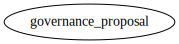
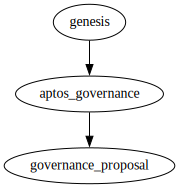
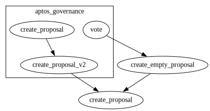
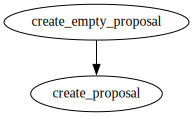
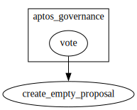

# Module `0x1::governance_proposal`

Define the GovernanceProposal that will be used as part of on-chain governance by AptosGovernance.

This is separate from the AptosGovernance module to avoid circular dependency between AptosGovernance and Stake.

-  [Struct `GovernanceProposal`](#0x1_governance_proposal_GovernanceProposal)
-  [Function `create_proposal`](#0x1_governance_proposal_create_proposal)
-  [Function `create_empty_proposal`](#0x1_governance_proposal_create_empty_proposal)

<pre><code></code></pre>

Show all the modules that "governance_proposal" depends on directly or indirectly

Show all the modules that depend on "governance_proposal" directly or indirectly

## Struct `GovernanceProposal`

<pre><code><b>struct</b> <a href="governance_proposal.md#0x1_governance_proposal_GovernanceProposal">GovernanceProposal</a> <b>has</b> drop, store
</code></pre>

Fields

<dl>
<dt>
<code>dummy_field: bool</code>
</dt>
<dd>

</dd>
</dl>

## Function `create_proposal`

Create and return a GovernanceProposal resource. Can only be called by AptosGovernance

<pre><code><b>public</b>(<b>friend</b>) <b>fun</b> <a href="governance_proposal.md#0x1_governance_proposal_create_proposal">create_proposal</a>(): <a href="governance_proposal.md#0x1_governance_proposal_GovernanceProposal">governance_proposal::GovernanceProposal</a>
</code></pre>

Implementation

<pre><code><b>public</b>(<b>friend</b>) <b>fun</b> <a href="governance_proposal.md#0x1_governance_proposal_create_proposal">create_proposal</a>(): <a href="governance_proposal.md#0x1_governance_proposal_GovernanceProposal">GovernanceProposal</a> {
    <a href="governance_proposal.md#0x1_governance_proposal_GovernanceProposal">GovernanceProposal</a> {}
}
</code></pre>

Show all the functions that "create_proposal" calls

Show all the functions that call "create_proposal"

## Function `create_empty_proposal`

Useful for AptosGovernance to create an empty proposal as proof.

<pre><code><b>public</b>(<b>friend</b>) <b>fun</b> <a href="governance_proposal.md#0x1_governance_proposal_create_empty_proposal">create_empty_proposal</a>(): <a href="governance_proposal.md#0x1_governance_proposal_GovernanceProposal">governance_proposal::GovernanceProposal</a>
</code></pre>

Implementation

<pre><code><b>public</b>(<b>friend</b>) <b>fun</b> <a href="governance_proposal.md#0x1_governance_proposal_create_empty_proposal">create_empty_proposal</a>(): <a href="governance_proposal.md#0x1_governance_proposal_GovernanceProposal">GovernanceProposal</a> {
    <a href="governance_proposal.md#0x1_governance_proposal_create_proposal">create_proposal</a>()
}
</code></pre>

Show all the functions that "create_empty_proposal" calls

Show all the functions that call "create_empty_proposal"

[move-book]: https://move-language.github.io/move/introduction.html
