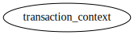
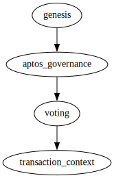
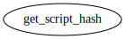
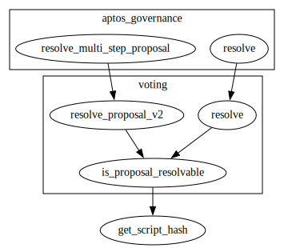

# Module `0x1::transaction_context`

-  [Function `get_script_hash`](#0x1_transaction_context_get_script_hash)
-  [Specification](#@Specification_0)
    -  [Function `get_script_hash`](#@Specification_0_get_script_hash)

<pre><code></code></pre>

Show all the modules that "transaction_context" depends on directly or indirectly

Show all the modules that depend on "transaction_context" directly or indirectly

## Function `get_script_hash`

Return the script hash of the current entry function.

<pre><code><b>public</b> <b>fun</b> <a href="transaction_context.md#0x1_transaction_context_get_script_hash">get_script_hash</a>(): <a href="../../aptos-stdlib/../move-stdlib/doc/vector.md#0x1_vector">vector</a>&lt;u8&gt;
</code></pre>

Implementation

<pre><code><b>public</b> <b>native</b> <b>fun</b> <a href="transaction_context.md#0x1_transaction_context_get_script_hash">get_script_hash</a>(): <a href="../../aptos-stdlib/../move-stdlib/doc/vector.md#0x1_vector">vector</a>&lt;u8&gt;;
</code></pre>

Show all the functions that "get_script_hash" calls

Show all the functions that call "get_script_hash"

## Specification

### Function `get_script_hash`

<pre><code><b>public</b> <b>fun</b> <a href="transaction_context.md#0x1_transaction_context_get_script_hash">get_script_hash</a>(): <a href="../../aptos-stdlib/../move-stdlib/doc/vector.md#0x1_vector">vector</a>&lt;u8&gt;
</code></pre>

<pre><code><b>pragma</b> opaque;
</code></pre>

[move-book]: https://move-language.github.io/move/introduction.html
