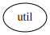
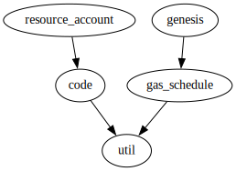
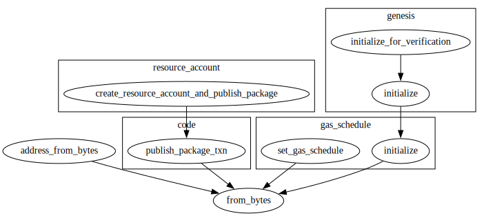
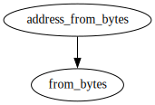
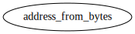

# Module `0x1::util`

Utility functions used by the framework modules.

-  [Function `from_bytes`](#0x1_util_from_bytes)
-  [Function `address_from_bytes`](#0x1_util_address_from_bytes)
-  [Specification](#@Specification_0)
    -  [Function `from_bytes`](#@Specification_0_from_bytes)

<pre><code></code></pre>

Show all the modules that "util" depends on directly or indirectly

Show all the modules that depend on "util" directly or indirectly

## Function `from_bytes`

Native function to deserialize a type T.

Note that this function does not put any constraint on <code>T</code>. If code uses this function to
deserialized a linear value, its their responsibility that the data they deserialize is
owned.

<pre><code><b>public</b>(<b>friend</b>) <b>fun</b> <a href="util.md#0x1_util_from_bytes">from_bytes</a>&lt;T&gt;(bytes: <a href="../../aptos-stdlib/../move-stdlib/doc/vector.md#0x1_vector">vector</a>&lt;u8&gt;): T
</code></pre>

Implementation

<pre><code><b>public</b>(<b>friend</b>) <b>native</b> <b>fun</b> <a href="util.md#0x1_util_from_bytes">from_bytes</a>&lt;T&gt;(bytes: <a href="../../aptos-stdlib/../move-stdlib/doc/vector.md#0x1_vector">vector</a>&lt;u8&gt;): T;
</code></pre>

Show all the functions that "from_bytes" calls

Show all the functions that call "from_bytes"

## Function `address_from_bytes`

<pre><code><b>public</b> <b>fun</b> <a href="util.md#0x1_util_address_from_bytes">address_from_bytes</a>(bytes: <a href="../../aptos-stdlib/../move-stdlib/doc/vector.md#0x1_vector">vector</a>&lt;u8&gt;): <b>address</b>
</code></pre>

Implementation

<pre><code><b>public</b> <b>fun</b> <a href="util.md#0x1_util_address_from_bytes">address_from_bytes</a>(bytes: <a href="../../aptos-stdlib/../move-stdlib/doc/vector.md#0x1_vector">vector</a>&lt;u8&gt;): <b>address</b> {
    <a href="util.md#0x1_util_from_bytes">from_bytes</a>(bytes)
}
</code></pre>

Show all the functions that "address_from_bytes" calls

Show all the functions that call "address_from_bytes"

## Specification

### Function `from_bytes`

<pre><code><b>public</b>(<b>friend</b>) <b>fun</b> <a href="util.md#0x1_util_from_bytes">from_bytes</a>&lt;T&gt;(bytes: <a href="../../aptos-stdlib/../move-stdlib/doc/vector.md#0x1_vector">vector</a>&lt;u8&gt;): T
</code></pre>

<pre><code><b>pragma</b> opaque;
<b>aborts_if</b> [abstract] <b>false</b>;
<b>ensures</b> [abstract] result == <a href="util.md#0x1_util_spec_from_bytes">spec_from_bytes</a>&lt;T&gt;(bytes);
</code></pre>

<pre><code><b>fun</b> <a href="util.md#0x1_util_spec_from_bytes">spec_from_bytes</a>&lt;T&gt;(bytes: <a href="../../aptos-stdlib/../move-stdlib/doc/vector.md#0x1_vector">vector</a>&lt;u8&gt;): T;
</code></pre>

[move-book]: https://move-language.github.io/move/introduction.html
