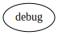
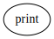
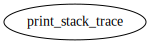

# Module `0x1::debug`

Module providing debug functionality.

-  [Function `print`](#0x1_debug_print)
-  [Function `print_stack_trace`](#0x1_debug_print_stack_trace)
-  [Specification](#@Specification_0)
    -  [Function `print`](#@Specification_0_print)
    -  [Function `print_stack_trace`](#@Specification_0_print_stack_trace)

<pre><code></code></pre>

Show all the modules that "debug" depends on directly or indirectly

Show all the modules that depend on "debug" directly or indirectly

## Function `print`

<pre><code><b>public</b> <b>fun</b> <a href="debug.md#0x1_debug_print">print</a>&lt;T&gt;(x: &T)
</code></pre>

Implementation

<pre><code><b>native</b> <b>public</b> <b>fun</b> <a href="debug.md#0x1_debug_print">print</a>&lt;T&gt;(x: &T);
</code></pre>

Show all the functions that "print" calls

Show all the functions that call "print"

## Function `print_stack_trace`

<pre><code><b>public</b> <b>fun</b> <a href="debug.md#0x1_debug_print_stack_trace">print_stack_trace</a>()
</code></pre>

Implementation

<pre><code><b>native</b> <b>public</b> <b>fun</b> <a href="debug.md#0x1_debug_print_stack_trace">print_stack_trace</a>();
</code></pre>

Show all the functions that "print_stack_trace" calls

Show all the functions that call "print_stack_trace"

## Specification

### Function `print`

<pre><code><b>public</b> <b>fun</b> <a href="debug.md#0x1_debug_print">print</a>&lt;T&gt;(x: &T)
</code></pre>

<pre><code><b>pragma</b> opaque;
</code></pre>

### Function `print_stack_trace`

<pre><code><b>public</b> <b>fun</b> <a href="debug.md#0x1_debug_print_stack_trace">print_stack_trace</a>()
</code></pre>

<pre><code><b>pragma</b> opaque;
</code></pre>

[move-book]: https://move-language.github.io/move/introduction.html
