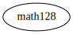
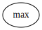
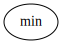

# Module `0x1::math128`

Standard math utilities missing in the Move Language.

-  [Function `max`](#0x1_math128_max)
-  [Function `min`](#0x1_math128_min)
-  [Function `average`](#0x1_math128_average)
-  [Function `pow`](#0x1_math128_pow)
-  [Specification](#@Specification_0)
    -  [Function `max`](#@Specification_0_max)
    -  [Function `min`](#@Specification_0_min)
    -  [Function `average`](#@Specification_0_average)
    -  [Function `pow`](#@Specification_0_pow)

<pre><code></code></pre>

Show all the modules that "math128" depends on directly or indirectly

Show all the modules that depend on "math128" directly or indirectly

## Function `max`

Return the largest of two numbers.

<pre><code><b>public</b> <b>fun</b> <a href="math128.md#0x1_math128_max">max</a>(a: u128, b: u128): u128
</code></pre>

Implementation

<pre><code><b>public</b> <b>fun</b> <a href="math128.md#0x1_math128_max">max</a>(a: u128, b: u128): u128 {
    <b>if</b> (a &gt;= b) a <b>else</b> b
}
</code></pre>

Show all the functions that "max" calls

Show all the functions that call "max"

## Function `min`

Return the smallest of two numbers.

<pre><code><b>public</b> <b>fun</b> <b>min</b>(a: u128, b: u128): u128
</code></pre>

Implementation

<pre><code><b>public</b> <b>fun</b> <b>min</b>(a: u128, b: u128): u128 {
    <b>if</b> (a &lt; b) a <b>else</b> b
}
</code></pre>

Show all the functions that "min" calls

Show all the functions that call "min"

## Function `average`

Return the average of two.

<pre><code><b>public</b> <b>fun</b> <a href="math128.md#0x1_math128_average">average</a>(a: u128, b: u128): u128
</code></pre>

Implementation

<pre><code><b>public</b> <b>fun</b> <a href="math128.md#0x1_math128_average">average</a>(a: u128, b: u128): u128 {
    <b>if</b> (a &lt; b) {
        a + (b - a) / 2
    } <b>else</b> {
        b + (a - b) / 2
    }
}
</code></pre>

Show all the functions that "average" calls

Show all the functions that call "average"

## Function `pow`

Return the value of n raised to power e

<pre><code><b>public</b> <b>fun</b> <a href="math128.md#0x1_math128_pow">pow</a>(n: u128, e: u128): u128
</code></pre>

Implementation

<pre><code><b>public</b> <b>fun</b> <a href="math128.md#0x1_math128_pow">pow</a>(n: u128, e: u128): u128 {
    <b>if</b> (e == 0) {
        1
    } <b>else</b> {
        <b>let</b> p = 1;
        <b>while</b> (e &gt; 1) {
            <b>if</b> (e % 2 == 1) {
                p = p * n;
            };
            e = e / 2;
            n = n * n;
        };
        p * n
    }
}
</code></pre>

Show all the functions that "pow" calls

Show all the functions that call "pow"

## Specification

### Function `max`

<pre><code><b>public</b> <b>fun</b> <a href="math128.md#0x1_math128_max">max</a>(a: u128, b: u128): u128
</code></pre>

<pre><code><b>aborts_if</b> <b>false</b>;
<b>ensures</b> a &gt;= b ==&gt; result == a;
<b>ensures</b> a &lt; b ==&gt; result == b;
</code></pre>

### Function `min`

<pre><code><b>public</b> <b>fun</b> <b>min</b>(a: u128, b: u128): u128
</code></pre>

<pre><code><b>aborts_if</b> <b>false</b>;
<b>ensures</b> a &lt; b ==&gt; result == a;
<b>ensures</b> a &gt;= b ==&gt; result == b;
</code></pre>

### Function `average`

<pre><code><b>public</b> <b>fun</b> <a href="math128.md#0x1_math128_average">average</a>(a: u128, b: u128): u128
</code></pre>

<pre><code><b>pragma</b> opaque;
<b>aborts_if</b> <b>false</b>;
<b>ensures</b> result == (a + b) / 2;
</code></pre>

### Function `pow`

<pre><code><b>public</b> <b>fun</b> <a href="math128.md#0x1_math128_pow">pow</a>(n: u128, e: u128): u128
</code></pre>

<pre><code><b>pragma</b> opaque;
<b>aborts_if</b> [abstract] <a href="math128.md#0x1_math128_spec_pow">spec_pow</a>(n, e) &gt; MAX_U128;
<b>ensures</b> [abstract] result == <a href="math128.md#0x1_math128_spec_pow">spec_pow</a>(n, e);
</code></pre>

<pre><code><b>fun</b> <a href="math128.md#0x1_math128_spec_pow">spec_pow</a>(e: u128, n: u128): u128 {
   <b>if</b> (e == 0) {
       1
   }
   <b>else</b> {
       n * <a href="math128.md#0x1_math128_spec_pow">spec_pow</a>(n, e-1)
   }
}
</code></pre>

[move-book]: https://move-language.github.io/move/introduction.html
