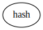
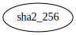
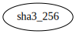

# Module `0x1::hash`

Module which defines SHA hashes for byte vectors.

The functions in this module are natively declared both in the Move runtime
as in the Move prover's prelude.

-  [Function `sha2_256`](#0x1_hash_sha2_256)
-  [Function `sha3_256`](#0x1_hash_sha3_256)

<pre><code></code></pre>

Show all the modules that "hash" depends on directly or indirectly

Show all the modules that depend on "hash" directly or indirectly

## Function `sha2_256`

<pre><code><b>public</b> <b>fun</b> <a href="hash.md#0x1_hash_sha2_256">sha2_256</a>(data: <a href="vector.md#0x1_vector">vector</a>&lt;u8&gt;): <a href="vector.md#0x1_vector">vector</a>&lt;u8&gt;
</code></pre>

Implementation

<pre><code><b>native</b> <b>public</b> <b>fun</b> <a href="hash.md#0x1_hash_sha2_256">sha2_256</a>(data: <a href="vector.md#0x1_vector">vector</a>&lt;u8&gt;): <a href="vector.md#0x1_vector">vector</a>&lt;u8&gt;;
</code></pre>

Show all the functions that "sha2_256" calls

Show all the functions that call "sha2_256"

## Function `sha3_256`

<pre><code><b>public</b> <b>fun</b> <a href="hash.md#0x1_hash_sha3_256">sha3_256</a>(data: <a href="vector.md#0x1_vector">vector</a>&lt;u8&gt;): <a href="vector.md#0x1_vector">vector</a>&lt;u8&gt;
</code></pre>

Implementation

<pre><code><b>native</b> <b>public</b> <b>fun</b> <a href="hash.md#0x1_hash_sha3_256">sha3_256</a>(data: <a href="vector.md#0x1_vector">vector</a>&lt;u8&gt;): <a href="vector.md#0x1_vector">vector</a>&lt;u8&gt;;
</code></pre>

Show all the functions that "sha3_256" calls

Show all the functions that call "sha3_256"

[move-book]: https://move-language.github.io/move/introduction.html
