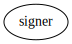
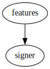
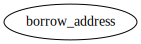
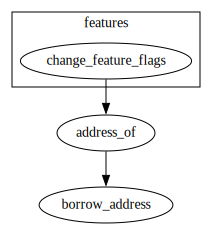
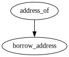
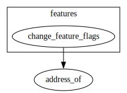

# Module `0x1::signer`

-  [Function `borrow_address`](#0x1_signer_borrow_address)
-  [Function `address_of`](#0x1_signer_address_of)
-  [Specification](#@Specification_0)

<pre><code></code></pre>

Show all the modules that "signer" depends on directly or indirectly

Show all the modules that depend on "signer" directly or indirectly

## Function `borrow_address`

<pre><code><b>public</b> <b>fun</b> <a href="signer.md#0x1_signer_borrow_address">borrow_address</a>(s: &<a href="signer.md#0x1_signer">signer</a>): &<b>address</b>
</code></pre>

Implementation

<pre><code><b>native</b> <b>public</b> <b>fun</b> <a href="signer.md#0x1_signer_borrow_address">borrow_address</a>(s: &<a href="signer.md#0x1_signer">signer</a>): &<b>address</b>;
</code></pre>

Show all the functions that "borrow_address" calls

Show all the functions that call "borrow_address"

## Function `address_of`

<pre><code><b>public</b> <b>fun</b> <a href="signer.md#0x1_signer_address_of">address_of</a>(s: &<a href="signer.md#0x1_signer">signer</a>): <b>address</b>
</code></pre>

Implementation

<pre><code><b>public</b> <b>fun</b> <a href="signer.md#0x1_signer_address_of">address_of</a>(s: &<a href="signer.md#0x1_signer">signer</a>): <b>address</b> {
    *<a href="signer.md#0x1_signer_borrow_address">borrow_address</a>(s)
}
</code></pre>

Show all the functions that "address_of" calls

Show all the functions that call "address_of"

## Specification

Return true only if <code>s</code> is a transaction signer. This is a spec function only available in spec.

<pre><code><b>native</b> <b>fun</b> <a href="signer.md#0x1_signer_is_txn_signer">is_txn_signer</a>(s: <a href="signer.md#0x1_signer">signer</a>): bool;
</code></pre>

Return true only if <code>a</code> is a transaction signer address. This is a spec function only available in spec.

<pre><code><b>native</b> <b>fun</b> <a href="signer.md#0x1_signer_is_txn_signer_addr">is_txn_signer_addr</a>(a: <b>address</b>): bool;
</code></pre>

[move-book]: https://move-language.github.io/move/introduction.html
