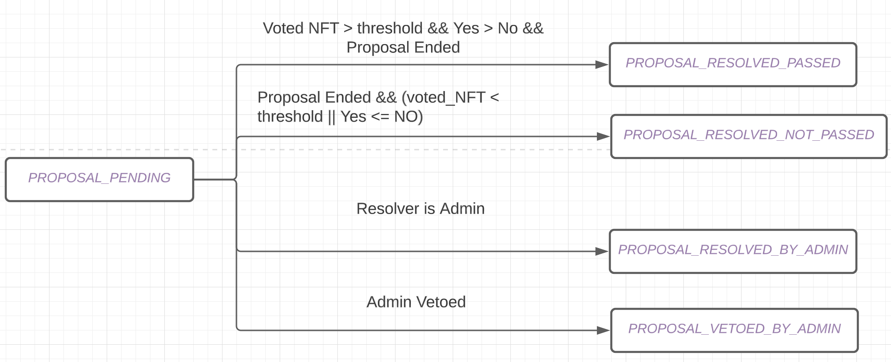

# NFT DAO V0 Eng Design Doc
PR: https://github.com/aptos-labs/aptos-core/pull/5918

## Motivation

*Quoted from product specification*

Currently there are no easy ways for projects in the ecosystem to engage with their communities post mint. A key part of building a vibrant NFT community (as well as community of other web3 verticals) is to empower holders and supporters to be included in the decision making process of a project via a DAO. To do this, we must provide easy to use DAO management tooling for projects on Aptos to build a DAO where entry is gated by the ownership of a token in a NFT collection.

With the NFT DAO, token holders can 

- be able to create a DAO and connect it to my existing NFT project
- be able to create proposals that can be voted on-chain
- be able to have proposal results conclude and execute on-chain

## Overview

There are multiple roles:

- DAO platform: the entity deploys the contract and provides one website for the NFT community to create DAO, propose, vote, and resolve.
- DAO admin: this entity creates the DAO through the platform. They can also transfer their admin authority to other accounts. DAO admin has special authority to veto or execute a proposal without voting
- Proposer:  people who create a proposal
- Voter: people who vote on a proposal
- Resolver: people who resolve a proposal

## Approach

### Key Data Structs

`[DAO](https://github.com/aptos-labs/aptos-core/blob/main/aptos-move/move-examples/dao/nft_dao/sources/nft_dao.move#L103)`: this contains all the DAO’s key data fields including DAO resource account signer capability. This data is stored in the DAO resource account.

`[Proposal](https://github.com/aptos-labs/aptos-core/blob/main/aptos-move/move-examples/dao/nft_dao/sources/nft_dao.move#L139)`: this contains the proposal info including the functions and their arguments to be executed.  The state change of proposal is as below:



`[Proposals](https://github.com/aptos-labs/aptos-core/blob/main/aptos-move/move-examples/dao/nft_dao/sources/nft_dao.move#L134)`: this contains all the proposals of each DAO. It maps the proposal id to the `Proposal`. This is stored in the DAO resource account

`[ProposalVotingStatistics](https://github.com/aptos-labs/aptos-core/blob/main/aptos-move/move-examples/dao/nft_dao/sources/nft_dao.move#L158)`: this maps the proposal id to its voting statistics. The voting statistics contain the yes and no counts and the vote of each token_id.

`[GovernanceToken](https://github.com/aptos-labs/aptos-core/blob/main/aptos-move/move-examples/dao/nft_dao/sources/nft_dao.move#L126)`: the NFT collection that forms a DAO.

### An Example E2E Flow

1. Platform operators deploy this package to create a DAO platform
2. Admin creates a DAO

```rust
public entry fun create_dao(
    admin: &signer,
    name: String,
    threshold: u64,
    voting_duration: u64,
    voting_token_collection_creator: address, 
    collection_name: String,
    min_required_proposer_voting_power: u64,
    required_proposer_voting_power: u64,
)
```

3. Proposer can create a proposal executing a list of functions.

Proposer can combine any number of supported functions in one proposal. During resolving, the list of functions will be executed in sequence.
```rust
create_proposal(
  account: &signer,
  nft_dao: address,// resource account address of the nft dao
  name: String,// name of the proposal
  description: String,// description of the proposal
  function_names: vector<String>,// 3 types of functions are supported: (1) "no_op", (2) "transfer_fund" and (3) "offer_nft"
  arg_names: vector<vector<String>>,// name of the arguments of the function to be called. The arg here should be the same as the argument used in the function
  arg_values: vector<vector<vector<u8>>>,// bcs serailized values of argument values
  arg_types:vector<vector<String>>,// types of arguments. currently, we only support string, u8, u64, u128, bool, address.
  start_time_sec: u64,// when the voting starts
  token_names: vector<String>,// The name of the token, the proposer want to use for proposing
  property_versions: vector<u64>,// the property versions of the corresponding tokens, the proposer want to use for proposing
) acquires DAO, Proposals
```

3 types of functions can be created:

- `no_op`, no automatic execution happens on-chain. Only the proposal and its result is recorded on-chain for the DAO admin to take actions
    - arg_names empty
    - arg_values empty
    - arg_types empty
- `transfer_fund`, the fund will be automatically transferred from DAO resource account to the destination account.
    - arg_names: “dst”, “amount”
    - arg_values: bcs_serialized values, please refer to TS SDK function. You need to provide original values in TS and arg_types to get the serialized values
    
    [aptos-core/property_map_serde.ts at main · aptos-labs/aptos-core](https://github.com/aptos-labs/aptos-core/blob/main/ecosystem/typescript/sdk/src/utils/property_map_serde.ts#L48)
    
    - arg_types: “address”, “u64”

4. A voter can vote for a proposal of a DAO

```rust
vote(
    account: &signer,
    nft_dao: address,
    proposal_id: u64,
    vote: bool,
    token_names: vector<String>,
    property_versions: vector<u64>,
)
```

To generate the batch of token_ids, You need to provide corresponding token_names and property_versions: For example, token_names = (”monkey 1”, “monkey 2”), property_versions = (”1”, “0”)

5. Anyone can call resolve to resolve the proposal. A proposal voting duration has to expire and the proposal should have more votes than the minimum required threshold.

```rust
public entry fun resolve<CoinType>(proposal_id: u64, nft_dao: address)
```

### Special DAO Admin Functions

DAO admin can perform some special operations. This is to provide the NFT creator a way to manage their DAO before the DAO becomes mature. Once the DAO becomes mature, they can get rid of the admin address by updating the field. The functions below are some special DAO admin operations: 

**DAO Admin transfer**

DAO admin can transfer his admin authority through an offer - claim two step process. He can also cancel an pending offer before anyone claims the offer.

- `offer_admin`: offer the admin authority to another account.  This offer is directly recorded in the DAO struct
- `claim_admin`: the receiver can claim this offer. The contract will set the admin of the DAO to this receiver and empty the pending claim
- `cancel_admin_offer`: the admin can also cancel an admin offer by making the pending claim field empty in the DAO struct.

**DAO admin privileges** 

- `admin_resolve`: admin of a DAO can directly resolve an **pending** proposal regardless of voting results and time. After resolving, the contract will record the resolution of the proposal as proposal resolved by admin.
- `admin_veto_proposal`: admin can veto an **pending** proposal regardless of voting results or time.  After vetoing, the contract will mark the resolution as vetoed by the admin
- update DAO configs: admin can use his authority to update the DAO’s name, proposal duration, resolve threshold, min power required to create proposal.

 

## Rationals

### Design principles

- No module deployment/ script compiling for each DAO in V0 to reduce the technical complexity for both users and partners
- The DAO platform should have a broader coverage of existing popular collections on Aptos
- Escrow-less voting to provide a better NFT owner experience and increase the supply of voting tokens

### Some aligned design choices

- Separate the `[ProposalVotingStatistics](https://github.com/aptos-labs/aptos-core/blob/main/aptos-move/move-examples/dao/nft_dao/sources/nft_dao.move#L158)` from `[Proposal](https://github.com/aptos-labs/aptos-core/blob/main/aptos-move/move-examples/dao/nft_dao/sources/nft_dao.move#L139)`,
    - NFT DAO records which token voted. This can take up a lot of space. We want to keep this data in a separate struct that can be destroyed later after proposal ends
- [Resolving threshold](https://github.com/aptos-labs/aptos-core/blob/main/aptos-move/move-examples/dao/nft_dao/sources/nft_dao.move#L107) is an absolute number of NFTs
    - This is what we learned from our partners and our own investigation of existing DAOs’ setting
- Don’t allow the same token being used twice for voting by recording voted token_ids and deduping on token_id
    - This is to allow escrow-less voting and accommodating to existing NFTs since most of them are globally unique
- Relax to globally_unique_**now** from globally_unique_**permanently** as the constraint for **governance token**
    - globally_unique_**now**  requires TokenData to have a maximum = 1 and globally_unique_**permanently** requires TokenData to have a **maximum = 1 && maximum_mutable = false**
    - we found popular collections (eg Aptos mingo) are globally_unique_now. We want to make sure our tool work for these collections.
    - Relaxing the constraint doesn’t increase the risk since only the creator can mint more tokens. If the creator is the malicious entity, there is no way to
- Not supporting features like mutating the collection maximum requiring creator authority
    - [We don’t support move compiling in v0 for each DAO individually](https://www.notion.so/NFT-DAO-V0-Eng-Design-Doc-139179339c78475e95d1f3bb71df9f9d). This makes it infeasible to acquire the signer of the creator account to perform the operation.
- Use property map for serializing and deserializing proposal function arguments
    - Leverage existing support in both TS SDK and Move to support the serde of a list of heterogeneous arguments
    - Property map should be able to support all eligible TXN arguments through simple extension.
    - We can also switch to raw vectors since the property map is not exposed in the interface.
- Vote with a batch of tokens
    - To reduce the number of TXN required to vote

## Remaining Questions

**DAO upgrade**  upgrading DAO to support integration with creator resource account to gain creator authority to do mint more NFT, update the collection maximum, etc.

- [Significant blocker] browser side or server-side move compiling lacks TS tooling support for community developers
- Alternatives:
    - DAO admin compiles and executes the script themselves

**DAO migration** Have smooth migration when DAO platform contracts have breaking changes

Goal:

- One button click to transfer the DAO signer capability to the new DAO
- Keep all the historical proposal data intact

Some possible step:

- upgrade the old DAO contract and add a migration function in the old DAO contract
- show the migration button in UI and the user can click to create a new DAO under the new contract
- emitted DAO migration event to keep a history of DAO migration
- all the historical proposals are still stored in old contract space.

```rust
public fun migrate(admin: &signer, dao: address) {
	// extract the old_dao's signer_cap
	let signer_cap = destroy_dao_and_reclaim_signer_capability(admin, old_dao);
	new_dao_platform::create_new_dao(signer_cap, old_dao);
}
```
