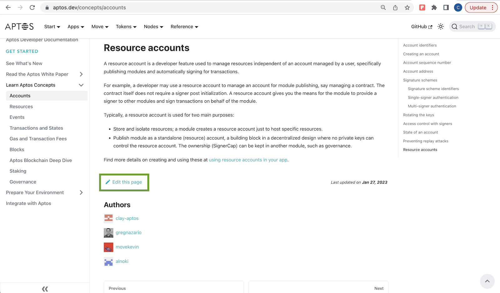
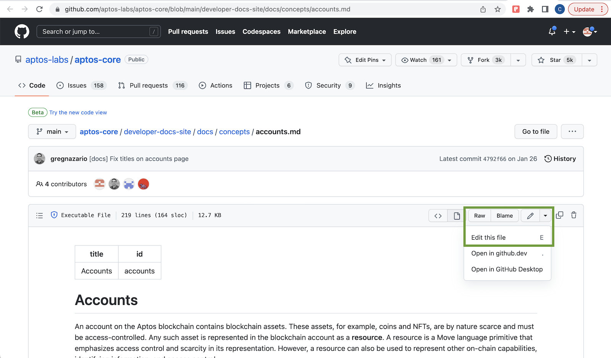
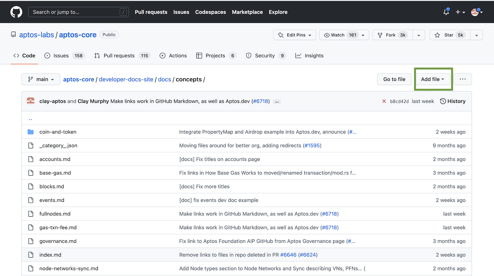

# Update Aptos.dev

As an open source project, Aptos needs your knowledge to grow. Follow the instructions on this page to update [Aptos.dev](https://aptos.dev/), the developer website for the Aptos blockchain. Every contributor to Aptos.dev is listed as an *author* on the pages they edit and update. See the *Authors* list at the bottom of any page for an example.

See the [Aptos Docs](https://github.com/orgs/aptos-labs/projects/14/views/1) project for open issues by status. See detailed instructions for making updates below.

## tl;dr

Simply click **Edit this page** at the bottom of any location to go to the source and trigger editing there. The contents are in [Markdown](https://www.markdownguide.org/basic-syntax/) format. You may then edit in browser and use the *Preview* function to view your changes.

Here are the basic steps for editing in your web browser:

1. Click **Edit this page** at the bottom to get started.
2. Modify and add source Markdown files in the [developer-docs-site](https://github.com/aptos-labs/aptos-core/tree/main/developer-docs-site) directory.
3. See your changes in Netlify (by swapping `prnumber` in):
 [https://deploy-preview-prnumber--aptos-developer-docs.netlify.app/](https://deploy-preview-prnumber--aptos-developer-docs.netlify.app/)
4. Have at least two verified reviewers examine and test the change.
5. Merge in the change and see it go live.

For more complex documentation updates, we recommend [forking the repository](https://github.com/aptos-labs/aptos-core/blob/main/CONTRIBUTING.md#developer-workflow) and using a local editor to make changes. To edit at the command line and preview your changes on your localhost, see our [Developer Documentation](https://github.com/aptos-labs/aptos-core/blob/main/developer-docs-site/README.md) README.

When ready, [start a pull request](https://docs.github.com/en/pull-requests/collaborating-with-pull-requests/proposing-changes-to-your-work-with-pull-requests/creating-a-pull-request) with your changes. We will get back to you shortly.

## Supporting resources

The Aptos Docs recommends these materials for good documentation:

- [Aptos Style](./aptos-style.md) - A brief set of guidance for contributions to Aptos.dev.
- [Google Style Guide](https://developers.google.com/style) - A Google standard adopted by companies large and small.
- [Technical writing courses](https://developers.google.com/tech-writing) - Google offers basic courses on tech writing for engineers and others.
- [DITA](https://en.wikipedia.org/wiki/Darwin_Information_Typing_Architecture) - The Aptos Docs team adheres to the [Darwin Information Typing Architecture](https://en.wikipedia.org/wiki/Darwin_Information_Typing_Architecture) whereby all technical documentation is broken down into concepts (overviews), tasks (procedures), and references (lists) to best suit our audiences and their mindsets (learning, doing, finding) at the time of reading.
- [Open source templates](https://gitlab.com/tgdp/templates) - The [Good Docs Project](https://thegooddocsproject.dev/) gives us myriad templates in Markdown for various documentation types we should take advantage of in Aptos.dev.

## Make updates directly

Whenever possible, update [Aptos.dev](http://Aptos.dev) directly to reflect your changes to development. This might be as simple as changing a value or as complex as adding an entirely new page or set of pages.

To update [Aptos.dev](http://Aptos.dev) directly:

1. Trigger an edit to the source files in the [developer-docs-site](https://github.com/aptos-labs/aptos-core/tree/main/developer-docs-site) directory:
    1. In web browser:
       * for simple, one-page changes, use the ***Edit this page*** link on the bottom of any page to access the source Markdown file in GitHub:
       
         Then click the pencil icon and select **Edit this file** to work in the GitHub web editor, and create a pull request to have it reviewed:
       
       * To add a new page, navigate to the relevant subdirectory of the [developer-docs-site/docs/](https://github.com/aptos-labs/aptos-core/tree/main/developer-docs-site/docs/) directory, click **Add file**, give it a name, append the `.md` file extension, include your contents, and create a pull request to have it reviewed:
       
    2. Via local editor - for more complex, multi-page changes, use your preferred source code editor to navigate to and update the source Markdown files in GitHub. See our [CONTRIBUTING](https://github.com/aptos-labs/aptos-core/blob/main/CONTRIBUTING.md) README for `git clone` instructions.
2. For web edits, use the *Preview* function at top to see your updates in browser.
3. For local edits, use the [local doc build instructions](https://github.com/aptos-labs/aptos-core/blob/main/developer-docs-site/README.md) to see your updates at: [http://localhost:3000](http://localhost:3000)
4. After creating the pull request, use the *Deploy Preview* in Netlify to see your updates made in web browser or via local editor by replacing the *prnumber* with your own in:
[https://deploy-preview-prnumber--aptos-developer-docs.netlify.app/](https://deploy-preview-prnumber--aptos-developer-docs.netlify.app/)
5. Have at least two verified reviewers review and test your changes.
6. Make direct commits during review.
7. Request review from the Docs team (currently, clay-aptos in GitHub).
8. Use the *Assignee* field in the PR to identify the review the change is blocking upon.
9. Receive and address *all feedback*.
10. Get approval from at least two verified reviewers.
11. Merge in the change.
12. Monitor builds at: [https://app.netlify.com/sites/aptos-developer-docs/overview](https://app.netlify.com/sites/aptos-developer-docs/overview)

## Request docs changes

If you are unable to make the update yourself or simply need Docs team help along the way:

1. See the existing list of [open issues tagged as Documentation](https://github.com/aptos-labs/aptos-core/issues?q=is%3Aissue+is%3Aopen+label%3Adocumentation) in GitHub. 
2. If one does not exist, file a new [Documentation issue](https://github.com/aptos-labs/aptos-core/issues/new?assignees=clay-aptos&labels=bug%2Cdocumentation&template=documentation_bug_report.md&title=%5BDocs%5D).
3. Answer all relevant questions/sections in the bug template (such as URL to the affected page).
4. Set a priority for the doc issue:
    1. [P0](https://github.com/aptos-labs/aptos-core/issues?q=is%3Aissue+is%3Aopen+label%3Adocumentation+label%3Ap0+) - critical and urgent
    2. [P1](https://github.com/aptos-labs/aptos-core/issues?q=is%3Aissue+is%3Aopen+label%3Adocumentation+label%3Ap1+) - important and needed soon
    3. [P2](https://github.com/aptos-labs/aptos-core/issues?q=is%3Aissue+is%3Aopen+label%3Adocumentation+label%3Ap2+) - can wait for this; still dependent on other work
    4. [P3](https://github.com/aptos-labs/aptos-core/issues?q=is%3Aissue+is%3Aopen+label%3Adocumentation+label%3Ap3+) - back burner item; there is no urgency here
5. Explain in the issue precisely what is expected in the doc; what requirements must it meet?
6. Assign the issue to and work with the subject matter experts and the Docs team to generate new and updated materials.
7. Associate all related pull requests with the issue by adding the issue number to the *Development* field of each PR.
8. Re-open the issue when related PRs are merged and work is still needed.
9. Close the issue only when all relevant parties are satisfied with the work. 

