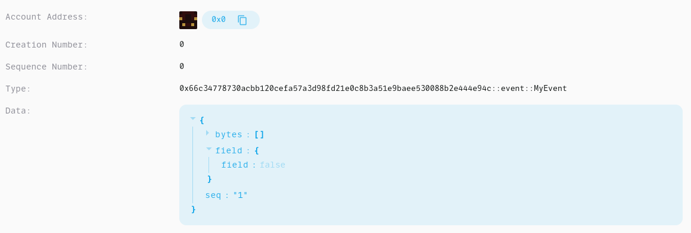

Events are emitted during the execution of a transaction. Each Move module can define its own events and choose when to emit the events upon execution of the module. Aptos Move supports two form of events: module events and EventHandle events. Module events are the modern event mechanism and shipped in the framework release 1.7. EventHandle events are deprecated and shipped with the original framework. Because of how blockchains work, EventHandle events will likely never be fully removed from Aptos.

# Module Events

Module events are global event streams identified by a struct type. To define an event struct, add the attribute `#[event]` to a normal Move struct that has `drop` and `store` abilities. For example,

```
/// 0xcafe::my_module_name
/// An example module event struct denotes a coin transfer.
#[event]
struct TransferEvent has drop, store {
    sender: address,
    receiver: address,
    amount: u64
}
```

And then create and emit the event:

```
// Define an event.
let event = TransferEvent {
    sender: 0xcafe,
    receiver: 0xface,
    amount: 100
};
// Emit the event just defined.
0x1::event::emit(event);
```

Example module events are available [here](https://explorer.aptoslabs.com/txn/682252266/events?network=testnet). Indices 0, 1, 2 are three module events of
type `0x66c34778730acbb120cefa57a3d98fd21e0c8b3a51e9baee530088b2e444e94c::event::MyEvent`. For API compatibility, module events contain the fields `Account Address`, `Creation Number` and `Sequence Number` with all set to 0.



## Access in Tests

Events are stored in a separate merkle tree called event accumulator for each transaction. As it is ephemeral and hence independent from the state tree, MoveVM does not have read access to events when executing transaction in production. But in tests, Aptos Move supports two native functions that read emitted events for testing and debugging purposes:

```rust
/// Return all emitted module events with type T as a vector.
# [test_only]
public native fun emitted_events<T: drop + store>(): vector<T>;

/// Return true iff `msg` was emitted.
# [test_only]
public fun was_event_emitted<T: drop + store>(msg: & T): bool
```

## API Access

The API for querying module event is under construction. [GraphQL API](https://aptos.dev/guides/system-integrators-guide/#production-network-access) support remains to query both module events and EventHandle events.

# Event-Handle Events (Deprecated)

As part of our legacy, Aptos inherited the Libra/Diem event streams derived from EventHandles. Where each EventHandle is identified by a globally unique value, GUID, and a per-event sequence number and stored within a resource. Each event within a stream has a unique sequence number derived from the EventHandle sequence number.

For example, during a [coin transfer](../tutorials/first-transaction.md), both the sender and receiver's accounts will emit `SentEvent` and `ReceivedEvent`, respectively. This data is stored within the ledger and can be queried via the REST interface's [Get events by event handle](https://fullnode.devnet.aptoslabs.com/v1/spec#/operations/get_events_by_event_handle).

Assuming that an account `0xc40f1c9b9fdc204cf77f68c9bb7029b0abbe8ad9e5561f7794964076a4fbdcfd` had sent coins to another account, the following query could be made to the REST interface: `https://fullnode.devnet.aptoslabs.com/v1/accounts/c40f1c9b9fdc204cf77f68c9bb7029b0abbe8ad9e5561f7794964076a4fbdcfd/events/0x1::coin::CoinStore<0x1::aptos_coin::AptosCoin>/withdraw_events`.  The output would be all `WithdrawEvent`s stored on that account, it would look like

```json
[
  {
    "key": "0x0000000000000000caa60eb4a01756955ab9b2d1caca52ed",
    "sequence_number": "0",
    "type": "0x1::coin::WithdrawEvent",
    "data": {
      "amount": "1000"
    }
  }
]
```

Each registered event has a unique `key`. The key `0x0000000000000000caa60eb4a01756955ab9b2d1caca52ed` maps to the event `0x1::coin::CoinStore<0x1::aptos_coin::AptosCoin>/sent_events` registered on account `0xc40f1c9b9fdc204cf77f68c9bb7029b0abbe8ad9e5561f7794964076a4fbdcfd`. This key can then be used to directly make event queries, e.g., `https://fullnode.devnet.aptoslabs.com/v1/events/0x0000000000000000caa60eb4a01756955ab9b2d1caca52ed`.

These represent event streams, or a list of events with each entry containing a sequentially increasing `sequence_number` beginning at `0`, a `type`, and `data`. Each event must be defined by some `type`. There may be multiple events defined by the same or similar `type`s especially when using generics. Events have associated `data`. The general principle is to include all data necessary to understand the changes to the underlying resources before and after the execution of the transaction that changed the data and emitted the event.

[coin_transfer]: https://github.com/aptos-labs/aptos-core/blob/bdd0a7fe82cd6aab4b47250e5eb6298986777cf7/aptos-move/framework/aptos-framework/sources/coin.move#L412

[get_events]: https://fullnode.devnet.aptoslabs.com/v1/spec#/operations/get_events_by_event_handle

## Migration to Module Events

With the release of module events, EventHandle events are deprecated. To support migration to the module events, projects should emit a module event wherever they currently emit EventHandle events. Once external systems have sufficiently adopted module events, the legacy event may no longer need to be emitted.

Note, the EventHandle events cannot and will not be deleted and hence projects that are unable to upgrade will continue to be able to leverage them.
