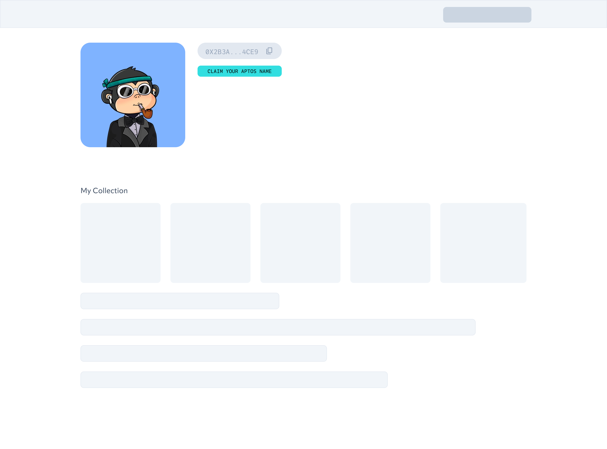
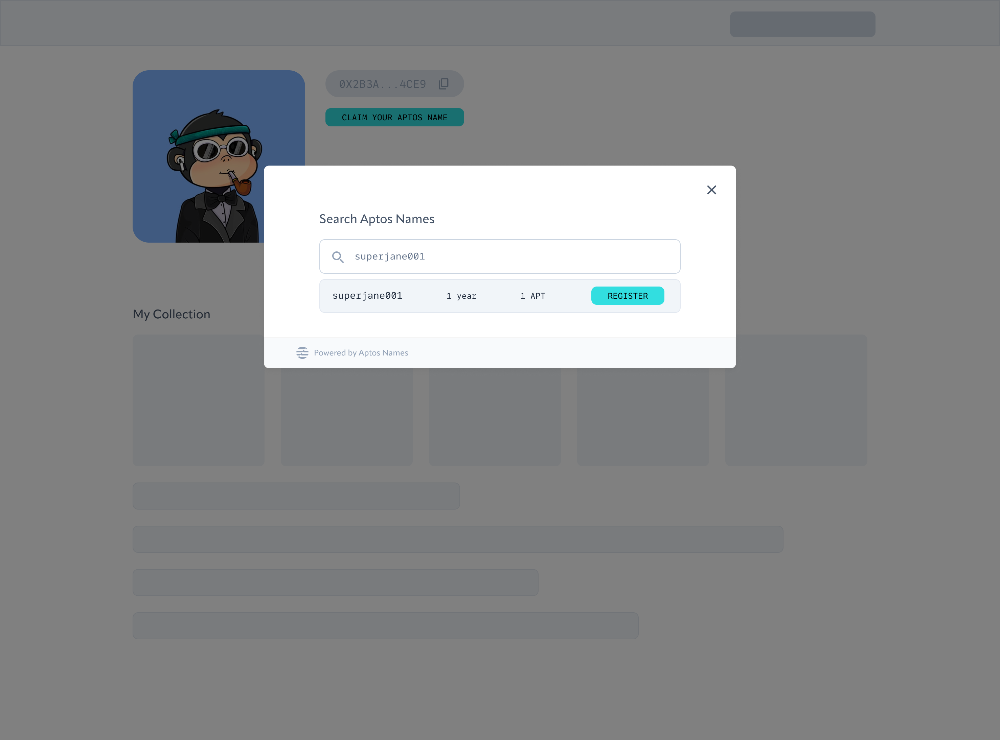
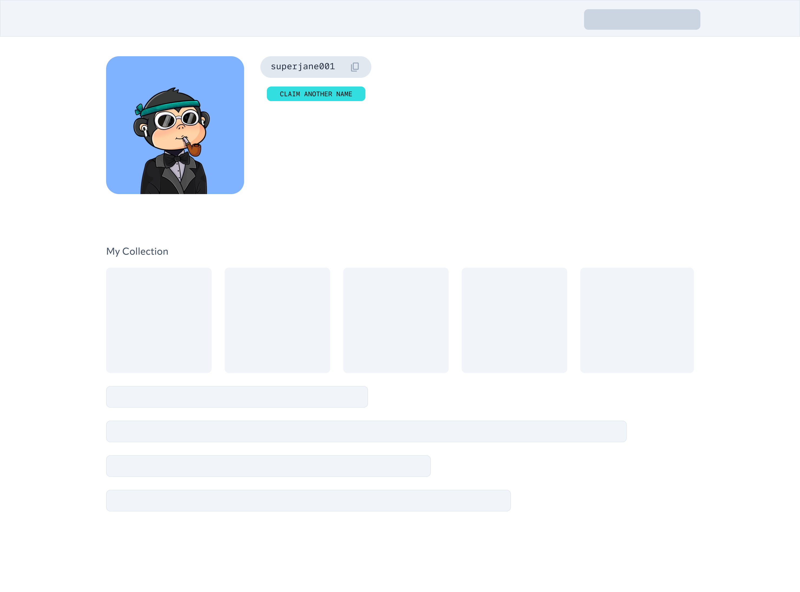

# Integrate with Aptos Names Service
The Aptos Name Service provides a React UI package that offers developers a customizable button and modal to enable users to search for and mint Aptos names directly from their website.

## Prerequisites
- [React project](https://create-react-app.dev/docs/getting-started/)
- Supporting dependencies installed in the root directory of your React project with npm or yarn:  
    - `npm install @emotion/styled @emotion/react`
    - `yarn add @emotion/styled @emotion/react react-copy-to-clipboard`

## Use Aptos Names Service Connector
1. Open a terminal session and navigate to the root directory of your React project.
1. Install the `aptos-names-connector` package using npm or yarn:  
    - `npm install "@aptos-labs/aptos-names-connector"`
    - `yarn add "@aptos-labs/aptos-names-connector"`
1. Once you have installed the package, you can import the `AptosNamesConnector` component and use it in your React application (by default in `./src/App.js`):
    ```
    import { AptosNamesConnector } from "@aptos-labs/aptos-names-connector";

    function MyComponent() {
      const handleSignTransaction = async () => {
        // Handle signing of transaction
      };

      return (
        <AptosNamesConnector
          onSignTransaction={handleSignTransaction}
          isWalletConnected={true}
          network="mainnet"
          buttonLabel="Claim"
        />
      );
    }
    ```
 1. To see your changes, start a development server using npm or yarn. The following commands will open the React application in your default web browser (typically to `localhost:3000`):
    - `npm start`
    - `yarn start`

## Configure `AptosNamesConnector` properties
The `AptosNamesConnector` component accepts the following props:

- `onSignTransaction`: A required callback function that is called when the user clicks the "Mint" button in the modal. This function should handle the signing of the transaction.
- `isWalletConnected`: A boolean value that indicates whether the user's wallet is connected.
- `network`: A string value that specifies whether the component should connect to the mainnet or testnet.
- `buttonLabel`: A string value that specifies the text to display on the button.

## Customize button label and appearance
The button label can be customized by passing a string value to the buttonLabel prop.
The appearance of the button in the `AptosNamesConnector` component can be customized to fit in your website. The button has the CSS class name of `ans_connector_button`:

```
.ans-connector-button {
  background-color: #000000;
  border: none;
  border-radius: 4px;
  color: #ffffff;
  cursor: pointer;
  font-size: 16px;
  font-weight: bold;
  padding: 12px 16px;
}
```
To use `ans_connector_button` in your React application, add `import "@aptos-labs/aptos-names-connector/dist/index.css";` to the top of your App.js file and reference it with `<button className="ans_connector_button"></button>`

## Supported networks
The `AptosNamesConnector` component supports both mainnet and testnet. To connect to the mainnet, set the network prop to "mainnet". To connect to the testnet, set the network prop to "testnet".

## Example
The following example shows how to use the `AptosNamesConnector` component in a React application:
<last image />


- Add a ‘claim name’ button to any page in your application. This allows your users to directly create an Aptos name, giving them a human-readable .apt name for their Aptos wallet address. You can customize the look of the button to suit your application. Here is an example on the profile page of an NFT marketplace.



- When the button is clicked, the Aptos Names modal will show up, and the user can search for a name and mint it directly in your application.



- Once the user has minted their name, you can replace their Aptos wallet address by querying from Aptos fullnodes. Now your users have a human-readable .apt name.


