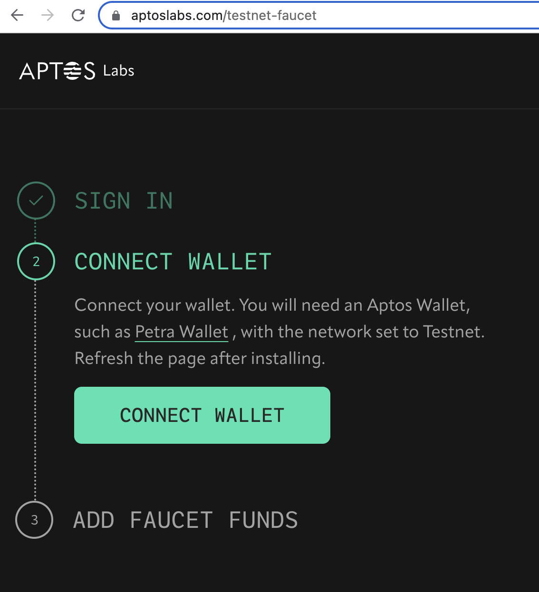
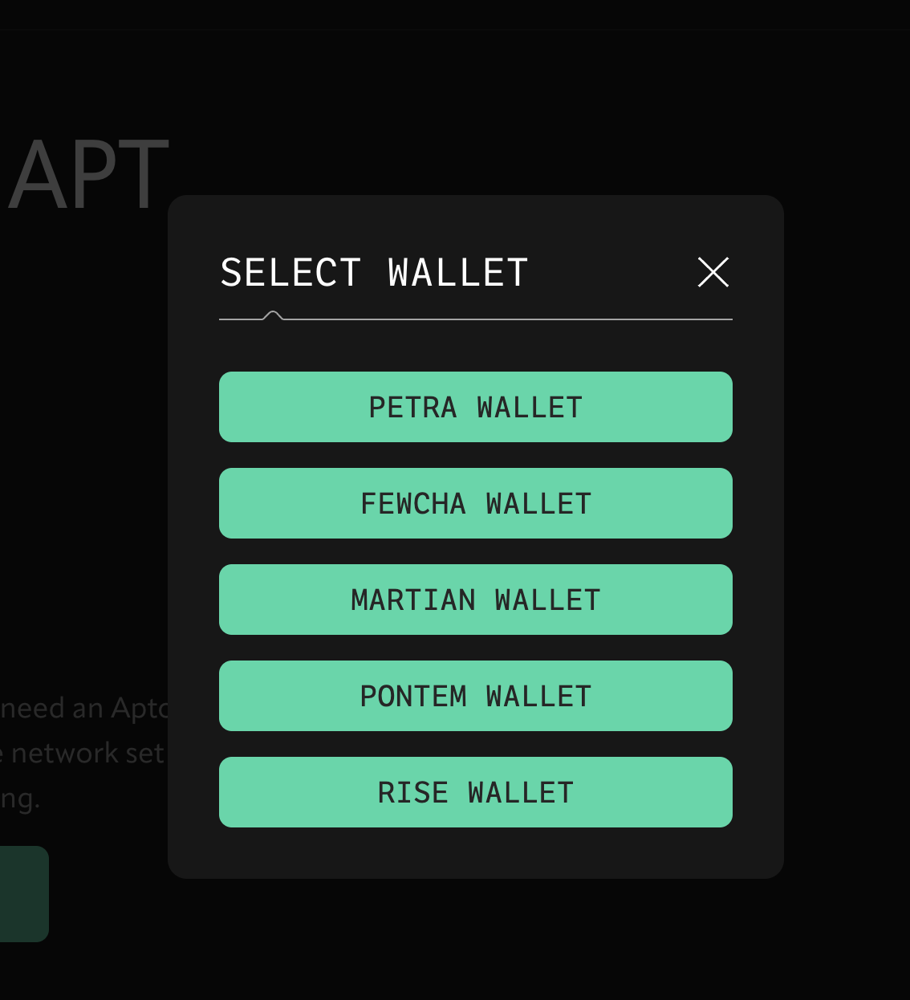
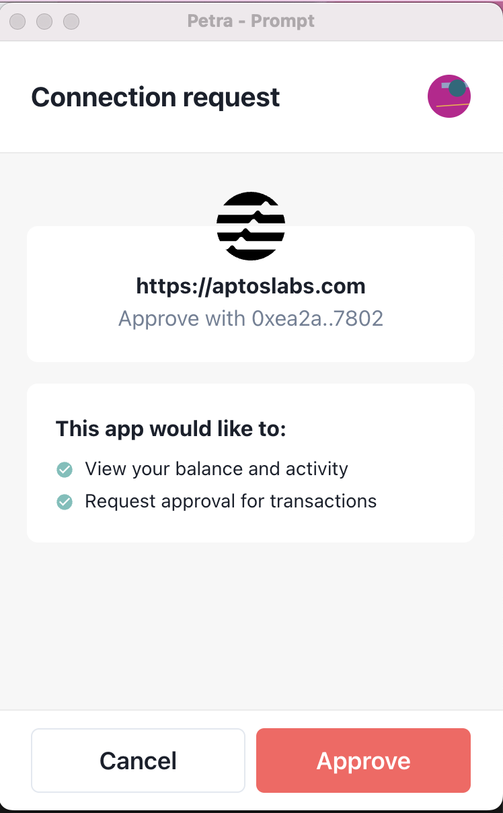
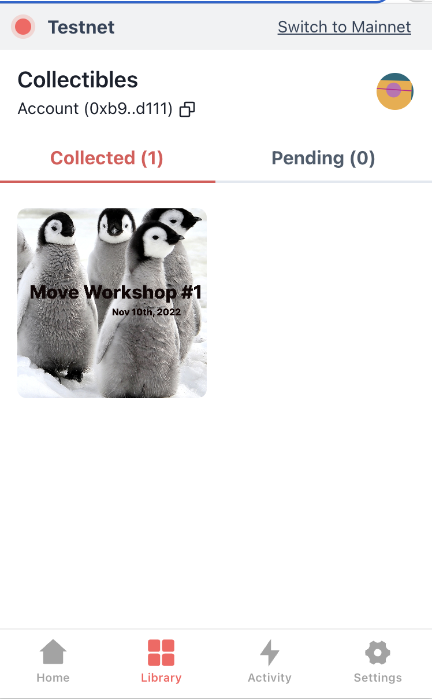

# Mint an NFT with Aptos CLI

This tutorial lets you use the Aptos CLI to mint NFTs in Aptos testnet so you can see how the process works and employ related functions in your code.

## Prerequisites

This tutorial assumes you have:

* a [GitHub account](https://docs.github.com/en/get-started/signing-up-for-github/signing-up-for-a-new-github-account)
* the [GitHub CLI](https://cli.github.com/)
* the [Aptos CLI](../../cli-tools/aptos-cli-tool/install-aptos-cli.md) (or you can run from [aptos-core](https://github.com/aptos-labs/aptos-core) source via `cargo run`)

## Role of accounts

When you are minting an NFT, the NFT is stored under your [account](../../concepts/accounts.md) address. When you submit a transaction, you sign the transaction.

[Resource accounts](../resource-accounts.md) allow the delegation of signing transactions. You create a resource account to grant a signer capability that can be stored in a new resource on the same account and can sign transactions autonomously. The signer capability is protected as no one has access to the private key for the resource account.

## Understand minting

* Review the [mint_nft](https://github.com/aptos-labs/aptos-core/tree/main/aptos-move/move-examples/mint_nft) source code and code comments within each subdirectory.
* Explore the `mint_event_ticket` function defined within each subdirectory.

### Initialization

The `init_module` of [`minting.move`](https://github.com/aptos-labs/nft-tutorial/blob/main/sources/minting.move) always gets called and run when the module is published:

```shell
    fun init_module(resource_account: &signer) {
        let resource_signer_cap = resource_account::retrieve_resource_account_cap(resource_account, @source_addr);
        let resource_signer = account::create_signer_with_capability(&resource_signer_cap);
```

The `mint_nft` function of [`minting.move`](https://github.com/aptos-labs/nft-tutorial/blob/main/sources/minting.move) gets a collection and creates a token.

With the resulting TokenData ID, the function uses the resource signer of the module to mint the token to the `nft-receiver`.

For example:
```shell
    public entry fun mint_nft(receiver: &signer) acquires ModuleData {
        let receiver_addr = signer::address_of(receiver);
```

### Signing

The only argument taken by `mint_nft` is `receiver`. Any `entry fun` will take as the first parameter the type `&signer`. In both Move and Aptos, whenever you submit a transaction, the private key you sign the transaction with automatically makes the associated account the first parameter of the signer.

You can go from the signer to an address but normally not the reverse. So when claiming an NFT, both the private keys of the minter and receiver are needed, as shown in the instructions below.

In the `init_module`, the signer is always the account uploading the contract. This gets combined with:

```shell
        token::create_collection(&resource_signer, collection, description, collection_uri, maximum_supply, mutate_setting);

```
Where the `&resource_signer` is the first parameter, defined previously as a new address that has all of the attributes of the original account plus signer capability. See:

```shell
        signer_cap: account::SignerCapability,
```

The signer capability allows the module to sign autonomously. The [resource account](../resource-accounts.md) prevents anyone from getting the private key and is entirely controlled by the contract.

### Module data

The `ModuleData` is then initialized and *moved* to the resource account, which has the signer capability:

```shell
        move_to(resource_account, ModuleData {
```

In the `mint_nft` function, the first step is borrowing the `ModuleData` struct:

```shell
        let module_data = borrow_global_mut<ModuleData>(@mint_nft);
```

And then use the reference to the signer capability in the  `ModuleData` struct to create the `resource_signer`:

```shell
        let resource_signer = account::create_signer_with_capability(&module_data.signer_cap);
```

In this manner, you can later use the signer capability already stored in module. When you move a module and its structs into an account, they become visible in [Aptos Explorer](https://explorer.aptoslabs.com/) associated with the account.

## Mint with the Aptos CLI

Now that you have an understanding of the Aptos minting process and are starting to write smart contracts with Move, you are ready to create your first testnet NFT with the Aptos CLI.

### Install Aptos CLI and create an account

1. [Install the Aptos CLI](../../cli-tools/aptos-cli-tool/install-aptos-cli.md) and note its [many uses](../../cli-tools/aptos-cli-tool/use-aptos-cli.md) for later if you haven't experienced its goodness already.

2. Create an account on Aptos testnet to receive the NFT by running the following command and selecting `testnet`:
  ```shell
  aptos init --profile nft-receiver
  ```

3. When prompted for a network, select `testnet` by entering it and hitting return:
  ```shell
  Configuring for profile nft-receiver
  Choose network from [devnet, testnet, mainnet, local, custom | defaults to devnet]
  testnet
  ```

4. When prompted for your private key, hit enter to generate a new key:
  ```shell
  Enter your private key as a hex literal (0x...) [Current: None | No input: Generate new key (or keep one if present)]
  ```

5. Receive output resembling:
  ```shell
  No key given, generating key...
  Account a233bf7be2b93f1e532f8ea88c49e0c70a873d082890b6d9685f89b5e40d50c2 does not exist, you will need to create and fund the account through a community faucet e.g. https://aptoslabs.com/testnet-faucet, or by transferring funds from another account
  
  ---
  Aptos CLI is now set up for account a233bf7be2b93f1e532f8ea88c49e0c70a873d082890b6d9685f89b5e40d50c2 as profile nft-receiver!  Run `aptos --help` for more information about commands
  {
    "Result": "Success"
  }
  ```

6. Note your configuration information can be found in `.aptos/config.yaml` relative to where you ran `aptos init`. Read that file to see each profile's private and public keys, account address, and REST API URL.

### Install wallet and import account

1. Read `.aptos/config.yaml` to see and copy the `nft-receiver` private key.

2. Install the wallet of your choice. We use the [Petra Wallet](../../guides/install-petra-wallet.md) Chrome extension.

3. Open the wallet and select the [Testnet network](https://petra.app/docs/use) in the wallet via *Petra settings > Network > Testnet*.

4. Go to *Petra > Settings > Switch account > Add Account > Import private key*.

5. Paste the `nft-receiver` private key there.

6. Click **Submit** to add the previously created account to the wallet.

7. You are switched into that account automatically.

### Get coins from faucet

1. Go to the *Petra > Settings > Network > Testnet* network if not there already.

2. Connect your wallet to the Aptos faucet at https://aptoslabs.com/testnet-faucet:

  

3. Select your wallet type:

  

4. Approve the connection request:

  

5. Now when you load your wallet, you will see a **Faucet** button next to **Send**. Click **Faucet** to receive one APT per click to use when minting.

### Mint the NFT

1. Mint the NFT by calling the `mint_nft` function and an existing contract using the Aptos CLI:

  ```shell
  aptos move run --function-id 8cdf69c8c93fee36ed83f8882908060c1335ed39a827c08dbb506b46237e88fb::minting::mint_nft --profile nft-receiver
  ```

2. When asked, `Do you want to submit a transaction for a range of...?`, enter `yes` and hit return.

3. Receive results resembling:

```shell
{
  "Result": {
    "transaction_hash": "0x6e022532fb8d802324829d5ec85fd32c05a58a6f826751f63cdbf9bf313ff991",
    "gas_used": 3944,
    "gas_unit_price": 150,
    "sender": "b9d394a7bc582a54e8610d6a7b973f62c8d9595c54c35cdbb95965aa8e5cd111",
    "sequence_number": 0,
    "success": true,
    "timestamp_us": 1670969779029341,
    "version": 385901038,
    "vm_status": "Executed successfully"
  }
}
*/
```

## Find the NFT in your Petra wallet

1. Open the Petra Wallet Chrome extension.

2. Go to *Petra > Settings > Network > Testnet*.

3. Click **Library** at bottom.

4. See the NFT in your wallet:

  

## Deploy the NFT contract

Now you can add this smart contract to the Aptos network.

### Create and fund admin and source account

Create two accounts on testnet for deploying and managing this contract:
  * The source account will be used to create the resource account that will deploy this smart contract.
  * The admin account is in charge of updating the config of the module (e.g. whether or not we enable minting for this collection).

1. Run these commands to create the accounts, selecting `testnet` when prompted:
  ```shell
  aptos init --profile source-account
  ```
  ```shell
  aptos init --profile admin-account
  ```
2. Open `.aptos/config.yaml` to find the private keys for the `admin-account` and `source-account` profiles and copy them.

3. Fund these accounts by adding them to your wallet via importing their private keys into testnet and using the **Faucet** function as you did for the `nft-receiver` profile.

### Prepare resource account from source account

In this section, we will create a [resource account](../resource-accounts.md) from the `source-account` and publish the module on testnet under the resource account’s address. A resource account is used here to programmatically signed for transactions and avoids the need for multiple signatures.

In the [NFT Tutorial](https://github.com/aptos-labs/nft-tutorial/tree/main/tutorial) smart contract, we store the resource account’s signer capability in the `ModuleData` resource so that it can automatically sign for transactions in the contract. If we don’t store the signer capability within the module, we’d need to provide the resource account’s signer; but we no longer have access to the resource account’s signer because the resource account is meant to be autonomous, and the contracts published under a resource account are immutable. Once the contract is published, the resource account no longer has access to the signer.

1. Clone the NFT Tutorial:
  ```shell
  git clone https://github.com/aptos-labs/nft-tutorial
  ```

2. Navigate into the tutorial directory:
  ```shell
  cd nft-tutorial
  ```

3. Open `Move.toml` in that directory for editing.

4. Update the `source_addr` and `admin_addr` with the `account` values for the `source-account` and `admin-account` profiles you just created (found in `.aptos/config.yaml`), respectively. Note, the order of addresses and accounts is flipped in those files, so copy carefully.

### Create resource account and publish package

1. Run the following command to create the resource account and publish the package all at once. The seed is just an example - feel free to provide a different seed if the resource account created by the specified seed already exists:
  ```shell
  aptos move create-resource-account-and-publish-package --seed hex_array:1234 --address-name mint_nft --profile source-account
  ```

2. Receive compilation output like:
  ```shell
  Compiling, may take a little while to download git dependencies...
  INCLUDING DEPENDENCY AptosFramework
  INCLUDING DEPENDENCY AptosStdlib
  INCLUDING DEPENDENCY AptosToken
  INCLUDING DEPENDENCY MoveStdlib
  BUILDING NFT-tutorial
  ```

3. When prompted to publish this package under the resource account's address, enter `yes` and hit return.

4. When asked, `Do you want to submit a transaction for a range of...?`, enter `yes` and hit return.

5. Receive output indicating success resembling:
  ```shell
  {
    "Result": "Success"
  }
  ```

### Mint more NFTs and disable minting from admin account

1. Mint another NFT using the `nft-receiver` profile, sustituting in the resource account's address:

```shell
aptos move run --function-id <resource-account-address>::minting::mint_nft --profile nft-receiver
```

2. Again answer `yes` when prompted to submit the transaction.

3. Receive output resembling:

```shell
{
  "Result": {
    "transaction_hash": "0x62660973b1a94e620c863899a157b0b46c02dcfdb0c9261a34ed4d2391550fc7",
    "gas_used": 6691,
    "gas_unit_price": 100,
    "sender": "aaf015db7b6dacb1db4637ef017e68e689a40797fe8fd3897cee08808979bb91",
    "sequence_number": 0,
    "success": true,
    "timestamp_us": 1667434233137811,
    "version": 27685944,
    "vm_status": "Executed successfully"
  }
}
*/
```

4. Disable NFT minting in this module by applying `set_minting_enabled --args bool:false` to the `admin-account` profile so that random folks cannot mint this NFT from your module:

```shell
aptos move run --function-id <resource-account-address>::minting::set_minting_enabled --args bool:false --profile admin-account
```

Now you can include your own artwork once you are ready to customize your NFTs by replacing our defaults in `minting.move`:
* https://slwdaeeko5tz5hx46c6zwqhmh3c6je4sbdbjsdjzbntme5dxarxa.arweave.net/kuwwEIp3Z56e_PC9m0DsPsXkk5IIwpkNOQtmwnR3BG4
* https://lty5vdw4cl6yczbpz2rnm2732rbtnk3jeiutyqd644wojmkyt2hq.arweave.net/XPHajtwS_YFkL86i1mv71EM2q2kiKTxAfucs5LFYno8