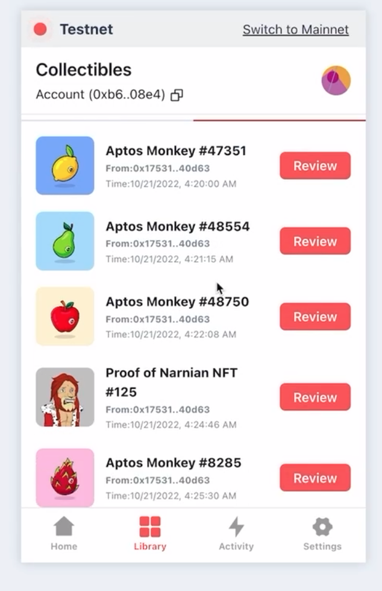

# Mint NFTs with the Aptos CLI

This code lab lets you use the Aptos CLI to mint non-fungible tokens (NFTs) in Aptos so you can see how the process works and employ related functions in your code. Although this code lab assumes use of the devnet network, you could follow the same steps in devnet or even mainnet, assuming you have the necessary funds in your account.

## Prerequisites

This tutorial assumes you have:

* a [GitHub account](https://docs.github.com/en/get-started/signing-up-for-github/signing-up-for-a-new-github-account)
* the [GitHub CLI](https://cli.github.com/)
* the [Aptos CLI](../../tools/aptos-cli/install-cli/index.md) (or you can run from [aptos-core](https://github.com/aptos-labs/aptos-core) source via `cargo run`)
* the `aptos-core` repository checked out: `git clone https://github.com/aptos-labs/aptos-core.git`

Then:

* Review the [mint_nft](https://github.com/aptos-labs/aptos-core/tree/main/aptos-move/move-examples/mint_nft) source code and code comments within each subdirectory.
* Explore the `mint_event_ticket` function defined within each subdirectory.

## NFT types

The two most common types of NFT are event ticket / certificates and profile picture NFTs.

### Event tickets and certificates

This kind of NFT has a base token, and every new NFT generated from this base token has the same token data ID and image. They are generally used as certificates, meaning each NFT created from the base token is considered a printing edition of the base token.

You might use this type of NFT for event tickets where each NFT is a ticket and has properties representing expiration date and if the ticket has been used. When you mint the NFT, you may set an expiration time for the event ticket and `is_ticket_used` to `false`. When the ticket is used, you update `is_ticket_used` to `true`.

### Profile picture NFTs

A profile picture NFT has a unique token data ID and picture for each token. There are generally no printing editions of this NFT. Most NFT collections on NFT marketplaces are of this kind. They are generally proofs of ownership of an art piece.

In this tutorial, we describe how to create and mint event ticket NFTs.

## 1. Create a collection and token

Now that you have an understanding of the Aptos minting process and are starting to write smart contracts with Move, you are ready to create your first devnet NFT with the Aptos CLI.

In this section, we create a collection and token. This work maps to the demonstration in [create_nft.move](https://github.com/aptos-labs/aptos-core/blob/main/aptos-move/move-examples/mint_nft/1-Create-NFT/sources/create_nft.move).

### Create an account

1. [Install the Aptos CLI](../../tools/aptos-cli/install-cli/index.md).

2. Create a default (typical) account on Aptos devnet to receive the NFT by running the following command and selecting `devnet`:
  ```shell
  aptos init
  ```

3. Receive the output:
  ```shell
  Configuring for profile default
  ```

3. When prompted for a network:
  ```shell
  Choose network from [devnet, testnet, mainnet, local, custom | defaults to devnet]
  ```
  Select `devnet` by entering it and hitting return.

4. When prompted for your private key:
  ```shell
  Enter your private key as a hex literal (0x...) [Current: None | No input: Generate new key (or keep one if present)]
  ```
  Hit enter to generate a new key.

5. Receive output indicating success and resembling:
  ```shell
  No key given, generating key...
  Account abf6c939bfd8352b9769f9343dbc55a777349588a2ddc4668c8ddcd213169827 doesn't exist, creating it and funding it with 100000000 Octas
  Account abf6c939bfd8352b9769f9343dbc55a777349588a2ddc4668c8ddcd213169827 funded successfully

  ---
  Aptos CLI is now set up for account abf6c939bfd8352b9769f9343dbc55a777349588a2ddc4668c8ddcd213169827 as profile default!  Run `aptos --help` for more information about commands
  {
    "Result": "Success"
  }
  ```

6. Note your configuration information can be found in `.aptos/config.yaml` relative to where you ran `aptos init`. Read that file to see each profile's private and public keys, account address, and REST API URL.

### Publish the module

1. In your `aptos-core` source checkout, navigate to the `aptos-core/aptos-move/move-examples/mint_nft/1-Create-NFT` directory:

```shell
cd aptos-move/move-examples/mint_nft/1-Create-NFT
```

2. Run `aptos move publish` to publish the Move module in that directory, updating it with your default account address from `.aptos/config.yaml`:

```shell
aptos move publish --named-addresses mint_nft=<default-account-address>
```

For example:

```shell
aptos move publish --named-addresses mint_nft=a911e7374107ad434bbc5369289cf5855c3b1a2938a6bfce0776c1d296271cde
```

3. Receive output asking you to accept a gas fee for the transaction:

```shell
    Compiling, may take a little while to download git dependencies...
    INCLUDING DEPENDENCY AptosFramework
    INCLUDING DEPENDENCY AptosStdlib
    INCLUDING DEPENDENCY AptosToken
    INCLUDING DEPENDENCY MoveStdlib
    BUILDING Examples
    package size 2770 bytes
    Do you want to submit a transaction for a range of [1164400 - 1746600] Octas at a gas unit price of 100 Octas? [yes/no]
```

4. Enter `yes` and receive results indicating success:

```shell
    {
      "Result": {
        "transaction_hash": "0x576a2e9481e71b629335b98ea75c87d124e1b435e843e7a2ef8938ae21bebfa3",
        "gas_used": 11679,
        "gas_unit_price": 100,
        "sender": "a911e7374107ad434bbc5369289cf5855c3b1a2938a6bfce0776c1d296271cde",
        "sequence_number": 0,
        "success": true,
        "timestamp_us": 1669659103283876,
        "version": 12735152,
        "vm_status": "Executed successfully"
      }
    }
```

### See the module on Aptos Explorer

1. Go to the [Aptos Explorer](https://explorer.aptoslabs.com/) in a web browser>
2. Select the network you used: devnet
3. Search for the transaction by `transaction_hash` in the search field, using your own unique transaction hash.
4. View the changes made in publishing this module under the *Changes* tab.

## Mint a token to a receiver

See [create_nft.move](https://github.com/aptos-labs/aptos-core/blob/main/aptos-move/move-examples/mint_nft/1-Create-NFT/sources/create_nft.move) to see how to mint a token to a receiver.

## 2. Use resource account for automation

This part maps to the demonstration in [create_nft_with_resource_account.move](https://github.com/aptos-labs/aptos-core/blob/main/aptos-move/move-examples/mint_nft/2-Using-Resource-Account/sources/create_nft_with_resource_account.move) and introduces the Aptos concept of [resource accounts](../../move/move-on-aptos/resource-accounts.md).

Since the Move model often requires knowing the signer of a transaction, Aptos provides resource accounts for assigning signer capability. Creating resource accounts enables access to the signer capability for automated use. With this ability, resource accounts can publish Move modules and automatically sign for transactions and minting. The signer capability can be assigned to the resource account or placed in storage locally within the module.

When you create a resource account you also grant that account the signer capability. If we don't use a resource account for this module, we would need to manually sign for all transactions. The only field inside the signer capability is the `address` of the signer.

A native function converts the signer capability to the signer.

```shell
let resource_signer = account::create_signer_with_capability(&module_data.signer_cap);
```

This function creates the signer from the signer capability. See the corresponding entry in [`create_nft_with_resource_account.move`](https://github.com/aptos-labs/aptos-core/blob/6d4303f404b3c49d25f163047c84f668a71d9756/aptos-move/move-examples/mint_nft/2-Using-Resource-Account/sources/create_nft_with_resource_account.move#L156) to see how we create a signer from the signer capability.

### Create a resource account

Just as you created a default account on Aptos devnet, you will now create another user account to receive the NFT. To create that account, once again issue `aptos init` but this time use the `--profile` argument to create a specific account, in this case `nft-receiver`.

1. Create an `nft-receiver` account on Aptos devnet by running the following command.
  ```shell
  aptos init --profile nft-receiver
  ```

2. Receive the output:
  ```shell
  Configuring for profile nft-receiver
  ```

3. Follow the same steps as for the default account to select the `devnet` network and generate a new private key.

### Publish the module under the resource account

1. Assuming you are in your `aptos-core` source directory, navigate to the `aptos-core/aptos-move/move-examples/mint_nft/2-Using-Resource-Account` directory:

```shell
cd aptos-move/move-examples/mint_nft/2-Using-Resource-Account
```

2. Run the following CLI command to publish the module under a resource account, including your `<default-account-address>` and a `<seed>` of your choosing:

```shell
aptos move create-resource-account-and-publish-package --seed <seed> --address-name mint_nft --profile default --named-addresses source_addr=<default-account-address>
```

Remember, you can find this address in `.aptos/config.yaml`. For example:

```shell
aptos move create-resource-account-and-publish-package --seed 1235 --address-name mint_nft --profile default --named-addresses source_addr=a911e7374107ad434bbc5369289cf5855c3b1a2938a6bfce0776c1d296271cde
```

3. As when you ran `aptos move publish` to mint the NFT, again receive output asking you to accept a gas fee for the transaction and enter: `yes`

4. Receive the output:

```shell
"Result": "Success"`
```

### Storing signer capability

See [create_nft_with_resource_account.move](https://github.com/aptos-labs/aptos-core/blob/main/aptos-move/move-examples/mint_nft/2-Using-Resource-Account/sources/create_nft_with_resource_account.move) to better understand the related functions:

* `init_module` - stores the resource account's signer capability within `ModuleData` for later usage.
* `mint_event_ticket` - creates a resource signer by calling `account::create_signer_with_capability(&module_data.signer_cap)` to programmatically sign for `token::mint_token()` and `token::direct_transfer()` functions.

### Mint an NFT to the nft-receiver account

1. Run the following command to mint an NFT to the `nft-receiver` account, replacing `<resource-account-address>` with the relevant address from `.aptos/config.yaml`:

```shell
aptos move run --function-id <resource-account-address>::create_nft_with_resource_account::mint_event_ticket --profile nft-receiver
```

2. As before, receive output asking you to accept a gas fee for the transaction and enter: `yes`.

3. Receive output containing:

```shell
"vm_status": "Executed successfully"
```

4. [See the module on Aptos Explorer](#see-the-module-on-aptos-explorer) as before by searching for its `transaction_hash`.

## 3. Add admin account and functions

Publishing a module under a resource account means that we will not be able to update the module, and the module will be immutable and autonomous. We need administrator accounts, because we give up control over the smart contracts when we deploy a module using a resource account. Admin accounts and functions let you update the configuration going forward.

If you will need to update the configuration of the module, we suggest adding a few admin functions to control the configurations of the module. You will also need to add the admin account's address to the module's `Move.toml` file so the admin functions can confirm the caller to the admin functions is actually a valid administrator.

This work maps to the demonstration in [reate_nft_with_resource_and_admin_accounts.move](https://github.com/aptos-labs/aptos-core/blob/main/aptos-move/move-examples/mint_nft/3-Adding-Admin/sources/create_nft_with_resource_and_admin_accounts.move).

### Create admin account

Here we create an admin account and include two admin functions so we can set and update when/if we want to enable token minting for this contract.

Run `aptos-init` once again, this time to create an admin account:

```shell
`aptos init --profile admin`
```

### Publish the module under a resource account

1. In your `aptos-core` source checkout, navigate to the `aptos-core/aptos-move/move-examples/mint_nft/3-Adding-Admin` directory:

```shell
cd aptos-move/move-examples/mint_nft/3-Adding-Admin
```

2. Edit `Move.toml` in that directory to replace `admin_addr = "0xcafe"` with the new `admin` address from `.aptos/config.yaml`.

3. Run the following CLI command to publish the module under a resource account, updating the `<seed>` and `default-account-address>` with your own:

```shell
aptos move create-resource-account-and-publish-package --seed <seed> --address-name mint_nft --profile default --named-addresses source_addr=<default-account-address>
```

4. As usual, receive output asking you to accept a gas fee for the transaction and enter: `yes`.

5. Receive the output:

```shell
"Result": "Success"`
```

### Include admin functions

See [create_nft_with_resource_and_admin_accounts.move](https://github.com/aptos-labs/aptos-core/blob/main/aptos-move/move-examples/mint_nft/3-Adding-Admin/sources/create_nft_with_resource_and_admin_accounts.move) to understand the related admind functions used:


* In struct `ModuleData`, we add two additional fields: `expiration_timestamp` and `minting_enabled`. These allow us to set and update when this collection will expire and enable or disable minting ad-hoc, respectively.
* We included two admin functions - `set_minting_enabled()` and `set_timestamp()` - to update the `expiration_timestamp` and `minting_enabled` fields.
* In the admin functions, we check if the caller is calling from the valid administrator's address. If not, we abort because the caller does not have permission to update the config of this module.
* In `mint_event_ticket()`, we add two `assert` statements to make sure the user can mint tokens from this collection only if minting is enabled and the collection has not expired.

### Mint an NFT to the nft-receiver account

1. Run the following command to attempt to mint an NFT, including your `<resource-account-address>` (failure expected):

```shell
aptos move run --function-id <resource-account-address>::create_nft_with_resource_and_admin_accounts::mint_event_ticket --profile nft-receiver
```

2. Receive output indicating a failure:

```shell
"Error": "Simulation failed with status: Move abort in <resource-account-address>::create_nft_with_resource_and_admin_accounts: EMINTING_DISABLED(0x50003): The collection minting is disabled"
```

Running this command fails because minting is disabled in `init_module()`.

3. Use the admin account to update the flag `minting_enabled` to true:

```shell
aptos move run --function-id <resource-account-address>::create_nft_with_resource_and_admin_accounts::set_minting_enabled --args bool:true --profile admin
```

3. As usual, receive output asking you to accept a gas fee for the transaction and enter: `yes`.

4. Receive output containing:

```shell
"vm_status": "Executed successfully"
```

5. Mint the NFT with success:

```shell
aptos move run --function-id <resource-account-address>::create_nft_with_resource_and_admin_accounts::mint_event_ticket --profile nft-receiver
```

6. Accept the gas fee for the transaction by entering: `yes`.

7. Receive output contaning:

```shell
"vm_status": "Executed successfully"
```

8. [See the transactions on Aptos Explorer](#see-the-module-on-aptos-explorer) as before by searching for their `transaction_hash` strings.

## 4. Prepare module for production

The final phase of development is to make the smart contract module ready for production. This work maps to the demonstration in [create_nft_getting_production_ready.move](https://github.com/aptos-labs/aptos-core/blob/main/aptos-move/move-examples/mint_nft/4-Getting-Production-Ready/sources/create_nft_getting_production_ready.move).

We prepare the module for production by:

* adding a `TokenMintingEvent` to emit a custom event for tracking minting of tokens from this module.
* enabling signature verification and ntroducing the concept of a proof challenge to prevent bot spamming.
* including [unit tests](../../move/book/unit-testing.md) to make sure our code works as expected.


### Publish the module under a resource account

1. In your `aptos-core` source checkout, navigate to the `aptos-core/aptos-move/move-examples/mint_nft/1-Create-NFT` directory:

```shell
cd aptos-move/move-examples/mint_nft/4-Getting-Production-Ready
```

2. Edit `Move.toml` in that directory to replace `admin_addr = "0xbeef"` with the admin address we created in [3. Add admin account and functions](#3-add-admin-account-and-functions).

2. Run the following CLI command to publish the module under a resource account, replacing `<seed>` and `<default-account-address>` with your own:

```shell
aptos move create-resource-account-and-publish-package --seed <seed> --address-name mint_nft --profile default --named-addresses source_addr=<default-account-address>
```

3. As usual, receive output asking you to accept a gas fee for the transaction, enter `yes`, and receive results indicating success.

### Mint a token with `mint_event_ticket()`

1. Generate a key pair to validate the signature against:

```shell
aptos key generate --key-type ed25519 --output-file output.key
```

2. View and copy the public key we just generated:

```shell
more output.key.pub
```

3. Update the public key stored within `ModuleData` by running the command and replacing `<resource-account-address>` and `<new-public-key>` with your own:

```shell
aptos move run --function-id <resource-account-address>::create_nft_getting_production_ready::set_public_key --args hex:<new-public-key> --profile admin
```

4. Accept the gas fee for the transaction and receive results indicating success.

### Generate a valid signature

1. Find and copy the `admin_private_key`:

```shell
more output.key
```

2. Find and copy the addresses for the `nft-receiver` and `resource` account from `.aptos/config.yaml`.


2. Find and copy the `receiver_account_sequence_number` by looking up the NFT receiver's address on the [Aptos Explorer](https://explorer.aptoslabs.com/) *Info* tab.

3. Open the file `aptos-core/aptos/move-e2e-tests/src/tests/mint_nft.rs` for editing.

4. In function `generate_nft_tutorial_part4_signature`, replace the `resource_address`, `nft_receiver`, `admin_private_key`, and `receiver_account_sequence_number` variables with the actual values from your temporary copies above.

5. Run to generate a valid signature and copy it:

```shell
cargo test generate_nft_tutorial_part4_signature -- --nocapture
```

6. Call mint_event_ticket() with your `<resource-account-address>` and the `<new-signature>` we just generated:

```shell
aptos move run --function-id <resource-account-address>::create_nft_getting_production_ready::mint_event_ticket --args hex:<new-signature> --profile nft-receiver
```

7. Accept the gas fee for the transaction and receive results indicating success.

This completes the Mint NFT via CLI code lab. Congratulations on your completion.

## 5. Mint with admin and source accounts

Here is an alternative flow using admin and source accounts.

### Mint the NFT

1. Mint the NFT by calling the `mint_nft` function and an existing contract using the Aptos CLI:

  ```shell
  aptos move run --function-id 8cdf69c8c93fee36ed83f8882908060c1335ed39a827c08dbb506b46237e88fb::minting::mint_nft --profile nft-receiver
  ```

2. When asked, `Do you want to submit a transaction for a range of...?`, enter `yes` and hit return.

3. Receive results resembling:

```shell
{
  "Result": {
    "transaction_hash": "0x6e022532fb8d802324829d5ec85fd32c05a58a6f826751f63cdbf9bf313ff991",
    "gas_used": 3944,
    "gas_unit_price": 150,
    "sender": "b9d394a7bc582a54e8610d6a7b973f62c8d9595c54c35cdbb95965aa8e5cd111",
    "sequence_number": 0,
    "success": true,
    "timestamp_us": 1670969779029341,
    "version": 385901038,
    "vm_status": "Executed successfully"
  }
}
*/
```

### Find the NFT in your Petra wallet

1. Open the Petra Wallet Chrome extension.

2. Go to *Petra > Settings > Network > Devnet*.

3. Click **Library** at bottom.

4. See the NFT in your wallet.

## Deploy the NFT contract

Now you can add this smart contract to the Aptos network.

### Create and fund admin and source account

Create two accounts on devnet for deploying and managing this contract:
  * The source account will be used to create the resource account that will deploy this smart contract.
  * The admin account is in charge of updating the config of the module (e.g. whether or not we enable minting for this collection).

1. Run these commands to create the accounts, selecting `devnet` when prompted:
  ```shell
  aptos init --profile source-account
  ```
  ```shell
  aptos init --profile admin-account
  ```
2. Open `.aptos/config.yaml` to find the private keys for the `admin-account` and `source-account` profiles and copy them.

3. Fund these accounts by adding them to your wallet via importing their private keys into devnet and using the **Faucet** function as you did for the `nft-receiver` profile.

### Prepare resource account from source account

In this section, we will create a [resource account](../../move/move-on-aptos/resource-accounts.md) from the `source-account` and publish the module on devnet under the resource account’s address. A resource account is used here to programmatically signed for transactions and avoids the need for multiple signatures.

In the [NFT Tutorial](https://github.com/aptos-labs/aptos-core/tree/main/aptos-move/move-examples/mint_nft) smart contract, we store the resource account’s signer capability in the `ModuleData` resource so that it can automatically sign for transactions in the contract. If we don’t store the signer capability within the module, we’d need to provide the resource account’s signer; but we no longer have access to the resource account’s signer because the resource account is meant to be autonomous, and the contracts published under a resource account are immutable. Once the contract is published, the resource account no longer has access to the signer.

1. Clone the NFT Tutorial:
  ```shell
  git clone https://github.com/aptos-labs/nft-tutorial
  ```

2. Navigate into the tutorial directory:
  ```shell
  cd nft-tutorial
  ```

3. Open `Move.toml` in that directory for editing.

4. Update the `source_addr` and `admin_addr` with the `account` values for the `source-account` and `admin-account` profiles you just created (found in `.aptos/config.yaml`), respectively. Note, the order of addresses and accounts is flipped in those files, so copy carefully.

### Create resource account and publish package

1. Run the following command to create the resource account and publish the package all at once. The seed is just an example - feel free to provide a different seed if the resource account created by the specified seed already exists:
  ```shell
  aptos move create-resource-account-and-publish-package --seed hex_array:1234 --address-name mint_nft --profile source-account
  ```

2. Receive compilation output like:
  ```shell
  Compiling, may take a little while to download git dependencies...
  INCLUDING DEPENDENCY AptosFramework
  INCLUDING DEPENDENCY AptosStdlib
  INCLUDING DEPENDENCY AptosToken
  INCLUDING DEPENDENCY MoveStdlib
  BUILDING NFT-tutorial
  ```

3. When prompted to publish this package under the resource account's address, enter `yes` and hit return.

4. When asked, `Do you want to submit a transaction for a range of...?`, enter `yes` and hit return.

5. Receive output indicating success resembling:
  ```shell
  {
    "Result": "Success"
  }
  ```

### Mint more NFTs and disable minting from admin account

1. Mint another NFT using the `nft-receiver` profile, sustituting in the resource account's address:

```shell
aptos move run --function-id <resource-account-address>::minting::mint_nft --profile nft-receiver
```

2. Again answer `yes` when prompted to submit the transaction.

3. Receive output resembling:

```shell
{
  "Result": {
    "transaction_hash": "0x62660973b1a94e620c863899a157b0b46c02dcfdb0c9261a34ed4d2391550fc7",
    "gas_used": 6691,
    "gas_unit_price": 100,
    "sender": "aaf015db7b6dacb1db4637ef017e68e689a40797fe8fd3897cee08808979bb91",
    "sequence_number": 0,
    "success": true,
    "timestamp_us": 1667434233137811,
    "version": 27685944,
    "vm_status": "Executed successfully"
  }
}
*/
```

4. Disable NFT minting in this module by applying `set_minting_enabled --args bool:false` to the `admin-account` profile so that random folks cannot mint this NFT from your module:

```shell
aptos move run --function-id <resource-account-address>::minting::set_minting_enabled --args bool:false --profile admin-account
```

Now you can include your own artwork once you are ready to customize your NFTs by replacing our defaults in `minting.move`:
* https://slwdaeeko5tz5hx46c6zwqhmh3c6je4sbdbjsdjzbntme5dxarxa.arweave.net/kuwwEIp3Z56e_PC9m0DsPsXkk5IIwpkNOQtmwnR3BG4
* https://lty5vdw4cl6yczbpz2rnm2732rbtnk3jeiutyqd644wojmkyt2hq.arweave.net/XPHajtwS_YFkL86i1mv71EM2q2kiKTxAfucs5LFYno8

### NFT Airdrops

The earlier examples demonstrate how users directly mint NFTs. Aptos also supports airdropping via a two step process:
1. The creator mints the token into their `TokenStore`
2. The creator then offers the token to a receiving account.
3. The receiver claims the token.

Using the [NFT mint example](https://github.com/aptos-labs/aptos-core/blob/main/aptos-move/move-examples/mint_nft/2-Using-Resource-Account/sources/create_nft_with_resource_account.move) replace the `mint` function with an `airdrop` function as below.

```rust
public entry fun airdrop(whitelist: vector<address>) acquires ModuleData {
    let module_data = borrow_global_mut<ModuleData>(@mint_nft);
    let count = vector::length(&whitelists);
    let resource_signer = account::create_signer_with_capability(&module_data.signer_cap);
    let token_id = token::mint_token(&resource_signer, module_data.token_data_id, count);
    let i: u64 = 0;
    while(i < count) {
        let receiver = vector::pop_back(&mut whitelist);
        token_transfers::offer(&resource_signer, receiver, token_id, 1);
        i = i + 1;
    };
}
```

After offering the token, the wallet receiver (eg: [Petra](https://petra.app/)) would see the offer as shown below:

