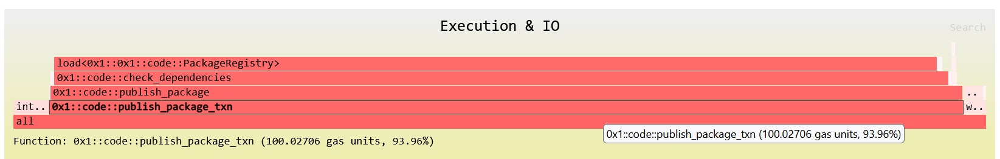
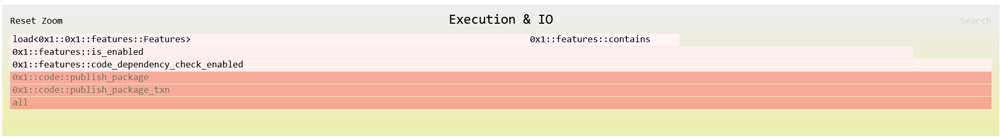
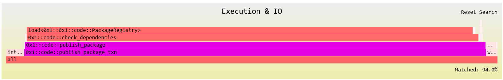
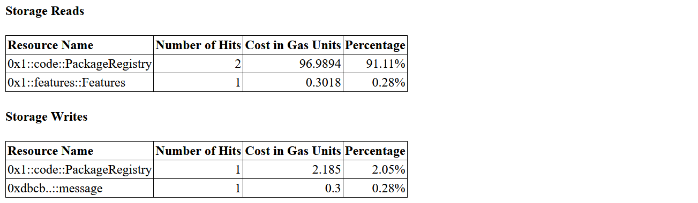

import CodeBlock from '@theme/CodeBlock';

# Gas Profiling
The Aptos Gas Profiler is a powerful tool that can help you understand the gas usage of Aptos transactions.
Once activated, it will simulate transactions using an instrumented VM, and generate a web-based report. <a href="/gas-profiling/sample-report/index.html" target="_blank">[Sample]</a>

The gas profiler can also double as a debugger since the report also includes a full execution trace.

## Using the Gas Profiler
The gas profiler can be invoked by appending the `--profile-gas` option to Aptos CLI’s `move publish`, `move run` or `move run-script` commands.

Here is an example using the [hello_blockchain package from move examples](https://github.com/aptos-labs/aptos-core/tree/main/aptos-move/move-examples/hello_blockchain). First, `cd` into the package directory.

```bash
$ cd aptos-move/move-examples/hello_blockchain
```

Then, we can simulate module publishing with the extra option `--profile-gas`.

Notice that you do need to have your CLI profile set up properly and bind the named addresses correctly. Please refer to [CLI Configuration](../../../tools/aptos-cli/use-cli/cli-configuration#initialize-local-configuration-and-create-an-account) for more details.
```bash
$ aptos move publish --named-addresses hello_blockchain=default --profile-gas
```

This will result in some terminal output that looks like this:
```bash title="Output"
Compiling, may take a little while to download git dependencies...
INCLUDING DEPENDENCY AptosFramework
INCLUDING DEPENDENCY AptosStdlib
INCLUDING DEPENDENCY MoveStdlib
BUILDING Examples
package size 1755 bytes

Simulating transaction locally with the gas profiler...
{
  "Result": {
    "transaction_hash": "0x26cc23d11070e6756c6b2ae0ea7d3fc4c791b59cf821f268ba0f03eebb487543",
    "gas_used": 1039,
    "gas_unit_price": 100,
    "sender": "dbcbe741d003a7369d87ec8717afb5df425977106497052f96f4e236372f7dd5",
    "success": true,
    "version": 762354147,
    "vm_status": "status EXECUTED of type Execution"
  }
}
```
Again, it should be emphasized that even though the live chain-state is being used, this is a simulation so the module has NOT really been published to the target network.

You can then find the generated gas report in the directory `gas-profiling`:
```text title="Directory Layout"
- hello_blockchain
  - gas-profiling
    - txn-xxxxxxxx-0x1-code-publish_package_txn
      - assets
      - index.html
  - sources
  - Move.toml
```
index.html is the main page of the report and you can view it in your web browser.

## Understanding the Gas Report
The gas report consists of three parts, enabling you to understand the gas usage through different lenses.

### Flamegraphs
The first section consists of visualization of the gas usage in the form of two flamegraphs: one for execution & IO, the other for storage.
The reason why we need two graphs is because these are measured in different units: one in gas units, and the other in APT.

It is possible to interact with various elements in the graph. If you hover your cursor over an item, it will show you the precise cost and percentage.


If you click on an item, you can zoom into it and see the child items more clearly.
You can reset the view by clicking the "Reset Zoom" button in the top-left corner.


There is also “Search” button in the top-right corner that allows to match certain items and highlight them.


### Cost Break-down
The second section is a detailed break-down of all gas costs. Data presented in this section is categorized, aggregated and sorted.
This can be especially helpful if you know what numbers to look at.

For example, the following tables show the IO costs of all storage operations.
The percentage here is relative to the total cost of the belonging category (Exec + IO in this case).




### Full Execution Trace
The final section of the gas report is the full execution trace of the transaction that looks like this:

```
execution & IO (gas unit, full trace)                        106.45206    100.00%
    intrinsic                                                3.94         3.70%
    0x1::code::publish_package_txn                           100.02706    93.96%
        move_loc                                             0.0024       0.00%
        move_loc                                             0.0024       0.00%
        call_generic                                         0.024        0.02%
        0x1::util::from_bytes<0x1::code::PackageMetadata>    0.1094       0.10%
        move_loc                                             0.0024       0.00%
        call                                                 0.064        0.06%
        0x1::code::publish_package                           99.82126     93.77%
            call                                             0.02         0.02%
            0x1::code::upgrade_policy_arbitrary              0.0076       0.01%
                ld_u8                                        0.0012       0.00%
                pack                                         0.0052       0.00%
                ret                                          0.0012       0.00%
            st_loc                                           0.0024       0.00%
            imm_borrow_loc                                   0.0012       0.00%
            imm_borrow_field                                 0.004        0.00%
            imm_borrow_field                                 0.004        0.00%
            read_ref                                         0.0072       0.01%
            imm_borrow_loc                                   0.0012       0.00%
            imm_borrow_field                                 0.004        0.00%
            read_ref                                         0.0072       0.01%
            gt                                               0.0032       0.00%
            br_false                                         0.0024       0.00%
            branch                                           0.0016       0.00%
            @17
...
```
The left column lists all Move instructions and operations being executed, with each level of indentation indicating a function call.

The middle column represents the gas costs associated with the operations.

There is also a special notation `@number` that represents a jump to a particular location in the byte code.
This is purely informational and to help understand the control flow.

## Future Plans
We plan to extend the gas profiler with the following features:
- Ability to replay historical transactions that have been committed (on mainnet, testnet etc.).
- Ability to annotate source files.

Feedbacks and feature requests are welcome! Please kindly submit them by creating GitHub issues [here](https://github.com/aptos-labs/aptos-core/issues).
