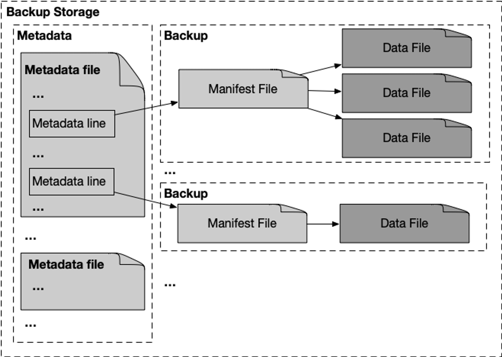

# Bootstrap Fullnode from Backup

Since the Aptos mainnet launch in October 2022, the Aptos community has grown rapidly. As of May 2023, Aptos has 743GB and 159GB of data in testnet and mainnet, respectively. We expect the data to increase greatly as more transactions are submitted to the blockchain. Facing such a large amount of data, we want to provide users with a way to achieve two goals:

- Quickly bootstrap a database to start a new or failed node
- Efficiently recover data from any specific period

Our database restore tool lets you use the existing [public backup files](#public-backup-files) to restore the database (i.e., the transaction history containing events, write sets, key-value pairs, etc.) on your local machine to any historical range or to the latest version. The public backup files are backed by cryptographic proof and stored on both AWS and Google Cloud for an easy download.

## Public backup files

Aptos Labs maintains a few publicly accessible database backups by continuously querying a local fullnode and storing the backup data in remote storage, such as Amazon S3 or Google Cloud Storage.

|  | AWS Backup Data | Google Cloud Backup Data  |
| --- | --- | --- |
| Testnet | https://github.com/aptos-labs/aptos-networks/blob/main/testnet/backups/s3-public.yaml | https://github.com/aptos-labs/aptos-networks/blob/main/testnet/backups/gcs.yaml |
| Mainnet | https://github.com/aptos-labs/aptos-networks/blob/main/mainnet/backups/s3-public.yaml | https://github.com/aptos-labs/aptos-networks/blob/main/mainnet/backups/gcs.yaml |

The backup files consist of three types of data that can be used to reconstruct the blockchain DB:

- `epoch_ending` – It contains the ledger_info at the ending block of each epoch since the genesis. This data can be used to prove the epoch's provenance from the genesis and validator set of each epoch.
- `state_snapshot` – It contains a snapshot of the blockchain's state Merkle tree (SMT) and key values at a certain version.
- `transaction` – It contains the raw transaction metadata, payload, the executed outputs of the transaction after VM, and the cryptographic proof of the transaction in the ledger history.

Each type of data in the backup storage is organized as follows:
- The metadata file in the metadata folder contains the range of each backup and the relative path to the backup folder. 
- The backup contains a manifest file and all the actual chunked data files.



## Restore a DB using the public backup files

The [Aptos CLI](../../tools/aptos-cli/use-cli/use-aptos-cli.md) supports two kinds of restore operations by reading from the public backup files:
1. Recreating a database with minimal transaction history at a user-specified transaction version (or the latest version the backup has)
2. Restoring the database over a specific period. In addition to the above, this option ensures that the recreated database carries the ledger history of the user-designated version range.

Aptos CLI 1.0.14 or newer is needed to perform these operations. Additionally, depending on whether you use AWS or Google Cloud, install [AWS CLI](https://docs.aws.amazon.com/cli/latest/userguide/getting-started-install.html) or [gsutil](https://cloud.google.com/storage/docs/gsutil_install).

### Bootstrap a DB

The `aptos node bootstrap-db` command can quickly restore a database from the closest snapshot to a target version, but it does not restore the transaction history prior to the target version.

Use the following options:
- `target-version` – The sync will begin from this period onwards in the transaction history.
- `command-adapter-config` – The path to one of the [YAML configuration files](#public-backup-files) that specifies the location of the public backup files and commands used by our backup and restore tool to interact with the remote storage.
- `target-db-dir` – The target DB path.

Example command:

```bash
aptos node bootstrap-db \ 
    --target-version 500000000 \
    --command-adapter-config /path/to/s3-public.yaml \
    --target-db-dir /path/to/local/db
```

### Restore a DB over a specific time period

The `aptos node bootstrap-db` command can restore the transaction history within a specified period, along with the state Merkle tree at the target version.

Use the following options:
- `ledger-history-start-version` – The version to which the DB will sync.
- `target-version` – The sync will begin from this period onwards in the transaction history.
- `command-adapter-config` – The path to one of the [YAML configuration files](#public-backup-files) that specifies the location of the public backup files and commands used by our backup and restore tool to interact with the remote storage.
- `target-db-dir` – The target DB path.

Example command:

```bash
aptos node bootstrap-db \ 
    --ledger-history-start-version 150000000 \
    --target-version 155000000 
    --command-adapter-config /path/to/s3-public.yaml \
    --target-db-dir /path/to/local/db
```

### Restore a fullnode with full history from genesis
To restore a fullnode with full history from genesis, set `ledger-history-start-version` to 0 and disable the pruner by [disabling the ledger pruner](../../guides/data-pruning.md).

Example command: 

```bash
aptos node bootstrap-db \
--ledger-history-start-version 0 \
--target-version use_the_largest_version_in_backup \
--command-adapter-config /path/to/s3-public.yaml \
--target-db-dir /path/to/local/db
```
Disable the pruner in the node config to prevent the early history from being pruned when you start the node.
```Yaml
storage:
 storage_pruner_config:
  ledger_pruner_config:
   enable: false

```
