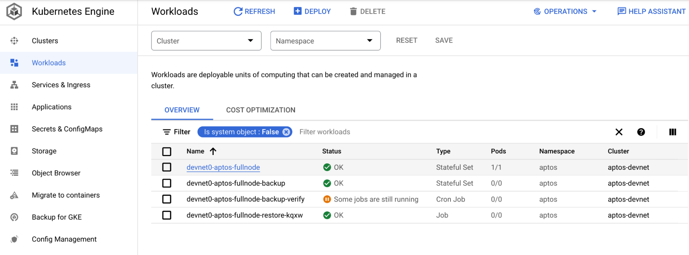
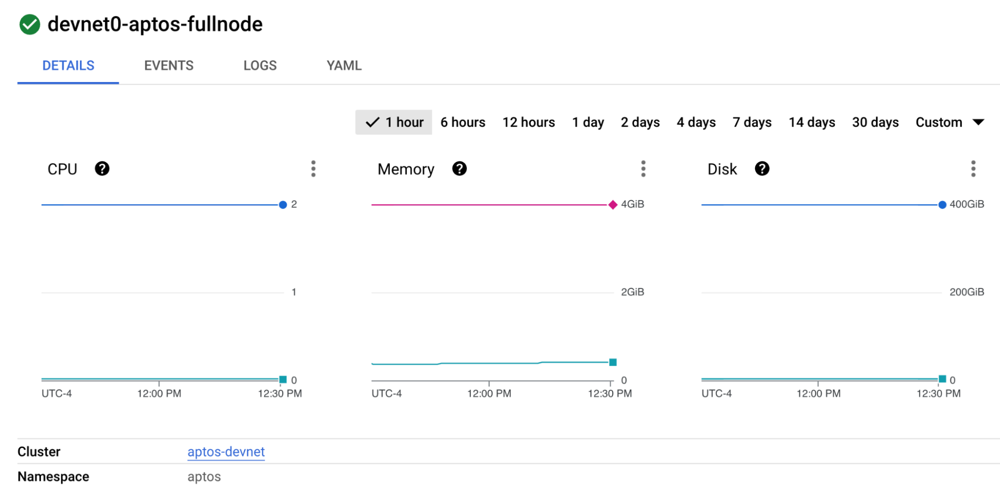
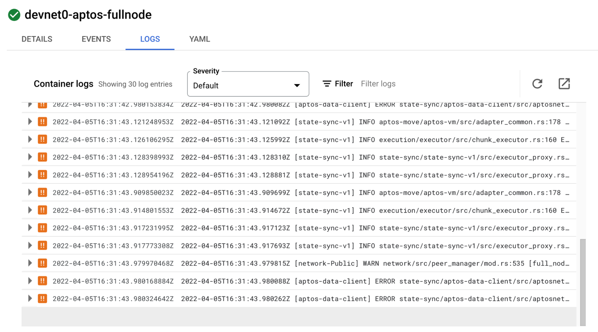
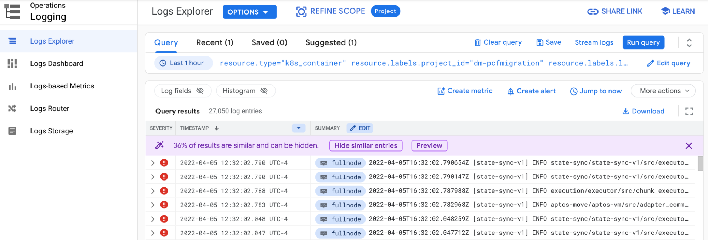
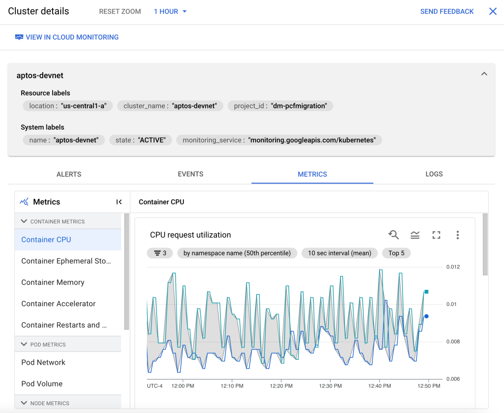
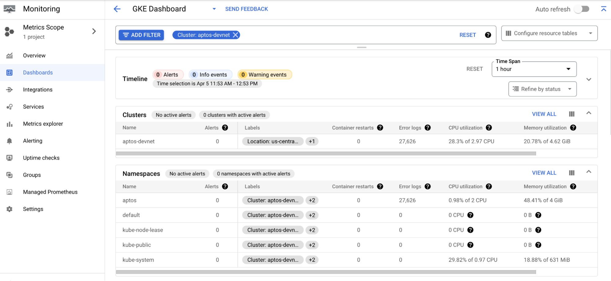

# Run a Public Fullnode on GCP

This tutorial explains how to configure and deploy a public fullnode to connect to the Aptos devnet using Google Cloud (GCP). Running a public fullnode in the cloud usually provides better stability and availability compared to running it on your laptop. **If you are looking to deploy a production grade public fullnode, we recommend you to deploy it on the cloud.**

:::tip Alternative methods for running a public fullnode
Read [Public Fullnode](./index.md) if you want other options for deployment. Using cloud comes with a cost, and it varies depending on how you configure it.
:::

## Prerequisites

You can run the commands in this guide to deploy your FullNode on Google Kubernetes Engine from any machine you want: From a [VM on GCP](https://cloud.google.com/compute), or [Google Cloud Shell](https://cloud.google.com/shell), or your personal computer.

The following packages are pre-installed with Cloud Shell. **Make sure to review** the [documentation around ephemeral mode](https://cloud.google.com/shell/docs/using-cloud-shell/#choose_ephemeral_mode) if you choose to use Cloud Shell. 

However, if you are running the installation from your laptop or another machine, you need to install:

* Terraform 1.3.6: https://www.terraform.io/downloads.html
* Kubernetes cli: https://kubernetes.io/docs/tasks/tools/
* Google Cloud cli: https://cloud.google.com/sdk/docs/install-sdk

After you have installed the gcloud CLI, [log into GCP using gcloud](https://cloud.google.com/sdk/gcloud/reference/auth/login):

```bash
gcloud auth login --update-adc
```

:::tip Already have a GCP account set up?
If you already have a GCP account setup, skip to [Getting Started](#getting-started). If you do not have a GCP account, then follow the below sections to create and configure your GCP account.
:::

### GCP setup

#### Sign up for the 90-day free trial

Google Cloud offers a [90 day $300 free trial for every new user](https://cloud.google.com/free/docs/gcp-free-tier/#free-trial). These $300 are given as credits to your account and you can use them to get a sense of Google Cloud products. Be aware that you will need to add payment information when signing up for the free trial. This is for identity verification purposes and [will not incur charges until you upgrade to a paid account and run out of credits](https://cloud.google.com/free/docs/gcp-free-tier/#:~:text=Don%27t%20worry%2C%20setting,90%2Dday%20period).). Some GCP feature such as GPUs and Windows servers are not available in the free trial. 

:::tip Sign up for GCP $300 credits 
[Sign up for the $300 in credits here.](https://cloud.google.com/free)
:::

#### Create a new GCP project

- Create a new project on the GCP Console or using the gcloud command from the Google Cloud CLI. Before you do that, familiarize yourself with the [resource hierarchy on GCP](https://cloud.google.com/resource-manager/docs/cloud-platform-resource-hierarchy).
- [Follow these instructions to setup a new project.](https://cloud.google.com/resource-manager/docs/creating-managing-projects#creating_a_project).

#### Enable billing, upgrade your account

You will still be able to use the free trial credits, but enabling billing allows you to have full access to all the features of GCP and not experience any interruption to your nodes.

[Upgrade your account by following the steps outlined here.](https://cloud.google.com/free/docs/gcp-free-tier#how-to-upgrade)

#### Additional GCP resources

This should be enough to get your GCP setup ready to start deploying your fullnode. But if you are brand new to GCP, you may want to check out some of our [quickstart guides](https://cloud.google.com/docs/get-started/quickstarts) and [Google Cloud Skills Boost](https://www.cloudskillsboost.google/catalog).


## Getting started

:::tip Before you proceed
From here on, this guide assumes that you have already set up your GCP account, and have created a new project for deploying Aptos public fullnode. If you don't, check out the instructions above for [GCP Setup](#gcp-setup).
:::

You can deploy a public fullnode on GCP by using the Aptos fullnode Terraform module.

1. Create a working directory for your configuration.

    * Choose a workspace name e.g. `devnet`. **Note**: This defines the Terraform workspace name, which in turn is used to form resource names.
    ```bash
    export WORKSPACE=devnet
    ```

    * Create a directory for the workspace
    ```bash
    mkdir -p ~/$WORKSPACE
    ```

2. Create a storage bucket for storing the Terraform state on Google Cloud Storage.  Use the console or this gcs command to create the bucket. The name of the bucket must be unique. See the Google Cloud Storage documentation here: https://cloud.google.com/storage/docs/creating-buckets#prereq-cli.

  ```bash
  gsutil mb gs://BUCKET_NAME
  # for example
  gsutil mb gs://<project-name>-aptos-terraform-dev
  ```

3. Create Terraform file called `main.tf` in your working directory:
  ```bash
  cd ~/$WORKSPACE
  touch main.tf
  ```

4. Modify the `main.tf` file to configure Terraform and create a public fullnode from the Terraform module.

**Note:** If you are using a different version of Terraform, you will need to use the `tfenv` command to change the required version. 

You can find the Docker image tag at https://hub.docker.com/r/aptoslabs/validator/tags?page=1&ordering=last_updated&name=devnet

Example content for `main.tf`:

  ```rust
  terraform {
    required_version = "~> 1.3.6"
    backend "gcs" {
      bucket = "BUCKET_NAME" # bucket name created in step 2
      prefix = "state/fullnode"
    }
  }

  module "fullnode" {
    # download Terraform module from aptos-labs/aptos-core repo
    source        = "github.com/aptos-labs/aptos-core.git//terraform/fullnode/gcp?ref=main"
    region        = "us-central1"  # Specify the region
    zone          = "c"            # Specify the zone suffix
    project       = "gcp-fullnode" # Specify your GCP project ID
    fullnode_name = "BUCKET_NAME" #bucket name created in step 2
    era           = 1              # bump era number to wipe the chain
    image_tag     = "devnet" # Specify the docker image tag 
  }
  ```

5. Initialize Terraform in the same directory of your `main.tf` file:

  ```bash
  terraform init
  ```

This will download all the Terraform dependencies into the `.terraform` folder.

6. Create a new Terraform workspace to isolate your environments:

  ```bash
  terraform workspace new $WORKSPACE
  # This command will list all workspaces
  terraform workspace list
  ```

7. Apply the configuration:

  ```bash
  terraform apply
  ```

  This might take a while to finish (10 - 20 minutes), Terraform will create all the resources on your cloud account.

## Validation

Once Terraform apply finished, you can follow this section to validate your deployment.

1. Configure your Kubernetes client to access the cluster you just deployed:

  ```bash
  gcloud container clusters get-credentials aptos-$WORKSPACE --zone <region_zone_name> --project <project_name>
  # for example:
  gcloud container clusters get-credentials aptos-devnet --zone us-central1-a --project aptos-fullnode
  ```

2. Check that your public fullnode pods are now running (this may take a few minutes):

  ```bash
  kubectl get pods -n aptos
  ```
You should see this:

```
NAME                       READY   STATUS    RESTARTS   AGE
devnet0-aptos-fullnode-0   1/1     Running   0          56s
```

3. Get your public fullnode IP:

  ```bash
  kubectl get svc -o custom-columns=IP:status.loadBalancer.ingress -n aptos
  ```
  
  You should see this:
  
  ```IP
[map[ip:104.198.36.142]]
```

4. Check the REST API, make sure that the ledger version is increasing:

  ```bash
  curl http://<IP>/v1
  # Example command syntax: curl http://104.198.36.142/v1
  ```
  
  You should see this:
  ```
  {"chain_id":25,"epoch":"22","ledger_version":"9019844","oldest_ledger_version":"0","ledger_timestamp":"1661620200131348","node_role":"full_node","oldest_block_height":"0","block_height":"1825467"}
```

5. To verify the correctness of your public fullnode, as outlined in the section [Verify the correctness of your FullNode](./fullnode-source-code-or-docker.md#verify-the-correctness-of-your-public-fullnode), you will need to:
   - Set up a port-forwarding mechanism directly to the aptos pod in one ssh terminal, and
   - Test it in another ssh terminal. 
   
   Follow the below steps:

   * Set up the port-forwarding to the aptos-fullnode pod.  Use `kubectl get pods -n aptos` to get the name of the pod:

      ```bash
      kubectl port-forward -n aptos <pod-name> 9101:9101
      # for example:
      kubectl port-forward -n aptos devnet0-aptos-fullnode-0 9101:9101
      ```

   * Open a new ssh terminal.  Execute the following curl calls to verify the correctness:
   
      ```bash
      curl -v http://0:9101/metrics 2> /dev/null | grep "aptos_state_sync_version{type=\"synced\"}"

      curl -v http://0:9101/metrics 2> /dev/null | grep "aptos_connections{direction=\"outbound\""
      ```

   * Exit port-forwarding when you are done by entering control-c in the terminal.


## Configure identity and seed peers

### Static identity

If you want to configure your node with a static identity, first see the [Network Identity For Fullnode](./network-identity-fullnode.md) for how to generate the keys, and then follow the below instructions to configure your Terraform file.

1. Generate your own private key, and extract peer id, following the guide [Creating a static identity for a fullnode](./network-identity-fullnode.md#creating-a-static-identity-for-a-fullnode).

2. Modify the `main.tf` to add `fullnode_identity` in `fullnode_helm_values`. This will configure the keys for public fullnode, for example:

  ```rust
  module "fullnode" {
    # download Terraform module from aptos-labs/aptos-core repo
    source        = "github.com/aptos-labs/aptos-core.git//terraform/fullnode/gcp?ref=main"
    region        = "us-central1"  # Specify the region
    zone          = "c"            # Specify the zone suffix
    project       = "gcp-fullnode" # Specify your GCP project name
    era           = 1              # bump era number to wipe the chain
    image_tag     = "devnet"       # Specify the docker image tag to use

    fullnode_helm_values = {
      chain = {
        name = "devnet"
      }
      # create fullnode from this identity config, so it will always have same peer id and address
      fullnode_identity = {
        type = "from_config"
        key = "B8BD811A91D8E6E0C6DAC991009F189337378760B55F3AD05580235325615C74"
        peer_id = "ca3579457555c80fc7bb39964eb298c414fd60f81a2f8eedb0244ec07a26e575"
      }
    }
  }
  ```

3. Apply Terraform changes:

  ```bash
  terraform apply
  ```

### Add upstream seed peers

You can add upstream seed peers to allow your node state sync from a specific . This is helpful when the public fullnode is not able to connect to the network due to congestion.

1. Obtain the upstream peer id information. You can either use the one listed in the [Connecting your fullnode to seed peers](./fullnode-network-connections.md#connecting-your-fullnode-to-seed-peers), or grab one from the [Aptos Discord](https://discord.gg/aptosnetwork) [#advertise-full-node](https://discord.com/channels/945856774056083548/956342147546746901) channel; these are the nodes hosted by our community.

2. Modify the `main.tf` to add seeds for devnet in `fullnode_helm_values`. This will configure the upstream seeds for public fullnode. For example:

```rust
module "fullnode" {
    # download Terraform module from aptos-labs/aptos-core repo
    source        = "github.com/aptos-labs/aptos-core.git//terraform/fullnode/gcp?ref=main"
    region        = "us-central1"  # Specify the region
    zone          = "c"            # Specify the zone suffix
    project       = "gcp-fullnode" # Specify your GCP project name
    era           = 1              # bump era number to wipe the chain
    image_tag     = "dev_5b525691" # Specify the docker image tag to use

    fullnode_helm_values = {
      # add a list of peers as upstream
      aptos_chains = {
        devnet = {
          seeds = {
            "bb14af025d226288a3488b4433cf5cb54d6a710365a2d95ac6ffbd9b9198a86a" = {
            addresses = ["/dns4/pfn0.node.devnet.aptoslabs.com/tcp/6182/noise-ik/bb14af025d226288a3488b4433cf5cb54d6a710365a2d95ac6ffbd9b9198a86a/handshake/0"]
            role = "Upstream"
            },
            "7fe8523388084607cdf78ff40e3e717652173b436ae1809df4a5fcfc67f8fc61" = {
            addresses = ["/dns4/pfn1.node.devnet.aptoslabs.com/tcp/6182/noise-ik/7fe8523388084607cdf78ff40e3e717652173b436ae1809df4a5fcfc67f8fc61/handshake/0"]
            role = "Upstream"
            },
            "f6b135a59591677afc98168791551a0a476222516fdc55869d2b649c614d965b" = {
            addresses = ["/dns4/pfn2.node.devnet.aptoslabs.com/tcp/6182/noise-ik/f6b135a59591677afc98168791551a0a476222516fdc55869d2b649c614d965b/handshake/0"]
            role = "Upstream"
            }
          }
        }
      }
    }
  }
```

3. Apply Terraform changes:

  ```bash
  terraform apply
  ```

## Check logging

To check the logs of the pod, use the following commands:

  ```bash
  # Get a list of the pods
  kubectl get pods -n aptos

  # Get logs of the pod
  kubectl logs <pod-name> -n aptos
  # for example:
  kubectl logs devnet0-aptos-fullnode-0 -n aptos
  ```

When using GKE, the logs of the cluster and pod will automatically show up in the Google Cloud console.  From the console menu, choose `Kubernetes Engine`.  From the side menu, choose `Workloads`.  You will see all the pods from the cluster listed.  





The `devnet0-aptos-fullnode` is the pod that is running the aptos fullnode container. Click on the pod to view details.  You will see some metrics and other details about the pod.





Click the `LOGS` tab to view the logs directly from the pod.  If there are errors in the pod, you will see them here.





Click the `open in new window` icon to view the logs in the Log Explorer.  This screen allows advanced searching in the logs.  





Other logging insights are available in the Logs Dashboard 


Additional [features](https://cloud.google.com/logging/docs) are available through [Cloud Logging](https://cloud.google.com/logging), including creating log-based metrics, logging sinks and log buckets. 


## Check monitoring

Google cloud captures many metrics from the cluster and makes them easily viewable in the console.  From the console menu, choose `Kubernetes Engine`.  Click on the cluster that aptos is deployed to.  Click on the `Operations` link at the top right.  Click on the `Metrics` sub-tab to view specific cluster metrics.





Click the `View in Cloud Monitoring` link at the top to view the built-in GKE [dashboard](https://cloud.google.com/stackdriver/docs/solutions/gke/observing) for the cluster.  





Google Cloud [Monitoring](https://cloud.google.com/monitoring) has many other features to easily monitor the cluster and pods.  You can configure [uptime checks](https://cloud.google.com/monitoring/uptime-checks/introduction) for the services and configure [alerts](https://cloud.google.com/monitoring/alerts/using-alerting-ui) for when the metrics reach a certain [threshold](https://cloud.google.com/stackdriver/docs/solutions/slo-monitoring/sli-metrics/overview).  
