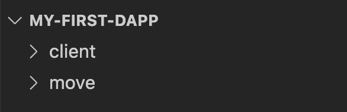

# 2. Set up React App

This is the second chapter of the tutorial on [building an end-to-end dapp on Aptos](./index.md) where you have already [created a smart contract](./1-create-smart-contract.md) and are now setting up a React app.

## Set up the app

We will use the `react` library to build the client side with [Create React App](https://create-react-app.dev/docs/getting-started#creating-an-app).

For the UI, we will use [Ant Design](https://ant.design/). This is just a personal decision; you are welcome to use any different UI library/framework you wish.

1. In the root folder of the `my-first-dapp` project, run:

```js
npx create-react-app client --template typescript
```

That will create a new `client` folder in the current path:

2. Your file structure should look something like:

   

3. Run: `cd client`
4. Run: `npm start`

   At this point you should have your app running on [http://localhost:3000](http://localhost:3000), which displays the default React layout.

5. In the `client/src` directory, find all of the React app files. Let’s clean it up a bit.
6. Open the `App.tsx` file and update its content to be:

```js
function App() {
  return <div>My app goes here</div>;
}

export default App;
```

Once you save the changes, you should see that the app content has changed in the browser and displays `My app goes here`.

7. Open the `App.tsx` file and remove the `import './App.css';` and `import logo from './logo.svg';` lines. Since we remove the default imports on this file, we can remove some files in our project. Delete the files `App.css` and `logo.svg`.
8. Open the `index.tsx` file and remove the `import './index.css';` line at the top of the file.
   Now you can also delete the `src/index.css` file.

## Our dapp UI

First we will build the dApp UI layout. We have two UI states for the app:

- When an account hasn’t created a list yet (on the left).
- When an account has created a list and can now add tasks to it (on the right).
  

We will use the [Ant Design](https://ant.design/) library for our UI:

1. Stop the local server if running.
2. On to the `client` directory and install our UI library package: `npm i antd@5.1.4`
3. Update `App.tsx` with the initial state UI:

```jsx
return (
  <>
    <Layout>
      <Row align="middle">
        <Col span={10} offset={2}>
          <h1>Our todolist</h1>
        </Col>
        <Col span={12} style={{ textAlign: "right", paddingRight: "200px" }}>
          <h1>Connect Wallet</h1>
        </Col>
      </Row>
    </Layout>
  </>
);
```

4. Dont forget to import the _components_ we just added:

```js
import { Layout, Row, Col } from "antd";
```

5. Run the local server with `npm start`, you should see the _header_ that matches our UI mockup.

It is now time to [add wallet support](./3-add-wallet-support.md) in chapter 3.
