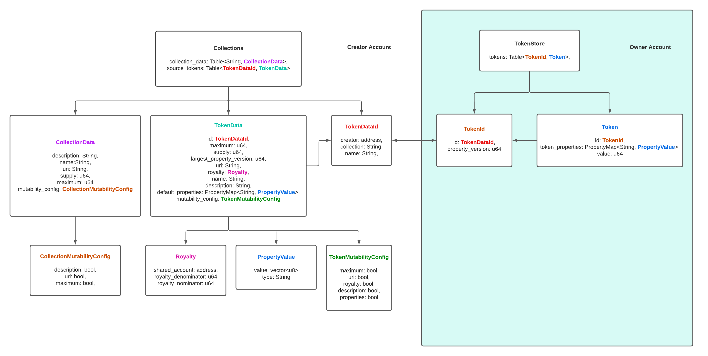

import Tabs from '@theme/Tabs';
import TabItem from '@theme/TabItem';

Note: The following tutorial is a work in progress. Furthermore, the Aptos' (Non-Fungible) Token specification has not been formalized.

# Tokens and NFTs

An [NFT](https://en.wikipedia.org/wiki/Non-fungible_token) is a non-fungible token or data stored on a blockchain that uniquely defines ownership of an asset. 
NFTs were first defined in [EIP-721](https://eips.ethereum.org/EIPS/eip-721) and later expanded upon in [EIP-1155](https://eips.ethereum.org/EIPS/eip-1155). NFTs typically comprise of the following aspects:

- A name, the name of the asset, which must be unique within a collection
- A description, the description of the asset
- A URL, a non-descript pointer off-chain to more information about the asset could be media such as an image or video or more metadata
- A supply, the total number of units of this NFT, many NFTs have only a single supply while those that have more than one are referred to as editions

Additionally, most NFTs are part of a collection or a set of NFTs with a common attribute, e.g., theme, creator, or minimally contract. Each collection has a similar set of attributes:

- A name, the name of the collection, which must be unique within the creator's account
- A description, the description of the asset
- A URL, a non-descript pointer off-chain to more information about the asset could be media such as an image or video or more metadata

# Aptos Digital Asset Token  Standard

When we work on Aptos token standard, we hold the following principles:

* Provide a standard implementation to improve interoperability across ecosystem projects. 

* Achieve maximal liquidity through defining NFT, Fungible (non-decimal) and Semi-Fungible tokens in one contract. These different types of tokens can be easily stored, transferred and transacted in the same way

* Enable the customization of token properties, users can define their own properties and store them on-chain. 

* Reduce the cost of minting large amounts of NFT tokens. We support `lazy` on-chain mint through semi-fungible token

The Aptos implementation for core NFTs or Tokens can be found in [Token.move](https://github.com/aptos-labs/aptos-core/blob/main/aptos-move/framework/aptos-token/sources/token.move).

## Aptos Token Definitions

### The Token  Data Model



The token related data are stored at both creator’s account and owner’s account.

**Resource stored at creator’s address:**

| Field | Description                                                                                                                                                                                                                    |
|------|--------------------------------------------------------------------------------------------------------------------------------------------------------------------------------------------------------------------------------|
|Collections| maintains a table called `collection_data`, which maps the collection name to the `CollectionData`. It also stores all the TokenData that this creator creates.                                                                |
|CollectionData  | store the collection metadata. The `supply` is the number of tokens created for the current collection. `maxium` is the upper bound of tokens in this collection                                                               |
|CollectionMutabilityConfig| specify which field is mutable.                                                                                                                                                                                                |
|TokenData| main struct for holding the token metadata. Properties is a where user can add their own properties that are not defined in the token data. User can mint more tokens based on the TokenData and they share the same TokenData. |
|TokenMutabilityConfig| control which fields are mutable                                                                                                                                                                                               |
|TokenDataId| an id used for representing and querying TokenData on-chain. This id mainly contains 3 fields including creator address, collection name and token name.                                                                 |
|Royalty| specify the denominator and numerator for calculating the royalty fee. It also has payee account address for depositing the Royalty.                                                                                           |
|PropertyValue| contain both value of a property and type of property.                                                                                                                                                                         |

**Resource stored at owner’s address:**

| Field | Description                                                                                                                                                      |
|-----------|------------------------------------------------------------------------------------------------------------------------------------------------------------------|
|TokenStore| main struct for storing the token owned by this address. It maps TokenId to the actual token.                                                                    |
|Token| `amount` is the number of tokens.                                                                                                                                |
|TokenId| `TokenDataId` points to the metadata of this token. The `property_version` represents a token with mutated PropertyMap from `default_properties` in the TokenData. |

## Introducing Tokens
This tutorial will walk you through the process of

- creating your own Token collection,
- a Token of our favorite cat,
- and giving that token to someone else.
- on-chain lazy mint token through mutation

This tutorial builds on [Your first transaction](/tutorials/your-first-transaction) as a library for this example. The following tutorial contains example code that can be downloaded in its entirety below:

<Tabs>
  <TabItem value="python" label="Python" default>

For this tutorial, will be focusing on `first_nft.ts` and re-using the `first_transaction.ts` library from the previous tutorial.

You can find the typescript project [here](https://github.com/aptos-labs/aptos-core/tree/main/developer-docs-site/static/examples/typescript)

  </TabItem>
  <TabItem value="rust" label="Rust" default>

For this tutorial, will be focusing on `first_nft.py` and re-using the `first_transaction.py` library from the previous tutorial.

  </TabItem>
  <TabItem value="typescript" label="Typescript" default>

  </TabItem>
  <TabItem value="rust" label="Rust">

TODO

  </TabItem>
</Tabs>

### Creating a Collection
The Aptos Token enables creators to create collections.  The maximum is the total number of tokens that can be created for this collection.
```rust  
public(script) fun create_collection_script (
	creator: &signer,  
	name: String,  
	description: String,  
	uri: String,  
	maximum: u64,  
	mutate_setting: vector<bool>,
)  
```  

These script functions can be called via the REST API. The following demonstrates how to call the as demonstrated in the following:

<Tabs>
  <TabItem value="python" label="Python" default>

```python  
:!: static/examples/python/first_nft.py section_1  
```  
  </TabItem>
  <TabItem value="rust" label="Rust" default>

TODO  
</TabItem>
<TabItem value="typescript" label="Typescript" default>

```typescript  
:!: static/examples/typescript/first_nft.ts section_1  
```  

  </TabItem>
</Tabs>

### Creating a Token

Tokens can be created after collection creation. To do so, the token must specify the same `collection` as specified as the name of a previously created collection `name`. The Move script function is:

```rust  
public entry fun create_token_script(
	creator: &signer,  
	collection: String,  
	name: String,  
	description: String,  
	balance: u64,  
	maximum: u64,  
	uri: String,  
	royalty_payee_address: address,  
	royalty_points_denominator: u64,  
	royalty_points_numerator: u64,  
	token_mutate_setting: vector<bool>,  
	property_keys: vector<String>,  
	property_values: vector<vector<u8>>,  
	property_types: vector<String>,  
)
```  
The `balance` field is the initial amount to be created for this token. `maximum` dictates the maximal number of tokens to be minted for this created `TokenData`. 
`royalty_payee_address` is address that royalty is paid to.  `royalty_points_numerator` / `royalty_points_denominator` is the percentage of sale price (`Royalty`) should be paid to the payee address.
It can be a single owner's account address or an address of a shared account owned by a group of creators. 
`token_mutate_setting` describes whether a field is `TokenData` is mutable. 
`property_keys`, `property_values` and `property_types` are the property key value pairs that can be stored, read and write on-chain.

These script functions can be called via the REST API. The following demonstrates how to call the as demonstrated in the following:


<Tabs>
  <TabItem value="python" label="Python" default>

```python  
:!: static/examples/python/first_nft.py section_2  
```  
  </TabItem>
  <TabItem value="rust" label="Rust" default>

TODO  
</TabItem>
<TabItem value="typescript" label="Typescript" default>

```typescript  
:!: static/examples/typescript/first_nft.ts section_2  
```  
  </TabItem>
</Tabs>

### Giving Away a Token

In Aptos and Move, each token occupies space and has ownership. Because of this, token transfers are not unilateral and require two phase process similar to a bulletin board. The sender must first register that a token is available for the recipient to claim, the recipient must then claim this token. This has been implemented in a proof of concept move module called [`TokenTransfer`](https://github.com/aptos-labs/aptos-core/blob/nft/aptos-move/framework/aptos-framework/sources/TokenTransfers.move). `SimpleToken` provides a few wrapper functions to support transferring to another account, claiming that transfer, or stopping that transfer.

#### Obtaining the Token ID

In order to transfer the token, the sender must first identify the token id based upon knowing the creator's account, the collection name, and the token name. This can be obtained by querying REST:

<Tabs>
  <TabItem value="python" label="Python" default>

```python  
:!: static/examples/python/first_nft.py section_3  
```  
  </TabItem>
  <TabItem value="rust" label="Rust" default>

TODO  
</TabItem>
<TabItem value="typescript" label="Typescript" default>

```typescript  
:!: static/examples/typescript/first_nft.ts section_3  
```  
  </TabItem>
</Tabs>

#### Offering the Token

The following Move script function in `Token` supports transferring a token to another account, effectively registering that the other account can claim the token:

```rust  
public entry fun offer_script(  
    sender: signer,  
    receiver: address,  
    creator: address,  
    collection: String,
    name: String,  
    property_version: u64, 
    amount: u64,  
) 
```  

<Tabs>
  <TabItem value="python" label="Python" default>

```python  
:!: static/examples/python/first_nft.py section_4  
```  
  </TabItem>
  <TabItem value="rust" label="Rust" default>

TODO  
</TabItem>
<TabItem value="typescript" label="Typescript" default>

```typescript  
:!: static/examples/typescript/first_nft.ts section_4  
```  
  </TabItem>
</Tabs>

#### Claiming the Token

The following Move script function in `SimpleToken` supports receiving a token provided by the previous function, effectively claiming a token:

```rust  
public entry fun claim_script(  
    receiver: signer,  
    sender: address,  
    creator: address,  
    collection: String,  
    name: String,  
    property_version: u64, 
)  
```  

<Tabs>  
  <TabItem value="python" label="Python" default>

```python  
:!: static/examples/python/first_nft.py section_5  
```  
  </TabItem>
  <TabItem value="rust" label="Rust" default>
TODO  
  </TabItem>
  <TabItem value="typescript" label="Typescript" default>

```typescript  
:!: static/examples/typescript/first_nft.ts section_5  
```  
  </TabItem>
</Tabs>

#### On-chain Lazy Mint
When Alice becomes a celebrity in her community. Her cat NFTs are in high demand. However, Alice doesn't want to pay the cost
of minting 10 million NFTs initially. She wants to only pay the cost when someone wants the NFT.

She can mint 10 million uninitialized fungible cat token in one transaction.

When Jack wants to buy an NFT from Alice, she can mutate one fungible token. 
```RUST
    public entry fun mutate_token_properties(
        account: &signer,
        token_owner: address,
        creator: address,
        collection_name: String,
        token_name: String,
        token_property_version: u64,
        amount: u64,
        keys: vector<String>,
        values: vector<vector<u8>>,
        types: vector<String>,
    )
```

This will create a new property_version and create a new `TokenId` for the previous uninitialized fungible token (`property_version` = 0) to become an NFT.
Alice can then transfer the NFT to Jack. Alice only pay the cost for creating NFT from the fungbile token when someone wants to buy.


```python  
:!: static/examples/python/first_nft.py section_6  
```  
  </TabItem> 
  <TabItem value="rust" label="Rust" default>  
TODO  
  </TabItem>
  <TabItem value="typescript" label="Typescript" default>
TODO
  </TabItem>
</Tabs>

## Todos for Tokens

* Add ability for additional mints
* Add events -- needs feedback on what events
* Provide mutable APIs for tokens
* Provide testing tools for testing token related contracts
* Enable burning in a safe way
* Provide SDK, APIs and Indexing for tokens with better UX
* Add marketplace and auction contracts to our token standard
