# Overview

Relevant source files

The following files were used as context for generating this wiki page:

- [Cargo.lock](https://github.com/aptos-labs/aptos-core/blob/b9f89a19/Cargo.lock)
- [Cargo.toml](https://github.com/aptos-labs/aptos-core/blob/b9f89a19/Cargo.toml)
- [api/src/tests/converter_test.rs](https://github.com/aptos-labs/aptos-core/blob/b9f89a19/api/src/tests/converter_test.rs)
- [api/src/view_function.rs](https://github.com/aptos-labs/aptos-core/blob/b9f89a19/api/src/view_function.rs)
- [api/types/src/convert.rs](https://github.com/aptos-labs/aptos-core/blob/b9f89a19/api/types/src/convert.rs)
- [api/types/src/lib.rs](https://github.com/aptos-labs/aptos-core/blob/b9f89a19/api/types/src/lib.rs)
- [api/types/src/move_types.rs](https://github.com/aptos-labs/aptos-core/blob/b9f89a19/api/types/src/move_types.rs)
- [api/types/src/transaction.rs](https://github.com/aptos-labs/aptos-core/blob/b9f89a19/api/types/src/transaction.rs)
- [api/types/src/wrappers.rs](https://github.com/aptos-labs/aptos-core/blob/b9f89a19/api/types/src/wrappers.rs)
- [aptos-move/aptos-aggregator/src/delta_change_set.rs](https://github.com/aptos-labs/aptos-core/blob/b9f89a19/aptos-move/aptos-aggregator/src/delta_change_set.rs)
- [aptos-move/aptos-aggregator/src/resolver.rs](https://github.com/aptos-labs/aptos-core/blob/b9f89a19/aptos-move/aptos-aggregator/src/resolver.rs)
- [aptos-move/aptos-aggregator/src/tests/types.rs](https://github.com/aptos-labs/aptos-core/blob/b9f89a19/aptos-move/aptos-aggregator/src/tests/types.rs)
- [aptos-move/aptos-debugger/src/lib.rs](https://github.com/aptos-labs/aptos-core/blob/b9f89a19/aptos-move/aptos-debugger/src/lib.rs)
- [aptos-move/aptos-release-builder/src/components/feature_flags.rs](https://github.com/aptos-labs/aptos-core/blob/b9f89a19/aptos-move/aptos-release-builder/src/components/feature_flags.rs)
- [aptos-move/aptos-resource-viewer/src/lib.rs](https://github.com/aptos-labs/aptos-core/blob/b9f89a19/aptos-move/aptos-resource-viewer/src/lib.rs)
- [aptos-move/aptos-transaction-simulation/src/account.rs](https://github.com/aptos-labs/aptos-core/blob/b9f89a19/aptos-move/aptos-transaction-simulation/src/account.rs)
- [aptos-move/aptos-transaction-simulation/src/state_store.rs](https://github.com/aptos-labs/aptos-core/blob/b9f89a19/aptos-move/aptos-transaction-simulation/src/state_store.rs)
- [aptos-move/aptos-vm-environment/src/prod_configs.rs](https://github.com/aptos-labs/aptos-core/blob/b9f89a19/aptos-move/aptos-vm-environment/src/prod_configs.rs)
- [aptos-move/aptos-vm-types/src/abstract_write_op.rs](https://github.com/aptos-labs/aptos-core/blob/b9f89a19/aptos-move/aptos-vm-types/src/abstract_write_op.rs)
- [aptos-move/aptos-vm-types/src/change_set.rs](https://github.com/aptos-labs/aptos-core/blob/b9f89a19/aptos-move/aptos-vm-types/src/change_set.rs)
- [aptos-move/aptos-vm-types/src/tests/test_change_set.rs](https://github.com/aptos-labs/aptos-core/blob/b9f89a19/aptos-move/aptos-vm-types/src/tests/test_change_set.rs)
- [aptos-move/aptos-vm-types/src/tests/utils.rs](https://github.com/aptos-labs/aptos-core/blob/b9f89a19/aptos-move/aptos-vm-types/src/tests/utils.rs)
- [aptos-move/aptos-vm/src/aptos_vm.rs](https://github.com/aptos-labs/aptos-core/blob/b9f89a19/aptos-move/aptos-vm/src/aptos_vm.rs)
- [aptos-move/aptos-vm/src/data_cache.rs](https://github.com/aptos-labs/aptos-core/blob/b9f89a19/aptos-move/aptos-vm/src/data_cache.rs)
- [aptos-move/aptos-vm/src/errors.rs](https://github.com/aptos-labs/aptos-core/blob/b9f89a19/aptos-move/aptos-vm/src/errors.rs)
- [aptos-move/aptos-vm/src/lib.rs](https://github.com/aptos-labs/aptos-core/blob/b9f89a19/aptos-move/aptos-vm/src/lib.rs)
- [aptos-move/aptos-vm/src/move_vm_ext/resolver.rs](https://github.com/aptos-labs/aptos-core/blob/b9f89a19/aptos-move/aptos-vm/src/move_vm_ext/resolver.rs)
- [aptos-move/aptos-vm/src/move_vm_ext/vm.rs](https://github.com/aptos-labs/aptos-core/blob/b9f89a19/aptos-move/aptos-vm/src/move_vm_ext/vm.rs)
- [aptos-move/aptos-vm/src/move_vm_ext/write_op_converter.rs](https://github.com/aptos-labs/aptos-core/blob/b9f89a19/aptos-move/aptos-vm/src/move_vm_ext/write_op_converter.rs)
- [aptos-move/aptos-vm/src/natives.rs](https://github.com/aptos-labs/aptos-core/blob/b9f89a19/aptos-move/aptos-vm/src/natives.rs)
- [aptos-move/aptos-vm/src/transaction_validation.rs](https://github.com/aptos-labs/aptos-core/blob/b9f89a19/aptos-move/aptos-vm/src/transaction_validation.rs)
- [aptos-move/e2e-move-tests/Cargo.toml](https://github.com/aptos-labs/aptos-core/blob/b9f89a19/aptos-move/e2e-move-tests/Cargo.toml)
- [aptos-move/e2e-move-tests/src/harness.rs](https://github.com/aptos-labs/aptos-core/blob/b9f89a19/aptos-move/e2e-move-tests/src/harness.rs)
- [aptos-move/e2e-move-tests/src/tests/mod.rs](https://github.com/aptos-labs/aptos-core/blob/b9f89a19/aptos-move/e2e-move-tests/src/tests/mod.rs)
- [aptos-move/e2e-move-tests/src/tests/remote_state.rs](https://github.com/aptos-labs/aptos-core/blob/b9f89a19/aptos-move/e2e-move-tests/src/tests/remote_state.rs)
- [aptos-move/e2e-tests/src/executor.rs](https://github.com/aptos-labs/aptos-core/blob/b9f89a19/aptos-move/e2e-tests/src/executor.rs)
- [aptos-move/framework/aptos-framework/doc/transaction_validation.md](https://github.com/aptos-labs/aptos-core/blob/b9f89a19/aptos-move/framework/aptos-framework/doc/transaction_validation.md)
- [aptos-move/framework/aptos-framework/sources/transaction_validation.move](https://github.com/aptos-labs/aptos-core/blob/b9f89a19/aptos-move/framework/aptos-framework/sources/transaction_validation.move)
- [aptos-move/framework/aptos-framework/sources/transaction_validation.spec.move](https://github.com/aptos-labs/aptos-core/blob/b9f89a19/aptos-move/framework/aptos-framework/sources/transaction_validation.spec.move)
- [aptos-move/framework/move-stdlib/doc/features.md](https://github.com/aptos-labs/aptos-core/blob/b9f89a19/aptos-move/framework/move-stdlib/doc/features.md)
- [aptos-move/framework/move-stdlib/sources/configs/features.move](https://github.com/aptos-labs/aptos-core/blob/b9f89a19/aptos-move/framework/move-stdlib/sources/configs/features.move)
- [aptos-move/framework/move-stdlib/sources/configs/features.spec.move](https://github.com/aptos-labs/aptos-core/blob/b9f89a19/aptos-move/framework/move-stdlib/sources/configs/features.spec.move)
- [aptos-move/framework/src/built_package.rs](https://github.com/aptos-labs/aptos-core/blob/b9f89a19/aptos-move/framework/src/built_package.rs)
- [aptos-move/framework/src/natives/aggregator_natives/aggregator.rs](https://github.com/aptos-labs/aptos-core/blob/b9f89a19/aptos-move/framework/src/natives/aggregator_natives/aggregator.rs)
- [aptos-move/framework/src/natives/aggregator_natives/aggregator_factory.rs](https://github.com/aptos-labs/aptos-core/blob/b9f89a19/aptos-move/framework/src/natives/aggregator_natives/aggregator_factory.rs)
- [aptos-move/framework/src/natives/aggregator_natives/context.rs](https://github.com/aptos-labs/aptos-core/blob/b9f89a19/aptos-move/framework/src/natives/aggregator_natives/context.rs)
- [aptos-move/framework/src/natives/aggregator_natives/mod.rs](https://github.com/aptos-labs/aptos-core/blob/b9f89a19/aptos-move/framework/src/natives/aggregator_natives/mod.rs)
- [aptos-move/framework/src/natives/dispatchable_fungible_asset.rs](https://github.com/aptos-labs/aptos-core/blob/b9f89a19/aptos-move/framework/src/natives/dispatchable_fungible_asset.rs)
- [aptos-move/framework/src/natives/function_info.rs](https://github.com/aptos-labs/aptos-core/blob/b9f89a19/aptos-move/framework/src/natives/function_info.rs)
- [aptos-move/vm-genesis/src/lib.rs](https://github.com/aptos-labs/aptos-core/blob/b9f89a19/aptos-move/vm-genesis/src/lib.rs)
- [aptos-node/Cargo.toml](https://github.com/aptos-labs/aptos-core/blob/b9f89a19/aptos-node/Cargo.toml)
- [aptos-node/src/lib.rs](https://github.com/aptos-labs/aptos-core/blob/b9f89a19/aptos-node/src/lib.rs)
- [aptos-node/src/logger.rs](https://github.com/aptos-labs/aptos-core/blob/b9f89a19/aptos-node/src/logger.rs)
- [aptos-node/src/network.rs](https://github.com/aptos-labs/aptos-core/blob/b9f89a19/aptos-node/src/network.rs)
- [aptos-node/src/services.rs](https://github.com/aptos-labs/aptos-core/blob/b9f89a19/aptos-node/src/services.rs)
- [aptos-node/src/storage.rs](https://github.com/aptos-labs/aptos-core/blob/b9f89a19/aptos-node/src/storage.rs)
- [config/src/config/consensus_config.rs](https://github.com/aptos-labs/aptos-core/blob/b9f89a19/config/src/config/consensus_config.rs)
- [config/src/config/mod.rs](https://github.com/aptos-labs/aptos-core/blob/b9f89a19/config/src/config/mod.rs)
- [config/src/config/node_config.rs](https://github.com/aptos-labs/aptos-core/blob/b9f89a19/config/src/config/node_config.rs)
- [config/src/config/storage_config.rs](https://github.com/aptos-labs/aptos-core/blob/b9f89a19/config/src/config/storage_config.rs)
- [consensus/Cargo.toml](https://github.com/aptos-labs/aptos-core/blob/b9f89a19/consensus/Cargo.toml)
- [consensus/consensus-types/src/block_retrieval.rs](https://github.com/aptos-labs/aptos-core/blob/b9f89a19/consensus/consensus-types/src/block_retrieval.rs)
- [consensus/consensus-types/src/lib.rs](https://github.com/aptos-labs/aptos-core/blob/b9f89a19/consensus/consensus-types/src/lib.rs)
- [consensus/consensus-types/src/order_vote.rs](https://github.com/aptos-labs/aptos-core/blob/b9f89a19/consensus/consensus-types/src/order_vote.rs)
- [consensus/consensus-types/src/quorum_cert.rs](https://github.com/aptos-labs/aptos-core/blob/b9f89a19/consensus/consensus-types/src/quorum_cert.rs)
- [consensus/consensus-types/src/sync_info.rs](https://github.com/aptos-labs/aptos-core/blob/b9f89a19/consensus/consensus-types/src/sync_info.rs)
- [consensus/consensus-types/src/timeout_2chain.rs](https://github.com/aptos-labs/aptos-core/blob/b9f89a19/consensus/consensus-types/src/timeout_2chain.rs)
- [consensus/consensus-types/src/vote.rs](https://github.com/aptos-labs/aptos-core/blob/b9f89a19/consensus/consensus-types/src/vote.rs)
- [consensus/consensus-types/src/wrapped_ledger_info.rs](https://github.com/aptos-labs/aptos-core/blob/b9f89a19/consensus/consensus-types/src/wrapped_ledger_info.rs)
- [consensus/src/block_storage/block_store.rs](https://github.com/aptos-labs/aptos-core/blob/b9f89a19/consensus/src/block_storage/block_store.rs)
- [consensus/src/block_storage/block_store_test.rs](https://github.com/aptos-labs/aptos-core/blob/b9f89a19/consensus/src/block_storage/block_store_test.rs)
- [consensus/src/block_storage/block_tree.rs](https://github.com/aptos-labs/aptos-core/blob/b9f89a19/consensus/src/block_storage/block_tree.rs)
- [consensus/src/block_storage/sync_manager.rs](https://github.com/aptos-labs/aptos-core/blob/b9f89a19/consensus/src/block_storage/sync_manager.rs)
- [consensus/src/consensus_provider.rs](https://github.com/aptos-labs/aptos-core/blob/b9f89a19/consensus/src/consensus_provider.rs)
- [consensus/src/counters.rs](https://github.com/aptos-labs/aptos-core/blob/b9f89a19/consensus/src/counters.rs)
- [consensus/src/epoch_manager.rs](https://github.com/aptos-labs/aptos-core/blob/b9f89a19/consensus/src/epoch_manager.rs)
- [consensus/src/liveness/proposal_generator.rs](https://github.com/aptos-labs/aptos-core/blob/b9f89a19/consensus/src/liveness/proposal_generator.rs)
- [consensus/src/liveness/proposal_generator_test.rs](https://github.com/aptos-labs/aptos-core/blob/b9f89a19/consensus/src/liveness/proposal_generator_test.rs)
- [consensus/src/liveness/round_state.rs](https://github.com/aptos-labs/aptos-core/blob/b9f89a19/consensus/src/liveness/round_state.rs)
- [consensus/src/liveness/round_state_test.rs](https://github.com/aptos-labs/aptos-core/blob/b9f89a19/consensus/src/liveness/round_state_test.rs)
- [consensus/src/liveness/unequivocal_proposer_election.rs](https://github.com/aptos-labs/aptos-core/blob/b9f89a19/consensus/src/liveness/unequivocal_proposer_election.rs)
- [consensus/src/network.rs](https://github.com/aptos-labs/aptos-core/blob/b9f89a19/consensus/src/network.rs)
- [consensus/src/network_interface.rs](https://github.com/aptos-labs/aptos-core/blob/b9f89a19/consensus/src/network_interface.rs)
- [consensus/src/network_tests.rs](https://github.com/aptos-labs/aptos-core/blob/b9f89a19/consensus/src/network_tests.rs)
- [consensus/src/pending_order_votes.rs](https://github.com/aptos-labs/aptos-core/blob/b9f89a19/consensus/src/pending_order_votes.rs)
- [consensus/src/pending_votes.rs](https://github.com/aptos-labs/aptos-core/blob/b9f89a19/consensus/src/pending_votes.rs)
- [consensus/src/persistent_liveness_storage.rs](https://github.com/aptos-labs/aptos-core/blob/b9f89a19/consensus/src/persistent_liveness_storage.rs)
- [consensus/src/recovery_manager.rs](https://github.com/aptos-labs/aptos-core/blob/b9f89a19/consensus/src/recovery_manager.rs)
- [consensus/src/round_manager.rs](https://github.com/aptos-labs/aptos-core/blob/b9f89a19/consensus/src/round_manager.rs)
- [consensus/src/round_manager_fuzzing.rs](https://github.com/aptos-labs/aptos-core/blob/b9f89a19/consensus/src/round_manager_fuzzing.rs)
- [consensus/src/round_manager_test.rs](https://github.com/aptos-labs/aptos-core/blob/b9f89a19/consensus/src/round_manager_test.rs)
- [consensus/src/test_utils/mock_storage.rs](https://github.com/aptos-labs/aptos-core/blob/b9f89a19/consensus/src/test_utils/mock_storage.rs)
- [consensus/src/twins/twins_node.rs](https://github.com/aptos-labs/aptos-core/blob/b9f89a19/consensus/src/twins/twins_node.rs)
- [consensus/src/txn_notifier.rs](https://github.com/aptos-labs/aptos-core/blob/b9f89a19/consensus/src/txn_notifier.rs)
- [crates/aptos/CHANGELOG.md](https://github.com/aptos-labs/aptos-core/blob/b9f89a19/crates/aptos/CHANGELOG.md)
- [crates/aptos/Cargo.toml](https://github.com/aptos-labs/aptos-core/blob/b9f89a19/crates/aptos/Cargo.toml)
- [crates/aptos/src/account/create.rs](https://github.com/aptos-labs/aptos-core/blob/b9f89a19/crates/aptos/src/account/create.rs)
- [crates/aptos/src/account/create_resource_account.rs](https://github.com/aptos-labs/aptos-core/blob/b9f89a19/crates/aptos/src/account/create_resource_account.rs)
- [crates/aptos/src/account/fund.rs](https://github.com/aptos-labs/aptos-core/blob/b9f89a19/crates/aptos/src/account/fund.rs)
- [crates/aptos/src/account/list.rs](https://github.com/aptos-labs/aptos-core/blob/b9f89a19/crates/aptos/src/account/list.rs)
- [crates/aptos/src/account/transfer.rs](https://github.com/aptos-labs/aptos-core/blob/b9f89a19/crates/aptos/src/account/transfer.rs)
- [crates/aptos/src/common/init.rs](https://github.com/aptos-labs/aptos-core/blob/b9f89a19/crates/aptos/src/common/init.rs)
- [crates/aptos/src/common/types.rs](https://github.com/aptos-labs/aptos-core/blob/b9f89a19/crates/aptos/src/common/types.rs)
- [crates/aptos/src/common/utils.rs](https://github.com/aptos-labs/aptos-core/blob/b9f89a19/crates/aptos/src/common/utils.rs)
- [crates/aptos/src/config/mod.rs](https://github.com/aptos-labs/aptos-core/blob/b9f89a19/crates/aptos/src/config/mod.rs)
- [crates/aptos/src/governance/mod.rs](https://github.com/aptos-labs/aptos-core/blob/b9f89a19/crates/aptos/src/governance/mod.rs)
- [crates/aptos/src/main.rs](https://github.com/aptos-labs/aptos-core/blob/b9f89a19/crates/aptos/src/main.rs)
- [crates/aptos/src/move_tool/coverage.rs](https://github.com/aptos-labs/aptos-core/blob/b9f89a19/crates/aptos/src/move_tool/coverage.rs)
- [crates/aptos/src/move_tool/lint.rs](https://github.com/aptos-labs/aptos-core/blob/b9f89a19/crates/aptos/src/move_tool/lint.rs)
- [crates/aptos/src/move_tool/mod.rs](https://github.com/aptos-labs/aptos-core/blob/b9f89a19/crates/aptos/src/move_tool/mod.rs)
- [crates/aptos/src/move_tool/show.rs](https://github.com/aptos-labs/aptos-core/blob/b9f89a19/crates/aptos/src/move_tool/show.rs)
- [crates/aptos/src/node/local_testnet/faucet.rs](https://github.com/aptos-labs/aptos-core/blob/b9f89a19/crates/aptos/src/node/local_testnet/faucet.rs)
- [crates/aptos/src/node/local_testnet/health_checker.rs](https://github.com/aptos-labs/aptos-core/blob/b9f89a19/crates/aptos/src/node/local_testnet/health_checker.rs)
- [crates/aptos/src/node/local_testnet/indexer_api.rs](https://github.com/aptos-labs/aptos-core/blob/b9f89a19/crates/aptos/src/node/local_testnet/indexer_api.rs)
- [crates/aptos/src/node/local_testnet/mod.rs](https://github.com/aptos-labs/aptos-core/blob/b9f89a19/crates/aptos/src/node/local_testnet/mod.rs)
- [crates/aptos/src/node/local_testnet/node.rs](https://github.com/aptos-labs/aptos-core/blob/b9f89a19/crates/aptos/src/node/local_testnet/node.rs)
- [crates/aptos/src/node/local_testnet/postgres.rs](https://github.com/aptos-labs/aptos-core/blob/b9f89a19/crates/aptos/src/node/local_testnet/postgres.rs)
- [crates/aptos/src/node/local_testnet/processors.rs](https://github.com/aptos-labs/aptos-core/blob/b9f89a19/crates/aptos/src/node/local_testnet/processors.rs)
- [crates/aptos/src/node/local_testnet/ready_server.rs](https://github.com/aptos-labs/aptos-core/blob/b9f89a19/crates/aptos/src/node/local_testnet/ready_server.rs)
- [crates/aptos/src/node/local_testnet/traits.rs](https://github.com/aptos-labs/aptos-core/blob/b9f89a19/crates/aptos/src/node/local_testnet/traits.rs)
- [crates/aptos/src/node/local_testnet/utils.rs](https://github.com/aptos-labs/aptos-core/blob/b9f89a19/crates/aptos/src/node/local_testnet/utils.rs)
- [crates/aptos/src/node/mod.rs](https://github.com/aptos-labs/aptos-core/blob/b9f89a19/crates/aptos/src/node/mod.rs)
- [crates/aptos/src/stake/mod.rs](https://github.com/aptos-labs/aptos-core/blob/b9f89a19/crates/aptos/src/stake/mod.rs)
- [crates/aptos/src/test/mod.rs](https://github.com/aptos-labs/aptos-core/blob/b9f89a19/crates/aptos/src/test/mod.rs)
- [ecosystem/indexer-grpc/indexer-transaction-generator/src/script_transaction_generator.rs](https://github.com/aptos-labs/aptos-core/blob/b9f89a19/ecosystem/indexer-grpc/indexer-transaction-generator/src/script_transaction_generator.rs)
- [execution/executor-test-helpers/Cargo.toml](https://github.com/aptos-labs/aptos-core/blob/b9f89a19/execution/executor-test-helpers/Cargo.toml)
- [execution/executor-test-helpers/src/integration_test_impl.rs](https://github.com/aptos-labs/aptos-core/blob/b9f89a19/execution/executor-test-helpers/src/integration_test_impl.rs)
- [execution/executor/Cargo.toml](https://github.com/aptos-labs/aptos-core/blob/b9f89a19/execution/executor/Cargo.toml)
- [execution/executor/src/tests/chunk_executor_tests.rs](https://github.com/aptos-labs/aptos-core/blob/b9f89a19/execution/executor/src/tests/chunk_executor_tests.rs)
- [execution/executor/tests/db_bootstrapper_test.rs](https://github.com/aptos-labs/aptos-core/blob/b9f89a19/execution/executor/tests/db_bootstrapper_test.rs)
- [execution/executor/tests/storage_integration_test.rs](https://github.com/aptos-labs/aptos-core/blob/b9f89a19/execution/executor/tests/storage_integration_test.rs)
- [network/builder/src/builder.rs](https://github.com/aptos-labs/aptos-core/blob/b9f89a19/network/builder/src/builder.rs)
- [network/builder/src/dummy.rs](https://github.com/aptos-labs/aptos-core/blob/b9f89a19/network/builder/src/dummy.rs)
- [storage/accumulator/src/lib.rs](https://github.com/aptos-labs/aptos-core/blob/b9f89a19/storage/accumulator/src/lib.rs)
- [storage/aptosdb/src/db_debugger/truncate/mod.rs](https://github.com/aptos-labs/aptos-core/blob/b9f89a19/storage/aptosdb/src/db_debugger/truncate/mod.rs)
- [storage/aptosdb/src/lib.rs](https://github.com/aptos-labs/aptos-core/blob/b9f89a19/storage/aptosdb/src/lib.rs)
- [storage/aptosdb/src/pruner/db_pruner.rs](https://github.com/aptos-labs/aptos-core/blob/b9f89a19/storage/aptosdb/src/pruner/db_pruner.rs)
- [storage/aptosdb/src/pruner/mod.rs](https://github.com/aptos-labs/aptos-core/blob/b9f89a19/storage/aptosdb/src/pruner/mod.rs)
- [storage/aptosdb/src/pruner/pruner_manager.rs](https://github.com/aptos-labs/aptos-core/blob/b9f89a19/storage/aptosdb/src/pruner/pruner_manager.rs)
- [storage/aptosdb/src/schema/db_metadata/mod.rs](https://github.com/aptos-labs/aptos-core/blob/b9f89a19/storage/aptosdb/src/schema/db_metadata/mod.rs)
- [storage/aptosdb/src/state_kv_db.rs](https://github.com/aptos-labs/aptos-core/blob/b9f89a19/storage/aptosdb/src/state_kv_db.rs)
- [storage/aptosdb/src/state_merkle_db.rs](https://github.com/aptos-labs/aptos-core/blob/b9f89a19/storage/aptosdb/src/state_merkle_db.rs)
- [storage/aptosdb/src/state_restore/mod.rs](https://github.com/aptos-labs/aptos-core/blob/b9f89a19/storage/aptosdb/src/state_restore/mod.rs)
- [storage/aptosdb/src/state_restore/restore_test.rs](https://github.com/aptos-labs/aptos-core/blob/b9f89a19/storage/aptosdb/src/state_restore/restore_test.rs)
- [storage/aptosdb/src/state_store/buffered_state.rs](https://github.com/aptos-labs/aptos-core/blob/b9f89a19/storage/aptosdb/src/state_store/buffered_state.rs)
- [storage/aptosdb/src/state_store/mod.rs](https://github.com/aptos-labs/aptos-core/blob/b9f89a19/storage/aptosdb/src/state_store/mod.rs)
- [storage/aptosdb/src/state_store/state_merkle_batch_committer.rs](https://github.com/aptos-labs/aptos-core/blob/b9f89a19/storage/aptosdb/src/state_store/state_merkle_batch_committer.rs)
- [storage/aptosdb/src/state_store/state_snapshot_committer.rs](https://github.com/aptos-labs/aptos-core/blob/b9f89a19/storage/aptosdb/src/state_store/state_snapshot_committer.rs)
- [storage/aptosdb/src/utils/truncation_helper.rs](https://github.com/aptos-labs/aptos-core/blob/b9f89a19/storage/aptosdb/src/utils/truncation_helper.rs)
- [storage/backup/backup-cli/src/backup_types/state_snapshot/restore.rs](https://github.com/aptos-labs/aptos-core/blob/b9f89a19/storage/backup/backup-cli/src/backup_types/state_snapshot/restore.rs)
- [storage/jellyfish-merkle/Cargo.toml](https://github.com/aptos-labs/aptos-core/blob/b9f89a19/storage/jellyfish-merkle/Cargo.toml)
- [storage/jellyfish-merkle/src/jellyfish_merkle_test.rs](https://github.com/aptos-labs/aptos-core/blob/b9f89a19/storage/jellyfish-merkle/src/jellyfish_merkle_test.rs)
- [storage/jellyfish-merkle/src/lib.rs](https://github.com/aptos-labs/aptos-core/blob/b9f89a19/storage/jellyfish-merkle/src/lib.rs)
- [storage/jellyfish-merkle/src/metrics.rs](https://github.com/aptos-labs/aptos-core/blob/b9f89a19/storage/jellyfish-merkle/src/metrics.rs)
- [storage/jellyfish-merkle/src/mock_tree_store.rs](https://github.com/aptos-labs/aptos-core/blob/b9f89a19/storage/jellyfish-merkle/src/mock_tree_store.rs)
- [storage/jellyfish-merkle/src/node_type/mod.rs](https://github.com/aptos-labs/aptos-core/blob/b9f89a19/storage/jellyfish-merkle/src/node_type/mod.rs)
- [storage/jellyfish-merkle/src/node_type/node_type_test.rs](https://github.com/aptos-labs/aptos-core/blob/b9f89a19/storage/jellyfish-merkle/src/node_type/node_type_test.rs)
- [storage/jellyfish-merkle/src/restore/mod.rs](https://github.com/aptos-labs/aptos-core/blob/b9f89a19/storage/jellyfish-merkle/src/restore/mod.rs)
- [storage/storage-interface/src/lib.rs](https://github.com/aptos-labs/aptos-core/blob/b9f89a19/storage/storage-interface/src/lib.rs)
- [testsuite/generate-format/src/api.rs](https://github.com/aptos-labs/aptos-core/blob/b9f89a19/testsuite/generate-format/src/api.rs)
- [testsuite/generate-format/src/aptos.rs](https://github.com/aptos-labs/aptos-core/blob/b9f89a19/testsuite/generate-format/src/aptos.rs)
- [testsuite/generate-format/src/consensus.rs](https://github.com/aptos-labs/aptos-core/blob/b9f89a19/testsuite/generate-format/src/consensus.rs)
- [testsuite/generate-format/tests/staged/api.yaml](https://github.com/aptos-labs/aptos-core/blob/b9f89a19/testsuite/generate-format/tests/staged/api.yaml)
- [testsuite/generate-format/tests/staged/aptos.yaml](https://github.com/aptos-labs/aptos-core/blob/b9f89a19/testsuite/generate-format/tests/staged/aptos.yaml)
- [testsuite/generate-format/tests/staged/consensus.yaml](https://github.com/aptos-labs/aptos-core/blob/b9f89a19/testsuite/generate-format/tests/staged/consensus.yaml)
- [third_party/move/move-core/types/src/vm_status.rs](https://github.com/aptos-labs/aptos-core/blob/b9f89a19/third_party/move/move-core/types/src/vm_status.rs)
- [third_party/move/move-model/bytecode/src/stackless_bytecode_generator.rs](https://github.com/aptos-labs/aptos-core/blob/b9f89a19/third_party/move/move-model/bytecode/src/stackless_bytecode_generator.rs)
- [third_party/move/move-vm/runtime/src/config.rs](https://github.com/aptos-labs/aptos-core/blob/b9f89a19/third_party/move/move-vm/runtime/src/config.rs)
- [third_party/move/move-vm/types/src/values/mod.rs](https://github.com/aptos-labs/aptos-core/blob/b9f89a19/third_party/move/move-vm/types/src/values/mod.rs)
- [third_party/move/tools/move-resource-viewer/src/fat_type.rs](https://github.com/aptos-labs/aptos-core/blob/b9f89a19/third_party/move/tools/move-resource-viewer/src/fat_type.rs)
- [third_party/move/tools/move-resource-viewer/src/lib.rs](https://github.com/aptos-labs/aptos-core/blob/b9f89a19/third_party/move/tools/move-resource-viewer/src/lib.rs)
- [third_party/move/tools/move-resource-viewer/src/limit.rs](https://github.com/aptos-labs/aptos-core/blob/b9f89a19/third_party/move/tools/move-resource-viewer/src/limit.rs)
- [types/src/account_address.rs](https://github.com/aptos-labs/aptos-core/blob/b9f89a19/types/src/account_address.rs)
- [types/src/ledger_info.rs](https://github.com/aptos-labs/aptos-core/blob/b9f89a19/types/src/ledger_info.rs)
- [types/src/nibble/nibble_path/mod.rs](https://github.com/aptos-labs/aptos-core/blob/b9f89a19/types/src/nibble/nibble_path/mod.rs)
- [types/src/on_chain_config/aptos_features.rs](https://github.com/aptos-labs/aptos-core/blob/b9f89a19/types/src/on_chain_config/aptos_features.rs)
- [types/src/proof/accumulator/mock.rs](https://github.com/aptos-labs/aptos-core/blob/b9f89a19/types/src/proof/accumulator/mock.rs)
- [types/src/proof/position/mod.rs](https://github.com/aptos-labs/aptos-core/blob/b9f89a19/types/src/proof/position/mod.rs)
- [types/src/proptest_types.rs](https://github.com/aptos-labs/aptos-core/blob/b9f89a19/types/src/proptest_types.rs)
- [types/src/transaction/authenticator.rs](https://github.com/aptos-labs/aptos-core/blob/b9f89a19/types/src/transaction/authenticator.rs)
- [types/src/transaction/change_set.rs](https://github.com/aptos-labs/aptos-core/blob/b9f89a19/types/src/transaction/change_set.rs)
- [types/src/transaction/mod.rs](https://github.com/aptos-labs/aptos-core/blob/b9f89a19/types/src/transaction/mod.rs)
- [types/src/validator_verifier.rs](https://github.com/aptos-labs/aptos-core/blob/b9f89a19/types/src/validator_verifier.rs)
- [types/src/write_set.rs](https://github.com/aptos-labs/aptos-core/blob/b9f89a19/types/src/write_set.rs)

The Aptos repository contains the source code for the Aptos blockchain platform, a Layer 1 blockchain designed for scalability, safety, and reliability. This overview explains the main components and architecture of the Aptos system.

For information about specific components, you can refer to other wiki pages such as the [Virtual Machine](#2.1), [Consensus Protocol](#2.2), [Storage System](#2.3), or [Transaction System](#2.4).

## High-Level Architecture

Aptos is organized into several key subsystems that work together to form the complete blockchain platform:

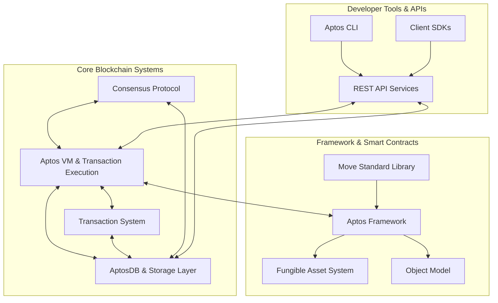

Sources: [Cargo.toml:1-287](https://github.com/aptos-labs/aptos-core/blob/b9f89a19/Cargo.toml#L1-L287), [aptos-move/aptos-vm/src/aptos_vm.rs:1-50](https://github.com/aptos-labs/aptos-core/blob/b9f89a19/aptos-move/aptos-vm/src/aptos_vm.rs#L1-L50), [storage/aptosdb/src/lib.rs:1-41](https://github.com/aptos-labs/aptos-core/blob/b9f89a19/storage/aptosdb/src/lib.rs#L1-L41)

## Transaction Flow

The following diagram illustrates how transactions flow through the Aptos system, from user submission to execution and storage:

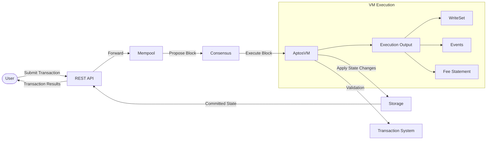

Sources: [aptos-move/aptos-vm/src/aptos_vm.rs:200-270](https://github.com/aptos-labs/aptos-core/blob/b9f89a19/aptos-move/aptos-vm/src/aptos_vm.rs#L200-L270), [types/src/transaction/mod.rs:1-100](https://github.com/aptos-labs/aptos-core/blob/b9f89a19/types/src/transaction/mod.rs#L1-L100)

## Core Components

### Aptos VM

The Aptos Virtual Machine (VM) is responsible for executing Move code and transactions. It implements the Move VM and provides Aptos-specific functionality.

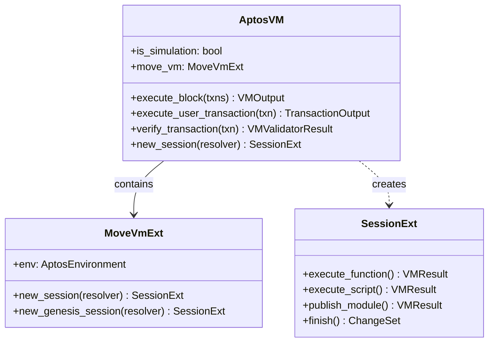

Sources: [aptos-move/aptos-vm/src/aptos_vm.rs:253-418](https://github.com/aptos-labs/aptos-core/blob/b9f89a19/aptos-move/aptos-vm/src/aptos_vm.rs#L253-L418)

### Storage System

The storage system is built around `AptosDB`, which provides persistent storage for the blockchain state and history.

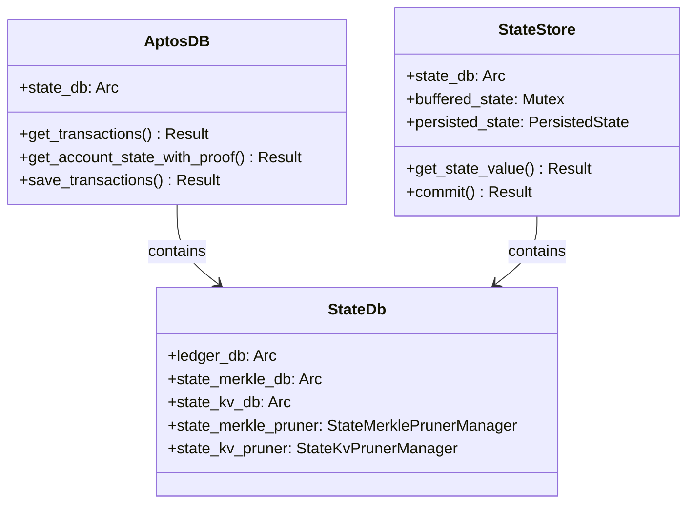

Sources: [storage/aptosdb/src/lib.rs:27-41](https://github.com/aptos-labs/aptos-core/blob/b9f89a19/storage/aptosdb/src/lib.rs#L27-L41), [storage/aptosdb/src/state_store/mod.rs:103-127](https://github.com/aptos-labs/aptos-core/blob/b9f89a19/storage/aptosdb/src/state_store/mod.rs#L103-L127)

### Consensus Protocol

Aptos uses a Byzantine Fault Tolerant (BFT) consensus protocol managed by the `EpochManager` and `RoundManager` components.

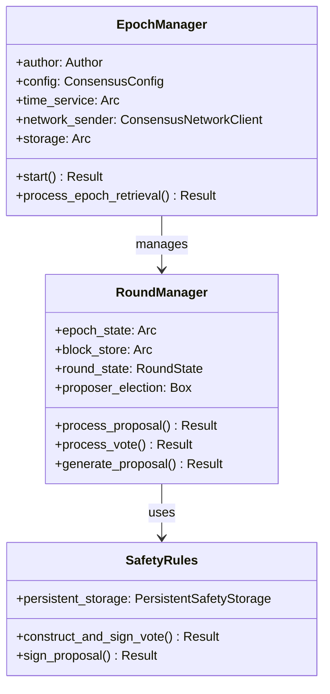

Sources: [consensus/src/epoch_manager.rs:131-178](https://github.com/aptos-labs/aptos-core/blob/b9f89a19/consensus/src/epoch_manager.rs#L131-L178), [consensus/src/round_manager.rs:1-60](https://github.com/aptos-labs/aptos-core/blob/b9f89a19/consensus/src/round_manager.rs#L1-L60)

### Framework and Smart Contracts

The Aptos blockchain includes a rich framework of Move modules that provide core functionality.

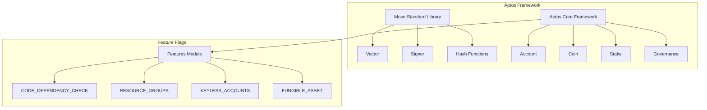

Sources: [types/src/on_chain_config/aptos_features.rs:17-138](https://github.com/aptos-labs/aptos-core/blob/b9f89a19/types/src/on_chain_config/aptos_features.rs#L17-L138), [aptos-move/framework/move-stdlib/doc/features.md](https://github.com/aptos-labs/aptos-core/blob/b9f89a19/aptos-move/framework/move-stdlib/doc/features.md)

## Development Tools

Aptos provides a comprehensive set of development tools centered around the Aptos CLI, which allows developers to interact with the blockchain.

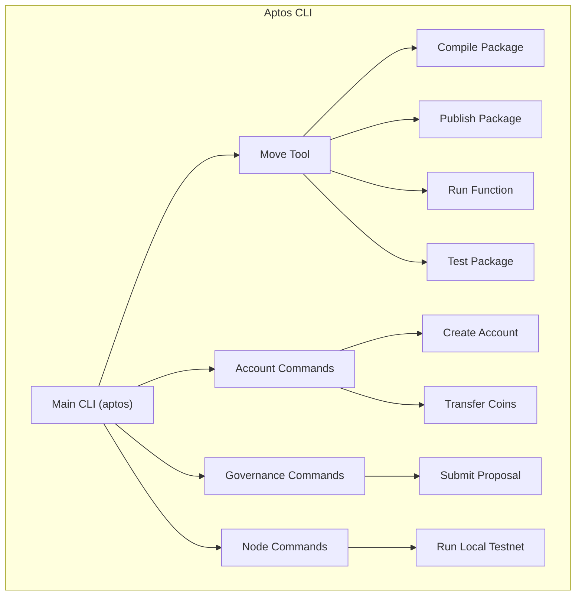

Sources: [crates/aptos/src/move_tool/mod.rs:95-177](https://github.com/aptos-labs/aptos-core/blob/b9f89a19/crates/aptos/src/move_tool/mod.rs#L95-L177), [crates/aptos/src/common/types.rs:100-170](https://github.com/aptos-labs/aptos-core/blob/b9f89a19/crates/aptos/src/common/types.rs#L100-L170), [crates/aptos/Cargo.toml:1-116](https://github.com/aptos-labs/aptos-core/blob/b9f89a19/crates/aptos/Cargo.toml#L1-L116)

## Genesis and Configuration

Aptos nodes are initialized with genesis information that configures the initial blockchain state. The VM genesis process initializes the core modules and sets up the initial governance structure.

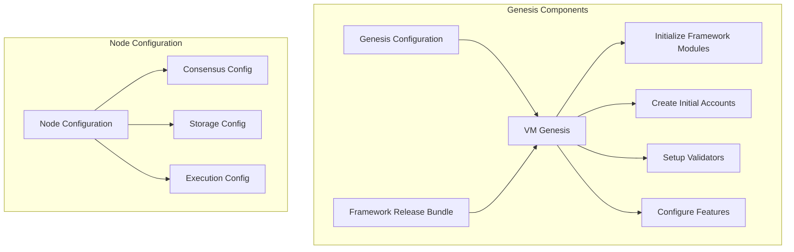

Sources: [aptos-move/vm-genesis/src/lib.rs:96-116](https://github.com/aptos-labs/aptos-core/blob/b9f89a19/aptos-move/vm-genesis/src/lib.rs#L96-L116), [config/src/config/consensus_config.rs:1-20](https://github.com/aptos-labs/aptos-core/blob/b9f89a19/config/src/config/consensus_config.rs#L1-L20), [config/src/config/storage_config.rs](https://github.com/aptos-labs/aptos-core/blob/b9f89a19/config/src/config/storage_config.rs)

## Transaction Types and Processing

Aptos supports several transaction types that flow through the system in a well-defined manner.

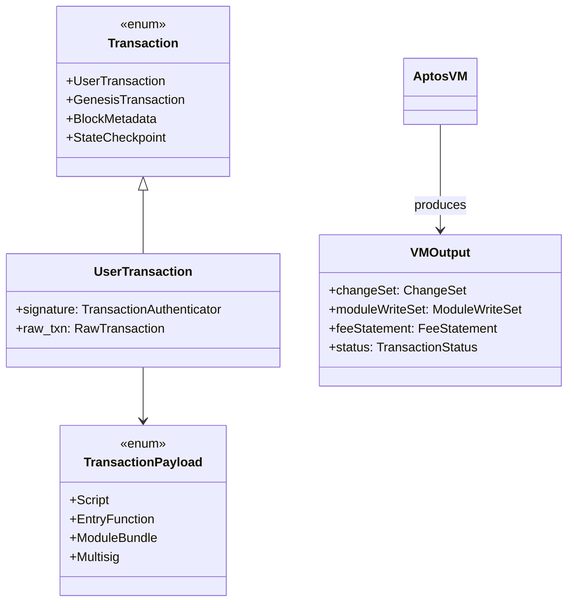

Sources: [types/src/transaction/mod.rs:1-100](https://github.com/aptos-labs/aptos-core/blob/b9f89a19/types/src/transaction/mod.rs#L1-L100), [aptos-vm-types/output.rs](https://github.com/aptos-labs/aptos-core/blob/b9f89a19/aptos-vm-types/output.rs)

## Aptos CLI

The Aptos CLI provides a command-line interface for developers to interact with the blockchain, manage accounts, deploy contracts, and run a local testnet.

Current CLI version: 7.2.0

Key features:
- Account creation and management
- Move module compilation and publishing
- Transaction submission
- Local testnet deployment
- Simulation and debugging

Sources: [crates/aptos/CHANGELOG.md:1-40](https://github.com/aptos-labs/aptos-core/blob/b9f89a19/crates/aptos/CHANGELOG.md#L1-L40), [crates/aptos/Cargo.toml:1-50](https://github.com/aptos-labs/aptos-core/blob/b9f89a19/crates/aptos/Cargo.toml#L1-L50)

## Testing Infrastructure

Aptos includes comprehensive testing infrastructure to ensure reliability and correctness.

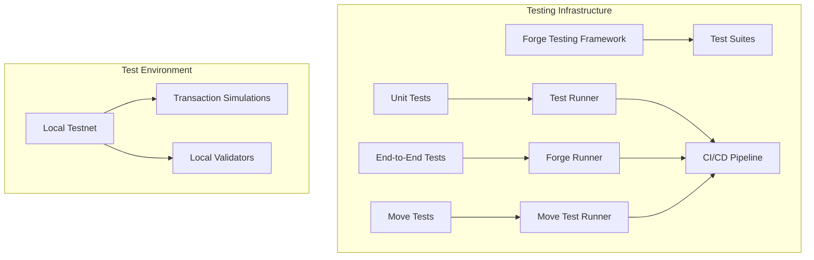

Sources: [crates/aptos/src/test/mod.rs:105-180](https://github.com/aptos-labs/aptos-core/blob/b9f89a19/crates/aptos/src/test/mod.rs#L105-L180), [aptos-move/e2e-tests/src/executor.rs:1-26](https://github.com/aptos-labs/aptos-core/blob/b9f89a19/aptos-move/e2e-tests/src/executor.rs#L1-L26), [aptos-move/e2e-move-tests/src/harness.rs](https://github.com/aptos-labs/aptos-core/blob/b9f89a19/aptos-move/e2e-move-tests/src/harness.rs)

## Node Implementation

The Aptos node is the main implementation of a participant in the Aptos network, supporting validator and fullnode roles.

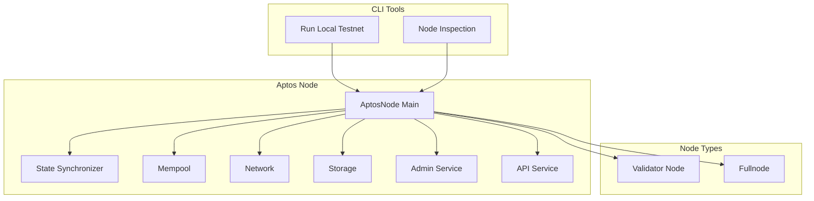

Sources: [aptos-node/src/lib.rs:1-48](https://github.com/aptos-labs/aptos-core/blob/b9f89a19/aptos-node/src/lib.rs#L1-L48), [crates/aptos/src/node/mod.rs:1-66](https://github.com/aptos-labs/aptos-core/blob/b9f89a19/crates/aptos/src/node/mod.rs#L1-L66)

## Summary

The Aptos repository contains a comprehensive blockchain implementation with a focus on security, performance, and developer experience. The core systems (VM, consensus, storage, and transaction processing) work together to provide a robust foundation for building decentralized applications. The Move language and framework provide the smart contract capabilities, while developer tools like the CLI and APIs make it accessible to developers.