# Architecture Overview

Relevant source files

The following files were used as context for generating this wiki page:

- [api/src/tests/converter_test.rs](https://github.com/aptos-labs/aptos-core/blob/b9f89a19/api/src/tests/converter_test.rs)
- [api/src/view_function.rs](https://github.com/aptos-labs/aptos-core/blob/b9f89a19/api/src/view_function.rs)
- [api/types/src/convert.rs](https://github.com/aptos-labs/aptos-core/blob/b9f89a19/api/types/src/convert.rs)
- [api/types/src/lib.rs](https://github.com/aptos-labs/aptos-core/blob/b9f89a19/api/types/src/lib.rs)
- [api/types/src/move_types.rs](https://github.com/aptos-labs/aptos-core/blob/b9f89a19/api/types/src/move_types.rs)
- [api/types/src/transaction.rs](https://github.com/aptos-labs/aptos-core/blob/b9f89a19/api/types/src/transaction.rs)
- [api/types/src/wrappers.rs](https://github.com/aptos-labs/aptos-core/blob/b9f89a19/api/types/src/wrappers.rs)
- [aptos-move/aptos-aggregator/src/delta_change_set.rs](https://github.com/aptos-labs/aptos-core/blob/b9f89a19/aptos-move/aptos-aggregator/src/delta_change_set.rs)
- [aptos-move/aptos-aggregator/src/resolver.rs](https://github.com/aptos-labs/aptos-core/blob/b9f89a19/aptos-move/aptos-aggregator/src/resolver.rs)
- [aptos-move/aptos-aggregator/src/tests/types.rs](https://github.com/aptos-labs/aptos-core/blob/b9f89a19/aptos-move/aptos-aggregator/src/tests/types.rs)
- [aptos-move/aptos-debugger/src/lib.rs](https://github.com/aptos-labs/aptos-core/blob/b9f89a19/aptos-move/aptos-debugger/src/lib.rs)
- [aptos-move/aptos-release-builder/src/components/feature_flags.rs](https://github.com/aptos-labs/aptos-core/blob/b9f89a19/aptos-move/aptos-release-builder/src/components/feature_flags.rs)
- [aptos-move/aptos-resource-viewer/src/lib.rs](https://github.com/aptos-labs/aptos-core/blob/b9f89a19/aptos-move/aptos-resource-viewer/src/lib.rs)
- [aptos-move/aptos-transaction-simulation/src/account.rs](https://github.com/aptos-labs/aptos-core/blob/b9f89a19/aptos-move/aptos-transaction-simulation/src/account.rs)
- [aptos-move/aptos-transaction-simulation/src/state_store.rs](https://github.com/aptos-labs/aptos-core/blob/b9f89a19/aptos-move/aptos-transaction-simulation/src/state_store.rs)
- [aptos-move/aptos-vm-environment/src/prod_configs.rs](https://github.com/aptos-labs/aptos-core/blob/b9f89a19/aptos-move/aptos-vm-environment/src/prod_configs.rs)
- [aptos-move/aptos-vm-types/src/abstract_write_op.rs](https://github.com/aptos-labs/aptos-core/blob/b9f89a19/aptos-move/aptos-vm-types/src/abstract_write_op.rs)
- [aptos-move/aptos-vm-types/src/change_set.rs](https://github.com/aptos-labs/aptos-core/blob/b9f89a19/aptos-move/aptos-vm-types/src/change_set.rs)
- [aptos-move/aptos-vm-types/src/tests/test_change_set.rs](https://github.com/aptos-labs/aptos-core/blob/b9f89a19/aptos-move/aptos-vm-types/src/tests/test_change_set.rs)
- [aptos-move/aptos-vm-types/src/tests/utils.rs](https://github.com/aptos-labs/aptos-core/blob/b9f89a19/aptos-move/aptos-vm-types/src/tests/utils.rs)
- [aptos-move/aptos-vm/src/aptos_vm.rs](https://github.com/aptos-labs/aptos-core/blob/b9f89a19/aptos-move/aptos-vm/src/aptos_vm.rs)
- [aptos-move/aptos-vm/src/data_cache.rs](https://github.com/aptos-labs/aptos-core/blob/b9f89a19/aptos-move/aptos-vm/src/data_cache.rs)
- [aptos-move/aptos-vm/src/errors.rs](https://github.com/aptos-labs/aptos-core/blob/b9f89a19/aptos-move/aptos-vm/src/errors.rs)
- [aptos-move/aptos-vm/src/lib.rs](https://github.com/aptos-labs/aptos-core/blob/b9f89a19/aptos-move/aptos-vm/src/lib.rs)
- [aptos-move/aptos-vm/src/move_vm_ext/resolver.rs](https://github.com/aptos-labs/aptos-core/blob/b9f89a19/aptos-move/aptos-vm/src/move_vm_ext/resolver.rs)
- [aptos-move/aptos-vm/src/move_vm_ext/vm.rs](https://github.com/aptos-labs/aptos-core/blob/b9f89a19/aptos-move/aptos-vm/src/move_vm_ext/vm.rs)
- [aptos-move/aptos-vm/src/move_vm_ext/write_op_converter.rs](https://github.com/aptos-labs/aptos-core/blob/b9f89a19/aptos-move/aptos-vm/src/move_vm_ext/write_op_converter.rs)
- [aptos-move/aptos-vm/src/natives.rs](https://github.com/aptos-labs/aptos-core/blob/b9f89a19/aptos-move/aptos-vm/src/natives.rs)
- [aptos-move/aptos-vm/src/transaction_validation.rs](https://github.com/aptos-labs/aptos-core/blob/b9f89a19/aptos-move/aptos-vm/src/transaction_validation.rs)
- [aptos-move/e2e-move-tests/Cargo.toml](https://github.com/aptos-labs/aptos-core/blob/b9f89a19/aptos-move/e2e-move-tests/Cargo.toml)
- [aptos-move/e2e-move-tests/src/harness.rs](https://github.com/aptos-labs/aptos-core/blob/b9f89a19/aptos-move/e2e-move-tests/src/harness.rs)
- [aptos-move/e2e-move-tests/src/tests/mod.rs](https://github.com/aptos-labs/aptos-core/blob/b9f89a19/aptos-move/e2e-move-tests/src/tests/mod.rs)
- [aptos-move/e2e-move-tests/src/tests/remote_state.rs](https://github.com/aptos-labs/aptos-core/blob/b9f89a19/aptos-move/e2e-move-tests/src/tests/remote_state.rs)
- [aptos-move/e2e-tests/src/executor.rs](https://github.com/aptos-labs/aptos-core/blob/b9f89a19/aptos-move/e2e-tests/src/executor.rs)
- [aptos-move/framework/aptos-framework/doc/transaction_validation.md](https://github.com/aptos-labs/aptos-core/blob/b9f89a19/aptos-move/framework/aptos-framework/doc/transaction_validation.md)
- [aptos-move/framework/aptos-framework/sources/transaction_validation.move](https://github.com/aptos-labs/aptos-core/blob/b9f89a19/aptos-move/framework/aptos-framework/sources/transaction_validation.move)
- [aptos-move/framework/aptos-framework/sources/transaction_validation.spec.move](https://github.com/aptos-labs/aptos-core/blob/b9f89a19/aptos-move/framework/aptos-framework/sources/transaction_validation.spec.move)
- [aptos-move/framework/move-stdlib/doc/features.md](https://github.com/aptos-labs/aptos-core/blob/b9f89a19/aptos-move/framework/move-stdlib/doc/features.md)
- [aptos-move/framework/move-stdlib/sources/configs/features.move](https://github.com/aptos-labs/aptos-core/blob/b9f89a19/aptos-move/framework/move-stdlib/sources/configs/features.move)
- [aptos-move/framework/move-stdlib/sources/configs/features.spec.move](https://github.com/aptos-labs/aptos-core/blob/b9f89a19/aptos-move/framework/move-stdlib/sources/configs/features.spec.move)
- [aptos-move/framework/src/natives/aggregator_natives/aggregator.rs](https://github.com/aptos-labs/aptos-core/blob/b9f89a19/aptos-move/framework/src/natives/aggregator_natives/aggregator.rs)
- [aptos-move/framework/src/natives/aggregator_natives/aggregator_factory.rs](https://github.com/aptos-labs/aptos-core/blob/b9f89a19/aptos-move/framework/src/natives/aggregator_natives/aggregator_factory.rs)
- [aptos-move/framework/src/natives/aggregator_natives/context.rs](https://github.com/aptos-labs/aptos-core/blob/b9f89a19/aptos-move/framework/src/natives/aggregator_natives/context.rs)
- [aptos-move/framework/src/natives/aggregator_natives/mod.rs](https://github.com/aptos-labs/aptos-core/blob/b9f89a19/aptos-move/framework/src/natives/aggregator_natives/mod.rs)
- [aptos-move/framework/src/natives/dispatchable_fungible_asset.rs](https://github.com/aptos-labs/aptos-core/blob/b9f89a19/aptos-move/framework/src/natives/dispatchable_fungible_asset.rs)
- [aptos-move/framework/src/natives/function_info.rs](https://github.com/aptos-labs/aptos-core/blob/b9f89a19/aptos-move/framework/src/natives/function_info.rs)
- [aptos-move/vm-genesis/src/lib.rs](https://github.com/aptos-labs/aptos-core/blob/b9f89a19/aptos-move/vm-genesis/src/lib.rs)
- [aptos-node/src/network.rs](https://github.com/aptos-labs/aptos-core/blob/b9f89a19/aptos-node/src/network.rs)
- [config/src/config/consensus_config.rs](https://github.com/aptos-labs/aptos-core/blob/b9f89a19/config/src/config/consensus_config.rs)
- [config/src/config/storage_config.rs](https://github.com/aptos-labs/aptos-core/blob/b9f89a19/config/src/config/storage_config.rs)
- [consensus/consensus-types/src/block_retrieval.rs](https://github.com/aptos-labs/aptos-core/blob/b9f89a19/consensus/consensus-types/src/block_retrieval.rs)
- [consensus/consensus-types/src/lib.rs](https://github.com/aptos-labs/aptos-core/blob/b9f89a19/consensus/consensus-types/src/lib.rs)
- [consensus/consensus-types/src/order_vote.rs](https://github.com/aptos-labs/aptos-core/blob/b9f89a19/consensus/consensus-types/src/order_vote.rs)
- [consensus/consensus-types/src/quorum_cert.rs](https://github.com/aptos-labs/aptos-core/blob/b9f89a19/consensus/consensus-types/src/quorum_cert.rs)
- [consensus/consensus-types/src/sync_info.rs](https://github.com/aptos-labs/aptos-core/blob/b9f89a19/consensus/consensus-types/src/sync_info.rs)
- [consensus/consensus-types/src/timeout_2chain.rs](https://github.com/aptos-labs/aptos-core/blob/b9f89a19/consensus/consensus-types/src/timeout_2chain.rs)
- [consensus/consensus-types/src/vote.rs](https://github.com/aptos-labs/aptos-core/blob/b9f89a19/consensus/consensus-types/src/vote.rs)
- [consensus/consensus-types/src/wrapped_ledger_info.rs](https://github.com/aptos-labs/aptos-core/blob/b9f89a19/consensus/consensus-types/src/wrapped_ledger_info.rs)
- [consensus/src/block_storage/block_store.rs](https://github.com/aptos-labs/aptos-core/blob/b9f89a19/consensus/src/block_storage/block_store.rs)
- [consensus/src/block_storage/block_store_test.rs](https://github.com/aptos-labs/aptos-core/blob/b9f89a19/consensus/src/block_storage/block_store_test.rs)
- [consensus/src/block_storage/block_tree.rs](https://github.com/aptos-labs/aptos-core/blob/b9f89a19/consensus/src/block_storage/block_tree.rs)
- [consensus/src/block_storage/sync_manager.rs](https://github.com/aptos-labs/aptos-core/blob/b9f89a19/consensus/src/block_storage/sync_manager.rs)
- [consensus/src/counters.rs](https://github.com/aptos-labs/aptos-core/blob/b9f89a19/consensus/src/counters.rs)
- [consensus/src/epoch_manager.rs](https://github.com/aptos-labs/aptos-core/blob/b9f89a19/consensus/src/epoch_manager.rs)
- [consensus/src/liveness/proposal_generator.rs](https://github.com/aptos-labs/aptos-core/blob/b9f89a19/consensus/src/liveness/proposal_generator.rs)
- [consensus/src/liveness/proposal_generator_test.rs](https://github.com/aptos-labs/aptos-core/blob/b9f89a19/consensus/src/liveness/proposal_generator_test.rs)
- [consensus/src/liveness/round_state.rs](https://github.com/aptos-labs/aptos-core/blob/b9f89a19/consensus/src/liveness/round_state.rs)
- [consensus/src/liveness/round_state_test.rs](https://github.com/aptos-labs/aptos-core/blob/b9f89a19/consensus/src/liveness/round_state_test.rs)
- [consensus/src/liveness/unequivocal_proposer_election.rs](https://github.com/aptos-labs/aptos-core/blob/b9f89a19/consensus/src/liveness/unequivocal_proposer_election.rs)
- [consensus/src/network.rs](https://github.com/aptos-labs/aptos-core/blob/b9f89a19/consensus/src/network.rs)
- [consensus/src/network_interface.rs](https://github.com/aptos-labs/aptos-core/blob/b9f89a19/consensus/src/network_interface.rs)
- [consensus/src/network_tests.rs](https://github.com/aptos-labs/aptos-core/blob/b9f89a19/consensus/src/network_tests.rs)
- [consensus/src/pending_order_votes.rs](https://github.com/aptos-labs/aptos-core/blob/b9f89a19/consensus/src/pending_order_votes.rs)
- [consensus/src/pending_votes.rs](https://github.com/aptos-labs/aptos-core/blob/b9f89a19/consensus/src/pending_votes.rs)
- [consensus/src/persistent_liveness_storage.rs](https://github.com/aptos-labs/aptos-core/blob/b9f89a19/consensus/src/persistent_liveness_storage.rs)
- [consensus/src/recovery_manager.rs](https://github.com/aptos-labs/aptos-core/blob/b9f89a19/consensus/src/recovery_manager.rs)
- [consensus/src/round_manager.rs](https://github.com/aptos-labs/aptos-core/blob/b9f89a19/consensus/src/round_manager.rs)
- [consensus/src/round_manager_fuzzing.rs](https://github.com/aptos-labs/aptos-core/blob/b9f89a19/consensus/src/round_manager_fuzzing.rs)
- [consensus/src/round_manager_test.rs](https://github.com/aptos-labs/aptos-core/blob/b9f89a19/consensus/src/round_manager_test.rs)
- [consensus/src/test_utils/mock_storage.rs](https://github.com/aptos-labs/aptos-core/blob/b9f89a19/consensus/src/test_utils/mock_storage.rs)
- [consensus/src/twins/twins_node.rs](https://github.com/aptos-labs/aptos-core/blob/b9f89a19/consensus/src/twins/twins_node.rs)
- [consensus/src/txn_notifier.rs](https://github.com/aptos-labs/aptos-core/blob/b9f89a19/consensus/src/txn_notifier.rs)
- [execution/executor-test-helpers/Cargo.toml](https://github.com/aptos-labs/aptos-core/blob/b9f89a19/execution/executor-test-helpers/Cargo.toml)
- [execution/executor-test-helpers/src/integration_test_impl.rs](https://github.com/aptos-labs/aptos-core/blob/b9f89a19/execution/executor-test-helpers/src/integration_test_impl.rs)
- [execution/executor/Cargo.toml](https://github.com/aptos-labs/aptos-core/blob/b9f89a19/execution/executor/Cargo.toml)
- [execution/executor/src/tests/chunk_executor_tests.rs](https://github.com/aptos-labs/aptos-core/blob/b9f89a19/execution/executor/src/tests/chunk_executor_tests.rs)
- [execution/executor/tests/db_bootstrapper_test.rs](https://github.com/aptos-labs/aptos-core/blob/b9f89a19/execution/executor/tests/db_bootstrapper_test.rs)
- [execution/executor/tests/storage_integration_test.rs](https://github.com/aptos-labs/aptos-core/blob/b9f89a19/execution/executor/tests/storage_integration_test.rs)
- [network/builder/src/builder.rs](https://github.com/aptos-labs/aptos-core/blob/b9f89a19/network/builder/src/builder.rs)
- [network/builder/src/dummy.rs](https://github.com/aptos-labs/aptos-core/blob/b9f89a19/network/builder/src/dummy.rs)
- [storage/accumulator/src/lib.rs](https://github.com/aptos-labs/aptos-core/blob/b9f89a19/storage/accumulator/src/lib.rs)
- [storage/aptosdb/src/db_debugger/truncate/mod.rs](https://github.com/aptos-labs/aptos-core/blob/b9f89a19/storage/aptosdb/src/db_debugger/truncate/mod.rs)
- [storage/aptosdb/src/lib.rs](https://github.com/aptos-labs/aptos-core/blob/b9f89a19/storage/aptosdb/src/lib.rs)
- [storage/aptosdb/src/pruner/db_pruner.rs](https://github.com/aptos-labs/aptos-core/blob/b9f89a19/storage/aptosdb/src/pruner/db_pruner.rs)
- [storage/aptosdb/src/pruner/mod.rs](https://github.com/aptos-labs/aptos-core/blob/b9f89a19/storage/aptosdb/src/pruner/mod.rs)
- [storage/aptosdb/src/pruner/pruner_manager.rs](https://github.com/aptos-labs/aptos-core/blob/b9f89a19/storage/aptosdb/src/pruner/pruner_manager.rs)
- [storage/aptosdb/src/schema/db_metadata/mod.rs](https://github.com/aptos-labs/aptos-core/blob/b9f89a19/storage/aptosdb/src/schema/db_metadata/mod.rs)
- [storage/aptosdb/src/state_kv_db.rs](https://github.com/aptos-labs/aptos-core/blob/b9f89a19/storage/aptosdb/src/state_kv_db.rs)
- [storage/aptosdb/src/state_merkle_db.rs](https://github.com/aptos-labs/aptos-core/blob/b9f89a19/storage/aptosdb/src/state_merkle_db.rs)
- [storage/aptosdb/src/state_restore/mod.rs](https://github.com/aptos-labs/aptos-core/blob/b9f89a19/storage/aptosdb/src/state_restore/mod.rs)
- [storage/aptosdb/src/state_restore/restore_test.rs](https://github.com/aptos-labs/aptos-core/blob/b9f89a19/storage/aptosdb/src/state_restore/restore_test.rs)
- [storage/aptosdb/src/state_store/buffered_state.rs](https://github.com/aptos-labs/aptos-core/blob/b9f89a19/storage/aptosdb/src/state_store/buffered_state.rs)
- [storage/aptosdb/src/state_store/mod.rs](https://github.com/aptos-labs/aptos-core/blob/b9f89a19/storage/aptosdb/src/state_store/mod.rs)
- [storage/aptosdb/src/state_store/state_merkle_batch_committer.rs](https://github.com/aptos-labs/aptos-core/blob/b9f89a19/storage/aptosdb/src/state_store/state_merkle_batch_committer.rs)
- [storage/aptosdb/src/state_store/state_snapshot_committer.rs](https://github.com/aptos-labs/aptos-core/blob/b9f89a19/storage/aptosdb/src/state_store/state_snapshot_committer.rs)
- [storage/aptosdb/src/utils/truncation_helper.rs](https://github.com/aptos-labs/aptos-core/blob/b9f89a19/storage/aptosdb/src/utils/truncation_helper.rs)
- [storage/backup/backup-cli/src/backup_types/state_snapshot/restore.rs](https://github.com/aptos-labs/aptos-core/blob/b9f89a19/storage/backup/backup-cli/src/backup_types/state_snapshot/restore.rs)
- [storage/jellyfish-merkle/Cargo.toml](https://github.com/aptos-labs/aptos-core/blob/b9f89a19/storage/jellyfish-merkle/Cargo.toml)
- [storage/jellyfish-merkle/src/jellyfish_merkle_test.rs](https://github.com/aptos-labs/aptos-core/blob/b9f89a19/storage/jellyfish-merkle/src/jellyfish_merkle_test.rs)
- [storage/jellyfish-merkle/src/lib.rs](https://github.com/aptos-labs/aptos-core/blob/b9f89a19/storage/jellyfish-merkle/src/lib.rs)
- [storage/jellyfish-merkle/src/metrics.rs](https://github.com/aptos-labs/aptos-core/blob/b9f89a19/storage/jellyfish-merkle/src/metrics.rs)
- [storage/jellyfish-merkle/src/mock_tree_store.rs](https://github.com/aptos-labs/aptos-core/blob/b9f89a19/storage/jellyfish-merkle/src/mock_tree_store.rs)
- [storage/jellyfish-merkle/src/node_type/mod.rs](https://github.com/aptos-labs/aptos-core/blob/b9f89a19/storage/jellyfish-merkle/src/node_type/mod.rs)
- [storage/jellyfish-merkle/src/node_type/node_type_test.rs](https://github.com/aptos-labs/aptos-core/blob/b9f89a19/storage/jellyfish-merkle/src/node_type/node_type_test.rs)
- [storage/jellyfish-merkle/src/restore/mod.rs](https://github.com/aptos-labs/aptos-core/blob/b9f89a19/storage/jellyfish-merkle/src/restore/mod.rs)
- [storage/storage-interface/src/lib.rs](https://github.com/aptos-labs/aptos-core/blob/b9f89a19/storage/storage-interface/src/lib.rs)
- [testsuite/generate-format/src/api.rs](https://github.com/aptos-labs/aptos-core/blob/b9f89a19/testsuite/generate-format/src/api.rs)
- [testsuite/generate-format/src/aptos.rs](https://github.com/aptos-labs/aptos-core/blob/b9f89a19/testsuite/generate-format/src/aptos.rs)
- [testsuite/generate-format/src/consensus.rs](https://github.com/aptos-labs/aptos-core/blob/b9f89a19/testsuite/generate-format/src/consensus.rs)
- [testsuite/generate-format/tests/staged/api.yaml](https://github.com/aptos-labs/aptos-core/blob/b9f89a19/testsuite/generate-format/tests/staged/api.yaml)
- [testsuite/generate-format/tests/staged/aptos.yaml](https://github.com/aptos-labs/aptos-core/blob/b9f89a19/testsuite/generate-format/tests/staged/aptos.yaml)
- [testsuite/generate-format/tests/staged/consensus.yaml](https://github.com/aptos-labs/aptos-core/blob/b9f89a19/testsuite/generate-format/tests/staged/consensus.yaml)
- [third_party/move/move-core/types/src/vm_status.rs](https://github.com/aptos-labs/aptos-core/blob/b9f89a19/third_party/move/move-core/types/src/vm_status.rs)
- [third_party/move/move-model/bytecode/src/stackless_bytecode_generator.rs](https://github.com/aptos-labs/aptos-core/blob/b9f89a19/third_party/move/move-model/bytecode/src/stackless_bytecode_generator.rs)
- [third_party/move/move-vm/runtime/src/config.rs](https://github.com/aptos-labs/aptos-core/blob/b9f89a19/third_party/move/move-vm/runtime/src/config.rs)
- [third_party/move/move-vm/types/src/values/mod.rs](https://github.com/aptos-labs/aptos-core/blob/b9f89a19/third_party/move/move-vm/types/src/values/mod.rs)
- [third_party/move/tools/move-resource-viewer/src/fat_type.rs](https://github.com/aptos-labs/aptos-core/blob/b9f89a19/third_party/move/tools/move-resource-viewer/src/fat_type.rs)
- [third_party/move/tools/move-resource-viewer/src/lib.rs](https://github.com/aptos-labs/aptos-core/blob/b9f89a19/third_party/move/tools/move-resource-viewer/src/lib.rs)
- [third_party/move/tools/move-resource-viewer/src/limit.rs](https://github.com/aptos-labs/aptos-core/blob/b9f89a19/third_party/move/tools/move-resource-viewer/src/limit.rs)
- [types/src/account_address.rs](https://github.com/aptos-labs/aptos-core/blob/b9f89a19/types/src/account_address.rs)
- [types/src/ledger_info.rs](https://github.com/aptos-labs/aptos-core/blob/b9f89a19/types/src/ledger_info.rs)
- [types/src/nibble/nibble_path/mod.rs](https://github.com/aptos-labs/aptos-core/blob/b9f89a19/types/src/nibble/nibble_path/mod.rs)
- [types/src/on_chain_config/aptos_features.rs](https://github.com/aptos-labs/aptos-core/blob/b9f89a19/types/src/on_chain_config/aptos_features.rs)
- [types/src/proof/accumulator/mock.rs](https://github.com/aptos-labs/aptos-core/blob/b9f89a19/types/src/proof/accumulator/mock.rs)
- [types/src/proof/position/mod.rs](https://github.com/aptos-labs/aptos-core/blob/b9f89a19/types/src/proof/position/mod.rs)
- [types/src/proptest_types.rs](https://github.com/aptos-labs/aptos-core/blob/b9f89a19/types/src/proptest_types.rs)
- [types/src/transaction/authenticator.rs](https://github.com/aptos-labs/aptos-core/blob/b9f89a19/types/src/transaction/authenticator.rs)
- [types/src/transaction/change_set.rs](https://github.com/aptos-labs/aptos-core/blob/b9f89a19/types/src/transaction/change_set.rs)
- [types/src/transaction/mod.rs](https://github.com/aptos-labs/aptos-core/blob/b9f89a19/types/src/transaction/mod.rs)
- [types/src/validator_verifier.rs](https://github.com/aptos-labs/aptos-core/blob/b9f89a19/types/src/validator_verifier.rs)
- [types/src/write_set.rs](https://github.com/aptos-labs/aptos-core/blob/b9f89a19/types/src/write_set.rs)

This document provides a high-level overview of the Aptos blockchain architecture, including the core components and how they interact. It describes the system structure, transaction flow, and key subsystems that form the foundation of the Aptos blockchain platform.

## Core Architecture Components

Aptos is a Layer 1 blockchain with a modular architecture designed for scalability, safety, and extensibility. The system consists of several interconnected components that work together to provide a secure and high-performance blockchain platform.

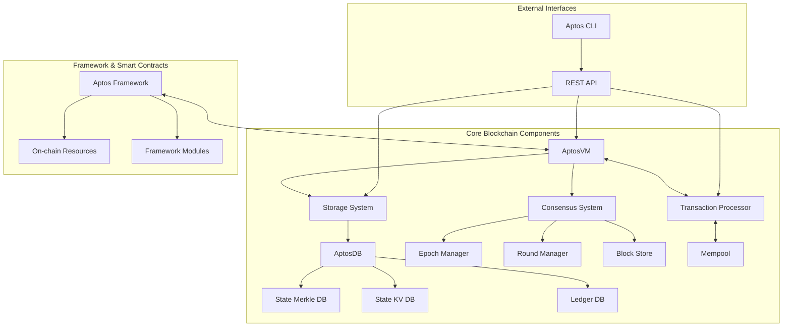

Sources: [aptos-move/aptos-vm/src/aptos_vm.rs:1-255], [storage/aptosdb/src/lib.rs:1-41], [consensus/src/epoch_manager.rs:1-50], [consensus/src/round_manager.rs:1-100]

## Transaction Flow

The following diagram shows how a transaction flows through the Aptos blockchain system from submission to execution and commitment:

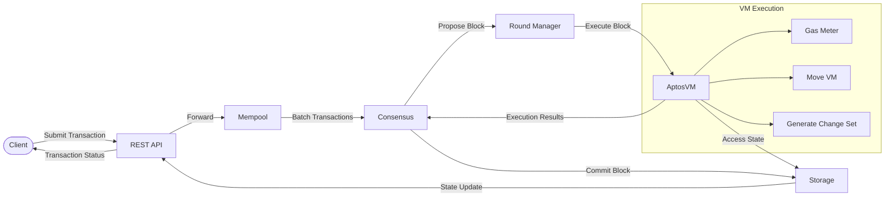

Sources: [aptos-move/aptos-vm/src/aptos_vm.rs:260-500], [consensus/src/round_manager.rs:274-430], [storage/aptosdb/src/state_store/mod.rs:100-200]

## Key Components in Detail

### Virtual Machine (AptosVM)

The AptosVM is the execution engine of the Aptos blockchain, responsible for executing and validating transactions.

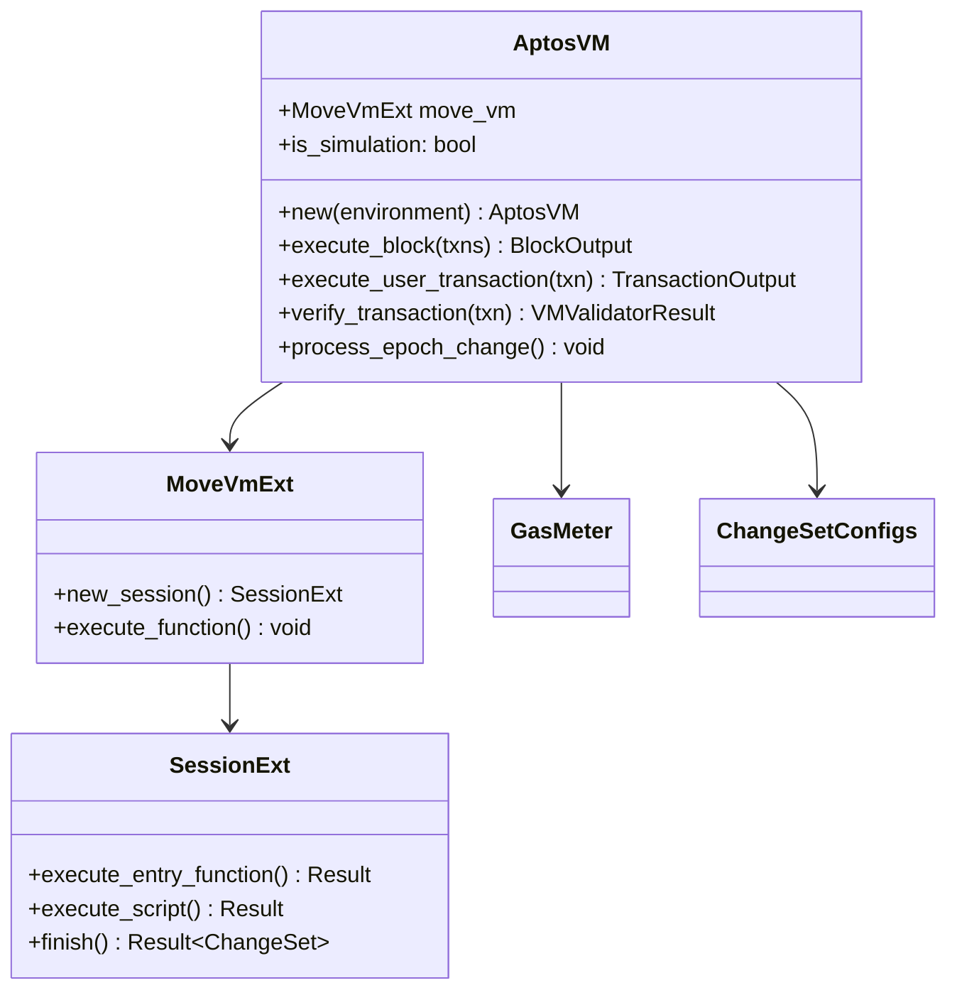

The AptosVM handles:
- Transaction execution and state transitions
- Gas metering and accounting
- Module publication and execution
- Script execution
- Entry function calls
- Validation of transactions

Sources: [aptos-move/aptos-vm/src/aptos_vm.rs:253-400], [aptos-move/aptos-vm/src/aptos_vm.rs:460-754], [aptos-move/aptos-vm/src/move_vm_ext/vm.rs:1-30]

### Storage System

The Aptos storage system is responsible for persisting blockchain state and supporting efficient state access.

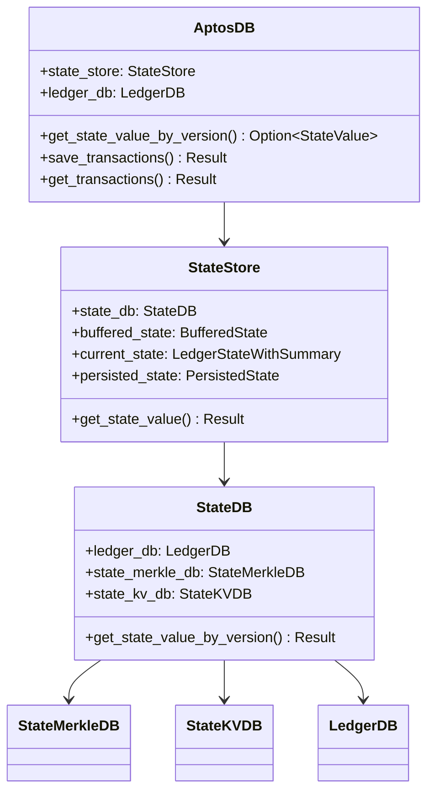

The storage system consists of:
- **AptosDB**: Main database interface that orchestrates access to different storage components
- **StateStore**: Manages the current state and buffered state changes
- **StateMerkleDB**: Maintains the Merkle tree structure for state authentication
- **StateKVDB**: Stores the actual key-value pairs representing the blockchain state
- **LedgerDB**: Stores ledger information, transactions, and events

Sources: [storage/aptosdb/src/lib.rs:5-41], [storage/aptosdb/src/state_store/mod.rs:100-362], [storage/aptosdb/src/state_merkle_db.rs:1-50]

### Consensus System

The consensus system is responsible for ordering transactions and producing blocks.

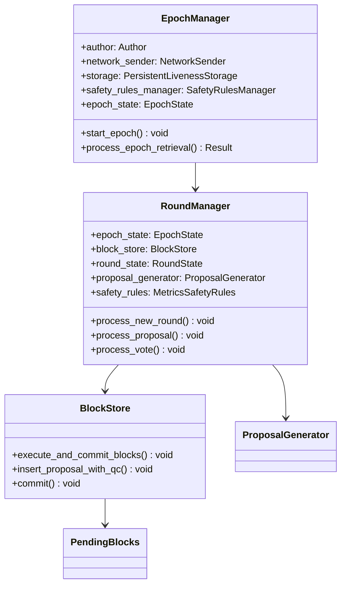

The consensus system features:
- **EpochManager**: Handles epoch changes, reconfiguration, and validator set management
- **RoundManager**: Manages consensus rounds, processes proposals and votes
- **BlockStore**: Manages block execution, storage, and commitment
- **ProposalGenerator**: Creates block proposals by pulling transactions from mempool

Sources: [consensus/src/epoch_manager.rs:131-250], [consensus/src/round_manager.rs:247-325], [consensus/src/block_storage/block_store.rs:1-100]

### Transaction Processing

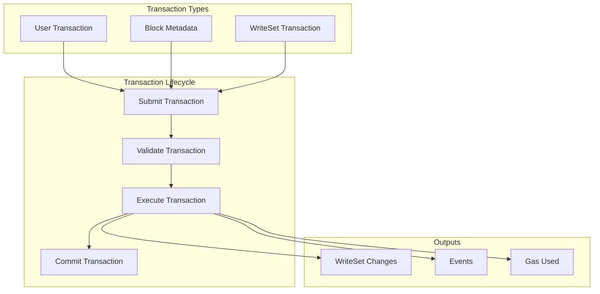

Transaction processing involves:
- Serialization and deserialization
- Signature verification
- Gas metering
- Execution in the VM
- State application
- Event generation

Sources: [types/src/transaction/mod.rs:100-200], [aptos-move/aptos-vm/src/aptos_vm.rs:700-900]

### Feature Flags

Aptos uses a feature flag system to enable or disable functionality, facilitating smooth upgrades and feature rollouts.

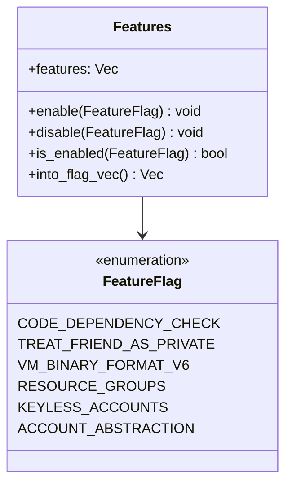

Feature flags control various aspects of the system:
- VM behavior and bytecode versions
- Native function availability
- Security features
- Account models (including keyless accounts and account abstraction)
- Storage optimizations

Sources: [types/src/on_chain_config/aptos_features.rs:17-138], [aptos-move/framework/move-stdlib/sources/configs/features.move:25-50]

## Configuration System

Configurations manage the behavior of different components, such as consensus, storage, and networking.

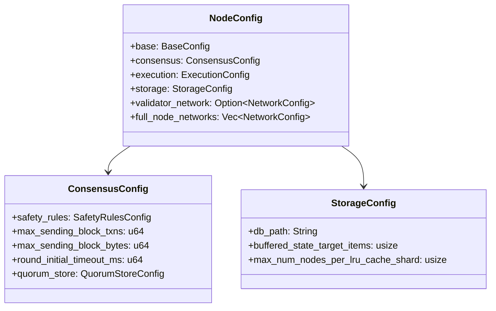

Sources: [config/src/config/consensus_config.rs:26-97], [config/src/config/storage_config.rs:25-51]

## Testing Infrastructure

Aptos includes a comprehensive testing framework for functional, integration, and performance testing.

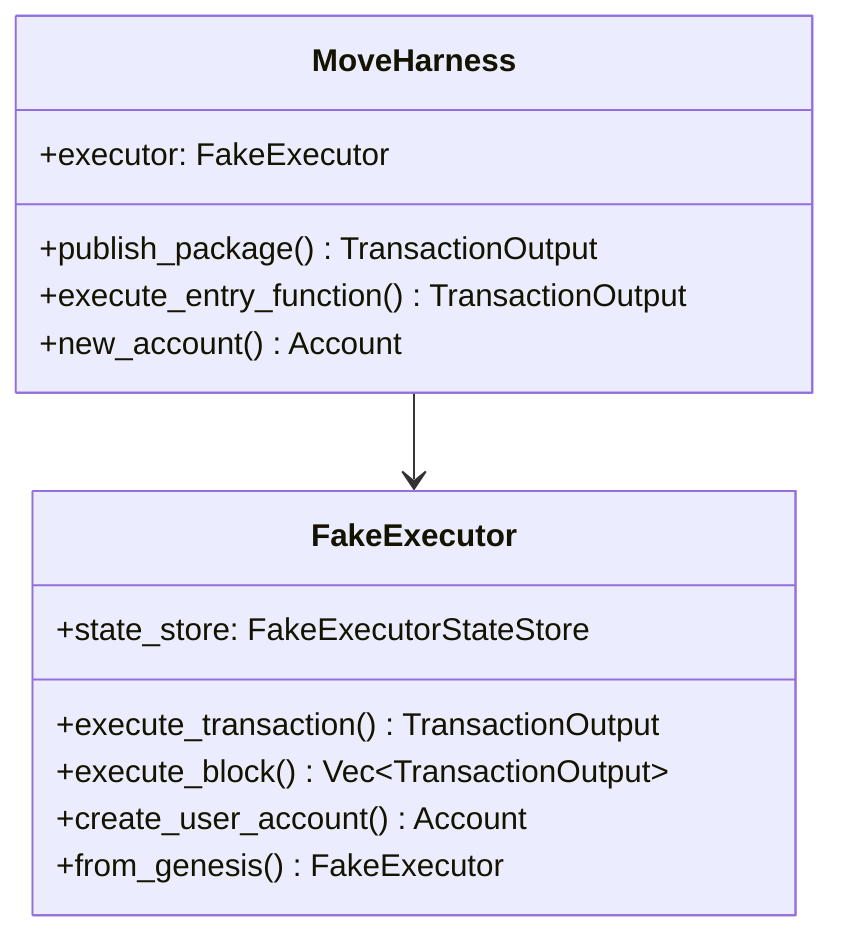

The testing infrastructure supports:
- Unit testing of Move modules
- Integration testing of transaction flows
- Performance benchmarking
- Network simulation

Sources: [aptos-move/e2e-tests/src/executor.rs:140-225], [aptos-move/e2e-move-tests/src/harness.rs:79-146]

## Genesis

The Genesis process initializes the blockchain by creating the initial state and deploying the framework modules.

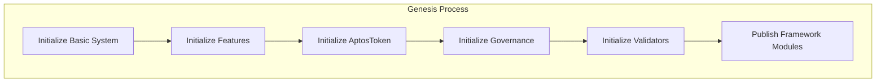

The genesis process sets up:
- Initial validators
- Framework modules
- Governance parameters
- Initial coins
- System configurations

Sources: [aptos-move/vm-genesis/src/lib.rs:134-209], [aptos-move/vm-genesis/src/lib.rs:406-458]

## Component Interactions

The following diagram shows how the key components interact during transaction processing:

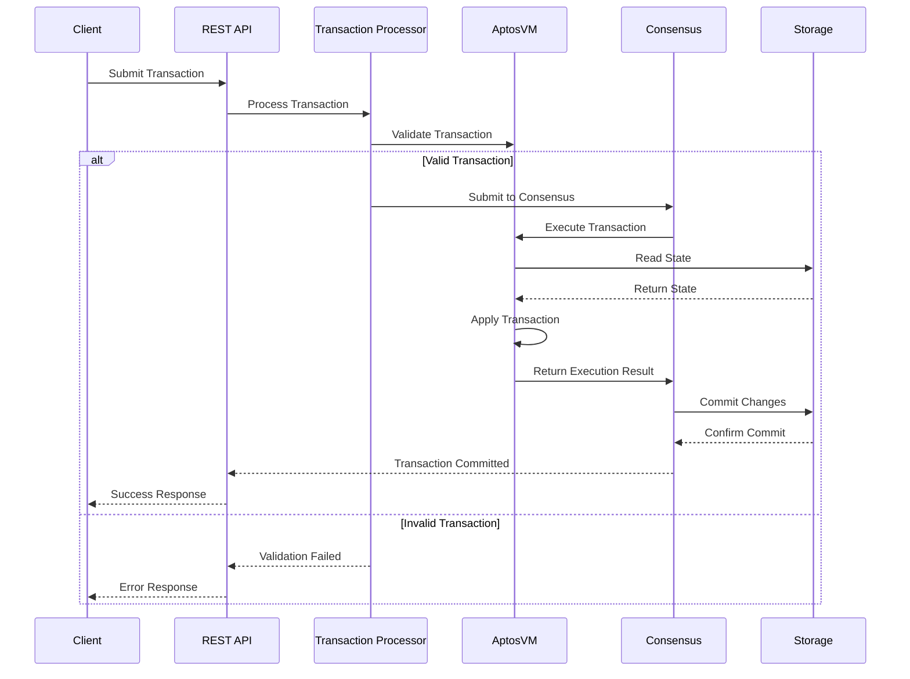

Sources: [aptos-move/aptos-vm/src/aptos_vm.rs:900-1100], [storage/storage-interface/src/lib.rs:100-200]

## Summary

The Aptos blockchain architecture is designed for high throughput, low latency, and strong safety guarantees. Key aspects include:

1. **Modularity**: Clear separation between VM, storage, consensus, and network layers
2. **Scalability**: Components designed for horizontal scalability and parallelism
3. **Flexibility**: Feature flags and configuration to adapt behavior
4. **Safety**: Strong safety guarantees through the consensus algorithm and VM enforcement
5. **Extensibility**: Support for upgrades and adding new features without disruption