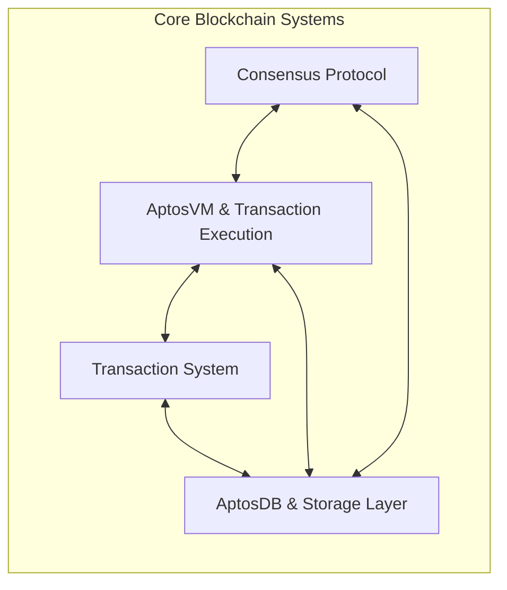
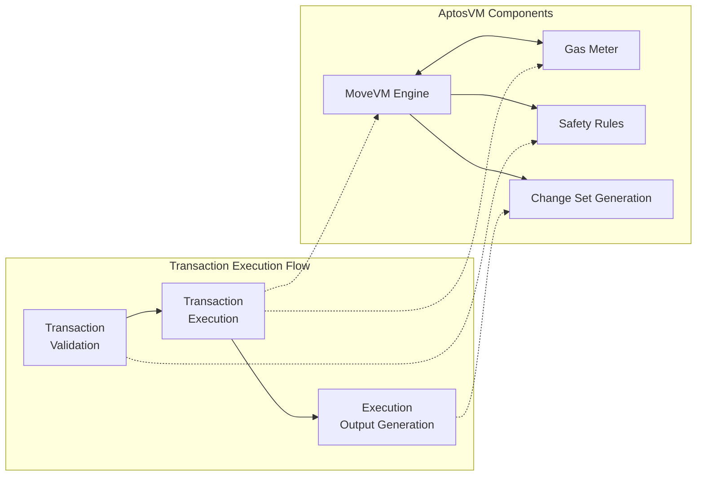
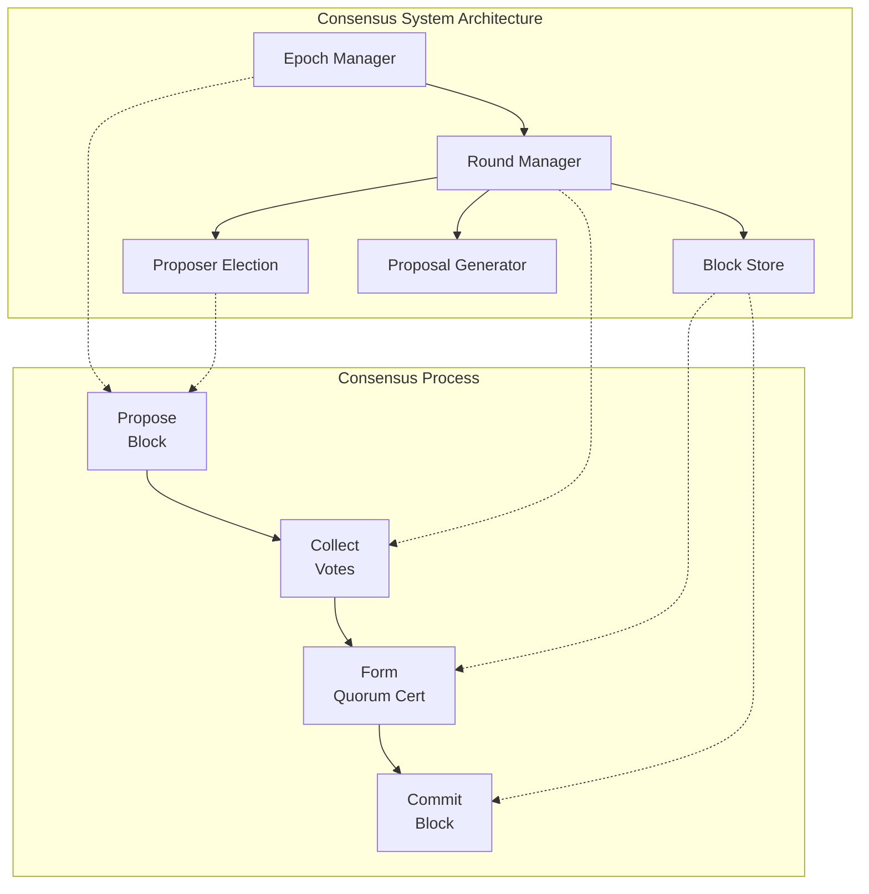
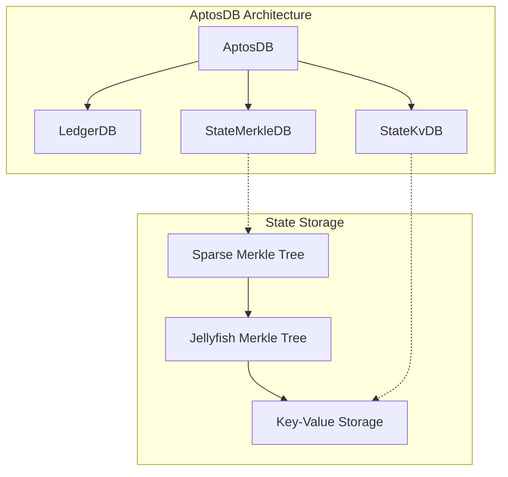
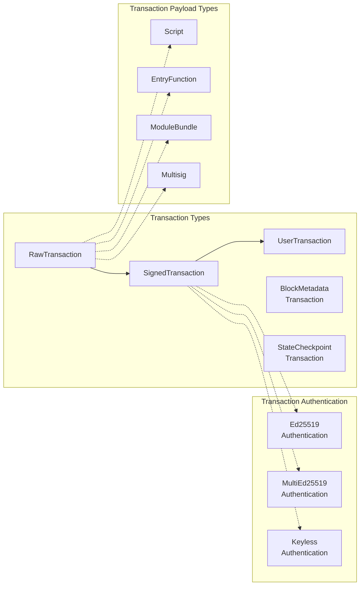
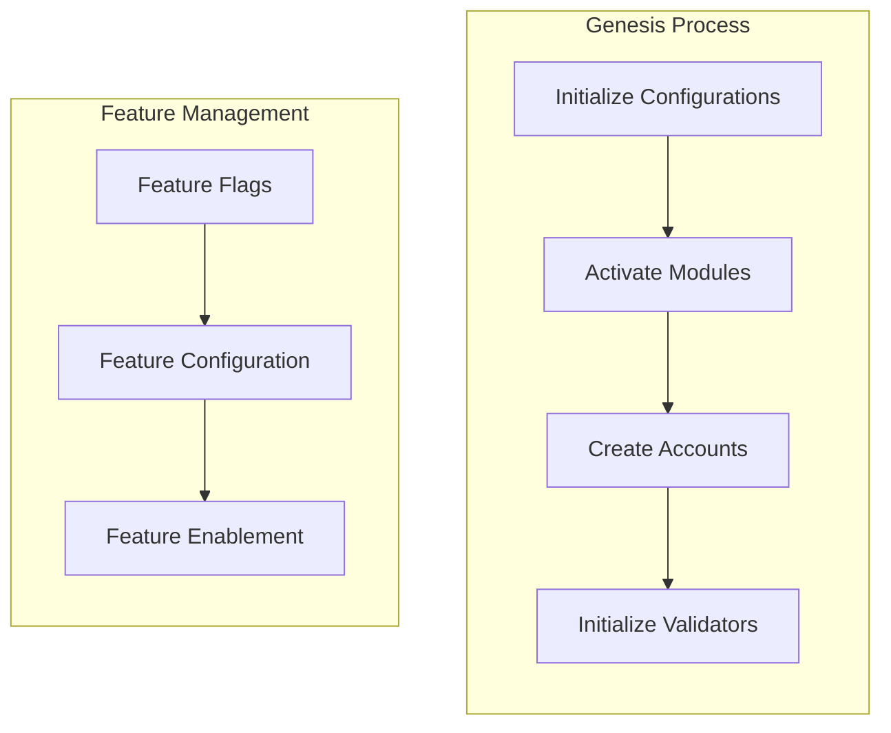
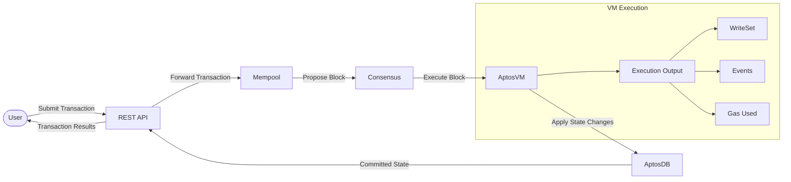

# Core Blockchain Systems

<details>
<summary>Relevant source files</summary>

The following files were used as context for generating this wiki page:

- [api/src/tests/converter_test.rs](https://github.com/aptos-labs/aptos-core/blob/b9f89a19/api/src/tests/converter_test.rs)
- [api/src/view_function.rs](https://github.com/aptos-labs/aptos-core/blob/b9f89a19/api/src/view_function.rs)
- [api/types/src/convert.rs](https://github.com/aptos-labs/aptos-core/blob/b9f89a19/api/types/src/convert.rs)
- [api/types/src/lib.rs](https://github.com/aptos-labs/aptos-core/blob/b9f89a19/api/types/src/lib.rs)
- [api/types/src/move_types.rs](https://github.com/aptos-labs/aptos-core/blob/b9f89a19/api/types/src/move_types.rs)
- [api/types/src/transaction.rs](https://github.com/aptos-labs/aptos-core/blob/b9f89a19/api/types/src/transaction.rs)
- [api/types/src/wrappers.rs](https://github.com/aptos-labs/aptos-core/blob/b9f89a19/api/types/src/wrappers.rs)
- [aptos-move/aptos-aggregator/src/delta_change_set.rs](https://github.com/aptos-labs/aptos-core/blob/b9f89a19/aptos-move/aptos-aggregator/src/delta_change_set.rs)
- [aptos-move/aptos-aggregator/src/resolver.rs](https://github.com/aptos-labs/aptos-core/blob/b9f89a19/aptos-move/aptos-aggregator/src/resolver.rs)
- [aptos-move/aptos-aggregator/src/tests/types.rs](https://github.com/aptos-labs/aptos-core/blob/b9f89a19/aptos-move/aptos-aggregator/src/tests/types.rs)
- [aptos-move/aptos-debugger/src/lib.rs](https://github.com/aptos-labs/aptos-core/blob/b9f89a19/aptos-move/aptos-debugger/src/lib.rs)
- [aptos-move/aptos-release-builder/src/components/feature_flags.rs](https://github.com/aptos-labs/aptos-core/blob/b9f89a19/aptos-move/aptos-release-builder/src/components/feature_flags.rs)
- [aptos-move/aptos-resource-viewer/src/lib.rs](https://github.com/aptos-labs/aptos-core/blob/b9f89a19/aptos-move/aptos-resource-viewer/src/lib.rs)
- [aptos-move/aptos-transaction-simulation/src/account.rs](https://github.com/aptos-labs/aptos-core/blob/b9f89a19/aptos-move/aptos-transaction-simulation/src/account.rs)
- [aptos-move/aptos-transaction-simulation/src/state_store.rs](https://github.com/aptos-labs/aptos-core/blob/b9f89a19/aptos-move/aptos-transaction-simulation/src/state_store.rs)
- [aptos-move/aptos-vm-environment/src/prod_configs.rs](https://github.com/aptos-labs/aptos-core/blob/b9f89a19/aptos-move/aptos-vm-environment/src/prod_configs.rs)
- [aptos-move/aptos-vm-types/src/abstract_write_op.rs](https://github.com/aptos-labs/aptos-core/blob/b9f89a19/aptos-move/aptos-vm-types/src/abstract_write_op.rs)
- [aptos-move/aptos-vm-types/src/change_set.rs](https://github.com/aptos-labs/aptos-core/blob/b9f89a19/aptos-move/aptos-vm-types/src/change_set.rs)
- [aptos-move/aptos-vm-types/src/tests/test_change_set.rs](https://github.com/aptos-labs/aptos-core/blob/b9f89a19/aptos-move/aptos-vm-types/src/tests/test_change_set.rs)
- [aptos-move/aptos-vm-types/src/tests/utils.rs](https://github.com/aptos-labs/aptos-core/blob/b9f89a19/aptos-move/aptos-vm-types/src/tests/utils.rs)
- [aptos-move/aptos-vm/src/aptos_vm.rs](https://github.com/aptos-labs/aptos-core/blob/b9f89a19/aptos-move/aptos-vm/src/aptos_vm.rs)
- [aptos-move/aptos-vm/src/data_cache.rs](https://github.com/aptos-labs/aptos-core/blob/b9f89a19/aptos-move/aptos-vm/src/data_cache.rs)
- [aptos-move/aptos-vm/src/errors.rs](https://github.com/aptos-labs/aptos-core/blob/b9f89a19/aptos-move/aptos-vm/src/errors.rs)
- [aptos-move/aptos-vm/src/lib.rs](https://github.com/aptos-labs/aptos-core/blob/b9f89a19/aptos-move/aptos-vm/src/lib.rs)
- [aptos-move/aptos-vm/src/move_vm_ext/resolver.rs](https://github.com/aptos-labs/aptos-core/blob/b9f89a19/aptos-move/aptos-vm/src/move_vm_ext/resolver.rs)
- [aptos-move/aptos-vm/src/move_vm_ext/vm.rs](https://github.com/aptos-labs/aptos-core/blob/b9f89a19/aptos-move/aptos-vm/src/move_vm_ext/vm.rs)
- [aptos-move/aptos-vm/src/move_vm_ext/write_op_converter.rs](https://github.com/aptos-labs/aptos-core/blob/b9f89a19/aptos-move/aptos-vm/src/move_vm_ext/write_op_converter.rs)
- [aptos-move/aptos-vm/src/natives.rs](https://github.com/aptos-labs/aptos-core/blob/b9f89a19/aptos-move/aptos-vm/src/natives.rs)
- [aptos-move/aptos-vm/src/transaction_validation.rs](https://github.com/aptos-labs/aptos-core/blob/b9f89a19/aptos-move/aptos-vm/src/transaction_validation.rs)
- [aptos-move/e2e-move-tests/Cargo.toml](https://github.com/aptos-labs/aptos-core/blob/b9f89a19/aptos-move/e2e-move-tests/Cargo.toml)
- [aptos-move/e2e-move-tests/src/harness.rs](https://github.com/aptos-labs/aptos-core/blob/b9f89a19/aptos-move/e2e-move-tests/src/harness.rs)
- [aptos-move/e2e-move-tests/src/tests/mod.rs](https://github.com/aptos-labs/aptos-core/blob/b9f89a19/aptos-move/e2e-move-tests/src/tests/mod.rs)
- [aptos-move/e2e-move-tests/src/tests/remote_state.rs](https://github.com/aptos-labs/aptos-core/blob/b9f89a19/aptos-move/e2e-move-tests/src/tests/remote_state.rs)
- [aptos-move/e2e-tests/src/executor.rs](https://github.com/aptos-labs/aptos-core/blob/b9f89a19/aptos-move/e2e-tests/src/executor.rs)
- [aptos-move/framework/aptos-framework/doc/transaction_validation.md](https://github.com/aptos-labs/aptos-core/blob/b9f89a19/aptos-move/framework/aptos-framework/doc/transaction_validation.md)
- [aptos-move/framework/aptos-framework/sources/transaction_validation.move](https://github.com/aptos-labs/aptos-core/blob/b9f89a19/aptos-move/framework/aptos-framework/sources/transaction_validation.move)
- [aptos-move/framework/aptos-framework/sources/transaction_validation.spec.move](https://github.com/aptos-labs/aptos-core/blob/b9f89a19/aptos-move/framework/aptos-framework/sources/transaction_validation.spec.move)
- [aptos-move/framework/move-stdlib/doc/features.md](https://github.com/aptos-labs/aptos-core/blob/b9f89a19/aptos-move/framework/move-stdlib/doc/features.md)
- [aptos-move/framework/move-stdlib/sources/configs/features.move](https://github.com/aptos-labs/aptos-core/blob/b9f89a19/aptos-move/framework/move-stdlib/sources/configs/features.move)
- [aptos-move/framework/move-stdlib/sources/configs/features.spec.move](https://github.com/aptos-labs/aptos-core/blob/b9f89a19/aptos-move/framework/move-stdlib/sources/configs/features.spec.move)
- [aptos-move/framework/src/natives/aggregator_natives/aggregator.rs](https://github.com/aptos-labs/aptos-core/blob/b9f89a19/aptos-move/framework/src/natives/aggregator_natives/aggregator.rs)
- [aptos-move/framework/src/natives/aggregator_natives/aggregator_factory.rs](https://github.com/aptos-labs/aptos-core/blob/b9f89a19/aptos-move/framework/src/natives/aggregator_natives/aggregator_factory.rs)
- [aptos-move/framework/src/natives/aggregator_natives/context.rs](https://github.com/aptos-labs/aptos-core/blob/b9f89a19/aptos-move/framework/src/natives/aggregator_natives/context.rs)
- [aptos-move/framework/src/natives/aggregator_natives/mod.rs](https://github.com/aptos-labs/aptos-core/blob/b9f89a19/aptos-move/framework/src/natives/aggregator_natives/mod.rs)
- [aptos-move/framework/src/natives/dispatchable_fungible_asset.rs](https://github.com/aptos-labs/aptos-core/blob/b9f89a19/aptos-move/framework/src/natives/dispatchable_fungible_asset.rs)
- [aptos-move/framework/src/natives/function_info.rs](https://github.com/aptos-labs/aptos-core/blob/b9f89a19/aptos-move/framework/src/natives/function_info.rs)
- [aptos-move/vm-genesis/src/lib.rs](https://github.com/aptos-labs/aptos-core/blob/b9f89a19/aptos-move/vm-genesis/src/lib.rs)
- [aptos-node/src/network.rs](https://github.com/aptos-labs/aptos-core/blob/b9f89a19/aptos-node/src/network.rs)
- [config/src/config/consensus_config.rs](https://github.com/aptos-labs/aptos-core/blob/b9f89a19/config/src/config/consensus_config.rs)
- [config/src/config/storage_config.rs](https://github.com/aptos-labs/aptos-core/blob/b9f89a19/config/src/config/storage_config.rs)
- [consensus/consensus-types/src/block_retrieval.rs](https://github.com/aptos-labs/aptos-core/blob/b9f89a19/consensus/consensus-types/src/block_retrieval.rs)
- [consensus/consensus-types/src/lib.rs](https://github.com/aptos-labs/aptos-core/blob/b9f89a19/consensus/consensus-types/src/lib.rs)
- [consensus/consensus-types/src/order_vote.rs](https://github.com/aptos-labs/aptos-core/blob/b9f89a19/consensus/consensus-types/src/order_vote.rs)
- [consensus/consensus-types/src/quorum_cert.rs](https://github.com/aptos-labs/aptos-core/blob/b9f89a19/consensus/consensus-types/src/quorum_cert.rs)
- [consensus/consensus-types/src/sync_info.rs](https://github.com/aptos-labs/aptos-core/blob/b9f89a19/consensus/consensus-types/src/sync_info.rs)
- [consensus/consensus-types/src/timeout_2chain.rs](https://github.com/aptos-labs/aptos-core/blob/b9f89a19/consensus/consensus-types/src/timeout_2chain.rs)
- [consensus/consensus-types/src/vote.rs](https://github.com/aptos-labs/aptos-core/blob/b9f89a19/consensus/consensus-types/src/vote.rs)
- [consensus/consensus-types/src/wrapped_ledger_info.rs](https://github.com/aptos-labs/aptos-core/blob/b9f89a19/consensus/consensus-types/src/wrapped_ledger_info.rs)
- [consensus/src/block_storage/block_store.rs](https://github.com/aptos-labs/aptos-core/blob/b9f89a19/consensus/src/block_storage/block_store.rs)
- [consensus/src/block_storage/block_store_test.rs](https://github.com/aptos-labs/aptos-core/blob/b9f89a19/consensus/src/block_storage/block_store_test.rs)
- [consensus/src/block_storage/block_tree.rs](https://github.com/aptos-labs/aptos-core/blob/b9f89a19/consensus/src/block_storage/block_tree.rs)
- [consensus/src/block_storage/sync_manager.rs](https://github.com/aptos-labs/aptos-core/blob/b9f89a19/consensus/src/block_storage/sync_manager.rs)
- [consensus/src/counters.rs](https://github.com/aptos-labs/aptos-core/blob/b9f89a19/consensus/src/counters.rs)
- [consensus/src/epoch_manager.rs](https://github.com/aptos-labs/aptos-core/blob/b9f89a19/consensus/src/epoch_manager.rs)
- [consensus/src/liveness/proposal_generator.rs](https://github.com/aptos-labs/aptos-core/blob/b9f89a19/consensus/src/liveness/proposal_generator.rs)
- [consensus/src/liveness/proposal_generator_test.rs](https://github.com/aptos-labs/aptos-core/blob/b9f89a19/consensus/src/liveness/proposal_generator_test.rs)
- [consensus/src/liveness/round_state.rs](https://github.com/aptos-labs/aptos-core/blob/b9f89a19/consensus/src/liveness/round_state.rs)
- [consensus/src/liveness/round_state_test.rs](https://github.com/aptos-labs/aptos-core/blob/b9f89a19/consensus/src/liveness/round_state_test.rs)
- [consensus/src/liveness/unequivocal_proposer_election.rs](https://github.com/aptos-labs/aptos-core/blob/b9f89a19/consensus/src/liveness/unequivocal_proposer_election.rs)
- [consensus/src/network.rs](https://github.com/aptos-labs/aptos-core/blob/b9f89a19/consensus/src/network.rs)
- [consensus/src/network_interface.rs](https://github.com/aptos-labs/aptos-core/blob/b9f89a19/consensus/src/network_interface.rs)
- [consensus/src/network_tests.rs](https://github.com/aptos-labs/aptos-core/blob/b9f89a19/consensus/src/network_tests.rs)
- [consensus/src/pending_order_votes.rs](https://github.com/aptos-labs/aptos-core/blob/b9f89a19/consensus/src/pending_order_votes.rs)
- [consensus/src/pending_votes.rs](https://github.com/aptos-labs/aptos-core/blob/b9f89a19/consensus/src/pending_votes.rs)
- [consensus/src/persistent_liveness_storage.rs](https://github.com/aptos-labs/aptos-core/blob/b9f89a19/consensus/src/persistent_liveness_storage.rs)
- [consensus/src/recovery_manager.rs](https://github.com/aptos-labs/aptos-core/blob/b9f89a19/consensus/src/recovery_manager.rs)
- [consensus/src/round_manager.rs](https://github.com/aptos-labs/aptos-core/blob/b9f89a19/consensus/src/round_manager.rs)
- [consensus/src/round_manager_fuzzing.rs](https://github.com/aptos-labs/aptos-core/blob/b9f89a19/consensus/src/round_manager_fuzzing.rs)
- [consensus/src/round_manager_test.rs](https://github.com/aptos-labs/aptos-core/blob/b9f89a19/consensus/src/round_manager_test.rs)
- [consensus/src/test_utils/mock_storage.rs](https://github.com/aptos-labs/aptos-core/blob/b9f89a19/consensus/src/test_utils/mock_storage.rs)
- [consensus/src/twins/twins_node.rs](https://github.com/aptos-labs/aptos-core/blob/b9f89a19/consensus/src/twins/twins_node.rs)
- [consensus/src/txn_notifier.rs](https://github.com/aptos-labs/aptos-core/blob/b9f89a19/consensus/src/txn_notifier.rs)
- [execution/executor-test-helpers/Cargo.toml](https://github.com/aptos-labs/aptos-core/blob/b9f89a19/execution/executor-test-helpers/Cargo.toml)
- [execution/executor-test-helpers/src/integration_test_impl.rs](https://github.com/aptos-labs/aptos-core/blob/b9f89a19/execution/executor-test-helpers/src/integration_test_impl.rs)
- [execution/executor/Cargo.toml](https://github.com/aptos-labs/aptos-core/blob/b9f89a19/execution/executor/Cargo.toml)
- [execution/executor/src/tests/chunk_executor_tests.rs](https://github.com/aptos-labs/aptos-core/blob/b9f89a19/execution/executor/src/tests/chunk_executor_tests.rs)
- [execution/executor/tests/db_bootstrapper_test.rs](https://github.com/aptos-labs/aptos-core/blob/b9f89a19/execution/executor/tests/db_bootstrapper_test.rs)
- [execution/executor/tests/storage_integration_test.rs](https://github.com/aptos-labs/aptos-core/blob/b9f89a19/execution/executor/tests/storage_integration_test.rs)
- [network/builder/src/builder.rs](https://github.com/aptos-labs/aptos-core/blob/b9f89a19/network/builder/src/builder.rs)
- [network/builder/src/dummy.rs](https://github.com/aptos-labs/aptos-core/blob/b9f89a19/network/builder/src/dummy.rs)
- [storage/accumulator/src/lib.rs](https://github.com/aptos-labs/aptos-core/blob/b9f89a19/storage/accumulator/src/lib.rs)
- [storage/aptosdb/src/db_debugger/truncate/mod.rs](https://github.com/aptos-labs/aptos-core/blob/b9f89a19/storage/aptosdb/src/db_debugger/truncate/mod.rs)
- [storage/aptosdb/src/lib.rs](https://github.com/aptos-labs/aptos-core/blob/b9f89a19/storage/aptosdb/src/lib.rs)
- [storage/aptosdb/src/pruner/db_pruner.rs](https://github.com/aptos-labs/aptos-core/blob/b9f89a19/storage/aptosdb/src/pruner/db_pruner.rs)
- [storage/aptosdb/src/pruner/mod.rs](https://github.com/aptos-labs/aptos-core/blob/b9f89a19/storage/aptosdb/src/pruner/mod.rs)
- [storage/aptosdb/src/pruner/pruner_manager.rs](https://github.com/aptos-labs/aptos-core/blob/b9f89a19/storage/aptosdb/src/pruner/pruner_manager.rs)
- [storage/aptosdb/src/schema/db_metadata/mod.rs](https://github.com/aptos-labs/aptos-core/blob/b9f89a19/storage/aptosdb/src/schema/db_metadata/mod.rs)
- [storage/aptosdb/src/state_kv_db.rs](https://github.com/aptos-labs/aptos-core/blob/b9f89a19/storage/aptosdb/src/state_kv_db.rs)
- [storage/aptosdb/src/state_merkle_db.rs](https://github.com/aptos-labs/aptos-core/blob/b9f89a19/storage/aptosdb/src/state_merkle_db.rs)
- [storage/aptosdb/src/state_restore/mod.rs](https://github.com/aptos-labs/aptos-core/blob/b9f89a19/storage/aptosdb/src/state_restore/mod.rs)
- [storage/aptosdb/src/state_restore/restore_test.rs](https://github.com/aptos-labs/aptos-core/blob/b9f89a19/storage/aptosdb/src/state_restore/restore_test.rs)
- [storage/aptosdb/src/state_store/buffered_state.rs](https://github.com/aptos-labs/aptos-core/blob/b9f89a19/storage/aptosdb/src/state_store/buffered_state.rs)
- [storage/aptosdb/src/state_store/mod.rs](https://github.com/aptos-labs/aptos-core/blob/b9f89a19/storage/aptosdb/src/state_store/mod.rs)
- [storage/aptosdb/src/state_store/state_merkle_batch_committer.rs](https://github.com/aptos-labs/aptos-core/blob/b9f89a19/storage/aptosdb/src/state_store/state_merkle_batch_committer.rs)
- [storage/aptosdb/src/state_store/state_snapshot_committer.rs](https://github.com/aptos-labs/aptos-core/blob/b9f89a19/storage/aptosdb/src/state_store/state_snapshot_committer.rs)
- [storage/aptosdb/src/utils/truncation_helper.rs](https://github.com/aptos-labs/aptos-core/blob/b9f89a19/storage/aptosdb/src/utils/truncation_helper.rs)
- [storage/backup/backup-cli/src/backup_types/state_snapshot/restore.rs](https://github.com/aptos-labs/aptos-core/blob/b9f89a19/storage/backup/backup-cli/src/backup_types/state_snapshot/restore.rs)
- [storage/jellyfish-merkle/Cargo.toml](https://github.com/aptos-labs/aptos-core/blob/b9f89a19/storage/jellyfish-merkle/Cargo.toml)
- [storage/jellyfish-merkle/src/jellyfish_merkle_test.rs](https://github.com/aptos-labs/aptos-core/blob/b9f89a19/storage/jellyfish-merkle/src/jellyfish_merkle_test.rs)
- [storage/jellyfish-merkle/src/lib.rs](https://github.com/aptos-labs/aptos-core/blob/b9f89a19/storage/jellyfish-merkle/src/lib.rs)
- [storage/jellyfish-merkle/src/metrics.rs](https://github.com/aptos-labs/aptos-core/blob/b9f89a19/storage/jellyfish-merkle/src/metrics.rs)
- [storage/jellyfish-merkle/src/mock_tree_store.rs](https://github.com/aptos-labs/aptos-core/blob/b9f89a19/storage/jellyfish-merkle/src/mock_tree_store.rs)
- [storage/jellyfish-merkle/src/node_type/mod.rs](https://github.com/aptos-labs/aptos-core/blob/b9f89a19/storage/jellyfish-merkle/src/node_type/mod.rs)
- [storage/jellyfish-merkle/src/node_type/node_type_test.rs](https://github.com/aptos-labs/aptos-core/blob/b9f89a19/storage/jellyfish-merkle/src/node_type/node_type_test.rs)
- [storage/jellyfish-merkle/src/restore/mod.rs](https://github.com/aptos-labs/aptos-core/blob/b9f89a19/storage/jellyfish-merkle/src/restore/mod.rs)
- [storage/storage-interface/src/lib.rs](https://github.com/aptos-labs/aptos-core/blob/b9f89a19/storage/storage-interface/src/lib.rs)
- [testsuite/generate-format/src/api.rs](https://github.com/aptos-labs/aptos-core/blob/b9f89a19/testsuite/generate-format/src/api.rs)
- [testsuite/generate-format/src/aptos.rs](https://github.com/aptos-labs/aptos-core/blob/b9f89a19/testsuite/generate-format/src/aptos.rs)
- [testsuite/generate-format/src/consensus.rs](https://github.com/aptos-labs/aptos-core/blob/b9f89a19/testsuite/generate-format/src/consensus.rs)
- [testsuite/generate-format/tests/staged/api.yaml](https://github.com/aptos-labs/aptos-core/blob/b9f89a19/testsuite/generate-format/tests/staged/api.yaml)
- [testsuite/generate-format/tests/staged/aptos.yaml](https://github.com/aptos-labs/aptos-core/blob/b9f89a19/testsuite/generate-format/tests/staged/aptos.yaml)
- [testsuite/generate-format/tests/staged/consensus.yaml](https://github.com/aptos-labs/aptos-core/blob/b9f89a19/testsuite/generate-format/tests/staged/consensus.yaml)
- [third_party/move/move-core/types/src/vm_status.rs](https://github.com/aptos-labs/aptos-core/blob/b9f89a19/third_party/move/move-core/types/src/vm_status.rs)
- [third_party/move/move-model/bytecode/src/stackless_bytecode_generator.rs](https://github.com/aptos-labs/aptos-core/blob/b9f89a19/third_party/move/move-model/bytecode/src/stackless_bytecode_generator.rs)
- [third_party/move/move-vm/runtime/src/config.rs](https://github.com/aptos-labs/aptos-core/blob/b9f89a19/third_party/move/move-vm/runtime/src/config.rs)
- [third_party/move/move-vm/types/src/values/mod.rs](https://github.com/aptos-labs/aptos-core/blob/b9f89a19/third_party/move/move-vm/types/src/values/mod.rs)
- [third_party/move/tools/move-resource-viewer/src/fat_type.rs](https://github.com/aptos-labs/aptos-core/blob/b9f89a19/third_party/move/tools/move-resource-viewer/src/fat_type.rs)
- [third_party/move/tools/move-resource-viewer/src/lib.rs](https://github.com/aptos-labs/aptos-core/blob/b9f89a19/third_party/move/tools/move-resource-viewer/src/lib.rs)
- [third_party/move/tools/move-resource-viewer/src/limit.rs](https://github.com/aptos-labs/aptos-core/blob/b9f89a19/third_party/move/tools/move-resource-viewer/src/limit.rs)
- [types/src/account_address.rs](https://github.com/aptos-labs/aptos-core/blob/b9f89a19/types/src/account_address.rs)
- [types/src/ledger_info.rs](https://github.com/aptos-labs/aptos-core/blob/b9f89a19/types/src/ledger_info.rs)
- [types/src/nibble/nibble_path/mod.rs](https://github.com/aptos-labs/aptos-core/blob/b9f89a19/types/src/nibble/nibble_path/mod.rs)
- [types/src/on_chain_config/aptos_features.rs](https://github.com/aptos-labs/aptos-core/blob/b9f89a19/types/src/on_chain_config/aptos_features.rs)
- [types/src/proof/accumulator/mock.rs](https://github.com/aptos-labs/aptos-core/blob/b9f89a19/types/src/proof/accumulator/mock.rs)
- [types/src/proof/position/mod.rs](https://github.com/aptos-labs/aptos-core/blob/b9f89a19/types/src/proof/position/mod.rs)
- [types/src/proptest_types.rs](https://github.com/aptos-labs/aptos-core/blob/b9f89a19/types/src/proptest_types.rs)
- [types/src/transaction/authenticator.rs](https://github.com/aptos-labs/aptos-core/blob/b9f89a19/types/src/transaction/authenticator.rs)
- [types/src/transaction/change_set.rs](https://github.com/aptos-labs/aptos-core/blob/b9f89a19/types/src/transaction/change_set.rs)
- [types/src/transaction/mod.rs](https://github.com/aptos-labs/aptos-core/blob/b9f89a19/types/src/transaction/mod.rs)
- [types/src/validator_verifier.rs](https://github.com/aptos-labs/aptos-core/blob/b9f89a19/types/src/validator_verifier.rs)
- [types/src/write_set.rs](https://github.com/aptos-labs/aptos-core/blob/b9f89a19/types/src/write_set.rs)

</details>


This document provides an overview of the core systems that power the Aptos blockchain. It covers the fundamental components responsible for transaction execution, consensus, state management and storage. These systems form the foundational layer upon which the Aptos blockchain operates.

For information about smart contracts and the Move language, see [Framework & Smart Contracts](#3). For details on developer tools and APIs, see [Developer Tools & APIs](#4).

## Overview of Core Systems

The Aptos blockchain relies on several interconnected core systems to function:



The four major components are:

1. **AptosVM & Transaction Execution System**: Responsible for executing transactions, managing gas, and enforcing safety rules.
2. **Consensus Protocol**: Ensures validators agree on the order of transactions and finality of blocks.
3. **Storage Layer (AptosDB)**: Persists blockchain state, transactions, and events in an efficient way.
4. **Transaction System**: Defines transaction structures, authentication, and lifecycle management.

Sources: [aptos-move/aptos-vm/src/aptos_vm.rs:1-754](https://github.com/aptos-labs/aptos-core/blob/b9f89a19/aptos-move/aptos-vm/src/aptos_vm.rs#L1-L754), [consensus/src/epoch_manager.rs:1-250](https://github.com/aptos-labs/aptos-core/blob/b9f89a19/consensus/src/epoch_manager.rs#L1-L250), [storage/aptosdb/src/lib.rs:1-41](https://github.com/aptos-labs/aptos-core/blob/b9f89a19/storage/aptosdb/src/lib.rs#L1-L41), [types/src/transaction/mod.rs:1-131](https://github.com/aptos-labs/aptos-core/blob/b9f89a19/types/src/transaction/mod.rs#L1-L131)

## Transaction Execution System

The transaction execution system, centered around the AptosVM, is responsible for validating and executing transactions according to Move semantics.



### AptosVM Structure

The AptosVM is structured around the MoveVM, with additional components for Aptos-specific functionality:

- **Session Management**: Handles transaction execution contexts through `SessionExt`
- **Gas Metering**: Tracks and limits resource usage during execution
- **Move Code Execution**: Executes Move scripts and entry functions
- **Change Set Generation**: Produces state updates based on transaction execution

Sources: [aptos-move/aptos-vm/src/aptos_vm.rs:253-387](https://github.com/aptos-labs/aptos-core/blob/b9f89a19/aptos-move/aptos-vm/src/aptos_vm.rs#L253-L387), [aptos-move/aptos-vm/src/move_vm_ext/vm.rs:1-29](https://github.com/aptos-labs/aptos-core/blob/b9f89a19/aptos-move/aptos-vm/src/move_vm_ext/vm.rs#L1-L29)

### Transaction Execution Flow

1. **Validation Phase**: Validates transactions for well-formedness, gas limits, and semantic correctness
2. **Execution Phase**: Executes the transaction against the current state
3. **Output Generation**: Produces change sets, events, and gas consumption metrics

Key execution methods:

```
execute_block: Executes a batch of transactions in sequence or parallel
execute_user_transaction: Executes a single user transaction
validate_transaction: Validates a transaction before execution
```

Sources: [aptos-move/aptos-vm/src/aptos_vm.rs:400-600](https://github.com/aptos-labs/aptos-core/blob/b9f89a19/aptos-move/aptos-vm/src/aptos_vm.rs#L400-L600), [aptos-move/aptos-vm/src/data_cache.rs:1-20](https://github.com/aptos-labs/aptos-core/blob/b9f89a19/aptos-move/aptos-vm/src/data_cache.rs#L1-L20)

## Consensus Protocol

The Aptos consensus protocol is a Byzantine Fault Tolerant (BFT) system that allows validators to agree on the order of transactions and the finality of blocks.



### Epoch Management

The `EpochManager` handles epoch transitions, including:

- Initializing components for new epochs
- Managing validator sets
- Handling reconfiguration events

Sources: [consensus/src/epoch_manager.rs:130-270](https://github.com/aptos-labs/aptos-core/blob/b9f89a19/consensus/src/epoch_manager.rs#L130-L270)

### Round Management

The `RoundManager` drives the consensus process for individual rounds:

- Processes proposals, votes, and timeouts
- Manages the block store and pending blocks
- Triggers block execution and certification

Sources: [consensus/src/round_manager.rs:245-325](https://github.com/aptos-labs/aptos-core/blob/b9f89a19/consensus/src/round_manager.rs#L245-L325)

### Proposer Election

The protocol uses various election strategies to determine block proposers:

- **RotatingProposer**: Round-robin selection of proposers
- **LeaderReputation**: Selection based on validator performance
- **Fixed Proposer**: Same proposer for a set number of rounds

Sources: [consensus/src/epoch_manager.rs:275-400](https://github.com/aptos-labs/aptos-core/blob/b9f89a19/consensus/src/epoch_manager.rs#L275-L400)

### Block Storage and Synchronization

The consensus system maintains blocks and certificates, with components to:

- Store and retrieve blocks
- Synchronize blocks between validators
- Manage block execution and commitment

Sources: [consensus/src/block_storage/block_store.rs:1-20](https://github.com/aptos-labs/aptos-core/blob/b9f89a19/consensus/src/block_storage/block_store.rs#L1-L20), [consensus/src/block_storage/sync_manager.rs:1-30](https://github.com/aptos-labs/aptos-core/blob/b9f89a19/consensus/src/block_storage/sync_manager.rs#L1-L30)

## Storage Layer

The Aptos storage layer is responsible for persisting blockchain state, transactions, and events.



### AptosDB Structure

AptosDB is composed of several specialized database components:

- **LedgerDB**: Stores transactions, events, and ledger metadata
- **StateMerkleDB**: Manages the state Merkle tree for proving state
- **StateKvDB**: Stores state key-value pairs

Sources: [storage/aptosdb/src/lib.rs:7-40](https://github.com/aptos-labs/aptos-core/blob/b9f89a19/storage/aptosdb/src/lib.rs#L7-L40), [storage/storage-interface/src/lib.rs:100-120](https://github.com/aptos-labs/aptos-core/blob/b9f89a19/storage/storage-interface/src/lib.rs#L100-L120)

### State Store System

The state storage system uses a Sparse Merkle Tree implementation to:

- Track account states efficiently
- Provide cryptographic proofs of state
- Support efficient state updates

Key components:

- **StateStore**: Manages state access and updates
- **BufferedState**: Caches recent state changes
- **PersistedState**: Represents committed state

Sources: [storage/aptosdb/src/state_store/mod.rs:103-127](https://github.com/aptos-labs/aptos-core/blob/b9f89a19/storage/aptosdb/src/state_store/mod.rs#L103-L127), [storage/aptosdb/src/state_store/mod.rs:300-350](https://github.com/aptos-labs/aptos-core/blob/b9f89a19/storage/aptosdb/src/state_store/mod.rs#L300-L350)

### Storage Pruning and Optimization

The storage system includes pruning mechanisms to:

- Remove historical states beyond a configurable window
- Optimize storage usage
- Maintain performance as the blockchain grows

Sources: [storage/aptosdb/src/state_store/mod.rs:460-500](https://github.com/aptos-labs/aptos-core/blob/b9f89a19/storage/aptosdb/src/state_store/mod.rs#L460-L500), [storage/aptosdb/src/utils/truncation_helper.rs:1-20](https://github.com/aptos-labs/aptos-core/blob/b9f89a19/storage/aptosdb/src/utils/truncation_helper.rs#L1-L20)

## Transaction System

The transaction system defines the structure, authentication, and processing of transactions on the Aptos blockchain.



### Transaction Structure

Transactions in Aptos are structured as:

- **RawTransaction**: Contains sender, sequence number, payload, gas parameters, and expiration
- **SignedTransaction**: RawTransaction with authentication information
- **Transaction**: Enum representing all transaction types (user, block metadata, etc.)

Sources: [types/src/transaction/mod.rs:100-130](https://github.com/aptos-labs/aptos-core/blob/b9f89a19/types/src/transaction/mod.rs#L100-L130), [types/src/transaction/mod.rs:350-400](https://github.com/aptos-labs/aptos-core/blob/b9f89a19/types/src/transaction/mod.rs#L350-L400)

### Transaction Authentication

Aptos supports multiple authentication schemes:

- **Ed25519**: Standard single-key signatures
- **MultiEd25519**: Threshold signatures with multiple keys
- **Keyless Authentication**: Emerging standard for authentication without traditional keys

Sources: [types/src/transaction/authenticator.rs:1-20](https://github.com/aptos-labs/aptos-core/blob/b9f89a19/types/src/transaction/authenticator.rs#L1-L20), [types/src/transaction/mod.rs:220-260](https://github.com/aptos-labs/aptos-core/blob/b9f89a19/types/src/transaction/mod.rs#L220-L260)

### Transaction Processing

Transactions follow a defined lifecycle:

1. **Submission**: Transactions are submitted to the blockchain
2. **Validation**: Transactions are validated for well-formedness and signatures
3. **Ordering**: Consensus determines transaction order
4. **Execution**: VM executes transactions
5. **Storage**: Results are committed to storage

Sources: [types/src/transaction/mod.rs:600-650](https://github.com/aptos-labs/aptos-core/blob/b9f89a19/types/src/transaction/mod.rs#L600-L650), [api/types/src/transaction.rs:1-30](https://github.com/aptos-labs/aptos-core/blob/b9f89a19/api/types/src/transaction.rs#L1-L30)

## System Configuration and Genesis

The Genesis process initializes the blockchain and establishes the initial state and configurations.



### Genesis Process

The genesis process:

- Initializes the core Move modules
- Creates initial accounts (including framework accounts)
- Sets up initial validators
- Establishes the starting state

Sources: [aptos-move/vm-genesis/src/lib.rs:130-210](https://github.com/aptos-labs/aptos-core/blob/b9f89a19/aptos-move/vm-genesis/src/lib.rs#L130-L210), [aptos-move/vm-genesis/src/lib.rs:400-500](https://github.com/aptos-labs/aptos-core/blob/b9f89a19/aptos-move/vm-genesis/src/lib.rs#L400-L500)

### Feature Management

Aptos uses a feature flag system to control the availability of features:

- Defines flags for different capabilities
- Controls backward compatibility
- Allows gradual rollout of new features

Key feature types:

- **Transient features**: Temporary flags for feature deployment
- **Permanent features**: Flags needed for permanent code paths

Sources: [types/src/on_chain_config/aptos_features.rs:16-138](https://github.com/aptos-labs/aptos-core/blob/b9f89a19/types/src/on_chain_config/aptos_features.rs#L16-L138), [aptos-move/framework/move-stdlib/sources/configs/features.move:25-45](https://github.com/aptos-labs/aptos-core/blob/b9f89a19/aptos-move/framework/move-stdlib/sources/configs/features.move#L25-L45)

## End-to-End Transaction Flow

The complete lifecycle of a transaction through the Aptos blockchain systems:



### Transaction Submission and Execution

1. Users submit transactions through the REST API
2. Transactions enter the mempool waiting for consensus
3. Consensus proposes blocks of transactions
4. AptosVM executes the transactions and produces outputs
5. Storage layer commits the changes to the state
6. Results are made available through the API

Sources: [aptos-move/aptos-vm/src/aptos_vm.rs:350-400](https://github.com/aptos-labs/aptos-core/blob/b9f89a19/aptos-move/aptos-vm/src/aptos_vm.rs#L350-L400), [consensus/src/counters.rs:100-150](https://github.com/aptos-labs/aptos-core/blob/b9f89a19/consensus/src/counters.rs#L100-L150), [storage/aptosdb/src/state_store/mod.rs:220-260](https://github.com/aptos-labs/aptos-core/blob/b9f89a19/storage/aptosdb/src/state_store/mod.rs#L220-L260)

### Parallel Transaction Execution

Aptos supports parallel transaction execution for higher throughput:

- Transactions are analyzed for conflicts
- Non-conflicting transactions are executed in parallel
- Results are merged to produce a consistent state

Sources: [aptos-move/e2e-tests/src/executor.rs:130-180](https://github.com/aptos-labs/aptos-core/blob/b9f89a19/aptos-move/e2e-tests/src/executor.rs#L130-L180), [consensus/src/counters.rs:300-350](https://github.com/aptos-labs/aptos-core/blob/b9f89a19/consensus/src/counters.rs#L300-L350)

### System Performance and Monitoring

The core systems include comprehensive monitoring and metrics:

- Transaction throughput and latency
- Consensus participation and success rates
- Storage efficiency and state size
- VM execution time and gas consumption

Sources: [consensus/src/counters.rs:45-90](https://github.com/aptos-labs/aptos-core/blob/b9f89a19/consensus/src/counters.rs#L45-L90), [storage/aptosdb/src/metrics.rs:1-20](https://github.com/aptos-labs/aptos-core/blob/b9f89a19/storage/aptosdb/src/metrics.rs#L1-L20)

## Configuration and Tuning

The core blockchain systems are highly configurable to meet different deployment needs:

```
ConsensusConfig: Controls consensus parameters
StorageConfig: Configures database paths and caching
VMConfig: Sets VM execution parameters
```

Key configuration areas:

- **Consensus timing**: Controls block production rates
- **Storage pruning**: Manages state retention policies
- **Gas parameters**: Tunes resource accounting
- **Execution parallelism**: Controls parallel execution settings

Sources: [config/src/config/consensus_config.rs:26-97](https://github.com/aptos-labs/aptos-core/blob/b9f89a19/config/src/config/consensus_config.rs#L26-L97), [config/src/config/storage_config.rs:31-51](https://github.com/aptos-labs/aptos-core/blob/b9f89a19/config/src/config/storage_config.rs#L31-L51)

## Conclusion

The core blockchain systems of Aptos work together to provide a secure, high-performance blockchain platform:

- The **AptosVM** executes transactions with safety and efficiency
- The **Consensus Protocol** ensures agreement on transaction ordering
- The **Storage Layer** persists blockchain state with cryptographic integrity
- The **Transaction System** provides a flexible structure for blockchain operations

These systems form the foundation upon which the Aptos blockchain's features and capabilities are built.