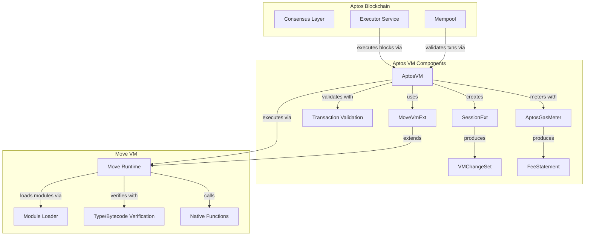
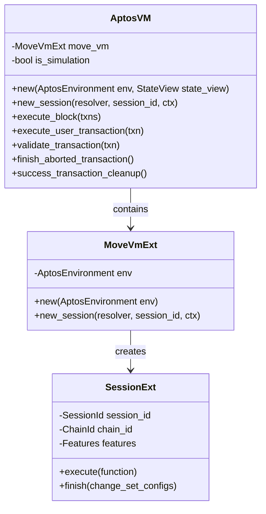
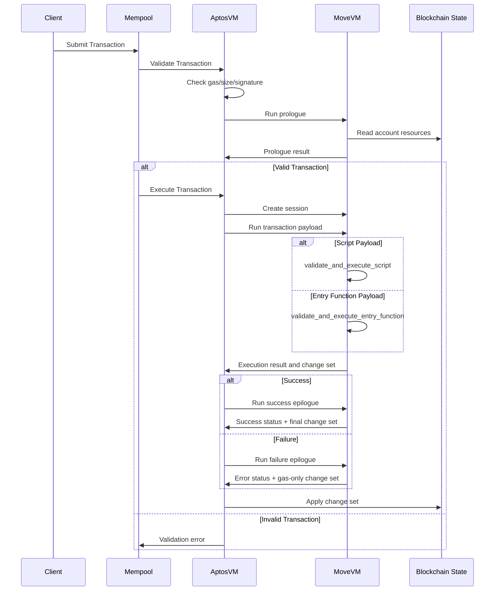
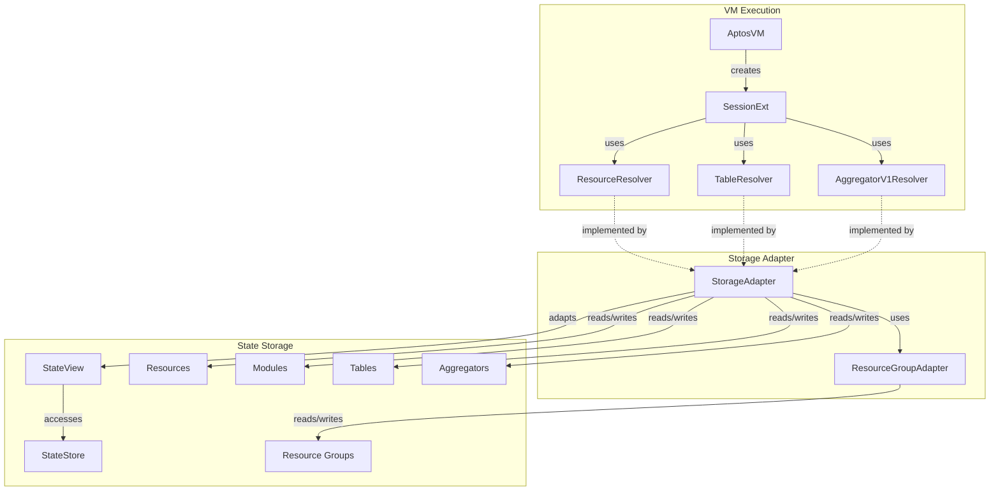
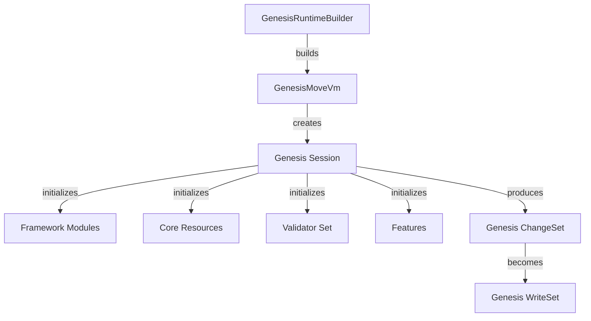
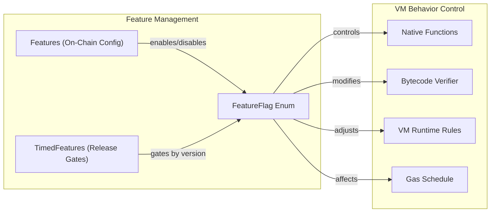

# Virtual Machine

Relevant source files

The following files were used as context for generating this wiki page:

- [aptos-move/aptos-aggregator/src/delta_change_set.rs](https://github.com/aptos-labs/aptos-core/blob/b9f89a19/aptos-move/aptos-aggregator/src/delta_change_set.rs)
- [aptos-move/aptos-aggregator/src/resolver.rs](https://github.com/aptos-labs/aptos-core/blob/b9f89a19/aptos-move/aptos-aggregator/src/resolver.rs)
- [aptos-move/aptos-aggregator/src/tests/types.rs](https://github.com/aptos-labs/aptos-core/blob/b9f89a19/aptos-move/aptos-aggregator/src/tests/types.rs)
- [aptos-move/aptos-debugger/src/lib.rs](https://github.com/aptos-labs/aptos-core/blob/b9f89a19/aptos-move/aptos-debugger/src/lib.rs)
- [aptos-move/aptos-release-builder/src/components/feature_flags.rs](https://github.com/aptos-labs/aptos-core/blob/b9f89a19/aptos-move/aptos-release-builder/src/components/feature_flags.rs)
- [aptos-move/aptos-transaction-simulation/src/account.rs](https://github.com/aptos-labs/aptos-core/blob/b9f89a19/aptos-move/aptos-transaction-simulation/src/account.rs)
- [aptos-move/aptos-transaction-simulation/src/state_store.rs](https://github.com/aptos-labs/aptos-core/blob/b9f89a19/aptos-move/aptos-transaction-simulation/src/state_store.rs)
- [aptos-move/aptos-vm-environment/src/prod_configs.rs](https://github.com/aptos-labs/aptos-core/blob/b9f89a19/aptos-move/aptos-vm-environment/src/prod_configs.rs)
- [aptos-move/aptos-vm-types/src/abstract_write_op.rs](https://github.com/aptos-labs/aptos-core/blob/b9f89a19/aptos-move/aptos-vm-types/src/abstract_write_op.rs)
- [aptos-move/aptos-vm-types/src/change_set.rs](https://github.com/aptos-labs/aptos-core/blob/b9f89a19/aptos-move/aptos-vm-types/src/change_set.rs)
- [aptos-move/aptos-vm-types/src/tests/test_change_set.rs](https://github.com/aptos-labs/aptos-core/blob/b9f89a19/aptos-move/aptos-vm-types/src/tests/test_change_set.rs)
- [aptos-move/aptos-vm-types/src/tests/utils.rs](https://github.com/aptos-labs/aptos-core/blob/b9f89a19/aptos-move/aptos-vm-types/src/tests/utils.rs)
- [aptos-move/aptos-vm/src/aptos_vm.rs](https://github.com/aptos-labs/aptos-core/blob/b9f89a19/aptos-move/aptos-vm/src/aptos_vm.rs)
- [aptos-move/aptos-vm/src/data_cache.rs](https://github.com/aptos-labs/aptos-core/blob/b9f89a19/aptos-move/aptos-vm/src/data_cache.rs)
- [aptos-move/aptos-vm/src/errors.rs](https://github.com/aptos-labs/aptos-core/blob/b9f89a19/aptos-move/aptos-vm/src/errors.rs)
- [aptos-move/aptos-vm/src/lib.rs](https://github.com/aptos-labs/aptos-core/blob/b9f89a19/aptos-move/aptos-vm/src/lib.rs)
- [aptos-move/aptos-vm/src/move_vm_ext/resolver.rs](https://github.com/aptos-labs/aptos-core/blob/b9f89a19/aptos-move/aptos-vm/src/move_vm_ext/resolver.rs)
- [aptos-move/aptos-vm/src/move_vm_ext/vm.rs](https://github.com/aptos-labs/aptos-core/blob/b9f89a19/aptos-move/aptos-vm/src/move_vm_ext/vm.rs)
- [aptos-move/aptos-vm/src/move_vm_ext/write_op_converter.rs](https://github.com/aptos-labs/aptos-core/blob/b9f89a19/aptos-move/aptos-vm/src/move_vm_ext/write_op_converter.rs)
- [aptos-move/aptos-vm/src/natives.rs](https://github.com/aptos-labs/aptos-core/blob/b9f89a19/aptos-move/aptos-vm/src/natives.rs)
- [aptos-move/aptos-vm/src/transaction_validation.rs](https://github.com/aptos-labs/aptos-core/blob/b9f89a19/aptos-move/aptos-vm/src/transaction_validation.rs)
- [aptos-move/e2e-move-tests/Cargo.toml](https://github.com/aptos-labs/aptos-core/blob/b9f89a19/aptos-move/e2e-move-tests/Cargo.toml)
- [aptos-move/e2e-move-tests/src/harness.rs](https://github.com/aptos-labs/aptos-core/blob/b9f89a19/aptos-move/e2e-move-tests/src/harness.rs)
- [aptos-move/e2e-move-tests/src/tests/mod.rs](https://github.com/aptos-labs/aptos-core/blob/b9f89a19/aptos-move/e2e-move-tests/src/tests/mod.rs)
- [aptos-move/e2e-move-tests/src/tests/remote_state.rs](https://github.com/aptos-labs/aptos-core/blob/b9f89a19/aptos-move/e2e-move-tests/src/tests/remote_state.rs)
- [aptos-move/e2e-tests/src/executor.rs](https://github.com/aptos-labs/aptos-core/blob/b9f89a19/aptos-move/e2e-tests/src/executor.rs)
- [aptos-move/framework/aptos-framework/doc/transaction_validation.md](https://github.com/aptos-labs/aptos-core/blob/b9f89a19/aptos-move/framework/aptos-framework/doc/transaction_validation.md)
- [aptos-move/framework/aptos-framework/sources/transaction_validation.move](https://github.com/aptos-labs/aptos-core/blob/b9f89a19/aptos-move/framework/aptos-framework/sources/transaction_validation.move)
- [aptos-move/framework/aptos-framework/sources/transaction_validation.spec.move](https://github.com/aptos-labs/aptos-core/blob/b9f89a19/aptos-move/framework/aptos-framework/sources/transaction_validation.spec.move)
- [aptos-move/framework/move-stdlib/doc/features.md](https://github.com/aptos-labs/aptos-core/blob/b9f89a19/aptos-move/framework/move-stdlib/doc/features.md)
- [aptos-move/framework/move-stdlib/sources/configs/features.move](https://github.com/aptos-labs/aptos-core/blob/b9f89a19/aptos-move/framework/move-stdlib/sources/configs/features.move)
- [aptos-move/framework/move-stdlib/sources/configs/features.spec.move](https://github.com/aptos-labs/aptos-core/blob/b9f89a19/aptos-move/framework/move-stdlib/sources/configs/features.spec.move)
- [aptos-move/framework/src/natives/aggregator_natives/aggregator.rs](https://github.com/aptos-labs/aptos-core/blob/b9f89a19/aptos-move/framework/src/natives/aggregator_natives/aggregator.rs)
- [aptos-move/framework/src/natives/aggregator_natives/aggregator_factory.rs](https://github.com/aptos-labs/aptos-core/blob/b9f89a19/aptos-move/framework/src/natives/aggregator_natives/aggregator_factory.rs)
- [aptos-move/framework/src/natives/aggregator_natives/context.rs](https://github.com/aptos-labs/aptos-core/blob/b9f89a19/aptos-move/framework/src/natives/aggregator_natives/context.rs)
- [aptos-move/framework/src/natives/aggregator_natives/mod.rs](https://github.com/aptos-labs/aptos-core/blob/b9f89a19/aptos-move/framework/src/natives/aggregator_natives/mod.rs)
- [aptos-move/framework/src/natives/dispatchable_fungible_asset.rs](https://github.com/aptos-labs/aptos-core/blob/b9f89a19/aptos-move/framework/src/natives/dispatchable_fungible_asset.rs)
- [aptos-move/framework/src/natives/function_info.rs](https://github.com/aptos-labs/aptos-core/blob/b9f89a19/aptos-move/framework/src/natives/function_info.rs)
- [aptos-move/vm-genesis/src/lib.rs](https://github.com/aptos-labs/aptos-core/blob/b9f89a19/aptos-move/vm-genesis/src/lib.rs)
- [third_party/move/move-core/types/src/vm_status.rs](https://github.com/aptos-labs/aptos-core/blob/b9f89a19/third_party/move/move-core/types/src/vm_status.rs)
- [third_party/move/move-vm/runtime/src/config.rs](https://github.com/aptos-labs/aptos-core/blob/b9f89a19/third_party/move/move-vm/runtime/src/config.rs)
- [types/src/on_chain_config/aptos_features.rs](https://github.com/aptos-labs/aptos-core/blob/b9f89a19/types/src/on_chain_config/aptos_features.rs)
- [types/src/transaction/change_set.rs](https://github.com/aptos-labs/aptos-core/blob/b9f89a19/types/src/transaction/change_set.rs)
- [types/src/write_set.rs](https://github.com/aptos-labs/aptos-core/blob/b9f89a19/types/src/write_set.rs)

The Aptos Virtual Machine (VM) is the core execution engine of the Aptos blockchain. It's responsible for executing and validating transactions, enforcing gas fees, and applying state changes to the blockchain. This document provides technical information about the VM's architecture, transaction execution flow, and key components.

For information about transaction validation rules, see [Transaction Validation](#2.4). For framework-level code execution, see [Aptos Framework](#3.1).

## Architecture

The Aptos Virtual Machine is built on top of the Move VM, extending it with Aptos-specific functionality and validation rules.

Sources: [aptos-move/aptos-vm/src/aptos_vm.rs:252-758](https://github.com/aptos-labs/aptos-core/blob/b9f89a19/aptos-move/aptos-vm/src/aptos_vm.rs:252-758#L252-L758), [aptos-move/aptos-vm/src/move_vm_ext/vm.rs:111-135](https://github.com/aptos-labs/aptos-core/blob/b9f89a19/aptos-move/aptos-vm/src/move_vm_ext/vm.rs:111-135#L111-L135)

### Core Components

#### AptosVM

The `AptosVM` is the primary class that implements the virtual machine functionality. It initializes the execution environment, validates and executes transactions, and produces consistent state changes.

Sources: [aptos-move/aptos-vm/src/aptos_vm.rs:254-345](https://github.com/aptos-labs/aptos-core/blob/b9f89a19/aptos-move/aptos-vm/src/aptos_vm.rs:254-345#L254-L345), [aptos-move/aptos-vm/src/move_vm_ext/vm.rs:111-135](https://github.com/aptos-labs/aptos-core/blob/b9f89a19/aptos-move/aptos-vm/src/move_vm_ext/vm.rs:111-135#L111-L135)

#### Configuration and Features

The VM's behavior is heavily controlled by feature flags, which allow for phased rollouts of new functionality.

The `Features` struct, defined in the framework, controls which features are enabled. These features affect everything from gas charging to type checking rules to which native functions are available.

Key feature flags include:
- VM binary format version control
- Resource groups enabling
- Module events
- Cryptography native function availability
- Account abstraction features
- Various optimizations

Sources: [types/src/on_chain_config/aptos_features.rs:20-138](https://github.com/aptos-labs/aptos-core/blob/b9f89a19/types/src/on_chain_config/aptos_features.rs:20-138#L20-L138), [aptos-move/framework/move-stdlib/sources/configs/features.move:25-63](https://github.com/aptos-labs/aptos-core/blob/b9f89a19/aptos-move/framework/move-stdlib/sources/configs/features.move:25-63#L25-L63)

## Transaction Execution Flow

Transactions in Aptos go through a well-defined lifecycle within the VM:

Sources: [aptos-move/aptos-vm/src/aptos_vm.rs:463-754](https://github.com/aptos-labs/aptos-core/blob/b9f89a19/aptos-move/aptos-vm/src/aptos_vm.rs:463-754#L463-L754), [aptos-move/aptos-vm/src/lib.rs:10-96](https://github.com/aptos-labs/aptos-core/blob/b9f89a19/aptos-move/aptos-vm/src/lib.rs:10-96#L10-L96)

### Transaction Validation

Before execution, transactions are validated through multiple stages:

1. **Signature Verification**: Checks that the transaction is properly signed by the sender
2. **Metadata Validation**: Verifies chain ID, expiration time, and other metadata
3. **Account Validation**: Ensures the sender account exists and has sufficient balance
4. **Sequence Number Checks**: Validates that the transaction sequence number is correct
5. **Script/Module Verification**: Type checks and verifies script or module bytecode

Sources: [aptos-move/aptos-vm/src/transaction_validation.rs:1-28363](https://github.com/aptos-labs/aptos-core/blob/b9f89a19/aptos-move/aptos-vm/src/transaction_validation.rs:1-28363#L1-L28363), [aptos-move/framework/aptos-framework/sources/transaction_validation.move:1-29670](https://github.com/aptos-labs/aptos-core/blob/b9f89a19/aptos-move/framework/aptos-framework/sources/transaction_validation.move:1-29670#L1-L29670)

### Gas Metering and Resource Accounting

The VM uses a sophisticated gas metering system to limit computation and resource usage:

1. **Gas Charging**: Each operation in the VM consumes gas based on its computational complexity
2. **Storage Fee**: Writing to storage incurs fees based on the amount of data stored
3. **Fee Statement**: After execution, a fee statement is produced containing:
   - Total gas used
   - Execution gas used
   - IO gas used
   - Storage fees

Sources: [aptos-move/aptos-vm/src/aptos_vm.rs:450-462](https://github.com/aptos-labs/aptos-core/blob/b9f89a19/aptos-move/aptos-vm/src/aptos_vm.rs:450-462#L450-L462), [aptos-move/aptos-vm/src/gas.rs](https://github.com/aptos-labs/aptos-core/blob/b9f89a19/aptos-move/aptos-vm/src/gas.rs)

## State Management

The VM interacts with the blockchain state through a layered interface:

Sources: [aptos-move/aptos-vm/src/data_cache.rs:62-457](https://github.com/aptos-labs/aptos-core/blob/b9f89a19/aptos-move/aptos-vm/src/data_cache.rs:62-457#L62-L457), [aptos-move/aptos-vm/src/move_vm_ext/resolver.rs:1-1664](https://github.com/aptos-labs/aptos-core/blob/b9f89a19/aptos-move/aptos-vm/src/move_vm_ext/resolver.rs:1-1664#L1-L1664)

### Change Sets and Write Sets

When a transaction is executed, it produces a `VMChangeSet` that contains all modifications to the blockchain state:

- **Resource changes**: Additions, modifications, or deletions of resources
- **Module changes**: Publication of new modules or updates to existing ones
- **Table changes**: Modifications to key-value entries in tables
- **Aggregator changes**: Delta operations on aggregators (specialized numeric values)

The VM change set is eventually converted to a `WriteSet` that can be applied to the blockchain state.

Sources: [aptos-move/aptos-vm-types/src/change_set.rs:1-41473](https://github.com/aptos-labs/aptos-core/blob/b9f89a19/aptos-move/aptos-vm-types/src/change_set.rs:1-41473#L1-L41473), [types/src/write_set.rs:1-22238](https://github.com/aptos-labs/aptos-core/blob/b9f89a19/types/src/write_set.rs:1-22238#L1-L22238)

## Advanced Features

### Resource Groups

Resource groups are an optimization that allows grouping related resources under a single storage key, reducing the cost of accessing multiple resources at once.

Sources: [types/src/on_chain_config/aptos_features.rs:124-132](https://github.com/aptos-labs/aptos-core/blob/b9f89a19/types/src/on_chain_config/aptos_features.rs:124-132#L124-L132), [aptos-move/aptos-vm/src/data_cache.rs:51-61](https://github.com/aptos-labs/aptos-core/blob/b9f89a19/aptos-move/aptos-vm/src/data_cache.rs:51-61#L51-L61)

### Aggregators and Delayed Value Fields

The VM supports specialized numeric values called aggregators that can be efficiently updated in parallel transactions:

- **Aggregator V1**: Directly incremented or decremented with overflow/underflow protection
- **Delayed Fields**: More advanced aggregators where operations can be applied in parallel and merged later

Sources: [aptos-move/aptos-aggregator/src/delta_change_set.rs:1-18687](https://github.com/aptos-labs/aptos-core/blob/b9f89a19/aptos-move/aptos-aggregator/src/delta_change_set.rs:1-18687#L1-L18687), [aptos-move/aptos-aggregator/src/resolver.rs:1-12283](https://github.com/aptos-labs/aptos-core/blob/b9f89a19/aptos-move/aptos-aggregator/src/resolver.rs:1-12283#L1-L12283)

### Genesis and Initialization

The VM has special handling for genesis transactions, which initialize the blockchain state:

Sources: [aptos-move/vm-genesis/src/lib.rs:47-338](https://github.com/aptos-labs/aptos-core/blob/b9f89a19/aptos-move/vm-genesis/src/lib.rs:47-338#L47-L338), [aptos-move/aptos-vm/src/move_vm_ext/vm.rs:23-70](https://github.com/aptos-labs/aptos-core/blob/b9f89a19/aptos-move/aptos-vm/src/move_vm_ext/vm.rs:23-70#L23-L70)

### Error Handling

The VM has a sophisticated error handling system with different categories of errors:

| Error Category | Code Range | Description |
|----------------|------------|-------------|
| Validation | 0-999 | Errors in transaction validation (prologue) |
| Verification | 1000-1999 | Errors in script/module verification |
| Invariant Violation | 2000-2999 | Internal consistency errors |
| Deserialization | 3000-3999 | Errors parsing transaction data |
| Execution | 4000-4999 | Runtime errors during execution |

Sources: [third_party/move/move-core/types/src/vm_status.rs:18-46](https://github.com/aptos-labs/aptos-core/blob/b9f89a19/third_party/move/move-core/types/src/vm_status.rs:18-46#L18-L46), [aptos-move/aptos-vm/src/errors.rs:1-11892](https://github.com/aptos-labs/aptos-core/blob/b9f89a19/aptos-move/aptos-vm/src/errors.rs:1-11892#L1-L11892)

## Feature Flags

The Aptos VM's behavior is heavily influenced by feature flags, which allow for gradual rollout of new functionality:

Feature flags are managed through on-chain governance and can be updated through the governance process.

Sources: [types/src/on_chain_config/aptos_features.rs:140-407](https://github.com/aptos-labs/aptos-core/blob/b9f89a19/types/src/on_chain_config/aptos_features.rs:140-407#L140-L407), [aptos-move/aptos-release-builder/src/components/feature_flags.rs:140-384](https://github.com/aptos-labs/aptos-core/blob/b9f89a19/aptos-move/aptos-release-builder/src/components/feature_flags.rs:140-384#L140-L384), [aptos-move/framework/move-stdlib/sources/configs/features.move:43-175](https://github.com/aptos-labs/aptos-core/blob/b9f89a19/aptos-move/framework/move-stdlib/sources/configs/features.move:43-175#L43-L175)

## Testing Infrastructure

The VM includes comprehensive testing support through:

- **FakeExecutor**: A test executor that simulates the blockchain environment
- **MoveHarness**: A higher-level testing interface for Move programs
- **E2E Tests**: End-to-end tests for VM behavior