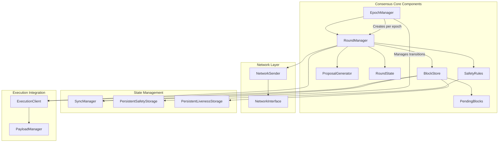
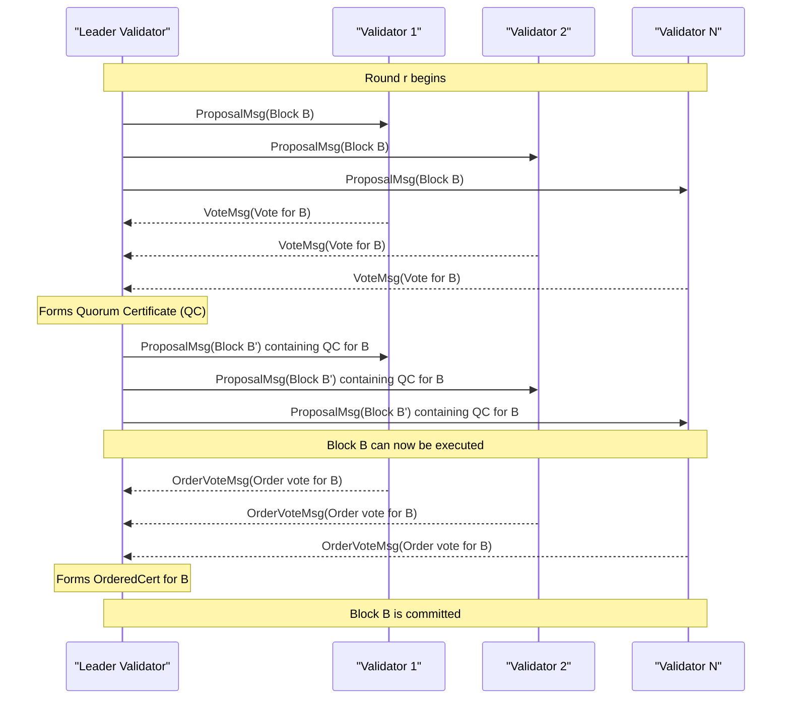
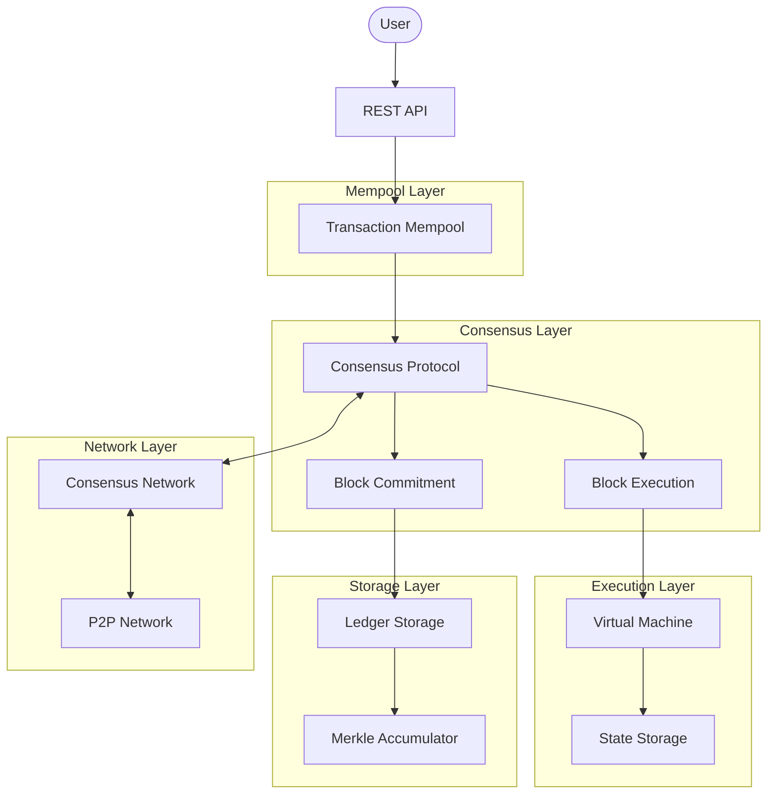

# Consensus Protocol

Relevant source files

The following files were used as context for generating this wiki page:

- [aptos-node/src/network.rs](https://github.com/aptos-labs/aptos-core/blob/b9f89a19/aptos-node/src/network.rs)
- [config/src/config/consensus_config.rs](https://github.com/aptos-labs/aptos-core/blob/b9f89a19/config/src/config/consensus_config.rs)
- [consensus/consensus-types/src/block_retrieval.rs](https://github.com/aptos-labs/aptos-core/blob/b9f89a19/consensus/consensus-types/src/block_retrieval.rs)
- [consensus/consensus-types/src/lib.rs](https://github.com/aptos-labs/aptos-core/blob/b9f89a19/consensus/consensus-types/src/lib.rs)
- [consensus/consensus-types/src/order_vote.rs](https://github.com/aptos-labs/aptos-core/blob/b9f89a19/consensus/consensus-types/src/order_vote.rs)
- [consensus/consensus-types/src/quorum_cert.rs](https://github.com/aptos-labs/aptos-core/blob/b9f89a19/consensus/consensus-types/src/quorum_cert.rs)
- [consensus/consensus-types/src/sync_info.rs](https://github.com/aptos-labs/aptos-core/blob/b9f89a19/consensus/consensus-types/src/sync_info.rs)
- [consensus/consensus-types/src/timeout_2chain.rs](https://github.com/aptos-labs/aptos-core/blob/b9f89a19/consensus/consensus-types/src/timeout_2chain.rs)
- [consensus/consensus-types/src/vote.rs](https://github.com/aptos-labs/aptos-core/blob/b9f89a19/consensus/consensus-types/src/vote.rs)
- [consensus/consensus-types/src/wrapped_ledger_info.rs](https://github.com/aptos-labs/aptos-core/blob/b9f89a19/consensus/consensus-types/src/wrapped_ledger_info.rs)
- [consensus/src/block_storage/block_store.rs](https://github.com/aptos-labs/aptos-core/blob/b9f89a19/consensus/src/block_storage/block_store.rs)
- [consensus/src/block_storage/block_store_test.rs](https://github.com/aptos-labs/aptos-core/blob/b9f89a19/consensus/src/block_storage/block_store_test.rs)
- [consensus/src/block_storage/block_tree.rs](https://github.com/aptos-labs/aptos-core/blob/b9f89a19/consensus/src/block_storage/block_tree.rs)
- [consensus/src/block_storage/sync_manager.rs](https://github.com/aptos-labs/aptos-core/blob/b9f89a19/consensus/src/block_storage/sync_manager.rs)
- [consensus/src/counters.rs](https://github.com/aptos-labs/aptos-core/blob/b9f89a19/consensus/src/counters.rs)
- [consensus/src/epoch_manager.rs](https://github.com/aptos-labs/aptos-core/blob/b9f89a19/consensus/src/epoch_manager.rs)
- [consensus/src/liveness/proposal_generator.rs](https://github.com/aptos-labs/aptos-core/blob/b9f89a19/consensus/src/liveness/proposal_generator.rs)
- [consensus/src/liveness/proposal_generator_test.rs](https://github.com/aptos-labs/aptos-core/blob/b9f89a19/consensus/src/liveness/proposal_generator_test.rs)
- [consensus/src/liveness/round_state.rs](https://github.com/aptos-labs/aptos-core/blob/b9f89a19/consensus/src/liveness/round_state.rs)
- [consensus/src/liveness/round_state_test.rs](https://github.com/aptos-labs/aptos-core/blob/b9f89a19/consensus/src/liveness/round_state_test.rs)
- [consensus/src/liveness/unequivocal_proposer_election.rs](https://github.com/aptos-labs/aptos-core/blob/b9f89a19/consensus/src/liveness/unequivocal_proposer_election.rs)
- [consensus/src/network.rs](https://github.com/aptos-labs/aptos-core/blob/b9f89a19/consensus/src/network.rs)
- [consensus/src/network_interface.rs](https://github.com/aptos-labs/aptos-core/blob/b9f89a19/consensus/src/network_interface.rs)
- [consensus/src/network_tests.rs](https://github.com/aptos-labs/aptos-core/blob/b9f89a19/consensus/src/network_tests.rs)
- [consensus/src/pending_order_votes.rs](https://github.com/aptos-labs/aptos-core/blob/b9f89a19/consensus/src/pending_order_votes.rs)
- [consensus/src/pending_votes.rs](https://github.com/aptos-labs/aptos-core/blob/b9f89a19/consensus/src/pending_votes.rs)
- [consensus/src/persistent_liveness_storage.rs](https://github.com/aptos-labs/aptos-core/blob/b9f89a19/consensus/src/persistent_liveness_storage.rs)
- [consensus/src/recovery_manager.rs](https://github.com/aptos-labs/aptos-core/blob/b9f89a19/consensus/src/recovery_manager.rs)
- [consensus/src/round_manager.rs](https://github.com/aptos-labs/aptos-core/blob/b9f89a19/consensus/src/round_manager.rs)
- [consensus/src/round_manager_fuzzing.rs](https://github.com/aptos-labs/aptos-core/blob/b9f89a19/consensus/src/round_manager_fuzzing.rs)
- [consensus/src/round_manager_test.rs](https://github.com/aptos-labs/aptos-core/blob/b9f89a19/consensus/src/round_manager_test.rs)
- [consensus/src/test_utils/mock_storage.rs](https://github.com/aptos-labs/aptos-core/blob/b9f89a19/consensus/src/test_utils/mock_storage.rs)
- [consensus/src/twins/twins_node.rs](https://github.com/aptos-labs/aptos-core/blob/b9f89a19/consensus/src/twins/twins_node.rs)
- [consensus/src/txn_notifier.rs](https://github.com/aptos-labs/aptos-core/blob/b9f89a19/consensus/src/txn_notifier.rs)
- [network/builder/src/builder.rs](https://github.com/aptos-labs/aptos-core/blob/b9f89a19/network/builder/src/builder.rs)
- [network/builder/src/dummy.rs](https://github.com/aptos-labs/aptos-core/blob/b9f89a19/network/builder/src/dummy.rs)
- [types/src/ledger_info.rs](https://github.com/aptos-labs/aptos-core/blob/b9f89a19/types/src/ledger_info.rs)
- [types/src/validator_verifier.rs](https://github.com/aptos-labs/aptos-core/blob/b9f89a19/types/src/validator_verifier.rs)

This document provides a technical overview of the consensus protocol used in the Aptos blockchain. It explains the architecture, components, and flow of the consensus mechanism that ensures agreement among validators on the state of the blockchain. For information about the execution system, see [Virtual Machine](#2.1), and for storage details, see [Storage System](#2.3).

## Consensus Protocol Overview

Aptos implements a Byzantine Fault Tolerance (BFT) consensus protocol that guarantees safety and liveness under partial synchrony, as long as more than 2/3 of validators are honest. The protocol is based on a leader-based round model with pipelined block processing, allowing for high throughput and low latency transaction processing.

The consensus protocol works through a pipeline of rounds where:
1. A leader proposes a block for a given round
2. Validators vote on proposals, forming quorum certificates (QCs)
3. Once a block has sufficient votes, it becomes certified
4. Blocks are executed and committed to the blockchain state

Sources: [consensus/src/round_manager.rs:242-324](https://github.com/aptos-labs/aptos-core/blob/b9f89a19/consensus/src/round_manager.rs#L242-L324), [consensus/src/epoch_manager.rs:131-179](https://github.com/aptos-labs/aptos-core/blob/b9f89a19/consensus/src/epoch_manager.rs#L131-L179)

## Architecture and Key Components

The diagram shows the core components of the Aptos consensus system and their relationships. The EpochManager creates and manages per-epoch RoundManagers, which coordinate the consensus process through the BlockStore, RoundState, and network communication.

Sources: [consensus/src/epoch_manager.rs:131-179](https://github.com/aptos-labs/aptos-core/blob/b9f89a19/consensus/src/epoch_manager.rs#L131-L179), [consensus/src/round_manager.rs:242-277](https://github.com/aptos-labs/aptos-core/blob/b9f89a19/consensus/src/round_manager.rs#L242-L277)

### Key Components

1. **EpochManager**: Coordinates the transition between epochs and creates per-epoch RoundManagers.
   
2. **RoundManager**: The heart of the consensus protocol that processes proposals, votes, and timeouts.
   
3. **BlockStore**: Maintains the tree of blocks, quorum certificates, and their dependencies.
   
4. **RoundState**: Tracks the state of the current round, including timeouts and pending votes.
   
5. **ProposalGenerator**: Creates new block proposals based on pending transactions.
   
6. **SafetyRules**: Enforces safety rules to prevent equivocation and double voting.
   
7. **NetworkSender**: Handles broadcasting of consensus messages between validators.

8. **SyncManager**: Synchronizes block data when a validator falls behind.

Sources: [consensus/src/epoch_manager.rs:131-179](https://github.com/aptos-labs/aptos-core/blob/b9f89a19/consensus/src/epoch_manager.rs#L131-L179), [consensus/src/round_manager.rs:242-277](https://github.com/aptos-labs/aptos-core/blob/b9f89a19/consensus/src/round_manager.rs#L242-L277), [consensus/src/block_storage/block_store.rs:77-96](https://github.com/aptos-labs/aptos-core/blob/b9f89a19/consensus/src/block_storage/block_store.rs#L77-L96)

## Consensus Protocol Flow

This diagram illustrates the message flow during a successful consensus round, showing how proposals, votes, and order votes lead to block commitment.

Sources: [consensus/src/round_manager.rs:354-597](https://github.com/aptos-labs/aptos-core/blob/b9f89a19/consensus/src/round_manager.rs#L354-L597), [consensus/src/network.rs:402-455](https://github.com/aptos-labs/aptos-core/blob/b9f89a19/consensus/src/network.rs#L402-L455)

### Round Progression

A new round begins either because a quorum certificate (QC) for the previous round is ready, or because a timeout occurred. The RoundState tracks the progression of rounds and manages timeout mechanisms.

1. **Initiating a New Round**:
   - When a QC is formed, a validator advances to a new round.
   - When a timeout occurs, validators exchange timeout messages to form a timeout certificate and advance rounds.

2. **Round Timeouts**:
   - The protocol uses increasing timeout values for consecutive rounds.
   - Timeout values follow an exponential backoff strategy.

Sources: [consensus/src/round_manager.rs:354-432](https://github.com/aptos-labs/aptos-core/blob/b9f89a19/consensus/src/round_manager.rs#L354-L432), [consensus/src/liveness/round_state.rs:1-140](https://github.com/aptos-labs/aptos-core/blob/b9f89a19/consensus/src/liveness/round_state.rs#L1-L140)

### Block Proposal and Voting

1. **Proposal Generation**:
   - The leader for the current round creates a block proposal.
   - The proposal includes pending transactions and a quorum certificate for the previous block.

2. **Vote Collection**:
   - Validators verify the proposal and vote if it's valid.
   - Votes are collected by the leader to form a quorum certificate.
   - A QC requires votes from validators representing more than 2/3 of the voting power.

Sources: [consensus/src/round_manager.rs:563-595](https://github.com/aptos-labs/aptos-core/blob/b9f89a19/consensus/src/round_manager.rs#L563-L595), [consensus/src/round_manager.rs:600-639](https://github.com/aptos-labs/aptos-core/blob/b9f89a19/consensus/src/round_manager.rs#L600-L639)

### Block Execution and Commitment

1. **Block Certification and Execution**:
   - When a block receives a QC, it becomes certified.
   - Certified blocks are executed by the execution module.

2. **OrderVotes and Commitment**:
   - After execution, validators may send OrderVotes for a block.
   - Once enough OrderVotes are collected, an OrderCertificate is formed.
   - A block with an OrderCertificate is considered committed.

3. **Pipelined Execution**:
   - Aptos uses a pipelined approach where blocks can be proposed and certified while previous blocks are still being executed.

Sources: [consensus/src/block_storage/block_store.rs:295-327](https://github.com/aptos-labs/aptos-core/blob/b9f89a19/consensus/src/block_storage/block_store.rs#L295-L327), [consensus/src/block_storage/sync_manager.rs:186-207](https://github.com/aptos-labs/aptos-core/blob/b9f89a19/consensus/src/block_storage/sync_manager.rs#L186-L207)

## Advanced Features

### Chain Health Management

Aptos implements sophisticated chain health monitoring and management through:

1. **Chain Health Backoff**:
   - The system monitors validator participation and adjusts block sizes and proposal delays accordingly.
   - If participation falls below configured thresholds, backoff mechanisms activate to improve chain health.

2. **Pipeline Backpressure**:
   - Monitors the backlog of pending blocks in the execution pipeline.
   - If latency increases, reduces block sizes and introduces proposal delays.

3. **Execution Backpressure**:
   - Calibrates block sizes based on execution time metrics to prevent overloading.
   - Automatically adapts to changing execution conditions.

Sources: [consensus/src/liveness/proposal_generator.rs:51-192](https://github.com/aptos-labs/aptos-core/blob/b9f89a19/consensus/src/liveness/proposal_generator.rs#L51-L192), [config/src/config/consensus_config.rs:152-171](https://github.com/aptos-labs/aptos-core/blob/b9f89a19/config/src/config/consensus_config.rs#L152-L171), [config/src/config/consensus_config.rs:242-342](https://github.com/aptos-labs/aptos-core/blob/b9f89a19/config/src/config/consensus_config.rs#L242-L342)

### Epoch Management

Epochs provide a mechanism for updating validator sets and consensus parameters:

1. **Epoch Transitions**:
   - An epoch change occurs when a specific ledger info is committed.
   - During epoch transitions, the validator set may change.

2. **Reconfiguration**:
   - The EpochManager handles reconfiguration events.
   - Reconfiguration preserves safety across epoch boundaries.

3. **Proposer Election Strategies**:
   - Aptos supports multiple proposer election strategies, including:
     - Round Robin (RotatingProposer)
     - Leader Reputation based on voting history
     - Fixed proposer for specific rounds

Sources: [consensus/src/epoch_manager.rs:533-558](https://github.com/aptos-labs/aptos-core/blob/b9f89a19/consensus/src/epoch_manager.rs#L533-L558), [consensus/src/epoch_manager.rs:275-396](https://github.com/aptos-labs/aptos-core/blob/b9f89a19/consensus/src/epoch_manager.rs#L275-L396)

## Block Structure and Certification

```mermaid
graph TD
    subgraph "Block Chain Structure"
        GenesisBlock["Genesis Block"] --> BlockA["Block A (Round 1)"]
        BlockA --> BlockB["Block B (Round 2)"]
        BlockB --> BlockC["Block C (Round 3)"]
        BlockA -.-> ForkBlockX["Fork Block X (Round 2)"]
        ForkBlockX -.-> ForkBlockY["Fork Block Y (Round 3)"]
    end
    
    subgraph "Block Components"
        Block["Block"] --> QC["Quorum Certificate"]
        Block --> Payload["Transaction Payload"]
        Block --> Metadata["Block Metadata"]
        QC --> CertifiedBlockInfo["Certified Block Info"]
        QC --> Signatures["Validator Signatures"]
    end
    
    subgraph "Certification Flow"
        ProposalB["Proposal for Block B"] --> VotesForB["Votes for Block B"]
        VotesForB -->|"2f+1 votes"| QCforB["QC for Block B"]
        QCforB --> ProposalC["Proposal for Block C"]
        ProposalC --> VotesForC["Votes for Block C"]
        VotesForC -->|"2f+1 votes"| QCforC["QC for Block C"]
        QCforC --> CommitBlockA["Commit Block A"]
    end
```

This diagram illustrates the block structure and certification flow in the Aptos consensus protocol, showing how blocks form a chain, the components of a block, and how votes lead to quorum certificates and block commitment.

Sources: [consensus/src/block_storage/block_store.rs:61-77](https://github.com/aptos-labs/aptos-core/blob/b9f89a19/consensus/src/block_storage/block_store.rs#L61-L77), [consensus/consensus-types/src/quorum_cert.rs](https://github.com/aptos-labs/aptos-core/blob/b9f89a19/consensus/consensus-types/src/quorum_cert.rs)

### Block and Quorum Certificate Structure

1. **Block Structure**:
   - Contains a quorum certificate for the parent block
   - Includes a batch of transactions (payload)
   - Has metadata like round number, author, timestamp, etc.

2. **Quorum Certificate (QC)**:
   - Certifies a specific block by its ID
   - Contains signatures from validators
   - Includes the certified block's information (round, id, executed state, etc.)

3. **Block Tree**:
   - Blocks form a tree structure with potential forks
   - The highest quorum certificate determines the preferred branch

Sources: [consensus/src/block_storage/block_store.rs:61-77](https://github.com/aptos-labs/aptos-core/blob/b9f89a19/consensus/src/block_storage/block_store.rs#L61-L77), [consensus/consensus-types/src/quorum_cert.rs](https://github.com/aptos-labs/aptos-core/blob/b9f89a19/consensus/consensus-types/src/quorum_cert.rs)

### Voting and Certification Process

1. **Proposal Verification**:
   - Validators verify proposals for correctness and validity
   - Check that the proposal extends the highest known QC

2. **Vote Generation**:
   - Validators create signed votes for valid proposals
   - Votes include the ledger info the validator would like to commit

3. **QC Formation**:
   - When enough votes are collected (more than 2/3 of voting power), a QC is formed
   - The QC is included in the next block proposal

4. **OrderVotes and Commitment**:
   - After execution, validators send OrderVotes
   - OrderVotes aggregate into an OrderCertificate
   - Blocks with OrderCertificates are committed

Sources: [consensus/src/round_manager.rs:720-759](https://github.com/aptos-labs/aptos-core/blob/b9f89a19/consensus/src/round_manager.rs#L720-L759), [consensus/src/pending_votes.rs:33-49](https://github.com/aptos-labs/aptos-core/blob/b9f89a19/consensus/src/pending_votes.rs#L33-L49)

## Network Communication

The consensus protocol relies on several types of network messages:

| Message Type | Purpose | Direction |
|--------------|---------|-----------|
| ProposalMsg | Contains a new block proposal | Leader → All Validators |
| VoteMsg | Vote for a proposed block | Validator → Leader (or broadcast) |
| SyncInfo | Contains QCs to help synchronize | Any → Any |
| BlockRetrievalRequest | Request blocks from peers | Lagging validator → Up-to-date validator |
| OrderVoteMsg | Vote for block ordering after execution | Validator → Leader (or broadcast) |
| RoundTimeoutMsg | Signals timeout for the current round | Validator → All Validators |

The NetworkSender component handles all consensus message communication, providing methods for:
- Broadcasting messages to all validators
- Sending messages to specific validators
- Retrieving blocks from peers
- Sending RPC requests

Sources: [consensus/src/network.rs:214-602](https://github.com/aptos-labs/aptos-core/blob/b9f89a19/consensus/src/network.rs#L214-L602), [consensus/src/network_interface.rs:36-122](https://github.com/aptos-labs/aptos-core/blob/b9f89a19/consensus/src/network_interface.rs#L36-L122)

## Timeout Handling and Recovery

### Timeout Mechanism

1. **Round Timeouts**:
   - If a round doesn't progress within the expected time, a timeout occurs
   - Timeouts use exponential backoff to prevent excessive timeout events

2. **Timeout Certificates**:
   - Validators exchange timeout votes
   - When enough timeout votes are collected, a timeout certificate (TC) is formed
   - A TC allows advancing to the next round even without a QC

Sources: [consensus/src/round_manager.rs:769-827](https://github.com/aptos-labs/aptos-core/blob/b9f89a19/consensus/src/round_manager.rs#L769-L827), [consensus/src/liveness/round_state.rs:141-233](https://github.com/aptos-labs/aptos-core/blob/b9f89a19/consensus/src/liveness/round_state.rs#L141-L233)

### Recovery and Synchronization

1. **Block Synchronization**:
   - Validators that fall behind can request blocks from peers
   - The SyncManager handles retrieving and validating missing blocks

2. **Fast Forward Sync**:
   - If a validator is significantly behind, it can perform a fast-forward sync
   - This involves getting a recent QC and retrieving the block chain leading to it

3. **State Synchronization**:
   - In extreme cases, validators may need to sync the entire state
   - This is handled by a separate state synchronization system

Sources: [consensus/src/block_storage/sync_manager.rs:243-376](https://github.com/aptos-labs/aptos-core/blob/b9f89a19/consensus/src/block_storage/sync_manager.rs#L243-L376), [consensus/src/block_storage/block_store.rs:654-713](https://github.com/aptos-labs/aptos-core/blob/b9f89a19/consensus/src/block_storage/block_store.rs#L654-L713)

## Configuration and Performance Tuning

The consensus protocol is highly configurable through the ConsensusConfig structure:

| Parameter | Description | Default |
|-----------|-------------|---------|
| round_initial_timeout_ms | Initial timeout for rounds | 1500ms |
| round_timeout_backoff_exponent_base | Base for timeout backoff | 1.2 |
| max_sending_block_txns | Maximum transactions in a block proposal | 7000 |
| max_sending_block_bytes | Maximum block size in bytes | 3MB |
| max_pruned_blocks_in_mem | Maximum number of pruned blocks kept in memory | 100 |
| vote_back_pressure_limit | Maximum pending rounds before vote backpressure | 7 |
| pipeline_backpressure | Settings for pipeline backpressure | Various thresholds |
| chain_health_backoff | Settings for chain health backoff | Various thresholds |

These parameters can be tuned based on network conditions, hardware capabilities, and desired performance characteristics.

Sources: [config/src/config/consensus_config.rs:28-97](https://github.com/aptos-labs/aptos-core/blob/b9f89a19/config/src/config/consensus_config.rs#L28-L97), [config/src/config/consensus_config.rs:183-365](https://github.com/aptos-labs/aptos-core/blob/b9f89a19/config/src/config/consensus_config.rs#L183-L365)

## Handling Network Partitions and Byzantine Faults

The protocol is designed to handle various fault scenarios:

1. **Network Partitions**:
   - When the network is partitioned, no validator can form a QC
   - The protocol falls back to timeout certificates to make progress
   - Once the partition heals, normal operation resumes

2. **Byzantine Validators**:
   - The protocol tolerates up to f Byzantine validators where 3f+1 ≤ n
   - Byzantine behavior is detected through validation of proposals and votes
   - Safety is guaranteed as long as the Byzantine threshold is not exceeded

3. **Equivocation Handling**:
   - Safety rules prevent honest validators from equivocating
   - If a Byzantine validator equivocates, their conflicting votes are detected

Sources: [consensus/src/round_manager.rs:769-827](https://github.com/aptos-labs/aptos-core/blob/b9f89a19/consensus/src/round_manager.rs#L769-L827), [consensus/src/pending_votes.rs:33-49](https://github.com/aptos-labs/aptos-core/blob/b9f89a19/consensus/src/pending_votes.rs#L33-L49)

## Consensus Protocol in the Broader System

This diagram shows how the consensus protocol interacts with other components of the Aptos system, including execution, storage, networking, and mempool.

Sources: [consensus/src/network.rs:214-252](https://github.com/aptos-labs/aptos-core/blob/b9f89a19/consensus/src/network.rs#L214-L252), [consensus/src/epoch_manager.rs:131-179](https://github.com/aptos-labs/aptos-core/blob/b9f89a19/consensus/src/epoch_manager.rs#L131-L179)

The consensus protocol is a critical component in the Aptos blockchain system:

1. **Transaction Flow**:
   - Transactions flow from users through the REST API to the mempool
   - The consensus protocol selects and orders transactions from the mempool
   - Ordered transactions are executed by the VM and committed to the state

2. **Execution Integration**:
   - The consensus protocol coordinates with the execution layer to execute blocks
   - Execution results feed back into the consensus process for commitment

3. **State Commitment**:
   - After execution, block results are committed to the ledger
   - The Merkle accumulator maintains a verifiable history of all transactions

4. **Epoch Management**:
   - The consensus protocol manages epoch transitions
   - Epoch changes can update validator sets, consensus parameters, and other system configurations