# Storage System

Relevant source files

The following files were used as context for generating this wiki page:

- [config/src/config/storage_config.rs](https://github.com/aptos-labs/aptos-core/blob/b9f89a19/config/src/config/storage_config.rs)
- [storage/accumulator/src/lib.rs](https://github.com/aptos-labs/aptos-core/blob/b9f89a19/storage/accumulator/src/lib.rs)
- [storage/aptosdb/src/db_debugger/truncate/mod.rs](https://github.com/aptos-labs/aptos-core/blob/b9f89a19/storage/aptosdb/src/db_debugger/truncate/mod.rs)
- [storage/aptosdb/src/lib.rs](https://github.com/aptos-labs/aptos-core/blob/b9f89a19/storage/aptosdb/src/lib.rs)
- [storage/aptosdb/src/pruner/db_pruner.rs](https://github.com/aptos-labs/aptos-core/blob/b9f89a19/storage/aptosdb/src/pruner/db_pruner.rs)
- [storage/aptosdb/src/pruner/mod.rs](https://github.com/aptos-labs/aptos-core/blob/b9f89a19/storage/aptosdb/src/pruner/mod.rs)
- [storage/aptosdb/src/pruner/pruner_manager.rs](https://github.com/aptos-labs/aptos-core/blob/b9f89a19/storage/aptosdb/src/pruner/pruner_manager.rs)
- [storage/aptosdb/src/schema/db_metadata/mod.rs](https://github.com/aptos-labs/aptos-core/blob/b9f89a19/storage/aptosdb/src/schema/db_metadata/mod.rs)
- [storage/aptosdb/src/state_kv_db.rs](https://github.com/aptos-labs/aptos-core/blob/b9f89a19/storage/aptosdb/src/state_kv_db.rs)
- [storage/aptosdb/src/state_merkle_db.rs](https://github.com/aptos-labs/aptos-core/blob/b9f89a19/storage/aptosdb/src/state_merkle_db.rs)
- [storage/aptosdb/src/state_restore/mod.rs](https://github.com/aptos-labs/aptos-core/blob/b9f89a19/storage/aptosdb/src/state_restore/mod.rs)
- [storage/aptosdb/src/state_restore/restore_test.rs](https://github.com/aptos-labs/aptos-core/blob/b9f89a19/storage/aptosdb/src/state_restore/restore_test.rs)
- [storage/aptosdb/src/state_store/buffered_state.rs](https://github.com/aptos-labs/aptos-core/blob/b9f89a19/storage/aptosdb/src/state_store/buffered_state.rs)
- [storage/aptosdb/src/state_store/mod.rs](https://github.com/aptos-labs/aptos-core/blob/b9f89a19/storage/aptosdb/src/state_store/mod.rs)
- [storage/aptosdb/src/state_store/state_merkle_batch_committer.rs](https://github.com/aptos-labs/aptos-core/blob/b9f89a19/storage/aptosdb/src/state_store/state_merkle_batch_committer.rs)
- [storage/aptosdb/src/state_store/state_snapshot_committer.rs](https://github.com/aptos-labs/aptos-core/blob/b9f89a19/storage/aptosdb/src/state_store/state_snapshot_committer.rs)
- [storage/aptosdb/src/utils/truncation_helper.rs](https://github.com/aptos-labs/aptos-core/blob/b9f89a19/storage/aptosdb/src/utils/truncation_helper.rs)
- [storage/backup/backup-cli/src/backup_types/state_snapshot/restore.rs](https://github.com/aptos-labs/aptos-core/blob/b9f89a19/storage/backup/backup-cli/src/backup_types/state_snapshot/restore.rs)
- [storage/jellyfish-merkle/Cargo.toml](https://github.com/aptos-labs/aptos-core/blob/b9f89a19/storage/jellyfish-merkle/Cargo.toml)
- [storage/jellyfish-merkle/src/jellyfish_merkle_test.rs](https://github.com/aptos-labs/aptos-core/blob/b9f89a19/storage/jellyfish-merkle/src/jellyfish_merkle_test.rs)
- [storage/jellyfish-merkle/src/lib.rs](https://github.com/aptos-labs/aptos-core/blob/b9f89a19/storage/jellyfish-merkle/src/lib.rs)
- [storage/jellyfish-merkle/src/metrics.rs](https://github.com/aptos-labs/aptos-core/blob/b9f89a19/storage/jellyfish-merkle/src/metrics.rs)
- [storage/jellyfish-merkle/src/mock_tree_store.rs](https://github.com/aptos-labs/aptos-core/blob/b9f89a19/storage/jellyfish-merkle/src/mock_tree_store.rs)
- [storage/jellyfish-merkle/src/node_type/mod.rs](https://github.com/aptos-labs/aptos-core/blob/b9f89a19/storage/jellyfish-merkle/src/node_type/mod.rs)
- [storage/jellyfish-merkle/src/node_type/node_type_test.rs](https://github.com/aptos-labs/aptos-core/blob/b9f89a19/storage/jellyfish-merkle/src/node_type/node_type_test.rs)
- [storage/jellyfish-merkle/src/restore/mod.rs](https://github.com/aptos-labs/aptos-core/blob/b9f89a19/storage/jellyfish-merkle/src/restore/mod.rs)
- [storage/storage-interface/src/lib.rs](https://github.com/aptos-labs/aptos-core/blob/b9f89a19/storage/storage-interface/src/lib.rs)
- [types/src/nibble/nibble_path/mod.rs](https://github.com/aptos-labs/aptos-core/blob/b9f89a19/types/src/nibble/nibble_path/mod.rs)
- [types/src/proof/accumulator/mock.rs](https://github.com/aptos-labs/aptos-core/blob/b9f89a19/types/src/proof/accumulator/mock.rs)
- [types/src/proof/position/mod.rs](https://github.com/aptos-labs/aptos-core/blob/b9f89a19/types/src/proof/position/mod.rs)

## Purpose and Scope

This document covers the storage system of the Aptos blockchain, which is responsible for persistently storing blockchain state, transactions, and other ledger data. The storage system is designed with a focus on modularity, performance, and reliability, featuring capabilities such as state representation via a Merkle tree, state versioning, pruning of old data, backup/restore functionality, and horizontal scaling through sharding.

For information about database indexing features, see the Indexer DB documentation.

## Architecture Overview

The Aptos storage system consists of several key components working together to provide a complete storage solution for the blockchain.

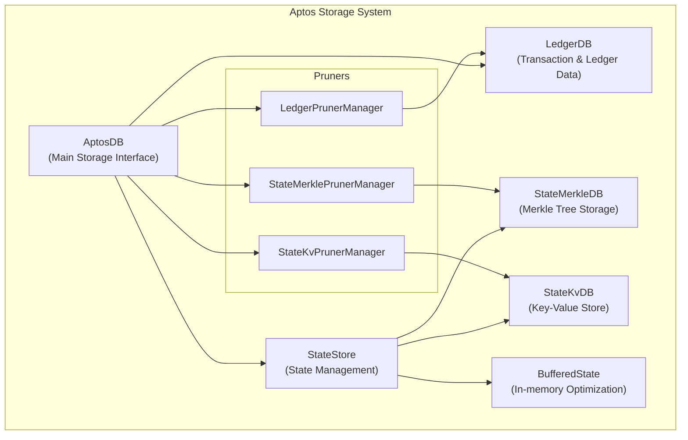

Sources:
- [storage/aptosdb/src/lib.rs](https://github.com/aptos-labs/aptos-core/blob/b9f89a19/storage/aptosdb/src/lib.rs)
- [storage/aptosdb/src/state_store/mod.rs](https://github.com/aptos-labs/aptos-core/blob/b9f89a19/storage/aptosdb/src/state_store/mod.rs)
- [storage/storage-interface/src/lib.rs](https://github.com/aptos-labs/aptos-core/blob/b9f89a19/storage/storage-interface/src/lib.rs)

## Core Components

### AptosDB

AptosDB is the main entry point to the storage system, implementing both `DbReader` and `DbWriter` interfaces. It coordinates between different database components and provides a unified interface for the rest of the system.

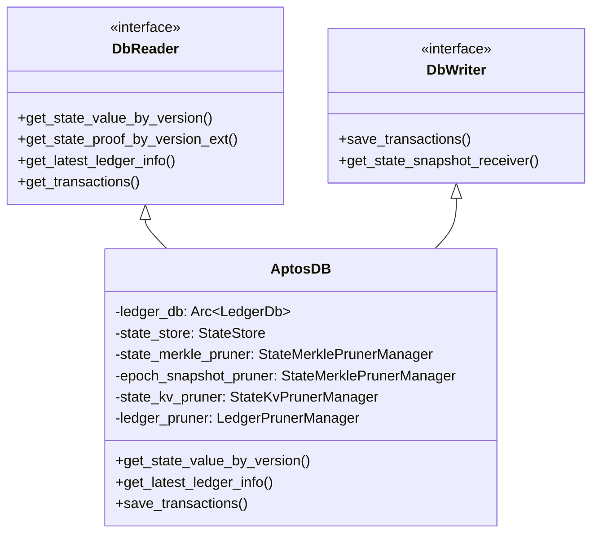

Sources:
- [storage/aptosdb/src/lib.rs](https://github.com/aptos-labs/aptos-core/blob/b9f89a19/storage/aptosdb/src/lib.rs)
- [storage/storage-interface/src/lib.rs:113-510](https://github.com/aptos-labs/aptos-core/blob/b9f89a19/storage/storage-interface/src/lib.rs#L113-L510)

### StateStore

StateStore manages the state of the blockchain, combining in-memory buffers with persistent storage to provide efficient access to state data.

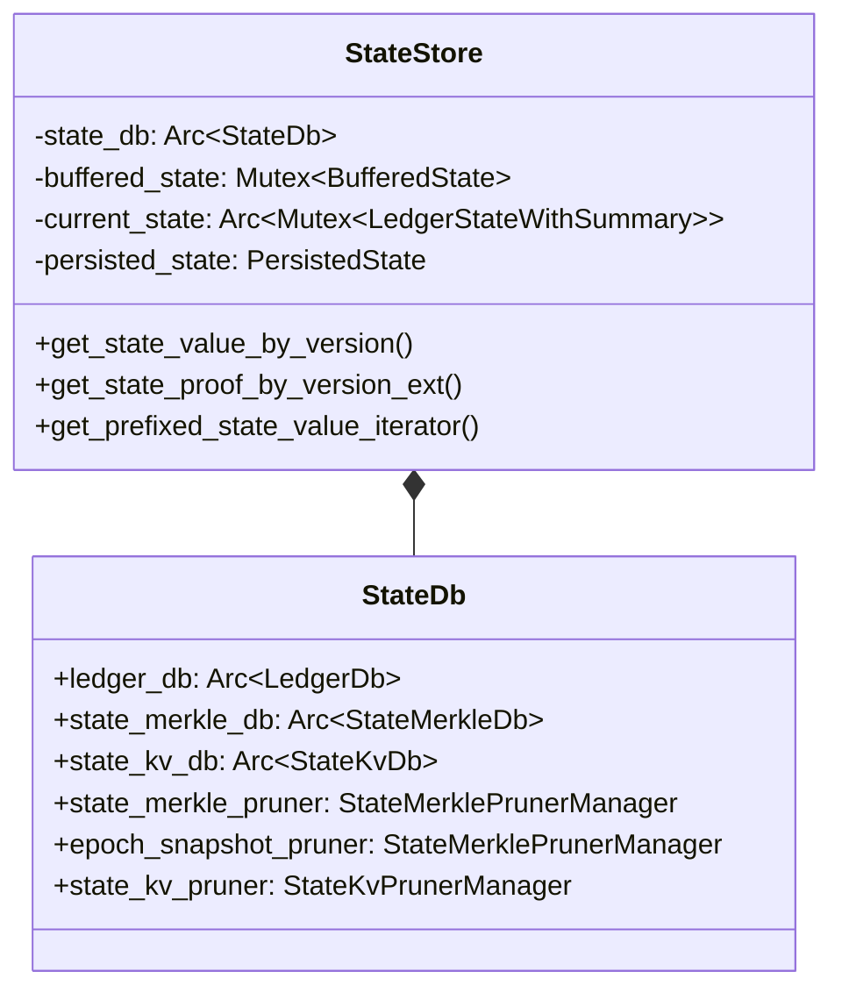

Sources:
- [storage/aptosdb/src/state_store/mod.rs:103-131](https://github.com/aptos-labs/aptos-core/blob/b9f89a19/storage/aptosdb/src/state_store/mod.rs#L103-L131)
- [storage/aptosdb/src/state_store/mod.rs:301-631](https://github.com/aptos-labs/aptos-core/blob/b9f89a19/storage/aptosdb/src/state_store/mod.rs#L301-L631)

### StateMerkleDB

StateMerkleDB stores the Jellyfish Merkle Tree that represents the state at different versions, enabling authentication of state values and efficient proof generation.

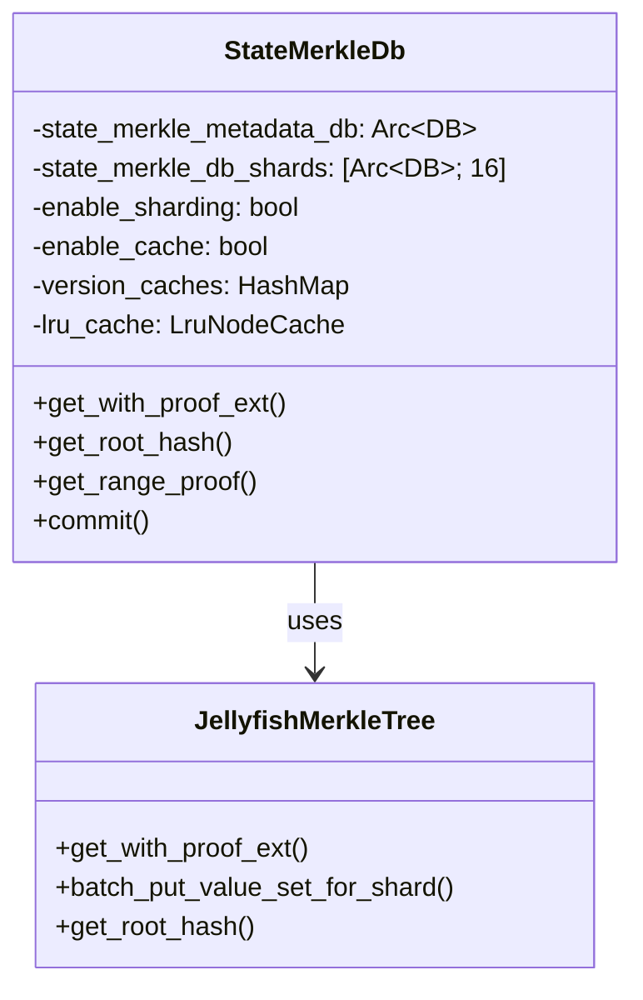

Sources:
- [storage/aptosdb/src/state_merkle_db.rs:58-120](https://github.com/aptos-labs/aptos-core/blob/b9f89a19/storage/aptosdb/src/state_merkle_db.rs#L58-L120)
- [storage/jellyfish-merkle/src/lib.rs:296-302](https://github.com/aptos-labs/aptos-core/blob/b9f89a19/storage/jellyfish-merkle/src/lib.rs#L296-L302)

### StateKvDB

StateKvDB stores the actual key-value pairs of the state, optimized for efficient reads and writes.

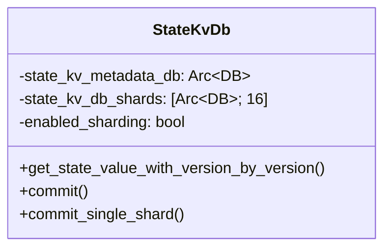

Sources:
- [storage/aptosdb/src/state_kv_db.rs:44-48](https://github.com/aptos-labs/aptos-core/blob/b9f89a19/storage/aptosdb/src/state_kv_db.rs#L44-L48)
- [storage/aptosdb/src/state_kv_db.rs:131-166](https://github.com/aptos-labs/aptos-core/blob/b9f89a19/storage/aptosdb/src/state_kv_db.rs#L131-L166)

## State Representation and Storage

### Jellyfish Merkle Tree

The Aptos storage system uses a specialized sparse Merkle tree implementation called the Jellyfish Merkle Tree to efficiently authenticate the state.

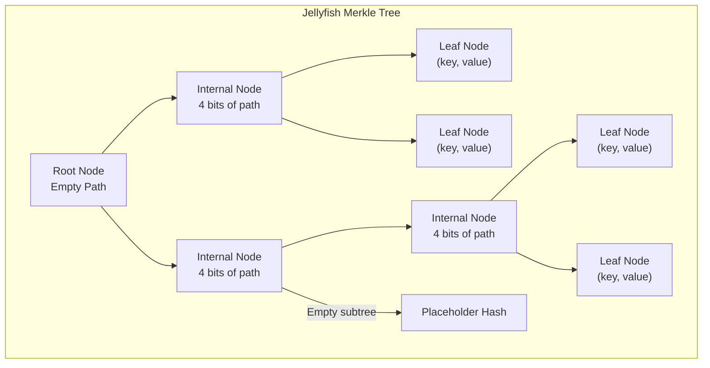

Key advantages of this implementation:
1. It compresses 4 levels of a binary Merkle tree into a single node (16 children maximum)
2. It eliminates empty subtrees by replacing them with a placeholder hash
3. It provides efficient proof generation for state verification

Sources:
- [storage/jellyfish-merkle/src/lib.rs:23-56](https://github.com/aptos-labs/aptos-core/blob/b9f89a19/storage/jellyfish-merkle/src/lib.rs#L23-L56)
- [storage/jellyfish-merkle/src/node_type/mod.rs](https://github.com/aptos-labs/aptos-core/blob/b9f89a19/storage/jellyfish-merkle/src/node_type/mod.rs)

### Node Types and Structure

The Jellyfish Merkle Tree consists of two main node types:

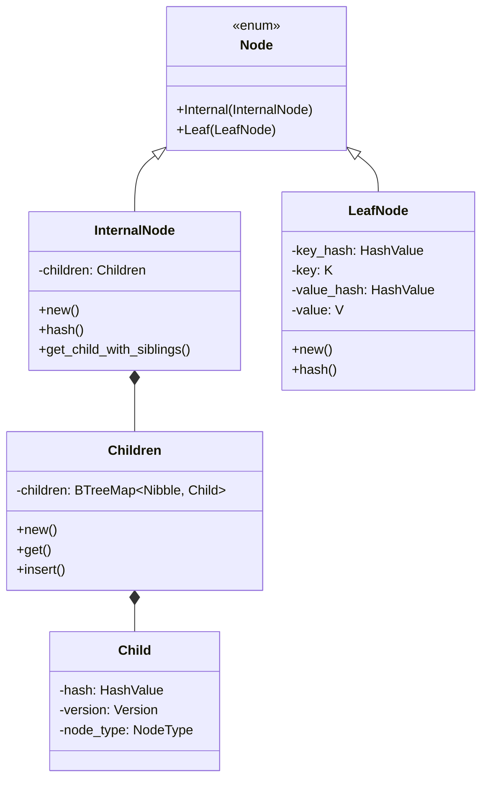

Sources:
- [storage/jellyfish-merkle/src/node_type/mod.rs](https://github.com/aptos-labs/aptos-core/blob/b9f89a19/storage/jellyfish-merkle/src/node_type/mod.rs)
- [storage/jellyfish-merkle/src/lib.rs:297-300](https://github.com/aptos-labs/aptos-core/blob/b9f89a19/storage/jellyfish-merkle/src/lib.rs#L297-L300)

### State Sharding for Scalability

The Aptos storage system supports sharding for both the Merkle tree and the key-value store, improving performance through parallelism.

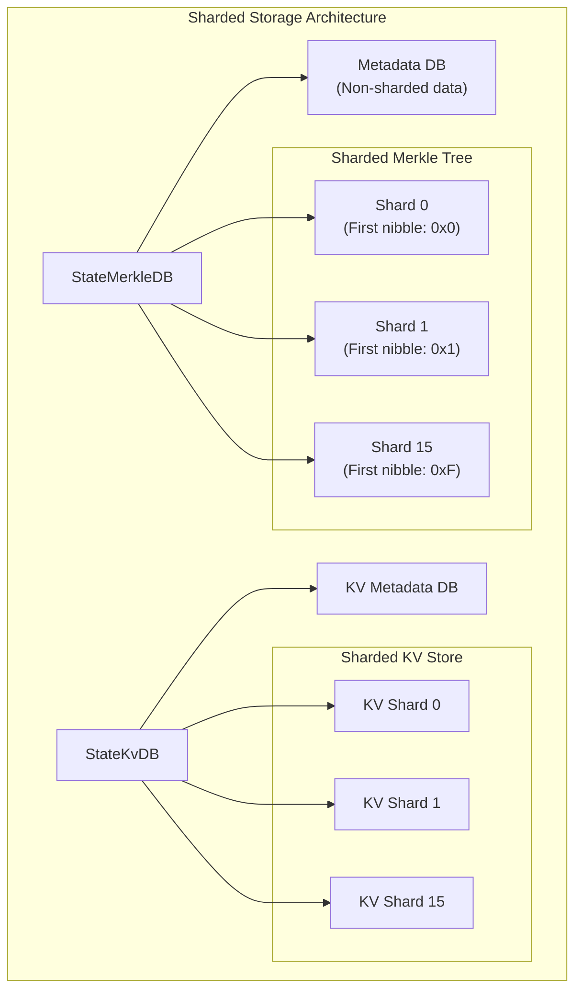

This architecture allows:
1. Parallel processing of operations across shards
2. Better disk I/O distribution
3. More efficient resource utilization

Sources:
- [storage/aptosdb/src/state_merkle_db.rs:66-107](https://github.com/aptos-labs/aptos-core/blob/b9f89a19/storage/aptosdb/src/state_merkle_db.rs#L66-L107)
- [storage/aptosdb/src/state_kv_db.rs:51-121](https://github.com/aptos-labs/aptos-core/blob/b9f89a19/storage/aptosdb/src/state_kv_db.rs#L51-L121)
- [config/src/config/storage_config.rs:154-169](https://github.com/aptos-labs/aptos-core/blob/b9f89a19/config/src/config/storage_config.rs#L154-L169)

## State Operations

### Reading State

The storage system provides methods for reading state at specific versions, with proof generation capabilities for verification.

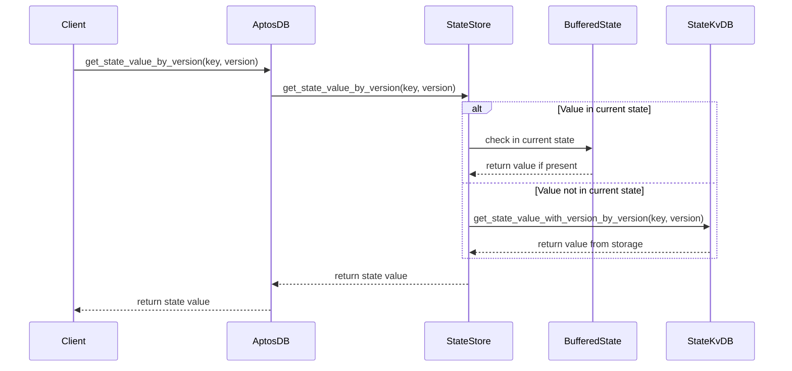

For proof-based reads, the system also interacts with the StateMerkleDB to generate proofs.

Sources:
- [storage/aptosdb/src/state_store/mod.rs:152-175](https://github.com/aptos-labs/aptos-core/blob/b9f89a19/storage/aptosdb/src/state_store/mod.rs#L152-L175)
- [storage/aptosdb/src/state_kv_db.rs:309-345](https://github.com/aptos-labs/aptos-core/blob/b9f89a19/storage/aptosdb/src/state_kv_db.rs#L309-L345)

### Committing State

State updates go through a multi-stage pipeline to optimize for both performance and durability:

```mermaid
flowchart TB
    subgraph "State Commit Pipeline"
        TxnExecution["Transaction Execution<br>Creates state updates"]
        
        subgraph "Buffered State"
            CurrentState["Current State<br>(In Memory)"]
            EstimateSize["Estimate Size<br>(num items)"]
            CheckThreshold["Check if threshold reached<br>or sync commit requested"]
        end
        
        subgraph "Async Commit Threads"
            StateSnapshotCommitter["StateSnapshotCommitter<br>Calculates state changes"]
            StateMerkleBatchCommitter["StateMerkleBatchCommitter<br>Prepares batches for DB"]
        end
        
        subgraph "Storage Writes"
            StateMerkleDBWrite["Write to StateMerkleDB"]
            StateKvDBWrite["Write to StateKvDB"]
            UpdateProgress["Update commit progress"]
        end
        
        TxnExecution --> CurrentState
        CurrentState --> EstimateSize
        EstimateSize --> CheckThreshold
        
        CheckThreshold -->|"If threshold reached"| StateSnapshotCommitter
        StateSnapshotCommitter --> StateMerkleBatchCommitter
        
        StateMerkleBatchCommitter --> StateMerkleDBWrite
        StateMerkleBatchCommitter --> StateKvDBWrite
        StateMerkleDBWrite --> UpdateProgress
        StateKvDBWrite --> UpdateProgress
    end
```

Sources:
- [storage/aptosdb/src/state_store/buffered_state.rs:96-179](https://github.com/aptos-labs/aptos-core/blob/b9f89a19/storage/aptosdb/src/state_store/buffered_state.rs#L96-L179)
- [storage/aptosdb/src/state_store/state_snapshot_committer.rs:80-206](https://github.com/aptos-labs/aptos-core/blob/b9f89a19/storage/aptosdb/src/state_store/state_snapshot_committer.rs#L80-L206)
- [storage/aptosdb/src/state_store/state_merkle_batch_committer.rs:45-107](https://github.com/aptos-labs/aptos-core/blob/b9f89a19/storage/aptosdb/src/state_store/state_merkle_batch_committer.rs#L45-L107)

### Pruning Old Data

The storage system includes pruning capabilities to remove old data and manage storage growth:

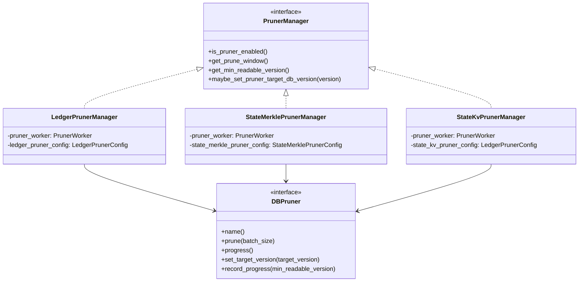

Sources:
- [storage/aptosdb/src/pruner/pruner_manager.rs:17-71](https://github.com/aptos-labs/aptos-core/blob/b9f89a19/storage/aptosdb/src/pruner/pruner_manager.rs#L17-L71)
- [storage/aptosdb/src/pruner/db_pruner.rs:9-40](https://github.com/aptos-labs/aptos-core/blob/b9f89a19/storage/aptosdb/src/pruner/db_pruner.rs#L9-L40)
- [storage/aptosdb/src/pruner/mod.rs:14-17](https://github.com/aptos-labs/aptos-core/blob/b9f89a19/storage/aptosdb/src/pruner/mod.rs#L14-L17)

## Performance Optimizations

### Buffered State

The `BufferedState` component optimizes performance by maintaining in-memory state and asynchronously committing changes to disk:

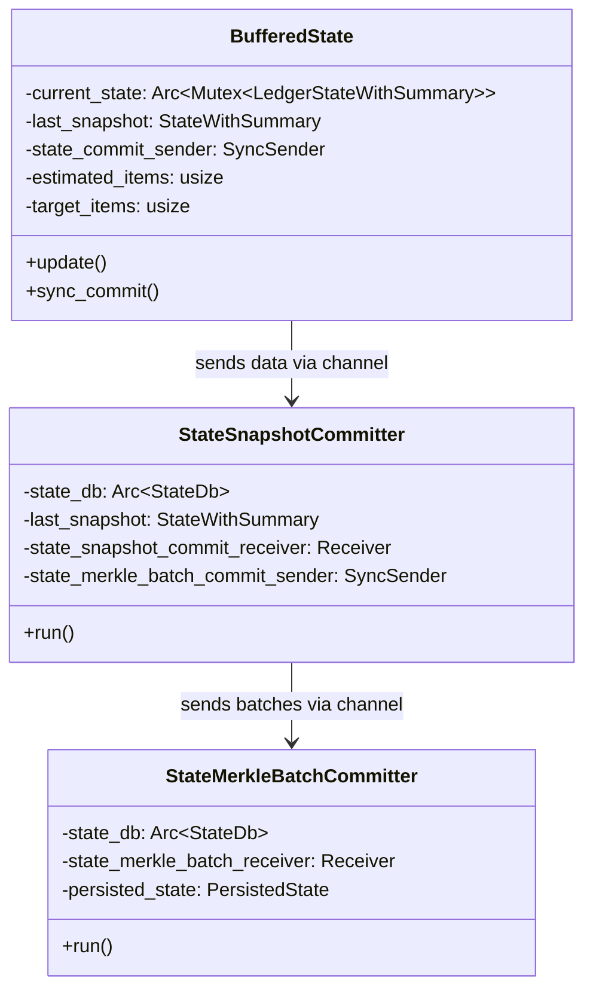

Key benefits:
1. Batches state updates for more efficient I/O
2. Performs Merkle tree updates asynchronously
3. Provides immediate responses to transaction execution

Sources:
- [storage/aptosdb/src/state_store/buffered_state.rs:33-201](https://github.com/aptos-labs/aptos-core/blob/b9f89a19/storage/aptosdb/src/state_store/buffered_state.rs#L33-L201)
- [storage/aptosdb/src/state_store/state_snapshot_committer.rs:34-209](https://github.com/aptos-labs/aptos-core/blob/b9f89a19/storage/aptosdb/src/state_store/state_snapshot_committer.rs#L34-L209)
- [storage/aptosdb/src/state_store/state_merkle_batch_committer.rs:20-133](https://github.com/aptos-labs/aptos-core/blob/b9f89a19/storage/aptosdb/src/state_store/state_merkle_batch_committer.rs#L20-L133)

### Storage Caching

The storage system employs various caching strategies to improve performance:

1. **Versioned Node Cache**: Caches recently used versions of the Merkle tree
2. **LRU Node Cache**: Caches frequently accessed nodes with an LRU eviction policy
3. **Buffered State**: Caches recent state updates in memory

Sources:
- [storage/aptosdb/src/state_merkle_db.rs:67-68](https://github.com/aptos-labs/aptos-core/blob/b9f89a19/storage/aptosdb/src/state_merkle_db.rs#L67-L68)
- [storage/aptosdb/src/lru_node_cache.rs](https://github.com/aptos-labs/aptos-core/blob/b9f89a19/storage/aptosdb/src/lru_node_cache.rs)
- [storage/aptosdb/src/versioned_node_cache.rs](https://github.com/aptos-labs/aptos-core/blob/b9f89a19/storage/aptosdb/src/versioned_node_cache.rs)

## State Backup and Recovery

### State Snapshots and Restore

The storage system supports creating snapshots of the state and restoring from them:

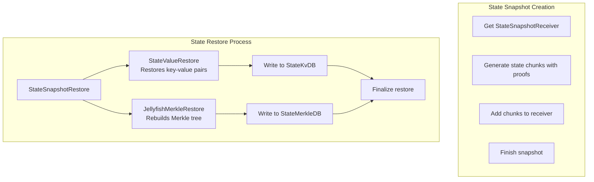

Sources:
- [storage/aptosdb/src/state_restore/mod.rs:47-299](https://github.com/aptos-labs/aptos-core/blob/b9f89a19/storage/aptosdb/src/state_restore/mod.rs#L47-L299)
- [storage/backup/backup-cli/src/backup_types/state_snapshot/restore.rs:97-254](https://github.com/aptos-labs/aptos-core/blob/b9f89a19/storage/backup/backup-cli/src/backup_types/state_snapshot/restore.rs#L97-L254)
- [storage/jellyfish-merkle/src/restore/mod.rs:126-630](https://github.com/aptos-labs/aptos-core/blob/b9f89a19/storage/jellyfish-merkle/src/restore/mod.rs#L126-L630)

### Database Recovery and Consistency

The storage system includes mechanisms to recover from failures and ensure cross-database consistency:

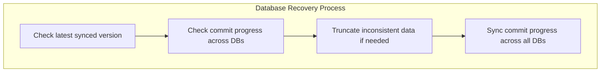

Sources:
- [storage/aptosdb/src/state_store/mod.rs:366-458](https://github.com/aptos-labs/aptos-core/blob/b9f89a19/storage/aptosdb/src/state_store/mod.rs#L366-L458)
- [storage/aptosdb/src/utils/truncation_helper.rs:52-566](https://github.com/aptos-labs/aptos-core/blob/b9f89a19/storage/aptosdb/src/utils/truncation_helper.rs#L52-L566)
- [storage/aptosdb/src/db_debugger/truncate/mod.rs:47-155](https://github.com/aptos-labs/aptos-core/blob/b9f89a19/storage/aptosdb/src/db_debugger/truncate/mod.rs#L47-L155)

## Configuration

The storage system is configured through `StorageConfig`, which allows customization of:

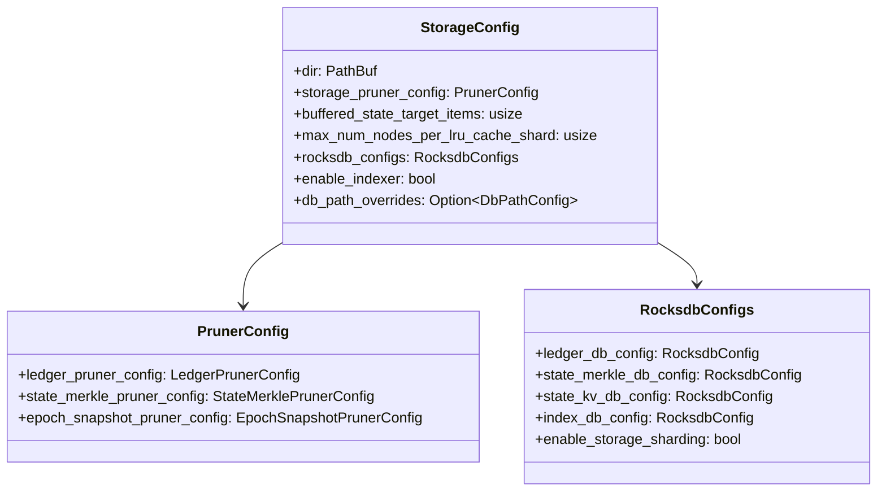

Key configuration options:
1. **Pruning Configuration**: Controls how much historical data is retained
2. **RocksDB Configuration**: Tunes underlying RocksDB instances
3. **Sharding Configuration**: Enables/disables sharding and configures shard paths
4. **Buffering Configuration**: Controls buffering behavior for performance tuning

Sources:
- [config/src/config/storage_config.rs:173-191](https://github.com/aptos-labs/aptos-core/blob/b9f89a19/config/src/config/storage_config.rs#L173-L191)
- [config/src/config/storage_config.rs:229-335](https://github.com/aptos-labs/aptos-core/blob/b9f89a19/config/src/config/storage_config.rs#L229-L335)