# Transaction System

<details>
<summary>Relevant source files</summary>

The following files were used as context for generating this wiki page:

- [api/src/tests/converter_test.rs](https://github.com/aptos-labs/aptos-core/blob/b9f89a19/api/src/tests/converter_test.rs)
- [api/src/view_function.rs](https://github.com/aptos-labs/aptos-core/blob/b9f89a19/api/src/view_function.rs)
- [api/types/src/convert.rs](https://github.com/aptos-labs/aptos-core/blob/b9f89a19/api/types/src/convert.rs)
- [api/types/src/lib.rs](https://github.com/aptos-labs/aptos-core/blob/b9f89a19/api/types/src/lib.rs)
- [api/types/src/move_types.rs](https://github.com/aptos-labs/aptos-core/blob/b9f89a19/api/types/src/move_types.rs)
- [api/types/src/transaction.rs](https://github.com/aptos-labs/aptos-core/blob/b9f89a19/api/types/src/transaction.rs)
- [api/types/src/wrappers.rs](https://github.com/aptos-labs/aptos-core/blob/b9f89a19/api/types/src/wrappers.rs)
- [aptos-move/aptos-resource-viewer/src/lib.rs](https://github.com/aptos-labs/aptos-core/blob/b9f89a19/aptos-move/aptos-resource-viewer/src/lib.rs)
- [execution/executor-test-helpers/Cargo.toml](https://github.com/aptos-labs/aptos-core/blob/b9f89a19/execution/executor-test-helpers/Cargo.toml)
- [execution/executor-test-helpers/src/integration_test_impl.rs](https://github.com/aptos-labs/aptos-core/blob/b9f89a19/execution/executor-test-helpers/src/integration_test_impl.rs)
- [execution/executor/Cargo.toml](https://github.com/aptos-labs/aptos-core/blob/b9f89a19/execution/executor/Cargo.toml)
- [execution/executor/src/tests/chunk_executor_tests.rs](https://github.com/aptos-labs/aptos-core/blob/b9f89a19/execution/executor/src/tests/chunk_executor_tests.rs)
- [execution/executor/tests/db_bootstrapper_test.rs](https://github.com/aptos-labs/aptos-core/blob/b9f89a19/execution/executor/tests/db_bootstrapper_test.rs)
- [execution/executor/tests/storage_integration_test.rs](https://github.com/aptos-labs/aptos-core/blob/b9f89a19/execution/executor/tests/storage_integration_test.rs)
- [testsuite/generate-format/src/api.rs](https://github.com/aptos-labs/aptos-core/blob/b9f89a19/testsuite/generate-format/src/api.rs)
- [testsuite/generate-format/src/aptos.rs](https://github.com/aptos-labs/aptos-core/blob/b9f89a19/testsuite/generate-format/src/aptos.rs)
- [testsuite/generate-format/src/consensus.rs](https://github.com/aptos-labs/aptos-core/blob/b9f89a19/testsuite/generate-format/src/consensus.rs)
- [testsuite/generate-format/tests/staged/api.yaml](https://github.com/aptos-labs/aptos-core/blob/b9f89a19/testsuite/generate-format/tests/staged/api.yaml)
- [testsuite/generate-format/tests/staged/aptos.yaml](https://github.com/aptos-labs/aptos-core/blob/b9f89a19/testsuite/generate-format/tests/staged/aptos.yaml)
- [testsuite/generate-format/tests/staged/consensus.yaml](https://github.com/aptos-labs/aptos-core/blob/b9f89a19/testsuite/generate-format/tests/staged/consensus.yaml)
- [third_party/move/move-model/bytecode/src/stackless_bytecode_generator.rs](https://github.com/aptos-labs/aptos-core/blob/b9f89a19/third_party/move/move-model/bytecode/src/stackless_bytecode_generator.rs)
- [third_party/move/move-vm/types/src/values/mod.rs](https://github.com/aptos-labs/aptos-core/blob/b9f89a19/third_party/move/move-vm/types/src/values/mod.rs)
- [third_party/move/tools/move-resource-viewer/src/fat_type.rs](https://github.com/aptos-labs/aptos-core/blob/b9f89a19/third_party/move/tools/move-resource-viewer/src/fat_type.rs)
- [third_party/move/tools/move-resource-viewer/src/lib.rs](https://github.com/aptos-labs/aptos-core/blob/b9f89a19/third_party/move/tools/move-resource-viewer/src/lib.rs)
- [third_party/move/tools/move-resource-viewer/src/limit.rs](https://github.com/aptos-labs/aptos-core/blob/b9f89a19/third_party/move/tools/move-resource-viewer/src/limit.rs)
- [types/src/account_address.rs](https://github.com/aptos-labs/aptos-core/blob/b9f89a19/types/src/account_address.rs)
- [types/src/proptest_types.rs](https://github.com/aptos-labs/aptos-core/blob/b9f89a19/types/src/proptest_types.rs)
- [types/src/transaction/authenticator.rs](https://github.com/aptos-labs/aptos-core/blob/b9f89a19/types/src/transaction/authenticator.rs)
- [types/src/transaction/mod.rs](https://github.com/aptos-labs/aptos-core/blob/b9f89a19/types/src/transaction/mod.rs)

</details>


The Aptos Transaction System manages the lifecycle of transactions from creation through execution and final storage on the blockchain. This document details the main transaction types, authentication mechanisms, and the full transaction flow in the Aptos blockchain.

For information about the Virtual Machine that executes transactions, see [Virtual Machine](#2.1). For information about the Storage System that persists transaction state, see [Storage System](#2.3).

## Transaction Types Overview

The Aptos blockchain supports multiple transaction types, each serving specific purposes in the ecosystem:

- **User Transactions**: Regular transactions submitted by users
- **Block Metadata Transactions**: Special transactions marking the beginning of each block
- **State Checkpoint Transactions**: Transactions that record checkpoints of the state
- **Genesis Transactions**: The initial transaction that bootstraps the blockchain
- **Block Epilogue Transactions**: Transactions that mark the end of a block
- **Validator Transactions**: Special transactions for validator operations

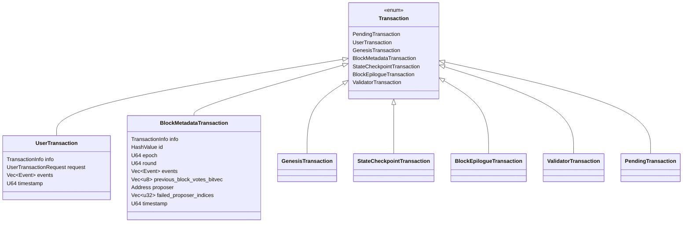

Sources: [types/src/transaction/mod.rs:187-264](https://github.com/aptos-labs/aptos-core/blob/b9f89a19/types/src/transaction/mod.rs#L187-L264). [api/types/src/transaction.rs:187-278](https://github.com/aptos-labs/aptos-core/blob/b9f89a19/api/types/src/transaction.rs#L187-L278)

## Transaction Data Structures

The transaction system uses several core data structures to represent transactions at different stages:

### Raw Transaction

`RawTransaction` is the unsigned portion of a transaction that gets signed by the sender before submission. It contains:

- `sender`: The account sending the transaction
- `sequence_number`: Sequence number for the sender's account
- `payload`: The actual operation to execute
- `max_gas_amount`: Maximum gas that can be used
- `gas_unit_price`: Price per unit of gas
- `expiration_timestamp_secs`: When the transaction expires
- `chain_id`: The blockchain network identifier

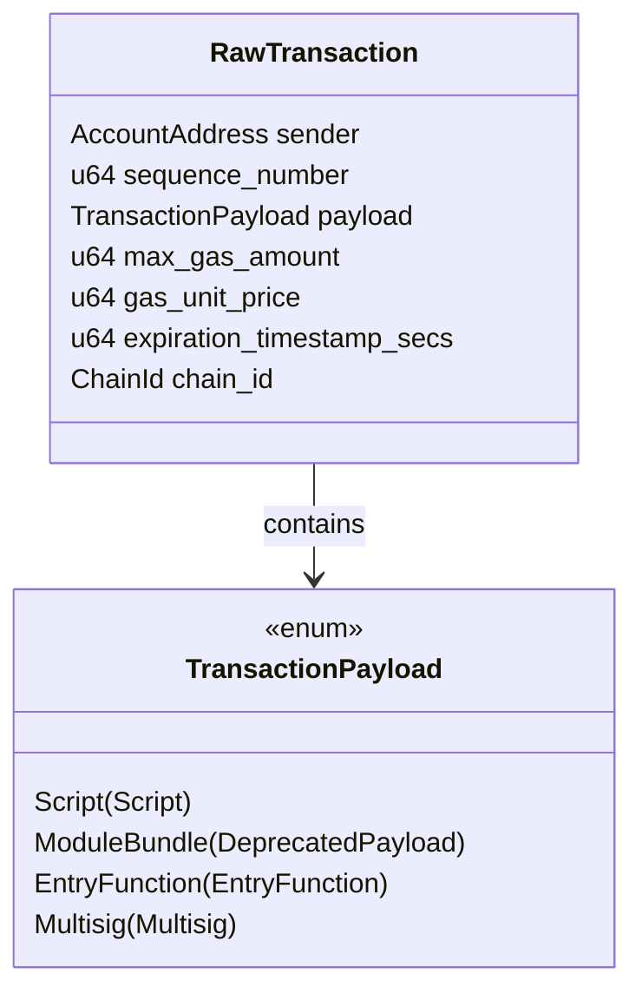

Sources: [types/src/transaction/mod.rs:100-130](https://github.com/aptos-labs/aptos-core/blob/b9f89a19/types/src/transaction/mod.rs#L100-L130). [types/src/transaction/mod.rs:522-541](https://github.com/aptos-labs/aptos-core/blob/b9f89a19/types/src/transaction/mod.rs#L522-L541)

### Transaction Payloads

Transactions can carry different types of payloads:

1. **Script**: Execute a Move script directly
2. **EntryFunction**: Call a published entry function
3. **Multisig**: Execute through a multisig account
4. **ModuleBundle**: (Deprecated)

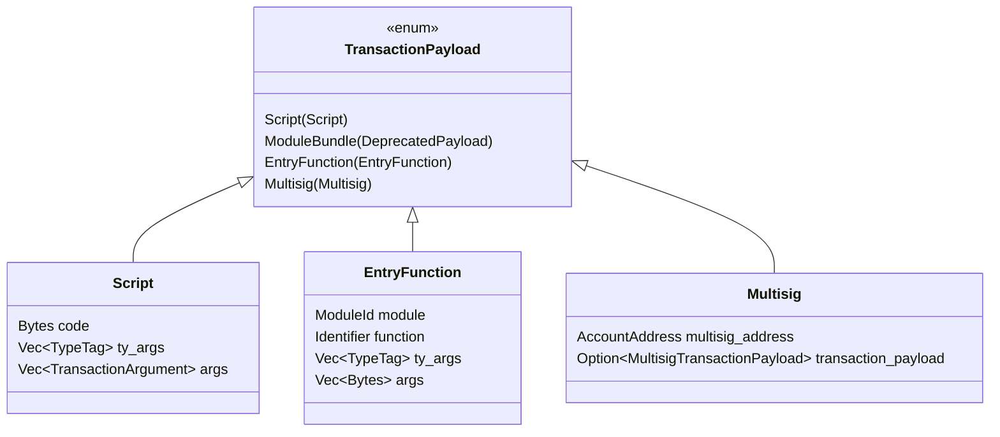

Sources: [types/src/transaction/mod.rs:522-541](https://github.com/aptos-labs/aptos-core/blob/b9f89a19/types/src/transaction/mod.rs#L522-L541), [api/types/src/transaction.rs:439-486](https://github.com/aptos-labs/aptos-core/blob/b9f89a19/api/types/src/transaction.rs#L439-L486)

### Signed Transaction

`SignedTransaction` contains a `RawTransaction` plus authentication information:

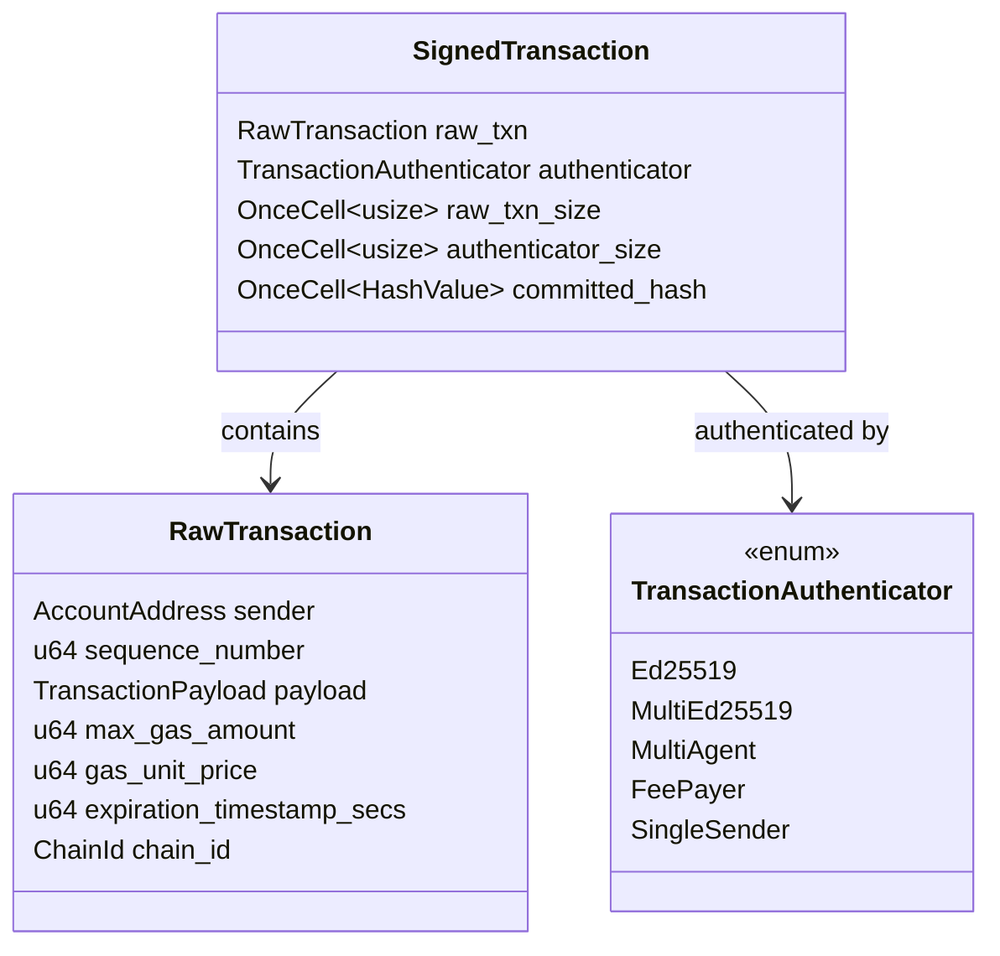

Sources: [types/src/transaction/mod.rs:574-595](https://github.com/aptos-labs/aptos-core/blob/b9f89a19/types/src/transaction/mod.rs#L574-L595)

## Transaction Authentication

Aptos supports various authentication schemes to validate transactions:

### Authentication Types

1. **Single-Signer Authentication**: One account signs the transaction
   - Ed25519 signatures
   - Secp256k1 ECDSA signatures
   - Keyless authentication

2. **Multi-Signer Authentication**:
   - Multiple signers for the same transaction
   - Multi-agent transactions
   - Fee-payer transactions where one account pays gas for another's transaction

```mermaid
classDiagram
    class TransactionAuthenticator {
        <<enum>>
        Ed25519 {
            Ed25519PublicKey public_key
            Ed25519Signature signature
        }
        MultiEd25519 {
            MultiEd25519PublicKey public_key
            MultiEd25519Signature signature
        }
        MultiAgent {
            AccountAuthenticator sender
            Vec~AccountAddress~ secondary_signer_addresses
            Vec~AccountAuthenticator~ secondary_signers
        }
        FeePayer {
            AccountAuthenticator sender
            Vec~AccountAddress~ secondary_signer_addresses
            Vec~AccountAuthenticator~ secondary_signers
            AccountAddress fee_payer_address
            AccountAuthenticator fee_payer_signer
        }
        SingleSender {
            AccountAuthenticator sender
        }
    }

    class AccountAuthenticator {
        <<enum>>
        Ed25519
        MultiEd25519
        SingleKey
        MultiKey
        NoAccountAuthenticator
        Abstraction
    }

    TransactionAuthenticator --> AccountAuthenticator: uses
```

Sources: [types/src/transaction/authenticator.rs:74-103](https://github.com/aptos-labs/aptos-core/blob/b9f89a19/types/src/transaction/authenticator.rs#L74-L103), [types/src/transaction/authenticator.rs:525-547](https://github.com/aptos-labs/aptos-core/blob/b9f89a19/types/src/transaction/authenticator.rs#L525-L547)

## Transaction Lifecycle

The lifecycle of a transaction follows several stages from creation to final execution:

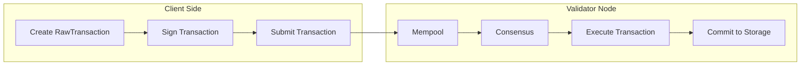

Sources: [api/types/src/transaction.rs:63-97](https://github.com/aptos-labs/aptos-core/blob/b9f89a19/api/types/src/transaction.rs#L63-L97), [types/src/transaction/mod.rs:566-848](https://github.com/aptos-labs/aptos-core/blob/b9f89a19/types/src/transaction/mod.rs#L566-L848)

### 1. Transaction Creation and Signing

A transaction begins as a `RawTransaction`, which is then signed to create a `SignedTransaction`.

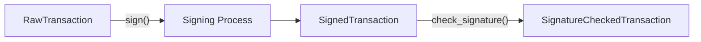

Sources: [types/src/transaction/mod.rs:222-396](https://github.com/aptos-labs/aptos-core/blob/b9f89a19/types/src/transaction/mod.rs#L222-L396), [types/src/transaction/mod.rs:606-627](https://github.com/aptos-labs/aptos-core/blob/b9f89a19/types/src/transaction/mod.rs#L606-L627)

### 2. Submission and Mempool

After signing, a transaction is submitted to a validator node, which:
1. Validates the signature and basic transaction properties
2. Places the transaction in the mempool
3. Propagates the transaction to other validators

### A transaction in mempool is represented as a `PendingTransaction`:

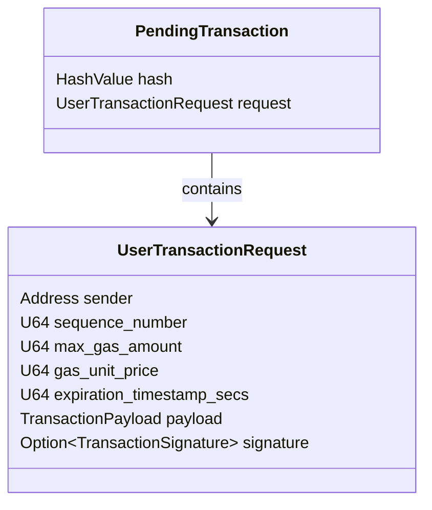

Sources: [api/types/src/transaction.rs:369-384](https://github.com/aptos-labs/aptos-core/blob/b9f89a19/api/types/src/transaction.rs#L369-L384)

### 3. Consensus and Execution

Once a transaction is selected by consensus:
1. It's ordered into a block
2. Executed by the VM
3. Results in state changes and events
4. Gets committed to storage

### 4. Transaction Results

After execution, a transaction produces:

- `TransactionInfo`: Contains metadata about execution
- `WriteSet`: All state changes caused by the transaction
- `Events`: Events emitted during execution
- `ExecutionStatus`: Final status (success/failure)

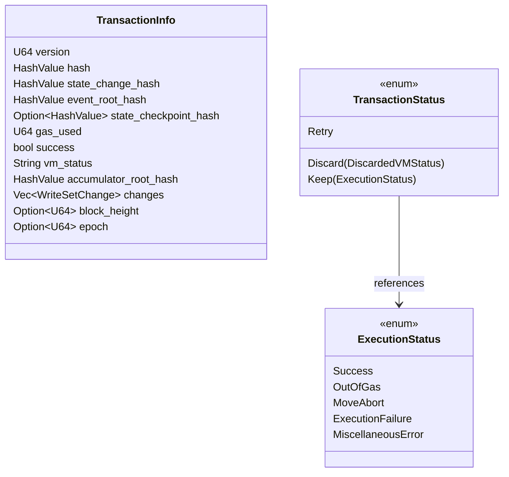

Sources: [api/types/src/transaction.rs:343-365](https://github.com/aptos-labs/aptos-core/blob/b9f89a19/api/types/src/transaction.rs#L343-L365), [types/src/transaction/mod.rs:944-1010](https://github.com/aptos-labs/aptos-core/blob/b9f89a19/types/src/transaction/mod.rs#L944-L1010), [types/src/transaction/mod.rs:1028-1064](https://github.com/aptos-labs/aptos-core/blob/b9f89a19/types/src/transaction/mod.rs#L1028-L1064)

## Transaction Storage

Once executed, transactions are stored on-chain as `TransactionOnChainData`:

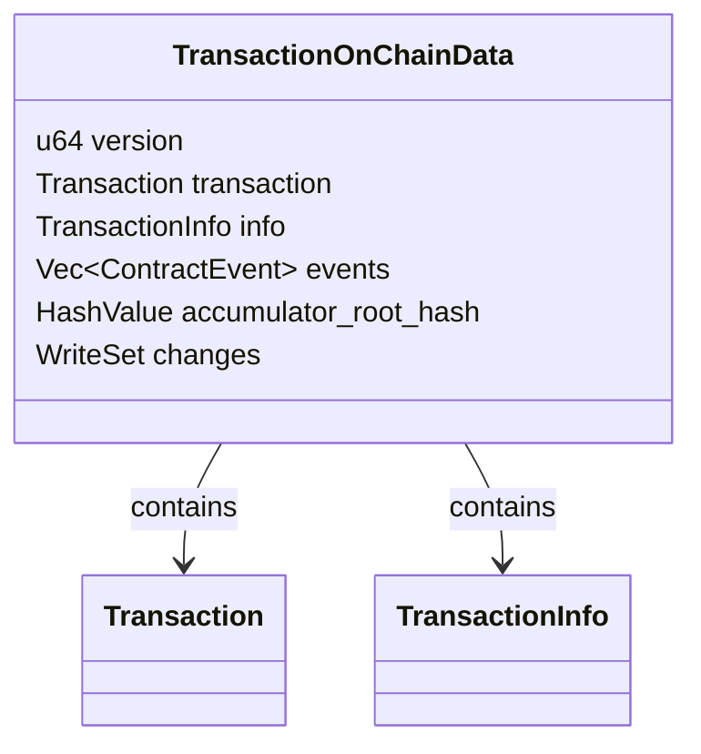

Sources: [api/types/src/transaction.rs:103-116](https://github.com/aptos-labs/aptos-core/blob/b9f89a19/api/types/src/transaction.rs#L103-L116)

## Multi-Agent and Fee-Payer Transactions

Aptos supports advanced transaction types that involve multiple accounts:

### Multi-Agent Transactions

Allows multiple accounts to authorize a single transaction:

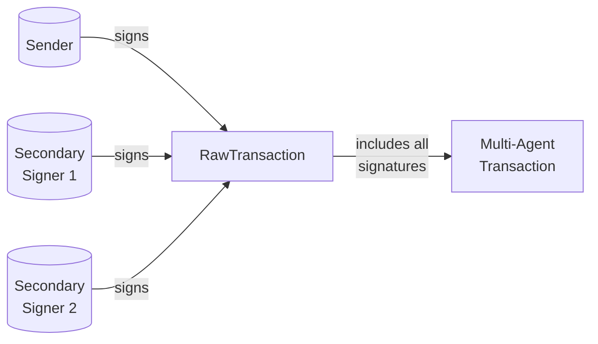

Sources: [types/src/transaction/mod.rs:243-279](https://github.com/aptos-labs/aptos-core/blob/b9f89a19/types/src/transaction/mod.rs#L243-L279), [types/src/transaction/authenticator.rs:143-154](https://github.com/aptos-labs/aptos-core/blob/b9f89a19/types/src/transaction/authenticator.rs#L143-L154)

### Fee-Payer Transactions

Allows one account to pay gas fees for another account's transaction:

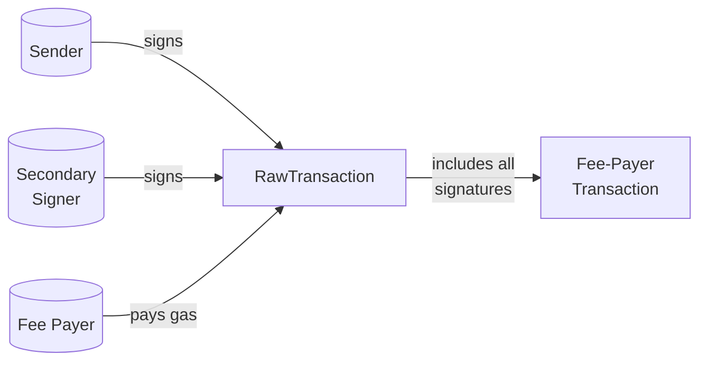

Sources: [types/src/transaction/mod.rs:283-336](https://github.com/aptos-labs/aptos-core/blob/b9f89a19/types/src/transaction/mod.rs#L283-L336), [types/src/transaction/authenticator.rs:115-129](https://github.com/aptos-labs/aptos-core/blob/b9f89a19/types/src/transaction/authenticator.rs#L115-L129)

## Transaction Validation

Before execution, transactions go through several validation steps:

1. **Signature Verification**: Ensures the transaction is properly signed
2. **Account Validation**: Checks sequence numbers and account existence
3. **Gas Checking**: Verifies gas parameters are valid
4. **Payload Validation**: Validates the transaction payload

Sources: [types/src/transaction/mod.rs:819-828](https://github.com/aptos-labs/aptos-core/blob/b9f89a19/types/src/transaction/mod.rs#L819-L828), [types/src/transaction/authenticator.rs:160-242](https://github.com/aptos-labs/aptos-core/blob/b9f89a19/types/src/transaction/authenticator.rs#L160-L242)

## Transaction Execution Output

After execution, a transaction produces:

- Status (success/failure)
- Gas usage
- Write set (state changes)
- Events emitted
- VM status (detailed execution information)

```mermaid
classDiagram
    class TransactionStatus {
        <<enum>>
        Discard(DiscardedVMStatus)
        Keep(ExecutionStatus)
        Retry
    }

    class ExecutionStatus {
        <<enum>>
        Success
        OutOfGas
        MoveAbort {
            AbortLocation location
            u64 code
            Option~AbortInfo~ info
        }
        ExecutionFailure {
            AbortLocation location
            u16 function
            u16 code_offset
        }
        MiscellaneousError(Option~u64~)
    }

    TransactionStatus --> ExecutionStatus: contains
```

Sources: [types/src/transaction/mod.rs:944-1010](https://github.com/aptos-labs/aptos-core/blob/b9f89a19/types/src/transaction/mod.rs#L944-L1010), [types/src/transaction/mod.rs:1028-1064](https://github.com/aptos-labs/aptos-core/blob/b9f89a19/types/src/transaction/mod.rs#L1028-L1064)

## Converting Between API and Core Types

The API layer provides conversion functions to transform between core transaction types and API-friendly representations:

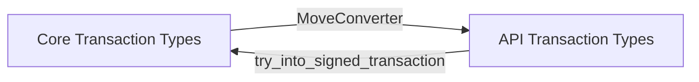

Sources: [api/types/src/convert.rs:166-177](https://github.com/aptos-labs/aptos-core/blob/b9f89a19/api/types/src/convert.rs#L166-L177), [api/types/src/convert.rs:279-351](https://github.com/aptos-labs/aptos-core/blob/b9f89a19/api/types/src/convert.rs#L279-L351)

## Summary

The Aptos Transaction System provides a robust framework for creating, validating, executing, and storing various types of blockchain transactions. It supports multiple transaction types, advanced authentication schemes, and efficient state management.

Key features include:
- Support for different payload types (scripts, entry functions, multisig)
- Multiple authentication schemes (Ed25519, MultiEd25519, Secp256k1)
- Advanced transaction models (multi-agent, fee-payer)
- Clear transaction execution status and detailed outputs