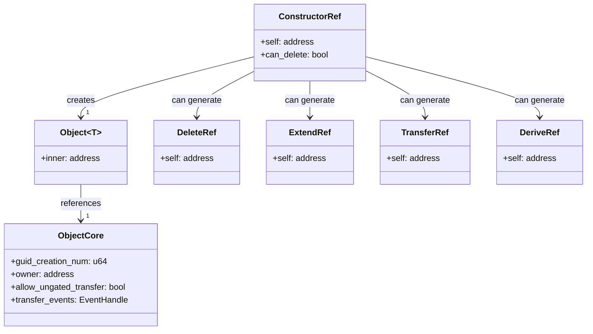
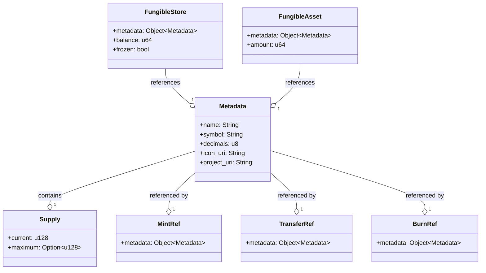
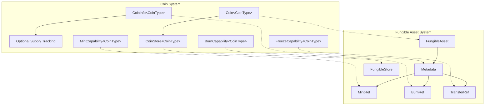
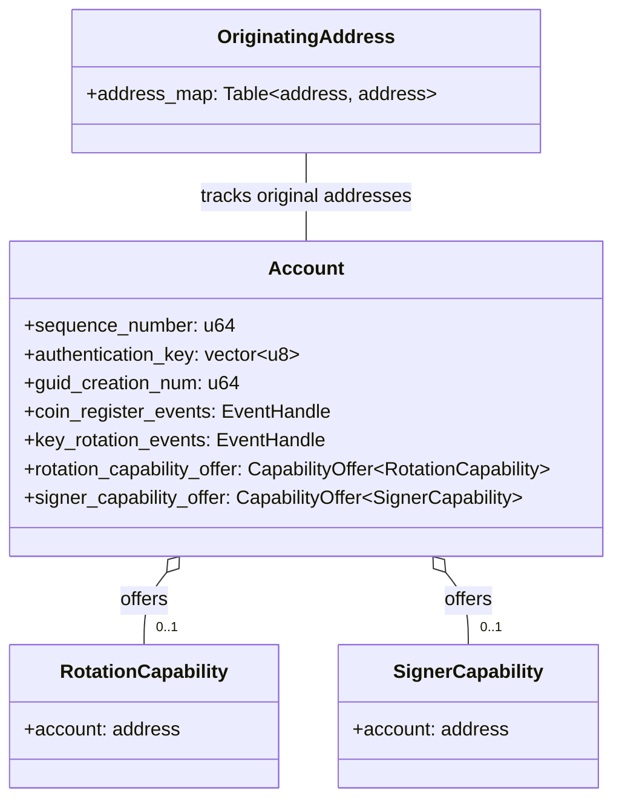
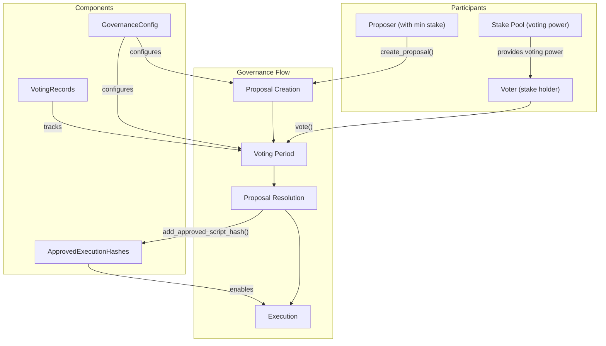
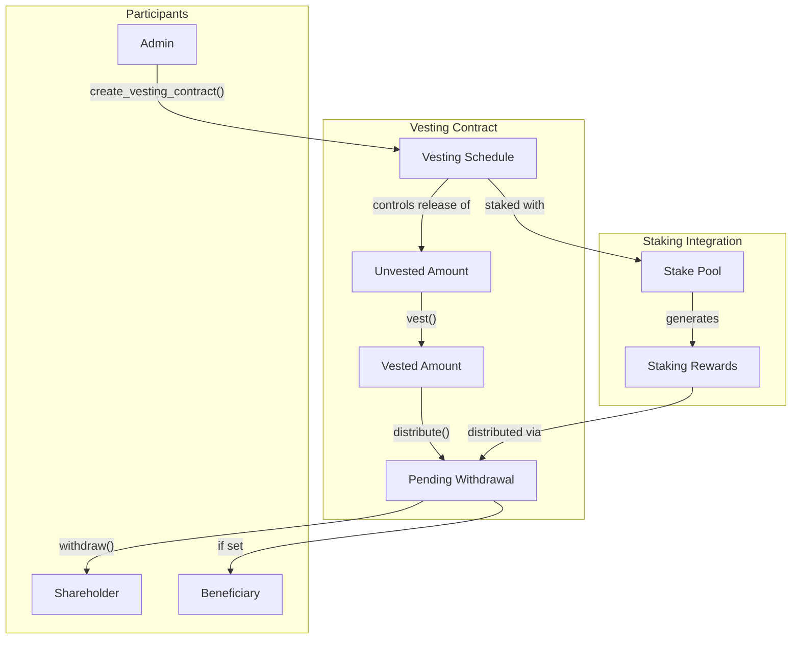
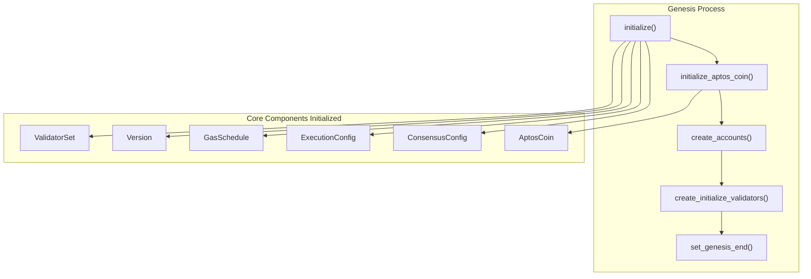

# Framework & Smart Contracts

<details>
<summary>Relevant source files</summary>

The following files were used as context for generating this wiki page:

- [api/goldens/aptos_api__tests__transactions_test__test_simulation_failure_with_move_abort_error_rendering.json](https://github.com/aptos-labs/aptos-core/blob/b9f89a19/api/goldens/aptos_api__tests__transactions_test__test_simulation_failure_with_move_abort_error_rendering.json)
- [aptos-move/block-executor/src/counters.rs](https://github.com/aptos-labs/aptos-core/blob/b9f89a19/aptos-move/block-executor/src/counters.rs)
- [aptos-move/e2e-move-tests/src/tests/vote.data/enable_partial_governance_voting/sources/main.move](https://github.com/aptos-labs/aptos-core/blob/b9f89a19/aptos-move/e2e-move-tests/src/tests/vote.data/enable_partial_governance_voting/sources/main.move)
- [aptos-move/framework/aptos-framework/doc/account.md](https://github.com/aptos-labs/aptos-core/blob/b9f89a19/aptos-move/framework/aptos-framework/doc/account.md)
- [aptos-move/framework/aptos-framework/doc/aptos_account.md](https://github.com/aptos-labs/aptos-core/blob/b9f89a19/aptos-move/framework/aptos-framework/doc/aptos_account.md)
- [aptos-move/framework/aptos-framework/doc/aptos_governance.md](https://github.com/aptos-labs/aptos-core/blob/b9f89a19/aptos-move/framework/aptos-framework/doc/aptos_governance.md)
- [aptos-move/framework/aptos-framework/doc/coin.md](https://github.com/aptos-labs/aptos-core/blob/b9f89a19/aptos-move/framework/aptos-framework/doc/coin.md)
- [aptos-move/framework/aptos-framework/doc/delegation_pool.md](https://github.com/aptos-labs/aptos-core/blob/b9f89a19/aptos-move/framework/aptos-framework/doc/delegation_pool.md)
- [aptos-move/framework/aptos-framework/doc/fungible_asset.md](https://github.com/aptos-labs/aptos-core/blob/b9f89a19/aptos-move/framework/aptos-framework/doc/fungible_asset.md)
- [aptos-move/framework/aptos-framework/doc/genesis.md](https://github.com/aptos-labs/aptos-core/blob/b9f89a19/aptos-move/framework/aptos-framework/doc/genesis.md)
- [aptos-move/framework/aptos-framework/doc/object.md](https://github.com/aptos-labs/aptos-core/blob/b9f89a19/aptos-move/framework/aptos-framework/doc/object.md)
- [aptos-move/framework/aptos-framework/doc/primary_fungible_store.md](https://github.com/aptos-labs/aptos-core/blob/b9f89a19/aptos-move/framework/aptos-framework/doc/primary_fungible_store.md)
- [aptos-move/framework/aptos-framework/doc/resource_account.md](https://github.com/aptos-labs/aptos-core/blob/b9f89a19/aptos-move/framework/aptos-framework/doc/resource_account.md)
- [aptos-move/framework/aptos-framework/doc/stake.md](https://github.com/aptos-labs/aptos-core/blob/b9f89a19/aptos-move/framework/aptos-framework/doc/stake.md)
- [aptos-move/framework/aptos-framework/doc/staking_contract.md](https://github.com/aptos-labs/aptos-core/blob/b9f89a19/aptos-move/framework/aptos-framework/doc/staking_contract.md)
- [aptos-move/framework/aptos-framework/doc/transaction_fee.md](https://github.com/aptos-labs/aptos-core/blob/b9f89a19/aptos-move/framework/aptos-framework/doc/transaction_fee.md)
- [aptos-move/framework/aptos-framework/doc/vesting.md](https://github.com/aptos-labs/aptos-core/blob/b9f89a19/aptos-move/framework/aptos-framework/doc/vesting.md)
- [aptos-move/framework/aptos-framework/doc/voting.md](https://github.com/aptos-labs/aptos-core/blob/b9f89a19/aptos-move/framework/aptos-framework/doc/voting.md)
- [aptos-move/framework/aptos-framework/sources/account/account.move](https://github.com/aptos-labs/aptos-core/blob/b9f89a19/aptos-move/framework/aptos-framework/sources/account/account.move)
- [aptos-move/framework/aptos-framework/sources/account/account.spec.move](https://github.com/aptos-labs/aptos-core/blob/b9f89a19/aptos-move/framework/aptos-framework/sources/account/account.spec.move)
- [aptos-move/framework/aptos-framework/sources/aptos_account.move](https://github.com/aptos-labs/aptos-core/blob/b9f89a19/aptos-move/framework/aptos-framework/sources/aptos_account.move)
- [aptos-move/framework/aptos-framework/sources/aptos_account.spec.move](https://github.com/aptos-labs/aptos-core/blob/b9f89a19/aptos-move/framework/aptos-framework/sources/aptos_account.spec.move)
- [aptos-move/framework/aptos-framework/sources/aptos_governance.move](https://github.com/aptos-labs/aptos-core/blob/b9f89a19/aptos-move/framework/aptos-framework/sources/aptos_governance.move)
- [aptos-move/framework/aptos-framework/sources/aptos_governance.spec.move](https://github.com/aptos-labs/aptos-core/blob/b9f89a19/aptos-move/framework/aptos-framework/sources/aptos_governance.spec.move)
- [aptos-move/framework/aptos-framework/sources/chain_id.move](https://github.com/aptos-labs/aptos-core/blob/b9f89a19/aptos-move/framework/aptos-framework/sources/chain_id.move)
- [aptos-move/framework/aptos-framework/sources/chain_status.move](https://github.com/aptos-labs/aptos-core/blob/b9f89a19/aptos-move/framework/aptos-framework/sources/chain_status.move)
- [aptos-move/framework/aptos-framework/sources/coin.move](https://github.com/aptos-labs/aptos-core/blob/b9f89a19/aptos-move/framework/aptos-framework/sources/coin.move)
- [aptos-move/framework/aptos-framework/sources/coin.spec.move](https://github.com/aptos-labs/aptos-core/blob/b9f89a19/aptos-move/framework/aptos-framework/sources/coin.spec.move)
- [aptos-move/framework/aptos-framework/sources/create_signer.move](https://github.com/aptos-labs/aptos-core/blob/b9f89a19/aptos-move/framework/aptos-framework/sources/create_signer.move)
- [aptos-move/framework/aptos-framework/sources/delegation_pool.move](https://github.com/aptos-labs/aptos-core/blob/b9f89a19/aptos-move/framework/aptos-framework/sources/delegation_pool.move)
- [aptos-move/framework/aptos-framework/sources/fungible_asset.move](https://github.com/aptos-labs/aptos-core/blob/b9f89a19/aptos-move/framework/aptos-framework/sources/fungible_asset.move)
- [aptos-move/framework/aptos-framework/sources/fungible_asset.spec.move](https://github.com/aptos-labs/aptos-core/blob/b9f89a19/aptos-move/framework/aptos-framework/sources/fungible_asset.spec.move)
- [aptos-move/framework/aptos-framework/sources/genesis.move](https://github.com/aptos-labs/aptos-core/blob/b9f89a19/aptos-move/framework/aptos-framework/sources/genesis.move)
- [aptos-move/framework/aptos-framework/sources/genesis.spec.move](https://github.com/aptos-labs/aptos-core/blob/b9f89a19/aptos-move/framework/aptos-framework/sources/genesis.spec.move)
- [aptos-move/framework/aptos-framework/sources/object.move](https://github.com/aptos-labs/aptos-core/blob/b9f89a19/aptos-move/framework/aptos-framework/sources/object.move)
- [aptos-move/framework/aptos-framework/sources/object.spec.move](https://github.com/aptos-labs/aptos-core/blob/b9f89a19/aptos-move/framework/aptos-framework/sources/object.spec.move)
- [aptos-move/framework/aptos-framework/sources/primary_fungible_store.move](https://github.com/aptos-labs/aptos-core/blob/b9f89a19/aptos-move/framework/aptos-framework/sources/primary_fungible_store.move)
- [aptos-move/framework/aptos-framework/sources/primary_fungible_store.spec.move](https://github.com/aptos-labs/aptos-core/blob/b9f89a19/aptos-move/framework/aptos-framework/sources/primary_fungible_store.spec.move)
- [aptos-move/framework/aptos-framework/sources/resource_account.move](https://github.com/aptos-labs/aptos-core/blob/b9f89a19/aptos-move/framework/aptos-framework/sources/resource_account.move)
- [aptos-move/framework/aptos-framework/sources/resource_account.spec.move](https://github.com/aptos-labs/aptos-core/blob/b9f89a19/aptos-move/framework/aptos-framework/sources/resource_account.spec.move)
- [aptos-move/framework/aptos-framework/sources/stake.move](https://github.com/aptos-labs/aptos-core/blob/b9f89a19/aptos-move/framework/aptos-framework/sources/stake.move)
- [aptos-move/framework/aptos-framework/sources/stake.spec.move](https://github.com/aptos-labs/aptos-core/blob/b9f89a19/aptos-move/framework/aptos-framework/sources/stake.spec.move)
- [aptos-move/framework/aptos-framework/sources/staking_contract.move](https://github.com/aptos-labs/aptos-core/blob/b9f89a19/aptos-move/framework/aptos-framework/sources/staking_contract.move)
- [aptos-move/framework/aptos-framework/sources/staking_contract.spec.move](https://github.com/aptos-labs/aptos-core/blob/b9f89a19/aptos-move/framework/aptos-framework/sources/staking_contract.spec.move)
- [aptos-move/framework/aptos-framework/sources/system_addresses.move](https://github.com/aptos-labs/aptos-core/blob/b9f89a19/aptos-move/framework/aptos-framework/sources/system_addresses.move)
- [aptos-move/framework/aptos-framework/sources/timestamp.move](https://github.com/aptos-labs/aptos-core/blob/b9f89a19/aptos-move/framework/aptos-framework/sources/timestamp.move)
- [aptos-move/framework/aptos-framework/sources/transaction_fee.move](https://github.com/aptos-labs/aptos-core/blob/b9f89a19/aptos-move/framework/aptos-framework/sources/transaction_fee.move)
- [aptos-move/framework/aptos-framework/sources/transaction_fee.spec.move](https://github.com/aptos-labs/aptos-core/blob/b9f89a19/aptos-move/framework/aptos-framework/sources/transaction_fee.spec.move)
- [aptos-move/framework/aptos-framework/sources/vesting.move](https://github.com/aptos-labs/aptos-core/blob/b9f89a19/aptos-move/framework/aptos-framework/sources/vesting.move)
- [aptos-move/framework/aptos-framework/sources/vesting.spec.move](https://github.com/aptos-labs/aptos-core/blob/b9f89a19/aptos-move/framework/aptos-framework/sources/vesting.spec.move)
- [aptos-move/framework/aptos-framework/sources/voting.move](https://github.com/aptos-labs/aptos-core/blob/b9f89a19/aptos-move/framework/aptos-framework/sources/voting.move)
- [aptos-move/framework/aptos-framework/sources/voting.spec.move](https://github.com/aptos-labs/aptos-core/blob/b9f89a19/aptos-move/framework/aptos-framework/sources/voting.spec.move)
- [aptos-move/framework/aptos-framework/tests/simple_dispatchable_token_pfs_tests.move](https://github.com/aptos-labs/aptos-core/blob/b9f89a19/aptos-move/framework/aptos-framework/tests/simple_dispatchable_token_pfs_tests.move)
- [aptos-move/framework/cached-packages/src/aptos_framework_sdk_builder.rs](https://github.com/aptos-labs/aptos-core/blob/b9f89a19/aptos-move/framework/cached-packages/src/aptos_framework_sdk_builder.rs)
- [types/src/fee_statement.rs](https://github.com/aptos-labs/aptos-core/blob/b9f89a19/types/src/fee_statement.rs)

</details>


This document provides an overview of the Aptos Framework and its smart contract capabilities. The Aptos Framework is the foundational layer of on-chain Move modules that implement the core functionality of the Aptos blockchain, including Aptos's object model, fungible asset standard, account system, and governance mechanisms. Understanding this framework is essential for developers building applications on Aptos, as it provides the base primitives that most applications will utilize.

For information about the lower-level Virtual Machine that executes smart contracts, see [Virtual Machine](#2.1). For details on the developer tools that help you interact with the framework, see [Developer Tools & APIs](#4).

## Table of Contents

- [Object Model](#object-model)
- [Fungible Assets](#fungible-assets)
- [Coin Module](#coin-module)
- [Account System](#account-system)
- [Extended Framework Capabilities](#extended-framework-capabilities)
  - [Staking and Delegation](#staking-and-delegation)
  - [Governance](#governance)
  - [Vesting](#vesting)

## Object Model

The Aptos Object Model provides a flexible way to define and store assets on the blockchain. It enables multiple resources to be stored together under a common identifier, creating a rich data model for applications.



The Object Model has these key characteristics:

1. **Global Storage**: Objects are globally accessible through their addresses, allowing for direct interaction without going through account storage.

2. **Ownership Model**: Objects have a clearly defined ownership that can be transferred, with an event system to track ownership changes.

3. **Resource Groups**: Objects utilize resource groups to optimize gas costs by storing multiple resources together, reducing serialization/deserialization overhead.

4. **Extensible Design**: The model supports adding new resources to objects after creation, enabling rich and evolving data models.

5. **Transferability Control**: Creators can control whether objects can be transferred freely, only with specific permissions, or not at all.

Key functions for working with objects include:
- `create_object`: Creates a new object with a random address
- `create_named_object`: Creates a deterministic object from a seed
- `transfer`: Transfers an object to a new owner
- `generate_signer`: Creates a signer for object resource modification

Objects are created with a `ConstructorRef` which can then be used to generate other capabilities like `DeleteRef`, `ExtendRef`, or `TransferRef` for managing the object throughout its lifecycle.

Sources: [aptos-move/framework/aptos-framework/sources/object.move:17-409](https://github.com/aptos-labs/aptos-core/blob/b9f89a19/aptos-move/framework/aptos-framework/sources/object.move#L17-L409). [aptos-move/framework/aptos-framework/doc/object.md:1-163](https://github.com/aptos-labs/aptos-core/blob/b9f89a19/aptos-move/framework/aptos-framework/doc/object.md#L1-L163).

## Fungible Assets

The Fungible Asset framework provides a standardized way to create, manage, and transfer fungible tokens on Aptos. It's built on top of the Object Model and allows for more complex token behavior than the basic Coin module.



Key components of the Fungible Asset framework:

1. **Metadata Object**: Defines properties of the fungible asset like name, symbol, decimals, etc. It can be extended with additional resources.

2. **FungibleStore**: A resource that holds fungible assets for a specific account.

3. **FungibleAsset**: A temporary, transferable representation of fungible asset value.

4. **References**: Various capability references (MintRef, TransferRef, BurnRef) that control who can mint, transfer, or burn tokens.

Key operations:

- `add_fungibility`: Adds fungible asset capabilities to an existing object
- `mint`: Creates new token value using a MintRef
- `transfer`: Moves tokens between accounts
- `burn`: Destroys token value using a BurnRef
- `balance`: Queries the token balance of an account

The Fungible Asset framework also supports more advanced features like:

- Concurrent supply and balance tracking
- Creator-controlled transferability
- Custom transfer logic through dispatch functions
- Freezable accounts

Sources: [aptos-move/framework/aptos-framework/sources/fungible_asset.move:1-172](https://github.com/aptos-labs/aptos-core/blob/b9f89a19/aptos-move/framework/aptos-framework/sources/fungible_asset.move#L1-L172). [aptos-move/framework/aptos-framework/doc/fungible_asset.md:1-150](https://github.com/aptos-labs/aptos-core/blob/b9f89a19/aptos-move/framework/aptos-framework/doc/fungible_asset.md#L1-L150).

## Coin Module

The Coin module provides a simpler, more specialized version of fungible assets specifically designed for currency-like tokens. While built on the Fungible Asset framework, it offers a streamlined API focused on the most common token operations.



The Coin module provides:

1. **Typed Coins**: Each coin type is a different Move type, providing strong type safety.

2. **Simple API**: Functions like `transfer`, `mint`, `burn`, and `register` provide straightforward token operations.

3. **Capabilities Model**: Control over minting, burning, and freezing is managed through capability resources.

4. **Backwards Compatibility**: Maintains compatibility with older Aptos code while leveraging the newer Fungible Asset framework.

Key types and functions:

- `Coin<CoinType>`: The basic token container type
- `CoinStore<CoinType>`: Account storage for a specific coin type
- `CoinInfo<CoinType>`: Metadata about a coin type
- `initialize`: Creates a new coin type with mint and burn capabilities
- `register`: Sets up an account to receive a specific coin type
- `transfer`: Moves coins between accounts
- `deposit`: Adds coins to an account
- `withdraw`: Removes coins from an account

Coins and the Fungible Asset system are bridged through conversion functions that allow coins to be used with either API.

Sources: [aptos-move/framework/aptos-framework/sources/coin.move:1-228](https://github.com/aptos-labs/aptos-core/blob/b9f89a19/aptos-move/framework/aptos-framework/sources/coin.move#L1-L228). [aptos-move/framework/aptos-framework/doc/coin.md:1-162](https://github.com/aptos-labs/aptos-core/blob/b9f89a19/aptos-move/framework/aptos-framework/doc/coin.md#L1-L162).

## Account System

The Account system in Aptos manages user identities, authentication, and the structure of on-chain accounts. Every user and smart contract on Aptos has an account that serves as their identity and storage location.



Key components and features:

1. **Account Structure**: The `Account` resource contains authentication keys, sequence numbers, and capability offers.

2. **Authentication**: Accounts use EdDSA or MultiEdDSA authentication and support key rotation.

3. **Capability Delegation**: Account owners can delegate rotation and signer capabilities to other accounts.

4. **Resource Accounts**: Special accounts owned by on-chain modules rather than private keys, useful for protocol-owned resources.

5. **Address Tracking**: The system maintains mappings between current and original addresses after key rotations.

Important functions:

- `create_account`: Creates a new account at a specified address
- `rotate_authentication_key`: Changes an account's authentication key
- `create_resource_account`: Creates an account controlled by a module
- `offer_signer_capability`: Delegates signing authority to another account

The account system is foundational to Aptos's security model, ensuring that only authorized users can perform actions on their accounts while providing flexibility for delegation and key management.

Sources: [aptos-move/framework/aptos-framework/doc/account.md:1-70](https://github.com/aptos-labs/aptos-core/blob/b9f89a19/aptos-move/framework/aptos-framework/doc/account.md#L1-L70). [aptos-move/framework/cached-packages/src/aptos_framework_sdk_builder.rs:37-215](https://github.com/aptos-labs/aptos-core/blob/b9f89a19/aptos-move/framework/cached-packages/src/aptos_framework_sdk_builder.rs#L37-L215).

## Extended Framework Capabilities

Beyond the core components, the Aptos Framework provides several extended capabilities for more specialized blockchain functions. These build on the core framework to enable staking, governance, and vesting.

### Staking and Delegation

Aptos uses a Proof-of-Stake consensus mechanism, implemented through the `stake` and `delegation_pool` modules. These modules allow token holders to participate in network security and earn rewards.

```mermaid
flowchart TD
    subgraph "Stake Module"
        StakePool["StakePool"] --> ActiveStake["Active Stake"]
        StakePool --> PendingActiveStake["Pending Active Stake"]
        StakePool --> InactiveStake["Inactive Stake"]
        StakePool --> PendingInactiveStake["Pending Inactive Stake"]
        
        ValidatorSet["ValidatorSet"] --> ActiveValidators["Active Validators"]
        ValidatorSet --> PendingInactive["Pending Inactive Validators"]
        ValidatorSet --> PendingActive["Pending Active Validators"]
    end
    
    subgraph "Delegation Module"
        DelegationPool["DelegationPool"] --> Shares["Shares-based Accounting"]
        DelegationPool --> StakerOwned["Delegator Stakes"]
        DelegationPool --> OperatorCommission["Operator Commission"]
    end
    
    DelegationPool --> StakePool : "delegates through"
    Staker["Staker/Delegator"] -- "add_stake()" --> DelegationPool
    Operator["Operator"] -- "join_validator_set()" --> ValidatorSet
```

Key features of staking and delegation:

1. **Validator Lifecycle**: The stake module manages the lifecycle of validators, including joining the validator set, updating validator information, and managing stake.

2. **Stake Management**: Stake can be in different states (active, inactive, pending_active, pending_inactive) with transitions occurring during epoch boundaries.

3. **Delegation Pools**: Allow multiple users to combine stake to meet minimum validator requirements, with rewards distributed proportionally.

4. **Operator/Owner Separation**: The stake owner can designate an operator to manage validator operations while retaining ownership of the stake.

5. **Voting Power**: Stake determines validator voting power in consensus, with changes taking effect in the next epoch.

Important operations:

- `initialize_validator`: Sets up a validator with consensus keys and network addresses
- `add_stake`: Adds stake to a stake pool
- `join_validator_set`: Requests to join the active validator set
- `unlock_stake`: Begins the process of withdrawing stake
- `initialize_delegation_pool`: Creates a new delegation pool
- `add_stake_to_delegation_pool`: Adds delegated stake to a pool

Sources: [aptos-move/framework/aptos-framework/sources/stake.move:1-435](https://github.com/aptos-labs/aptos-core/blob/b9f89a19/aptos-move/framework/aptos-framework/sources/stake.move#L1-L435). [aptos-move/framework/aptos-framework/doc/stake.md:1-24](https://github.com/aptos-labs/aptos-core/blob/b9f89a19/aptos-move/framework/aptos-framework/doc/stake.md#L1-L24). [aptos-move/framework/aptos-framework/sources/delegation_pool.move:1-16](https://github.com/aptos-labs/aptos-core/blob/b9f89a19/aptos-move/framework/aptos-framework/sources/delegation_pool.move#L1-L16).

### Governance

The Aptos Governance system allows stakeholders to propose and vote on changes to the network. It's implemented in the `aptos_governance` module and integrates with the staking system.



Key features of the governance system:

1. **Stake-based Voting**: Voting power is proportional to stake, with minimum thresholds for proposing.

2. **Proposal Lifecycle**: Proposals go through creation, voting, resolution, and execution phases.

3. **Execution Scripts**: Successful proposals can execute arbitrary code, with script hashes tracked for verification.

4. **Voting Delegation**: Stake owners can delegate voting to dedicated voters.

5. **Partial Voting**: Voters can split their voting power across multiple proposals or vote with only a portion of their power.

Important operations:

- `create_proposal`: Creates a new governance proposal
- `vote`: Casts a vote on a proposal
- `resolve`: Determines if a proposal has passed and prepares it for execution
- `add_approved_script_hash`: Records the hash of a successful proposal's execution script

Sources: [aptos-move/framework/aptos-framework/sources/aptos_governance.move:1-107](https://github.com/aptos-labs/aptos-core/blob/b9f89a19/aptos-move/framework/aptos-framework/sources/aptos_governance.move#L1-L107). [aptos-move/framework/aptos-framework/doc/aptos_governance.md:1-62](https://github.com/aptos-labs/aptos-core/blob/b9f89a19/aptos-move/framework/aptos-framework/doc/aptos_governance.md#L1-L62). [aptos-move/framework/aptos-framework/sources/aptos_governance.spec.move:1-40](https://github.com/aptos-labs/aptos-core/blob/b9f89a19/aptos-move/framework/aptos-framework/sources/aptos_governance.spec.move#L1-L40).

### Vesting

The Vesting module allows for the controlled release of tokens over time, useful for team allocations, investor distributions, and other token lockups. It integrates with the staking system to allow locked tokens to participate in consensus.



Key features of the vesting system:

1. **Flexible Schedules**: Supports customizable vesting schedules with periods and distribution amounts.

2. **Staking Integration**: Vested tokens can be staked to earn rewards while still following the vesting schedule.

3. **Reward Distribution**: Staking rewards can be withdrawn independently of the vesting schedule.

4. **Beneficiary Management**: Administrators can update beneficiary addresses for distributions.

5. **Contract Termination**: Contracts can be terminated with remaining funds returned to a specified address.

Important operations:

- `create_vesting_contract`: Sets up a new vesting contract with a specified schedule
- `vest`: Releases tokens according to the vesting schedule
- `distribute`: Distributes vested tokens to shareholders
- `unlock_rewards`: Allows shareholders to collect staking rewards
- `update_beneficiary`: Changes where a shareholder's distributions are sent

Sources: [aptos-move/framework/aptos-framework/sources/vesting.move:1-35](https://github.com/aptos-labs/aptos-core/blob/b9f89a19/aptos-move/framework/aptos-framework/sources/vesting.move#L1-L35). [aptos-move/framework/aptos-framework/doc/vesting.md:1-37](https://github.com/aptos-labs/aptos-core/blob/b9f89a19/aptos-move/framework/aptos-framework/doc/vesting.md#L1-L37).

## Framework Initialization and Genesis

The Aptos Framework is initialized during genesis, setting up the core components of the blockchain. This process is managed by the `genesis` module.



During initialization, the framework:

1. **Creates Core Accounts**: Sets up the aptos_framework account and other reserved framework accounts.

2. **Initializes Modules**: Configures core modules like consensus, execution, staking, and version.

3. **Sets Up AptosCoin**: Creates the native coin of the network with mint and burn capabilities.

4. **Configures Validators**: Initializes the initial validator set of the network.

5. **Distributes Initial Tokens**: Allocates tokens to genesis accounts according to the genesis configuration.

This initialization process creates the foundational state upon which all subsequent transactions build.

Sources: [aptos-move/framework/aptos-framework/sources/genesis.move:1-133](https://github.com/aptos-labs/aptos-core/blob/b9f89a19/aptos-move/framework/aptos-framework/sources/genesis.move#L1-L133). [aptos-move/framework/aptos-framework/doc/genesis.md:1-23](https://github.com/aptos-labs/aptos-core/blob/b9f89a19/aptos-move/framework/aptos-framework/doc/genesis.md#L1-L23).

## Summary

The Aptos Framework provides a robust foundation for building decentralized applications with its Object Model, Fungible Asset standard, Coin module, and Account system. These core components are enhanced by extended capabilities for staking, governance, and vesting, creating a comprehensive environment for blockchain development.