# Aptos Framework

<details>
<summary>Relevant source files</summary>

The following files were used as context for generating this wiki page:

- [api/goldens/aptos_api__tests__transactions_test__test_simulation_failure_with_move_abort_error_rendering.json](https://github.com/aptos-labs/aptos-core/blob/b9f89a19/api/goldens/aptos_api__tests__transactions_test__test_simulation_failure_with_move_abort_error_rendering.json)
- [aptos-move/block-executor/src/counters.rs](https://github.com/aptos-labs/aptos-core/blob/b9f89a19/aptos-move/block-executor/src/counters.rs)
- [aptos-move/e2e-move-tests/src/tests/vote.data/enable_partial_governance_voting/sources/main.move](https://github.com/aptos-labs/aptos-core/blob/b9f89a19/aptos-move/e2e-move-tests/src/tests/vote.data/enable_partial_governance_voting/sources/main.move)
- [aptos-move/framework/aptos-framework/doc/account.md](https://github.com/aptos-labs/aptos-core/blob/b9f89a19/aptos-move/framework/aptos-framework/doc/account.md)
- [aptos-move/framework/aptos-framework/doc/aptos_account.md](https://github.com/aptos-labs/aptos-core/blob/b9f89a19/aptos-move/framework/aptos-framework/doc/aptos_account.md)
- [aptos-move/framework/aptos-framework/doc/aptos_governance.md](https://github.com/aptos-labs/aptos-core/blob/b9f89a19/aptos-move/framework/aptos-framework/doc/aptos_governance.md)
- [aptos-move/framework/aptos-framework/doc/coin.md](https://github.com/aptos-labs/aptos-core/blob/b9f89a19/aptos-move/framework/aptos-framework/doc/coin.md)
- [aptos-move/framework/aptos-framework/doc/delegation_pool.md](https://github.com/aptos-labs/aptos-core/blob/b9f89a19/aptos-move/framework/aptos-framework/doc/delegation_pool.md)
- [aptos-move/framework/aptos-framework/doc/genesis.md](https://github.com/aptos-labs/aptos-core/blob/b9f89a19/aptos-move/framework/aptos-framework/doc/genesis.md)
- [aptos-move/framework/aptos-framework/doc/resource_account.md](https://github.com/aptos-labs/aptos-core/blob/b9f89a19/aptos-move/framework/aptos-framework/doc/resource_account.md)
- [aptos-move/framework/aptos-framework/doc/stake.md](https://github.com/aptos-labs/aptos-core/blob/b9f89a19/aptos-move/framework/aptos-framework/doc/stake.md)
- [aptos-move/framework/aptos-framework/doc/staking_contract.md](https://github.com/aptos-labs/aptos-core/blob/b9f89a19/aptos-move/framework/aptos-framework/doc/staking_contract.md)
- [aptos-move/framework/aptos-framework/doc/transaction_fee.md](https://github.com/aptos-labs/aptos-core/blob/b9f89a19/aptos-move/framework/aptos-framework/doc/transaction_fee.md)
- [aptos-move/framework/aptos-framework/doc/vesting.md](https://github.com/aptos-labs/aptos-core/blob/b9f89a19/aptos-move/framework/aptos-framework/doc/vesting.md)
- [aptos-move/framework/aptos-framework/doc/voting.md](https://github.com/aptos-labs/aptos-core/blob/b9f89a19/aptos-move/framework/aptos-framework/doc/voting.md)
- [aptos-move/framework/aptos-framework/sources/account/account.move](https://github.com/aptos-labs/aptos-core/blob/b9f89a19/aptos-move/framework/aptos-framework/sources/account/account.move)
- [aptos-move/framework/aptos-framework/sources/account/account.spec.move](https://github.com/aptos-labs/aptos-core/blob/b9f89a19/aptos-move/framework/aptos-framework/sources/account/account.spec.move)
- [aptos-move/framework/aptos-framework/sources/aptos_account.move](https://github.com/aptos-labs/aptos-core/blob/b9f89a19/aptos-move/framework/aptos-framework/sources/aptos_account.move)
- [aptos-move/framework/aptos-framework/sources/aptos_account.spec.move](https://github.com/aptos-labs/aptos-core/blob/b9f89a19/aptos-move/framework/aptos-framework/sources/aptos_account.spec.move)
- [aptos-move/framework/aptos-framework/sources/aptos_governance.move](https://github.com/aptos-labs/aptos-core/blob/b9f89a19/aptos-move/framework/aptos-framework/sources/aptos_governance.move)
- [aptos-move/framework/aptos-framework/sources/aptos_governance.spec.move](https://github.com/aptos-labs/aptos-core/blob/b9f89a19/aptos-move/framework/aptos-framework/sources/aptos_governance.spec.move)
- [aptos-move/framework/aptos-framework/sources/chain_id.move](https://github.com/aptos-labs/aptos-core/blob/b9f89a19/aptos-move/framework/aptos-framework/sources/chain_id.move)
- [aptos-move/framework/aptos-framework/sources/chain_status.move](https://github.com/aptos-labs/aptos-core/blob/b9f89a19/aptos-move/framework/aptos-framework/sources/chain_status.move)
- [aptos-move/framework/aptos-framework/sources/coin.move](https://github.com/aptos-labs/aptos-core/blob/b9f89a19/aptos-move/framework/aptos-framework/sources/coin.move)
- [aptos-move/framework/aptos-framework/sources/coin.spec.move](https://github.com/aptos-labs/aptos-core/blob/b9f89a19/aptos-move/framework/aptos-framework/sources/coin.spec.move)
- [aptos-move/framework/aptos-framework/sources/delegation_pool.move](https://github.com/aptos-labs/aptos-core/blob/b9f89a19/aptos-move/framework/aptos-framework/sources/delegation_pool.move)
- [aptos-move/framework/aptos-framework/sources/genesis.move](https://github.com/aptos-labs/aptos-core/blob/b9f89a19/aptos-move/framework/aptos-framework/sources/genesis.move)
- [aptos-move/framework/aptos-framework/sources/genesis.spec.move](https://github.com/aptos-labs/aptos-core/blob/b9f89a19/aptos-move/framework/aptos-framework/sources/genesis.spec.move)
- [aptos-move/framework/aptos-framework/sources/resource_account.move](https://github.com/aptos-labs/aptos-core/blob/b9f89a19/aptos-move/framework/aptos-framework/sources/resource_account.move)
- [aptos-move/framework/aptos-framework/sources/resource_account.spec.move](https://github.com/aptos-labs/aptos-core/blob/b9f89a19/aptos-move/framework/aptos-framework/sources/resource_account.spec.move)
- [aptos-move/framework/aptos-framework/sources/stake.move](https://github.com/aptos-labs/aptos-core/blob/b9f89a19/aptos-move/framework/aptos-framework/sources/stake.move)
- [aptos-move/framework/aptos-framework/sources/stake.spec.move](https://github.com/aptos-labs/aptos-core/blob/b9f89a19/aptos-move/framework/aptos-framework/sources/stake.spec.move)
- [aptos-move/framework/aptos-framework/sources/staking_contract.move](https://github.com/aptos-labs/aptos-core/blob/b9f89a19/aptos-move/framework/aptos-framework/sources/staking_contract.move)
- [aptos-move/framework/aptos-framework/sources/staking_contract.spec.move](https://github.com/aptos-labs/aptos-core/blob/b9f89a19/aptos-move/framework/aptos-framework/sources/staking_contract.spec.move)
- [aptos-move/framework/aptos-framework/sources/system_addresses.move](https://github.com/aptos-labs/aptos-core/blob/b9f89a19/aptos-move/framework/aptos-framework/sources/system_addresses.move)
- [aptos-move/framework/aptos-framework/sources/timestamp.move](https://github.com/aptos-labs/aptos-core/blob/b9f89a19/aptos-move/framework/aptos-framework/sources/timestamp.move)
- [aptos-move/framework/aptos-framework/sources/transaction_fee.move](https://github.com/aptos-labs/aptos-core/blob/b9f89a19/aptos-move/framework/aptos-framework/sources/transaction_fee.move)
- [aptos-move/framework/aptos-framework/sources/transaction_fee.spec.move](https://github.com/aptos-labs/aptos-core/blob/b9f89a19/aptos-move/framework/aptos-framework/sources/transaction_fee.spec.move)
- [aptos-move/framework/aptos-framework/sources/vesting.move](https://github.com/aptos-labs/aptos-core/blob/b9f89a19/aptos-move/framework/aptos-framework/sources/vesting.move)
- [aptos-move/framework/aptos-framework/sources/vesting.spec.move](https://github.com/aptos-labs/aptos-core/blob/b9f89a19/aptos-move/framework/aptos-framework/sources/vesting.spec.move)
- [aptos-move/framework/aptos-framework/sources/voting.move](https://github.com/aptos-labs/aptos-core/blob/b9f89a19/aptos-move/framework/aptos-framework/sources/voting.move)
- [aptos-move/framework/aptos-framework/sources/voting.spec.move](https://github.com/aptos-labs/aptos-core/blob/b9f89a19/aptos-move/framework/aptos-framework/sources/voting.spec.move)
- [aptos-move/framework/cached-packages/src/aptos_framework_sdk_builder.rs](https://github.com/aptos-labs/aptos-core/blob/b9f89a19/aptos-move/framework/cached-packages/src/aptos_framework_sdk_builder.rs)
- [types/src/fee_statement.rs](https://github.com/aptos-labs/aptos-core/blob/b9f89a19/types/src/fee_statement.rs)

</details>


The Aptos Framework is the core set of on-chain modules that power the Aptos blockchain. These modules form the foundation of the Move-based execution layer, providing essential functionality for accounts, assets, staking, governance, and more. This document provides an overview of the key components and their interrelationships within the framework.

For information about the Virtual Machine that executes the framework code, see [Virtual Machine](#2.1). For information about the Transaction System that interacts with the framework, see [Transaction System](#2.4).

## Framework Architecture

The Aptos Framework consists of a collection of Move modules deployed to the `0x1` address (also known as `@aptos_framework`). These modules provide core functionality that all other applications on the blockchain can leverage, including account management, coin operations, staking mechanisms, governance protocols, and resource management.

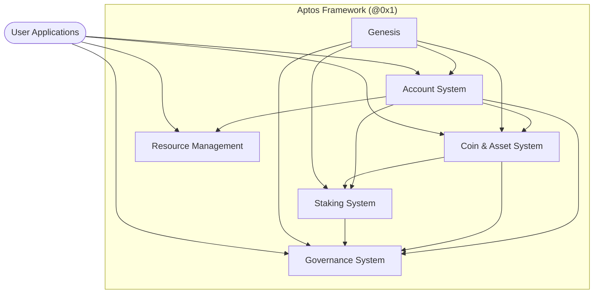

Sources: [aptos-move/framework/aptos-framework/sources/account/account.move], [aptos-move/framework/aptos-framework/sources/coin.move], [aptos-move/framework/aptos-framework/sources/stake.move], [aptos-move/framework/aptos-framework/sources/aptos_governance.move], [aptos-move/framework/aptos-framework/sources/genesis.move]

## Account System

The account system provides the foundation for users and resources on the Aptos blockchain. Each account is identified by a unique 32-byte address and contains resources like authentication keys, sequence numbers, and event handles.

The core of the account system is the `Account` resource, which stores essential account information:

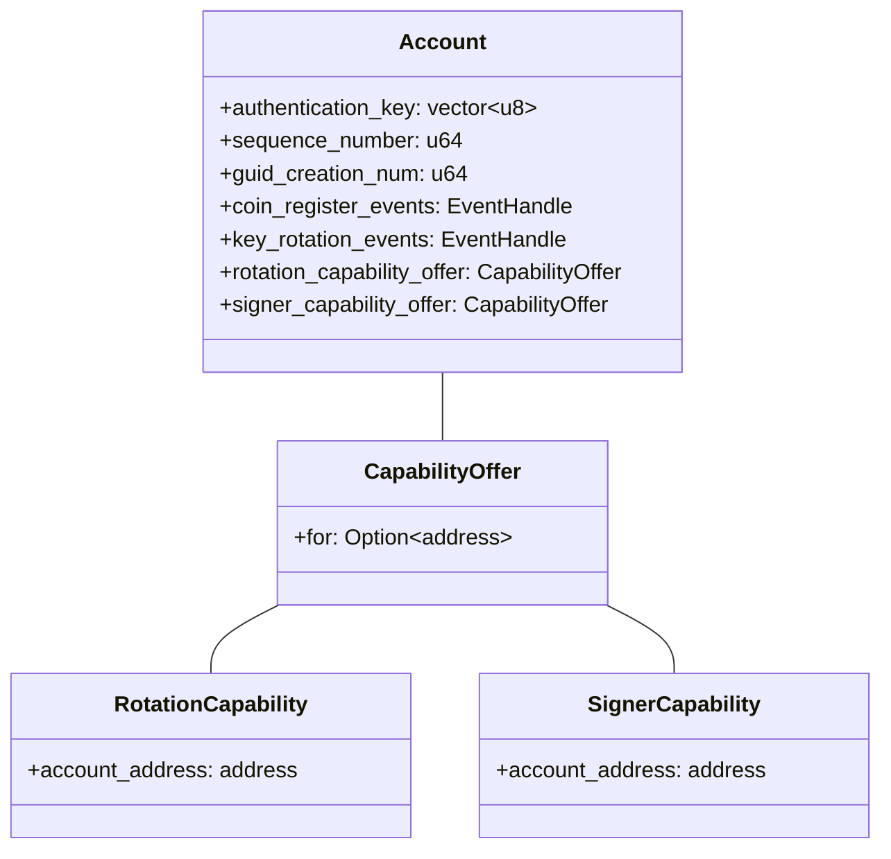

Sources: [aptos-move/framework/aptos-framework/doc/account.md]

Key account operations include:
- Creating new accounts
- Rotating authentication keys
- Managing capabilities for delegation
- Handling account resources

The `account` module also provides capability-based security mechanisms allowing accounts to delegate specific permissions to other accounts. This enables flexible resource management and account abstractions.

Sources: [aptos-move/framework/aptos-framework/sources/account/account.move]

## Coin and Asset System

The coin system enables fungible token functionality throughout the blockchain, with the native APT coin (`AptosCoin`) serving as the primary example. The `coin` module defines the core structures and operations for fungible assets.

### Coin Structure

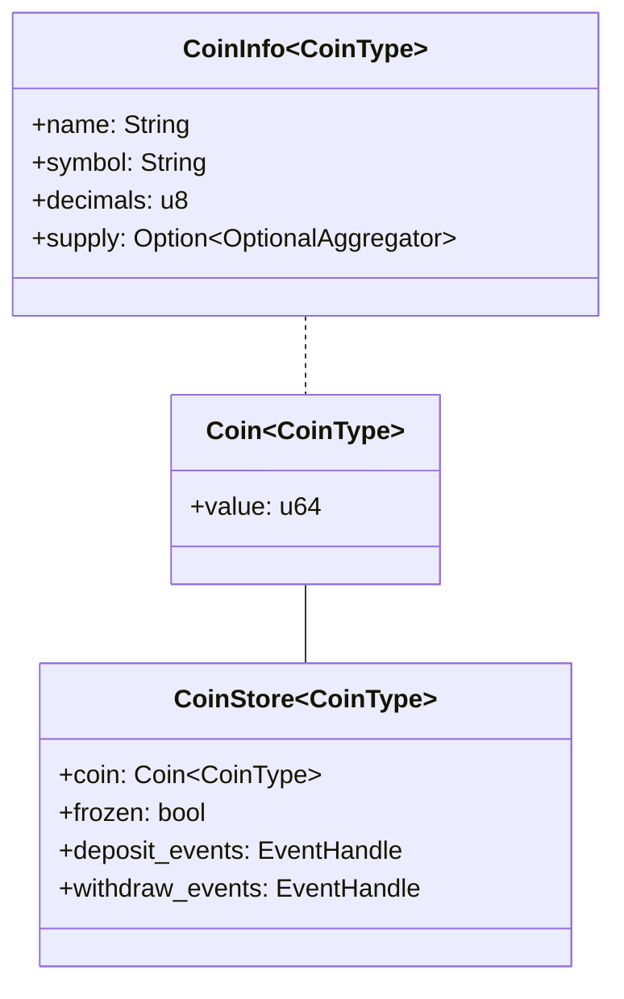

Sources: [aptos-move/framework/aptos-framework/doc/coin.md]

The `coin` module provides capabilities for:
- Creating new coin types
- Minting and burning coins
- Transferring coins between accounts
- Tracking coin supply and metadata
- Integration with the newer Fungible Asset system

The coin capabilities (`MintCapability`, `BurnCapability`, `FreezeCapability`) control who can perform privileged operations on a coin type. These capabilities are typically held by the module that defines the coin type.

During genesis, the native `AptosCoin` is initialized and the minting and burning capabilities are assigned to system modules, allowing them to handle transaction fees and staking rewards.

Sources: [aptos-move/framework/aptos-framework/sources/coin.move], [aptos-move/framework/aptos-framework/sources/genesis.move]

## Staking System

The staking system powers Aptos' proof-of-stake (PoS) consensus by allowing token holders to participate in network validation and earn rewards.

### Validator Lifecycle

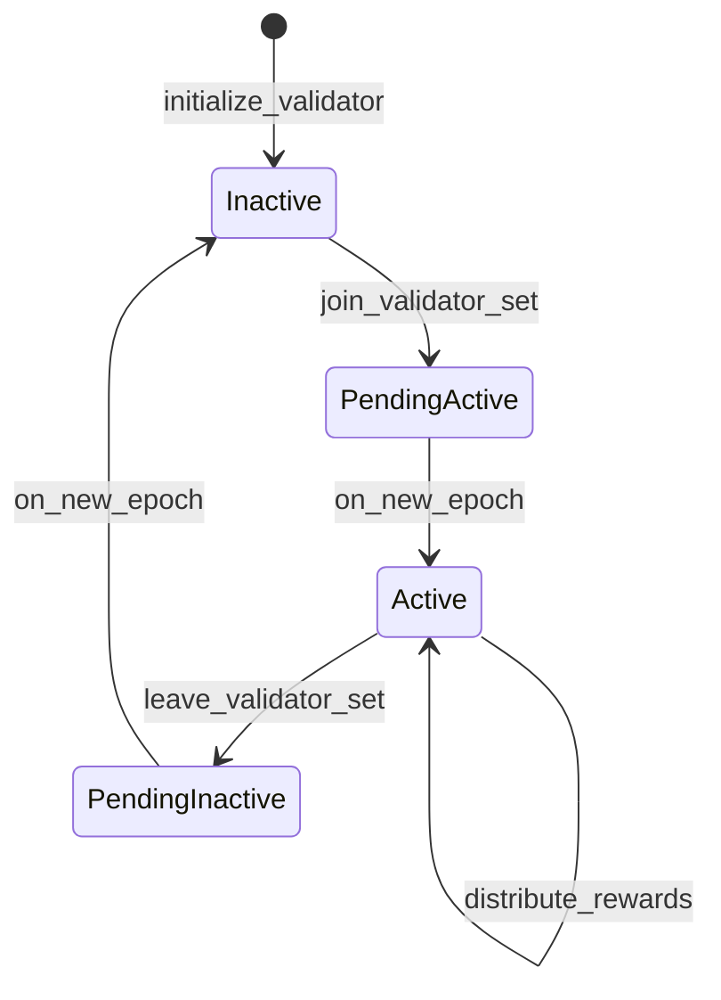

Sources: [aptos-move/framework/aptos-framework/sources/stake.move]

The core staking components include:

### Stake Pool Structure

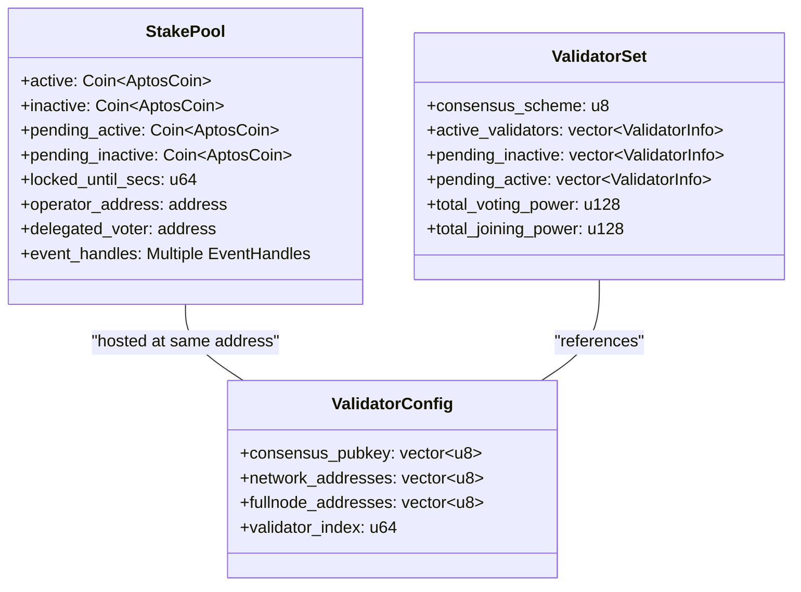

Sources: [aptos-move/framework/aptos-framework/sources/stake.move]

The staking system provides several delegation mechanisms to enable participation:

1. **Direct Staking**: Validator operators manage their own stake pools
2. **Staking Contracts**: Allow separating ownership from operation with commission sharing
3. **Delegation Pools**: Enable multiple participants to join the same stake pool

### Delegation Pool Structure

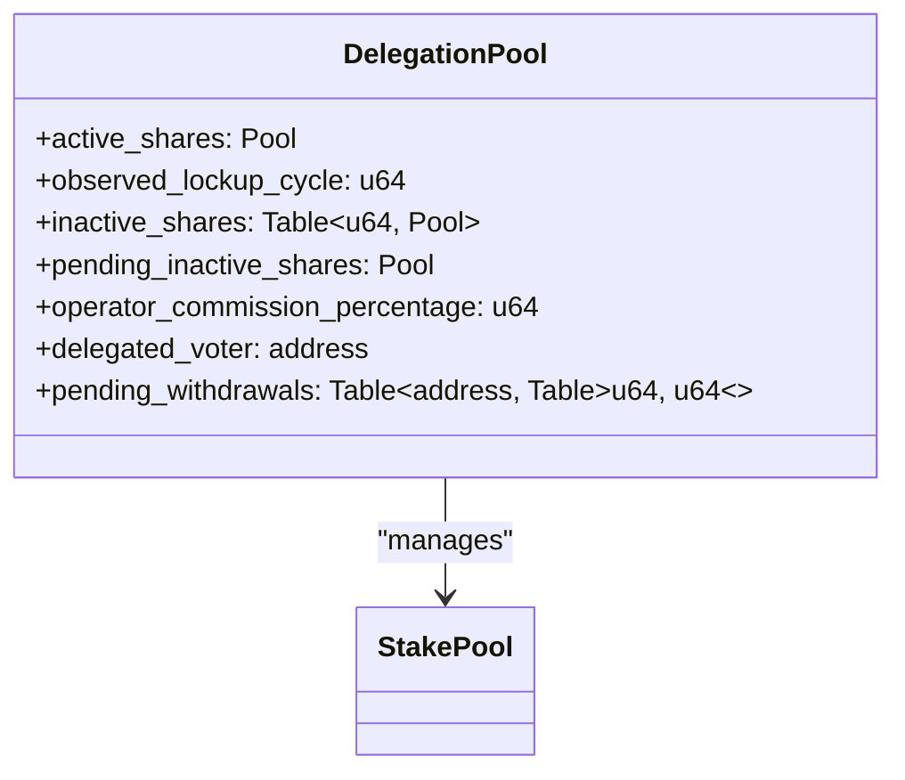

Sources: [aptos-move/framework/aptos-framework/sources/delegation_pool.move]

### Staking Contract Structure

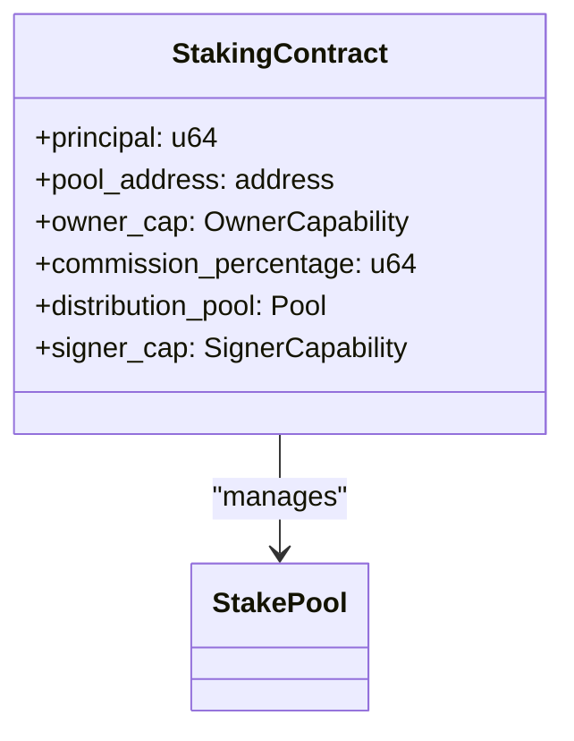

Sources: [aptos-move/framework/aptos-framework/sources/staking_contract.move]

The staking modules include functionality for:
- Adding and withdrawing stake
- Delegating voting power
- Configuring validators
- Distributing rewards
- Managing vesting schedules for token distributions

Sources: [aptos-move/framework/aptos-framework/sources/stake.move], [aptos-move/framework/aptos-framework/sources/delegation_pool.move], [aptos-move/framework/aptos-framework/sources/staking_contract.move], [aptos-move/framework/aptos-framework/sources/vesting.move]

## Governance System

The Aptos Governance system enables on-chain decision-making through proposals and voting. Voting power is calculated based on participants' stake in the network.

### Governance Flow

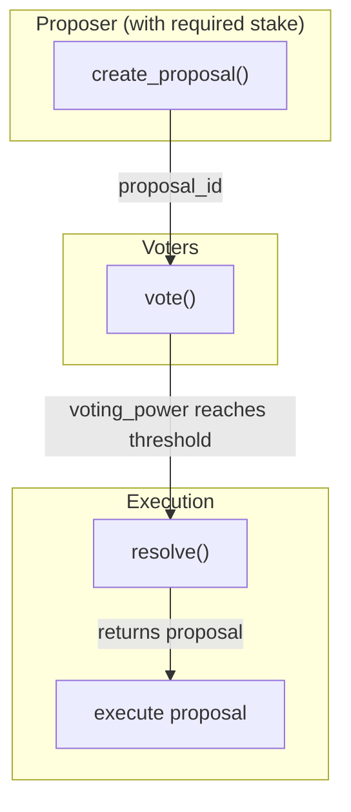

Sources: [aptos-move/framework/aptos-framework/sources/aptos_governance.move]

The governance system consists of:

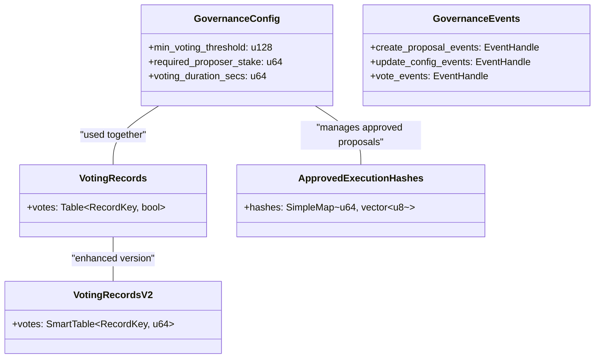

Sources: [aptos-move/framework/aptos-framework/doc/aptos_governance.md]

The governance system supports:
- Creation of proposals with execution scripts
- Voting based on stake
- Resolving and executing successful proposals
- Updating governance parameters
- Managing framework upgrades
- Partial voting for delegation pools

Sources: [aptos-move/framework/aptos-framework/sources/aptos_governance.move], [aptos-move/framework/aptos-framework/sources/voting.move]

## Resource Management

Resource accounts are special-purpose accounts managed independent of individual users. These accounts can be used to manage resources such as liquidity pools, marketplaces, or other application-specific assets.

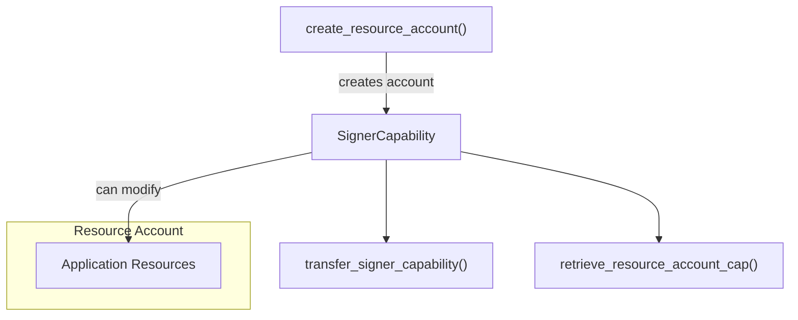

Sources: [aptos-move/framework/aptos-framework/sources/resource_account.move]

Resource accounts enable:
- Deployment of modules outside of user accounts
- Management of pooled assets
- Creation of contract-like functionality with independent account ownership
- Delegation of capabilities to other modules or users

Sources: [aptos-move/framework/aptos-framework/doc/resource_account.md]

## Genesis

The Genesis module is responsible for initializing the Aptos blockchain, setting up core accounts, and configuring initial validators. This process happens only once when the network is first launched.

```mermaid
flowchart TD
    Initialize["initialize()"] --> InitializeAptosCoin["initialize_aptos_coin()"]
    Initialize --> "stake::initialize()"
    Initialize --> "consensus_config::initialize()"
    Initialize --> "version::initialize()"
    
    InitializeAptosCoin --> StoreCapabilities["store capabilities in modules"]
    
    CreateAccounts["create_accounts()"] --> CreateValidators["create_initialize_validators()"]
    CreateValidators --> SetGenesisEnd["set_genesis_end()"]
    
    subgraph "Genesis Flow"
        Initialize
        InitializeAptosCoin
        CreateAccounts
        CreateValidators
        SetGenesisEnd
    end
```

Sources: [aptos-move/framework/aptos-framework/sources/genesis.move]

The genesis process includes:
- Creating framework and reserved accounts
- Initializing core modules (stake, consensus, version, etc.)
- Setting up the AptosCoin and its capabilities
- Creating initial validator set
- Distributing initial funds
- Marking the end of genesis

Sources: [aptos-move/framework/aptos-framework/sources/genesis.move]

## Framework Initialization and Capabilities

The Aptos Framework uses a capability-based security model to control privileged operations. During genesis, capabilities for operations like minting coins, modifying validator sets, and system configuration are created and assigned to appropriate modules.

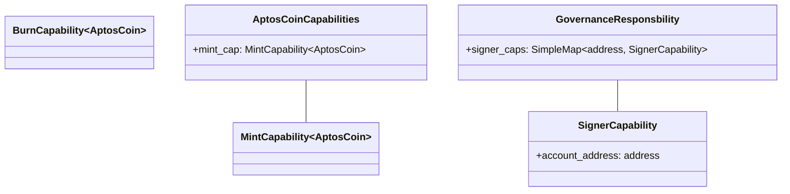

Sources: [aptos-move/framework/aptos-framework/sources/genesis.move], [aptos-move/framework/aptos-framework/sources/coin.move], [aptos-move/framework/aptos-framework/sources/aptos_governance.move]

The framework initialization process ensures proper capability distribution:
- Stake module receives the ability to mint AptosCoin for rewards
- Transaction fee module receives capabilities to burn AptosCoin for gas
- Governance receives signer capabilities for controlled accounts
- Other system modules receive capabilities required for their functions

This capability-based design ensures that only authorized modules can perform privileged operations, maintaining the security of the system.