# Fungible Asset System

Relevant source files

The following files were used as context for generating this wiki page:

- [aptos-move/framework/aptos-framework/doc/fungible_asset.md](https://github.com/aptos-labs/aptos-core/blob/b9f89a19/aptos-move/framework/aptos-framework/doc/fungible_asset.md)
- [aptos-move/framework/aptos-framework/doc/object.md](https://github.com/aptos-labs/aptos-core/blob/b9f89a19/aptos-move/framework/aptos-framework/doc/object.md)
- [aptos-move/framework/aptos-framework/doc/primary_fungible_store.md](https://github.com/aptos-labs/aptos-core/blob/b9f89a19/aptos-move/framework/aptos-framework/doc/primary_fungible_store.md)
- [aptos-move/framework/aptos-framework/sources/create_signer.move](https://github.com/aptos-labs/aptos-core/blob/b9f89a19/aptos-move/framework/aptos-framework/sources/create_signer.move)
- [aptos-move/framework/aptos-framework/sources/fungible_asset.move](https://github.com/aptos-labs/aptos-core/blob/b9f89a19/aptos-move/framework/aptos-framework/sources/fungible_asset.move)
- [aptos-move/framework/aptos-framework/sources/fungible_asset.spec.move](https://github.com/aptos-labs/aptos-core/blob/b9f89a19/aptos-move/framework/aptos-framework/sources/fungible_asset.spec.move)
- [aptos-move/framework/aptos-framework/sources/object.move](https://github.com/aptos-labs/aptos-core/blob/b9f89a19/aptos-move/framework/aptos-framework/sources/object.move)
- [aptos-move/framework/aptos-framework/sources/object.spec.move](https://github.com/aptos-labs/aptos-core/blob/b9f89a19/aptos-move/framework/aptos-framework/sources/object.spec.move)
- [aptos-move/framework/aptos-framework/sources/primary_fungible_store.move](https://github.com/aptos-labs/aptos-core/blob/b9f89a19/aptos-move/framework/aptos-framework/sources/primary_fungible_store.move)
- [aptos-move/framework/aptos-framework/sources/primary_fungible_store.spec.move](https://github.com/aptos-labs/aptos-core/blob/b9f89a19/aptos-move/framework/aptos-framework/sources/primary_fungible_store.spec.move)
- [aptos-move/framework/aptos-framework/tests/simple_dispatchable_token_pfs_tests.move](https://github.com/aptos-labs/aptos-core/blob/b9f89a19/aptos-move/framework/aptos-framework/tests/simple_dispatchable_token_pfs_tests.move)

The Fungible Asset System provides a framework for creating, managing, and transferring fungible assets in Aptos. Fungible assets are interchangeable units where each unit is equivalent to any other unit of the same type (e.g., cryptocurrencies, tokens). This system builds on the [Object Model](#2.1) to provide a comprehensive solution for on-chain assets.

For information about the specific implementation of APT (the Aptos coin), see the native Coin module documentation.

## Core Components

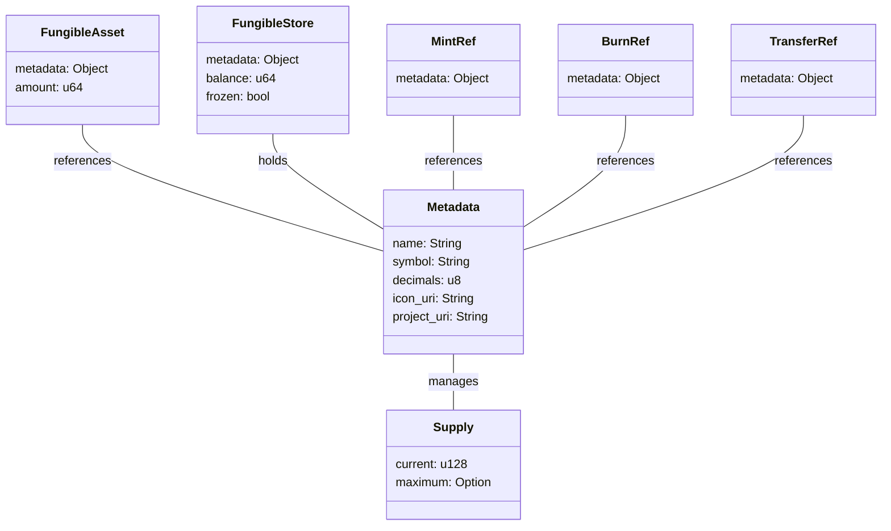

Sources: [aptos-move/framework/aptos-framework/sources/fungible_asset.move:124-139](https://github.com/aptos-labs/aptos-core/blob/b9f89a19/aptos-move/framework/aptos-framework/sources/fungible_asset.move#L124-L139), [aptos-move/framework/aptos-framework/sources/fungible_asset.move:147-156](https://github.com/aptos-labs/aptos-core/blob/b9f89a19/aptos-move/framework/aptos-framework/sources/fungible_asset.move#L147-L156), [aptos-move/framework/aptos-framework/sources/fungible_asset.move:176-181](https://github.com/aptos-labs/aptos-core/blob/b9f89a19/aptos-move/framework/aptos-framework/sources/fungible_asset.move#L176-L181), [aptos-move/framework/aptos-framework/sources/fungible_asset.move:183-187](https://github.com/aptos-labs/aptos-core/blob/b9f89a19/aptos-move/framework/aptos-framework/sources/fungible_asset.move#L183-L187), [aptos-move/framework/aptos-framework/sources/fungible_asset.move:189-192](https://github.com/aptos-labs/aptos-core/blob/b9f89a19/aptos-move/framework/aptos-framework/sources/fungible_asset.move#L189-L192), [aptos-move/framework/aptos-framework/sources/fungible_asset.move:204-207](https://github.com/aptos-labs/aptos-core/blob/b9f89a19/aptos-move/framework/aptos-framework/sources/fungible_asset.move#L204-L207)

### Key Components

1. **Metadata**: Holds information about a fungible asset (name, symbol, decimals, etc.)
2. **FungibleAsset**: Represents a specific amount of a fungible asset (ephemeral, must be deposited)
3. **FungibleStore**: Stores fungible assets for an object or account
4. **Supply**: Tracks current and maximum supply
5. **References**:
   - **MintRef**: Capability to mint new assets
   - **BurnRef**: Capability to burn assets
   - **TransferRef**: Capability to transfer assets or freeze/unfreeze stores

## Fungible Asset Lifecycle

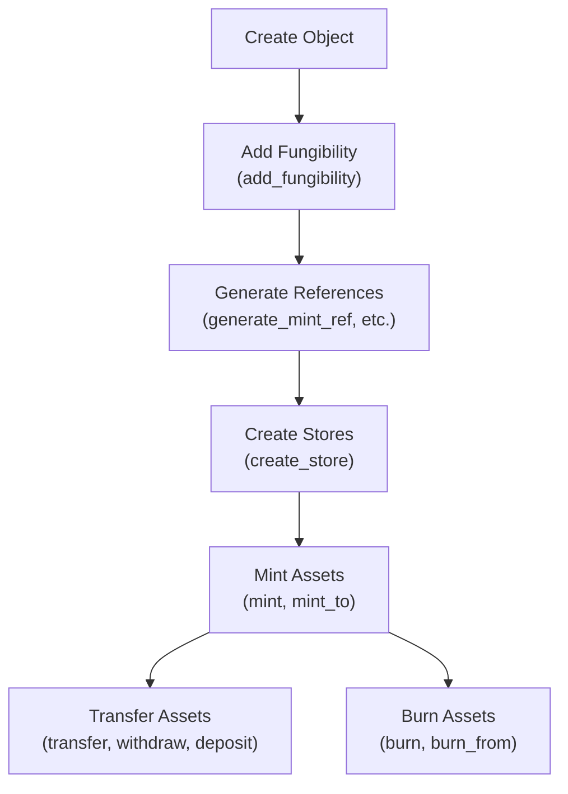

Sources: [aptos-move/framework/aptos-framework/sources/fungible_asset.move:266-307](https://github.com/aptos-labs/aptos-core/blob/b9f89a19/aptos-move/framework/aptos-framework/sources/fungible_asset.move#L266-L307), [aptos-move/framework/aptos-framework/sources/fungible_asset.move:472-516](https://github.com/aptos-labs/aptos-core/blob/b9f89a19/aptos-move/framework/aptos-framework/sources/fungible_asset.move#L472-L516)

## Creating Fungible Assets

To create a fungible asset:

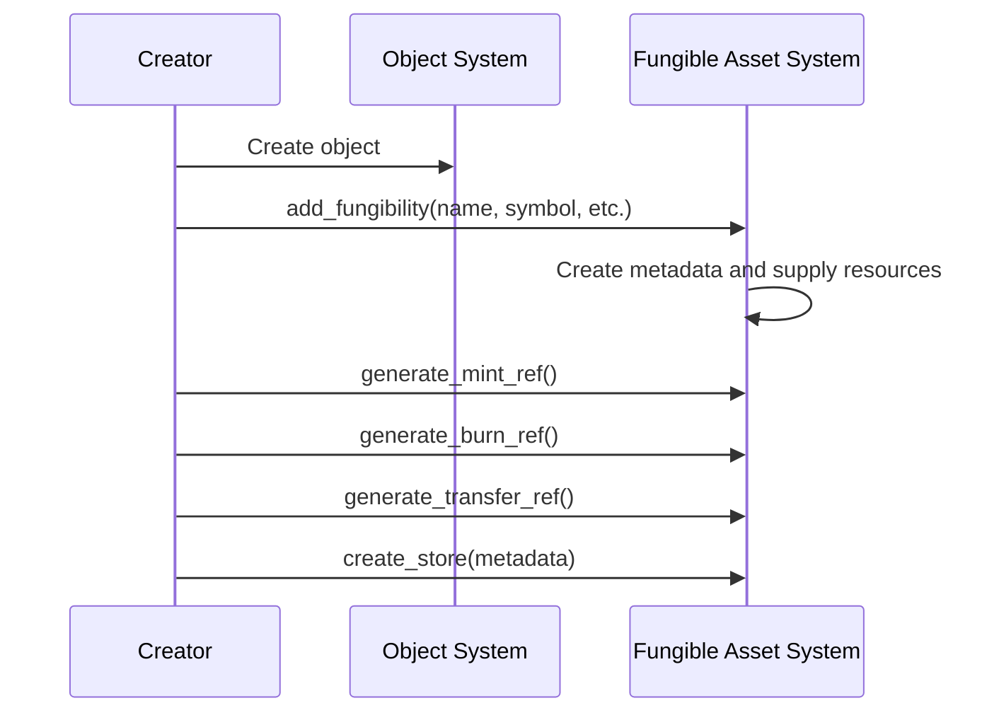

The process involves:

1. Create an object using the Object System
2. Call `add_fungibility` with metadata information
3. Generate references (MintRef, BurnRef, TransferRef)
4. Create stores for the asset

Sources: [aptos-move/framework/aptos-framework/sources/fungible_asset.move:266-307](https://github.com/aptos-labs/aptos-core/blob/b9f89a19/aptos-move/framework/aptos-framework/sources/fungible_asset.move#L266-L307), [aptos-move/framework/aptos-framework/sources/fungible_asset.move:472-516](https://github.com/aptos-labs/aptos-core/blob/b9f89a19/aptos-move/framework/aptos-framework/sources/fungible_asset.move#L472-L516), [aptos-move/framework/aptos-framework/sources/fungible_asset.move:821-843](https://github.com/aptos-labs/aptos-core/blob/b9f89a19/aptos-move/framework/aptos-framework/sources/fungible_asset.move#L821-L843)

## Core Operations

### Minting

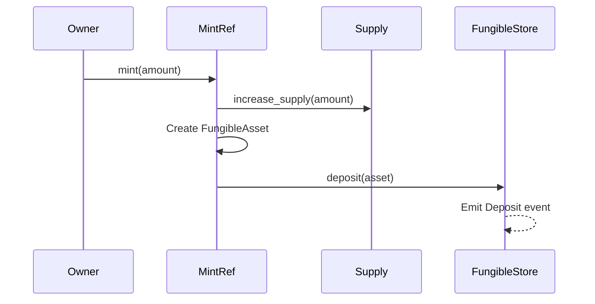

Sources: [aptos-move/framework/aptos-framework/sources/fungible_asset.move:1037-1067](https://github.com/aptos-labs/aptos-core/blob/b9f89a19/aptos-move/framework/aptos-framework/sources/fungible_asset.move#L1037-L1067)

### Transferring

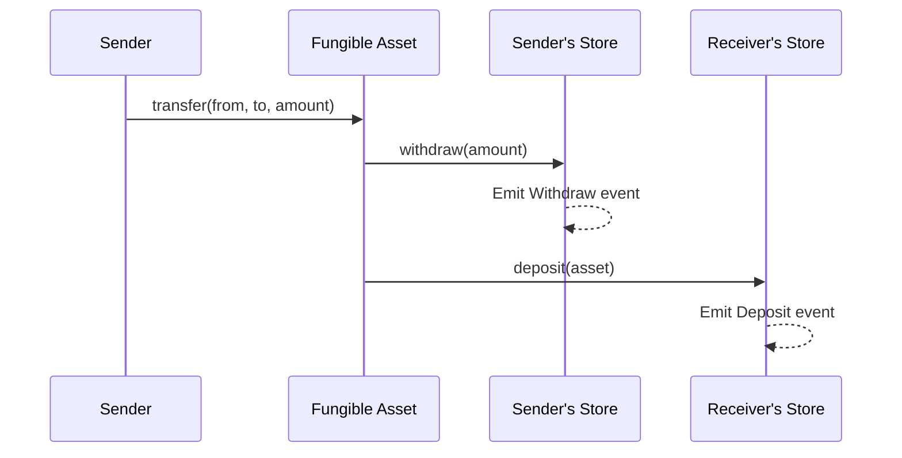

Sources: [aptos-move/framework/aptos-framework/sources/fungible_asset.move:809-817](https://github.com/aptos-labs/aptos-core/blob/b9f89a19/aptos-move/framework/aptos-framework/sources/fungible_asset.move#L809-L817)

### Burning

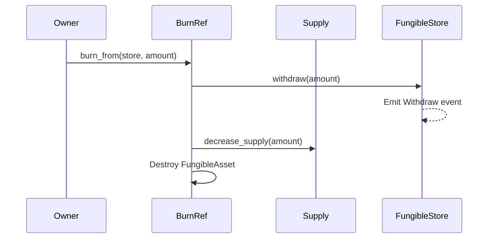

Sources: [aptos-move/framework/aptos-framework/sources/fungible_asset.move:1096-1126](https://github.com/aptos-labs/aptos-core/blob/b9f89a19/aptos-move/framework/aptos-framework/sources/fungible_asset.move#L1096-L1126)

## Primary Fungible Store

The Primary Fungible Store system provides deterministic stores for users, making it easier to manage fungible assets:

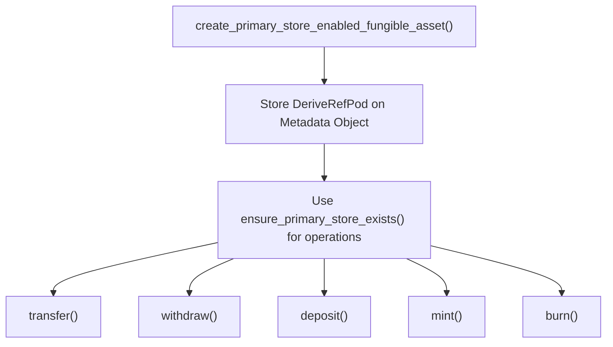

Key benefits:
- Deterministic addresses for stores that can be derived from user addresses
- Automatic creation of stores when needed
- Simplified transfer process
- Common interface for all fungible asset operations

Sources: [aptos-move/framework/aptos-framework/sources/primary_fungible_store.move:37-59](https://github.com/aptos-labs/aptos-core/blob/b9f89a19/aptos-move/framework/aptos-framework/sources/primary_fungible_store.move#L37-L59), [aptos-move/framework/aptos-framework/sources/primary_fungible_store.move:62-72](https://github.com/aptos-labs/aptos-core/blob/b9f89a19/aptos-move/framework/aptos-framework/sources/primary_fungible_store.move#L62-L72)

### Transfer Flow with Primary Fungible Store

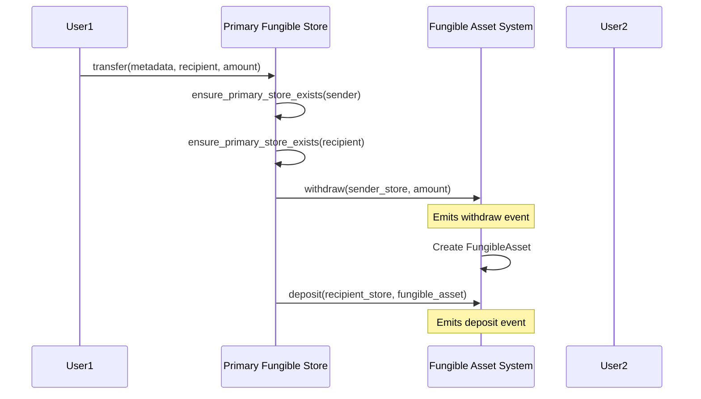

Sources: [aptos-move/framework/aptos-framework/sources/primary_fungible_store.move:220-231](https://github.com/aptos-labs/aptos-core/blob/b9f89a19/aptos-move/framework/aptos-framework/sources/primary_fungible_store.move#L220-L231), [aptos-move/framework/aptos-framework/sources/fungible_asset.move:884-935](https://github.com/aptos-labs/aptos-core/blob/b9f89a19/aptos-move/framework/aptos-framework/sources/fungible_asset.move#L884-L935)

## Advanced Features

### Concurrent Operations

The system supports concurrent operations through:
- `ConcurrentSupply`: Tracks supply using aggregators for higher throughput
- `ConcurrentFungibleBalance`: Tracks balances using aggregators for higher throughput

These features enable better performance in high-concurrency scenarios by reducing contention.

Sources: [aptos-move/framework/aptos-framework/sources/fungible_asset.move:117-120](https://github.com/aptos-labs/aptos-core/blob/b9f89a19/aptos-move/framework/aptos-framework/sources/fungible_asset.move#L117-L120), [aptos-move/framework/aptos-framework/sources/fungible_asset.move:171-174](https://github.com/aptos-labs/aptos-core/blob/b9f89a19/aptos-move/framework/aptos-framework/sources/fungible_asset.move#L171-L174)

### Dispatchable Functionality

The system supports custom dispatch functions for:
- Withdrawals
- Deposits
- Balance derivation
- Supply derivation

This enables extensibility for specialized use cases and custom asset behavior.

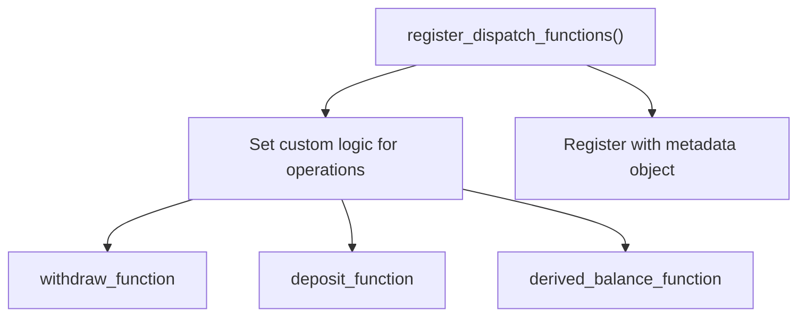

Sources: [aptos-move/framework/aptos-framework/sources/fungible_asset.move:327-406](https://github.com/aptos-labs/aptos-core/blob/b9f89a19/aptos-move/framework/aptos-framework/sources/fungible_asset.move#L327-L406), [aptos-move/framework/aptos-framework/sources/fungible_asset.move:409-449](https://github.com/aptos-labs/aptos-core/blob/b9f89a19/aptos-move/framework/aptos-framework/sources/fungible_asset.move#L409-L449)

## Security Constraints

The system enforces several security constraints:

- **Owner-based access control**: Only store owners can withdraw assets (unless using a TransferRef)
- **Frozen store protection**: Frozen stores prevent unauthorized transfers
- **Type safety**: Only compatible assets can be deposited in a store
- **Supply limits**: Optional maximum supply is enforced
- **Metadata validation**: Operations validate metadata compatibility

Sources: [aptos-move/framework/aptos-framework/sources/fungible_asset.move:886-890](https://github.com/aptos-labs/aptos-core/blob/b9f89a19/aptos-move/framework/aptos-framework/sources/fungible_asset.move#L886-L890), [aptos-move/framework/aptos-framework/sources/fungible_asset.move:885](https://github.com/aptos-labs/aptos-core/blob/b9f89a19/aptos-move/framework/aptos-framework/sources/fungible_asset.move#L885)

## Resource Management

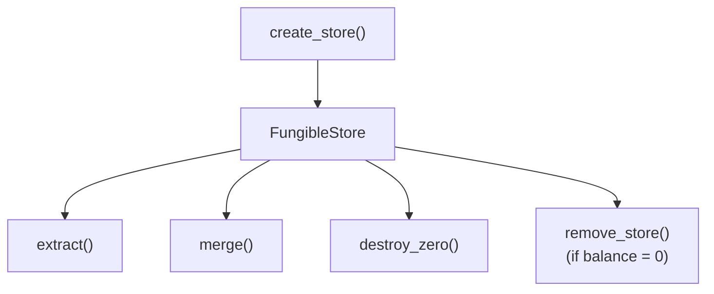

The system supports:
- Creating stores for any object
- Removing stores (only if balance is zero)
- Extracting portions of fungible assets
- Merging fungible assets
- Destroying zero-balance fungible assets

Sources: [aptos-move/framework/aptos-framework/sources/fungible_asset.move:821-843](https://github.com/aptos-labs/aptos-core/blob/b9f89a19/aptos-move/framework/aptos-framework/sources/fungible_asset.move#L821-L843), [aptos-move/framework/aptos-framework/sources/fungible_asset.move:846-874](https://github.com/aptos-labs/aptos-core/blob/b9f89a19/aptos-move/framework/aptos-framework/sources/fungible_asset.move#L846-L874), [aptos-move/framework/aptos-framework/sources/fungible_asset.move:1438-1457](https://github.com/aptos-labs/aptos-core/blob/b9f89a19/aptos-move/framework/aptos-framework/sources/fungible_asset.move#L1438-L1457)

## Integration with the Object System

The Fungible Asset System is built on top of the Object Model, leveraging its capabilities:

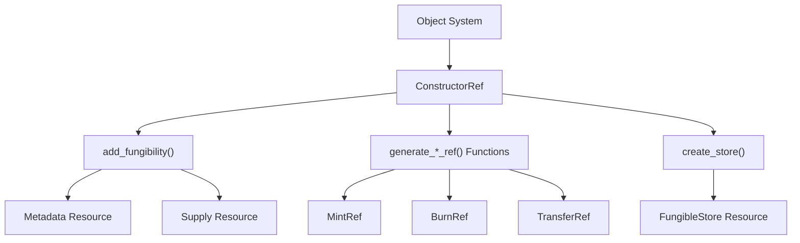

This integration provides several benefits:
- Object-based storage for all fungible asset components
- Unified ownership model with other objects
- Capability-based security through references
- Resource groups for gas efficiency

Sources: [aptos-move/framework/aptos-framework/sources/fungible_asset.move:8-9](https://github.com/aptos-labs/aptos-core/blob/b9f89a19/aptos-move/framework/aptos-framework/sources/fungible_asset.move#L8-L9), [aptos-move/framework/aptos-framework/sources/fungible_asset.move:266-307](https://github.com/aptos-labs/aptos-core/blob/b9f89a19/aptos-move/framework/aptos-framework/sources/fungible_asset.move#L266-L307)

## Key Design Principles

1. **Separation of concerns**: Metadata, stores, and capabilities are distinct
2. **Capability-based security**: References provide controlled access to operations
3. **Extensibility**: Dispatchable functions allow custom behaviors
4. **Efficiency**: Concurrent operations and resource groups optimize gas usage
5. **User experience**: Primary stores simplify asset management