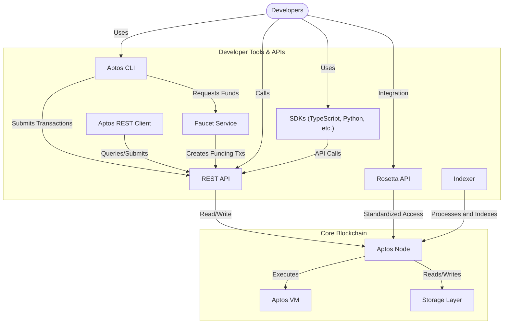
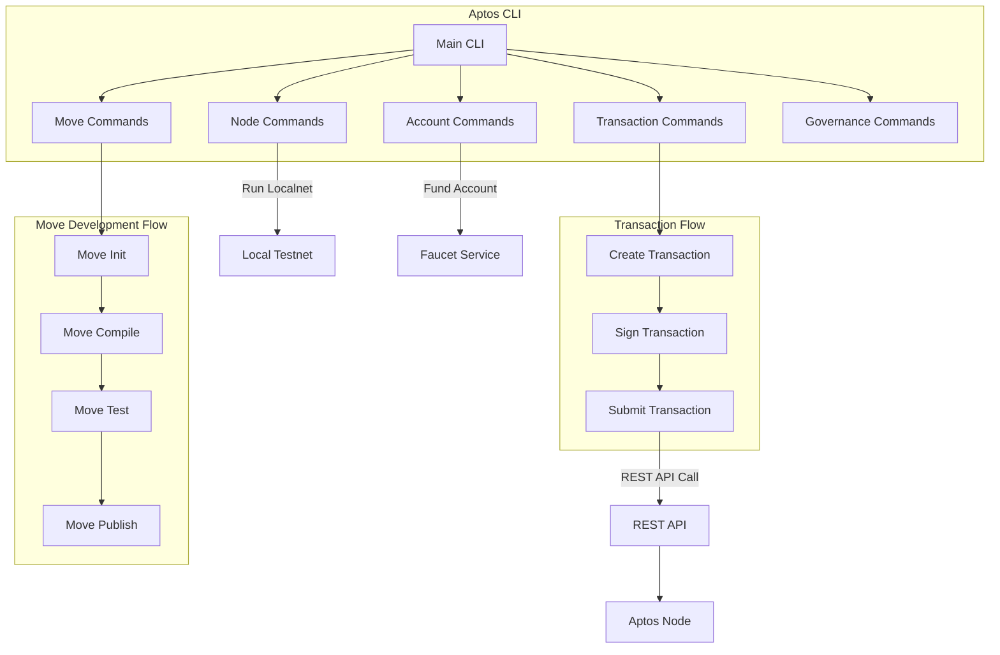
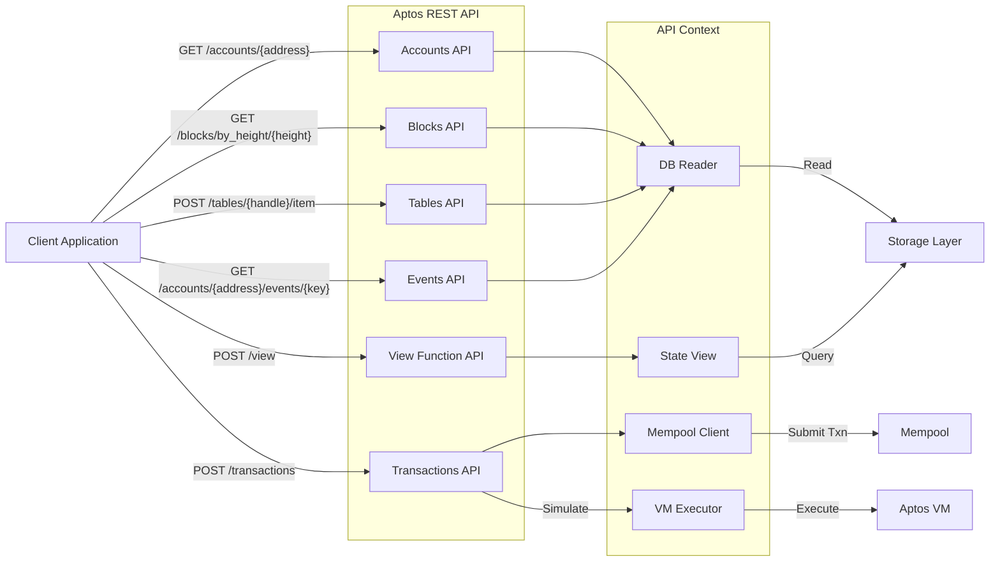
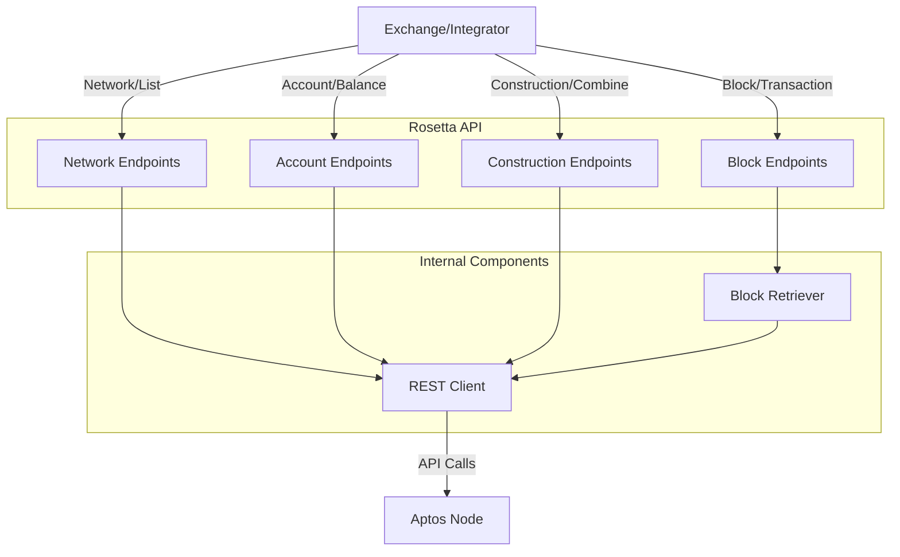
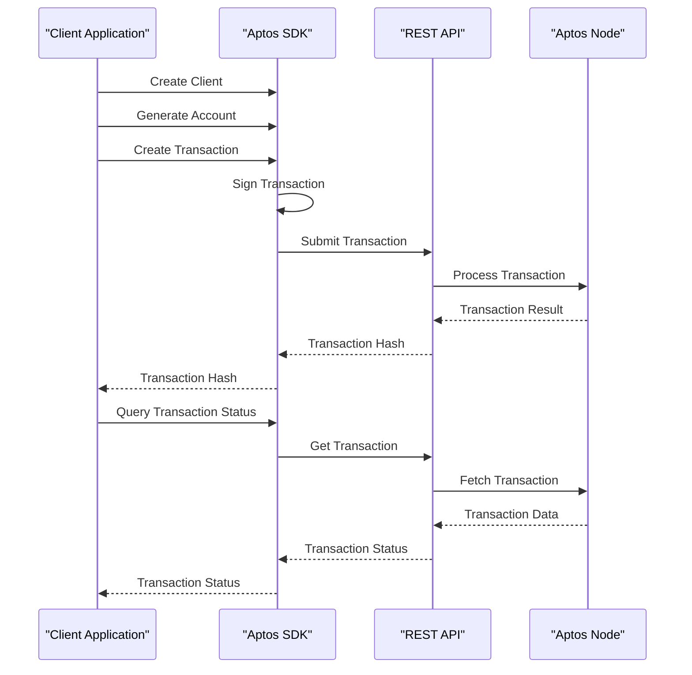
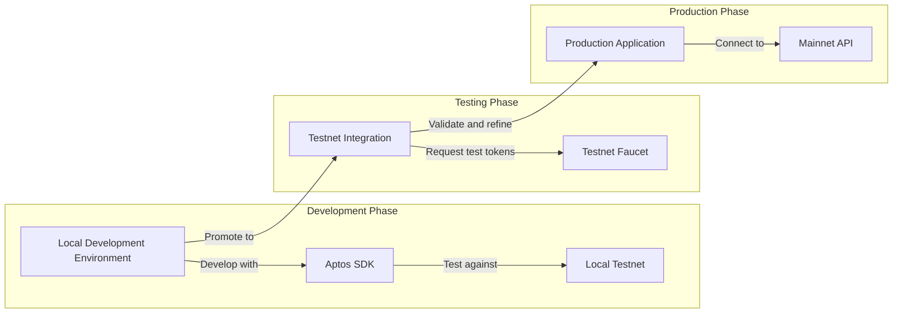
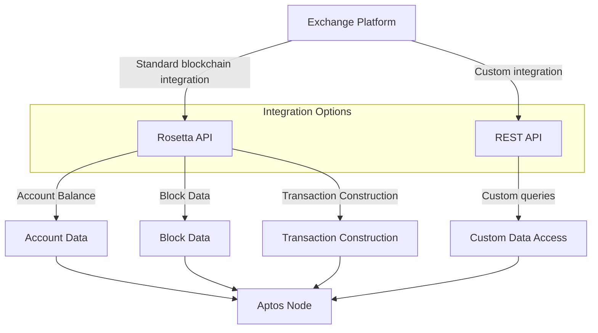

# Developer Tools & APIs

<details>
<summary>Relevant source files</summary>

The following files were used as context for generating this wiki page:

- [Cargo.lock](https://github.com/aptos-labs/aptos-core/blob/b9f89a19/Cargo.lock)
- [Cargo.toml](https://github.com/aptos-labs/aptos-core/blob/b9f89a19/Cargo.toml)
- [api/doc/spec.json](https://github.com/aptos-labs/aptos-core/blob/b9f89a19/api/doc/spec.json)
- [api/doc/spec.yaml](https://github.com/aptos-labs/aptos-core/blob/b9f89a19/api/doc/spec.yaml)
- [api/goldens/aptos_api__tests__transactions_test__test_get_transactions_param_limit_exceeds_limit.json](https://github.com/aptos-labs/aptos-core/blob/b9f89a19/api/goldens/aptos_api__tests__transactions_test__test_get_transactions_param_limit_exceeds_limit.json)
- [api/goldens/aptos_api__tests__transactions_test__test_get_transactions_with_start_version_is_too_large.json](https://github.com/aptos-labs/aptos-core/blob/b9f89a19/api/goldens/aptos_api__tests__transactions_test__test_get_transactions_with_start_version_is_too_large.json)
- [api/goldens/aptos_api__tests__transactions_test__test_get_transactions_with_zero_limit.json](https://github.com/aptos-labs/aptos-core/blob/b9f89a19/api/goldens/aptos_api__tests__transactions_test__test_get_transactions_with_zero_limit.json)
- [api/goldens/aptos_api__tests__transactions_test__test_post_invalid_signature_transaction.json](https://github.com/aptos-labs/aptos-core/blob/b9f89a19/api/goldens/aptos_api__tests__transactions_test__test_post_invalid_signature_transaction.json)
- [api/src/accept_type.rs](https://github.com/aptos-labs/aptos-core/blob/b9f89a19/api/src/accept_type.rs)
- [api/src/accounts.rs](https://github.com/aptos-labs/aptos-core/blob/b9f89a19/api/src/accounts.rs)
- [api/src/basic.rs](https://github.com/aptos-labs/aptos-core/blob/b9f89a19/api/src/basic.rs)
- [api/src/bcs_payload.rs](https://github.com/aptos-labs/aptos-core/blob/b9f89a19/api/src/bcs_payload.rs)
- [api/src/blocks.rs](https://github.com/aptos-labs/aptos-core/blob/b9f89a19/api/src/blocks.rs)
- [api/src/context.rs](https://github.com/aptos-labs/aptos-core/blob/b9f89a19/api/src/context.rs)
- [api/src/events.rs](https://github.com/aptos-labs/aptos-core/blob/b9f89a19/api/src/events.rs)
- [api/src/index.rs](https://github.com/aptos-labs/aptos-core/blob/b9f89a19/api/src/index.rs)
- [api/src/lib.rs](https://github.com/aptos-labs/aptos-core/blob/b9f89a19/api/src/lib.rs)
- [api/src/page.rs](https://github.com/aptos-labs/aptos-core/blob/b9f89a19/api/src/page.rs)
- [api/src/response.rs](https://github.com/aptos-labs/aptos-core/blob/b9f89a19/api/src/response.rs)
- [api/src/state.rs](https://github.com/aptos-labs/aptos-core/blob/b9f89a19/api/src/state.rs)
- [api/src/tests/accounts_test.rs](https://github.com/aptos-labs/aptos-core/blob/b9f89a19/api/src/tests/accounts_test.rs)
- [api/src/tests/mod.rs](https://github.com/aptos-labs/aptos-core/blob/b9f89a19/api/src/tests/mod.rs)
- [api/src/tests/transactions_test.rs](https://github.com/aptos-labs/aptos-core/blob/b9f89a19/api/src/tests/transactions_test.rs)
- [api/src/transactions.rs](https://github.com/aptos-labs/aptos-core/blob/b9f89a19/api/src/transactions.rs)
- [api/test-context/src/test_context.rs](https://github.com/aptos-labs/aptos-core/blob/b9f89a19/api/test-context/src/test_context.rs)
- [api/types/src/error.rs](https://github.com/aptos-labs/aptos-core/blob/b9f89a19/api/types/src/error.rs)
- [api/types/src/mime_types.rs](https://github.com/aptos-labs/aptos-core/blob/b9f89a19/api/types/src/mime_types.rs)
- [aptos-move/framework/src/built_package.rs](https://github.com/aptos-labs/aptos-core/blob/b9f89a19/aptos-move/framework/src/built_package.rs)
- [aptos-node/Cargo.toml](https://github.com/aptos-labs/aptos-core/blob/b9f89a19/aptos-node/Cargo.toml)
- [aptos-node/src/lib.rs](https://github.com/aptos-labs/aptos-core/blob/b9f89a19/aptos-node/src/lib.rs)
- [aptos-node/src/logger.rs](https://github.com/aptos-labs/aptos-core/blob/b9f89a19/aptos-node/src/logger.rs)
- [aptos-node/src/services.rs](https://github.com/aptos-labs/aptos-core/blob/b9f89a19/aptos-node/src/services.rs)
- [aptos-node/src/storage.rs](https://github.com/aptos-labs/aptos-core/blob/b9f89a19/aptos-node/src/storage.rs)
- [config/src/config/mod.rs](https://github.com/aptos-labs/aptos-core/blob/b9f89a19/config/src/config/mod.rs)
- [config/src/config/node_config.rs](https://github.com/aptos-labs/aptos-core/blob/b9f89a19/config/src/config/node_config.rs)
- [consensus/Cargo.toml](https://github.com/aptos-labs/aptos-core/blob/b9f89a19/consensus/Cargo.toml)
- [consensus/src/consensus_provider.rs](https://github.com/aptos-labs/aptos-core/blob/b9f89a19/consensus/src/consensus_provider.rs)
- [crates/aptos-genesis/Cargo.toml](https://github.com/aptos-labs/aptos-core/blob/b9f89a19/crates/aptos-genesis/Cargo.toml)
- [crates/aptos-rest-client/Cargo.toml](https://github.com/aptos-labs/aptos-core/blob/b9f89a19/crates/aptos-rest-client/Cargo.toml)
- [crates/aptos-rest-client/src/lib.rs](https://github.com/aptos-labs/aptos-core/blob/b9f89a19/crates/aptos-rest-client/src/lib.rs)
- [crates/aptos-rosetta-cli/Cargo.toml](https://github.com/aptos-labs/aptos-core/blob/b9f89a19/crates/aptos-rosetta-cli/Cargo.toml)
- [crates/aptos-rosetta-cli/README.md](https://github.com/aptos-labs/aptos-core/blob/b9f89a19/crates/aptos-rosetta-cli/README.md)
- [crates/aptos-rosetta-cli/src/account.rs](https://github.com/aptos-labs/aptos-core/blob/b9f89a19/crates/aptos-rosetta-cli/src/account.rs)
- [crates/aptos-rosetta-cli/src/block.rs](https://github.com/aptos-labs/aptos-core/blob/b9f89a19/crates/aptos-rosetta-cli/src/block.rs)
- [crates/aptos-rosetta-cli/src/common.rs](https://github.com/aptos-labs/aptos-core/blob/b9f89a19/crates/aptos-rosetta-cli/src/common.rs)
- [crates/aptos-rosetta-cli/src/construction.rs](https://github.com/aptos-labs/aptos-core/blob/b9f89a19/crates/aptos-rosetta-cli/src/construction.rs)
- [crates/aptos-rosetta-cli/src/network.rs](https://github.com/aptos-labs/aptos-core/blob/b9f89a19/crates/aptos-rosetta-cli/src/network.rs)
- [crates/aptos-rosetta/Cargo.toml](https://github.com/aptos-labs/aptos-core/blob/b9f89a19/crates/aptos-rosetta/Cargo.toml)
- [crates/aptos-rosetta/src/account.rs](https://github.com/aptos-labs/aptos-core/blob/b9f89a19/crates/aptos-rosetta/src/account.rs)
- [crates/aptos-rosetta/src/block.rs](https://github.com/aptos-labs/aptos-core/blob/b9f89a19/crates/aptos-rosetta/src/block.rs)
- [crates/aptos-rosetta/src/client.rs](https://github.com/aptos-labs/aptos-core/blob/b9f89a19/crates/aptos-rosetta/src/client.rs)
- [crates/aptos-rosetta/src/common.rs](https://github.com/aptos-labs/aptos-core/blob/b9f89a19/crates/aptos-rosetta/src/common.rs)
- [crates/aptos-rosetta/src/construction.rs](https://github.com/aptos-labs/aptos-core/blob/b9f89a19/crates/aptos-rosetta/src/construction.rs)
- [crates/aptos-rosetta/src/error.rs](https://github.com/aptos-labs/aptos-core/blob/b9f89a19/crates/aptos-rosetta/src/error.rs)
- [crates/aptos-rosetta/src/lib.rs](https://github.com/aptos-labs/aptos-core/blob/b9f89a19/crates/aptos-rosetta/src/lib.rs)
- [crates/aptos-rosetta/src/main.rs](https://github.com/aptos-labs/aptos-core/blob/b9f89a19/crates/aptos-rosetta/src/main.rs)
- [crates/aptos-rosetta/src/network.rs](https://github.com/aptos-labs/aptos-core/blob/b9f89a19/crates/aptos-rosetta/src/network.rs)
- [crates/aptos-rosetta/src/types/identifiers.rs](https://github.com/aptos-labs/aptos-core/blob/b9f89a19/crates/aptos-rosetta/src/types/identifiers.rs)
- [crates/aptos-rosetta/src/types/misc.rs](https://github.com/aptos-labs/aptos-core/blob/b9f89a19/crates/aptos-rosetta/src/types/misc.rs)
- [crates/aptos-rosetta/src/types/move_types.rs](https://github.com/aptos-labs/aptos-core/blob/b9f89a19/crates/aptos-rosetta/src/types/move_types.rs)
- [crates/aptos-rosetta/src/types/objects.rs](https://github.com/aptos-labs/aptos-core/blob/b9f89a19/crates/aptos-rosetta/src/types/objects.rs)
- [crates/aptos-rosetta/src/types/requests.rs](https://github.com/aptos-labs/aptos-core/blob/b9f89a19/crates/aptos-rosetta/src/types/requests.rs)
- [crates/aptos/CHANGELOG.md](https://github.com/aptos-labs/aptos-core/blob/b9f89a19/crates/aptos/CHANGELOG.md)
- [crates/aptos/Cargo.toml](https://github.com/aptos-labs/aptos-core/blob/b9f89a19/crates/aptos/Cargo.toml)
- [crates/aptos/src/account/create.rs](https://github.com/aptos-labs/aptos-core/blob/b9f89a19/crates/aptos/src/account/create.rs)
- [crates/aptos/src/account/create_resource_account.rs](https://github.com/aptos-labs/aptos-core/blob/b9f89a19/crates/aptos/src/account/create_resource_account.rs)
- [crates/aptos/src/account/fund.rs](https://github.com/aptos-labs/aptos-core/blob/b9f89a19/crates/aptos/src/account/fund.rs)
- [crates/aptos/src/account/list.rs](https://github.com/aptos-labs/aptos-core/blob/b9f89a19/crates/aptos/src/account/list.rs)
- [crates/aptos/src/account/transfer.rs](https://github.com/aptos-labs/aptos-core/blob/b9f89a19/crates/aptos/src/account/transfer.rs)
- [crates/aptos/src/common/init.rs](https://github.com/aptos-labs/aptos-core/blob/b9f89a19/crates/aptos/src/common/init.rs)
- [crates/aptos/src/common/types.rs](https://github.com/aptos-labs/aptos-core/blob/b9f89a19/crates/aptos/src/common/types.rs)
- [crates/aptos/src/common/utils.rs](https://github.com/aptos-labs/aptos-core/blob/b9f89a19/crates/aptos/src/common/utils.rs)
- [crates/aptos/src/config/mod.rs](https://github.com/aptos-labs/aptos-core/blob/b9f89a19/crates/aptos/src/config/mod.rs)
- [crates/aptos/src/governance/mod.rs](https://github.com/aptos-labs/aptos-core/blob/b9f89a19/crates/aptos/src/governance/mod.rs)
- [crates/aptos/src/main.rs](https://github.com/aptos-labs/aptos-core/blob/b9f89a19/crates/aptos/src/main.rs)
- [crates/aptos/src/move_tool/coverage.rs](https://github.com/aptos-labs/aptos-core/blob/b9f89a19/crates/aptos/src/move_tool/coverage.rs)
- [crates/aptos/src/move_tool/lint.rs](https://github.com/aptos-labs/aptos-core/blob/b9f89a19/crates/aptos/src/move_tool/lint.rs)
- [crates/aptos/src/move_tool/mod.rs](https://github.com/aptos-labs/aptos-core/blob/b9f89a19/crates/aptos/src/move_tool/mod.rs)
- [crates/aptos/src/move_tool/show.rs](https://github.com/aptos-labs/aptos-core/blob/b9f89a19/crates/aptos/src/move_tool/show.rs)
- [crates/aptos/src/node/local_testnet/faucet.rs](https://github.com/aptos-labs/aptos-core/blob/b9f89a19/crates/aptos/src/node/local_testnet/faucet.rs)
- [crates/aptos/src/node/local_testnet/health_checker.rs](https://github.com/aptos-labs/aptos-core/blob/b9f89a19/crates/aptos/src/node/local_testnet/health_checker.rs)
- [crates/aptos/src/node/local_testnet/indexer_api.rs](https://github.com/aptos-labs/aptos-core/blob/b9f89a19/crates/aptos/src/node/local_testnet/indexer_api.rs)
- [crates/aptos/src/node/local_testnet/mod.rs](https://github.com/aptos-labs/aptos-core/blob/b9f89a19/crates/aptos/src/node/local_testnet/mod.rs)
- [crates/aptos/src/node/local_testnet/node.rs](https://github.com/aptos-labs/aptos-core/blob/b9f89a19/crates/aptos/src/node/local_testnet/node.rs)
- [crates/aptos/src/node/local_testnet/postgres.rs](https://github.com/aptos-labs/aptos-core/blob/b9f89a19/crates/aptos/src/node/local_testnet/postgres.rs)
- [crates/aptos/src/node/local_testnet/processors.rs](https://github.com/aptos-labs/aptos-core/blob/b9f89a19/crates/aptos/src/node/local_testnet/processors.rs)
- [crates/aptos/src/node/local_testnet/ready_server.rs](https://github.com/aptos-labs/aptos-core/blob/b9f89a19/crates/aptos/src/node/local_testnet/ready_server.rs)
- [crates/aptos/src/node/local_testnet/traits.rs](https://github.com/aptos-labs/aptos-core/blob/b9f89a19/crates/aptos/src/node/local_testnet/traits.rs)
- [crates/aptos/src/node/local_testnet/utils.rs](https://github.com/aptos-labs/aptos-core/blob/b9f89a19/crates/aptos/src/node/local_testnet/utils.rs)
- [crates/aptos/src/node/mod.rs](https://github.com/aptos-labs/aptos-core/blob/b9f89a19/crates/aptos/src/node/mod.rs)
- [crates/aptos/src/stake/mod.rs](https://github.com/aptos-labs/aptos-core/blob/b9f89a19/crates/aptos/src/stake/mod.rs)
- [crates/aptos/src/test/mod.rs](https://github.com/aptos-labs/aptos-core/blob/b9f89a19/crates/aptos/src/test/mod.rs)
- [ecosystem/indexer-grpc/indexer-grpc-table-info/src/internal_indexer_db_service.rs](https://github.com/aptos-labs/aptos-core/blob/b9f89a19/ecosystem/indexer-grpc/indexer-grpc-table-info/src/internal_indexer_db_service.rs)
- [ecosystem/indexer-grpc/indexer-transaction-generator/src/script_transaction_generator.rs](https://github.com/aptos-labs/aptos-core/blob/b9f89a19/ecosystem/indexer-grpc/indexer-transaction-generator/src/script_transaction_generator.rs)
- [storage/indexer/src/db_indexer.rs](https://github.com/aptos-labs/aptos-core/blob/b9f89a19/storage/indexer/src/db_indexer.rs)
- [storage/indexer/src/indexer_reader.rs](https://github.com/aptos-labs/aptos-core/blob/b9f89a19/storage/indexer/src/indexer_reader.rs)
- [testsuite/forge-cli/src/README.md](https://github.com/aptos-labs/aptos-core/blob/b9f89a19/testsuite/forge-cli/src/README.md)
- [testsuite/forge/src/interface/aptos.rs](https://github.com/aptos-labs/aptos-core/blob/b9f89a19/testsuite/forge/src/interface/aptos.rs)
- [testsuite/smoke-test/src/rest_api.rs](https://github.com/aptos-labs/aptos-core/blob/b9f89a19/testsuite/smoke-test/src/rest_api.rs)
- [testsuite/smoke-test/src/rosetta.rs](https://github.com/aptos-labs/aptos-core/blob/b9f89a19/testsuite/smoke-test/src/rosetta.rs)
- [testsuite/smoke-test/src/transaction.rs](https://github.com/aptos-labs/aptos-core/blob/b9f89a19/testsuite/smoke-test/src/transaction.rs)
- [types/src/indexer/indexer_db_reader.rs](https://github.com/aptos-labs/aptos-core/blob/b9f89a19/types/src/indexer/indexer_db_reader.rs)

</details>


This page provides an overview of the tools and interfaces available for developers to interact with the Aptos blockchain. These tools and APIs form the primary connection points between developers and the underlying blockchain infrastructure, enabling the creation, deployment, and management of applications on the Aptos network.

## Overview

Aptos offers a comprehensive suite of developer tools and APIs designed to provide flexible, reliable methods for interacting with the blockchain at various levels of abstraction:



Sources:
- [crates/aptos/Cargo.toml](https://github.com/aptos-labs/aptos-core/blob/b9f89a19/crates/aptos/Cargo.toml)
- [crates/aptos-rest-client/src/lib.rs](https://github.com/aptos-labs/aptos-core/blob/b9f89a19/crates/aptos-rest-client/src/lib.rs)
- [crates/aptos-rosetta/src/lib.rs](https://github.com/aptos-labs/aptos-core/blob/b9f89a19/crates/aptos-rosetta/src/lib.rs)
- [api/src/context.rs](https://github.com/aptos-labs/aptos-core/blob/b9f89a19/api/src/context.rs)

## Aptos CLI

The Aptos CLI (Command Line Interface) is a comprehensive tool for developers to interact with the Aptos blockchain. It provides functionality for account management, transaction submission, Move development, and blockchain interaction.

### Key Features

- **Account Management**: Create, fund, and manage Aptos accounts
- **Move Development**: Compile, test, and deploy Move smart contracts
- **Transaction Management**: Submit and monitor transactions
- **Local Development**: Run a local testnet for development and testing
- **Node Operations**: Analyze validator performance and manage validator nodes
- **Network Utilities**: Check network connectivity and view blockchain information

### CLI Architecture



Sources:
- [crates/aptos/src/move_tool/mod.rs](https://github.com/aptos-labs/aptos-core/blob/b9f89a19/crates/aptos/src/move_tool/mod.rs)
- [crates/aptos/src/common/types.rs](https://github.com/aptos-labs/aptos-core/blob/b9f89a19/crates/aptos/src/common/types.rs)
- [crates/aptos/src/node/mod.rs](https://github.com/aptos-labs/aptos-core/blob/b9f89a19/crates/aptos/src/node/mod.rs)
- [crates/aptos/src/governance/mod.rs](https://github.com/aptos-labs/aptos-core/blob/b9f89a19/crates/aptos/src/governance/mod.rs)
- [crates/aptos/Cargo.toml](https://github.com/aptos-labs/aptos-core/blob/b9f89a19/crates/aptos/Cargo.toml)
- [crates/aptos/CHANGELOG.md](https://github.com/aptos-labs/aptos-core/blob/b9f89a19/crates/aptos/CHANGELOG.md)

### Example CLI Commands

| Category | Command | Description |
|----------|---------|-------------|
| Account | `aptos init` | Initialize CLI configuration |
| Account | `aptos account create` | Create a new account |
| Account | `aptos account fund-with-faucet` | Fund account with test tokens |
| Move | `aptos move compile` | Compile Move packages |
| Move | `aptos move publish` | Publish Move packages to chain |
| Move | `aptos move run` | Run a Move function |
| Node | `aptos node run-localnet` | Run a local testnet |
| Transaction | `aptos transaction submit` | Submit a signed transaction |

Sources:
- [crates/aptos/CHANGELOG.md](https://github.com/aptos-labs/aptos-core/blob/b9f89a19/crates/aptos/CHANGELOG.md)
- [crates/aptos/src/test/mod.rs](https://github.com/aptos-labs/aptos-core/blob/b9f89a19/crates/aptos/src/test/mod.rs)
- [crates/aptos/src/common/init.rs](https://github.com/aptos-labs/aptos-core/blob/b9f89a19/crates/aptos/src/common/init.rs)

## REST API

The Aptos REST API is a RESTful interface that provides client applications with the ability to interact with the Aptos blockchain through HTTP requests. It serves as the primary integration point for applications to read blockchain state and submit transactions.

### Key Features

- **Account Access**: Query account resources, modules, and events
- **Transaction Management**: Submit, view, and wait for transactions
- **Block Information**: Retrieve block data by height or version
- **Table Access**: Query tables in the Aptos state database
- **Event Streaming**: Monitor events emitted by transactions
- **View Functions**: Execute read-only functions without submitting transactions
- **Gas Estimation**: Estimate gas costs for transactions

### API Endpoints



Sources:
- [api/src/transactions.rs](https://github.com/aptos-labs/aptos-core/blob/b9f89a19/api/src/transactions.rs)
- [api/src/context.rs](https://github.com/aptos-labs/aptos-core/blob/b9f89a19/api/src/context.rs)
- [api/doc/spec.json](https://github.com/aptos-labs/aptos-core/blob/b9f89a19/api/doc/spec.json)
- [api/doc/spec.yaml](https://github.com/aptos-labs/aptos-core/blob/b9f89a19/api/doc/spec.yaml)

### Content Types

The API supports multiple content types to accommodate different client needs:

- **JSON**: Standard JSON encoding for human readability (`application/json`)
- **BCS**: Binary Canonical Serialization for efficient and deterministic encoding (`application/x.aptos.serialized+bcs`)

### Authentication and Rate Limiting

- **API Keys**: Optional API keys for higher rate limits
- **Rate Limiting**: Prevents abuse by limiting request frequency

Sources:
- [api/doc/spec.yaml](https://github.com/aptos-labs/aptos-core/blob/b9f89a19/api/doc/spec.yaml)
- [crates/aptos-rest-client/src/lib.rs](https://github.com/aptos-labs/aptos-core/blob/b9f89a19/crates/aptos-rest-client/src/lib.rs)
- [testsuite/smoke-test/src/rest_api.rs](https://github.com/aptos-labs/aptos-core/blob/b9f89a19/testsuite/smoke-test/src/rest_api.rs)

## Aptos REST Client

The Aptos REST Client is a Rust client library for interacting with the Aptos REST API. It provides a programmatic interface that handles serialization, error handling, and response parsing.

### Key Features

- **Builder Pattern**: Flexible client construction
- **Transaction Submission**: Methods to submit and track transactions
- **Account Management**: Query account resources and events
- **BCS Support**: Native support for binary canonical serialization
- **Pagination**: Utilities for handling paginated results
- **Error Handling**: Structured error types for API responses

### Usage Example

```rust
// Create a client
let client = Client::new(url);

// Get account resources
let resources = client.get_account_resources(address).await?;

// Submit a transaction
let txn_response = client
    .submit_and_wait_for_transaction(signed_transaction)
    .await?;
```

Sources:
- [crates/aptos-rest-client/src/lib.rs](https://github.com/aptos-labs/aptos-core/blob/b9f89a19/crates/aptos-rest-client/src/lib.rs)

## Rosetta API

The Rosetta API is a standardized interface for blockchain interaction that adheres to the Coinbase Rosetta specification. It provides a common interface for exchanges and blockchain tooling to integrate with Aptos.

### Key Features

- **Cross-Blockchain Compatibility**: Standard interface for multi-chain integration
- **Transaction Construction**: Endpoints for constructing, signing, and submitting transactions
- **Account Balances**: Methods to retrieve account balances
- **Block Retrieval**: Access to block data and transactions
- **Network Information**: Details about the blockchain network

### Rosetta API Architecture



Sources:
- [crates/aptos-rosetta/src/lib.rs](https://github.com/aptos-labs/aptos-core/blob/b9f89a19/crates/aptos-rosetta/src/lib.rs)
- [crates/aptos-rosetta/src/construction.rs](https://github.com/aptos-labs/aptos-core/blob/b9f89a19/crates/aptos-rosetta/src/construction.rs)
- [crates/aptos-rosetta/src/account.rs](https://github.com/aptos-labs/aptos-core/blob/b9f89a19/crates/aptos-rosetta/src/account.rs)
- [crates/aptos-rosetta/src/block.rs](https://github.com/aptos-labs/aptos-core/blob/b9f89a19/crates/aptos-rosetta/src/block.rs)
- [crates/aptos-rosetta/src/client.rs](https://github.com/aptos-labs/aptos-core/blob/b9f89a19/crates/aptos-rosetta/src/client.rs)
- [crates/aptos-rosetta/src/types/objects.rs](https://github.com/aptos-labs/aptos-core/blob/b9f89a19/crates/aptos-rosetta/src/types/objects.rs)
- [testsuite/smoke-test/src/rosetta.rs](https://github.com/aptos-labs/aptos-core/blob/b9f89a19/testsuite/smoke-test/src/rosetta.rs)

## Software Development Kits (SDKs)

Aptos provides SDKs in multiple programming languages to simplify blockchain interaction and application development.

### Available SDKs

- **TypeScript SDK**: For web and Node.js applications
- **Python SDK**: For Python applications and scripts
- **Rust SDK**: Native Rust language support

### SDK Capabilities

- Account creation and management
- Transaction composition and submission
- Contract interaction
- Event monitoring
- Resource querying

### Integration Flow



Sources:
- [crates/aptos/Cargo.toml](https://github.com/aptos-labs/aptos-core/blob/b9f89a19/crates/aptos/Cargo.toml)
- [crates/aptos-rest-client/src/lib.rs](https://github.com/aptos-labs/aptos-core/blob/b9f89a19/crates/aptos-rest-client/src/lib.rs)

## Faucet Service

The Faucet Service provides a way to obtain test tokens on test networks for development and testing purposes.

### Key Features

- **Token Distribution**: Dispenses test tokens to requested accounts
- **Rate Limiting**: Prevents abuse by limiting requests per IP/account
- **Integration with CLI**: Accessible through CLI commands
- **REST API Endpoint**: Direct HTTP endpoint for programmatic access

Sources:
- [crates/aptos/src/common/init.rs](https://github.com/aptos-labs/aptos-core/blob/b9f89a19/crates/aptos/src/common/init.rs)
- [crates/aptos/src/common/utils.rs](https://github.com/aptos-labs/aptos-core/blob/b9f89a19/crates/aptos/src/common/utils.rs)
- [crates/aptos/src/test/mod.rs](https://github.com/aptos-labs/aptos-core/blob/b9f89a19/crates/aptos/src/test/mod.rs)

## Indexer

The Aptos Indexer processes blockchain data and makes it available through APIs for more efficient querying than direct blockchain access.

### Key Features

- **Data Processing**: Transforms blockchain data into optimized database formats
- **Real-time Updates**: Continuously processes new transactions
- **Rich Queries**: Enables complex data retrieval not possible with the core API
- **Historical Data**: Maintains historical blockchain state

Sources:
- [aptos-node/src/lib.rs](https://github.com/aptos-labs/aptos-core/blob/b9f89a19/aptos-node/src/lib.rs)
- [crates/aptos/src/node/local_testnet/processors.rs](https://github.com/aptos-labs/aptos-core/blob/b9f89a19/crates/aptos/src/node/local_testnet/processors.rs)

## Local Development Environment

Aptos provides tools for local development and testing without connecting to a public network.

### Local Testnet

The Aptos CLI includes functionality to run a local testnet for development:

```shell
aptos node run-localnet
```

This command spins up a local node with configurable options including:

- Faucet for funding test accounts
- REST API endpoints
- Customizable genesis configuration
- Optional indexer integration

### Move Development Environment

The `aptos move` commands provide a full Move language development environment:

- `aptos move init`: Initialize a new Move package
- `aptos move compile`: Compile Move source code
- `aptos move test`: Run Move unit tests
- `aptos move publish`: Publish Move modules to chain

Sources:
- [crates/aptos/src/node/mod.rs](https://github.com/aptos-labs/aptos-core/blob/b9f89a19/crates/aptos/src/node/mod.rs)
- [crates/aptos/src/move_tool/mod.rs](https://github.com/aptos-labs/aptos-core/blob/b9f89a19/crates/aptos/src/move_tool/mod.rs)
- [aptos-move/framework/src/built_package.rs](https://github.com/aptos-labs/aptos-core/blob/b9f89a19/aptos-move/framework/src/built_package.rs)

## Integration Patterns

### Application Integration Flow



### Exchange Integration Pattern



Sources:
- [crates/aptos-rest-client/src/lib.rs](https://github.com/aptos-labs/aptos-core/blob/b9f89a19/crates/aptos-rest-client/src/lib.rs)
- [crates/aptos-rosetta/src/construction.rs](https://github.com/aptos-labs/aptos-core/blob/b9f89a19/crates/aptos-rosetta/src/construction.rs)
- [testsuite/smoke-test/src/rosetta.rs](https://github.com/aptos-labs/aptos-core/blob/b9f89a19/testsuite/smoke-test/src/rosetta.rs)

## Summary

The Aptos Developer Tools and APIs provide a comprehensive set of interfaces for interacting with the Aptos blockchain. These tools cater to different development needs:

| Tool/API | Primary Use Case | Target Audience |
|----------|------------------|----------------|
| Aptos CLI | Development, testing, and blockchain interaction | Developers and operators |
| REST API | Direct blockchain interaction | Applications and services |
| REST Client | Programmatic API access in Rust | Rust developers |
| Rosetta API | Standard blockchain integration | Exchanges and cross-chain tools |
| SDKs | Application development | Application developers |
| Faucet | Obtaining test tokens | Developers on test networks |
| Indexer | Efficient data querying | Applications with complex data needs |
| Local Testnet | Local development and testing | Developers during implementation |