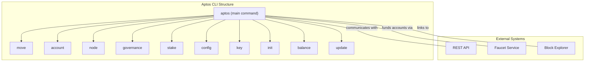
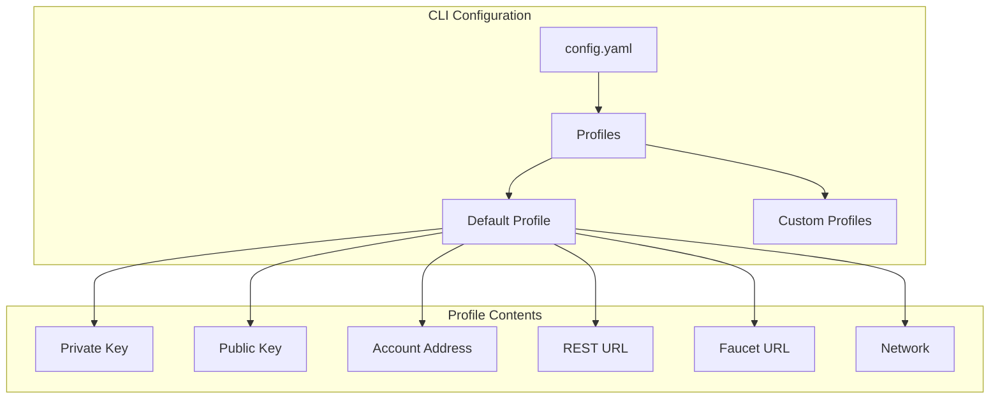
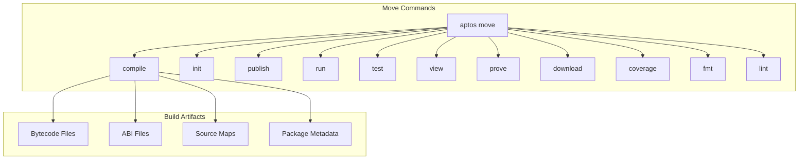
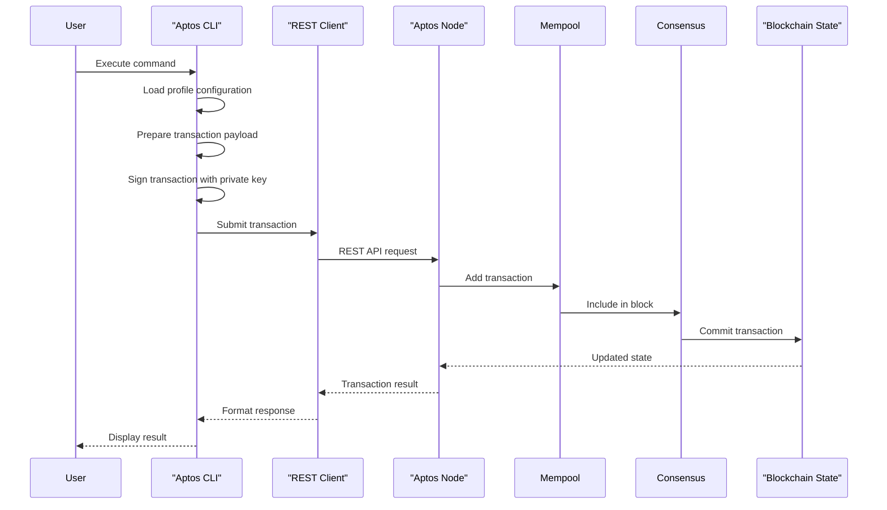
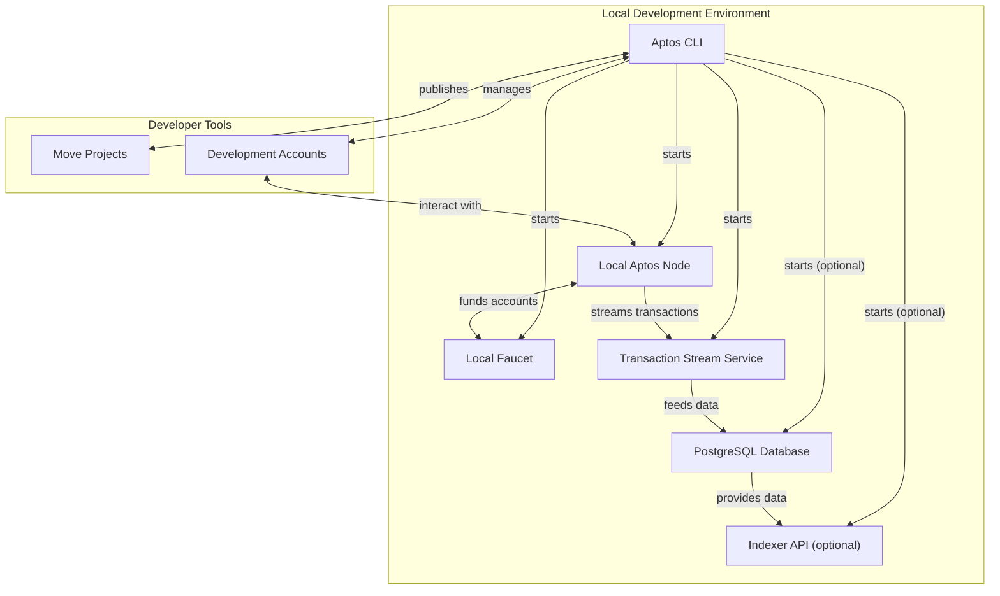
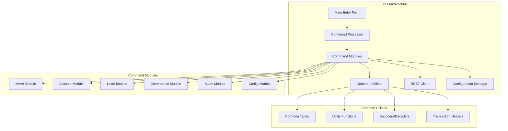

# Aptos CLI

<details>
<summary>Relevant source files</summary>

The following files were used as context for generating this wiki page:

- [Cargo.lock](https://github.com/aptos-labs/aptos-core/blob/b9f89a19/Cargo.lock)
- [Cargo.toml](https://github.com/aptos-labs/aptos-core/blob/b9f89a19/Cargo.toml)
- [aptos-move/framework/src/built_package.rs](https://github.com/aptos-labs/aptos-core/blob/b9f89a19/aptos-move/framework/src/built_package.rs)
- [aptos-node/Cargo.toml](https://github.com/aptos-labs/aptos-core/blob/b9f89a19/aptos-node/Cargo.toml)
- [aptos-node/src/lib.rs](https://github.com/aptos-labs/aptos-core/blob/b9f89a19/aptos-node/src/lib.rs)
- [aptos-node/src/logger.rs](https://github.com/aptos-labs/aptos-core/blob/b9f89a19/aptos-node/src/logger.rs)
- [aptos-node/src/services.rs](https://github.com/aptos-labs/aptos-core/blob/b9f89a19/aptos-node/src/services.rs)
- [aptos-node/src/storage.rs](https://github.com/aptos-labs/aptos-core/blob/b9f89a19/aptos-node/src/storage.rs)
- [config/src/config/mod.rs](https://github.com/aptos-labs/aptos-core/blob/b9f89a19/config/src/config/mod.rs)
- [config/src/config/node_config.rs](https://github.com/aptos-labs/aptos-core/blob/b9f89a19/config/src/config/node_config.rs)
- [consensus/Cargo.toml](https://github.com/aptos-labs/aptos-core/blob/b9f89a19/consensus/Cargo.toml)
- [consensus/src/consensus_provider.rs](https://github.com/aptos-labs/aptos-core/blob/b9f89a19/consensus/src/consensus_provider.rs)
- [crates/aptos/CHANGELOG.md](https://github.com/aptos-labs/aptos-core/blob/b9f89a19/crates/aptos/CHANGELOG.md)
- [crates/aptos/Cargo.toml](https://github.com/aptos-labs/aptos-core/blob/b9f89a19/crates/aptos/Cargo.toml)
- [crates/aptos/src/account/create.rs](https://github.com/aptos-labs/aptos-core/blob/b9f89a19/crates/aptos/src/account/create.rs)
- [crates/aptos/src/account/create_resource_account.rs](https://github.com/aptos-labs/aptos-core/blob/b9f89a19/crates/aptos/src/account/create_resource_account.rs)
- [crates/aptos/src/account/fund.rs](https://github.com/aptos-labs/aptos-core/blob/b9f89a19/crates/aptos/src/account/fund.rs)
- [crates/aptos/src/account/list.rs](https://github.com/aptos-labs/aptos-core/blob/b9f89a19/crates/aptos/src/account/list.rs)
- [crates/aptos/src/account/transfer.rs](https://github.com/aptos-labs/aptos-core/blob/b9f89a19/crates/aptos/src/account/transfer.rs)
- [crates/aptos/src/common/init.rs](https://github.com/aptos-labs/aptos-core/blob/b9f89a19/crates/aptos/src/common/init.rs)
- [crates/aptos/src/common/types.rs](https://github.com/aptos-labs/aptos-core/blob/b9f89a19/crates/aptos/src/common/types.rs)
- [crates/aptos/src/common/utils.rs](https://github.com/aptos-labs/aptos-core/blob/b9f89a19/crates/aptos/src/common/utils.rs)
- [crates/aptos/src/config/mod.rs](https://github.com/aptos-labs/aptos-core/blob/b9f89a19/crates/aptos/src/config/mod.rs)
- [crates/aptos/src/governance/mod.rs](https://github.com/aptos-labs/aptos-core/blob/b9f89a19/crates/aptos/src/governance/mod.rs)
- [crates/aptos/src/main.rs](https://github.com/aptos-labs/aptos-core/blob/b9f89a19/crates/aptos/src/main.rs)
- [crates/aptos/src/move_tool/coverage.rs](https://github.com/aptos-labs/aptos-core/blob/b9f89a19/crates/aptos/src/move_tool/coverage.rs)
- [crates/aptos/src/move_tool/lint.rs](https://github.com/aptos-labs/aptos-core/blob/b9f89a19/crates/aptos/src/move_tool/lint.rs)
- [crates/aptos/src/move_tool/mod.rs](https://github.com/aptos-labs/aptos-core/blob/b9f89a19/crates/aptos/src/move_tool/mod.rs)
- [crates/aptos/src/move_tool/show.rs](https://github.com/aptos-labs/aptos-core/blob/b9f89a19/crates/aptos/src/move_tool/show.rs)
- [crates/aptos/src/node/local_testnet/faucet.rs](https://github.com/aptos-labs/aptos-core/blob/b9f89a19/crates/aptos/src/node/local_testnet/faucet.rs)
- [crates/aptos/src/node/local_testnet/health_checker.rs](https://github.com/aptos-labs/aptos-core/blob/b9f89a19/crates/aptos/src/node/local_testnet/health_checker.rs)
- [crates/aptos/src/node/local_testnet/indexer_api.rs](https://github.com/aptos-labs/aptos-core/blob/b9f89a19/crates/aptos/src/node/local_testnet/indexer_api.rs)
- [crates/aptos/src/node/local_testnet/mod.rs](https://github.com/aptos-labs/aptos-core/blob/b9f89a19/crates/aptos/src/node/local_testnet/mod.rs)
- [crates/aptos/src/node/local_testnet/node.rs](https://github.com/aptos-labs/aptos-core/blob/b9f89a19/crates/aptos/src/node/local_testnet/node.rs)
- [crates/aptos/src/node/local_testnet/postgres.rs](https://github.com/aptos-labs/aptos-core/blob/b9f89a19/crates/aptos/src/node/local_testnet/postgres.rs)
- [crates/aptos/src/node/local_testnet/processors.rs](https://github.com/aptos-labs/aptos-core/blob/b9f89a19/crates/aptos/src/node/local_testnet/processors.rs)
- [crates/aptos/src/node/local_testnet/ready_server.rs](https://github.com/aptos-labs/aptos-core/blob/b9f89a19/crates/aptos/src/node/local_testnet/ready_server.rs)
- [crates/aptos/src/node/local_testnet/traits.rs](https://github.com/aptos-labs/aptos-core/blob/b9f89a19/crates/aptos/src/node/local_testnet/traits.rs)
- [crates/aptos/src/node/local_testnet/utils.rs](https://github.com/aptos-labs/aptos-core/blob/b9f89a19/crates/aptos/src/node/local_testnet/utils.rs)
- [crates/aptos/src/node/mod.rs](https://github.com/aptos-labs/aptos-core/blob/b9f89a19/crates/aptos/src/node/mod.rs)
- [crates/aptos/src/stake/mod.rs](https://github.com/aptos-labs/aptos-core/blob/b9f89a19/crates/aptos/src/stake/mod.rs)
- [crates/aptos/src/test/mod.rs](https://github.com/aptos-labs/aptos-core/blob/b9f89a19/crates/aptos/src/test/mod.rs)
- [ecosystem/indexer-grpc/indexer-transaction-generator/src/script_transaction_generator.rs](https://github.com/aptos-labs/aptos-core/blob/b9f89a19/ecosystem/indexer-grpc/indexer-transaction-generator/src/script_transaction_generator.rs)

</details>


The Aptos Command Line Interface (CLI) is the primary tool for developers and node operators to interact with the Aptos blockchain. It provides comprehensive functionality for managing accounts, working with Move smart contracts, running validator nodes, participating in on-chain governance, and configuring local development environments.

This document covers the CLI's commands, configuration, and typical usage patterns. For information about the Aptos blockchain architecture, see [Architecture Overview](#1.1).

## Overview

The Aptos CLI is a Rust-based command-line application that communicates with the Aptos blockchain through REST API endpoints. It provides an interface for all major Aptos operations including account management, transaction submission, Move development, validator operations, and governance participation.



Sources: 
- [crates/aptos/src/node/mod.rs:61-83](https://github.com/aptos-labs/aptos-core/blob/b9f89a19/crates/aptos/src/node/mod.rs:61-83#L61-L83)
- [crates/aptos/src/move_tool/mod.rs:96-177](https://github.com/aptos-labs/aptos-core/blob/b9f89a19/crates/aptos/src/move_tool/mod.rs:96-177#L96-L177)
- [crates/aptos/src/common/types.rs:60-247](https://github.com/aptos-labs/aptos-core/blob/b9f89a19/crates/aptos/src/common/types.rs:60-247#L60-L247)

## Installation and Configuration

### Installation

The Aptos CLI can be installed using various methods:

1. **Prebuilt Binaries**: Download from the Aptos GitHub releases page
2. **From Source**: Build from source using Cargo
3. **Self-update**: Update an existing installation using `aptos update aptos`

### Configuration

The CLI's configuration is stored in `.aptos/config.yaml`, typically in the user's home directory. Configuration includes profiles, network connections, and account information.



Sources:
- [crates/aptos/src/common/types.rs:249-347](https://github.com/aptos-labs/aptos-core/blob/b9f89a19/crates/aptos/src/common/types.rs:249-347#L249-L347)
- [crates/aptos/src/common/init.rs:31-82](https://github.com/aptos-labs/aptos-core/blob/b9f89a19/crates/aptos/src/common/init.rs:31-82#L31-L82)
- [crates/aptos/src/common/utils.rs:47-111](https://github.com/aptos-labs/aptos-core/blob/b9f89a19/crates/aptos/src/common/utils.rs:47-111#L47-L111)

### Initialization

The `aptos init` command initializes a new configuration profile:

```
$ aptos init
Configuring for profile default
Choose network from [devnet, testnet, mainnet, local, custom | defaults to devnet]
...
```

The initialization process:
1. Creates the `.aptos` directory if needed
2. Prompts for network selection (devnet, testnet, mainnet, local, or custom)
3. Generates or imports a private key
4. Creates an account on the selected network (if using a testnet/devnet)
5. Saves the configuration to `.aptos/config.yaml`

Sources:
- [crates/aptos/src/common/init.rs:84-184](https://github.com/aptos-labs/aptos-core/blob/b9f89a19/crates/aptos/src/common/init.rs:84-184#L84-L184)
- [crates/aptos/src/common/types.rs:348-412](https://github.com/aptos-labs/aptos-core/blob/b9f89a19/crates/aptos/src/common/types.rs:348-412#L348-L412)

## Core Command Groups

### Account Commands

Account commands manage Aptos accounts, including creation, funding, and transfers.

Key commands:
- `aptos account create` - Creates a new account on-chain
- `aptos account fund-with-faucet` - Funds an account using the faucet service
- `aptos account transfer` - Transfers coins between accounts
- `aptos account list` - Shows account resources and modules

Sources:
- [crates/aptos/src/account/create.rs](https://github.com/aptos-labs/aptos-core/blob/b9f89a19/crates/aptos/src/account/create.rs)
- [crates/aptos/src/account/fund.rs](https://github.com/aptos-labs/aptos-core/blob/b9f89a19/crates/aptos/src/account/fund.rs)
- [crates/aptos/src/account/transfer.rs](https://github.com/aptos-labs/aptos-core/blob/b9f89a19/crates/aptos/src/account/transfer.rs)
- [crates/aptos/src/account/list.rs](https://github.com/aptos-labs/aptos-core/blob/b9f89a19/crates/aptos/src/account/list.rs)

### Move Commands

Move commands provide tools for developing, testing, and deploying Move smart contracts.



Key commands:
- `aptos move init` - Creates a new Move package
- `aptos move compile` - Compiles a Move package
- `aptos move publish` - Publishes a Move package on-chain
- `aptos move run` - Runs a Move function
- `aptos move test` - Runs Move unit tests
- `aptos move view` - Executes a view function
- `aptos move fmt` - Formats Move code
- `aptos move lint` - Checks for common issues in Move code

Sources:
- [crates/aptos/src/move_tool/mod.rs:95-437](https://github.com/aptos-labs/aptos-core/blob/b9f89a19/crates/aptos/src/move_tool/mod.rs:95-437#L95-L437)
- [crates/aptos/CHANGELOG.md:9-21](https://github.com/aptos-labs/aptos-core/blob/b9f89a19/crates/aptos/CHANGELOG.md:9-21#L9-L21)
- [aptos-move/framework/src/built_package.rs:54-172](https://github.com/aptos-labs/aptos-core/blob/b9f89a19/aptos-move/framework/src/built_package.rs:54-172#L54-L172)

### Node Commands

Node commands manage Aptos node operations, particularly for validator operators.

Key commands:
- `aptos node run-localnet` - Runs a local development network
- `aptos node show-validator-config` - Shows validator configuration
- `aptos node show-validator-set` - Shows the current validator set
- `aptos node analyze-validator-performance` - Analyzes validator performance

Sources:
- [crates/aptos/src/node/mod.rs:60-112](https://github.com/aptos-labs/aptos-core/blob/b9f89a19/crates/aptos/src/node/mod.rs:60-112#L60-L112)
- [crates/aptos/src/node/local_testnet/mod.rs:1-48](https://github.com/aptos-labs/aptos-core/blob/b9f89a19/crates/aptos/src/node/local_testnet/mod.rs:1-48#L1-L48)
- [aptos-node/src/lib.rs:49-102](https://github.com/aptos-labs/aptos-core/blob/b9f89a19/aptos-node/src/lib.rs:49-102#L49-L102)

### Governance Commands

Governance commands facilitate participation in Aptos on-chain governance.

Key commands:
- `aptos governance propose` - Creates a governance proposal
- `aptos governance vote` - Votes on a governance proposal
- `aptos governance execute-proposal` - Executes an approved proposal
- `aptos governance list-proposals` - Lists on-chain governance proposals

Sources:
- [crates/aptos/src/governance/mod.rs:59-94](https://github.com/aptos-labs/aptos-core/blob/b9f89a19/crates/aptos/src/governance/mod.rs:59-94#L59-L94)

### Stake Commands

Stake commands manage staking operations for validators and delegators.

Key commands:
- `aptos stake add-stake` - Adds stake to a validator/staking pool
- `aptos stake increase-lockup` - Increases the lockup period for staked tokens
- `aptos stake set-operator` - Sets the operator for a validator
- `aptos stake set-delegated-voter` - Sets the delegated voter for a validator

Sources:
- [crates/aptos/src/stake/mod.rs:25-52](https://github.com/aptos-labs/aptos-core/blob/b9f89a19/crates/aptos/src/stake/mod.rs:25-52#L25-L52)

## Transaction Flow

When submitting transactions via the CLI, the command follows this flow:



Sources:
- [crates/aptos/src/common/types.rs:1055-1095](https://github.com/aptos-labs/aptos-core/blob/b9f89a19/crates/aptos/src/common/types.rs:1055-1095#L1055-L1095)
- [crates/aptos/src/common/utils.rs:69-111](https://github.com/aptos-labs/aptos-core/blob/b9f89a19/crates/aptos/src/common/utils.rs:69-111#L69-L111)

## Local Development Environment

The CLI provides the `aptos node run-localnet` command to set up a local development environment:



This command:
1. Starts a single-validator node for local development
2. Sets up a local faucet service for funding accounts
3. Optionally starts an indexer API with PostgreSQL for smart contract data indexing
4. Provides transaction streaming capabilities

Sources:
- [crates/aptos/src/node/local_testnet/mod.rs:1-48](https://github.com/aptos-labs/aptos-core/blob/b9f89a19/crates/aptos/src/node/local_testnet/mod.rs:1-48#L1-L48)
- [crates/aptos/src/node/local_testnet/processors.rs:1-56](https://github.com/aptos-labs/aptos-core/blob/b9f89a19/crates/aptos/src/node/local_testnet/processors.rs:1-56#L1-L56)
- [crates/aptos/src/node/local_testnet/health_checker.rs:1-16](https://github.com/aptos-labs/aptos-core/blob/b9f89a19/crates/aptos/src/node/local_testnet/health_checker.rs:1-16#L1-L16)

## Account and Key Management

The Aptos CLI supports various account and key management operations:

| Command | Description |
|---------|-------------|
| `aptos init` | Initialize a new account |
| `aptos key generate` | Generate a new key pair |
| `aptos key extract-public-key` | Extract a public key from a private key |
| `aptos account rotate-key` | Rotate an account's authentication key |
| `aptos account fund-with-faucet` | Fund an account using the faucet |
| `aptos account derive-resource-account` | Derive a resource account address |
| `aptos account lookup-address` | Lookup an address from authentication key |

The CLI supports different key types and security options:
- Ed25519 cryptographic keys
- Hardware wallet integration (Ledger)
- Saving keys with proper file permissions

Sources:
- [crates/aptos/CHANGELOG.md:209-246](https://github.com/aptos-labs/aptos-core/blob/b9f89a19/crates/aptos/CHANGELOG.md:209-246#L209-L246)
- [crates/aptos/src/common/types.rs:230-276](https://github.com/aptos-labs/aptos-core/blob/b9f89a19/crates/aptos/src/common/types.rs:230-276#L230-L276)

## CLI Architecture

The Aptos CLI is built with a modular architecture that separates concerns across various components:



Sources:
- [crates/aptos/src/move_tool/mod.rs:139-177](https://github.com/aptos-labs/aptos-core/blob/b9f89a19/crates/aptos/src/move_tool/mod.rs:139-177#L139-L177)
- [crates/aptos/src/common/types.rs:106-171](https://github.com/aptos-labs/aptos-core/blob/b9f89a19/crates/aptos/src/common/types.rs:106-171#L106-L171)
- [crates/aptos/src/node/mod.rs:84-112](https://github.com/aptos-labs/aptos-core/blob/b9f89a19/crates/aptos/src/node/mod.rs:84-112#L84-L112)

## Move Development Workflow

The CLI provides a comprehensive workflow for Move development:

1. **Initialize a package**: `aptos move init`
2. **Compile the package**: `aptos move compile`
3. **Test the package**: `aptos move test`
4. **Publish the package**: `aptos move publish`
5. **Interact with functions**: `aptos move run`
6. **View function results**: `aptos move view`

Additional tools for Move development:
- Code formatting: `aptos move fmt`
- Linting: `aptos move lint`
- Coverage analysis: `aptos move coverage`
- Formal verification: `aptos move prove`
- Decompilation: `aptos move decompile`

Sources:
- [crates/aptos/src/move_tool/mod.rs:293-437](https://github.com/aptos-labs/aptos-core/blob/b9f89a19/crates/aptos/src/move_tool/mod.rs:293-437#L293-L437)
- [crates/aptos/CHANGELOG.md:112-120](https://github.com/aptos-labs/aptos-core/blob/b9f89a19/crates/aptos/CHANGELOG.md:112-120#L112-L120)

## Recent Features and Improvements

Based on the changelog, recent notable features include:

1. **Move 2 Support**: Compiler v2 and Move 2 are now the default
2. **Code Formatting and Linting**: Added `aptos move fmt` and `aptos move lint`
3. **Chunked Publishing**: Support for publishing large packages in chunks
4. **Fungible Asset Support**: Enhanced commands for fungible assets
5. **Hardware Wallet Integration**: Support for Ledger hardware wallets
6. **Enhanced Simulation**: Improved transaction simulation capabilities
7. **Indexer Integration**: Better local development with indexer support

Sources:
- [crates/aptos/CHANGELOG.md:9-54](https://github.com/aptos-labs/aptos-core/blob/b9f89a19/crates/aptos/CHANGELOG.md:9-54#L9-L54)

## Conclusion

The Aptos CLI is a powerful tool for developers and node operators interacting with the Aptos blockchain. It provides comprehensive functionality across all major aspects of the ecosystem, from account management to Move development to validator operations.