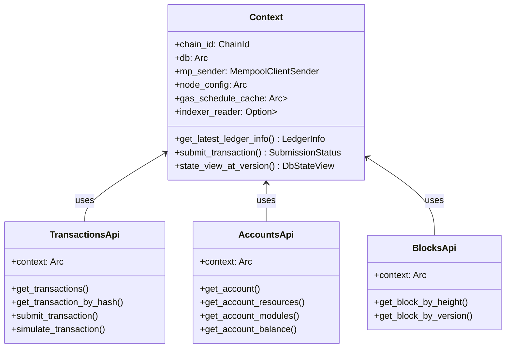
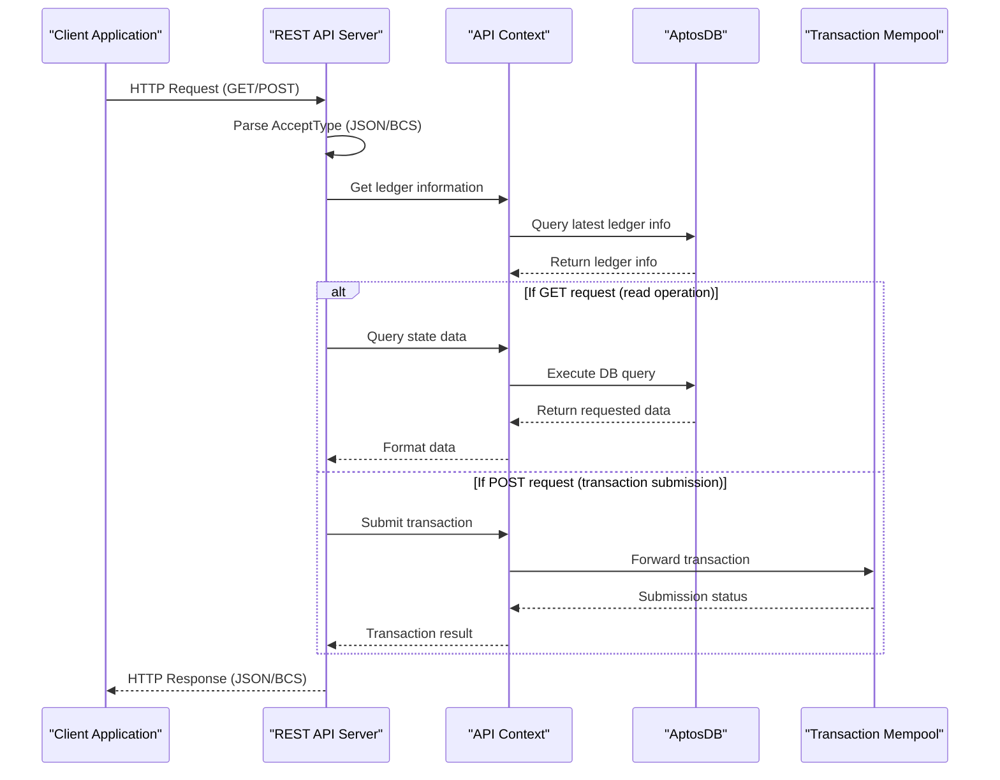
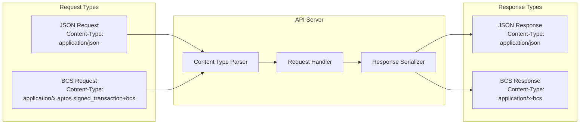
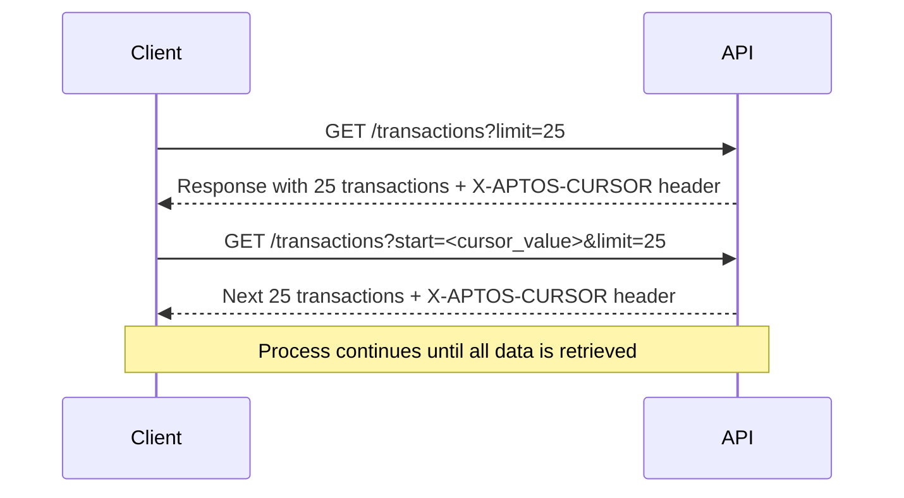
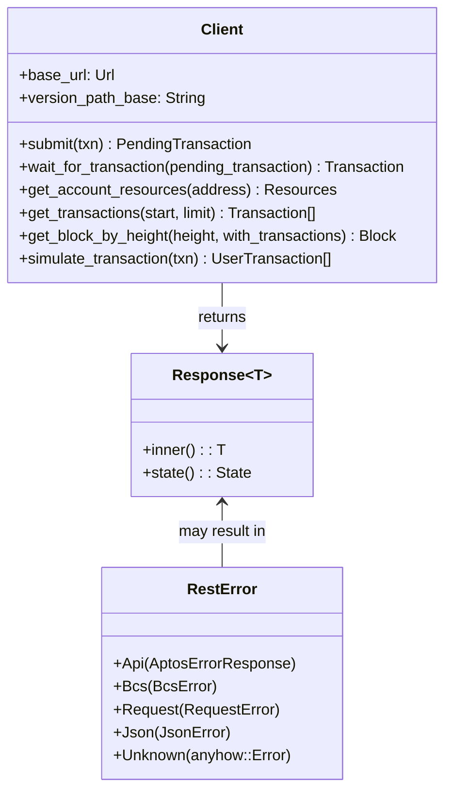

# REST API

<details>
<summary>Relevant source files</summary>

The following files were used as context for generating this wiki page:

- [api/doc/spec.json](https://github.com/aptos-labs/aptos-core/blob/b9f89a19/api/doc/spec.json)
- [api/doc/spec.yaml](https://github.com/aptos-labs/aptos-core/blob/b9f89a19/api/doc/spec.yaml)
- [api/goldens/aptos_api__tests__transactions_test__test_get_transactions_param_limit_exceeds_limit.json](https://github.com/aptos-labs/aptos-core/blob/b9f89a19/api/goldens/aptos_api__tests__transactions_test__test_get_transactions_param_limit_exceeds_limit.json)
- [api/goldens/aptos_api__tests__transactions_test__test_get_transactions_with_start_version_is_too_large.json](https://github.com/aptos-labs/aptos-core/blob/b9f89a19/api/goldens/aptos_api__tests__transactions_test__test_get_transactions_with_start_version_is_too_large.json)
- [api/goldens/aptos_api__tests__transactions_test__test_get_transactions_with_zero_limit.json](https://github.com/aptos-labs/aptos-core/blob/b9f89a19/api/goldens/aptos_api__tests__transactions_test__test_get_transactions_with_zero_limit.json)
- [api/goldens/aptos_api__tests__transactions_test__test_post_invalid_signature_transaction.json](https://github.com/aptos-labs/aptos-core/blob/b9f89a19/api/goldens/aptos_api__tests__transactions_test__test_post_invalid_signature_transaction.json)
- [api/src/accept_type.rs](https://github.com/aptos-labs/aptos-core/blob/b9f89a19/api/src/accept_type.rs)
- [api/src/accounts.rs](https://github.com/aptos-labs/aptos-core/blob/b9f89a19/api/src/accounts.rs)
- [api/src/basic.rs](https://github.com/aptos-labs/aptos-core/blob/b9f89a19/api/src/basic.rs)
- [api/src/bcs_payload.rs](https://github.com/aptos-labs/aptos-core/blob/b9f89a19/api/src/bcs_payload.rs)
- [api/src/blocks.rs](https://github.com/aptos-labs/aptos-core/blob/b9f89a19/api/src/blocks.rs)
- [api/src/context.rs](https://github.com/aptos-labs/aptos-core/blob/b9f89a19/api/src/context.rs)
- [api/src/events.rs](https://github.com/aptos-labs/aptos-core/blob/b9f89a19/api/src/events.rs)
- [api/src/index.rs](https://github.com/aptos-labs/aptos-core/blob/b9f89a19/api/src/index.rs)
- [api/src/lib.rs](https://github.com/aptos-labs/aptos-core/blob/b9f89a19/api/src/lib.rs)
- [api/src/page.rs](https://github.com/aptos-labs/aptos-core/blob/b9f89a19/api/src/page.rs)
- [api/src/response.rs](https://github.com/aptos-labs/aptos-core/blob/b9f89a19/api/src/response.rs)
- [api/src/state.rs](https://github.com/aptos-labs/aptos-core/blob/b9f89a19/api/src/state.rs)
- [api/src/tests/accounts_test.rs](https://github.com/aptos-labs/aptos-core/blob/b9f89a19/api/src/tests/accounts_test.rs)
- [api/src/tests/mod.rs](https://github.com/aptos-labs/aptos-core/blob/b9f89a19/api/src/tests/mod.rs)
- [api/src/tests/transactions_test.rs](https://github.com/aptos-labs/aptos-core/blob/b9f89a19/api/src/tests/transactions_test.rs)
- [api/src/transactions.rs](https://github.com/aptos-labs/aptos-core/blob/b9f89a19/api/src/transactions.rs)
- [api/test-context/src/test_context.rs](https://github.com/aptos-labs/aptos-core/blob/b9f89a19/api/test-context/src/test_context.rs)
- [api/types/src/error.rs](https://github.com/aptos-labs/aptos-core/blob/b9f89a19/api/types/src/error.rs)
- [api/types/src/mime_types.rs](https://github.com/aptos-labs/aptos-core/blob/b9f89a19/api/types/src/mime_types.rs)
- [crates/aptos-rest-client/Cargo.toml](https://github.com/aptos-labs/aptos-core/blob/b9f89a19/crates/aptos-rest-client/Cargo.toml)
- [crates/aptos-rest-client/src/lib.rs](https://github.com/aptos-labs/aptos-core/blob/b9f89a19/crates/aptos-rest-client/src/lib.rs)
- [ecosystem/indexer-grpc/indexer-grpc-table-info/src/internal_indexer_db_service.rs](https://github.com/aptos-labs/aptos-core/blob/b9f89a19/ecosystem/indexer-grpc/indexer-grpc-table-info/src/internal_indexer_db_service.rs)
- [storage/indexer/src/db_indexer.rs](https://github.com/aptos-labs/aptos-core/blob/b9f89a19/storage/indexer/src/db_indexer.rs)
- [storage/indexer/src/indexer_reader.rs](https://github.com/aptos-labs/aptos-core/blob/b9f89a19/storage/indexer/src/indexer_reader.rs)
- [testsuite/forge/src/interface/aptos.rs](https://github.com/aptos-labs/aptos-core/blob/b9f89a19/testsuite/forge/src/interface/aptos.rs)
- [testsuite/smoke-test/src/rest_api.rs](https://github.com/aptos-labs/aptos-core/blob/b9f89a19/testsuite/smoke-test/src/rest_api.rs)
- [testsuite/smoke-test/src/transaction.rs](https://github.com/aptos-labs/aptos-core/blob/b9f89a19/testsuite/smoke-test/src/transaction.rs)
- [types/src/indexer/indexer_db_reader.rs](https://github.com/aptos-labs/aptos-core/blob/b9f89a19/types/src/indexer/indexer_db_reader.rs)

</details>


The Aptos REST API is a RESTful interface that enables clients to interact with the Aptos blockchain. It provides endpoints for querying account data, submitting transactions, retrieving blockchain state, and more. This document provides a technical overview of the REST API architecture, its key components, and how it integrates with the broader Aptos ecosystem.

For information about specific client SDKs that use the REST API, see [Developer Tools & APIs](#4).

## Architecture Overview

The Aptos REST API follows a layered architecture pattern that provides an abstraction over the core blockchain modules. It serves as a bridge between external applications and the Aptos blockchain state.

```mermaid
flowchart TB
    subgraph "Client Applications"
        direction LR
        SDK["Aptos SDKs"]
        DApp["DApps"]
        Explorers["Block Explorers"]
    end

    subgraph "API Layer"
        direction TB
        Endpoints["REST Endpoints
        /accounts
        /transactions
        /events
        /blocks
        /tables"]
        Context["API Context"]
        ResponseHandling["Response Handlers
        (JSON/BCS)"]
    end

    subgraph "Blockchain Core"
        direction TB
        DbReader["DB Reader"]
        Mempool["Transaction Mempool"]
        State["State Storage"]
    end

    Client Applications --"HTTP Requests"--> API Layer
    API Layer --"Responses (JSON/BCS)"--> Client Applications
    API Layer <--> Blockchain Core
```

Sources: [api/src/context.rs:70-136](https://github.com/aptos-labs/aptos-core/blob/b9f89a19/api/src/context.rs:70-136#L70-L136), [api/src/lib.rs:5-16](https://github.com/aptos-labs/aptos-core/blob/b9f89a19/api/src/lib.rs:5-16#L5-L16)

## Key Components

### API Context

The API Context serves as the central component that manages connections to blockchain state, mempool, and other critical resources. It's passed to all API handlers and provides access to:

- Database connection for reading blockchain state
- Mempool client for transaction submission
- Ledger information
- Node configuration
- Indexer reader for optimized state access



Sources: [api/src/context.rs:70-226](https://github.com/aptos-labs/aptos-core/blob/b9f89a19/api/src/context.rs:70-226#L70-L226), [api/src/transactions.rs:133-137](https://github.com/aptos-labs/aptos-core/blob/b9f89a19/api/src/transactions.rs:133-137#L133-L137), [api/src/accounts.rs:39-43](https://github.com/aptos-labs/aptos-core/blob/b9f89a19/api/src/accounts.rs:39-43#L39-L43)

### API Endpoints

The REST API is organized into several groups of endpoints, each handling specific types of blockchain data:

| Endpoint Group | Description | Key Operations |
|----------------|-------------|----------------|
| `/accounts` | Account data and resources | Get account info, resources, modules, balance |
| `/transactions` | Transaction submission and queries | Submit transaction, get transaction by hash/version |
| `/events` | Event queries | Get events by creation number or event handle |
| `/blocks` | Block information | Get blocks by height or version |
| `/tables` | Table data access | Get table items by handle and key |
| `/state` | State queries | Get specific resources, modules |

Sources: [api/src/accounts.rs:44-219](https://github.com/aptos-labs/aptos-core/blob/b9f89a19/api/src/accounts.rs:44-219#L44-L219), [api/src/transactions.rs:138-739](https://github.com/aptos-labs/aptos-core/blob/b9f89a19/api/src/transactions.rs:138-739#L138-L739), [api/src/events.rs:34-102](https://github.com/aptos-labs/aptos-core/blob/b9f89a19/api/src/events.rs:34-102#L34-L102)

## Request-Response Flow

The diagram below illustrates the typical flow of a request through the REST API system:



Sources: [api/src/transactions.rs:371-386](https://github.com/aptos-labs/aptos-core/blob/b9f89a19/api/src/transactions.rs:371-386#L371-L386), [api/src/context.rs:208-217](https://github.com/aptos-labs/aptos-core/blob/b9f89a19/api/src/context.rs:208-217#L208-L217), [crates/aptos-rest-client/src/lib.rs:570-587](https://github.com/aptos-labs/aptos-core/blob/b9f89a19/crates/aptos-rest-client/src/lib.rs:570-587#L570-L587)

## Content Types and Serialization

The API supports two primary content types for both requests and responses:

1. **JSON** - Human-readable format used by default (`application/json`)
2. **BCS** - Binary Canonical Serialization format for efficiency (`application/x.aptos.signed_transaction+bcs` for transactions)

Clients can specify their preferred format using HTTP headers:
- `Accept` header for response format
- `Content-Type` header for request format



Sources: [api/src/accept_type.rs:10-16](https://github.com/aptos-labs/aptos-core/blob/b9f89a19/api/src/accept_type.rs:10-16#L10-L16), [api/src/transactions.rs:83-93](https://github.com/aptos-labs/aptos-core/blob/b9f89a19/api/src/transactions.rs:83-93#L83-L93), [api/src/response.rs:42-53](https://github.com/aptos-labs/aptos-core/blob/b9f89a19/api/src/response.rs:42-53#L42-L53)

## Transaction Submission Flow

One of the most important operations handled by the API is transaction submission. The diagram below illustrates this process:

```mermaid
flowchart TB
    subgraph "Client"
        direction TB
        BuildTx["1. Build Transaction"]
        SignTx["2. Sign Transaction"]
        SubmitTx["3. Submit Transaction"]
    end

    subgraph "REST API"
        direction TB
        ValidateTx["4. Validate Transaction"]
        ProcessTx["5. Process Transaction"]
    end

    subgraph "Mempool"
        direction TB
        MempoolValidation["6. Mempool Validation"]
        PendingTxns["7. Pending Transactions"]
    end
    
    subgraph "Consensus"
        direction TB
        ProposeTx["8. Propose Block"]
        ExecuteTx["9. Execute Block"]
        CommitTx["10. Commit Block"]
    end

    BuildTx --> SignTx
    SignTx --> SubmitTx
    SubmitTx --> ValidateTx
    ValidateTx --> ProcessTx
    ProcessTx --> MempoolValidation
    MempoolValidation --> PendingTxns
    PendingTxns --> ProposeTx
    ProposeTx --> ExecuteTx
    ExecuteTx --> CommitTx
    
    CommitTx -.-> QueryResult["11. Query Transaction Result"]
    
    class QueryResult stroke-dasharray: 5 5
```

Sources: [crates/aptos-rest-client/src/lib.rs:570-623](https://github.com/aptos-labs/aptos-core/blob/b9f89a19/crates/aptos-rest-client/src/lib.rs:570-623#L570-L623), [api/src/transactions.rs:371-386](https://github.com/aptos-labs/aptos-core/blob/b9f89a19/api/src/transactions.rs:371-386#L371-L386)

## Error Handling

The API uses a standardized error response format for all endpoints, providing consistent error handling across the API. Error responses include:

- HTTP status code
- Error message
- Aptos-specific error code
- Optional VM error code for transaction failures

The error handling framework defines different categories of errors with specific traits:

| Error Category | HTTP Status | Description |
|----------------|-------------|-------------|
| Bad Request | 400 | Invalid input, malformed requests |
| Forbidden | 403 | Authentication/authorization failures |
| Not Found | 404 | Requested resource doesn't exist |
| Internal Error | 500 | Server-side errors |
| Service Unavailable | 503 | Temporary unavailability |

Sources: [api/types/src/error.rs:10-136](https://github.com/aptos-labs/aptos-core/blob/b9f89a19/api/types/src/error.rs:10-136#L10-L136), [api/src/response.rs:55-110](https://github.com/aptos-labs/aptos-core/blob/b9f89a19/api/src/response.rs:55-110#L55-L110)

## Pagination

Many API endpoints that return collections of items support pagination through query parameters:

- `start` - Starting position (e.g., account sequence number, version)
- `limit` - Maximum number of items to return

Additionally, some endpoints use cursor-based pagination with an `X-APTOS-CURSOR` header in the response that can be passed back in subsequent requests.



Sources: [api/src/page.rs:11-98](https://github.com/aptos-labs/aptos-core/blob/b9f89a19/api/src/page.rs:11-98#L11-L98), [api/src/transactions.rs:148-177](https://github.com/aptos-labs/aptos-core/blob/b9f89a19/api/src/transactions.rs:148-177#L148-L177)

## Client Integration

The REST client library (`aptos-rest-client`) provides a convenient way to interact with the REST API from Rust applications. It offers methods that mirror the API endpoints and handles serialization/deserialization, error handling, and waiting for transaction completion.

Key features of the client:

- JSON and BCS format support
- Transaction submission and monitoring
- Account and resource querying
- Gas estimation utilities
- Timeout and retry handling for transaction submission



Sources: [crates/aptos-rest-client/src/lib.rs:79-85](https://github.com/aptos-labs/aptos-core/blob/b9f89a19/crates/aptos-rest-client/src/lib.rs:79-85#L79-L85), [crates/aptos-rest-client/src/lib.rs:570-736](https://github.com/aptos-labs/aptos-core/blob/b9f89a19/crates/aptos-rest-client/src/lib.rs:570-736#L570-L736)

## Performance Considerations

The API includes several features to optimize performance:

1. **BCS Support**: Binary format for efficient data transfer
2. **StateView Caching**: Improved performance for repeated state access
3. **View Functions**: Efficient way to query contract data without transactions
4. **Gas Estimation**: Dynamic gas price estimation for transaction optimization
5. **Indexing**: Optimized data access patterns through the indexer

Sources: [api/src/context.rs:143-188](https://github.com/aptos-labs/aptos-core/blob/b9f89a19/api/src/context.rs:143-188#L143-L188), [crates/aptos-rest-client/src/lib.rs:415-459](https://github.com/aptos-labs/aptos-core/blob/b9f89a19/crates/aptos-rest-client/src/lib.rs:415-459#L415-L459)

## Versioning Strategy

The API follows a versioning strategy with the version included in the URL path:

- Current version: `/v1/...`
- Version path base can be configured (defaults to `v1/`)
- This allows for future API revisions while maintaining backward compatibility

Sources: [crates/aptos-rest-client/src/lib.rs:57-61](https://github.com/aptos-labs/aptos-core/blob/b9f89a19/crates/aptos-rest-client/src/lib.rs:57-61#L57-L61), [api/doc/spec.yaml:12-14](https://github.com/aptos-labs/aptos-core/blob/b9f89a19/api/doc/spec.yaml:12-14#L12-L14)

## API Documentation and Specification

The API is documented using OpenAPI (Swagger) specification, which provides a comprehensive reference for all endpoints, request/response formats, and error codes.

The OpenAPI specification is available at:
- JSON format: `/api/doc/spec.json`
- YAML format: `/api/doc/spec.yaml`

This specification can be imported into tools like Swagger UI, Postman, or other API clients to explore and test the API.

Sources: [api/doc/spec.json:1-15](https://github.com/aptos-labs/aptos-core/blob/b9f89a19/api/doc/spec.json:1-15#L1-L15), [api/doc/spec.yaml:1-30](https://github.com/aptos-labs/aptos-core/blob/b9f89a19/api/doc/spec.yaml:1-30#L1-L30)

## Conclusion

The Aptos REST API provides a comprehensive interface for interacting with the Aptos blockchain. Its layered architecture, support for multiple serialization formats, and robust error handling make it suitable for a wide range of client applications. The API is designed with performance, usability, and extensibility in mind, enabling developers to build powerful applications on the Aptos platform.