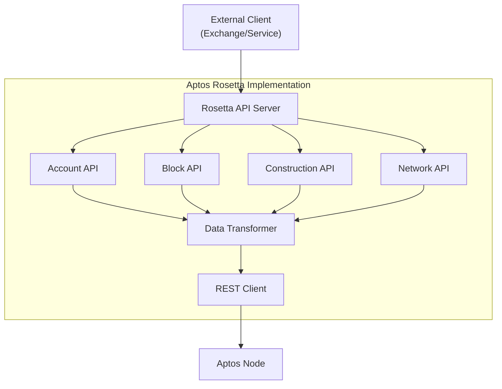
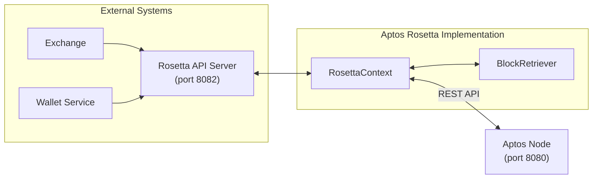
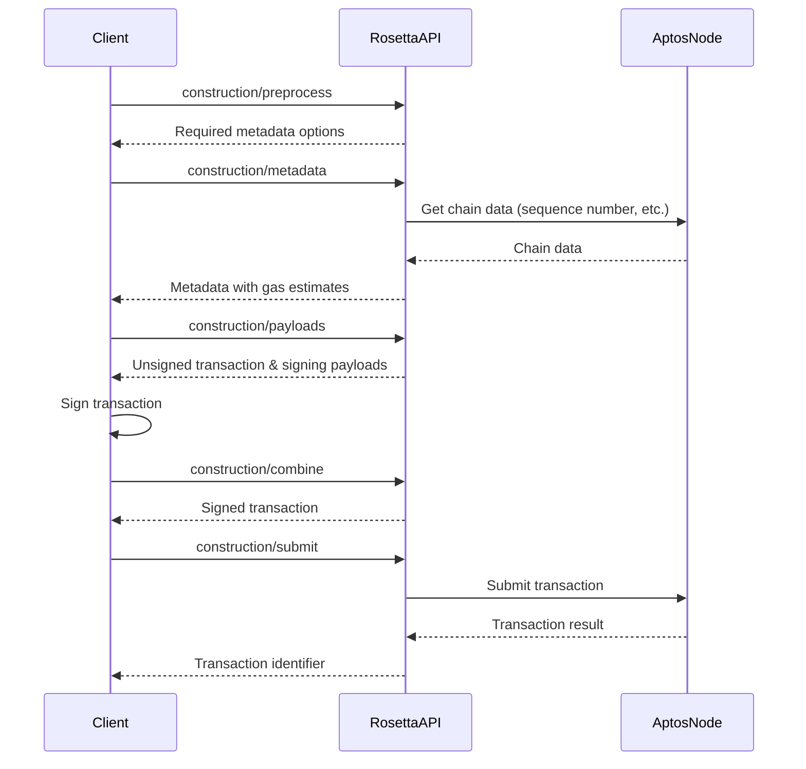
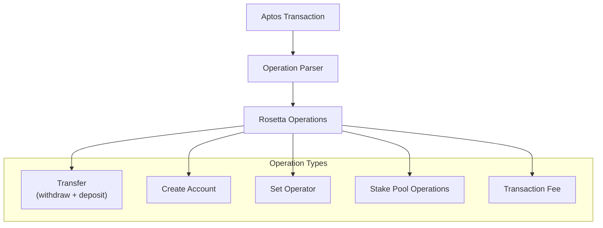
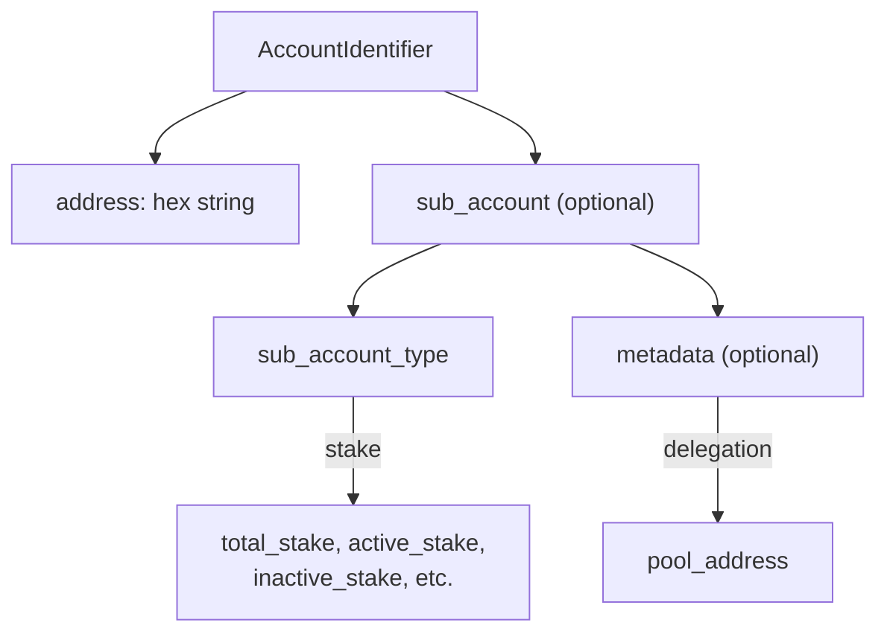

# Rosetta API

Relevant source files

The following files were used as context for generating this wiki page:

- [crates/aptos-genesis/Cargo.toml](https://github.com/aptos-labs/aptos-core/blob/b9f89a19/crates/aptos-genesis/Cargo.toml)
- [crates/aptos-rosetta-cli/Cargo.toml](https://github.com/aptos-labs/aptos-core/blob/b9f89a19/crates/aptos-rosetta-cli/Cargo.toml)
- [crates/aptos-rosetta-cli/README.md](https://github.com/aptos-labs/aptos-core/blob/b9f89a19/crates/aptos-rosetta-cli/README.md)
- [crates/aptos-rosetta-cli/src/account.rs](https://github.com/aptos-labs/aptos-core/blob/b9f89a19/crates/aptos-rosetta-cli/src/account.rs)
- [crates/aptos-rosetta-cli/src/block.rs](https://github.com/aptos-labs/aptos-core/blob/b9f89a19/crates/aptos-rosetta-cli/src/block.rs)
- [crates/aptos-rosetta-cli/src/common.rs](https://github.com/aptos-labs/aptos-core/blob/b9f89a19/crates/aptos-rosetta-cli/src/common.rs)
- [crates/aptos-rosetta-cli/src/construction.rs](https://github.com/aptos-labs/aptos-core/blob/b9f89a19/crates/aptos-rosetta-cli/src/construction.rs)
- [crates/aptos-rosetta-cli/src/network.rs](https://github.com/aptos-labs/aptos-core/blob/b9f89a19/crates/aptos-rosetta-cli/src/network.rs)
- [crates/aptos-rosetta/Cargo.toml](https://github.com/aptos-labs/aptos-core/blob/b9f89a19/crates/aptos-rosetta/Cargo.toml)
- [crates/aptos-rosetta/src/account.rs](https://github.com/aptos-labs/aptos-core/blob/b9f89a19/crates/aptos-rosetta/src/account.rs)
- [crates/aptos-rosetta/src/block.rs](https://github.com/aptos-labs/aptos-core/blob/b9f89a19/crates/aptos-rosetta/src/block.rs)
- [crates/aptos-rosetta/src/client.rs](https://github.com/aptos-labs/aptos-core/blob/b9f89a19/crates/aptos-rosetta/src/client.rs)
- [crates/aptos-rosetta/src/common.rs](https://github.com/aptos-labs/aptos-core/blob/b9f89a19/crates/aptos-rosetta/src/common.rs)
- [crates/aptos-rosetta/src/construction.rs](https://github.com/aptos-labs/aptos-core/blob/b9f89a19/crates/aptos-rosetta/src/construction.rs)
- [crates/aptos-rosetta/src/error.rs](https://github.com/aptos-labs/aptos-core/blob/b9f89a19/crates/aptos-rosetta/src/error.rs)
- [crates/aptos-rosetta/src/lib.rs](https://github.com/aptos-labs/aptos-core/blob/b9f89a19/crates/aptos-rosetta/src/lib.rs)
- [crates/aptos-rosetta/src/main.rs](https://github.com/aptos-labs/aptos-core/blob/b9f89a19/crates/aptos-rosetta/src/main.rs)
- [crates/aptos-rosetta/src/network.rs](https://github.com/aptos-labs/aptos-core/blob/b9f89a19/crates/aptos-rosetta/src/network.rs)
- [crates/aptos-rosetta/src/types/identifiers.rs](https://github.com/aptos-labs/aptos-core/blob/b9f89a19/crates/aptos-rosetta/src/types/identifiers.rs)
- [crates/aptos-rosetta/src/types/misc.rs](https://github.com/aptos-labs/aptos-core/blob/b9f89a19/crates/aptos-rosetta/src/types/misc.rs)
- [crates/aptos-rosetta/src/types/move_types.rs](https://github.com/aptos-labs/aptos-core/blob/b9f89a19/crates/aptos-rosetta/src/types/move_types.rs)
- [crates/aptos-rosetta/src/types/objects.rs](https://github.com/aptos-labs/aptos-core/blob/b9f89a19/crates/aptos-rosetta/src/types/objects.rs)
- [crates/aptos-rosetta/src/types/requests.rs](https://github.com/aptos-labs/aptos-core/blob/b9f89a19/crates/aptos-rosetta/src/types/requests.rs)
- [testsuite/forge-cli/src/README.md](https://github.com/aptos-labs/aptos-core/blob/b9f89a19/testsuite/forge-cli/src/README.md)
- [testsuite/smoke-test/src/rosetta.rs](https://github.com/aptos-labs/aptos-core/blob/b9f89a19/testsuite/smoke-test/src/rosetta.rs)

The Rosetta API is a standardized interface designed to simplify blockchain integration for exchanges and other services. This document covers the implementation of the Rosetta API in Aptos, which allows third-party services to interact with the Aptos blockchain in a consistent manner, without requiring custom per-blockchain logic. For information about REST API, see [REST API](#4.2).

## Overview

The Aptos Rosetta API implements the [Rosetta specification](https://www.rosetta-api.org/docs/Reference.html) to provide a consistent way for exchanges and blockchain applications to:
- Query account balances
- Retrieve blocks and transactions
- Construct, sign, and submit transactions
- Get network status and supported operations

The API operates in two modes:
- **Online mode**: Connected to an Aptos node, providing full functionality
- **Offline mode**: For transaction construction without network connectivity

Sources:
- [crates/aptos-rosetta/src/lib.rs:155-180](https://github.com/aptos-labs/aptos-core/blob/b9f89a19/crates/aptos-rosetta/src/lib.rs#L155-L180)
- [crates/aptos-rosetta/src/main.rs:31-105](https://github.com/aptos-labs/aptos-core/blob/b9f89a19/crates/aptos-rosetta/src/main.rs#L31-L105)

## Architecture and Components

The Rosetta API is implemented as a standalone server that communicates with an Aptos node through the REST API. It transforms Aptos-specific data structures to the standardized Rosetta format and vice versa.

### Key Components

1. **RosettaContext**: Central context object containing chain ID, REST client, and block cache
2. **BlockRetriever**: Helper for retrieving and caching block information
3. **API Modules**: Account, Block, Construction, and Network modules implementing Rosetta endpoints

Sources:
- [crates/aptos-rosetta/src/lib.rs:42-94](https://github.com/aptos-labs/aptos-core/blob/b9f89a19/crates/aptos-rosetta/src/lib.rs#L42-L94)
- [crates/aptos-rosetta/src/block.rs:166-226](https://github.com/aptos-labs/aptos-core/blob/b9f89a19/crates/aptos-rosetta/src/block.rs#L166-L226)

## API Endpoints

### Account API

The Account API allows retrieving account balances and metadata.

| Endpoint | Description |
|----------|-------------|
| `/account/balance` | Get account balance for a specific block |

This API supports querying:
- Regular account balances
- Staking balances (active, inactive, pending)
- Delegation pool balances

Sources:
- [crates/aptos-rosetta/src/account.rs:33-158](https://github.com/aptos-labs/aptos-core/blob/b9f89a19/crates/aptos-rosetta/src/account.rs#L33-L158)
- [crates/aptos-rosetta/src/types/requests.rs:23-60](https://github.com/aptos-labs/aptos-core/blob/b9f89a19/crates/aptos-rosetta/src/types/requests.rs#L23-L60)

### Block API

The Block API allows retrieving block information.

| Endpoint | Description |
|----------|-------------|
| `/block` | Get block by index or hash |

Blocks in Rosetta context are mapped from Aptos blocks, containing:
- Block metadata (timestamp, hash, height)
- Transactions with operations
- Parent block reference

Sources:
- [crates/aptos-rosetta/src/block.rs:18-113](https://github.com/aptos-labs/aptos-core/blob/b9f89a19/crates/aptos-rosetta/src/block.rs#L18-L113)

### Construction API

The Construction API facilitates transaction construction, signing, and submission in a multi-step process.

| Endpoint | Description |
|----------|-------------|
| `/construction/preprocess` | Create a request to fetch metadata |
| `/construction/metadata` | Get information required for transaction construction |
| `/construction/payloads` | Generate unsigned transaction and signing payloads |
| `/construction/combine` | Combine signatures and unsigned transaction |
| `/construction/submit` | Submit signed transaction to node |
| `/construction/derive` | Derive account address from public key |
| `/construction/parse` | Parse operations from a transaction |
| `/construction/hash` | Get the hash of a transaction |

Sources:
- [crates/aptos-rosetta/src/construction.rs:57-135](https://github.com/aptos-labs/aptos-core/blob/b9f89a19/crates/aptos-rosetta/src/construction.rs#L57-L135)
- [crates/aptos-rosetta/src/construction.rs:144-183](https://github.com/aptos-labs/aptos-core/blob/b9f89a19/crates/aptos-rosetta/src/construction.rs#L144-L183)
- [crates/aptos-rosetta/src/construction.rs:305-442](https://github.com/aptos-labs/aptos-core/blob/b9f89a19/crates/aptos-rosetta/src/construction.rs#L305-L442)

### Network API

The Network API provides information about the blockchain network.

| Endpoint | Description |
|----------|-------------|
| `/network/list` | List available networks (chains) |
| `/network/options` | Get network options (supported operations, versions, etc.) |
| `/network/status` | Get current network status |

Sources:
- [crates/aptos-rosetta/src/network.rs:16-44](https://github.com/aptos-labs/aptos-core/blob/b9f89a19/crates/aptos-rosetta/src/network.rs#L16-L44)
- [crates/aptos-rosetta/src/network.rs:51-138](https://github.com/aptos-labs/aptos-core/blob/b9f89a19/crates/aptos-rosetta/src/network.rs#L51-L138)

## Operations and Mapping

The Rosetta API uses operations to represent actions within transactions. These operations are mapped to and from Aptos transaction types.

### Supported Operation Types

| Operation Type | Description |
|----------------|-------------|
| `create_account` | Create a new account |
| `withdraw` | Remove funds from an account |
| `deposit` | Add funds to an account |
| `fee` | Transaction fee |
| `set_operator` | Set staking operator |
| `set_voter` | Set staking voter |
| `initialize_stake_pool` | Create a staking pool |
| `unlock_stake` | Unlock staked funds |
| `add_delegated_stake` | Add stake to a delegation pool |
| `staking_reward` | Staking rewards payment |

Sources:
- [crates/aptos-rosetta/src/types/misc.rs:114-133](https://github.com/aptos-labs/aptos-core/blob/b9f89a19/crates/aptos-rosetta/src/types/misc.rs#L114-L133)
- [crates/aptos-rosetta/src/types/objects.rs:187-617](https://github.com/aptos-labs/aptos-core/blob/b9f89a19/crates/aptos-rosetta/src/types/objects.rs#L187-L617)

### Transaction Mapping

Aptos transaction data is transformed into Rosetta operations as follows:

Sources:
- [crates/aptos-rosetta/src/construction.rs:547-627](https://github.com/aptos-labs/aptos-core/blob/b9f89a19/crates/aptos-rosetta/src/construction.rs#L547-L627)
- [crates/aptos-rosetta/src/types/objects.rs:903-926](https://github.com/aptos-labs/aptos-core/blob/b9f89a19/crates/aptos-rosetta/src/types/objects.rs#L903-L926)

## Account Identification

Rosetta uses a standardized account identification system:

Account identifiers support:
- Base accounts (regular addresses)
- Staking accounts (with sub-account types)
- Delegation pool accounts

Sources:
- [crates/aptos-rosetta/src/types/identifiers.rs:24-200](https://github.com/aptos-labs/aptos-core/blob/b9f89a19/crates/aptos-rosetta/src/types/identifiers.rs#L24-L200)
- [crates/aptos-rosetta/src/types/identifiers.rs:317-380](https://github.com/aptos-labs/aptos-core/blob/b9f89a19/crates/aptos-rosetta/src/types/identifiers.rs#L317-L380)

## Currency Support

The Rosetta API supports multiple currencies:

1. **Native APT**: Primary Aptos coin
2. **Fungible Assets**: Including USDC and other assets

Each currency includes:
- Symbol (e.g., "APT")
- Decimals (e.g., 8 for APT)
- Metadata (Move type or asset address)

Sources:
- [crates/aptos-rosetta/src/common.rs:148-205](https://github.com/aptos-labs/aptos-core/blob/b9f89a19/crates/aptos-rosetta/src/common.rs#L148-L205)
- [crates/aptos-rosetta/src/types/objects.rs:99-177](https://github.com/aptos-labs/aptos-core/blob/b9f89a19/crates/aptos-rosetta/src/types/objects.rs#L99-L177)

## Testing and Client Tools

The implementation includes tools for testing and interacting with the API:

1. **Rosetta Client**: A Rust client library for making API calls
2. **Rosetta CLI**: A command-line tool for testing API endpoints
3. **Smoke Tests**: E2E tests for verifying proper API behavior

Sources:
- [crates/aptos-rosetta/src/client.rs:19-130](https://github.com/aptos-labs/aptos-core/blob/b9f89a19/crates/aptos-rosetta/src/client.rs#L19-L130)
- [crates/aptos-rosetta-cli/src/construction.rs:12-37](https://github.com/aptos-labs/aptos-core/blob/b9f89a19/crates/aptos-rosetta-cli/src/construction.rs#L12-L37)
- [testsuite/smoke-test/src/rosetta.rs:54-127](https://github.com/aptos-labs/aptos-core/blob/b9f89a19/testsuite/smoke-test/src/rosetta.rs#L54-L127)

## Deployment and Configuration

The Rosetta API server can be deployed in several modes:

1. **Online with Remote Node**: Connects to an existing Aptos node
2. **Online with Local Node**: Runs a local Aptos node alongside Rosetta
3. **Offline**: For transaction construction without network connectivity

Configuration options include:
- Chain ID
- API binding address and port
- Connection to Aptos node REST API
- Supported currencies

Sources:
- [crates/aptos-rosetta/src/main.rs:39-47](https://github.com/aptos-labs/aptos-core/blob/b9f89a19/crates/aptos-rosetta/src/main.rs#L39-L47)
- [crates/aptos-rosetta/src/main.rs:127-197](https://github.com/aptos-labs/aptos-core/blob/b9f89a19/crates/aptos-rosetta/src/main.rs#L127-L197)

## Error Handling

The API implements standardized error handling according to the Rosetta specification:

| Error Category | Description | Retriable |
|----------------|-------------|-----------|
| Network Mismatch | Network ID doesn't match server | No |
| Account Not Found | Account doesn't exist | Yes |
| Block Not Found | Requested block not available | Yes |
| Transaction Errors | Various transaction-related errors | Varies |
| Internal Errors | Server-side errors | No |

Each error includes:
- Error code
- Message
- Whether it's retriable
- Optional details

Sources:
- [crates/aptos-rosetta/src/error.rs:17-144](https://github.com/aptos-labs/aptos-core/blob/b9f89a19/crates/aptos-rosetta/src/error.rs#L17-L144)
- [crates/aptos-rosetta/src/error.rs:168-204](https://github.com/aptos-labs/aptos-core/blob/b9f89a19/crates/aptos-rosetta/src/error.rs#L168-L204)

## Integration Examples

### Exchange Integration Flow

1. **Initial Setup**:
   - Use `/network/list` to identify available networks
   - Use `/network/options` to understand supported operations

2. **Account Monitoring**:
   - Use `/account/balance` to monitor balances
   - Track block progression with `/block`

3. **Withdrawal Processing**:
   - Use Construction API endpoints to create, sign, and submit transactions
   - Monitor transaction status using transaction hash

4. **Deposit Detection**:
   - Scan blocks for deposit operations to customer addresses
   - Verify transaction finality

Sources:
- [crates/aptos-rosetta-cli/src/construction.rs:106-513](https://github.com/aptos-labs/aptos-core/blob/b9f89a19/crates/aptos-rosetta-cli/src/construction.rs#L106-L513)