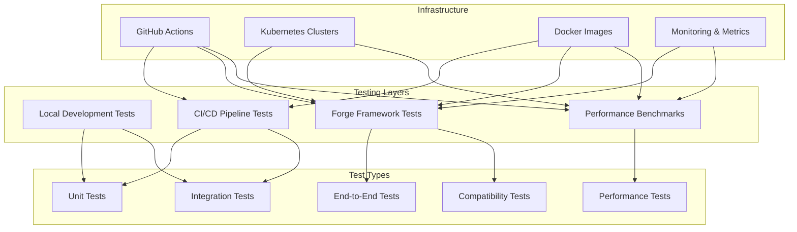
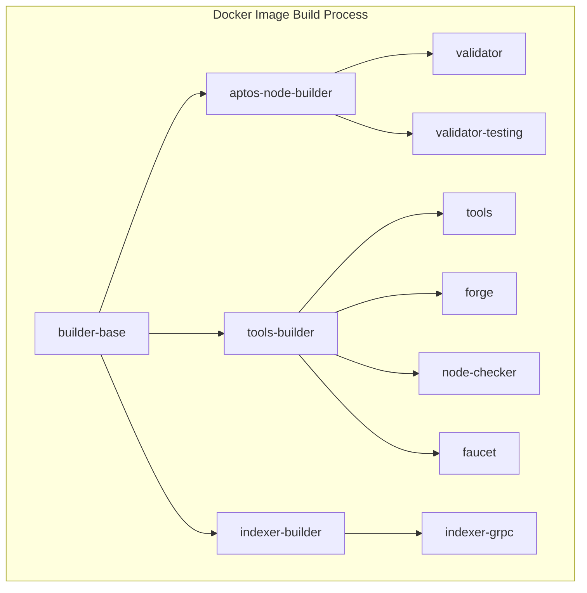
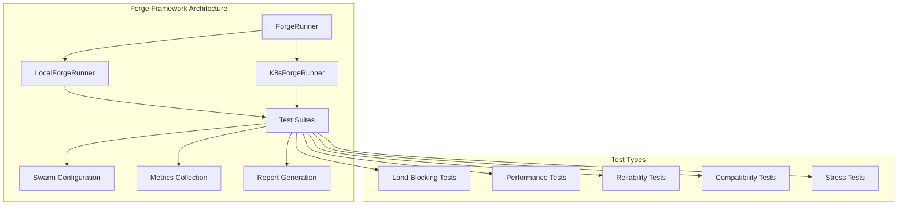
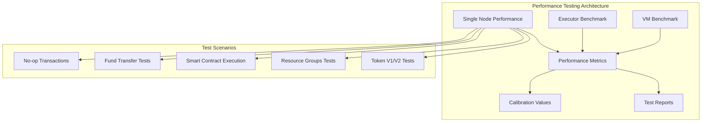
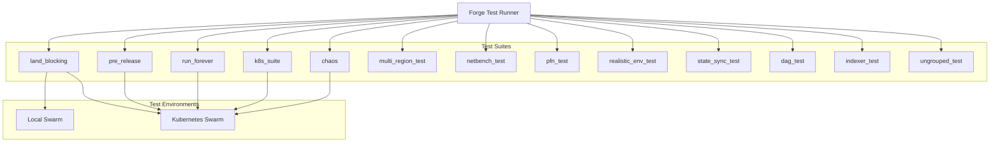
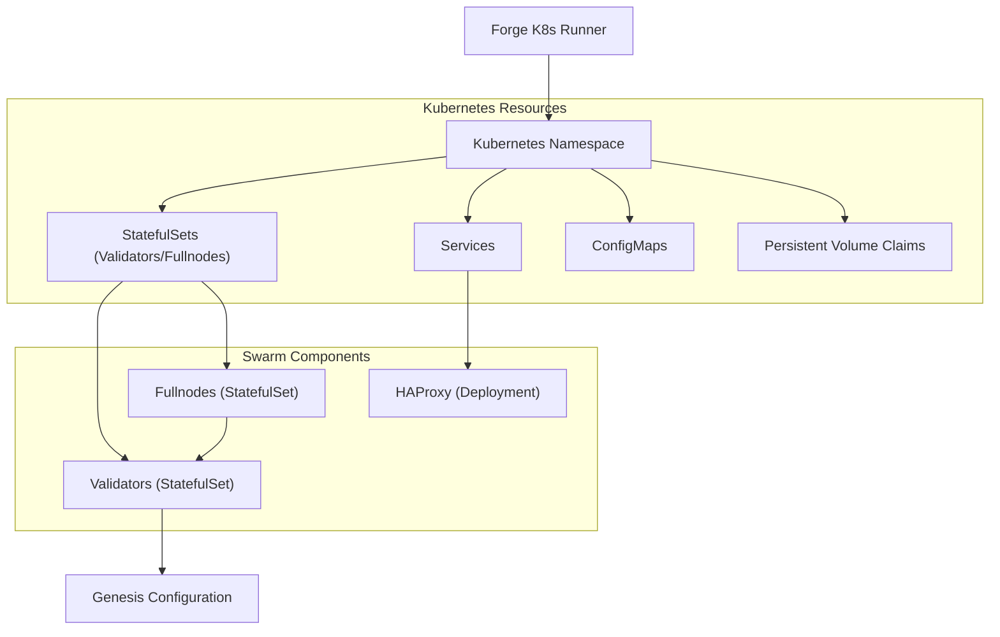

# Testing & CI/CD Infrastructure

Relevant source files

The following files were used as context for generating this wiki page:

- [.config/nextest.toml](https://github.com/aptos-labs/aptos-core/blob/b9f89a19/.config/nextest.toml)
- [.github/actions/docker-setup/action.yaml](https://github.com/aptos-labs/aptos-core/blob/b9f89a19/.github/actions/docker-setup/action.yaml)
- [.github/actions/file-change-determinator/action.yaml](https://github.com/aptos-labs/aptos-core/blob/b9f89a19/.github/actions/file-change-determinator/action.yaml)
- [.github/actions/general-lints/action.yaml](https://github.com/aptos-labs/aptos-core/blob/b9f89a19/.github/actions/general-lints/action.yaml)
- [.github/actions/move-prover-setup/action.yaml](https://github.com/aptos-labs/aptos-core/blob/b9f89a19/.github/actions/move-prover-setup/action.yaml)
- [.github/actions/rust-check-merge-base/action.yaml](https://github.com/aptos-labs/aptos-core/blob/b9f89a19/.github/actions/rust-check-merge-base/action.yaml)
- [.github/actions/rust-doc-tests/action.yaml](https://github.com/aptos-labs/aptos-core/blob/b9f89a19/.github/actions/rust-doc-tests/action.yaml)
- [.github/actions/rust-lints/action.yaml](https://github.com/aptos-labs/aptos-core/blob/b9f89a19/.github/actions/rust-lints/action.yaml)
- [.github/actions/rust-setup/action.yaml](https://github.com/aptos-labs/aptos-core/blob/b9f89a19/.github/actions/rust-setup/action.yaml)
- [.github/actions/rust-smoke-tests/action.yaml](https://github.com/aptos-labs/aptos-core/blob/b9f89a19/.github/actions/rust-smoke-tests/action.yaml)
- [.github/actions/rust-targeted-unit-tests/action.yaml](https://github.com/aptos-labs/aptos-core/blob/b9f89a19/.github/actions/rust-targeted-unit-tests/action.yaml)
- [.github/actions/rust-unit-tests/action.yaml](https://github.com/aptos-labs/aptos-core/blob/b9f89a19/.github/actions/rust-unit-tests/action.yaml)
- [.github/actions/rust-unit-tests/nextest_summary.py](https://github.com/aptos-labs/aptos-core/blob/b9f89a19/.github/actions/rust-unit-tests/nextest_summary.py)
- [.github/actions/test-target-determinator/action.yaml](https://github.com/aptos-labs/aptos-core/blob/b9f89a19/.github/actions/test-target-determinator/action.yaml)
- [.github/actions/wait-images-ci/action.yaml](https://github.com/aptos-labs/aptos-core/blob/b9f89a19/.github/actions/wait-images-ci/action.yaml)
- [.github/workflows/adhoc-forge.yaml](https://github.com/aptos-labs/aptos-core/blob/b9f89a19/.github/workflows/adhoc-forge.yaml)
- [.github/workflows/cli-e2e-tests.yaml](https://github.com/aptos-labs/aptos-core/blob/b9f89a19/.github/workflows/cli-e2e-tests.yaml)
- [.github/workflows/cli-release.yaml](https://github.com/aptos-labs/aptos-core/blob/b9f89a19/.github/workflows/cli-release.yaml)
- [.github/workflows/copy-images-to-dockerhub.yaml](https://github.com/aptos-labs/aptos-core/blob/b9f89a19/.github/workflows/copy-images-to-dockerhub.yaml)
- [.github/workflows/coverage-move-only.yaml](https://github.com/aptos-labs/aptos-core/blob/b9f89a19/.github/workflows/coverage-move-only.yaml)
- [.github/workflows/coverage.yaml](https://github.com/aptos-labs/aptos-core/blob/b9f89a19/.github/workflows/coverage.yaml)
- [.github/workflows/docker-build-rosetta.yaml](https://github.com/aptos-labs/aptos-core/blob/b9f89a19/.github/workflows/docker-build-rosetta.yaml)
- [.github/workflows/docker-build-test.yaml](https://github.com/aptos-labs/aptos-core/blob/b9f89a19/.github/workflows/docker-build-test.yaml)
- [.github/workflows/docker-indexer-grpc-test.yaml](https://github.com/aptos-labs/aptos-core/blob/b9f89a19/.github/workflows/docker-indexer-grpc-test.yaml)
- [.github/workflows/execution-performance.yaml](https://github.com/aptos-labs/aptos-core/blob/b9f89a19/.github/workflows/execution-performance.yaml)
- [.github/workflows/faucet-tests-main.yaml](https://github.com/aptos-labs/aptos-core/blob/b9f89a19/.github/workflows/faucet-tests-main.yaml)
- [.github/workflows/faucet-tests-prod.yaml](https://github.com/aptos-labs/aptos-core/blob/b9f89a19/.github/workflows/faucet-tests-prod.yaml)
- [.github/workflows/find-packages-with-undeclared-feature-dependencies.yaml](https://github.com/aptos-labs/aptos-core/blob/b9f89a19/.github/workflows/find-packages-with-undeclared-feature-dependencies.yaml)
- [.github/workflows/forge-continuous-land-blocking-test.yaml](https://github.com/aptos-labs/aptos-core/blob/b9f89a19/.github/workflows/forge-continuous-land-blocking-test.yaml)
- [.github/workflows/forge-stable.yaml](https://github.com/aptos-labs/aptos-core/blob/b9f89a19/.github/workflows/forge-stable.yaml)
- [.github/workflows/forge-unstable.yaml](https://github.com/aptos-labs/aptos-core/blob/b9f89a19/.github/workflows/forge-unstable.yaml)
- [.github/workflows/indexer-protos-sdk-update.yaml](https://github.com/aptos-labs/aptos-core/blob/b9f89a19/.github/workflows/indexer-protos-sdk-update.yaml)
- [.github/workflows/lint-test.yaml](https://github.com/aptos-labs/aptos-core/blob/b9f89a19/.github/workflows/lint-test.yaml)
- [.github/workflows/module-verify.yaml](https://github.com/aptos-labs/aptos-core/blob/b9f89a19/.github/workflows/module-verify.yaml)
- [.github/workflows/node-api-compatibility-tests.yaml](https://github.com/aptos-labs/aptos-core/blob/b9f89a19/.github/workflows/node-api-compatibility-tests.yaml)
- [.github/workflows/prover-daily-test.yaml](https://github.com/aptos-labs/aptos-core/blob/b9f89a19/.github/workflows/prover-daily-test.yaml)
- [.github/workflows/replay-verify.yaml](https://github.com/aptos-labs/aptos-core/blob/b9f89a19/.github/workflows/replay-verify.yaml)
- [.github/workflows/run-gas-calibration.yaml](https://github.com/aptos-labs/aptos-core/blob/b9f89a19/.github/workflows/run-gas-calibration.yaml)
- [.github/workflows/rust-client-tests.yaml](https://github.com/aptos-labs/aptos-core/blob/b9f89a19/.github/workflows/rust-client-tests.yaml)
- [.github/workflows/test-copy-images-to-dockerhub.yaml](https://github.com/aptos-labs/aptos-core/blob/b9f89a19/.github/workflows/test-copy-images-to-dockerhub.yaml)
- [.github/workflows/windows-build.yaml](https://github.com/aptos-labs/aptos-core/blob/b9f89a19/.github/workflows/windows-build.yaml)
- [.github/workflows/workflow-run-docker-rust-build.yaml](https://github.com/aptos-labs/aptos-core/blob/b9f89a19/.github/workflows/workflow-run-docker-rust-build.yaml)
- [.github/workflows/workflow-run-execution-performance.yaml](https://github.com/aptos-labs/aptos-core/blob/b9f89a19/.github/workflows/workflow-run-execution-performance.yaml)
- [.github/workflows/workflow-run-forge.yaml](https://github.com/aptos-labs/aptos-core/blob/b9f89a19/.github/workflows/workflow-run-forge.yaml)
- [.github/workflows/workflow-run-module-verify.yaml](https://github.com/aptos-labs/aptos-core/blob/b9f89a19/.github/workflows/workflow-run-module-verify.yaml)
- [.github/workflows/workflow-run-replay-verify.yaml](https://github.com/aptos-labs/aptos-core/blob/b9f89a19/.github/workflows/workflow-run-replay-verify.yaml)
- [aptos-move/e2e-benchmark/Cargo.toml](https://github.com/aptos-labs/aptos-core/blob/b9f89a19/aptos-move/e2e-benchmark/Cargo.toml)
- [aptos-move/e2e-benchmark/data/calibration_values.tsv](https://github.com/aptos-labs/aptos-core/blob/b9f89a19/aptos-move/e2e-benchmark/data/calibration_values.tsv)
- [aptos-move/e2e-benchmark/src/main.rs](https://github.com/aptos-labs/aptos-core/blob/b9f89a19/aptos-move/e2e-benchmark/src/main.rs)
- [crates/aptos-genesis/src/builder.rs](https://github.com/aptos-labs/aptos-core/blob/b9f89a19/crates/aptos-genesis/src/builder.rs)
- [crates/aptos-genesis/src/config.rs](https://github.com/aptos-labs/aptos-core/blob/b9f89a19/crates/aptos-genesis/src/config.rs)
- [crates/aptos-genesis/src/keys.rs](https://github.com/aptos-labs/aptos-core/blob/b9f89a19/crates/aptos-genesis/src/keys.rs)
- [crates/aptos-genesis/src/lib.rs](https://github.com/aptos-labs/aptos-core/blob/b9f89a19/crates/aptos-genesis/src/lib.rs)
- [crates/aptos-genesis/src/mainnet.rs](https://github.com/aptos-labs/aptos-core/blob/b9f89a19/crates/aptos-genesis/src/mainnet.rs)
- [crates/aptos/src/genesis/git.rs](https://github.com/aptos-labs/aptos-core/blob/b9f89a19/crates/aptos/src/genesis/git.rs)
- [crates/aptos/src/genesis/keys.rs](https://github.com/aptos-labs/aptos-core/blob/b9f89a19/crates/aptos/src/genesis/keys.rs)
- [crates/aptos/src/genesis/mod.rs](https://github.com/aptos-labs/aptos-core/blob/b9f89a19/crates/aptos/src/genesis/mod.rs)
- [crates/aptos/src/genesis/tests.rs](https://github.com/aptos-labs/aptos-core/blob/b9f89a19/crates/aptos/src/genesis/tests.rs)
- [crates/transaction-emitter-lib/src/emitter/stats.rs](https://github.com/aptos-labs/aptos-core/blob/b9f89a19/crates/transaction-emitter-lib/src/emitter/stats.rs)
- [crates/transaction-emitter/Cargo.toml](https://github.com/aptos-labs/aptos-core/blob/b9f89a19/crates/transaction-emitter/Cargo.toml)
- [crates/transaction-generator-lib/src/account_generator.rs](https://github.com/aptos-labs/aptos-core/blob/b9f89a19/crates/transaction-generator-lib/src/account_generator.rs)
- [crates/transaction-generator-lib/src/accounts_pool_wrapper.rs](https://github.com/aptos-labs/aptos-core/blob/b9f89a19/crates/transaction-generator-lib/src/accounts_pool_wrapper.rs)
- [crates/transaction-generator-lib/src/batch_transfer.rs](https://github.com/aptos-labs/aptos-core/blob/b9f89a19/crates/transaction-generator-lib/src/batch_transfer.rs)
- [crates/transaction-generator-lib/src/call_custom_modules.rs](https://github.com/aptos-labs/aptos-core/blob/b9f89a19/crates/transaction-generator-lib/src/call_custom_modules.rs)
- [crates/transaction-generator-lib/src/entry_points.rs](https://github.com/aptos-labs/aptos-core/blob/b9f89a19/crates/transaction-generator-lib/src/entry_points.rs)
- [crates/transaction-generator-lib/src/lib.rs](https://github.com/aptos-labs/aptos-core/blob/b9f89a19/crates/transaction-generator-lib/src/lib.rs)
- [crates/transaction-generator-lib/src/p2p_transaction_generator.rs](https://github.com/aptos-labs/aptos-core/blob/b9f89a19/crates/transaction-generator-lib/src/p2p_transaction_generator.rs)
- [crates/transaction-generator-lib/src/publish_modules.rs](https://github.com/aptos-labs/aptos-core/blob/b9f89a19/crates/transaction-generator-lib/src/publish_modules.rs)
- [crates/transaction-generator-lib/src/publishing/prebuild_packages.rs](https://github.com/aptos-labs/aptos-core/blob/b9f89a19/crates/transaction-generator-lib/src/publishing/prebuild_packages.rs)
- [crates/transaction-generator-lib/src/publishing/publish_util.rs](https://github.com/aptos-labs/aptos-core/blob/b9f89a19/crates/transaction-generator-lib/src/publishing/publish_util.rs)
- [crates/transaction-generator-lib/src/transaction_mix_generator.rs](https://github.com/aptos-labs/aptos-core/blob/b9f89a19/crates/transaction-generator-lib/src/transaction_mix_generator.rs)
- [crates/transaction-generator-lib/src/workflow_delegator.rs](https://github.com/aptos-labs/aptos-core/blob/b9f89a19/crates/transaction-generator-lib/src/workflow_delegator.rs)
- [crates/transaction-workloads-lib/src/token_workflow.rs](https://github.com/aptos-labs/aptos-core/blob/b9f89a19/crates/transaction-workloads-lib/src/token_workflow.rs)
- [devtools/aptos-cargo-cli/Cargo.toml](https://github.com/aptos-labs/aptos-core/blob/b9f89a19/devtools/aptos-cargo-cli/Cargo.toml)
- [devtools/aptos-cargo-cli/src/bin/cargo-x.rs](https://github.com/aptos-labs/aptos-core/blob/b9f89a19/devtools/aptos-cargo-cli/src/bin/cargo-x.rs)
- [devtools/aptos-cargo-cli/src/cargo.rs](https://github.com/aptos-labs/aptos-core/blob/b9f89a19/devtools/aptos-cargo-cli/src/cargo.rs)
- [devtools/aptos-cargo-cli/src/common.rs](https://github.com/aptos-labs/aptos-core/blob/b9f89a19/devtools/aptos-cargo-cli/src/common.rs)
- [devtools/aptos-cargo-cli/src/lib.rs](https://github.com/aptos-labs/aptos-core/blob/b9f89a19/devtools/aptos-cargo-cli/src/lib.rs)
- [devtools/aptos-cargo-cli/src/main.rs](https://github.com/aptos-labs/aptos-core/blob/b9f89a19/devtools/aptos-cargo-cli/src/main.rs)
- [docker/__tests__/release-images.test.js](https://github.com/aptos-labs/aptos-core/blob/b9f89a19/docker/__tests__/release-images.test.js)
- [docker/builder/docker-bake-rust-all.hcl](https://github.com/aptos-labs/aptos-core/blob/b9f89a19/docker/builder/docker-bake-rust-all.hcl)
- [docker/builder/docker-bake-rust-all.sh](https://github.com/aptos-labs/aptos-core/blob/b9f89a19/docker/builder/docker-bake-rust-all.sh)
- [docker/image-helpers.js](https://github.com/aptos-labs/aptos-core/blob/b9f89a19/docker/image-helpers.js)
- [docker/release-images.mjs](https://github.com/aptos-labs/aptos-core/blob/b9f89a19/docker/release-images.mjs)
- [docker/test.sh](https://github.com/aptos-labs/aptos-core/blob/b9f89a19/docker/test.sh)
- [docker/wait-images-ci.mjs](https://github.com/aptos-labs/aptos-core/blob/b9f89a19/docker/wait-images-ci.mjs)
- [execution/executor-benchmark/Cargo.toml](https://github.com/aptos-labs/aptos-core/blob/b9f89a19/execution/executor-benchmark/Cargo.toml)
- [execution/executor-benchmark/src/account_generator.rs](https://github.com/aptos-labs/aptos-core/blob/b9f89a19/execution/executor-benchmark/src/account_generator.rs)
- [execution/executor-benchmark/src/db_generator.rs](https://github.com/aptos-labs/aptos-core/blob/b9f89a19/execution/executor-benchmark/src/db_generator.rs)
- [execution/executor-benchmark/src/ledger_update_stage.rs](https://github.com/aptos-labs/aptos-core/blob/b9f89a19/execution/executor-benchmark/src/ledger_update_stage.rs)
- [execution/executor-benchmark/src/lib.rs](https://github.com/aptos-labs/aptos-core/blob/b9f89a19/execution/executor-benchmark/src/lib.rs)
- [execution/executor-benchmark/src/main.rs](https://github.com/aptos-labs/aptos-core/blob/b9f89a19/execution/executor-benchmark/src/main.rs)
- [execution/executor-benchmark/src/pipeline.rs](https://github.com/aptos-labs/aptos-core/blob/b9f89a19/execution/executor-benchmark/src/pipeline.rs)
- [execution/executor-benchmark/src/transaction_executor.rs](https://github.com/aptos-labs/aptos-core/blob/b9f89a19/execution/executor-benchmark/src/transaction_executor.rs)
- [execution/executor-benchmark/src/transaction_generator.rs](https://github.com/aptos-labs/aptos-core/blob/b9f89a19/execution/executor-benchmark/src/transaction_generator.rs)
- [package.json](https://github.com/aptos-labs/aptos-core/blob/b9f89a19/package.json)
- [pnpm-lock.yaml](https://github.com/aptos-labs/aptos-core/blob/b9f89a19/pnpm-lock.yaml)
- [protos/README.md](https://github.com/aptos-labs/aptos-core/blob/b9f89a19/protos/README.md)
- [protos/typescript/src/aptos/remote_executor/v1/network_msg.ts](https://github.com/aptos-labs/aptos-core/blob/b9f89a19/protos/typescript/src/aptos/remote_executor/v1/network_msg.ts)
- [scripts/cli/build_cli_release.ps1](https://github.com/aptos-labs/aptos-core/blob/b9f89a19/scripts/cli/build_cli_release.ps1)
- [scripts/cli/build_cli_release.sh](https://github.com/aptos-labs/aptos-core/blob/b9f89a19/scripts/cli/build_cli_release.sh)
- [scripts/indexer_proto_update_status_poll.sh](https://github.com/aptos-labs/aptos-core/blob/b9f89a19/scripts/indexer_proto_update_status_poll.sh)
- [scripts/windows_dev_setup.ps1](https://github.com/aptos-labs/aptos-core/blob/b9f89a19/scripts/windows_dev_setup.ps1)
- [state-sync/README.md](https://github.com/aptos-labs/aptos-core/blob/b9f89a19/state-sync/README.md)
- [storage/db-tool/src/replay_verify.rs](https://github.com/aptos-labs/aptos-core/blob/b9f89a19/storage/db-tool/src/replay_verify.rs)
- [testsuite/fixtures/forge-test-runner-template.fixture](https://github.com/aptos-labs/aptos-core/blob/b9f89a19/testsuite/fixtures/forge-test-runner-template.fixture)
- [testsuite/fixtures/testDashboardLinkAutoRefresh.fixture](https://github.com/aptos-labs/aptos-core/blob/b9f89a19/testsuite/fixtures/testDashboardLinkAutoRefresh.fixture)
- [testsuite/fixtures/testDashboardLinkTimeInterval.fixture](https://github.com/aptos-labs/aptos-core/blob/b9f89a19/testsuite/fixtures/testDashboardLinkTimeInterval.fixture)
- [testsuite/fixtures/testFormatComment.fixture](https://github.com/aptos-labs/aptos-core/blob/b9f89a19/testsuite/fixtures/testFormatComment.fixture)
- [testsuite/fixtures/testFormatPreComment.fixture](https://github.com/aptos-labs/aptos-core/blob/b9f89a19/testsuite/fixtures/testFormatPreComment.fixture)
- [testsuite/fixtures/testGetHumioForgeLinkAbsolute.fixture](https://github.com/aptos-labs/aptos-core/blob/b9f89a19/testsuite/fixtures/testGetHumioForgeLinkAbsolute.fixture)
- [testsuite/fixtures/testGetHumioForgeLinkRelative.fixture](https://github.com/aptos-labs/aptos-core/blob/b9f89a19/testsuite/fixtures/testGetHumioForgeLinkRelative.fixture)
- [testsuite/fixtures/testGetHumioLogsLinkAbsolute.fixture](https://github.com/aptos-labs/aptos-core/blob/b9f89a19/testsuite/fixtures/testGetHumioLogsLinkAbsolute.fixture)
- [testsuite/fixtures/testGetHumioLogsLinkRelative.fixture](https://github.com/aptos-labs/aptos-core/blob/b9f89a19/testsuite/fixtures/testGetHumioLogsLinkRelative.fixture)
- [testsuite/fixtures/testMain.fixture](https://github.com/aptos-labs/aptos-core/blob/b9f89a19/testsuite/fixtures/testMain.fixture)
- [testsuite/fixtures/testMainComment.fixture](https://github.com/aptos-labs/aptos-core/blob/b9f89a19/testsuite/fixtures/testMainComment.fixture)
- [testsuite/fixtures/testMainPreComment.fixture](https://github.com/aptos-labs/aptos-core/blob/b9f89a19/testsuite/fixtures/testMainPreComment.fixture)
- [testsuite/fixtures/testPossibleAuthFailureMessage.fixture](https://github.com/aptos-labs/aptos-core/blob/b9f89a19/testsuite/fixtures/testPossibleAuthFailureMessage.fixture)
- [testsuite/forge-cli/Cargo.toml](https://github.com/aptos-labs/aptos-core/blob/b9f89a19/testsuite/forge-cli/Cargo.toml)
- [testsuite/forge-cli/src/main.rs](https://github.com/aptos-labs/aptos-core/blob/b9f89a19/testsuite/forge-cli/src/main.rs)
- [testsuite/forge-test-runner-template.yaml](https://github.com/aptos-labs/aptos-core/blob/b9f89a19/testsuite/forge-test-runner-template.yaml)
- [testsuite/forge.py](https://github.com/aptos-labs/aptos-core/blob/b9f89a19/testsuite/forge.py)
- [testsuite/forge/Cargo.toml](https://github.com/aptos-labs/aptos-core/blob/b9f89a19/testsuite/forge/Cargo.toml)
- [testsuite/forge/src/backend/k8s/cluster_helper.rs](https://github.com/aptos-labs/aptos-core/blob/b9f89a19/testsuite/forge/src/backend/k8s/cluster_helper.rs)
- [testsuite/forge/src/backend/k8s/kube_api.rs](https://github.com/aptos-labs/aptos-core/blob/b9f89a19/testsuite/forge/src/backend/k8s/kube_api.rs)
- [testsuite/forge/src/backend/k8s/mod.rs](https://github.com/aptos-labs/aptos-core/blob/b9f89a19/testsuite/forge/src/backend/k8s/mod.rs)
- [testsuite/forge/src/backend/k8s/node.rs](https://github.com/aptos-labs/aptos-core/blob/b9f89a19/testsuite/forge/src/backend/k8s/node.rs)
- [testsuite/forge/src/backend/k8s/stateful_set.rs](https://github.com/aptos-labs/aptos-core/blob/b9f89a19/testsuite/forge/src/backend/k8s/stateful_set.rs)
- [testsuite/forge/src/backend/k8s/swarm.rs](https://github.com/aptos-labs/aptos-core/blob/b9f89a19/testsuite/forge/src/backend/k8s/swarm.rs)
- [testsuite/forge/src/backend/local/node.rs](https://github.com/aptos-labs/aptos-core/blob/b9f89a19/testsuite/forge/src/backend/local/node.rs)
- [testsuite/forge/src/backend/local/swarm.rs](https://github.com/aptos-labs/aptos-core/blob/b9f89a19/testsuite/forge/src/backend/local/swarm.rs)
- [testsuite/forge/src/interface/network.rs](https://github.com/aptos-labs/aptos-core/blob/b9f89a19/testsuite/forge/src/interface/network.rs)
- [testsuite/forge/src/interface/node.rs](https://github.com/aptos-labs/aptos-core/blob/b9f89a19/testsuite/forge/src/interface/node.rs)
- [testsuite/forge/src/interface/swarm.rs](https://github.com/aptos-labs/aptos-core/blob/b9f89a19/testsuite/forge/src/interface/swarm.rs)
- [testsuite/forge/src/report.rs](https://github.com/aptos-labs/aptos-core/blob/b9f89a19/testsuite/forge/src/report.rs)
- [testsuite/forge/src/runner.rs](https://github.com/aptos-labs/aptos-core/blob/b9f89a19/testsuite/forge/src/runner.rs)
- [testsuite/forge/src/success_criteria.rs](https://github.com/aptos-labs/aptos-core/blob/b9f89a19/testsuite/forge/src/success_criteria.rs)
- [testsuite/forge_test.py](https://github.com/aptos-labs/aptos-core/blob/b9f89a19/testsuite/forge_test.py)
- [testsuite/module-publish/src/main.rs](https://github.com/aptos-labs/aptos-core/blob/b9f89a19/testsuite/module-publish/src/main.rs)
- [testsuite/module-publish/src/packages/complex/sources/smart_table_picture.move](https://github.com/aptos-labs/aptos-core/blob/b9f89a19/testsuite/module-publish/src/packages/complex/sources/smart_table_picture.move)
- [testsuite/module-publish/src/packages/complex/sources/vector_picture.move](https://github.com/aptos-labs/aptos-core/blob/b9f89a19/testsuite/module-publish/src/packages/complex/sources/vector_picture.move)
- [testsuite/module-publish/src/packages/simple/Move.toml](https://github.com/aptos-labs/aptos-core/blob/b9f89a19/testsuite/module-publish/src/packages/simple/Move.toml)
- [testsuite/module-publish/src/packages/simple/sources/Simple.move](https://github.com/aptos-labs/aptos-core/blob/b9f89a19/testsuite/module-publish/src/packages/simple/sources/Simple.move)
- [testsuite/module_verify.py](https://github.com/aptos-labs/aptos-core/blob/b9f89a19/testsuite/module_verify.py)
- [testsuite/module_verify_run_local.py](https://github.com/aptos-labs/aptos-core/blob/b9f89a19/testsuite/module_verify_run_local.py)
- [testsuite/run_forge.sh](https://github.com/aptos-labs/aptos-core/blob/b9f89a19/testsuite/run_forge.sh)
- [testsuite/single_node_performance.py](https://github.com/aptos-labs/aptos-core/blob/b9f89a19/testsuite/single_node_performance.py)
- [testsuite/single_node_performance_calibration.py](https://github.com/aptos-labs/aptos-core/blob/b9f89a19/testsuite/single_node_performance_calibration.py)
- [testsuite/single_node_performance_values.tsv](https://github.com/aptos-labs/aptos-core/blob/b9f89a19/testsuite/single_node_performance_values.tsv)
- [testsuite/testcases/Cargo.toml](https://github.com/aptos-labs/aptos-core/blob/b9f89a19/testsuite/testcases/Cargo.toml)
- [testsuite/testcases/src/compatibility_test.rs](https://github.com/aptos-labs/aptos-core/blob/b9f89a19/testsuite/testcases/src/compatibility_test.rs)
- [testsuite/testcases/src/consensus_reliability_tests.rs](https://github.com/aptos-labs/aptos-core/blob/b9f89a19/testsuite/testcases/src/consensus_reliability_tests.rs)
- [testsuite/testcases/src/framework_upgrade.rs](https://github.com/aptos-labs/aptos-core/blob/b9f89a19/testsuite/testcases/src/framework_upgrade.rs)
- [testsuite/testcases/src/lib.rs](https://github.com/aptos-labs/aptos-core/blob/b9f89a19/testsuite/testcases/src/lib.rs)
- [testsuite/testcases/src/load_vs_perf_benchmark.rs](https://github.com/aptos-labs/aptos-core/blob/b9f89a19/testsuite/testcases/src/load_vs_perf_benchmark.rs)
- [testsuite/testcases/src/partial_nodes_down_test.rs](https://github.com/aptos-labs/aptos-core/blob/b9f89a19/testsuite/testcases/src/partial_nodes_down_test.rs)
- [testsuite/testcases/src/performance_test.rs](https://github.com/aptos-labs/aptos-core/blob/b9f89a19/testsuite/testcases/src/performance_test.rs)
- [testsuite/testcases/src/quorum_store_onchain_enable_test.rs](https://github.com/aptos-labs/aptos-core/blob/b9f89a19/testsuite/testcases/src/quorum_store_onchain_enable_test.rs)
- [testsuite/testcases/src/state_sync_performance.rs](https://github.com/aptos-labs/aptos-core/blob/b9f89a19/testsuite/testcases/src/state_sync_performance.rs)
- [testsuite/testcases/src/two_traffics_test.rs](https://github.com/aptos-labs/aptos-core/blob/b9f89a19/testsuite/testcases/src/two_traffics_test.rs)
- [testsuite/testcases/src/validator_join_leave_test.rs](https://github.com/aptos-labs/aptos-core/blob/b9f89a19/testsuite/testcases/src/validator_join_leave_test.rs)
- [testsuite/testcases/tests/forge-local-compatibility.rs](https://github.com/aptos-labs/aptos-core/blob/b9f89a19/testsuite/testcases/tests/forge-local-compatibility.rs)
- [testsuite/testcases/tests/forge-local-performance.rs](https://github.com/aptos-labs/aptos-core/blob/b9f89a19/testsuite/testcases/tests/forge-local-performance.rs)
- [testsuite/verify_core/common.py](https://github.com/aptos-labs/aptos-core/blob/b9f89a19/testsuite/verify_core/common.py)
- [types/src/block_executor/partitioner.rs](https://github.com/aptos-labs/aptos-core/blob/b9f89a19/types/src/block_executor/partitioner.rs)

This page provides an overview of the testing and continuous integration/continuous deployment (CI/CD) infrastructure used in the Aptos Core repository. It covers the key components, workflows, and tools used to ensure code quality, reliability, and performance of the Aptos blockchain. For more information about specific test suites, see [Forge Testing Framework](#5.1) and [Performance Testing](#5.2).

## Overview

The Aptos testing and CI/CD infrastructure consists of multiple layers of testing, from unit tests to end-to-end integration tests, performance benchmarks, and compatibility tests. The system is designed to provide comprehensive test coverage while enabling rapid development and deployment.

Sources: [testsuite/forge-cli/src/main.rs](https://github.com/aptos-labs/aptos-core/blob/b9f89a19/testsuite/forge-cli/src/main.rs), [.github/workflows/docker-build-test.yaml](https://github.com/aptos-labs/aptos-core/blob/b9f89a19/.github/workflows/docker-build-test.yaml), [.github/workflows/lint-test.yaml](https://github.com/aptos-labs/aptos-core/blob/b9f89a19/.github/workflows/lint-test.yaml), [testsuite/single_node_performance.py](https://github.com/aptos-labs/aptos-core/blob/b9f89a19/testsuite/single_node_performance.py)

## CI/CD Pipeline Architecture

The CI/CD pipeline is primarily implemented using GitHub Actions workflows. These workflows automate building, testing, and deploying Aptos Core components.

```mermaid
flowchart TD
    PR["Pull Request / Push"]
    FileChangeCheck["File Change Determinator"]
    GeneralLints["General Lints"]
    RustLints["Rust Lints"]
    CargoDeny["Cargo Deny"]
    DocTests["Rust Doc Tests"]
    SmokeTests["Smoke Tests"]
    MergeBaseFreshness["Merge Base Freshness Check"]
    TargetedTests["Targeted Unit Tests"]
    AllUnitTests["All Unit Tests"]
    CachedPackagesBuild["Cached Packages Build"]
    DockerBuild["Docker Image Build"]
    ForgeE2ETest["Forge E2E Tests"]
    ForgeCompatTest["Forge Compat Tests"]
    FrameworkUpgradeTest["Framework Upgrade Tests"]
    NodeAPI["Node API Compatibility Tests"]
    CLI["CLI E2E Tests"]
    Faucet["Faucet Tests"]

    PR --> FileChangeCheck
    FileChangeCheck -->|Not just docs changes| GeneralLints
    FileChangeCheck -->|Not just docs changes| RustLints
    FileChangeCheck -->|Not just docs changes| CargoDeny
    FileChangeCheck -->|Not just docs changes| SmokeTests
    FileChangeCheck -->|Not just docs changes| TargetedTests
    FileChangeCheck -->|Not just docs changes| CachedPackagesBuild
    
    PR --> DocTests
    PR --> MergeBaseFreshness
    
    PR -->|Special labels or auto-merge enabled| AllUnitTests
    
    DockerBuild -->|Success| ForgeE2ETest
    DockerBuild -->|Success| ForgeCompatTest
    DockerBuild -->|Success| FrameworkUpgradeTest
    DockerBuild -->|Success| NodeAPI
    DockerBuild -->|Success| CLI
    DockerBuild -->|Success| Faucet
```

Sources: [.github/workflows/docker-build-test.yaml](https://github.com/aptos-labs/aptos-core/blob/b9f89a19/.github/workflows/docker-build-test.yaml), [.github/workflows/lint-test.yaml](https://github.com/aptos-labs/aptos-core/blob/b9f89a19/.github/workflows/lint-test.yaml), [.github/workflows/forge-stable.yaml](https://github.com/aptos-labs/aptos-core/blob/b9f89a19/.github/workflows/forge-stable.yaml)

## Core Testing Components

### Docker Image Building

The Docker image building process is a critical part of the CI/CD pipeline, providing the container images used for testing and deployment.

Sources: [docker/builder/docker-bake-rust-all.hcl](https://github.com/aptos-labs/aptos-core/blob/b9f89a19/docker/builder/docker-bake-rust-all.hcl), [.github/workflows/docker-build-test.yaml](https://github.com/aptos-labs/aptos-core/blob/b9f89a19/.github/workflows/docker-build-test.yaml), [.github/actions/docker-setup/action.yaml](https://github.com/aptos-labs/aptos-core/blob/b9f89a19/.github/actions/docker-setup/action.yaml)

### Forge Testing Framework

Forge is the primary end-to-end testing framework for Aptos. It supports both local and Kubernetes-based testing environments and provides a comprehensive suite of tests for validating the behavior and performance of the Aptos blockchain.

Sources: [testsuite/forge-cli/src/main.rs](https://github.com/aptos-labs/aptos-core/blob/b9f89a19/testsuite/forge-cli/src/main.rs), [testsuite/forge.py](https://github.com/aptos-labs/aptos-core/blob/b9f89a19/testsuite/forge.py), [testsuite/forge/src/runner.rs](https://github.com/aptos-labs/aptos-core/blob/b9f89a19/testsuite/forge/src/runner.rs), [testsuite/run_forge.sh](https://github.com/aptos-labs/aptos-core/blob/b9f89a19/testsuite/run_forge.sh)

### Performance Testing

Performance testing is crucial for validating the efficiency and scalability of the Aptos blockchain. The performance testing infrastructure includes benchmarks for various components, particularly focusing on transaction throughput and latency.

Sources: [testsuite/single_node_performance.py](https://github.com/aptos-labs/aptos-core/blob/b9f89a19/testsuite/single_node_performance.py), [execution/executor-benchmark/src/lib.rs](https://github.com/aptos-labs/aptos-core/blob/b9f89a19/execution/executor-benchmark/src/lib.rs), [execution/executor-benchmark/src/main.rs](https://github.com/aptos-labs/aptos-core/blob/b9f89a19/execution/executor-benchmark/src/main.rs)

## CI/CD Workflow Details

### Main CI/CD Workflows

The Aptos repository uses several GitHub Actions workflows for continuous integration and deployment:

| Workflow | Description | Trigger | Key Jobs |
|----------|-------------|---------|----------|
| docker-build-test.yaml | Builds and tests Docker images | PR, Push to main/release branches | rust-images, rust-images-failpoints, node-api-compatibility-tests, forge-e2e-test |
| lint-test.yaml | Runs linters and unit tests | PR, Push to main/release branches | general-lints, rust-lints, rust-smoke-tests, rust-targeted-unit-tests |
| forge-stable.yaml | Runs stable Forge tests | Schedule, Manual | realistic-env-load-sweep, compat, framework-upgrade-test |
| forge-unstable.yaml | Runs unstable Forge tests | Schedule, Manual | Similar to forge-stable, but with experimental tests |
| replay-verify.yaml | Replays transactions on testnet/mainnet | Schedule, Manual | replay-testnet, replay-mainnet |
| coverage.yaml | Generates code coverage reports | PR (with label), Schedule | rust-unit-coverage, rust-smoke-coverage |
| cli-release.yaml | Releases the Aptos CLI | Manual | build binaries for multiple platforms |

Sources: [.github/workflows/docker-build-test.yaml](https://github.com/aptos-labs/aptos-core/blob/b9f89a19/.github/workflows/docker-build-test.yaml), [.github/workflows/lint-test.yaml](https://github.com/aptos-labs/aptos-core/blob/b9f89a19/.github/workflows/lint-test.yaml), [.github/workflows/forge-stable.yaml](https://github.com/aptos-labs/aptos-core/blob/b9f89a19/.github/workflows/forge-stable.yaml), [.github/workflows/forge-unstable.yaml](https://github.com/aptos-labs/aptos-core/blob/b9f89a19/.github/workflows/forge-unstable.yaml), [.github/workflows/replay-verify.yaml](https://github.com/aptos-labs/aptos-core/blob/b9f89a19/.github/workflows/replay-verify.yaml), [.github/workflows/coverage.yaml](https://github.com/aptos-labs/aptos-core/blob/b9f89a19/.github/workflows/coverage.yaml), [.github/workflows/cli-release.yaml](https://github.com/aptos-labs/aptos-core/blob/b9f89a19/.github/workflows/cli-release.yaml)

### Forge Test Suite Configuration

Forge tests are organized into test suites, which can be run in different environments:

Sources: [testsuite/forge-cli/src/main.rs:494-537](https://github.com/aptos-labs/aptos-core/blob/b9f89a19/testsuite/forge-cli/src/main.rs#L494-L537), [testsuite/forge/src/runner.rs](https://github.com/aptos-labs/aptos-core/blob/b9f89a19/testsuite/forge/src/runner.rs), [testsuite/forge_test.py](https://github.com/aptos-labs/aptos-core/blob/b9f89a19/testsuite/forge_test.py)

### Performance Benchmark Configuration

Performance benchmarks are configured to test various transaction types and system configurations:

```mermaid
flowchart TD
    BenchRunner["Benchmark Runner"]
    
    subgraph "Transaction Types"
        NoOp["no-op"]
        Transfer["apt-fa-transfer"]
        AccountGen["account-generation"]
        GlobalRes["modify-global-resource"]
        Publish["publish-package"]
        BatchTransfer["batch100-transfer"]
        VectorPic["vector-picture30k"]
        SmartTable["smart-table-picture30-k-with200-change"]
        TokenMint["token-v2-ambassador-mint"]
        LiqPool["liquidity-pool-swap"]
    end
    
    subgraph "Benchmark Configuration"
        BlockSize["Block Size"]
        NumBlocks["Number of Blocks"]
        ModuleWorkingSet["Module Working Set Size"]
        ExecutorType["Executor Type"]
        WarmupCooldown["Warmup/Cooldown Duration"]
    end
    
    BenchRunner --> NoOp
    BenchRunner --> Transfer
    BenchRunner --> AccountGen
    BenchRunner --> GlobalRes
    BenchRunner --> Publish
    BenchRunner --> BatchTransfer
    BenchRunner --> VectorPic
    BenchRunner --> SmartTable
    BenchRunner --> TokenMint
    BenchRunner --> LiqPool
    
    BenchRunner --> BlockSize
    BenchRunner --> NumBlocks
    BenchRunner --> ModuleWorkingSet
    BenchRunner --> ExecutorType
    BenchRunner --> WarmupCooldown
```

Sources: [testsuite/single_node_performance.py:179-326](https://github.com/aptos-labs/aptos-core/blob/b9f89a19/testsuite/single_node_performance.py#L179-L326), [execution/executor-benchmark/src/main.rs](https://github.com/aptos-labs/aptos-core/blob/b9f89a19/execution/executor-benchmark/src/main.rs), [testsuite/single_node_performance_values.tsv](https://github.com/aptos-labs/aptos-core/blob/b9f89a19/testsuite/single_node_performance_values.tsv)

## Local Development Testing

For local development, engineers can use the following testing approaches:

1. **Unit tests** - Run with Cargo
2. **Local Forge tests** - Using the `run_forge.sh` script
3. **Single node performance tests** - Using the `single_node_performance.py` script
4. **Move e2e benchmark** - For testing the Move VM performance

The local Forge runner creates a local Aptos network (swarm) and runs tests against it, providing a way to test changes before submitting them to CI.

Sources: [testsuite/run_forge.sh](https://github.com/aptos-labs/aptos-core/blob/b9f89a19/testsuite/run_forge.sh), [testsuite/forge/src/backend/local/swarm.rs](https://github.com/aptos-labs/aptos-core/blob/b9f89a19/testsuite/forge/src/backend/local/swarm.rs), [testsuite/forge/src/backend/local/node.rs](https://github.com/aptos-labs/aptos-core/blob/b9f89a19/testsuite/forge/src/backend/local/node.rs)

## Kubernetes Testing Infrastructure

The Kubernetes-based testing infrastructure is used for more extensive tests, including performance benchmarks, reliability tests, and compatibility tests. It provisions Kubernetes clusters with validator and fullnode deployments to simulate real network conditions.

Sources: [testsuite/forge/src/backend/k8s/cluster_helper.rs](https://github.com/aptos-labs/aptos-core/blob/b9f89a19/testsuite/forge/src/backend/k8s/cluster_helper.rs), [testsuite/forge/src/backend/k8s/swarm.rs](https://github.com/aptos-labs/aptos-core/blob/b9f89a19/testsuite/forge/src/backend/k8s/swarm.rs)

## Release Process

The release process for Aptos components leverages the CI/CD infrastructure:

1. **Docker Image Release** - Building and pushing Docker images to artifact repositories
2. **CLI Release** - Building and releasing the Aptos CLI for multiple platforms
3. **Genesis Release** - Generating and validating genesis transactions

Sources: [docker/release-images.mjs](https://github.com/aptos-labs/aptos-core/blob/b9f89a19/docker/release-images.mjs), [.github/workflows/cli-release.yaml](https://github.com/aptos-labs/aptos-core/blob/b9f89a19/.github/workflows/cli-release.yaml), [crates/aptos/src/genesis/mod.rs](https://github.com/aptos-labs/aptos-core/blob/b9f89a19/crates/aptos/src/genesis/mod.rs), [crates/aptos-genesis/src/builder.rs](https://github.com/aptos-labs/aptos-core/blob/b9f89a19/crates/aptos-genesis/src/builder.rs)

## Metrics and Monitoring

The testing infrastructure includes comprehensive metrics collection and monitoring:

1. **Performance Metrics** - Transaction throughput, latency, gas usage
2. **System Metrics** - CPU, memory, disk, network usage
3. **Blockchain Metrics** - Chain progress, consensus metrics, state sync metrics

These metrics are used to evaluate test results and identify performance regressions.