# Forge Testing Framework

<details>
<summary>Relevant source files</summary>

The following files were used as context for generating this wiki page:

- [.github/workflows/forge-stable.yaml](https://github.com/aptos-labs/aptos-core/blob/b9f89a19/.github/workflows/forge-stable.yaml)
- [.github/workflows/forge-unstable.yaml](https://github.com/aptos-labs/aptos-core/blob/b9f89a19/.github/workflows/forge-unstable.yaml)
- [.github/workflows/module-verify.yaml](https://github.com/aptos-labs/aptos-core/blob/b9f89a19/.github/workflows/module-verify.yaml)
- [.github/workflows/replay-verify.yaml](https://github.com/aptos-labs/aptos-core/blob/b9f89a19/.github/workflows/replay-verify.yaml)
- [.github/workflows/workflow-run-module-verify.yaml](https://github.com/aptos-labs/aptos-core/blob/b9f89a19/.github/workflows/workflow-run-module-verify.yaml)
- [.github/workflows/workflow-run-replay-verify.yaml](https://github.com/aptos-labs/aptos-core/blob/b9f89a19/.github/workflows/workflow-run-replay-verify.yaml)
- [crates/aptos-genesis/src/builder.rs](https://github.com/aptos-labs/aptos-core/blob/b9f89a19/crates/aptos-genesis/src/builder.rs)
- [crates/aptos-genesis/src/config.rs](https://github.com/aptos-labs/aptos-core/blob/b9f89a19/crates/aptos-genesis/src/config.rs)
- [crates/aptos-genesis/src/keys.rs](https://github.com/aptos-labs/aptos-core/blob/b9f89a19/crates/aptos-genesis/src/keys.rs)
- [crates/aptos-genesis/src/lib.rs](https://github.com/aptos-labs/aptos-core/blob/b9f89a19/crates/aptos-genesis/src/lib.rs)
- [crates/aptos-genesis/src/mainnet.rs](https://github.com/aptos-labs/aptos-core/blob/b9f89a19/crates/aptos-genesis/src/mainnet.rs)
- [crates/aptos/src/genesis/git.rs](https://github.com/aptos-labs/aptos-core/blob/b9f89a19/crates/aptos/src/genesis/git.rs)
- [crates/aptos/src/genesis/keys.rs](https://github.com/aptos-labs/aptos-core/blob/b9f89a19/crates/aptos/src/genesis/keys.rs)
- [crates/aptos/src/genesis/mod.rs](https://github.com/aptos-labs/aptos-core/blob/b9f89a19/crates/aptos/src/genesis/mod.rs)
- [crates/aptos/src/genesis/tests.rs](https://github.com/aptos-labs/aptos-core/blob/b9f89a19/crates/aptos/src/genesis/tests.rs)
- [crates/transaction-emitter-lib/src/emitter/stats.rs](https://github.com/aptos-labs/aptos-core/blob/b9f89a19/crates/transaction-emitter-lib/src/emitter/stats.rs)
- [state-sync/README.md](https://github.com/aptos-labs/aptos-core/blob/b9f89a19/state-sync/README.md)
- [storage/db-tool/src/replay_verify.rs](https://github.com/aptos-labs/aptos-core/blob/b9f89a19/storage/db-tool/src/replay_verify.rs)
- [testsuite/fixtures/forge-test-runner-template.fixture](https://github.com/aptos-labs/aptos-core/blob/b9f89a19/testsuite/fixtures/forge-test-runner-template.fixture)
- [testsuite/fixtures/testDashboardLinkAutoRefresh.fixture](https://github.com/aptos-labs/aptos-core/blob/b9f89a19/testsuite/fixtures/testDashboardLinkAutoRefresh.fixture)
- [testsuite/fixtures/testDashboardLinkTimeInterval.fixture](https://github.com/aptos-labs/aptos-core/blob/b9f89a19/testsuite/fixtures/testDashboardLinkTimeInterval.fixture)
- [testsuite/fixtures/testFormatComment.fixture](https://github.com/aptos-labs/aptos-core/blob/b9f89a19/testsuite/fixtures/testFormatComment.fixture)
- [testsuite/fixtures/testFormatPreComment.fixture](https://github.com/aptos-labs/aptos-core/blob/b9f89a19/testsuite/fixtures/testFormatPreComment.fixture)
- [testsuite/fixtures/testGetHumioForgeLinkAbsolute.fixture](https://github.com/aptos-labs/aptos-core/blob/b9f89a19/testsuite/fixtures/testGetHumioForgeLinkAbsolute.fixture)
- [testsuite/fixtures/testGetHumioForgeLinkRelative.fixture](https://github.com/aptos-labs/aptos-core/blob/b9f89a19/testsuite/fixtures/testGetHumioForgeLinkRelative.fixture)
- [testsuite/fixtures/testGetHumioLogsLinkAbsolute.fixture](https://github.com/aptos-labs/aptos-core/blob/b9f89a19/testsuite/fixtures/testGetHumioLogsLinkAbsolute.fixture)
- [testsuite/fixtures/testGetHumioLogsLinkRelative.fixture](https://github.com/aptos-labs/aptos-core/blob/b9f89a19/testsuite/fixtures/testGetHumioLogsLinkRelative.fixture)
- [testsuite/fixtures/testMain.fixture](https://github.com/aptos-labs/aptos-core/blob/b9f89a19/testsuite/fixtures/testMain.fixture)
- [testsuite/fixtures/testMainComment.fixture](https://github.com/aptos-labs/aptos-core/blob/b9f89a19/testsuite/fixtures/testMainComment.fixture)
- [testsuite/fixtures/testMainPreComment.fixture](https://github.com/aptos-labs/aptos-core/blob/b9f89a19/testsuite/fixtures/testMainPreComment.fixture)
- [testsuite/forge-cli/Cargo.toml](https://github.com/aptos-labs/aptos-core/blob/b9f89a19/testsuite/forge-cli/Cargo.toml)
- [testsuite/forge-cli/src/main.rs](https://github.com/aptos-labs/aptos-core/blob/b9f89a19/testsuite/forge-cli/src/main.rs)
- [testsuite/forge-test-runner-template.yaml](https://github.com/aptos-labs/aptos-core/blob/b9f89a19/testsuite/forge-test-runner-template.yaml)
- [testsuite/forge.py](https://github.com/aptos-labs/aptos-core/blob/b9f89a19/testsuite/forge.py)
- [testsuite/forge/Cargo.toml](https://github.com/aptos-labs/aptos-core/blob/b9f89a19/testsuite/forge/Cargo.toml)
- [testsuite/forge/src/backend/k8s/cluster_helper.rs](https://github.com/aptos-labs/aptos-core/blob/b9f89a19/testsuite/forge/src/backend/k8s/cluster_helper.rs)
- [testsuite/forge/src/backend/k8s/kube_api.rs](https://github.com/aptos-labs/aptos-core/blob/b9f89a19/testsuite/forge/src/backend/k8s/kube_api.rs)
- [testsuite/forge/src/backend/k8s/mod.rs](https://github.com/aptos-labs/aptos-core/blob/b9f89a19/testsuite/forge/src/backend/k8s/mod.rs)
- [testsuite/forge/src/backend/k8s/node.rs](https://github.com/aptos-labs/aptos-core/blob/b9f89a19/testsuite/forge/src/backend/k8s/node.rs)
- [testsuite/forge/src/backend/k8s/stateful_set.rs](https://github.com/aptos-labs/aptos-core/blob/b9f89a19/testsuite/forge/src/backend/k8s/stateful_set.rs)
- [testsuite/forge/src/backend/k8s/swarm.rs](https://github.com/aptos-labs/aptos-core/blob/b9f89a19/testsuite/forge/src/backend/k8s/swarm.rs)
- [testsuite/forge/src/backend/local/node.rs](https://github.com/aptos-labs/aptos-core/blob/b9f89a19/testsuite/forge/src/backend/local/node.rs)
- [testsuite/forge/src/backend/local/swarm.rs](https://github.com/aptos-labs/aptos-core/blob/b9f89a19/testsuite/forge/src/backend/local/swarm.rs)
- [testsuite/forge/src/interface/network.rs](https://github.com/aptos-labs/aptos-core/blob/b9f89a19/testsuite/forge/src/interface/network.rs)
- [testsuite/forge/src/interface/node.rs](https://github.com/aptos-labs/aptos-core/blob/b9f89a19/testsuite/forge/src/interface/node.rs)
- [testsuite/forge/src/interface/swarm.rs](https://github.com/aptos-labs/aptos-core/blob/b9f89a19/testsuite/forge/src/interface/swarm.rs)
- [testsuite/forge/src/report.rs](https://github.com/aptos-labs/aptos-core/blob/b9f89a19/testsuite/forge/src/report.rs)
- [testsuite/forge/src/runner.rs](https://github.com/aptos-labs/aptos-core/blob/b9f89a19/testsuite/forge/src/runner.rs)
- [testsuite/forge/src/success_criteria.rs](https://github.com/aptos-labs/aptos-core/blob/b9f89a19/testsuite/forge/src/success_criteria.rs)
- [testsuite/forge_test.py](https://github.com/aptos-labs/aptos-core/blob/b9f89a19/testsuite/forge_test.py)
- [testsuite/module_verify.py](https://github.com/aptos-labs/aptos-core/blob/b9f89a19/testsuite/module_verify.py)
- [testsuite/module_verify_run_local.py](https://github.com/aptos-labs/aptos-core/blob/b9f89a19/testsuite/module_verify_run_local.py)
- [testsuite/run_forge.sh](https://github.com/aptos-labs/aptos-core/blob/b9f89a19/testsuite/run_forge.sh)
- [testsuite/testcases/Cargo.toml](https://github.com/aptos-labs/aptos-core/blob/b9f89a19/testsuite/testcases/Cargo.toml)
- [testsuite/testcases/src/compatibility_test.rs](https://github.com/aptos-labs/aptos-core/blob/b9f89a19/testsuite/testcases/src/compatibility_test.rs)
- [testsuite/testcases/src/consensus_reliability_tests.rs](https://github.com/aptos-labs/aptos-core/blob/b9f89a19/testsuite/testcases/src/consensus_reliability_tests.rs)
- [testsuite/testcases/src/framework_upgrade.rs](https://github.com/aptos-labs/aptos-core/blob/b9f89a19/testsuite/testcases/src/framework_upgrade.rs)
- [testsuite/testcases/src/lib.rs](https://github.com/aptos-labs/aptos-core/blob/b9f89a19/testsuite/testcases/src/lib.rs)
- [testsuite/testcases/src/load_vs_perf_benchmark.rs](https://github.com/aptos-labs/aptos-core/blob/b9f89a19/testsuite/testcases/src/load_vs_perf_benchmark.rs)
- [testsuite/testcases/src/partial_nodes_down_test.rs](https://github.com/aptos-labs/aptos-core/blob/b9f89a19/testsuite/testcases/src/partial_nodes_down_test.rs)
- [testsuite/testcases/src/performance_test.rs](https://github.com/aptos-labs/aptos-core/blob/b9f89a19/testsuite/testcases/src/performance_test.rs)
- [testsuite/testcases/src/quorum_store_onchain_enable_test.rs](https://github.com/aptos-labs/aptos-core/blob/b9f89a19/testsuite/testcases/src/quorum_store_onchain_enable_test.rs)
- [testsuite/testcases/src/state_sync_performance.rs](https://github.com/aptos-labs/aptos-core/blob/b9f89a19/testsuite/testcases/src/state_sync_performance.rs)
- [testsuite/testcases/src/two_traffics_test.rs](https://github.com/aptos-labs/aptos-core/blob/b9f89a19/testsuite/testcases/src/two_traffics_test.rs)
- [testsuite/testcases/src/validator_join_leave_test.rs](https://github.com/aptos-labs/aptos-core/blob/b9f89a19/testsuite/testcases/src/validator_join_leave_test.rs)
- [testsuite/testcases/tests/forge-local-compatibility.rs](https://github.com/aptos-labs/aptos-core/blob/b9f89a19/testsuite/testcases/tests/forge-local-compatibility.rs)
- [testsuite/testcases/tests/forge-local-performance.rs](https://github.com/aptos-labs/aptos-core/blob/b9f89a19/testsuite/testcases/tests/forge-local-performance.rs)
- [testsuite/verify_core/common.py](https://github.com/aptos-labs/aptos-core/blob/b9f89a19/testsuite/verify_core/common.py)

</details>


The Forge Testing Framework is an end-to-end testing system for the Aptos blockchain network. It provides a comprehensive environment for running integration tests, performance benchmarks, and reliability tests against Aptos nodes in both local and Kubernetes environments. This framework is critical to ensuring the quality and stability of the Aptos blockchain before deploying changes to production networks.

For information about performance testing specifically, see [Performance Testing](#5.2).

## Overview of Forge

Forge allows developers and the Aptos Core team to:

1. Create and manage test environments with multiple validator and fullnode configurations
2. Execute various test types including API tests, network tests, and load tests
3. Measure and validate performance metrics such as throughput, latency, and resource usage
4. Simulate network conditions like partitions and delays
5. Test node upgrades and compatibility between versions
6. Generate detailed test reports with links to observability tools

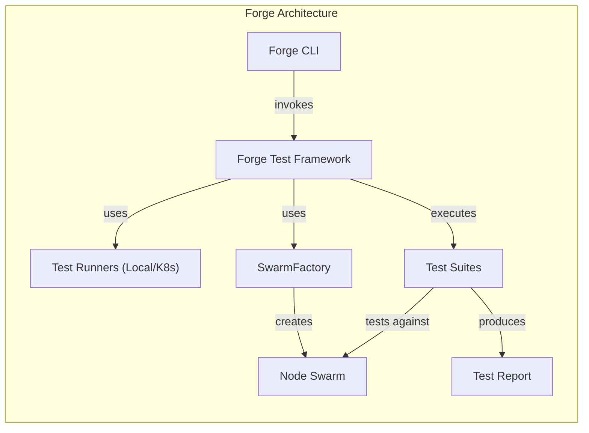

Sources: [testsuite/forge-cli/src/main.rs:1-540](https://github.com/aptos-labs/aptos-core/blob/b9f89a19/testsuite/forge-cli/src/main.rs#L1-L540), [testsuite/forge/src/runner.rs:1-200](https://github.com/aptos-labs/aptos-core/blob/b9f89a19/testsuite/forge/src/runner.rs#L1-L200), [testsuite/forge.py:1-180](https://github.com/aptos-labs/aptos-core/blob/b9f89a19/testsuite/forge.py#L1-L180)

## Forge in the Aptos CI/CD Pipeline

Forge plays a central role in the Aptos CI/CD pipeline, ensuring that changes to the codebase don't negatively impact the system's performance or reliability.

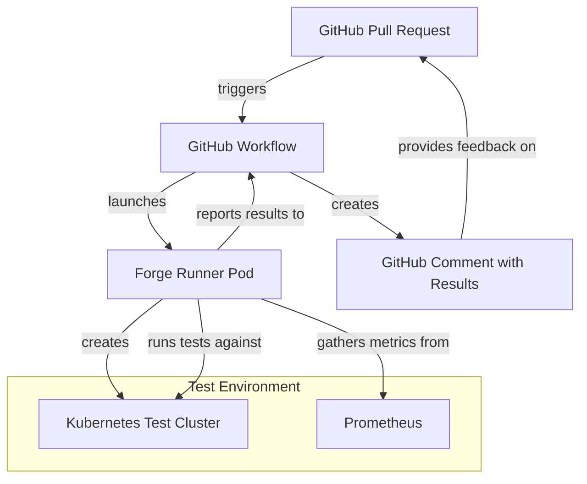

Sources: [.github/workflows/forge-stable.yaml:1-290](https://github.com/aptos-labs/aptos-core/blob/b9f89a19/.github/workflows/forge-stable.yaml#L1-L290), [.github/workflows/forge-unstable.yaml:1-144](https://github.com/aptos-labs/aptos-core/blob/b9f89a19/.github/workflows/forge-unstable.yaml#L1-L144), [.github/workflows/replay-verify.yaml:1-82](https://github.com/aptos-labs/aptos-core/blob/b9f89a19/.github/workflows/replay-verify.yaml#L1-L82)

## Key Components

### Forge CLI

The Forge CLI (`aptos-forge-cli`) is the command-line interface for running Forge tests. It provides commands for creating test environments, running tests, and managing test resources.

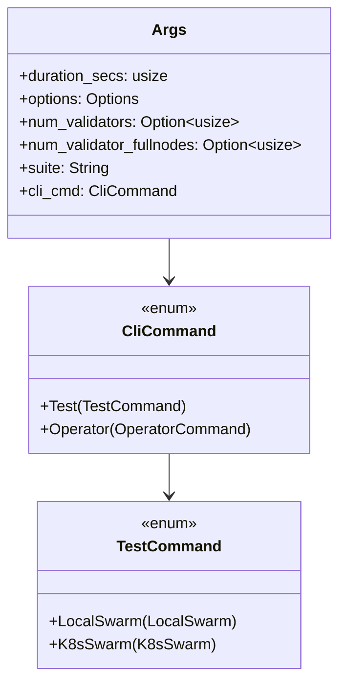

Sources: [testsuite/forge-cli/src/main.rs:43-65](https://github.com/aptos-labs/aptos-core/blob/b9f89a19/testsuite/forge-cli/src/main.rs#L43-L65), [testsuite/forge-cli/src/main.rs:67-75](https://github.com/aptos-labs/aptos-core/blob/b9f89a19/testsuite/forge-cli/src/main.rs#L67-L75), [testsuite/forge-cli/src/main.rs:77-83](https://github.com/aptos-labs/aptos-core/blob/b9f89a19/testsuite/forge-cli/src/main.rs#L77-L83)

### Test Runners

Forge supports two types of test runners:

1. **LocalForgeRunner**: Runs tests locally, primarily for development and debugging.
2. **K8sForgeRunner**: Runs tests in a Kubernetes cluster, which better simulates production environments.

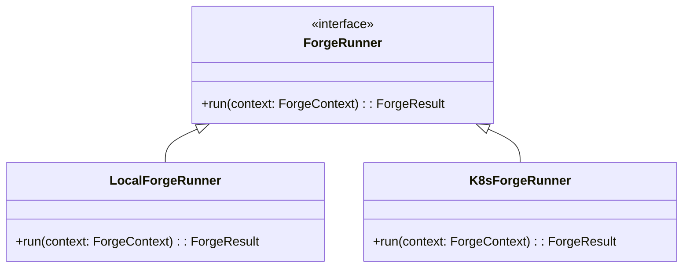

Sources: [testsuite/forge.py:722-792](https://github.com/aptos-labs/aptos-core/blob/b9f89a19/testsuite/forge.py#L722-L792), [testsuite/forge_test.py:180-293](https://github.com/aptos-labs/aptos-core/blob/b9f89a19/testsuite/forge_test.py#L180-L293)

### Test Types

Forge supports several test types, each designed for different testing scenarios:

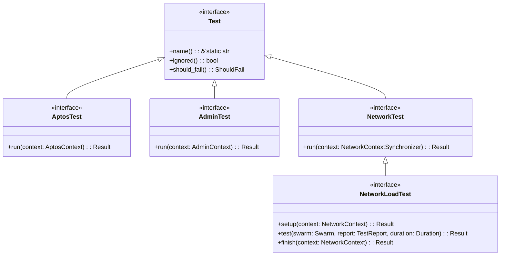

Sources: [testsuite/forge/src/runner.rs:139-169](https://github.com/aptos-labs/aptos-core/blob/b9f89a19/testsuite/forge/src/runner.rs#L139-L169), [testsuite/testcases/src/lib.rs:29-49](https://github.com/aptos-labs/aptos-core/blob/b9f89a19/testsuite/testcases/src/lib.rs#L29-L49), [testsuite/testcases/src/lib.rs:224-246](https://github.com/aptos-labs/aptos-core/blob/b9f89a19/testsuite/testcases/src/lib.rs#L224-L246)

### Swarm

The Swarm represents a collection of Aptos nodes (validators and fullnodes) that form a test network. There are different implementations for local and Kubernetes environments.

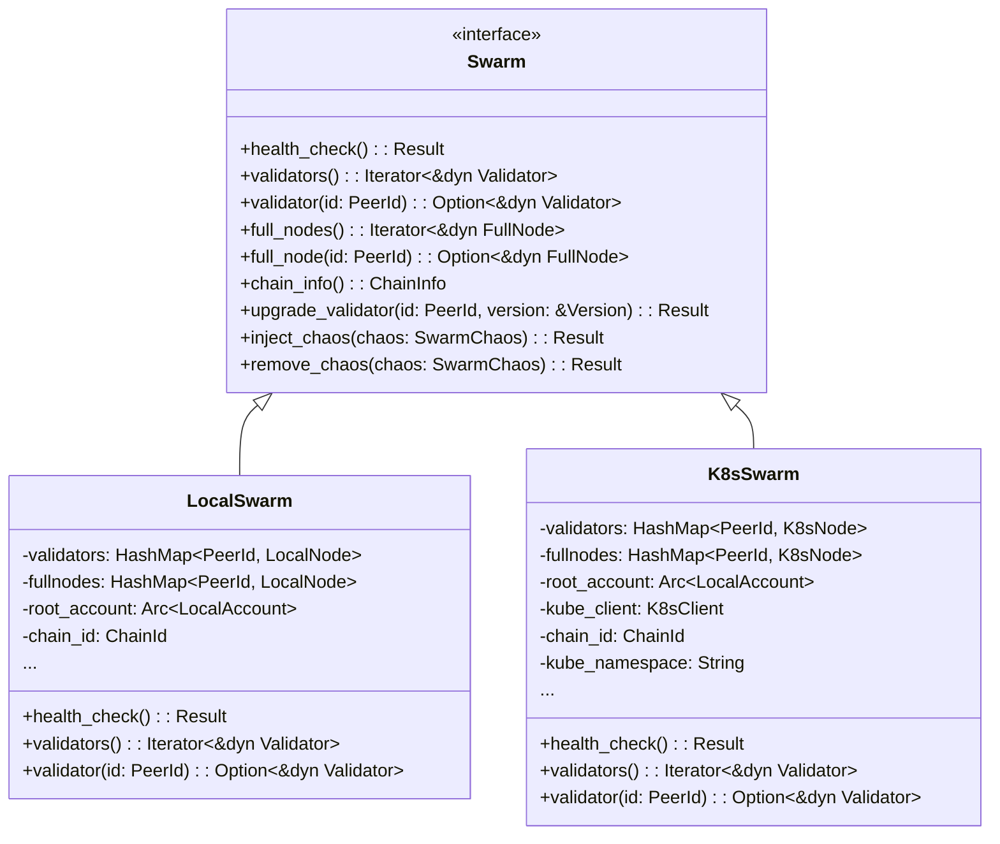

Sources: [testsuite/forge/src/interface/swarm.rs:20-40](https://github.com/aptos-labs/aptos-core/blob/b9f89a19/testsuite/forge/src/interface/swarm.rs#L20-L40), [testsuite/forge/src/backend/local/swarm.rs:43-67](https://github.com/aptos-labs/aptos-core/blob/b9f89a19/testsuite/forge/src/backend/local/swarm.rs#L43-L67), [testsuite/forge/src/backend/k8s/swarm.rs:51-67](https://github.com/aptos-labs/aptos-core/blob/b9f89a19/testsuite/forge/src/backend/k8s/swarm.rs#L51-L67)

## Test Configuration

Tests in Forge are configured using the `ForgeConfig` struct, which defines the test environment, success criteria, and tests to run.

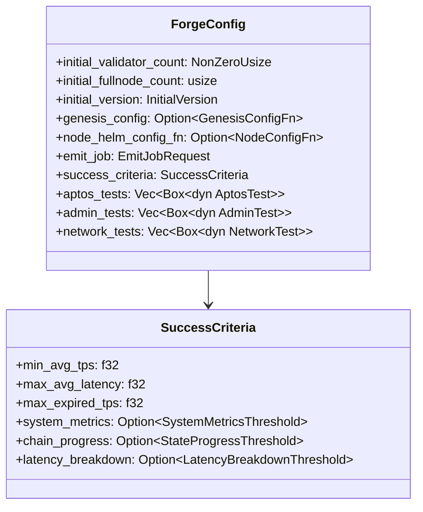

Sources: [testsuite/forge/src/success_criteria.rs:20-26](https://github.com/aptos-labs/aptos-core/blob/b9f89a19/testsuite/forge/src/success_criteria.rs#L20-L26), [testsuite/forge/src/success_criteria.rs:103-124](https://github.com/aptos-labs/aptos-core/blob/b9f89a19/testsuite/forge/src/success_criteria.rs#L103-L124)

### Success Criteria

Success criteria define what makes a test pass or fail, including:

- Minimum average transactions per second (TPS)
- Maximum average latency
- Maximum expired transaction rate
- System metrics thresholds (CPU, memory)
- Chain progress thresholds
- Latency breakdown thresholds

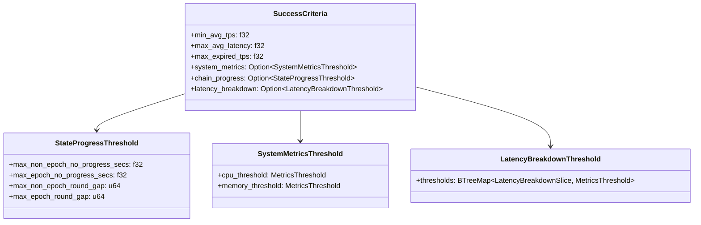

Sources: [testsuite/forge/src/success_criteria.rs:20-26](https://github.com/aptos-labs/aptos-core/blob/b9f89a19/testsuite/forge/src/success_criteria.rs#L20-L26), [testsuite/forge/src/success_criteria.rs:103-124](https://github.com/aptos-labs/aptos-core/blob/b9f89a19/testsuite/forge/src/success_criteria.rs#L103-L124), [testsuite/forge/src/success_criteria.rs:126-133](https://github.com/aptos-labs/aptos-core/blob/b9f89a19/testsuite/forge/src/success_criteria.rs#L126-L133)

## Test Execution Flow

The following diagram illustrates the typical flow of executing a Forge test:

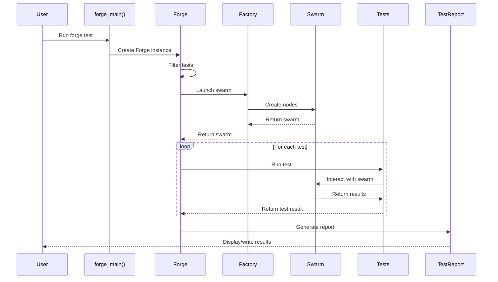

Sources: [testsuite/forge-cli/src/main.rs:234-446](https://github.com/aptos-labs/aptos-core/blob/b9f89a19/testsuite/forge-cli/src/main.rs#L234-L446), [testsuite/forge/src/runner.rs:250-339](https://github.com/aptos-labs/aptos-core/blob/b9f89a19/testsuite/forge/src/runner.rs#L250-L339)

## Running Forge Tests

### Local Testing

To run Forge tests locally:

```bash
cargo run -p aptos-forge-cli -- \
    --suite <test_suite_name> \
    --duration-secs <duration> \
    test local-swarm \
    --swarmdir <optional_directory>
```

The local test runner will:
1. Create a local Aptos swarm in the specified directory
2. Run the test suite against it
3. Report the results

Sources: [testsuite/forge-cli/src/main.rs:96-99](https://github.com/aptos-labs/aptos-core/blob/b9f89a19/testsuite/forge-cli/src/main.rs#L96-L99), [testsuite/forge-cli/src/main.rs:276-292](https://github.com/aptos-labs/aptos-core/blob/b9f89a19/testsuite/forge-cli/src/main.rs#L276-L292)

### Kubernetes Testing

To run Forge tests on Kubernetes:

```bash
cargo run -p aptos-forge-cli -- \
    --suite <test_suite_name> \
    --duration-secs <duration> \
    test k8s-swarm \
    --image-tag <image_tag> \
    --namespace <namespace> \
    --port-forward
```

The Kubernetes test runner will:
1. Create a Kubernetes pod to run the tests
2. Set up a namespace for the Aptos nodes
3. Deploy the nodes using the specified image
4. Run the tests
5. Report the results
6. Clean up the resources (unless --keep is specified)

Sources: [testsuite/forge-cli/src/main.rs:101-152](https://github.com/aptos-labs/aptos-core/blob/b9f89a19/testsuite/forge-cli/src/main.rs#L101-L152), [testsuite/forge-cli/src/main.rs:293-334](https://github.com/aptos-labs/aptos-core/blob/b9f89a19/testsuite/forge-cli/src/main.rs#L293-L334)

## Running Forge in CI/CD

Forge tests are run automatically in GitHub Actions workflows:

1. **forge-stable**: Runs stable tests against the latest main branch
2. **forge-unstable**: Runs unstable tests to test newer features
3. **replay-verify**: Replays transactions on a chain with the latest node software

The workflow creates a Forge pod in Kubernetes, which runs the tests and reports the results.

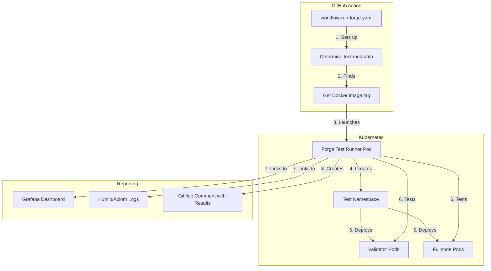

Sources: [.github/workflows/forge-stable.yaml:1-290](https://github.com/aptos-labs/aptos-core/blob/b9f89a19/.github/workflows/forge-stable.yaml#L1-L290), [.github/workflows/forge-unstable.yaml:1-144](https://github.com/aptos-labs/aptos-core/blob/b9f89a19/.github/workflows/forge-unstable.yaml#L1-L144), [testsuite/forge.py:622-646](https://github.com/aptos-labs/aptos-core/blob/b9f89a19/testsuite/forge.py#L622-L646)

## Test Reporting

Forge generates detailed test reports that include:

1. Transaction statistics (TPS, latency, success rate)
2. Chain progress statistics
3. System resource utilization (CPU, memory)
4. Links to monitoring tools (Grafana, Humio/Axiom logs)
5. CPU profiles for performance analysis

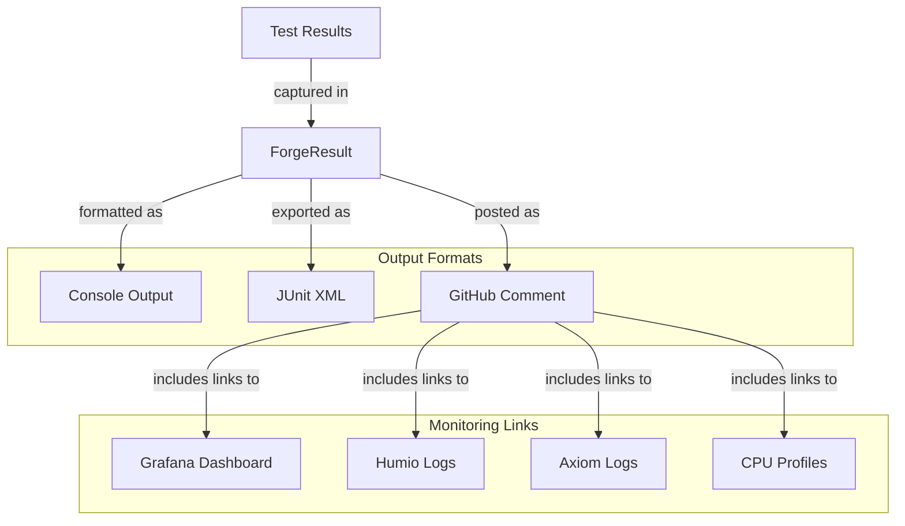

Sources: [testsuite/forge.py:329-373](https://github.com/aptos-labs/aptos-core/blob/b9f89a19/testsuite/forge.py#L329-L373), [testsuite/forge.py:622-692](https://github.com/aptos-labs/aptos-core/blob/b9f89a19/testsuite/forge.py#L622-L692), [testsuite/forge/src/runner.rs:250-339](https://github.com/aptos-labs/aptos-core/blob/b9f89a19/testsuite/forge/src/runner.rs#L250-L339)

## Common Test Suites

Forge includes several pre-defined test suites for various testing scenarios:

1. **Land Blocking Tests**: Essential tests that must pass for a PR to be merged
2. **Performance Tests**: Tests focusing on system performance (TPS, latency)
3. **Realistic Environment Tests**: Tests with realistic network conditions (latency, packet loss)
4. **Consensus Reliability Tests**: Tests for consensus mechanism reliability
5. **Upgrade Tests**: Tests for upgrading nodes between versions
6. **Network Partition Tests**: Tests for network partition tolerance
7. **Changing Working Quorum**: Tests for nodes joining and leaving the validator set

Sources: [.github/workflows/forge-stable.yaml:4-40](https://github.com/aptos-labs/aptos-core/blob/b9f89a19/.github/workflows/forge-stable.yaml#L4-L40), [testsuite/forge-cli/src/main.rs:504-539](https://github.com/aptos-labs/aptos-core/blob/b9f89a19/testsuite/forge-cli/src/main.rs#L504-L539)

## Creating Custom Tests

To create a custom test, implement one of the test traits:

```rust
struct MyCustomTest;

#[async_trait::async_trait]
impl NetworkTest for MyCustomTest {
    async fn run(&self, ctx: NetworkContextSynchronizer<'_>) -> Result<()> {
        // Test implementation here
        Ok(())
    }
}
```

Then add it to a test suite in a function that returns a `ForgeConfig`:

```rust
fn my_test_suite() -> ForgeConfig {
    ForgeConfig::default()
        .with_initial_validator_count(NonZeroUsize::new(5).unwrap())
        .with_initial_fullnode_count(2)
        .with_network_tests(vec![Box::new(MyCustomTest {})])
}
```

Sources: [testsuite/testcases/src/lib.rs:224-246](https://github.com/aptos-labs/aptos-core/blob/b9f89a19/testsuite/testcases/src/lib.rs#L224-L246), [testsuite/forge-cli/src/main.rs:504-539](https://github.com/aptos-labs/aptos-core/blob/b9f89a19/testsuite/forge-cli/src/main.rs#L504-L539)

## Best Practices

When working with Forge, consider these best practices:

1. **Test Duration**: Set an appropriate test duration for your test type:
   - Performance tests: 5-15 minutes
   - Reliability tests: 30+ minutes
   - Upgrade tests: 10+ minutes

2. **Success Criteria**: Define appropriate success criteria for your test:
   - TPS threshold: Based on expected performance for the scenario
   - Latency threshold: Based on acceptable user experience
   - Chain progress: Ensures consensus is making progress

3. **Resource Utilization**: Monitor system resource utilization to catch performance issues:
   - CPU usage
   - Memory usage
   - Network bandwidth

4. **Test Isolation**: Ensure tests are isolated and don't interfere with each other when run in parallel.

5. **Cleanup**: Always clean up test resources, especially in Kubernetes environments.

Sources: [testsuite/forge/src/runner.rs:250-339](https://github.com/aptos-labs/aptos-core/blob/b9f89a19/testsuite/forge/src/runner.rs#L250-L339), [testsuite/forge/src/success_criteria.rs:197-462](https://github.com/aptos-labs/aptos-core/blob/b9f89a19/testsuite/forge/src/success_criteria.rs#L197-L462)

## Conclusion

The Forge Testing Framework is a powerful tool for ensuring the quality and performance of the Aptos blockchain. It provides a comprehensive environment for testing different aspects of the system, from basic functionality to performance under load and reliability under adverse conditions.

By running tests in both local and Kubernetes environments, Forge can validate the behavior of Aptos nodes in environments similar to production. The detailed reporting and integration with monitoring tools makes it easier to diagnose and fix issues that arise during testing.