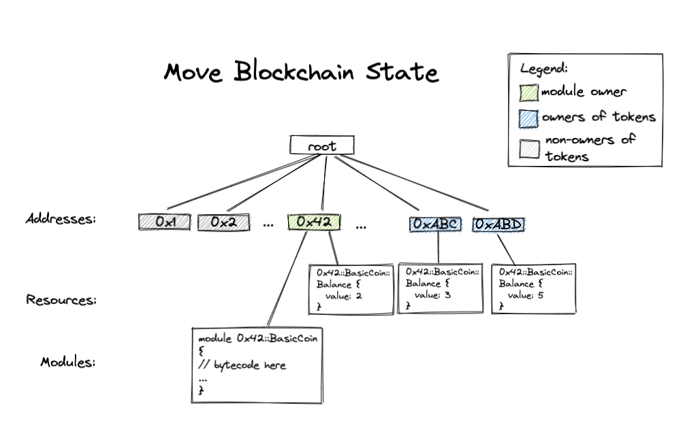
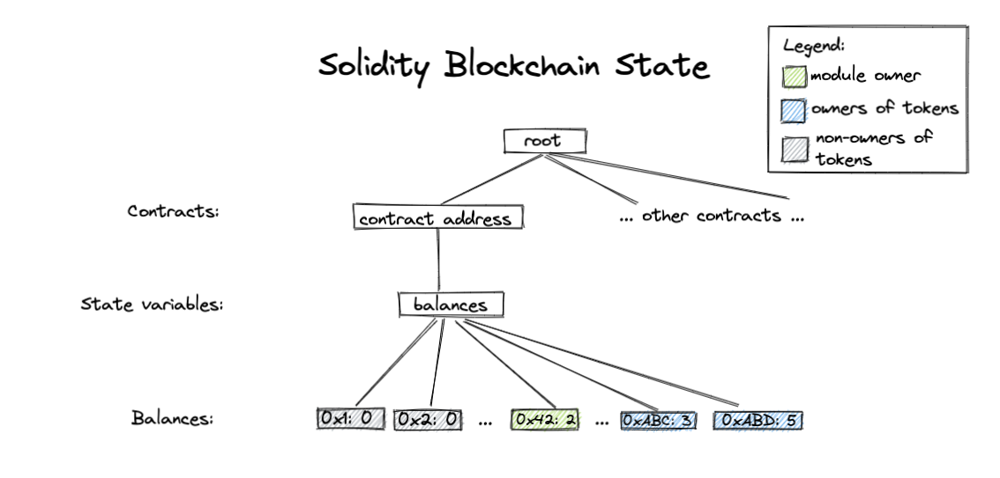

# move-hackathon-tutorial
Move tutorial for the hackathon happening on Dec 7-8

### Step 0
## TODO: use binaries instead

First set $DIEM_HOME environment variable to the path to your diem repo:
```bash
$ export DIEM_HOME=<path_to_diem_repo>
```
- Run the setup script to install Move CLI, Shuffle and dependencies:

```bash
$ sh step_0/setup.sh
```
- Include environment variable definitions in `~/.profile` by running this command:
```bash
$ . ~/.profile
```

Once this is done, you can alias the `move` package command to `mpm`:

```bash
$ alias mpm="${DIEM_HOME}/target/debug/df-cli package"
```

You can check that it is working by running `mpm -h`. You should see
something like this along with a list and description of a number of
commands:

```
move-package 0.1.0
Package and build system for Move code.

USAGE:
    move package [FLAGS] [OPTIONS] <SUBCOMMAND>
...
```

There is official Move support for VSCode, you can install this extension
by opening VSCode and searching for the "move-analyzer" package and
installing it. Detailed instructions can be found
[here](https://github.com/diem/diem/tree/main/language/move-analyzer/editors/code).

### Step 1: Write my first Move module

To create your first Move module, we first need to create a Move package by
calling

```bash
$ mpm new <pkg_name>
```

Now change directory into the package you just created

```bash
$ cd <pkg_name>
```

and look around. You should see a directory called `sources` -- this is the
place where all the Move code for this package will live[1]. You should
also see a `Move.toml` file which specifies dependencies and other
information about this package, we'll explore this in a bit. If you're
familiar with Rust and Cargo, the `Move.toml` file is similar to the
`Cargo.toml` file, and the `sources` directory similar to the `src`
directory.

Let's write some code! Open up `sources/FirstModule.move` in your
editor of choice.

Modules are the building block of Move code, and they always are defined
relative to a specific address -- the address that they can be published
under. So let's start out by defining our first module, and look at the
different parts:

```rust
module NamedAddr::Coin {
}
```

This is defining the module `Coin` that can be published under the [named
address](https://diem.github.io/move/address.html#named-addresses)
`NamedAddr`. Named addresses are a way to parametrize the source
code, so that we can compile this module using different values for
`NamedAddr` to get different bytecode.

Let's now define and assign the named address `NamedAddr` the value `0xDEADBEEF`.
We can do this by opening the `Move.toml` in your favorite editor and adding the
following:

```
[addresses]
NamedAddr = "0xDEADBEEF"
```

Let's now see if it works!

```bash
$ mpm build
```

Let's now define a structure in this module to represent a `Coin` with a
given `value`:

```
module NamedAddr::Coin {
    struct Coin has key {
        value: u64,
    }
}
```

Structures in Move can be given different
[abilities](https://diem.github.io/move/abilities.html) that describe what
can be done with that type. There are four different abilities in Move:
* `copy`: Allows values of types with this ability to be copied.
* `drop`: Allows values of types with this ability to be popped/dropped.
* `store`: Allows values of types with this ability to exist inside a struct in global storage.
* `key`: Allows the type to serve as a key for global storage operations.

So in this module we are saying that the `Coin` struct can be used as a key
in global storage, and because it has no other abilites, it cannot be
copied, dropped, or stored as a non-key value in storage.

We can then add some functions to this module, functions are default
private, and can also be `public`, or `public(script)`. The latter states
that this function can be called from a transaction script.
`public(script)` functions can also be called by other `public(script)`
functions.

Let's check that it can build again

```bash
$ mpm build
```

Let's now add a function that mints coins and stores them under an
account:

```
module NamedAddr::Coin {
    struct Coin has key {
        value: u64,
    }

    public fun mint(account: signer, value: u64) {
        move_to(&account, Coin { value })
    }
}
```

Let's take a look at this function and what it's saying:
* It takes a [`signer`](https://diem.github.io/move/signer.html) -- an
  unforgeable token that represents control over a particular address, and
  a `value` to mint.
* It creates a `Coin` with the given value and stores it under the
  `account` using one of the [five different global storage
  operators](https://diem.github.io/move/global-storage-operators.html)
  `move_to`. This is where the `key` ability is imporant -- we couldn't
  call `move_to` on `Coin` unless it had the `key` ability!

Let's make sure it compiles now:

```bash
$ mpm build
```

### Step 2: Add unit tests to my first Move module

Now that we've written our first Move module, lets write a test to
make sure minting works the way we expect it to.

Unit tests in Move are similar to unit tests in Rust if you're familiar with
them. There are a number of [test-related
annotations that are worth exploring](https://github.com/diem/diem/blob/main/language/changes/4-unit-testing.md#testing-annotations-their-meaning-and-usage).
Unit tests can be run with the `mpm package test` command. We'll see how
they're used shortly.

#### Adding dependencies

Before running unit tests, we need to add a dependency on the Move standard
library. This can be done by adding an entry to the `[dependencies]`
section of the `Move.toml`:

```toml
[dependencies]
MoveStdlib = { local = "../../../../move-stdlib/", addr_subst = { "Std" = "0x1" } }
```

You can read more on Move package dependencies
[here](https://diem.github.io/move/packages.html#movetoml).

Once you've added this to the `Move.toml` file you should be able to run
`mpm test`. You'll see something like this:

```
BUILDING MoveStdlib
BUILDING BasicCoin
Running Move unit tests
Test result: OK. Total tests: 0; passed: 0; failed: 0
```

Let's now add a test to make sure that `BasicCoin::mint(account, 10)`
stores a `Coin` resource with a value of `10` under `account`. We can do
this by adding the following to our `Coin` module:

```
module NamedAddr::Coin {
    // Only included in compilation for testing. Similar to #[cfg(testing)]
    // in Rust.
    #[test_only]
    use Std::Signer;
    ...
    // Declare a unit test. It takes a signer called `account` with an
    // address value of `0xCAFE`.
    #[test(account = @0xCAFE)]
    fun test_mint_10(account: signer) acquires Coin {
        let addr = Signer::address_of(&account);
        mint(account, 10);
        // Make sure there is a `Coin` resource under `addr` with a value of `10`.
        assert!(borrow_global<Coin>(addr).value == 10, 0);
    }
}
```

#### Exercise
* Change the assertion to `11` so that it fails and the test fails. Find a flag that you can
  pass to the `mpm test` command that will show you the global state when
  the test fails. It should look something like this:
  ```
    ┌── test_mint_10 ──────
    │ error[E11001]: test failure
    │    ┌─ step_2/BasicCoin/sources/FirstModule.move:22:9
    │    │
    │ 18 │     fun test_mint_10(account: signer) acquires Coin {
    │    │         ------------ In this function in 0xdeadbeef::Coin
    │    ·
    │ 22 │         assert!(borrow_global<Coin>(addr).value == 11, 0);
    │    │         ^^^^^^^^^^^^^^^^^^^^^^^^^^^^^^^^^^^^^^^^^^^^^^^^^ Test was not expected to abort but it aborted with 0 here
    │
    │
    │ ────── Storage state at point of failure ──────
    │ 0xcafe:
    │       => key 0xdeadbeef::Coin::Coin {
    │           value: 10
    │       }
    │
    └──────────────────
  ```
* [Bonus] Find a flag that allows you to gather test coverage information, and
  then play around with using the `mpm coverage` command to look at
  coverage statistics and source coverage.

### Step 3: Design my BasicCoin module

In this section, we are going to design a module implementing a basic coin and balance interface, where coins can
be minted and transferred between balances under different addresses.

The signatures of the public Move function are the following:

```
/// Publish an empty balance resource under `account`'s address. This function must be called before
/// minting or transferring to the account.
public fun publish_balance(account: &signer);

/// Mint `amount` tokens to `mint_addr`. Mint must be approved by the module owner.
public(script) fun mint(module_owner: signer, mint_addr: address, amount: u64) acquires Balance;

/// Returns the balance of `owner`.
public fun balance_of(owner: address): u64 acquires Balance;

/// Transfers `amount` of tokens from `from` to `to`.
public(script) fun transfer(from: signer, to: address, amount: u64) acquires Balance;
```
At the end of each function signature is an `acquires` list containing all the resources defined in this module accessed by the function.

Notice that `balance_of` is a public function while `transfer` is a _public script_ function.
Similar to Ethereum, users submit signed transactions to Move-powered blockchains to update the blockchain state.
We can invoke `transfer` method in a transaction script to modify the blockchain state. As mentioned in Step 1, only public script
functions can be called from a transaction script. Therefore, we declare `transfer` as a public script function.
And by requiring the `from` argument be a `signer` instead of an `address`, we require that the transfer transaction
must be approved by the `from` account.

Next we look at the data structs we need for this module.

If you are familiar with Ethereum contracts, in most Ethereum contracts, the balance of each address is stored in a _state variable_ of type
`mapping(address => uint256)`. This state variable is stored in the storage of a particular smart contract. In Move, however, storage
works differently. A Move module doesn't have its own storage. Instead, Move "global storage" (what we call our
blockchain state) is indexed by addresses. Under each address there are Move modules (code) and Move resources (values).

The global storage looks roughly like

```
struct GlobalStorage {
    resources: Map<address, Map<ResourceType, ResourceValue>>
    modules: Map<address, Map<ModuleName, ModuleBytecode>>
}
```

The Move resource storage under each address is a map from types to values. (An observant reader might observe that
this means each address can only have one value of each type.) This conveniently provides us a native mapping indexed
by addresses. In our BasicCoin module, we define the following `Balance` resource representing the number of coins
each address holds:

```
/// Struct representing the balance of each address.
struct Balance has key {
    coin: Coin // same Coin from Step 1
}
```

Roughly the Move blockchain state should look like this:



In comparison, a Solidity blockchain state might look like this:


### Step 4: Implement my BasicCoin module

We have created a Move package for you in folder `step_4` called `BasicCoin`. `sources` folder contains source code for
all your Move modules. `BasicCoin.move` lives inside this folder. In this section, we will take a closer look at the
implementation of the methods inside `BasicCoin.move`.

#### Method `public_balance`

This method publishes a `Balance` resource to a given address. Since this resource is needed to receive coins through
minting or transferring, `publish_balance` method must be called by a user before they can receive money, including the
module owner.

This method uses a `move_to` operation to publish the resource:

```
let empty_coin = Coin { value: 0 };
move_to(account, Balance { coin:  empty_coin });
```

#### Method `mint`

`mint` method mints coins to a given account. Here we require that `mint` must be approved
by the module owner. We enforce this using the assert statement:
```
assert!(Signer::address_of(&module_owner) == MODULE_OWNER, Errors::requires_address(ENOT_MODULE_OWNER));
```
Assert statements in Move can be used in this way: `assert!(<predicate>, <abort_code>);`. This means that if the `<predicate>`
is false, then abort the transaction with `<abort_code>`. Here `MODULE_OWNER` and `ENOT_MODULE_OWNER` are both constants
defined at the beginning of the module. And `Errors` module defines common error categories we can use.

We then perform deposit a coin with value `amount` to the balance of `mint_addr`.
```
deposit(mint_addr, Coin { value: amount });
```

#### Method `balance_of`

We use `borrow_global`, one of the global storage operators, to read from the global storage.
```
borrow_global<Balance>(owner).coin.value
                 |       |       \    /
        resource type  address  field names
```

#### Method `transfer`
This function withdraws tokens from `from`'s balance and deposits the tokens into `to`s balance. We take a closer look
at `withdraw` helper function:
```
fun withdraw(addr: address, amount: u64) : Coin acquires Balance {
    let balance = balance_of(addr);
    assert!(balance >= amount, EINSUFFICIENT_BALANCE);
    let balance_ref = &mut borrow_global_mut<Balance>(addr).coin.value;
    *balance_ref = balance - amount;
    Coin { value: amount }
}
```
At the beginning of the method, we assert that the withdrawing account has enough balance. We then use `borrow_global_mut`
to get a mutable reference to the global storage, and `&mut` is used to create a [mutable reference](https://diem.github.io/move/references.html) to a field of a
struct. We then modify the balance through this mutable reference and return a new coin with the withdrawn amount.


### Compiling our code

Now that we have implemented our BasicCoin contract, let's try building it using Move package by running the following command
in `step_4/BasicCoin` folder:
```bash
$ mpm build
```

### Exercises
There are two `TODO`s in our module, left as exercises for the reader:
- Finish implementing `publish_balance` method.
- Implement `deposit` method.

The solution to this exercise can be found in `step_4_sol` folder.

**Bonus exercises**
- What would happen if we deposit too many tokens to a balance?
- Does the solution code provided in `step_4_sol` have any bugs?

### Step 5: Adding and using unit tests with the BasicCoin module

In this step we're going to take a look at all the different unit tests
we've written to cover the code we wrote in step 4. We're also going to
take a look at some tools we can use to help us write tests.

To get started, run `mpm test` in [`step_5`](./step_5). You should see
something like this:

```
CACHED MoveStdlib
BUILDING BasicCoin
Running Move unit tests
[ PASS    ] 0xdeadbeef::BasicCoin::can_withdraw_amount
[ PASS    ] 0xdeadbeef::BasicCoin::init_check_balance
[ PASS    ] 0xdeadbeef::BasicCoin::init_non_owner
[ PASS    ] 0xdeadbeef::BasicCoin::publish_balance_already_exists
[ PASS    ] 0xdeadbeef::BasicCoin::publish_balance_has_zero
[ PASS    ] 0xdeadbeef::BasicCoin::withdraw_dne
[ PASS    ] 0xdeadbeef::BasicCoin::withdraw_too_much
Test result: OK. Total tests: 7; passed: 7; failed: 0
```

Taking a look at the tests in the
[`BasicCoin` module](./step_5/BasicCoin/sources/BasicCoin.move) we've tried
to keep each unit test to testing one particular behavior.

TODO: Explore some tests look at some of the annotations

### Exercises
* Write a unit test called `balance_of_dne` in the BasicCoin module that tests
  the case where a `Balance` resource doesn't exist under the address that
  `balance_of` is being called on.

The solution to this exercise can be found in [`step_5_sol`](./step_5_sol)

### Step 6: Make my BasicCoin module generic

In Move, we can use generics to define functions and structs over different input data types. Generics are a great
building block for library code. In this section, we are going to make our simple Coin module generic so that it can
serve as a library module that can be used by other user modules.

First, we add type parameters to our data structs:
```
struct Coin<phantom CoinType> has store {
    value: u64
}

struct Balance<phantom CoinType> has key {
    coin: Coin<CoinType>
}
```

Here we declare the type parameter `CoinType` to be _phantom_ because `CoinType` is not used in the struct definition
or is only used as a phantom type parameter. There are ability constraints you can add to a type parameter to require
that the type parameter has certain abilities, like `T: copy + drop`. Read more about
[generic](https://diem.github.io/move/generics.html) here.

We also add type parameters to our methods in the same manner. For example, `withdraw` becomes the following:
```
fun withdraw<CoinType>(addr: address, amount: u64) : Coin<CoinType> acquires Balance {
    let balance = balance_of<CoinType>(addr);
    assert!(balance >= amount, EINSUFFICIENT_BALANCE);
    let balance_ref = &mut borrow_global_mut<Balance<CoinType>>(addr).coin.value;
    *balance_ref = balance - amount;
    Coin<CoinType> { value: amount }
}
```
Take a look at `step_6/BasicCoin/sources/BasicCoin.move` to see the full implementation.

At this point, readers who are familiar with Ethereum might notice that this module serves a similar purpose as
the [ERC20 token standard](https://ethereum.org/en/developers/docs/standards/tokens/erc-20/), which provides an
interface for implementing fungible tokens in smart contracts. One key advantage of using generics is the ability
to reuse code since the generic library module already provides a standard implementation and the instantiation module
can provide customizations by wrapping the standard implementation. We provide a little module that instantiates
the Coin type and customizes its transfer policy: only odd number of coins can be transferred.


## Advanced steps

### Step 7: Write formal specifications for my BasicCoin module

The blockchain requires high assurance. Smart contracts deployed on the blockchain may maniputate high-value assets, which are targets of highly-motivated and well-resourced adversaries. Hundreds of millions of dollars have been lost from bugs on other blockchains. As a technique that uses strict mathematical methods to describe behavior and reason correctness of computer systems, formal verification has been used in blockchains to prevent bugs in smart contracts. [The Move prover](https://github.com/diem/diem/tree/main/language/move-prover) is an evolving formal verification tool for smart contracts written in the Move language. It supports complete specification of functional properties of smart contracts. Properties can be verified automatically efficiently (only slightly slower than a linter). Moreover, it can be integrated in the CI system for re-verification after every change to the code base. In this step, we will define the formal specification of the `BasicCoin` module.

The property specification is written in the [Move Specification Language (MSL)](https://github.com/diem/diem/blob/main/language/move-prover/doc/user/spec-lang.md). Developers can provide pre and post conditions for functions, which include conditions over (mutable) parameters and global memory. Developers can also provide invariants over data structures, as well as the (state-dependent) content of the global memory. Universal and existential quantification both over bounded domains (like the indices of a vector) as well of unbounded domains (like all memory addresses, all integers, etc.) are supported. In this tutorial, we will learn how to define functional properties for methods.

#### Method `withdraw`

The signature of the method `withdraw` is given below:
```
fun withdraw<CoinType>(addr: address, amount: u64) : Coin<CoinType> acquires Balance
```

The method withdraws tokens with value `amount` from the address `addr` and returns a created Coin of value `amount`. The specification is defined in the `spec withdraw` block:

```
   spec withdraw {
        // The property of the method withdraw is defined here.
    }
```

For a function, we usually want to define when it aborts, the expected effect on the global memory, and its return value. MSL provides `aborts_if` to define conditions under which the function aborts. The method `withdraw` aborts when 1) `addr` does not have the resource `Balance<CoinType>` or 2) the number of tokens in `addr` is smaller than `amount`. We can define conditions like this:

```
   spec withdraw {
        let balance = global<Balance<CoinType>>(addr).coin.value;
        aborts_if !exists<Balance<CoinType>>(addr);
        aborts_if balance < amount;
    }
```

As we can see here, a spec block can contain let bindings which introduce names for expressions. `global<T>(address): T` is a built-in function that returns the resource value at `addr`. `balance` is the number of tokens owned by `addr`. `exists<T>(address): bool` is a built-in function that returns true if the resource T exists at address. Two `aborts_if` clauses correspond to the two conditions mentioned above. In general, if a function has more than one `aborts_if` condition, those conditions are or-ed with each other. By default, if a user wants to specify aborts conditions, all possible conditions need to be listed. Otherwise, the prover will generate a verification error. However, if `pragma aborts_if_is_partial` is defined in the spec block, the combined aborts condition (the or-ed individual conditions) only *imply* that the function aborts. The reader can refer to the [MSL](https://github.com/diem/diem/blob/main/language/move-prover/doc/user/spec-lang.md) document for more information.

The next step is to define functional properties, which are described in the two `ensures` clauses below. First, by using the `let post` binding, `balance_post` represents the balance of `addr` after the execution, which should be equal to `balance - amount`. Then, the return value (denoted as `result`) should be a coin with value `amount`.

```
   spec withdraw {
        let balance = global<Balance<CoinType>>(addr).coin.value;
        aborts_if !exists<Balance<CoinType>>(addr);
        aborts_if balance < amount;

        let post balance_post = global<Balance<CoinType>>(addr).coin.value;
        ensures balance_post == balance - amount;
        ensures result == Coin<CoinType> { value: amount };
    }
```


#### Method `deposit`


The signature of the method `deposit` is given below:

```
fun deposit<CoinType>(addr: address, check: Coin<CoinType>) acquires Balance
```

The method deposits the `check` into `addr`. The specification is defined below:

```
    spec deposit {
        let balance = global<Balance<CoinType>>(addr).coin.value;
        let check_value = check.value;

        aborts_if !exists<Balance<CoinType>>(addr);
        aborts_if balance + check_value > MAX_U64;

        let post balance_post = global<Balance<CoinType>>(addr).coin.value;
        ensures balance_post == balance + check_value;
    }
```

`balance` represents the number of tokens in `addr` before execution and `check_value` represents the number of tokens to be deposited. The method would abort if 1) `addr` does not have the resource `Balance<CoinType>` or 2) the sum of `balance` and `check_value` is greater than the maxium value of the type `u64`. The functional property checks that the balance is correctly updated after the execution.


#### Method `transfer`

The signature of the method `transfer` is given below:

```
public fun transfer<CoinType: drop>(from: &signer, to: address, amount: u64, _witness: CoinType) acquires Balance
```

The method transfers the `amount` of coin from the account of `from` to the address `to`.

```
spec transfer {
        let addr_from = Signer::address_of(from);

        let balance_from = global<Balance<CoinType>>(addr_from).coin.value;
        let balance_to = global<Balance<CoinType>>(to).coin.value;

        let post balance_from_post = global<Balance<CoinType>>(addr_from).coin.value;
        let post balance_to_post = global<Balance<CoinType>>(to).coin.value;

        ensures addr_from != to ==> balance_from_post == balance_from - amount;
        ensures addr_from != to ==> balance_to_post == balance_to + amount;
        ensures addr_from == to ==> balance_from_post == balance_from;
    }
```

The function `Signer::address_of` is called to obtain the address of `from`. Then the balances of `addr_from` and `to` before and after the execution are obtained. In the three `ensures` clauses, `p ==> q` is used to represented the logical implication between p and q. If the source and the target addresses are the same, the balance remains the same. Otherwise, `amount` is deducted from `addr_from` and added to `to`. The aborts conditions are left as an exercise.


### Exercises
- Implement the aborts_if conditions for the `transfer` method.
- Implement the specification for the `mint` and `publish_balance` method.

The solution to this exercise can be found in `step_7_sol`.

### Step 8: Formally verify my BasicCoin module using Move Prover


We can use the command `mpm -p <path/to/BasicCoin> prove` to prove properties for the BasicCoin module. More prover options can be found [here](https://github.com/diem/diem/blob/main/language/move-prover/doc/user/prover-guide.md).


Footnotes
---------------------------------------------------------------------------
[1] Move code can also live a number of other places, but for more
information on that see the [documentation on Move
packages](https://diem.github.io/move/packages.html).
