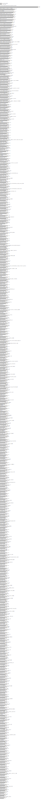

# Benchmarking current vs alternative version of Boogie

This compares the current version of Boogie with a an alternative, newer one

In the current instance, we are comparing Boogie 2.8.31 with the head version in which *zero weights are used for array
axioms*. The comparison uses the new monomorphized Boogie backend. There is a ~10% improvement visible from the
benchmarks. While some verification problems take longer, overall verification time is reduced.

## Module Verification Time

## Function Verification Time

