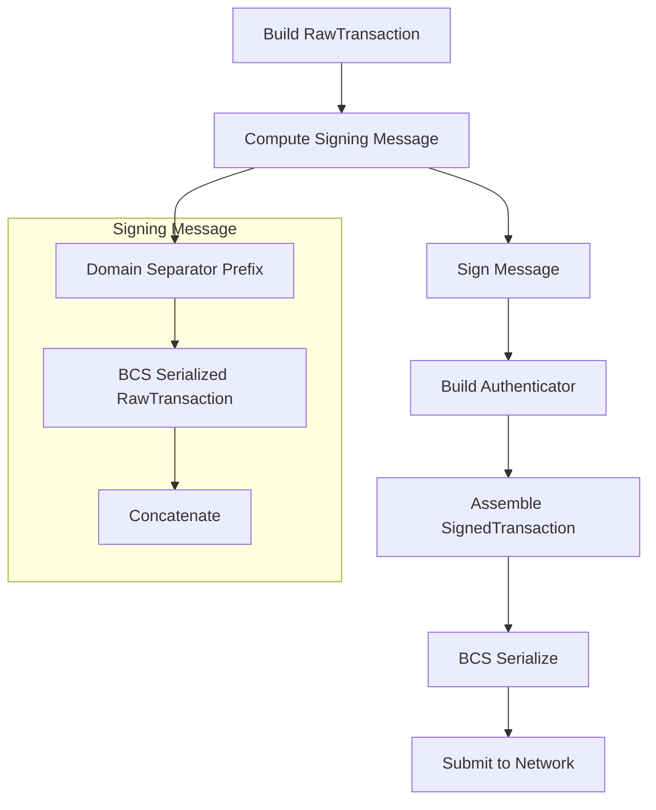

# Aptos Transaction Format and Signing Specifications

> **Version:** 1.0.0  
> **Last Updated:** January 28, 2026  
> **Target Audience:** SDK Developers, Application Integrators, Language Binding Authors

## Overview

This documentation provides comprehensive specifications for building and signing Aptos blockchain transactions. It is designed to enable developers to implement Aptos transaction support in any programming language by providing byte-level details of the Binary Canonical Serialization (BCS) format used by Aptos.

## Prerequisites

Before using this documentation, readers should be familiar with:

- **BCS (Binary Canonical Serialization)**: Aptos uses BCS for all serialization. A separate BCS specification document will be provided for detailed encoding rules.
- **Cryptographic primitives**: Ed25519, ECDSA (secp256k1/secp256r1), SHA3-256
- **Basic blockchain concepts**: Transactions, signatures, addresses

## Document Structure

```
specifications/
├── README.md                              # This file
├── transaction-formats/                   # BCS format specifications
│   ├── 01-raw-transaction.md             # Base RawTransaction structure
│   ├── 02-ed25519-authenticator.md       # Ed25519 authentication format
│   ├── 03-single-key-authenticator.md    # SingleKey (unified) authentication
│   ├── 04-multi-key-authenticator.md     # MultiKey (multi-sig) authentication
│   └── 05-multi-ed25519-authenticator.md # Legacy MultiEd25519 format
├── signing/                               # Signing process documentation
│   ├── 01-transaction-hashing.md         # How to hash transactions for signing
│   ├── 02-ed25519-signing.md             # Ed25519 signing process
│   ├── 03-multi-ed25519-signing.md       # MultiEd25519 signing
│   ├── 04-secp256k1-signing.md           # Secp256k1 ECDSA signing
│   ├── 05-secp256r1-signing.md           # Secp256r1/WebAuthn signing
│   └── 06-keyless-signing.md             # Keyless (OIDC) signing
├── payloads/                              # Transaction payload specifications
│   ├── 01-payload-overview.md            # Payload types comparison
│   ├── 02-entry-function.md              # Entry function payload
│   ├── 03-script-payload.md              # Script payload
│   └── 04-move-types.md                  # TypeTag, ModuleId, StructTag encoding
├── advanced/                              # Advanced transaction types
│   ├── 01-multi-agent-transactions.md    # Multi-signer transactions
│   ├── 02-fee-payer-transactions.md      # Sponsored transactions
│   ├── 03-multisig-transactions.md       # On-chain multisig
│   ├── 04-gas-estimation.md              # Gas estimation and selection
│   ├── 05-sequence-numbers.md            # Sequence number management
│   ├── 06-orderless-transactions.md      # Nonce-based replay protection
│   └── 07-transaction-lifecycle.md       # Submission and confirmation
└── api/                                   # REST API specifications
    ├── 01-api-overview.md                # API basics, headers, errors
    ├── 02-accounts-api.md                # Account, resource, module queries
    ├── 03-transactions-api.md            # Transaction submission and querying
    ├── 04-events-api.md                  # Event retrieval
    └── 05-view-functions.md              # Read-only function calls
```

## Quick Reference

### Chain IDs

| Network | Chain ID (u8) | Description |
|---------|---------------|-------------|
| Mainnet | `1` | Production network |
| Testnet | `2` | Test network |
| Devnet | `3` | Development network (ID may vary) |
| Local | `4` | Local testing |

### Authentication Schemes

| Scheme | ID (u8) | Description |
|--------|---------|-------------|
| Ed25519 | `0` | Single Ed25519 signature |
| MultiEd25519 | `1` | K-of-N Ed25519 multisig |
| SingleKey | `2` | Unified single-key (supports multiple algorithms) |
| MultiKey | `3` | Unified multi-key (supports multiple algorithms) |
| Abstraction | `4` | Account abstraction |

### Supported Key Types in SingleKey/MultiKey

| Key Type | Variant Index | Description |
|----------|---------------|-------------|
| Ed25519 | `0` | Ed25519 public key |
| Secp256k1Ecdsa | `1` | Secp256k1 ECDSA public key |
| Secp256r1Ecdsa | `2` | Secp256r1 ECDSA public key (WebAuthn) |
| Keyless | `3` | OIDC-based keyless authentication |
| FederatedKeyless | `4` | Federated keyless authentication |

### Transaction Authenticator Variants

| Variant | Index | Use Case |
|---------|-------|----------|
| Ed25519 | `0` | Simple Ed25519 signed transaction |
| MultiEd25519 | `1` | Legacy multi-sig transaction |
| MultiAgent | `2` | Multiple signers transaction |
| FeePayer | `3` | Sponsored transaction with fee payer |
| SingleSender | `4` | Modern single-sender transaction |

### Transaction Payload Types

| Variant | Index | Use Case |
|---------|-------|----------|
| Script | `0` | Execute custom Move bytecode |
| ModuleBundle | `1` | Deprecated |
| EntryFunction | `2` | Call existing module function (most common) |
| Multisig | `3` | Execute as multisig account |
| Payload (V1) | `4` | New format with extra config (orderless) |

## Transaction Lifecycle



## Common Data Types

### AccountAddress
- **Size**: 32 bytes (fixed)
- **Format**: 256-bit value, typically displayed as hex with `0x` prefix
- **Derivation**: Last 32 bytes of `AuthenticationKey`

### AuthenticationKey
- **Size**: 32 bytes (fixed)
- **Derivation**: `SHA3-256(public_key_bytes || scheme_id)`

### Sequence Number
- **Type**: `u64` (8 bytes, little-endian)
- **Purpose**: Replay protection, must match on-chain account sequence

### Gas Parameters
- **max_gas_amount**: `u64` - Maximum gas units for transaction
- **gas_unit_price**: `u64` - Price per gas unit in Octas (1 APT = 10^8 Octas)

### Expiration
- **Type**: `u64` - Unix timestamp in seconds
- **Validation**: Transaction rejected if current time ≥ expiration

## Constants

```
MAX_NUM_OF_SIGS = 32                    // Maximum signatures per transaction
ED25519_PUBLIC_KEY_LENGTH = 32          // Ed25519 public key size
ED25519_SIGNATURE_LENGTH = 64           // Ed25519 signature size
SECP256K1_PUBLIC_KEY_LENGTH = 65        // Uncompressed secp256k1 public key
SECP256R1_PUBLIC_KEY_LENGTH = 65        // Uncompressed secp256r1 public key
MULTI_ED25519_BITMAP_LENGTH = 4         // Bitmap for multi-ed25519
```

## Reading Order

For new implementers, we recommend reading in this order:

### Core Transaction Building
1. **[Transaction Hashing](signing/01-transaction-hashing.md)** - Understand the signing message format
2. **[Raw Transaction Format](transaction-formats/01-raw-transaction.md)** - Core transaction structure
3. **[Payload Overview](payloads/01-payload-overview.md)** - Understanding payload types
4. **[Entry Function Payload](payloads/02-entry-function.md)** - Most common payload type
5. **[Move Types](payloads/04-move-types.md)** - TypeTag and argument encoding
6. **[Ed25519 Authenticator](transaction-formats/02-ed25519-authenticator.md)** - Simplest authentication
7. **[Ed25519 Signing](signing/02-ed25519-signing.md)** - Basic signing process

### Transaction Submission
5. **[API Overview](api/01-api-overview.md)** - REST API basics and error handling
6. **[Transactions API](api/03-transactions-api.md)** - Submitting and querying transactions
7. **[Gas Estimation](advanced/04-gas-estimation.md)** - How to set gas parameters
8. **[Sequence Numbers](advanced/05-sequence-numbers.md)** - Replay protection basics
9. **[Transaction Lifecycle](advanced/07-transaction-lifecycle.md)** - Submission and confirmation

### Querying State
10. **[Accounts API](api/02-accounts-api.md)** - Account and resource queries
11. **[View Functions](api/05-view-functions.md)** - Read-only function execution
12. **[Events API](api/04-events-api.md)** - Event retrieval

### Advanced Topics
Continue with other formats and advanced topics as needed based on your use case.

## Test Vectors

Each specification document includes test vectors with:
- Known inputs (private keys, transaction data)
- Expected outputs (serialized bytes, signatures)
- Step-by-step intermediate values

Test vectors are generated from the Aptos core codebase to ensure accuracy.

## Version Compatibility

This specification covers the transaction format as of Aptos Core version compatible with mainnet. Future versions may introduce new authenticator types or transaction formats while maintaining backward compatibility.

## Contributing

If you find errors or have suggestions for improvement, please submit issues or pull requests to the Aptos Core repository.

## License

This documentation is part of the Aptos Core project and is licensed under the Apache License 2.0.
