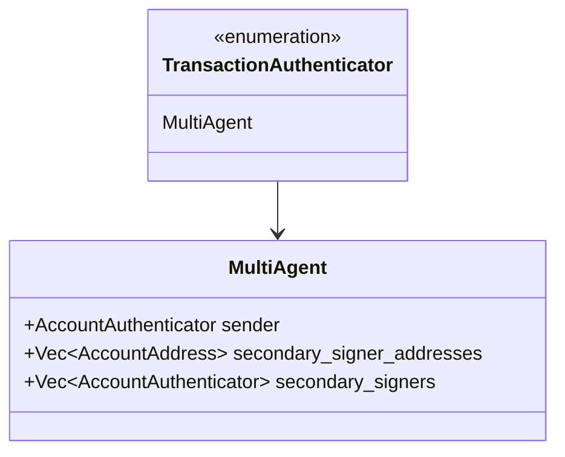
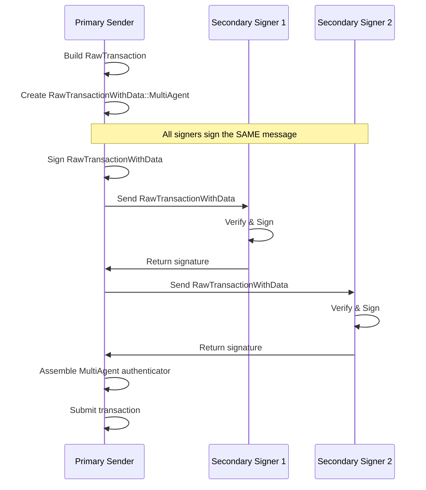

# Multi-Agent Transaction Specification

> **Version:** 1.0.0  
> **Status:** Stable  
> **Last Updated:** January 28, 2026

## Overview

Multi-agent transactions allow multiple independent signers to authorize a single transaction. Unlike multi-signature (where multiple keys control one account), multi-agent involves multiple accounts each providing their own signature.

## Use Cases

- **Atomic swaps**: Both parties sign to exchange assets
- **Collaborative actions**: Multiple parties approve an action together
- **Resource access**: A signer grants access to another signer's resources

## Structure Definition



### RawTransactionWithData::MultiAgent

```
┌─────────────────────────────────────────────────────────────────┐
│              RawTransactionWithData::MultiAgent                  │
├─────────────────────────────────────────────────────────────────┤
│ Field                        │ Type                             │
├──────────────────────────────┼──────────────────────────────────┤
│ variant_index                │ ULEB128 (0 = MultiAgent)         │
│ raw_txn                      │ RawTransaction                   │
│ secondary_signer_addresses   │ Vec<AccountAddress>              │
└─────────────────────────────────────────────────────────────────┘
```

## Signing Process



## What Each Signer Signs

**All signers sign the same message:**

```
signing_message = RawTransactionWithData_seed || BCS(RawTransactionWithData::MultiAgent)
```

This includes:
- The full `RawTransaction`
- The list of `secondary_signer_addresses`

## Code Examples

### Rust

```rust
use aptos_types::{
    account_address::AccountAddress,
    transaction::{
        authenticator::{AccountAuthenticator, TransactionAuthenticator},
        RawTransaction, RawTransactionWithData, SignedTransaction,
    },
};
use aptos_crypto::ed25519::{Ed25519PrivateKey, Ed25519PublicKey};

/// Build and sign a multi-agent transaction
fn build_multi_agent_transaction(
    raw_txn: RawTransaction,
    sender_private_key: &Ed25519PrivateKey,
    secondary_signers: Vec<(AccountAddress, &Ed25519PrivateKey)>,
) -> SignedTransaction {
    let sender_public_key = Ed25519PublicKey::from(sender_private_key);
    
    // Extract secondary addresses
    let secondary_addresses: Vec<AccountAddress> = 
        secondary_signers.iter().map(|(addr, _)| *addr).collect();
    
    // Create the message that ALL signers will sign
    let message = RawTransactionWithData::new_multi_agent(
        raw_txn.clone(),
        secondary_addresses.clone(),
    );
    
    // Primary sender signs
    let sender_sig = sender_private_key.sign(&message).unwrap();
    let sender_auth = AccountAuthenticator::ed25519(sender_public_key, sender_sig);
    
    // Each secondary signer signs the SAME message
    let secondary_auths: Vec<AccountAuthenticator> = secondary_signers
        .iter()
        .map(|(_, sk)| {
            let pk = Ed25519PublicKey::from(*sk);
            let sig = sk.sign(&message).unwrap();
            AccountAuthenticator::ed25519(pk, sig)
        })
        .collect();
    
    // Build the multi-agent authenticator
    let authenticator = TransactionAuthenticator::multi_agent(
        sender_auth,
        secondary_addresses,
        secondary_auths,
    );
    
    SignedTransaction::new_signed_transaction(raw_txn, authenticator)
}
```

### Python

```python
import hashlib
from dataclasses import dataclass
from typing import List, Tuple
from nacl.signing import SigningKey

@dataclass
class MultiAgentBuilder:
    """Builder for multi-agent transactions."""
    
    def create_signing_message(
        self,
        raw_txn_bcs: bytes,
        secondary_signer_addresses: List[bytes]  # List of 32-byte addresses
    ) -> bytes:
        """
        Create the message that all signers must sign.
        
        This is BCS(RawTransactionWithData::MultiAgent)
        """
        # Build RawTransactionWithData::MultiAgent
        txn_with_data = self._build_raw_txn_with_data(
            raw_txn_bcs,
            secondary_signer_addresses
        )
        
        # Create signing message with domain separator
        seed = self._compute_seed("APTOS::RawTransactionWithData")
        return seed + txn_with_data
    
    def _build_raw_txn_with_data(
        self,
        raw_txn_bcs: bytes,
        secondary_addresses: List[bytes]
    ) -> bytes:
        """BCS serialize RawTransactionWithData::MultiAgent."""
        result = bytearray()
        
        # Variant index (MultiAgent = 0)
        result.append(0x00)
        
        # RawTransaction (already BCS serialized)
        result.extend(raw_txn_bcs)
        
        # Vec<AccountAddress> secondary_signer_addresses
        result.extend(self._uleb128_encode(len(secondary_addresses)))
        for addr in secondary_addresses:
            result.extend(addr)  # 32 bytes each
        
        return bytes(result)
    
    def _compute_seed(self, type_name: str) -> bytes:
        inner = hashlib.sha3_256(type_name.encode()).digest()
        return hashlib.sha3_256(inner + b"APTOS::").digest()
    
    def _uleb128_encode(self, value: int) -> bytes:
        result = []
        while value >= 0x80:
            result.append((value & 0x7F) | 0x80)
            value >>= 7
        result.append(value)
        return bytes(result)
    
    def build_authenticator(
        self,
        sender_auth: bytes,
        secondary_addresses: List[bytes],
        secondary_auths: List[bytes]
    ) -> bytes:
        """
        Build TransactionAuthenticator::MultiAgent.
        """
        result = bytearray()
        
        # Variant index (MultiAgent = 2)
        result.append(0x02)
        
        # sender AccountAuthenticator
        result.extend(sender_auth)
        
        # secondary_signer_addresses
        result.extend(self._uleb128_encode(len(secondary_addresses)))
        for addr in secondary_addresses:
            result.extend(addr)
        
        # secondary_signers
        result.extend(self._uleb128_encode(len(secondary_auths)))
        for auth in secondary_auths:
            result.extend(auth)
        
        return bytes(result)


def example_multi_agent_flow():
    """Example: Two-party multi-agent transaction."""
    
    # Generate keys for sender and secondary signer
    sender_sk = SigningKey.generate()
    secondary_sk = SigningKey.generate()
    
    sender_addr = bytes(32)  # Would be derived from public key
    secondary_addr = bytes(32)  # Would be derived from public key
    
    builder = MultiAgentBuilder()
    
    # Example raw transaction (placeholder)
    raw_txn_bcs = bytes(100)
    
    # Create the signing message
    signing_message = builder.create_signing_message(
        raw_txn_bcs,
        [secondary_addr]
    )
    
    # Both signers sign the SAME message
    sender_sig = sender_sk.sign(signing_message).signature
    secondary_sig = secondary_sk.sign(signing_message).signature
    
    print(f"Signing message length: {len(signing_message)}")
    print(f"Sender signature: {sender_sig.hex()}")
    print(f"Secondary signature: {secondary_sig.hex()}")


if __name__ == "__main__":
    example_multi_agent_flow()
```

### TypeScript

```typescript
import * as nacl from 'tweetnacl';
import { sha3_256 } from '@noble/hashes/sha3';

class MultiAgentBuilder {
  /**
   * Create the message that all signers must sign.
   */
  createSigningMessage(
    rawTxnBcs: Uint8Array,
    secondarySignerAddresses: Uint8Array[] // 32-byte addresses
  ): Uint8Array {
    const txnWithData = this.buildRawTxnWithData(rawTxnBcs, secondarySignerAddresses);
    const seed = this.computeSeed('APTOS::RawTransactionWithData');

    const result = new Uint8Array(seed.length + txnWithData.length);
    result.set(seed);
    result.set(txnWithData, seed.length);
    return result;
  }

  private buildRawTxnWithData(
    rawTxnBcs: Uint8Array,
    secondaryAddresses: Uint8Array[]
  ): Uint8Array {
    const parts: Uint8Array[] = [];

    // Variant index (MultiAgent = 0)
    parts.push(new Uint8Array([0x00]));

    // RawTransaction
    parts.push(rawTxnBcs);

    // Vec<AccountAddress>
    parts.push(this.uleb128Encode(secondaryAddresses.length));
    for (const addr of secondaryAddresses) {
      parts.push(addr);
    }

    return this.concat(parts);
  }

  private computeSeed(typeName: string): Uint8Array {
    const encoder = new TextEncoder();
    const inner = sha3_256(encoder.encode(typeName));
    const suffix = encoder.encode('APTOS::');
    const combined = new Uint8Array(inner.length + suffix.length);
    combined.set(inner);
    combined.set(suffix, inner.length);
    return sha3_256(combined);
  }

  private uleb128Encode(value: number): Uint8Array {
    const result: number[] = [];
    while (value >= 0x80) {
      result.push((value & 0x7f) | 0x80);
      value >>>= 7;
    }
    result.push(value);
    return new Uint8Array(result);
  }

  /**
   * Build TransactionAuthenticator::MultiAgent.
   */
  buildAuthenticator(
    senderAuth: Uint8Array,
    secondaryAddresses: Uint8Array[],
    secondaryAuths: Uint8Array[]
  ): Uint8Array {
    const parts: Uint8Array[] = [];

    // Variant index (MultiAgent = 2)
    parts.push(new Uint8Array([0x02]));

    // sender AccountAuthenticator
    parts.push(senderAuth);

    // secondary_signer_addresses
    parts.push(this.uleb128Encode(secondaryAddresses.length));
    for (const addr of secondaryAddresses) {
      parts.push(addr);
    }

    // secondary_signers
    parts.push(this.uleb128Encode(secondaryAuths.length));
    for (const auth of secondaryAuths) {
      parts.push(auth);
    }

    return this.concat(parts);
  }

  private concat(arrays: Uint8Array[]): Uint8Array {
    const totalLength = arrays.reduce((sum, arr) => sum + arr.length, 0);
    const result = new Uint8Array(totalLength);
    let offset = 0;
    for (const arr of arrays) {
      result.set(arr, offset);
      offset += arr.length;
    }
    return result;
  }
}

// Example usage
function exampleMultiAgentFlow() {
  const senderKeyPair = nacl.sign.keyPair();
  const secondaryKeyPair = nacl.sign.keyPair();

  const builder = new MultiAgentBuilder();

  // Example addresses (derived from public keys in practice)
  const secondaryAddr = new Uint8Array(32);

  // Example raw transaction
  const rawTxnBcs = new Uint8Array(100);

  // Create signing message
  const signingMessage = builder.createSigningMessage(rawTxnBcs, [secondaryAddr]);

  // Both sign the SAME message
  const senderSig = nacl.sign.detached(signingMessage, senderKeyPair.secretKey);
  const secondarySig = nacl.sign.detached(signingMessage, secondaryKeyPair.secretKey);

  console.log('Signing message length:', signingMessage.length);
  console.log('Sender signature:', Buffer.from(senderSig).toString('hex'));
  console.log('Secondary signature:', Buffer.from(secondarySig).toString('hex'));
}

export { MultiAgentBuilder };
```

## BCS Layout

### TransactionAuthenticator::MultiAgent

```
┌─────────────────────────────────────────────────────────────────┐
│            TransactionAuthenticator::MultiAgent                  │
├─────────────────────────────────────────────────────────────────┤
│ Offset │ Size     │ Field                                       │
├────────┼──────────┼─────────────────────────────────────────────┤
│ 0      │ 1        │ variant_index (2 = MultiAgent)              │
│ 1      │ Variable │ sender (AccountAuthenticator)               │
│ ...    │ Variable │ secondary_signer_addresses (Vec<Address>)   │
│ ...    │ Variable │ secondary_signers (Vec<AccountAuthenticator>)│
└─────────────────────────────────────────────────────────────────┘
```

## Important Notes

1. **Same Message**: All signers (sender and secondary) sign the **exact same** `RawTransactionWithData::MultiAgent`

2. **Address Order**: Secondary addresses in the signature must match the order in `secondary_signer_addresses`

3. **Signature Types**: Secondary signers can use any supported signature type (Ed25519, SingleKey, MultiKey, etc.)

4. **Move Side**: The Move function receives all signers and can use their capabilities

## Validation Rules

1. **Address Match**: Each secondary signer's derived address must match the corresponding entry in `secondary_signer_addresses`

2. **Signature Count**: Number of `secondary_signers` must equal number of `secondary_signer_addresses`

3. **Valid Signatures**: All signatures must verify against the `RawTransactionWithData::MultiAgent` message

## Related Documents

- [Transaction Hashing](../signing/01-transaction-hashing.md) - Signing message construction
- [Fee Payer Transactions](02-fee-payer-transactions.md) - Sponsored variant
- [Ed25519 Signing](../signing/02-ed25519-signing.md) - Signing process
