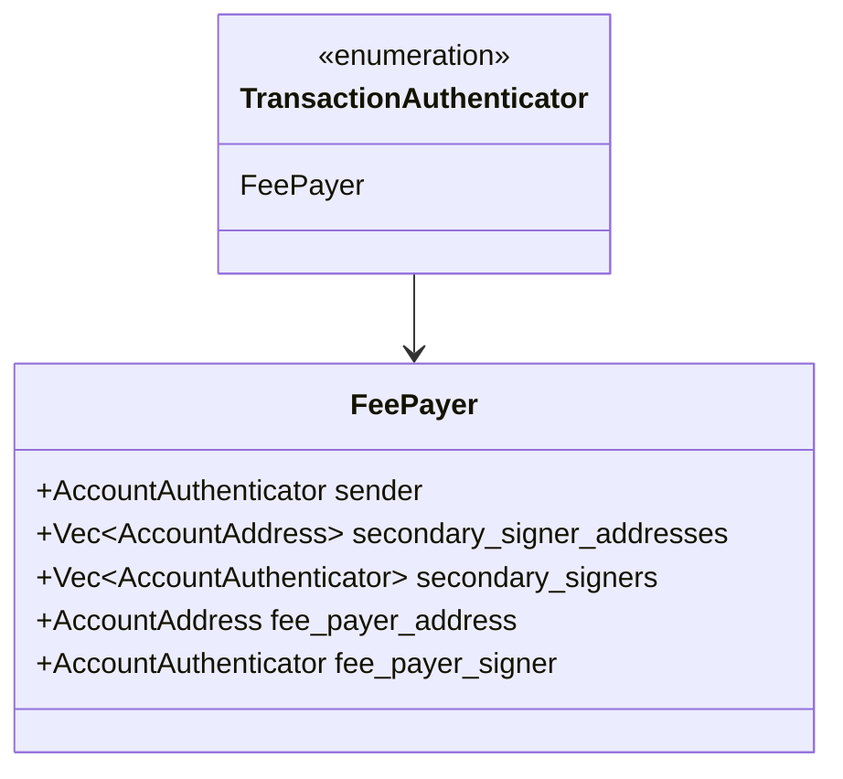
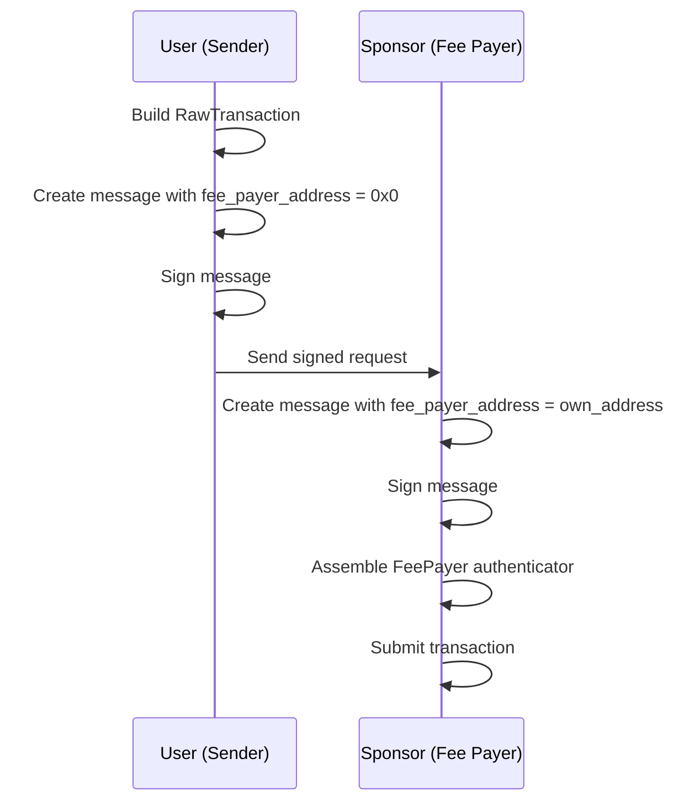
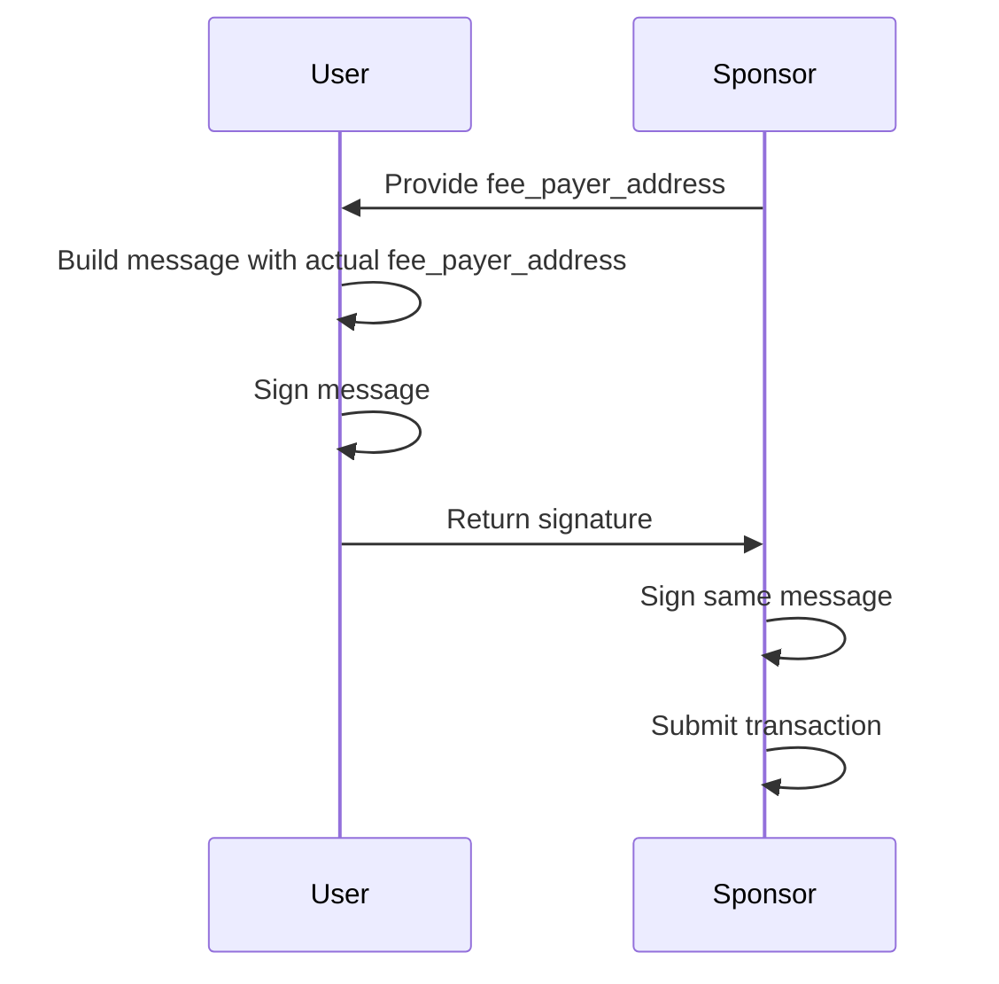
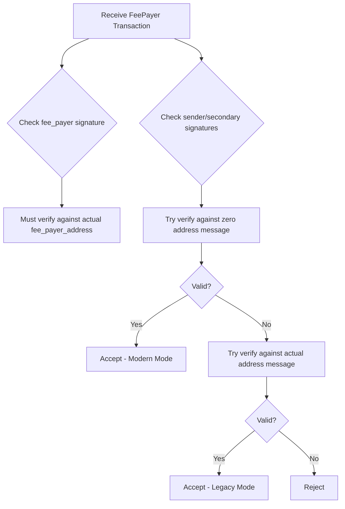

# Fee Payer (Sponsored) Transaction Specification

> **Version:** 1.0.0  
> **Status:** Stable  
> **Last Updated:** January 28, 2026

## Overview

Fee payer transactions allow a third party (the "fee payer" or "sponsor") to pay for another user's transaction gas fees. This enables gasless experiences for end users while maintaining full security.

## Use Cases

- **User onboarding**: New users without APT can still transact
- **dApp subsidies**: Applications pay gas for their users
- **Enterprise sponsorship**: Companies cover employee transaction costs
- **NFT minting**: Sponsors pay for users to mint

## Structure Definition



### RawTransactionWithData::MultiAgentWithFeePayer

```
┌─────────────────────────────────────────────────────────────────┐
│         RawTransactionWithData::MultiAgentWithFeePayer           │
├─────────────────────────────────────────────────────────────────┤
│ Field                        │ Type                             │
├──────────────────────────────┼──────────────────────────────────┤
│ variant_index                │ ULEB128 (1 = FeePayer)           │
│ raw_txn                      │ RawTransaction                   │
│ secondary_signer_addresses   │ Vec<AccountAddress>              │
│ fee_payer_address            │ AccountAddress                   │
└─────────────────────────────────────────────────────────────────┘
```

## Two Signing Modes

### Mode 1: Modern (Zero Address)

The sender signs with `fee_payer_address = 0x0` (before knowing who will sponsor):



### Mode 2: Legacy (Known Fee Payer)

All signers sign with the actual `fee_payer_address`:



## Code Examples

### Rust

```rust
use aptos_types::{
    account_address::AccountAddress,
    transaction::{
        authenticator::{AccountAuthenticator, TransactionAuthenticator},
        RawTransaction, RawTransactionWithData, SignedTransaction,
    },
};
use aptos_crypto::ed25519::{Ed25519PrivateKey, Ed25519PublicKey};

/// Build a fee payer transaction (modern mode)
fn build_fee_payer_transaction(
    raw_txn: RawTransaction,
    sender_private_key: &Ed25519PrivateKey,
    secondary_signers: Vec<(AccountAddress, &Ed25519PrivateKey)>,
    fee_payer_private_key: &Ed25519PrivateKey,
    fee_payer_address: AccountAddress,
) -> SignedTransaction {
    let sender_public_key = Ed25519PublicKey::from(sender_private_key);
    let fee_payer_public_key = Ed25519PublicKey::from(fee_payer_private_key);
    
    let secondary_addresses: Vec<AccountAddress> = 
        secondary_signers.iter().map(|(addr, _)| *addr).collect();
    
    // Message for sender (fee_payer_address = 0x0)
    let user_message = RawTransactionWithData::new_fee_payer(
        raw_txn.clone(),
        secondary_addresses.clone(),
        AccountAddress::ZERO,  // User doesn't know fee payer yet
    );
    
    // Sender signs
    let sender_sig = sender_private_key.sign(&user_message).unwrap();
    let sender_auth = AccountAuthenticator::ed25519(sender_public_key, sender_sig);
    
    // Secondary signers sign user_message
    let secondary_auths: Vec<AccountAuthenticator> = secondary_signers
        .iter()
        .map(|(_, sk)| {
            let pk = Ed25519PublicKey::from(*sk);
            let sig = sk.sign(&user_message).unwrap();
            AccountAuthenticator::ed25519(pk, sig)
        })
        .collect();
    
    // Message for fee payer (with actual fee_payer_address)
    let fee_payer_message = RawTransactionWithData::new_fee_payer(
        raw_txn.clone(),
        secondary_addresses.clone(),
        fee_payer_address,
    );
    
    // Fee payer signs
    let fee_payer_sig = fee_payer_private_key.sign(&fee_payer_message).unwrap();
    let fee_payer_auth = AccountAuthenticator::ed25519(
        fee_payer_public_key,
        fee_payer_sig
    );
    
    // Build FeePayer authenticator
    let authenticator = TransactionAuthenticator::fee_payer(
        sender_auth,
        secondary_addresses,
        secondary_auths,
        fee_payer_address,
        fee_payer_auth,
    );
    
    SignedTransaction::new_signed_transaction(raw_txn, authenticator)
}
```

### Python

```python
import hashlib
from dataclasses import dataclass
from typing import List, Optional
from nacl.signing import SigningKey

@dataclass
class FeePayerBuilder:
    """Builder for fee payer (sponsored) transactions."""
    
    def create_user_signing_message(
        self,
        raw_txn_bcs: bytes,
        secondary_addresses: List[bytes]
    ) -> bytes:
        """
        Create signing message for sender (with fee_payer_address = 0x0).
        
        This allows the user to sign without knowing who will sponsor.
        """
        return self.create_signing_message(
            raw_txn_bcs,
            secondary_addresses,
            bytes(32)  # AccountAddress::ZERO
        )
    
    def create_fee_payer_signing_message(
        self,
        raw_txn_bcs: bytes,
        secondary_addresses: List[bytes],
        fee_payer_address: bytes
    ) -> bytes:
        """
        Create signing message for fee payer (with actual address).
        """
        return self.create_signing_message(
            raw_txn_bcs,
            secondary_addresses,
            fee_payer_address
        )
    
    def create_signing_message(
        self,
        raw_txn_bcs: bytes,
        secondary_addresses: List[bytes],
        fee_payer_address: bytes
    ) -> bytes:
        """Create the signing message."""
        txn_with_data = self._build_raw_txn_with_data(
            raw_txn_bcs,
            secondary_addresses,
            fee_payer_address
        )
        seed = self._compute_seed("APTOS::RawTransactionWithData")
        return seed + txn_with_data
    
    def _build_raw_txn_with_data(
        self,
        raw_txn_bcs: bytes,
        secondary_addresses: List[bytes],
        fee_payer_address: bytes
    ) -> bytes:
        """BCS serialize RawTransactionWithData::MultiAgentWithFeePayer."""
        result = bytearray()
        
        # Variant index (MultiAgentWithFeePayer = 1)
        result.append(0x01)
        
        # RawTransaction
        result.extend(raw_txn_bcs)
        
        # secondary_signer_addresses
        result.extend(self._uleb128_encode(len(secondary_addresses)))
        for addr in secondary_addresses:
            result.extend(addr)
        
        # fee_payer_address (32 bytes)
        result.extend(fee_payer_address)
        
        return bytes(result)
    
    def _compute_seed(self, type_name: str) -> bytes:
        inner = hashlib.sha3_256(type_name.encode()).digest()
        return hashlib.sha3_256(inner + b"APTOS::").digest()
    
    def _uleb128_encode(self, value: int) -> bytes:
        result = []
        while value >= 0x80:
            result.append((value & 0x7F) | 0x80)
            value >>= 7
        result.append(value)
        return bytes(result)
    
    def build_authenticator(
        self,
        sender_auth: bytes,
        secondary_addresses: List[bytes],
        secondary_auths: List[bytes],
        fee_payer_address: bytes,
        fee_payer_auth: bytes
    ) -> bytes:
        """Build TransactionAuthenticator::FeePayer."""
        result = bytearray()
        
        # Variant index (FeePayer = 3)
        result.append(0x03)
        
        # sender AccountAuthenticator
        result.extend(sender_auth)
        
        # secondary_signer_addresses
        result.extend(self._uleb128_encode(len(secondary_addresses)))
        for addr in secondary_addresses:
            result.extend(addr)
        
        # secondary_signers
        result.extend(self._uleb128_encode(len(secondary_auths)))
        for auth in secondary_auths:
            result.extend(auth)
        
        # fee_payer_address
        result.extend(fee_payer_address)
        
        # fee_payer_signer
        result.extend(fee_payer_auth)
        
        return bytes(result)


def example_fee_payer_flow():
    """
    Example: User signs without knowing sponsor,
    then sponsor adds their signature.
    """
    # Keys
    user_sk = SigningKey.generate()
    sponsor_sk = SigningKey.generate()
    
    user_addr = bytes(32)     # Derived from user's public key
    sponsor_addr = bytes(32)  # Derived from sponsor's public key
    # Set a non-zero sponsor address for the example
    sponsor_addr = bytes([0x01] + [0] * 31)
    
    builder = FeePayerBuilder()
    
    # Example raw transaction
    raw_txn_bcs = bytes(100)
    
    # Step 1: User signs with fee_payer_address = 0x0
    user_message = builder.create_user_signing_message(raw_txn_bcs, [])
    user_sig = user_sk.sign(user_message).signature
    print(f"User signed (with zero fee payer)")
    
    # Step 2: Sponsor signs with their actual address
    sponsor_message = builder.create_fee_payer_signing_message(
        raw_txn_bcs, 
        [], 
        sponsor_addr
    )
    sponsor_sig = sponsor_sk.sign(sponsor_message).signature
    print(f"Sponsor signed (with actual address)")
    
    # Messages are different!
    print(f"User message hash: {hashlib.sha3_256(user_message).hexdigest()[:16]}...")
    print(f"Sponsor message hash: {hashlib.sha3_256(sponsor_message).hexdigest()[:16]}...")


if __name__ == "__main__":
    example_fee_payer_flow()
```

### TypeScript

```typescript
import * as nacl from 'tweetnacl';
import { sha3_256 } from '@noble/hashes/sha3';

const ZERO_ADDRESS = new Uint8Array(32);

class FeePayerBuilder {
  /**
   * Create signing message for sender (fee_payer_address = 0x0).
   */
  createUserSigningMessage(
    rawTxnBcs: Uint8Array,
    secondaryAddresses: Uint8Array[]
  ): Uint8Array {
    return this.createSigningMessage(rawTxnBcs, secondaryAddresses, ZERO_ADDRESS);
  }

  /**
   * Create signing message for fee payer (with actual address).
   */
  createFeePayerSigningMessage(
    rawTxnBcs: Uint8Array,
    secondaryAddresses: Uint8Array[],
    feePayerAddress: Uint8Array
  ): Uint8Array {
    return this.createSigningMessage(rawTxnBcs, secondaryAddresses, feePayerAddress);
  }

  private createSigningMessage(
    rawTxnBcs: Uint8Array,
    secondaryAddresses: Uint8Array[],
    feePayerAddress: Uint8Array
  ): Uint8Array {
    const txnWithData = this.buildRawTxnWithData(
      rawTxnBcs,
      secondaryAddresses,
      feePayerAddress
    );
    const seed = this.computeSeed('APTOS::RawTransactionWithData');
    return this.concat([seed, txnWithData]);
  }

  private buildRawTxnWithData(
    rawTxnBcs: Uint8Array,
    secondaryAddresses: Uint8Array[],
    feePayerAddress: Uint8Array
  ): Uint8Array {
    const parts: Uint8Array[] = [];

    // Variant index (MultiAgentWithFeePayer = 1)
    parts.push(new Uint8Array([0x01]));

    // RawTransaction
    parts.push(rawTxnBcs);

    // secondary_signer_addresses
    parts.push(this.uleb128Encode(secondaryAddresses.length));
    for (const addr of secondaryAddresses) {
      parts.push(addr);
    }

    // fee_payer_address
    parts.push(feePayerAddress);

    return this.concat(parts);
  }

  private computeSeed(typeName: string): Uint8Array {
    const encoder = new TextEncoder();
    const inner = sha3_256(encoder.encode(typeName));
    const suffix = encoder.encode('APTOS::');
    return sha3_256(this.concat([inner, suffix]));
  }

  /**
   * Build TransactionAuthenticator::FeePayer.
   */
  buildAuthenticator(
    senderAuth: Uint8Array,
    secondaryAddresses: Uint8Array[],
    secondaryAuths: Uint8Array[],
    feePayerAddress: Uint8Array,
    feePayerAuth: Uint8Array
  ): Uint8Array {
    const parts: Uint8Array[] = [];

    // Variant (FeePayer = 3)
    parts.push(new Uint8Array([0x03]));

    // sender
    parts.push(senderAuth);

    // secondary_signer_addresses
    parts.push(this.uleb128Encode(secondaryAddresses.length));
    for (const addr of secondaryAddresses) {
      parts.push(addr);
    }

    // secondary_signers
    parts.push(this.uleb128Encode(secondaryAuths.length));
    for (const auth of secondaryAuths) {
      parts.push(auth);
    }

    // fee_payer_address
    parts.push(feePayerAddress);

    // fee_payer_signer
    parts.push(feePayerAuth);

    return this.concat(parts);
  }

  private uleb128Encode(value: number): Uint8Array {
    const result: number[] = [];
    while (value >= 0x80) {
      result.push((value & 0x7f) | 0x80);
      value >>>= 7;
    }
    result.push(value);
    return new Uint8Array(result);
  }

  private concat(arrays: Uint8Array[]): Uint8Array {
    const totalLength = arrays.reduce((sum, arr) => sum + arr.length, 0);
    const result = new Uint8Array(totalLength);
    let offset = 0;
    for (const arr of arrays) {
      result.set(arr, offset);
      offset += arr.length;
    }
    return result;
  }
}

export { FeePayerBuilder, ZERO_ADDRESS };
```

## Verification Logic

The verifier checks signatures against BOTH modes:



## BCS Layout

### TransactionAuthenticator::FeePayer

```
┌─────────────────────────────────────────────────────────────────┐
│               TransactionAuthenticator::FeePayer                 │
├─────────────────────────────────────────────────────────────────┤
│ Offset │ Size     │ Field                                       │
├────────┼──────────┼─────────────────────────────────────────────┤
│ 0      │ 1        │ variant_index (3 = FeePayer)                │
│ 1      │ Variable │ sender (AccountAuthenticator)               │
│ ...    │ Variable │ secondary_signer_addresses (Vec<Address>)   │
│ ...    │ Variable │ secondary_signers (Vec<AccountAuthenticator>)│
│ ...    │ 32       │ fee_payer_address (AccountAddress)          │
│ ...    │ Variable │ fee_payer_signer (AccountAuthenticator)     │
└─────────────────────────────────────────────────────────────────┘
```

## Security Considerations

1. **Fee Payer Authorization**: Fee payer's signature authorizes spending their gas
2. **No Asset Access**: Fee payer cannot access sender's assets
3. **Replay Protection**: Sequence number is from sender's account
4. **Transaction Scope**: Fee payer only commits to pay gas, not transaction outcome

## Validation Rules

1. **Fee Payer Signature**: Must verify against message with actual `fee_payer_address`
2. **Sender Signature**: Must verify against either zero or actual `fee_payer_address`
3. **Gas Deduction**: Gas is deducted from `fee_payer_address`
4. **Sequence Number**: Uses sender's sequence number

## Related Documents

- [Multi-Agent Transactions](01-multi-agent-transactions.md) - Base multi-signer format
- [Transaction Hashing](../signing/01-transaction-hashing.md) - Signing message construction
- [Ed25519 Signing](../signing/02-ed25519-signing.md) - Signing process
